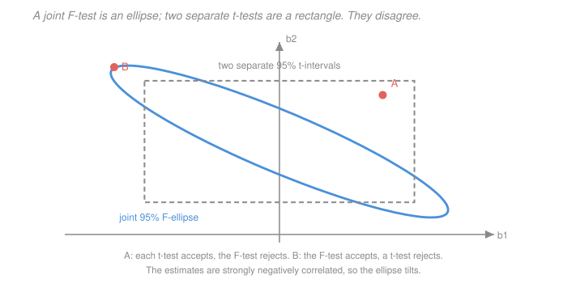

# Econometrics · Lesson 2.3: Hypothesis tests and confidence intervals

> ⏱ ~15 min · Module 2: Inference and asymptotics · Builds on: [2.1 (the sampling distribution of OLS)](02-01-sampling-distribution-of-ols.md), [2.2 (consistency and asymptotic normality)](02-02-consistency-and-asymptotic-normality.md), [`prob-stat-refresher` 4.3 (hypothesis testing)](../../prob-stat-refresher/lessons/04-03-hypothesis-testing.md) · Unlocks: 2.4 (robust standard errors), 2.7 (multiple testing)

## Why this matters

A regression table is a wall of coefficients, standard errors and stars. This lesson is about reading it without being fooled — and the two mistakes that matter most are structural, not arithmetic.

The first is treating a set of separate $t$-tests as if it were a test of the joint hypothesis. It is not, and the geometry of why is worth seeing once. The second is reading a $p$-value as the probability the null is true, which it emphatically is not, and which quietly powers a lot of bad empirical work.

## The idea

A test is a **decision rule with a controlled error rate**. You pick how often you are willing to reject a true null (the size, conventionally 5 percent), and the critical value is whatever threshold delivers that rate.

A confidence interval is the *same object read backwards*: the set of null values you would not reject. That is not an analogy — it is a definition, and it is why "the interval excludes zero" and "the test rejects zero" are the same sentence. Building the interval by inverting the test is the right mental order, because it generalises to cases where there is no simple estimate-plus-or-minus formula ([2.6](02-06-bootstrap-and-few-clusters.md) and [3.8](03-08-weak-instruments-and-late.md) both need it).

For several restrictions at once you need a distance measure in several dimensions, and the natural one accounts for the fact that coefficient estimates are *correlated*. That is what turns a rectangle into an ellipse.

## The formal version

**Single restriction.** To test $H_0: \beta_j = c$ against a two-sided alternative, form
$$t = \frac{\hat\beta_j - c}{\mathrm{se}(\hat\beta_j)} .$$
Under GM1–GM5 this is exactly $t_{n-k}$ ([2.1](02-01-sampling-distribution-of-ols.md)); under A1–A4 it is asymptotically $\mathcal N(0,1)$ ([2.2](02-02-consistency-and-asymptotic-normality.md)). Reject when $|t|$ exceeds the critical value $c_\alpha$.

**Confidence interval by inversion.** The set of $c$ not rejected is
$$\Bigl\{c : \bigl|\hat\beta_j - c\bigr| \le c_\alpha\,\mathrm{se}(\hat\beta_j)\Bigr\} = \bigl[\hat\beta_j - c_\alpha\mathrm{se},\ \hat\beta_j + c_\alpha\mathrm{se}\bigr] .$$
*In words:* the familiar formula is not a separate construction — it is the acceptance region of the $t$-test, solved for $c$.

The **coverage** statement is about the interval, not the parameter: over repeated samples, 95 percent of the intervals you construct will contain the true $\beta_j$. Any single realised interval either contains it or does not; there is no probability left once the data are in.

**Multiple restrictions.** Write $q$ linear restrictions as $H_0: R\beta = r$ with $R$ a $q\times k$ matrix of rank $q$. The **Wald statistic** is
$$W = (R\hat\beta - r)'\bigl[R\,\widehat{\operatorname{Var}}(\hat\beta)\,R'\bigr]^{-1}(R\hat\beta - r) .$$
*In words:* the squared distance from $R\hat\beta$ to $r$, measured in units of the estimator's own covariance — a Mahalanobis distance. The inverse covariance in the middle is what makes correlated estimates count once rather than twice.

Under $H_0$, $W\xrightarrow{d}\chi^2_q$. Under GM1–GM5 the finite-sample version is $F = W/q \sim F_{q,\,n-k}$ exactly. For $q=1$, $W = t^2$ and $F = t^2$: the $F$-test of a single restriction *is* the squared $t$-test, so they never disagree.

**The equivalent RSS form.** Under homoskedasticity only,
$$F = \frac{(\mathrm{RSS}_r - \mathrm{RSS}_u)/q}{\mathrm{RSS}_u/(n-k)} ,$$
comparing the residual sum of squares from the restricted and unrestricted models. This is the version that appears in textbooks and the one to *avoid* under heteroskedasticity — it has GM4 baked in, whereas the Wald form works with any $\widehat{\operatorname{Var}}$, including the robust ones of [2.4](02-04-heteroskedasticity-robust-standard-errors.md).

**$p$-values.** The $p$-value is $P(\text{a statistic at least as extreme as observed}\mid H_0\text{ true})$. It is a statement about the *data given the null*, never about the null given the data. A $p$-value of $0.03$ does not mean a 3 percent chance the null holds; computing that would need a prior, which is a different exercise.

## Picture

Both regions are 95 percent regions, and neither contains the other. Point $A$ passes both individual $t$-tests but fails the joint $F$-test; point $B$ does the reverse. The ellipse tilts because the two coefficient estimates are strongly negatively correlated — the data can pin down their *sum* well while pinning down neither separately. That is the multicollinearity picture from [1.5](01-05-goodness-of-fit-interpretation.md), drawn.

## Worked examples

**Example 1 (mechanical): an $F$-test from two RSS values.** A wage regression with $n = 500$ and $k=8$ has $\mathrm{RSS}_u = 240.0$. Imposing that the four industry dummies are jointly zero gives $\mathrm{RSS}_r = 262.8$. Test the joint restriction.

Here $q=4$ and $n-k = 492$:
$$F = \frac{(262.8-240.0)/4}{240.0/492} = \frac{22.8/4}{0.487805} = \frac{5.7}{0.487805} = 11.6851 .$$
The 5 percent critical value for $F_{4,492}$ is about $2.390$, so reject decisively: industry matters jointly. Equivalently, $qF = 46.74$ against $\chi^2_4$ with critical value $9.488$ — same conclusion.

Note what this test does **not** tell you: which industry, or how much. A rejected joint null says "not all zero", nothing more.

**Example 2 (why you'd care): jointly significant, individually not.** A regression includes both "years of education" and "years of schooling completed", which are nearly the same variable, measured slightly differently. Suppose
$$\hat\beta_1 = 0.041 \ (\mathrm{se}\ 0.038), \qquad \hat\beta_2 = 0.037\ (\mathrm{se}\ 0.036), \qquad \widehat{\operatorname{Corr}}(\hat\beta_1,\hat\beta_2) = -0.97 .$$
Individually: $t_1 = 1.079$, $t_2 = 1.028$. Neither is close to significant. A naive reader concludes education does not matter.

Now test $H_0:\beta_1=\beta_2=0$ jointly. With $\sigma_1 = 0.038$, $\sigma_2=0.036$, $\rho = -0.97$, the covariance is $\sigma_{12} = -0.97(0.038)(0.036) = -0.00132696$, so
$$V = \begin{pmatrix} 0.001444 & -0.00132696 \\ -0.00132696 & 0.001296\end{pmatrix}, \qquad \det V = 1.87142\times10^{-6}-1.76083\times 10^{-6} = 1.10601\times10^{-7} .$$
The Wald statistic is $\hat\beta'V^{-1}\hat\beta = 73.97$ — against a $\chi^2_2$ critical value of $5.991$, an emphatic rejection.

The resolution is not paradoxical. The data say clearly that *education matters*; they cannot say how to split the credit between two near-identical measures. The sum is well determined — indeed $\hat\beta_1+\hat\beta_2 = 0.078$ with
$$\mathrm{se} = \sqrt{0.001444+0.001296+2(-0.00132696)} = \sqrt{0.00008608} = 0.009278 ,$$
so $t = 0.078/0.009278 = 8.41$ on the sum. **When regressors are collinear, test and report the combination the data can actually identify**, not the individual coefficients.

## Watch out

- **You might think** two overlapping 95 percent confidence intervals mean the difference is insignificant — **but actually** this is wrong, and commonly so. Two estimates can have overlapping intervals while the interval for their *difference* excludes zero. Test the difference directly; you need its standard error, which requires the covariance between the two estimates.
- **You might think** failing to reject means the null is true — **but actually** it means the data cannot distinguish the null from the alternative. An interval of $[-8, 9]$ and an interval of $[-0.01, 0.02]$ both "fail to reject zero", and only the second is evidence of a small effect. **Report the interval, not the star.**
- **You might think** a $p$-value of $0.049$ and one of $0.051$ mean different things — **but actually** the 5 percent threshold is a convention with no scientific content, and treating it as a cliff is what produces the bunching of published $p$-values just below $0.05$ that [2.7](02-07-multiple-testing-specification-search.md) examines.

## One-liner

> A confidence interval is the set of nulls a test would not reject, and a joint $F$-test is a Mahalanobis distance rather than a stack of $t$-tests — which is why correlated coefficients can be jointly decisive and individually silent.

## Problems

**P1 (🟢)** A regression with $n=200$, $k=5$ has $\mathrm{RSS}_u = 90.0$. Dropping two regressors gives $\mathrm{RSS}_r = 97.8$. Compute the $F$-statistic and test at 5 percent (the critical value for $F_{2,195}$ is $3.042$). Then compute the equivalent $\chi^2$ form and confirm the conclusion agrees.

**P2 (🟡)** Two coefficients are $\hat\beta_1 = 3.0$ ($\mathrm{se}\ 1.0$) and $\hat\beta_2 = 6.0$ ($\mathrm{se}\ 1.2$), with $\widehat{\operatorname{Cov}}(\hat\beta_1,\hat\beta_2) = 0.9$. Their individual 95 percent intervals overlap. Test $H_0:\beta_1=\beta_2$ and explain why the two facts are compatible.

**P3 (🔴, optional)** Show that for a single restriction the $F$-statistic equals $t^2$, working from the Wald form. Then explain geometrically why the joint 95 percent region for two coefficients is an ellipse rather than a rectangle, and why the ellipse's tilt is determined by the sign of $\widehat{\operatorname{Cov}}(\hat\beta_1,\hat\beta_2)$.

Solutions

**P1** With $q=2$ restrictions and $n-k = 195$:
$$F = \frac{(\mathrm{RSS}_r-\mathrm{RSS}_u)/q}{\mathrm{RSS}_u/(n-k)} = \frac{(97.8-90.0)/2}{90.0/195} = \frac{3.9}{0.461538} = 8.45 .$$
Since $8.45 > 3.042$, **reject** at 5 percent: the two regressors are jointly significant.

*Chi-square form.* $W = qF = 2(8.45) = 16.90$, compared against $\chi^2_2$ with 5 percent critical value $5.991$. Also reject, same conclusion. The two agree because $F_{q,n-k}\to \chi^2_q/q$ as $n-k\to\infty$, and with 195 degrees of freedom the approximation is close: $2\times 3.042 = 6.084$ against the exact $\chi^2$ value $5.991$, a difference of about 1.5 percent in the critical value.

**P2** *Individual intervals.* $3.0 \pm 1.96(1.0) = [1.04, 4.96]$ and $6.0\pm 1.96(1.2) = [3.648, 8.352]$. These overlap on $[3.648, 4.96]$.

*Test of the difference.* Let $\theta = \beta_1-\beta_2$, so $\hat\theta = 3.0-6.0 = -3.0$ and
$$\operatorname{Var}(\hat\theta) = \operatorname{Var}(\hat\beta_1)+\operatorname{Var}(\hat\beta_2) - 2\operatorname{Cov}(\hat\beta_1,\hat\beta_2) = 1.00 + 1.44 - 2(0.9) = 2.44 - 1.8 = 0.64 ,$$
so $\mathrm{se}(\hat\theta) = 0.8$ and
$$t = \frac{-3.0 - 0}{0.8} = -3.75 .$$
Since $|{-3.75}| > 1.96$, **reject** $H_0:\beta_1=\beta_2$ at 5 percent. The 95 percent interval for the difference is $-3.0\pm 1.96(0.8) = [-4.568, -1.432]$, comfortably excluding zero.

*Why compatible.* The overlap heuristic implicitly assumes the two estimates are independent, in which case $\operatorname{Var}(\hat\theta) = 1.00+1.44 = 2.44$ and $\mathrm{se} = 1.562$, giving $t = -1.92$ — just short of significance. But the estimates here are **positively correlated** ($\operatorname{Corr} = 0.9/(1.0\times 1.2) = 0.75$), and positive correlation means the two estimates tend to err in the *same direction*, so their difference is measured much more precisely than either level. The covariance term subtracts $1.8$ from the variance, shrinking the standard error from $1.562$ to $0.8$.

The general moral: the overlap rule is not conservative or liberal in a predictable way — it is simply the wrong calculation, and it ignores the one number ($\operatorname{Cov}$) that determines the answer.

**P3** *$F = t^2$ for one restriction.* Take $q=1$, so $R$ is a $1\times k$ row vector $R = e_j'$ (selecting coefficient $j$) and $r = c$ is a scalar. Then $R\hat\beta - r = \hat\beta_j - c$ is scalar, and $R\widehat{\operatorname{Var}}(\hat\beta)R' = \widehat{\operatorname{Var}}(\hat\beta_j) = \mathrm{se}(\hat\beta_j)^2$ is a positive scalar whose inverse is just a reciprocal. So
$$W = (\hat\beta_j-c)\cdot\frac{1}{\mathrm{se}(\hat\beta_j)^2}\cdot(\hat\beta_j-c) = \left(\frac{\hat\beta_j-c}{\mathrm{se}(\hat\beta_j)}\right)^2 = t^2 ,$$
and $F = W/1 = t^2$. Consistently, $t_{n-k}^2 \sim F_{1,n-k}$ as distributions, so the two tests have identical critical values and identical $p$-values. They cannot disagree.

*Why an ellipse.* The acceptance region is $\{b : (\hat\beta - b)'V^{-1}(\hat\beta-b)\le c_\alpha\}$ where $V = \widehat{\operatorname{Var}}(\hat\beta)$. The left side is a positive definite quadratic form in $b$, and the level set of a positive definite quadratic form is by definition an ellipse (an ellipsoid in higher dimensions). Two separate intervals instead give $\{b : |b_1-\hat\beta_1|\le c\,\mathrm{se}_1\}\cap\{b:|b_2-\hat\beta_2|\le c\,\mathrm{se}_2\}$, a Cartesian product of intervals — a rectangle. A rectangle is the level set of the $\max$ norm, not of a quadratic form, and it ignores $\operatorname{Cov}$ entirely.

*Why the tilt follows the covariance sign.* The ellipse's axes are the eigenvectors of $V$. For a $2\times 2$ covariance matrix with variances $\sigma_1^2,\sigma_2^2$ and covariance $\sigma_{12}$, the principal axis makes an angle $\theta$ with the horizontal given by
$$\tan(2\theta) = \frac{2\sigma_{12}}{\sigma_1^2-\sigma_2^2} .$$
When $\sigma_{12}>0$ the ellipse's long axis runs from lower-left to upper-right (the estimates err together, so points where both are simultaneously high are plausible); when $\sigma_{12}<0$ it runs from upper-left to lower-right, as in the figure. When $\sigma_{12}=0$ the axes are the coordinate axes and the ellipse is unrotated — and *only then* does the ellipse sit snugly inside the rectangle in the way intuition suggests. Everything odd about the figure comes from $\rho=-0.97$.

## Flashback

**From Lesson 2.1 (the sampling distribution of OLS):** A regression with $n=15$ and $k=3$ gives $\hat\beta_2 = 1.44$ with $\mathrm{se} = 0.60$. Compute the $t$-statistic, and state whether you reject $H_0:\beta_2=0$ at 5 percent using (a) the correct finite-sample critical value and (b) the normal approximation. Given $t_{0.975,12} = 2.179$, comment on what the disagreement means.

Solution

$$t = \frac{1.44 - 0}{0.60} = 2.40 .$$

*(a) Correct critical value.* Degrees of freedom are $n-k = 15-3 = 12$, so the two-sided 5 percent critical value is $t_{0.975,12} = 2.179$. Since $2.40 > 2.179$, **reject** at 5 percent. The 95 percent interval is $1.44\pm 2.179(0.60) = 1.44\pm 1.3074 = [0.1326, 2.7474]$ — it excludes zero, consistent with rejection.

*(b) Normal approximation.* Critical value $1.96$; since $2.40>1.96$, also **reject**, with interval $1.44\pm 1.176 = [0.264, 2.616]$.

*What the comparison shows.* Here the two agree on the *decision*, because $2.40$ exceeds both critical values. But they disagree substantially on the *interval*: the normal interval is $2.352$ wide against the correct $2.6148$, so it is about 10 percent too narrow. The $p$-values also differ — $0.0334$ under $t_{12}$ versus $0.0164$ under the normal, a factor of two.

The general point, and the reason this matters more than it looks: with 12 degrees of freedom the normal approximation understates uncertainty by roughly 10 percent, and it would have flipped the decision for any statistic landing between $1.96$ and $2.179$. That is not a rare window — it is exactly where marginally-significant results live, which is where the disagreement is most consequential. The habit worth building is to check the degrees of freedom before reading any star, and to be especially suspicious when the reported $p$ is near $0.05$ and $n-k$ is small. [2.5](02-05-clustered-standard-errors.md) shows that the relevant degrees of freedom can be far smaller than $n-k$ suggests — governed by the number of clusters, not the number of observations — which makes this check essential rather than pedantic.

## Connections

- **Backward:** the exact $t$ and $F$ distributions come from [2.1](02-01-sampling-distribution-of-ols.md); their asymptotic normal and chi-square counterparts come from [2.2](02-02-consistency-and-asymptotic-normality.md). The ellipse's tilt is [1.5](01-05-goodness-of-fit-interpretation.md)'s multicollinearity seen in the coefficient space rather than through a VIF.
- **Forward:** every test from here on plugs a different $\widehat{\operatorname{Var}}(\hat\beta)$ into the same Wald form — robust in [2.4](02-04-heteroskedasticity-robust-standard-errors.md), clustered in [2.5](02-05-clustered-standard-errors.md), bootstrapped in [2.6](02-06-bootstrap-and-few-clusters.md). The overidentification $J$-test of [3.7](03-07-two-stage-least-squares.md) and the Hausman test of [4.2](04-02-first-differencing-random-effects.md) are both Wald statistics in disguise.
- **Sideways:** [`prob-stat-refresher` 4.3](../../prob-stat-refresher/lessons/04-03-hypothesis-testing.md) built tests for a single mean; the Wald statistic is the same construction promoted to vectors, with the covariance matrix playing the role the variance played there.
