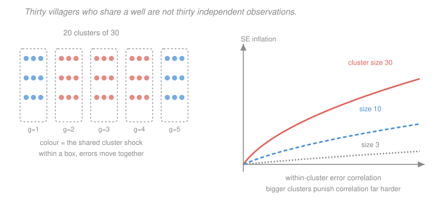

# Econometrics · Lesson 2.5: Clustered standard errors

> ⏱ ~15 min · Module 2: Inference and asymptotics · Builds on: [2.4 (heteroskedasticity and robust standard errors)](02-04-heteroskedasticity-robust-standard-errors.md) · Unlocks: 2.6 (the bootstrap and few clusters), 4.3 (difference-in-differences)

## Why this matters

This is, empirically, the most consequential inference mistake in applied economics. Bertrand, Duflo and Mullainathan showed in 2004 that difference-in-differences studies ignoring serial correlation rejected true nulls **45 percent of the time** at a nominal 5 percent level. Not 6 percent. Forty-five. A large share of the published effects in that literature were noise wearing three stars.

The mechanism is simple and worth carrying: if your treatment varies at the state level and your data are at the person level, you do not have 400,000 observations. You have 50. Everything follows from that.

## The idea

[2.4](02-04-heteroskedasticity-robust-standard-errors.md) allowed each observation its own variance but insisted observations were independent. Clustering drops the independence within known groups — villages, schools, firms, states, individuals observed repeatedly — while keeping it *between* them.

Why it matters so much: correlated errors mean your observations are partly redundant. Thirty villagers who drink from the same well, face the same rainfall and hear the same rumour are not thirty independent draws. If their errors share a common component, the information content of the village is closer to one observation than thirty, and a standard error computed as if you had thirty is too small by a large factor.

The formula is the same sandwich with one change: sum $x_i\hat e_i$ *within* each cluster first, then square. Summing before squaring is exactly what preserves the within-cluster covariances that independence would have thrown away.

## The formal version

Let observations be partitioned into $G$ clusters, with $\mathcal G_g$ the index set of cluster $g$ and $n_g = |\mathcal G_g|$. Assume errors are arbitrarily correlated within clusters and independent across them.

> **Definition (cluster-robust variance).** With $s_g = \sum_{i\in\mathcal G_g} x_i\hat e_i$ (a $k$-vector, the cluster's *score*),
> $$\widehat{\operatorname{Var}}_{\text{CR}}(\hat\beta) = c\;(X'X)^{-1}\Bigl(\sum_{g=1}^{G} s_g s_g'\Bigr)(X'X)^{-1} ,$$
> with the standard finite-sample correction $c = \dfrac{G}{G-1}\cdot\dfrac{n-1}{n-k}$ (this is CR1, the Stata default).

*In words:* identical to White except the meat is built from $G$ cluster totals rather than $n$ individual terms. Setting every cluster to size one recovers HC0 exactly, so this is a strict generalisation.

**Where the inflation comes from.** In the simple case of equal cluster sizes $\bar n$, a regressor constant within clusters, and equicorrelated errors, the variance ratio has a closed form:

> **Moulton factor.** $\dfrac{\operatorname{Var}_{\text{CR}}(\hat\beta)}{\operatorname{Var}_{\text{classical}}(\hat\beta)} \;=\; 1 + \rho_x\rho_u\,(\bar n - 1)$,

where $\rho_u$ is the within-cluster error correlation and $\rho_x$ the within-cluster correlation of the regressor. *In words:* the damage is the product of three things — how correlated the errors are, how correlated the regressor is, and how big the clusters are.

Read off the two ways to escape. If $\rho_u = 0$ there is no problem. If $\rho_x = 0$ — the regressor varies purely *within* clusters, with no group-level component — there is also no problem, no matter how correlated the errors are. **Clustering bites hardest when the treatment is assigned at the cluster level**, which is precisely the case in policy evaluation, and precisely why difference-in-differences is where it caused the most damage.

The magnitudes are brutal. With $\rho_x = 1$ (treatment constant within cluster), $\rho_u = 0.1$ and $\bar n = 100$, the variance ratio is $1+0.1(99) = 10.9$, so standard errors are understated by a factor of $\sqrt{10.9} = 3.30$. A $t$-statistic of $6.6$ is really $2.0$.

**What to cluster on.** The rule is to cluster at the level at which *treatment is assigned* (or at which sampling is clustered), and when in doubt at the coarser level — a state-level policy means state clusters even if you also have county data. Erring coarse costs efficiency; erring fine costs validity. If treatment varies along two dimensions (state and year), two-way clustering exists and is standard.

**The catch: $G$, not $n$, is your sample size.** The asymptotic theory here requires $G\to\infty$; nothing requires $n_g$ to be large. Consequently:

- Cluster-robust standard errors are **biased downward** when $G$ is small.
- The relevant reference distribution is roughly $t_{G-1}$, not $t_{n-k}$ or the normal.
- Below about $G = 30$ or $40$ clusters, inference is unreliable — and the failure mode is over-rejection.

With $G = 10$, the $t_9$ critical value is $2.262$ against $1.96$, and the downward bias in the variance estimate compounds it. That combination is what [2.6](02-06-bootstrap-and-few-clusters.md) exists to fix.

## Picture

The colour inside each box on the left is the shared shock — every member of a village inherits it, so their errors move together. The right panel is the Moulton factor: at cluster size 30, even a modest error correlation of $0.2$ inflates standard errors by more than a factor of two, while at cluster size 3 the same correlation costs almost nothing. **Big clusters are the danger.**

## Worked examples

**Example 1 (mechanical): the running dataset, finished.** The same $n=600$ observations in $G=20$ clusters of $30$ from [2.4](02-04-heteroskedasticity-robust-standard-errors.md), with a regressor that has a strong cluster-level component and errors carrying a cluster shock:

| Estimator | $\mathrm{se}(\hat\beta_1)$ | ratio to classical |
|---|---|---|
| Classical | $0.0750$ | $1.00$ |
| White HC1 | $0.1107$ | $1.48$ |
| Cluster CR1 | $0.2877$ | $3.84$ |

The estimate is $\hat\beta_1 = 1.3747$ against a true $\beta_1 = 1.0$. Under the classical standard error, $t = (1.3747-1)/0.0750 = 5.00$ — you would reject the true value at any conventional level. Under clustering, $t = 0.375/0.2877 = 1.30$, and you correctly fail to reject.

Sanity-check against the Moulton formula. The regressor was built as $x_i = x_g + 0.5\xi_i$ with both components standard normal, so $\rho_x \approx 1/(1+0.25) = 0.8$; with $\rho_u$ around $0.5$ and $\bar n = 30$, the predicted factor is $\sqrt{1+0.8(0.5)(29)} = \sqrt{12.6} = 3.55$, against the realised $3.84$. Close enough to confirm the mechanism, and the residual gap is the heteroskedasticity that White was already catching.

**Example 2 (why you'd care): the Bertrand–Duflo–Mullainathan placebo.** Their experiment is worth reproducing in your head. Take real state-level panel data on women's wages, 50 states over 21 years. Now invent a **fake** policy: pick a random subset of states and a random year, and define $D_{st}=1$ afterwards. By construction the policy does nothing.

Run the standard two-way fixed effects regression with conventional standard errors, and repeat over many random placebo policies. At a nominal 5 percent level you should reject about 5 percent of the time. They rejected **45 percent** of the time.

The cause is serial correlation. Wages are highly persistent within a state, so the error for Alabama in 1985 is strongly correlated with Alabama in 1986. The fake treatment is also highly persistent (it switches on once and stays). The Moulton product $\rho_x\rho_u(\bar n -1)$ is therefore large on all three factors at once — with $\bar n = 21$ years, $\rho_x$ near $1$, and $\rho_u$ around $0.8$, you get $\sqrt{1+0.8(0.8)(20)} = \sqrt{13.8} = 3.7$, and standard errors understated by nearly a factor of four.

Clustering by **state** (not by state-year) fixes it, bringing the rejection rate back to roughly nominal. The general lesson: **whenever a treatment turns on and stays on, the panel dimension is a cluster**, and a placebo test on fake treatments is the cheapest way to find out whether your standard errors are honest.

## Watch out

- **You might think** more clusters is always safer — **but actually** clustering too *finely* is the danger. Clustering by state-year when the policy varies by state gives you 1,050 "clusters" and standard errors nearly as wrong as unclustered ones, because the correlation you needed to capture runs across years within a state.
- **You might think** clustering is a small correction — **but actually** factors of 3 to 5 are routine, and factors above 10 occur. It regularly turns a headline result into a null result. If a paper with cluster-assigned treatment does not report the clustering level, that is the first thing to ask about.
- **You might think** you have plenty of data because $n$ is large — **but actually** the asymptotics run in $G$. A study of 2 million individuals in 12 states has 12 clusters, and its inference is in the danger zone no matter how large $n$ is. Report $G$ alongside $n$; the second number is the one doing the work.

## One-liner

> Clustering sums the scores within each group before squaring them, which keeps the within-group correlation the independence assumption threw away — and since the asymptotics run in the number of clusters, a study with a million observations in twelve states has twelve observations' worth of inference.

## Problems

**P1 (🟢)** A study has $\bar n = 25$ observations per cluster, within-cluster error correlation $\rho_u = 0.3$, and a treatment assigned at the cluster level so $\rho_x = 1$. By what factor are classical standard errors understated? If the reported $t$-statistic is $4.5$, what is the honest one?

**P2 (🟡)** Show that the cluster-robust formula reduces exactly to HC0 when every cluster has one observation. Then explain why clustering at a *finer* level than treatment assignment fails to fix the problem, using the Moulton factor.

**P3 (🔴, optional)** In a cluster of size $n_g$ with equicorrelated errors ($\operatorname{Corr}(u_i,u_j)=\rho_u$ for $i\ne j$ within the cluster) and a regressor constant within the cluster, derive the Moulton factor $1+\rho_u(n_g-1)$ directly. Then explain what "effective sample size" this implies, and evaluate it for $n_g = 30$, $\rho_u = 0.5$.

Solutions

**P1** The Moulton variance ratio is
$$1+\rho_x\rho_u(\bar n - 1) = 1 + (1)(0.3)(24) = 1+7.2 = 8.2 .$$
Standard errors are understated by the square root:
$$\sqrt{8.2} = 2.8636 .$$
So classical standard errors are about **2.86 times too small**. The honest $t$-statistic is
$$t_{\text{honest}} = \frac{4.5}{2.8636} = 1.5714 .$$
A reported $t$ of $4.5$ — which looks overwhelming, with a nominal $p$-value below $10^{-5}$ — is really $1.57$, which does not reject at 5 percent. This is the routine magnitude of the correction, not an extreme case.

**P2** *Reduction to HC0.* If every cluster has one observation, $\mathcal G_g = \{g\}$ and the cluster score is $s_g = x_g\hat e_g$, a single term. Then
$$\sum_{g=1}^{G} s_gs_g' = \sum_{g=1}^{n} (x_g\hat e_g)(x_g\hat e_g)' = \sum_{i=1}^n x_ix_i'\hat e_i^2 ,$$
which is exactly White's meat. Ignoring the finite-sample constant $c$, the cluster formula becomes $(X'X)^{-1}\bigl(\sum_i \hat e_i^2 x_ix_i'\bigr)(X'X)^{-1} = \widehat{\operatorname{Var}}_{\text{HC0}}$. So HC0 is the special case "every observation is its own cluster", i.e. full independence — which makes the generalisation transparent: clustering is White with the independence assumption relaxed on a known partition.

*Why finer clustering fails.* The Moulton factor $1+\rho_x\rho_u(\bar n-1)$ tells you what a given clustering level *captures*. Suppose treatment is assigned by state and errors are correlated within state across years. If you cluster by state-year, then within each of your clusters $\bar n$ is the number of individuals in that state-year, and — critically — the correlation across *years* within a state is entirely outside your clusters, so the estimator treats Alabama-1985 and Alabama-1986 as independent. The between-year component of $\rho_u$ is simply never counted. You capture the within-state-year correlation (often small, since the individuals in one state-year mostly differ idiosyncratically) and miss the serial correlation (often large and the whole problem). The result is standard errors nearly as understated as unclustered ones.

The operative principle: **the cluster must be at least as coarse as the level at which errors are correlated, and errors are correlated at least at the level treatment is assigned.** Coarser than necessary costs a little efficiency and some degrees of freedom; finer than necessary costs validity.

**P3** *Derivation.* Consider estimating a mean (equivalently, a coefficient on a within-cluster-constant regressor), so the object is $\bar u_g = \frac{1}{n_g}\sum_{i\in\mathcal G_g}u_i$. With $\operatorname{Var}(u_i)=\sigma^2$ and $\operatorname{Corr}(u_i,u_j)=\rho_u$ for $i\neq j$ in the cluster:
$$\operatorname{Var}\Bigl(\sum_{i\in\mathcal G_g} u_i\Bigr) = \sum_{i}\operatorname{Var}(u_i) + \sum_{i\neq j}\operatorname{Cov}(u_i,u_j) = n_g\sigma^2 + n_g(n_g-1)\rho_u\sigma^2 ,$$
since there are $n_g(n_g-1)$ ordered off-diagonal pairs. Factoring,
$$\operatorname{Var}\Bigl(\sum_{i\in\mathcal G_g}u_i\Bigr) = n_g\sigma^2\bigl[1+\rho_u(n_g-1)\bigr] .$$
Under independence the same sum would have variance $n_g\sigma^2$. The ratio is
$$\boxed{\ 1+\rho_u(n_g-1)\ }$$
which is the Moulton factor with $\rho_x = 1$. $\checkmark$ (Dividing by $n_g^2$ gives $\operatorname{Var}(\bar u_g) = \frac{\sigma^2}{n_g}[1+\rho_u(n_g-1)]$, the same statement for the mean.)

*Effective sample size.* Define $n_{\text{eff}}$ as the number of **independent** observations that would give the same variance for the cluster mean:
$$\frac{\sigma^2}{n_{\text{eff}}} = \frac{\sigma^2}{n_g}\bigl[1+\rho_u(n_g-1)\bigr] \qquad\Longrightarrow\qquad n_{\text{eff}} = \frac{n_g}{1+\rho_u(n_g-1)} .$$

*Evaluation at $n_g=30$, $\rho_u = 0.5$:*
$$n_{\text{eff}} = \frac{30}{1+0.5(29)} = \frac{30}{15.5} = 1.94 .$$

**Thirty correlated observations are worth fewer than two independent ones.** That is the whole lesson in a number. Worth noting the limiting behaviour: as $n_g\to\infty$,
$$n_{\text{eff}} \to \frac{1}{\rho_u} ,$$
so with $\rho_u = 0.5$ a cluster is *never* worth more than 2 independent observations no matter how many members it has — and with $\rho_u = 0.1$, never more than 10. Adding more people to an already-large cluster buys almost nothing. **The way to buy precision is more clusters, not bigger ones**, which is a design lesson worth having before you collect the data rather than after.

## Flashback

**From Lesson 2.3 (hypothesis tests and confidence intervals):** A regression reports $\hat\beta_1 = 0.60$ and $\hat\beta_2 = -0.20$, with $\operatorname{Var}(\hat\beta_1) = 0.09$, $\operatorname{Var}(\hat\beta_2)=0.04$ and $\operatorname{Cov}(\hat\beta_1,\hat\beta_2)=-0.03$. Test $H_0:\beta_1+\beta_2 = 0$ at 5 percent, and separately test $H_0:\beta_1=\beta_2=0$ jointly using the Wald statistic. Comment on any tension between the two answers.

Solution

*Test of the sum.* Let $\theta = \beta_1+\beta_2$, so $\hat\theta = 0.60-0.20 = 0.40$ and
$$\operatorname{Var}(\hat\theta) = 0.09+0.04+2(-0.03) = 0.13-0.06 = 0.07 , \qquad \mathrm{se}(\hat\theta) = \sqrt{0.07} = 0.264575 .$$
$$t = \frac{0.40}{0.264575} = 1.5119 .$$
Since $|1.51| < 1.96$, **do not reject** $H_0:\beta_1+\beta_2=0$. The 95 percent interval is $0.40\pm 1.96(0.264575) = [-0.1186, 0.9186]$.

*Joint Wald test.* With $V = \begin{pmatrix} 0.09 & -0.03\\ -0.03 & 0.04\end{pmatrix}$, $\det V = 0.0036-0.0009 = 0.0027$, so
$$V^{-1} = \frac{1}{0.0027}\begin{pmatrix} 0.04 & 0.03\\ 0.03 & 0.09\end{pmatrix} = \begin{pmatrix} 14.8148 & 11.1111\\ 11.1111 & 33.3333\end{pmatrix} .$$
With $\hat\beta = (0.60, -0.20)'$:
$$W = \hat\beta'V^{-1}\hat\beta = 14.8148(0.36) + 2(11.1111)(0.60)(-0.20) + 33.3333(0.04) ,$$
$$= 5.3333 - 2.6667 + 1.3333 = 4.0000 .$$
Against $\chi^2_2$ with a 5 percent critical value of $5.991$: **do not reject** the joint null either.

*Is there tension?* No — both tests fail to reject, so they agree here. But the individual $t$-statistics are worth computing: $t_1 = 0.60/0.3 = 2.00$ and $t_2 = -0.20/0.2 = -1.00$. So $\beta_1$ **is** individually significant at 5 percent while the joint test is not. That is the [2.3](02-03-hypothesis-tests-confidence-intervals.md) figure's point $B$ made numerical: a point can sit outside a marginal interval yet inside the joint ellipse, because the joint test spends its 5 percent across two dimensions and so demands more total distance before rejecting.

The right reading is not that one test is wrong. They answer different questions — "is $\beta_1$ zero?" and "are both zero?" — and a coherent report gives whichever the economics asks for, decided before seeing the numbers. Choosing afterwards whichever rejects is precisely the specification-search problem [2.7](02-07-multiple-testing-specification-search.md) takes up.

## Connections

- **Backward:** the formula is [2.4](02-04-heteroskedasticity-robust-standard-errors.md)'s sandwich with the meat re-aggregated; setting $n_g=1$ recovers it exactly. The Moulton factor is a direct application of [`prob-stat-refresher` 3.1](../../prob-stat-refresher/lessons/03-01-joint-distributions-covariance.md)'s variance-of-a-sum formula.
- **Forward:** [2.6](02-06-bootstrap-and-few-clusters.md) handles the small-$G$ case this lesson flags as dangerous. [4.1](04-01-panel-data-fixed-effects.md) and [4.3](04-03-difference-in-differences.md) *require* clustering by unit — the BDM result is about exactly those designs, and no DiD estimate should be reported without it.
- **Sideways:** the "effective sample size" calculation is the design-of-experiments quantity that determines how to allocate a fixed research budget between more clusters and bigger clusters — and P3's answer, that a cluster is never worth more than $1/\rho_u$ observations, is why field experiments randomise over as many villages as they can afford rather than sampling more households per village.
