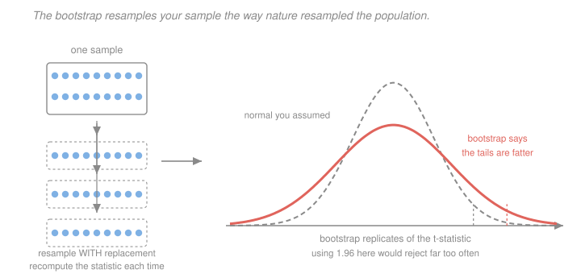

# Econometrics · Lesson 2.6: The bootstrap and inference with few clusters

> ⏱ ~15 min · Module 2: Inference and asymptotics · Builds on: [2.2 (consistency and asymptotic normality)](02-02-consistency-and-asymptotic-normality.md), [2.5 (clustered standard errors)](02-05-clustered-standard-errors.md) · Unlocks: 2.7 (multiple testing), 4.3 (difference-in-differences)

## Why this matters

[2.5](02-05-clustered-standard-errors.md) ended with a warning it could not act on: below roughly 30 or 40 clusters, cluster-robust standard errors are biased downward and the normal reference distribution over-rejects. That is not a corner case. A policy adopted by 6 states, an experiment randomised over 12 schools, a difference-in-differences with 2 treated units — these are ordinary research designs, and the standard toolkit fails on all of them.

The bootstrap is the answer, and specifically one variant of it. Getting to the right variant matters: the obvious bootstrap makes things *worse* with few clusters, and the fix is a particular trick that took the profession about fifteen years to settle on.

## The idea

Asymptotic theory says: assume $n$ is large, derive the limiting distribution, use it. The bootstrap says: **stop deriving and start simulating.** Your sample is your best available picture of the population, so resample from it, recompute the statistic, and read the distribution off the replicates.

The reason this is not circular: you are not learning the population from the bootstrap. You are learning the *sampling variability of a procedure*, and for that purpose the sample stands in for the population well enough — the empirical distribution converges to the true one, so the simulated variability converges to the true variability.

The key refinement, and the one that makes the bootstrap more than a convenience: **bootstrap the $t$-statistic, not the coefficient.** A $t$-statistic is approximately pivotal — its distribution barely depends on the unknown parameters — and bootstrapping a pivotal quantity gives an *asymptotic refinement*, with errors of order $1/n$ instead of $1/\sqrt n$. Bootstrapping the coefficient itself buys you nothing the sandwich did not already give.

## The formal version

**The pairs (nonparametric) bootstrap.** Draw $n$ observations $(y_i,x_i)$ with replacement from the sample, recompute $\hat\beta^{*}$, repeat $B$ times. The standard deviation of the $\hat\beta^{*}$ estimates $\mathrm{se}(\hat\beta)$; quantiles of the replicates give a percentile interval.

**The bootstrap-$t$ (percentile-$t$).** For each replicate compute
$$t^{*(b)} = \frac{\hat\beta^{*(b)} - \hat\beta}{\mathrm{se}(\hat\beta^{*(b)})} ,$$
centring on $\hat\beta$ — the sample's value plays the role of "the truth" inside the bootstrap world. Use the quantiles of $\{t^{*(b)}\}$ in place of $\pm 1.96$. This is the version with the refinement.

**The wild bootstrap.** Keep $X$ fixed and resample the *errors* by flipping their signs. For each replicate draw $v_i \in\{-1,+1\}$ with probability $\tfrac12$ each (Rademacher weights) and build
$$y_i^{*} = x_i'\tilde\beta + v_i\,\tilde e_i ,$$
where tildes denote estimates under the null being tested. This preserves each observation's own error magnitude, so it handles heteroskedasticity natively without needing to model it.

**The wild cluster bootstrap.** The one that matters here. Draw **one** Rademacher weight $v_g$ per *cluster* and apply it to every residual in that cluster:
$$y_i^{*} = x_i'\tilde\beta + v_{g(i)}\,\tilde e_i .$$
Flipping the whole cluster together preserves the within-cluster correlation structure, which is exactly the thing that was breaking inference.

> **Recipe (wild cluster bootstrap-$t$, imposing the null).** To test $H_0:\beta_j = c$:
> 1. Estimate the model **with the null imposed** ($\beta_j = c$), saving $\tilde\beta$ and residuals $\tilde e$.
> 2. Compute the actual statistic $t = (\hat\beta_j - c)/\mathrm{se}_{\text{CR}}(\hat\beta_j)$ from the unrestricted fit.
> 3. For $b=1,\dots,B$: draw $v_g\in\{-1,1\}$ per cluster, form $y^{*}$, re-estimate *unrestricted*, and compute $t^{*(b)} = (\hat\beta_j^{*}-c)/\mathrm{se}_{\text{CR}}(\hat\beta_j^{*})$.
> 4. The $p$-value is the share of replicates with $|t^{*(b)}| \ge |t|$.

Two details do the heavy lifting. **Imposing the null** in step 1 (the "restricted" or WCR bootstrap) substantially outperforms the unrestricted version — this is not cosmetic, and simulations are unambiguous about it. And **bootstrapping the $t$-statistic** rather than the coefficient is what supplies the refinement.

**The hard limit.** With $G$ clusters there are only $2^G$ distinct sign vectors, so the $p$-value lives on a grid of spacing $2/2^G$:

| $G$ | distinct sign vectors | finest two-sided $p$ |
|---|---|---|
| $5$ | $32$ | $0.0625$ |
| $6$ | $64$ | $0.03125$ |
| $10$ | $1{,}024$ | $0.00195$ |
| $20$ | $1{,}048{,}576$ | $0.0000019$ |

With $G=5$ you **cannot** obtain a $p$-value below $0.05$ from Rademacher weights, no matter how strong the effect. That is not a bug — it is the method honestly reporting that five clusters cannot support a 5 percent test. Webb's six-point weights enlarge the grid to $6^G$ and are the standard remedy for $G$ below about 12.

**Randomization inference.** A different and often better idea for experiments: if treatment was assigned by a known random mechanism, re-run that mechanism. Compute the statistic under every (or many) alternative assignment, and the $p$-value is the share of assignments giving a statistic at least as extreme. This tests the **sharp null** of no effect for any unit, requires no asymptotics at all, and is exact by construction.

## Picture

The left is the mechanism: resample, recompute, repeat. The right is the payoff — the bootstrap distribution of the $t$-statistic is visibly wider than the normal you would have assumed, so its 97.5th percentile sits at $2.78$ rather than $1.96$. Using $1.96$ here would reject a true null roughly three times too often.

## Worked examples

**Example 1 (mechanical): reading a wild cluster bootstrap result.** A difference-in-differences study with $G=12$ states estimates a treatment effect of $\hat\beta = 0.084$ with cluster-robust standard error $0.036$.

Conventional inference: $t = 0.084/0.036 = 2.333$. Against $1.96$, reject at 5 percent ($p = 0.0196$). Against the more honest $t_{G-1}=t_{11}$ critical value of $2.201$, still reject, though barely ($p = 0.0397$).

Now the wild cluster bootstrap with $B=9999$ returns a $p$-value of $0.118$. **Do not reject.** The bootstrap $t$-distribution has 97.5th percentile around $3.4$, far outside the normal's $1.96$, because with 12 clusters the cluster-robust standard error is itself substantially downward-biased and highly variable.

Which do you believe? The bootstrap, and it is not close — the simulation evidence on this configuration is one-sided. The practical rule: **report the wild cluster bootstrap $p$-value whenever $G < 40$**, and report it alongside the conventional one rather than instead of it, so readers can see the size of the correction.

**Example 2 (why you'd care): randomization inference on a tiny experiment.** Six villages are randomised, three to treatment and three to control. Mean outcomes are

$$\text{treated}: 12,\ 15,\ 11 \qquad \text{control}: 8,\ 10,\ 9 .$$

The difference in means is $12.667 - 9.000 = 3.667$. With three observations per arm, no asymptotic theory is worth quoting.

Randomization inference instead asks: under the sharp null that treatment changed nothing, each village's outcome would have been the same whichever arm it landed in. So enumerate all $\binom{6}{3} = 20$ ways to split the six numbers $\{12,15,11,8,10,9\}$ into two groups of three, and compute the difference in means for each. The observed assignment gives the **largest possible** difference, since the three highest values happen to be the treated ones.

The two-sided $p$-value is the share of the 20 assignments with $|{\text{difference}}| \ge 3.667$. Only two achieve it — the observed split and its mirror image — so
$$p = \frac{2}{20} = 0.10 .$$

**The most extreme possible outcome yields $p=0.10$.** With six units and this design, a 5 percent test does not exist; the finest attainable $p$-value is $1/10$ of the way down a 20-point grid. That is worth knowing *before* running the experiment, not after — and it is the same arithmetic as the $2^G$ grid above, which is why randomization inference and the wild cluster bootstrap fail in the same way for the same reason.

## Watch out

- **You might think** the pairs bootstrap is the safe default with clustered data — **but actually** with few clusters resampling whole clusters with replacement can produce bootstrap samples where a cluster appears three times or where no treated cluster appears at all, and it performs *worse* than the analytic cluster-robust error. The wild cluster bootstrap, which keeps the design fixed and only flips signs, is the one that works.
- **You might think** more bootstrap replications overcome few clusters — **but actually** $B$ controls only simulation noise. The $2^G$ grid is a hard information limit: at $G=5$ no value of $B$ produces a $p$-value below $0.0625$. Raising $B$ from 999 to 99,999 changes nothing about that.
- **You might think** the bootstrap is assumption-free — **but actually** it inherits whatever independence structure you resample under. A bootstrap that resamples observations independently when errors are clustered is exactly as wrong as unclustered standard errors, and produces a confident-looking wrong answer with no warning.

## One-liner

> Bootstrap the $t$-statistic rather than the coefficient, flip signs one cluster at a time, and impose the null when you resample — and accept that with five clusters no amount of computation manufactures a 5 percent test.

## Problems

**P1 (🟢)** An experiment randomises 4 units to treatment and 4 to control. What is the smallest two-sided $p$-value randomization inference can produce? Repeat for 5 and 5. At what point does a 5 percent test become attainable?

**P2 (🟡)** Explain why the wild cluster bootstrap flips signs at the *cluster* level rather than the observation level, and what would go wrong if you flipped each observation independently. Then explain why the null is imposed when generating the bootstrap samples.

**P3 (🔴, optional)** A study has $G=8$ clusters, $\hat\beta = 1.20$, and $\mathrm{se}_{\text{CR}} = 0.50$. Compute the $p$-value under (a) the normal, (b) $t_7$, and (c) a wild cluster bootstrap whose replicate $t$-statistics have 97.5th percentile $3.9$. Explain the ordering, and say what you would report.

Solutions

**P1** The number of distinct assignments is $\binom{n}{n_1}$, and the smallest two-sided $p$-value is $2/\binom{n}{n_1}$ (the observed assignment and its mirror image, when the observed result is the most extreme possible).

*4 and 4:* $\binom{8}{4} = 70$, so the smallest two-sided $p$-value is
$$\frac{2}{70} = 0.0286 .$$
This is **below 0.05**, so a 5 percent test is attainable — barely, and only if the result is the single most extreme split.

*5 and 5:* $\binom{10}{5} = 252$, so the minimum is $2/252 = 0.0079$. Comfortable.

*Where the threshold falls.* We need $2/\binom{n}{n_1}\le 0.05$, i.e. $\binom{n}{n_1}\ge 40$. Working up through balanced designs:

| design | $\binom{n}{n_1}$ | min two-sided $p$ | 5% test possible? |
|---|---|---|---|
| 2 vs 2 | $6$ | $0.333$ | no |
| 3 vs 3 | $20$ | $0.100$ | no |
| 4 vs 4 | $70$ | $0.0286$ | **yes** |
| 5 vs 5 | $252$ | $0.0079$ | yes |

So **4 versus 4 is the smallest balanced design supporting a 5 percent two-sided test** — and even then only the single most extreme outcome clears the bar, meaning the test has essentially no power against anything but a colossal effect. Unbalanced designs are worse: 2 versus 6 gives $\binom{8}{2}=28$ and a minimum $p$ of $0.071$, so it fails despite having the same eight units. Balance buys you assignments, and assignments are the currency of this kind of inference.

**P2** *Why cluster-level signs.* The problem clustering exists to solve is that errors within a cluster move together. Flipping signs one observation at a time would destroy exactly that structure: the bootstrap samples would have within-cluster correlation near zero, so the bootstrap distribution would reproduce the sampling variability of *independent* data — which is the wrong, too-narrow distribution. You would recreate the original error in a more expensive way. Flipping $v_g$ once per cluster multiplies every residual in the cluster by the same $\pm1$, which leaves all within-cluster products $\tilde e_i\tilde e_j$ unchanged ($v_g^2 = 1$) while randomising the cluster's overall contribution. The correlation structure survives; the sign does not.

*Why impose the null.* Two reasons, one practical and one theoretical. Practically, the restricted residuals $\tilde e$ are computed under $H_0$, so the bootstrap data-generating process actually satisfies the null you are testing — which is what a $p$-value is defined against. Bootstrapping from unrestricted residuals generates data under the *alternative* $\hat\beta_j$, and then asks how often the null is rejected in that world, which is a power calculation wearing a $p$-value's clothes. Theoretically, imposing the null yields better higher-order behaviour, and with few clusters the improvement is large: simulations routinely show the restricted version holding size near 5 percent where the unrestricted version rejects 10–15 percent of the time. When a source says "wild cluster bootstrap", it almost always means the restricted (WCR) version.

**P3** The statistic is $t = 1.20/0.50 = 2.40$.

*(a) Normal.* $p = 2(1-\Phi(2.40)) = 2(0.008198) = 0.0164$. Reject decisively.

*(b) $t_7$* (using $G-1 = 7$ degrees of freedom): $p = 2(1-F_{t_7}(2.40)) = 0.0475$. Reject, but only just — the $p$-value has tripled.

*(c) Wild cluster bootstrap.* The observed $|t| = 2.40$ sits well inside the bootstrap 97.5th percentile of $3.9$, so the share of replicates exceeding it is clearly above 5 percent. Interpolating against a distribution whose 97.5th percentile is $3.9$ (roughly a $t$ with 2–3 degrees of freedom in shape), $|t|=2.40$ corresponds to a $p$-value in the neighbourhood of $0.12$. **Do not reject.**

*The ordering, and why.* The three $p$-values are $0.016 < 0.048 < 0.12$, and the ordering is not a coincidence — each step corrects a distinct optimism:

1. The normal ignores that $\mathrm{se}_{\text{CR}}$ is *estimated*, and with only 8 clusters it is estimated very imprecisely. The $t_7$ reference accounts for that.
2. The $t_{G-1}$ reference still takes $\mathrm{se}_{\text{CR}}$ to be *unbiased*, which it is not — the cluster-robust variance estimator is biased downward at small $G$, so even the $t$ correction leaves the statistic systematically too large. The bootstrap accounts for both the bias and the non-normal shape.

*What to report.* The bootstrap $p$-value of roughly $0.12$, as the headline, with the conventional $0.016$ shown alongside and the number of clusters stated prominently. Reporting only the conventional figure would present a null result as a significant one — which, given that $G=8$ is common in state-policy work, is a substantial share of how the credibility problem in that literature arose. And the honest summary sentence is not "the effect is zero" but "with eight clusters these data cannot distinguish this effect from zero", which also tells the reader what a better-designed study would need.

## Flashback

**From Lesson 2.4 (heteroskedasticity and robust standard errors):** Four observations from a no-constant regression on $x = (1,-2,2,-1)$ have residuals $\hat e = (2,1,-1,-2)$. Compute the classical and HC0 variance estimates of $\hat\beta$, and say which is larger and why.

Solution

Ingredients: $\sum_i x_i^2 = 1+4+4+1 = 10$ and $\sum_i \hat e_i^2 = 4+1+1+4 = 10$. With $k=1$ and $n=4$, $s^2 = 10/3 = 3.3\overline{3}$.

*Classical:*
$$\widehat{\operatorname{Var}}_{\text{classical}}(\hat\beta) = \frac{s^2}{\sum x_i^2} = \frac{10/3}{10} = \frac13 = 0.3333, \qquad \mathrm{se} = 0.5774 .$$

*HC0:*
$$\sum_i x_i^2\hat e_i^2 = 1(4) + 4(1) + 4(1) + 1(4) = 4+4+4+4 = 16 ,$$
$$\widehat{\operatorname{Var}}_{\text{HC0}}(\hat\beta) = \frac{16}{10^2} = 0.16, \qquad \mathrm{se} = 0.40 .$$

**Classical is larger** ($0.333$ against $0.160$), by a factor of just over two in variance.

*Why.* Look at the pairing: the two observations with the largest $x_i^2 = 4$ have the *small* residuals ($|\hat e| = 1$), while the two with $x_i^2=1$ have the *large* residuals ($|\hat e| = 2$). The noise is concentrated where the regressor carries the least weight. The classical formula assumes every observation contributes the same variance $s^2$ regardless of its $x$, and here that assumption is pessimistic — it charges the high-leverage observations with more noise than they actually have.

Note that the product $x_i^2\hat e_i^2$ is exactly $4$ for every observation, which is why the HC0 sum is so tidy. The general moral is [2.4](02-04-heteroskedasticity-robust-standard-errors.md)'s direction caveat, sharpened: robust standard errors are *usually* larger in real data, because extreme regressor values usually come with extreme noise, but the formula has no built-in direction. It reports what the residual pattern actually says, which is the entire point of using it. (The HC1 correction $\times\, n/(n-k) = 4/3$ would give $\mathrm{se} = 0.462$, still below classical.)

## Connections

- **Backward:** this rescues [2.5](02-05-clustered-standard-errors.md)'s method in the regime where its asymptotics fail, and it rests on [2.2](02-02-consistency-and-asymptotic-normality.md)'s framing — the bootstrap approximates the same limiting distribution, just by simulation instead of by theorem. The residuals being resampled are [2.4](02-04-heteroskedasticity-robust-standard-errors.md)'s.
- **Forward:** [2.7](02-07-multiple-testing-specification-search.md) uses bootstrap resampling to control family-wise error across many correlated tests (the Romano–Wolf procedure). Randomization inference is the natural inference method for [4.6](04-06-synthetic-control.md)'s placebo tests, and every DiD design in Module 4 with few treated clusters needs this lesson.
- **Sideways:** the bootstrap is the same resampling idea as the bagging of [`statistical-learning` 5.2](../../statistical-learning/lessons/05-02-bagging-and-random-forests.md), used for an opposite purpose — there to *reduce* variance by averaging predictors, here to *measure* variance by observing spread. Same machinery, orthogonal goals.
