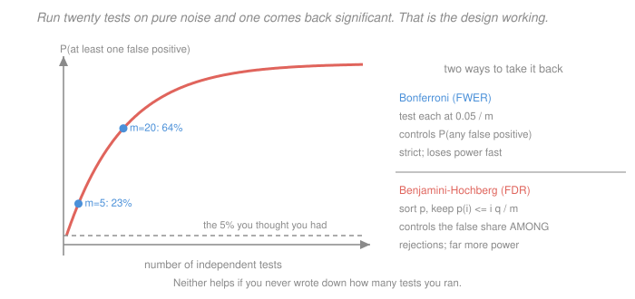

# Econometrics · Lesson 2.7: Multiple testing and specification search

> ⏱ ~15 min · Module 2: Inference and asymptotics · Builds on: [2.3 (hypothesis tests and confidence intervals)](02-03-hypothesis-tests-confidence-intervals.md), [2.6 (the bootstrap)](02-06-bootstrap-and-few-clusters.md) · Unlocks: 3.2 (selection on observables), 4.4 (event studies)

## Why this matters

Everything in Module 2 assumed a single test, specified before seeing the data. Real research never looks like that. You try four outcomes, three control sets, two sample restrictions and a winsorisation rule, and you report the specification that worked. Each individual $p$-value is computed correctly. The reported one is meaningless.

This is not a lesson about ethics. It is a lesson about arithmetic: a 5 percent test run twenty times on pure noise rejects once, on average, and that is the test working exactly as designed. The question is what to do about it, and the honest answer has three parts — count your tests, adjust for them, and say what you did.

## The idea

A $p$-value is a promise about a *procedure*: "if the null is true, this procedure produces a value below 0.05 at most 5 percent of the time." Run the procedure once and the promise holds. Run it twenty times and keep the smallest, and the promise is about the individual runs, not about the minimum — the minimum of twenty uniform draws is nowhere near uniform.

There are two distinct things you might want to control, and confusing them wastes a lot of power:

- **Family-wise error rate (FWER)**: the probability of making *even one* false rejection. Appropriate when a single false positive is costly — a drug approval, a policy claim.
- **False discovery rate (FDR)**: the expected *share* of your rejections that are false. Appropriate when you are screening — you expect a mixed bag and want most of what you flag to be real.

FWER is strict and loses power fast as the number of tests grows. FDR is far more forgiving and is usually the right target when you are exploring 40 outcomes.

The deeper problem is that neither helps if you never wrote down how many tests you ran. Specification search is multiple testing with an unknown and unrecorded denominator, which is why the institutional fix — pre-registration — is about bookkeeping rather than statistics.

## The formal version

**The arithmetic of many tests.** With $m$ independent tests at level $\alpha$, all nulls true:
$$P(\text{at least one rejection}) = 1-(1-\alpha)^m .$$

| $m$ | at $\alpha = 0.05$ | expected false positives $= m\alpha$ |
|---|---|---|
| $1$ | $0.050$ | $0.05$ |
| $5$ | $0.226$ | $0.25$ |
| $10$ | $0.401$ | $0.50$ |
| $20$ | $0.642$ | $1.00$ |
| $100$ | $0.994$ | $5.00$ |

At $m=20$ you expect exactly one false positive and have a 64 percent chance of at least one. Twenty specifications is a modest morning's work.

**Bonferroni (controls FWER).** Test each hypothesis at $\alpha/m$. By Boole's inequality,
$$P\Bigl(\bigcup_j \{\text{reject } H_{0j}\}\Bigr) \le \sum_j P(\text{reject } H_{0j}) = m\cdot\frac{\alpha}{m} = \alpha ,$$
so FWER $\le\alpha$ regardless of dependence between tests. Simple, always valid, and conservative — with $m=20$ you need $p<0.0025$, roughly $|t|>3.02$.

**Holm's step-down** dominates Bonferroni at no cost: sort $p_{(1)}\le\cdots\le p_{(m)}$, and reject $H_{(j)}$ as long as $p_{(j)} \le \alpha/(m-j+1)$, stopping at the first failure. It also controls FWER under any dependence but is uniformly more powerful. There is no reason to use plain Bonferroni once you know Holm.

**Benjamini–Hochberg (controls FDR).** Sort the $p$-values ascending; find the largest $j$ with
$$p_{(j)} \le \frac{j}{m}\,q ,$$
and reject all hypotheses up to that $j$. This controls the false discovery rate at $q$ under independence or positive dependence. It is far more powerful than FWER methods when many alternatives are true.

**Romano–Wolf** uses the bootstrap of [2.6](02-06-bootstrap-and-few-clusters.md) to control FWER while exploiting the *correlation* between test statistics. Since specifications on the same data are highly correlated — the effective number of independent tests is much smaller than $m$ — this recovers a great deal of the power Bonferroni throws away. It is the modern default for a table of many treatment effects.

**Researcher degrees of freedom.** The choices that constitute unrecorded tests: which outcome, which controls, which sample, which functional form, how to handle outliers, which subgroups, when to stop collecting data. Simmons, Nelson and Simonsohn showed that a few such freedoms combined push the false-positive rate of a nominally 5 percent procedure above 60 percent.

**Publication bias** compounds it. If journals prefer significant results, the published literature is a *selected sample* of estimates, biased away from zero. The diagnostic signature is a discontinuity in the density of published $z$-statistics just above $1.96$, which is exactly what meta-analyses find across economics and psychology.

## Picture

The curve is $1-0.95^m$. The dashed line is the 5 percent you believed you had; by twenty tests you are at 64 percent. The right panel is the fork in the road: control the chance of *any* error (strict, Bonferroni or Holm) or the *share* of errors among your discoveries (permissive, Benjamini–Hochberg). Neither can help with tests you did not count.

## Worked examples

**Example 1 (mechanical): applying three procedures to the same table.** A study reports $m=10$ outcomes with these $p$-values, sorted:
$$0.001,\ 0.008,\ 0.019,\ 0.032,\ 0.041,\ 0.058,\ 0.190,\ 0.310,\ 0.520,\ 0.780 .$$
Unadjusted at 5 percent, **five** are significant.

*Bonferroni* at $\alpha=0.05$: the threshold is $0.05/10 = 0.005$. Only $p_{(1)} = 0.001$ survives. **One rejection.**

*Holm:* compare $p_{(j)}$ to $\alpha/(m-j+1)$:

| $j$ | $p_{(j)}$ | threshold $0.05/(11-j)$ | pass? |
|---|---|---|---|
| $1$ | $0.001$ | $0.005000$ | yes |
| $2$ | $0.008$ | $0.005556$ | **no — stop** |

**One rejection.** Holm and Bonferroni agree here because the second $p$-value just misses.

*Benjamini–Hochberg* at $q = 0.05$: compare $p_{(j)}$ to $jq/m = 0.005j$:

| $j$ | $p_{(j)}$ | $0.005j$ | $p_{(j)}\le$ threshold? |
|---|---|---|---|
| $1$ | $0.001$ | $0.005$ | yes |
| $2$ | $0.008$ | $0.010$ | yes |
| $3$ | $0.019$ | $0.015$ | no |
| $4$ | $0.032$ | $0.020$ | no |
| $5$ | $0.041$ | $0.025$ | no |

The largest $j$ satisfying the condition is $j=2$, so reject the two smallest. **Two rejections**, and the expected share of those two that are false is at most 5 percent.

Same table, three answers: five, one, two. The procedure must be chosen before looking, and stated.

**Example 2 (why you'd care): the specification garden.** You study whether a job-training program raises earnings. Available choices: 3 outcome definitions (annual earnings, hourly wage, employment), 4 control sets, 2 sample restrictions (drop or keep the self-employed), and 2 outlier rules. That is
$$3\times 4\times 2\times 2 = 48$$
specifications, all defensible, all producible in an afternoon.

If the true effect is zero and the tests were independent, the probability of finding at least one significant result is $1-0.95^{48} = 0.915$. In practice the 48 estimates are highly correlated — same data, overlapping controls — so the effective number of independent tests might be closer to 8, giving $1-0.95^8 = 0.337$. Still a one-in-three chance of a publishable false positive from a program that does nothing.

Two responses, and the second is the important one:

1. **Adjust.** Report Romano–Wolf $p$-values across the specifications you ran. This is what handles the correlation properly and is why it beats Bonferroni here.
2. **Show the whole garden.** A **specification curve** plots all 48 estimates sorted by magnitude, with the analytic choices marked underneath. If the effect is robust, the curve sits above zero nearly everywhere; if it depends on dropping the self-employed under one outlier rule, the picture says so immediately. This communicates more than any single adjusted $p$-value, and it makes the denominator visible — which was the actual problem.

## Watch out

- **You might think** multiple-testing corrections are only needed for formal multiple comparisons — **but actually** the relevant count is every test you *could have reported*, including specifications you ran and discarded. That is why the count is usually unknowable after the fact, and why pre-registration is a bookkeeping device rather than a statistical one.
- **You might think** Bonferroni is too conservative to be useful — **but actually** its conservatism comes from ignoring correlation between tests, and Romano–Wolf recovers most of the loss while keeping the same FWER guarantee. Use Holm if you want a one-line fix; use Romano–Wolf if the tests are correlated, which on the same dataset they always are.
- **You might think** a robustness table showing 20 specifications all significant is reassuring — **but actually** if those 20 were chosen *after* seeing which worked, the table is a selected sample of a larger garden and shows nothing. A robustness check is informative only when the set of checks was fixed in advance.

## One-liner

> A $p$-value is a promise about one pre-specified test, so twenty tries at 5 percent gives you a 64 percent chance of a false positive — control the family-wise rate or the false discovery rate as the problem demands, and either way the number that matters is how many tests you ran, which only you can report.

## Problems

**P1 (🟢)** A researcher runs 15 independent tests at the 5 percent level on data where every null is true. What is the probability of at least one rejection, and how many rejections do they expect? What Bonferroni-adjusted level would they need to hold the family-wise rate at 5 percent, and what $|t|$ does that correspond to in large samples?

**P2 (🟡)** Six $p$-values are $0.004,\ 0.011,\ 0.021,\ 0.030,\ 0.046,\ 0.310$. Apply Holm at $\alpha=0.05$ and Benjamini–Hochberg at $q=0.05$, and report how many rejections each gives. Explain the difference in one sentence.

**P3 (🔴, optional)** Suppose 1,000 hypotheses are tested, of which 100 have true effects that your test detects with power $0.80$, and 900 are true nulls tested at $\alpha=0.05$. Compute the expected number of true and false discoveries, the realised false discovery proportion, and the probability that a randomly chosen "significant" finding is actually false. Then explain what this implies about screening studies.

Solutions

**P1** *Probability of at least one rejection:*
$$1-(1-0.05)^{15} = 1-0.95^{15} = 1-0.463291 = 0.536709 \approx 53.7\% .$$
More likely than not, despite every null being true.

*Expected rejections:* each test rejects with probability $0.05$, so by linearity of expectation the count is $\text{Binomial}(15, 0.05)$ with mean
$$15\times 0.05 = 0.75 .$$

*Bonferroni level:* $\alpha/m = 0.05/15 = 0.003\overline{3}$.

*Corresponding critical value:* in large samples we need $2(1-\Phi(|t|)) = 0.0033\overline{3}$, i.e. $\Phi(|t|) = 1-0.0016\overline{6} = 0.998333$, giving
$$|t| = 2.935 .$$
So the bar moves from $1.96$ to about $2.94$ — a coefficient needs to be roughly 50 percent more standard errors away from zero to survive 15 tests.

**P2** *Holm* at $\alpha=0.05$, comparing $p_{(j)}$ to $0.05/(7-j)$:

| $j$ | $p_{(j)}$ | threshold | pass? |
|---|---|---|---|
| $1$ | $0.004$ | $0.05/6 = 0.008333$ | yes |
| $2$ | $0.011$ | $0.05/5 = 0.010000$ | **no — stop** |

**Holm rejects 1** hypothesis. (Note how close the call is: $0.011$ against $0.0100$. Plain Bonferroni would use $0.05/6 = 0.008333$ throughout and also reject only the first, so Holm gains nothing on this particular data — its advantage shows up when the leading $p$-values are more clearly separated.)

*Benjamini–Hochberg* at $q=0.05$, comparing $p_{(j)}$ to $jq/m = 0.05j/6 = 0.008333j$:

| $j$ | $p_{(j)}$ | $0.008333j$ | $p_{(j)}\le$ threshold? |
|---|---|---|---|
| $1$ | $0.004$ | $0.008333$ | yes |
| $2$ | $0.011$ | $0.016667$ | yes |
| $3$ | $0.021$ | $0.025000$ | yes |
| $4$ | $0.030$ | $0.033333$ | yes |
| $5$ | $0.046$ | $0.041667$ | no |
| $6$ | $0.310$ | $0.050000$ | no |

The largest $j$ satisfying the condition is $j=4$, so **BH rejects 4** (all $p$-values up to and including $0.030$).

*The difference in one sentence.* Holm controls the probability of making **any** false rejection and so must protect against the worst case, while BH controls only the expected **proportion** of false rejections among those made — so BH tolerates an occasional error in exchange for finding four effects instead of one.

**P3** *Expected discoveries.*

- True effects: $100$ hypotheses with power $0.80$, so expected **true discoveries** $= 100\times 0.80 = 80$.
- True nulls: $900$ tested at $\alpha = 0.05$, so expected **false discoveries** $= 900\times 0.05 = 45$.
- Total expected discoveries: $80+45 = 125$.

*False discovery proportion:*
$$\mathrm{FDP} = \frac{45}{125} = 0.36 .$$

*Probability a significant finding is false.* This is the same quantity read as a posterior — by Bayes' rule, with $P(\text{null}) = 0.9$:
$$P(\text{null}\mid\text{significant}) = \frac{0.9\times 0.05}{0.9\times 0.05 + 0.1\times 0.80} = \frac{0.045}{0.045+0.080} = \frac{0.045}{0.125} = 0.36 .$$
**36 percent of your "significant at 5 percent" findings are false**, even though every individual test is correctly sized.

*What this implies about screening.* The driver is the **base rate**: when only 10 percent of the hypotheses you test are true, most of your rejections come from the large pool of nulls, and the 5 percent error rate applied to 900 nulls simply outnumbers the 80 percent power applied to 100 alternatives. Three consequences worth carrying:

1. **A $p$-value is not the probability the finding is false.** Here every $p$ is below $0.05$ and 36 percent are false. The gap is the base rate, which the $p$-value never sees.
2. **Screening studies need FDR control, not FWER control.** Bonferroni at $0.05/1000$ would cut false discoveries to near zero but would also destroy power — you would find perhaps a handful of the 80 real effects. BH at $q=0.05$ targets exactly the 36 percent figure and pushes it to 5 percent while keeping most of the power. This is why genomics adopted FDR and never looked back.
3. **Raising the base rate is more valuable than any correction.** If theory narrows the field to 100 hypotheses of which 50 are true, the same test gives $40$ true and $2.5$ false discoveries, an FDP of $0.06$ — a sixfold improvement bought with no statistics at all. That is the real argument for testing hypotheses you had a reason to entertain, and it is the same argument [3.1](03-01-potential-outcomes-identification.md) makes for designing a study around an identification strategy rather than around a dataset.

## Flashback

**From Lesson 2.5 (clustered standard errors):** A study of a state-level policy has 40 states observed for 10 years, so $n=400$. Errors are correlated within state with $\rho_u = 0.6$, and the treatment is constant within state so $\rho_x = 1$. By what factor do unclustered standard errors understate the truth? How many *effectively independent* observations does the study have?

Solution

*Moulton factor.* The cluster here is the state, with $\bar n = 10$ observations (years) per cluster. The variance ratio is
$$1+\rho_x\rho_u(\bar n-1) = 1+(1)(0.6)(9) = 1+5.4 = 6.4 ,$$
so unclustered standard errors are understated by
$$\sqrt{6.4} = 2.5298 ,$$
a factor of about **2.53**. A reported $t$-statistic of $5.0$ is really $1.98$, sitting right on the edge of significance rather than far past it.

*Effective sample size.* Using the formula from [2.5](02-05-clustered-standard-errors.md) P3, each cluster is worth
$$n_{\text{eff per cluster}} = \frac{n_g}{1+\rho_u(n_g-1)} = \frac{10}{1+0.6(9)} = \frac{10}{6.4} = 1.5625$$
independent observations, so across 40 states the study has
$$40\times 1.5625 = 62.5$$
effectively independent observations — not 400. Each state's ten years of data are worth about a year and a half.

*Two things worth noticing.* First, the study is not in the danger zone of [2.6](02-06-bootstrap-and-few-clusters.md): with $G=40$ clusters, cluster-robust standard errors with a $t_{39}$ reference are reasonably reliable, and the wild cluster bootstrap would be a sensible confirmation rather than a necessity. It is the *effective sample size* that is small, not the *number of clusters* — those are different problems with different fixes.

Second, the design implication is sharp. Adding more years to the same 40 states barely helps: as $n_g\to\infty$ each state saturates at $1/\rho_u = 1.67$ effective observations, so even a century of data would give at most $40\times 1.67 = 66.7$. Adding *states* helps proportionally. This is the same "more clusters, not bigger clusters" conclusion as [2.5](02-05-clustered-standard-errors.md), and it is why panel studies of state policies are fundamentally limited by there being fifty states — a constraint no amount of data collection relaxes, and one that [4.6](04-06-synthetic-control.md) responds to by changing the inference procedure rather than the sample.

## Connections

- **Backward:** every individual test here is [2.3](02-03-hypothesis-tests-confidence-intervals.md)'s $t$ or Wald statistic, correctly computed; what changes is the *reference distribution for the maximum* over many such tests. Romano–Wolf is [2.6](02-06-bootstrap-and-few-clusters.md)'s bootstrap applied to that maximum.
- **Forward:** [3.2](03-02-selection-on-observables-propensity-score.md) faces this directly — matching involves many specification choices, and balance tests across dozens of covariates are a textbook multiple-comparison problem. [4.4](04-04-event-studies-dynamic-did.md)'s pre-trend tests are a family of tests whose individual sizes are not the family's size, which is a live and under-appreciated issue in applied work.
- **Sideways:** [`statistical-learning` 1.3](../../statistical-learning/lessons/01-03-overfitting-and-train-validation-test.md) treats the same phenomenon under a different name — selecting a model on the data you evaluate it with — and solves it with held-out data rather than $p$-value adjustment. The equivalence is exact: a specification search is model selection, and an out-of-sample check is the cleanest possible multiple-testing correction.
