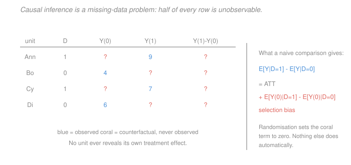

# Econometrics · Lesson 3.1: Potential outcomes and the identification problem

> ⏱ ~15 min · Module 3: Endogeneity and causality · Builds on: [1.2 (the best linear predictor)](01-02-best-linear-predictor.md), [2.6 (the bootstrap)](02-06-bootstrap-and-few-clusters.md) · Unlocks: 3.2 (selection on observables), 3.3 (regression anatomy)

## Why this matters

Modules 1 and 2 built a machine that estimates a feature of a joint distribution and puts an honest interval around it. Nothing in either module licensed the word "effect". This module is about earning that word, and it starts by defining it — because the single most common failure in applied work is not a broken standard error but a well-estimated quantity that answers a different question than the one asked.

The framework here is worth the investment because it converts vague worries ("but maybe it's selection?") into precise, checkable statements about a specific bias term. Once you can write the bias down, you can argue about whether it is zero.

## The idea

Attach two numbers to every unit: what would happen if treated, and what would happen if not. The causal effect for that unit is the difference. This is a definition, not an estimator, and it makes the difficulty immediately visible — **you only ever see one of the two numbers.**

That is the fundamental problem of causal inference: the treatment effect is a difference between an observed quantity and a counterfactual that by construction never occurred. No amount of data collection reveals it for any individual. Causal inference is therefore a *missing-data* problem, and every method in this module is a strategy for filling in the missing half.

The naive comparison — average outcome among the treated minus average among the untreated — fails not because of noise but because the two groups differ in who they are. It decomposes exactly into the effect you want plus a selection term, and the whole game is making that second term zero.

## The formal version

> **Definition (potential outcomes).** For each unit $i$ and binary treatment $D_i\in\{0,1\}$, let $Y_i(1)$ and $Y_i(0)$ be the outcomes that would obtain under treatment and under control. The **individual treatment effect** is $\tau_i = Y_i(1)-Y_i(0)$.

The **observed** outcome relates to these by the *switching equation*
$$Y_i = D_i\,Y_i(1) + (1-D_i)\,Y_i(0) ,$$
which just says you see the one that happened.

Two assumptions are already buried here and both are substantive. **SUTVA** (stable unit treatment value assumption) requires (a) no interference — unit $i$'s outcome does not depend on anyone else's treatment, and (b) a single version of treatment. Interference fails for vaccines, for job-training programs that shift who gets hired, and for anything with equilibrium effects; when it fails, $Y_i(1)$ is not even well defined.

**Estimands.** Since $\tau_i$ is unknowable, target averages:
$$\mathrm{ATE} = E[Y_i(1)-Y_i(0)], \qquad \mathrm{ATT} = E[Y_i(1)-Y_i(0)\mid D_i=1], \qquad \mathrm{ATC} = E[\,\cdot\mid D_i=0] .$$
*In words:* the effect for everyone, for those who actually got treated, and for those who did not. These differ whenever people select into treatment on their expected gains — and people usually do.

> **Theorem (selection-bias decomposition).** For binary $D$,
> $$\underbrace{E[Y\mid D=1]-E[Y\mid D=0]}_{\text{what you can compute}} \;=\; \underbrace{E[Y(1)-Y(0)\mid D=1]}_{\mathrm{ATT}} \;+\; \underbrace{E[Y(0)\mid D=1]-E[Y(0)\mid D=0]}_{\text{selection bias}} .$$

*Proof.* Apply the switching equation to each conditional mean: $E[Y\mid D=1]=E[Y(1)\mid D=1]$ and $E[Y\mid D=0]=E[Y(0)\mid D=0]$. Add and subtract $E[Y(0)\mid D=1]$:
$$E[Y(1)\mid D=1]-E[Y(0)\mid D=0] = \bigl(E[Y(1)\mid D=1]-E[Y(0)\mid D=1]\bigr) + \bigl(E[Y(0)\mid D=1]-E[Y(0)\mid D=0]\bigr) . \square$$

*In words:* the selection-bias term compares the two groups on their **untreated** potential outcome. It asks: absent any treatment, would the treated group have done better or worse than the control group anyway? Whenever the answer is "yes", the naive comparison is contaminated, and the contamination has nothing to do with sample size.

> **Definition (identification).** A parameter is **identified** if it is uniquely determined by the distribution of observable data. Identification is a property of the *population problem*, prior to and independent of estimation.

This distinction is the organising idea of the module. Sampling error shrinks with $n$; identification failure does not. A study with a hundred million observations and an unidentified parameter has a very precise estimate of the wrong thing.

**What randomisation buys.** If $D \perp (Y(1),Y(0))$ — treatment independent of potential outcomes, as under a coin flip — then $E[Y(0)\mid D=1]=E[Y(0)\mid D=0]$, the selection term vanishes, and
$$E[Y\mid D=1]-E[Y\mid D=0] = \mathrm{ATE} = \mathrm{ATT} .$$
Randomisation does not make confounders irrelevant to the outcome; it makes them **independent of treatment**, which is what kills the bias term. That is exactly [1.2](01-02-best-linear-predictor.md) P3's $\pi=0$ condition, arrived at from the causal side.

## Picture

Every row has exactly one blue cell and one coral cell, and the effect column is entirely coral. The table makes the point that no method in this module recovers an individual effect — they recover averages, by borrowing the missing half of one unit's row from a comparable unit's observed half. "Comparable" is where all the difficulty lives.

## Worked examples

**Example 1 (mechanical): selection bias with a sign you can predict.** Suppose a voluntary job-training program. Potential outcomes in thousands of dollars of annual earnings:

| Group | share | $E[Y(0)]$ | $E[Y(1)]$ | true effect |
|---|---|---|---|---|
| enrolled ($D=1$) | $0.3$ | $18$ | $24$ | $+6$ |
| not enrolled ($D=0$) | $0.7$ | $30$ | $34$ | $+4$ |

The ATT is $+6$; the ATE is $0.3(6)+0.7(4) = 1.8+2.8 = 4.6$. What does the naive comparison give?
$$E[Y\mid D=1]-E[Y\mid D=0] = 24 - 30 = -6 .$$
**Negative.** The program appears to *reduce* earnings by 6,000 dollars, while actually raising them by 6,000 for participants. Checking the decomposition:
$$-6 = \underbrace{6}_{\mathrm{ATT}} + \underbrace{(18-30)}_{\text{selection bias} = -12} .\ \checkmark$$

The mechanism is transparent once written down: people who enrol are people with poor labour-market prospects, so $E[Y(0)\mid D=1] = 18 < 30 = E[Y(0)\mid D=0]$. They would have earned less anyway. This sign — programs for the disadvantaged appearing harmful — is the single most common pattern in naive program evaluation.

**Example 2 (why you'd care): ATE and ATT can differ enough to reverse a policy conclusion.** Continue the example. A minister asks: "should we make the program universal?"

The ATT of $+6$ answers a different question — it describes the gain to those who *chose* to enrol. Extending the program to everyone means treating the non-enrolled, whose effect is $\mathrm{ATC} = +4$. If the program costs 5,000 dollars per participant, then:

- for current participants: $6 > 5$, worth doing;
- for the currently non-enrolled: $4 < 5$, **not** worth doing;
- averaged over everyone: $4.6 < 5$, universal provision fails a cost-benefit test.

Same program, same data, opposite recommendations depending on which estimand you report. And notice the economics behind it: people enrol when they expect to gain, so the treated are selected on high $\tau_i$ — which makes $\mathrm{ATT} > \mathrm{ATE}$ generically for voluntary programs. **Selection on gains is a reason ATT and ATE differ even when selection bias is zero**, and the two phenomena are worth keeping apart. Randomisation among volunteers identifies the ATT for volunteers; only randomisation among everyone identifies the ATE.

## Watch out

- **You might think** identification is about having enough data — **but actually** it is about whether the population distribution pins the parameter down at all. If it does not, infinite data does not help. Conversely a parameter can be identified but hopelessly imprecise in any feasible sample, which is a different complaint with a different fix.
- **You might think** "correlation is not causation" is the whole lesson — **but actually** the useful version is sharper: the gap is *exactly* $E[Y(0)\mid D=1]-E[Y(0)\mid D=0]$, a specific quantity you can reason about, sign, and sometimes bound. Vague scepticism does not tell you which direction the estimate is off; the decomposition often does.
- **You might think** SUTVA is a technicality — **but actually** it fails in exactly the settings economists care about most. If training some workers helps them win jobs from untrained workers, the control group's outcomes are affected by the treatment, the "effect" mixes a real gain with displacement, and a well-run randomised trial will still mislead you about the policy's aggregate value.

## One-liner

> A causal effect is a difference between an observed outcome and a counterfactual that never happened, so every method is a strategy for borrowing someone else's observed half — and the naive comparison equals the effect plus a selection term that compares the two groups on what they would have done untreated.

## Problems

**P1 (🟢)** In a population, $E[Y(0)\mid D=1] = 12$, $E[Y(1)\mid D=1] = 20$, $E[Y(0)\mid D=0] = 15$, $E[Y(1)\mid D=0]=21$, with $P(D=1)=0.4$. Compute the naive difference, the ATT, the ATC, the ATE, and the selection bias, and verify the decomposition.

**P2 (🟡)** Show that under random assignment the naive difference identifies the ATE, and show further that this is *not* enough to identify the *variance* of the treatment effect $\operatorname{Var}(\tau_i)$. Explain what extra information would be needed.

**P3 (🔴, optional)** A program is offered to everyone but only some take it up. You observe take-up $D_i$ and outcome $Y_i$. Even with a randomised *offer* $Z_i$, explain why comparing $Y$ between those who took up and those who did not is biased, and name the estimand a randomised offer *does* identify. Then derive Manski's worst-case bounds on the ATE when $Y\in[0,1]$ and no assumption beyond SUTVA is made, and evaluate their width.

Solutions

**P1** *Naive difference.* Observed means are $E[Y\mid D=1] = E[Y(1)\mid D=1] = 20$ and $E[Y\mid D=0]=E[Y(0)\mid D=0] = 15$, so
$$\text{naive} = 20-15 = 5 .$$

*ATT and ATC.*
$$\mathrm{ATT} = E[Y(1)-Y(0)\mid D=1] = 20-12 = 8, \qquad \mathrm{ATC} = 21-15 = 6 .$$

*ATE.* Weight by group shares, $P(D=1)=0.4$:
$$\mathrm{ATE} = 0.4(8)+0.6(6) = 3.2+3.6 = 6.8 .$$

*Selection bias.*
$$E[Y(0)\mid D=1]-E[Y(0)\mid D=0] = 12-15 = -3 .$$

*Verification.* $\mathrm{ATT} + \text{bias} = 8 + (-3) = 5 = $ naive difference. $\checkmark$

Reading it: the treated would have done worse untreated ($12$ against $15$), so the naive comparison **understates** the ATT, reporting $5$ instead of $8$. Note also $\mathrm{ATT}=8 > \mathrm{ATC}=6$, the selection-on-gains pattern — those with more to gain took it up.

**P2** *Identification of the ATE.* Under $D\perp(Y(1),Y(0))$, conditioning on $D$ does not change the distribution of potential outcomes:
$$E[Y\mid D=1] = E[Y(1)\mid D=1] = E[Y(1)], \qquad E[Y\mid D=0] = E[Y(0)\mid D=0] = E[Y(0)] .$$
Subtracting, $E[Y\mid D=1]-E[Y\mid D=0] = E[Y(1)]-E[Y(0)] = \mathrm{ATE}$. And since independence also gives $E[\tau\mid D=1]=E[\tau]$, the ATT equals the ATE too.

*Why the variance is not identified.* We have
$$\operatorname{Var}(\tau_i) = \operatorname{Var}(Y_i(1)) + \operatorname{Var}(Y_i(0)) - 2\operatorname{Cov}(Y_i(1),Y_i(0)) .$$
Randomisation identifies the two **marginal** distributions of $Y(1)$ and $Y(0)$ — hence both variances — because the treated group is a random sample of the population for $Y(1)$ and the control group for $Y(0)$. But the covariance requires the **joint** distribution of $(Y_i(1),Y_i(0))$, and no unit ever contributes an observation of the pair. The data are silent on it: any covariance consistent with the two marginals is equally compatible with what you see.

*What would help.* Several routes, none free: (a) assume a constant effect, $\tau_i = \tau$ for all $i$, which forces $\operatorname{Var}(\tau)=0$ and perfect correlation of the potential outcomes; (b) assume rank invariance — each unit holds the same rank in both distributions — which pins the copula to the comonotonic one and delivers a point estimate; (c) collect repeated measurements, such as a crossover design where the same unit is observed under both conditions at different times, which observes the pair directly at the cost of assuming no carryover; (d) abandon point identification and report **Fréchet–Hoeffding bounds** on the covariance, which are valid but usually wide. The general principle worth carrying: **randomisation identifies marginals, never joints.** Any quantity requiring the joint distribution of potential outcomes — the variance of the effect, the fraction who benefit, quantiles of $\tau$ — is not identified by an experiment alone.

**P3** *Why comparing takers to non-takers is biased.* Take-up is a **choice**, so $D_i$ is selected even when the offer $Z_i$ is randomised. Among those offered, the people who accept differ from those who decline on motivation, information and expected gain — exactly the selection problem the randomisation was meant to remove. Randomising $Z$ makes $Z$ independent of potential outcomes; it does nothing to make $D$ independent of them. Formally, $E[Y(0)\mid D=1]\neq E[Y(0)\mid D=0]$ in general, and the selection-bias term is back.

*What the randomised offer identifies.* Comparing outcomes by *offer* rather than take-up identifies the **intention-to-treat** effect,
$$\mathrm{ITT} = E[Y\mid Z=1]-E[Y\mid Z=0] ,$$
which is a genuine causal effect — the effect of *being offered* the program. It is often the policy-relevant quantity, since a government can offer a program but cannot compel uptake. Scaling the ITT by the take-up rate gives the LATE for compliers, which is [3.6](03-06-instrumental-variables.md)'s subject; the randomised offer is an instrument for take-up.

*Manski's worst-case bounds.* Suppose $Y\in[0,1]$ and let $p = P(D=1)$. Write
$$E[Y(1)] = p\,E[Y(1)\mid D=1] + (1-p)\,E[Y(1)\mid D=0] .$$
The first term is observed ($=p\,E[Y\mid D=1]$); the second is entirely unobserved and can be anything in $[0,1]$. So
$$p\,E[Y\mid D=1] \ \le\ E[Y(1)]\ \le\ p\,E[Y\mid D=1] + (1-p) .$$
Symmetrically, with $E[Y(0)] = p\,E[Y(0)\mid D=1] + (1-p)E[Y\mid D=0]$,
$$(1-p)E[Y\mid D=0] \ \le\ E[Y(0)]\ \le\ (1-p)E[Y\mid D=0] + p .$$
Combining, the ATE is bounded by
$$\mathrm{ATE} \in \Bigl[\,p E[Y\mid D=1] - (1-p)E[Y\mid D=0] - p,\ \ p E[Y\mid D=1] - (1-p)E[Y\mid D=0] + (1-p)\,\Bigr] .$$

*Width.* Subtracting the endpoints, the width is
$$\bigl[p + (1-p)\bigr] = 1 ,$$
**exactly the range of the outcome, regardless of $p$ or of anything in the data.** The bounds always have width 1, and since the ATE itself must lie in $[-1,1]$, they cut the a priori range only in half and **always contain zero** — the identified set never excludes "no effect".

The lesson is the one Manski intended: with no assumptions beyond SUTVA, the data are almost uninformative about the ATE. Every point estimate in this module is bought with an assumption, and the honest question is never "did you assume something?" but "which assumption, and is it defensible here?" Bounds tighten quickly once you add credible restrictions — monotone treatment response, monotone selection, or an instrument — which is exactly what the rest of Module 3 does.

## Flashback

**From Lesson 2.6 (the bootstrap and inference with few clusters):** A cluster-randomised trial assigns 5 villages to treatment and 5 to control, and you plan to use randomization inference on the sharp null of no effect. How many distinct assignments are there, what is the smallest attainable two-sided p-value, and is a 5 percent test possible? Now suppose funding is cut to 3 versus 3 — answer the same three questions and say what you would tell the funder.

Solution

*Five versus five.* The number of distinct assignments is
$$\binom{10}{5} = 252 ,$$
so the smallest attainable two-sided $p$-value (the observed assignment plus its mirror image) is
$$\frac{2}{252} = 0.00794 .$$
Since $0.00794 < 0.05$, a 5 percent test is comfortably possible — indeed anything down to about 0.8 percent is attainable, so the grid is fine enough that the discreteness is not binding.

*Three versus three.*
$$\binom{6}{3} = 20, \qquad \text{smallest two-sided } p = \frac{2}{20} = 0.10 .$$
**A 5 percent test does not exist.** Even if the three treated villages post the three highest outcomes in the entire sample — the most extreme result the design can produce — the $p$-value is $0.10$. The test can never reject at conventional levels, whatever the true effect.

*What to tell the funder.* Not "the study will be underpowered", which sounds like a matter of degree, but something sharper: **at 3 versus 3 the study cannot produce a statistically significant result under its own pre-specified inference procedure, regardless of how large the effect turns out to be.** That is a design failure, not a power shortfall, and no analysis choice made later can repair it.

Then offer the options, because they differ in cost. Going to 4 versus 4 restores feasibility ($\binom{8}{4}=70$, minimum $p = 0.0286$), though only the single most extreme outcome clears 5 percent — so it is feasible in principle and still nearly powerless in practice. Going to 5 versus 5 gives real room. Alternatively, keep 6 villages but randomise *within* them at the household level, if the treatment permits it — that changes the unit of randomisation and hence the number of assignments enormously, though it introduces the interference concerns this lesson's SUTVA discussion raises, since untreated households in a treated village may be affected.

The connecting point to this lesson: randomization inference is defined directly on potential outcomes under the sharp null $Y_i(1)=Y_i(0)$ for every $i$, which is why it needs no asymptotics and no distributional assumption at all. Its only currency is the number of assignments the randomisation could have produced — and that is fixed at the design stage, before any data exist.

## Connections

- **Backward:** the selection-bias term is [1.2](01-02-best-linear-predictor.md)'s omitted-variable structure written in causal language, and the randomisation result is that lesson's $\pi=0$ condition. [2.6](02-06-bootstrap-and-few-clusters.md)'s randomization inference is the natural inference procedure for the sharp null in this framework, since it is defined directly on potential outcomes.
- **Forward:** [3.2](03-02-selection-on-observables-propensity-score.md) tries to kill the selection term by conditioning; [3.3](03-03-regression-anatomy-good-and-bad-controls.md) asks what regression actually averages when you do; [3.6](03-06-instrumental-variables.md) gives up on conditioning and finds exogenous variation instead. The ATT/ATE distinction returns in [3.8](03-08-weak-instruments-and-late.md) as the LATE, and in [4.3](04-03-difference-in-differences.md) where DiD identifies an ATT and nothing more.
- **Sideways:** this is the observational-data version of experimental design — the potential-outcomes framework is Neyman's, developed for agricultural field trials, and the quasi-experiments of Module 4 are attempts to manufacture the randomisation that a field trial gets for free. The [`grad-micro` 2.6](../../grad-micro/lessons/02-06-revealed-preference.md) point that choices reveal preferences is the same fact read as a warning: if people chose their treatment, their choice encodes information about their outcomes, and that is precisely the bias.
