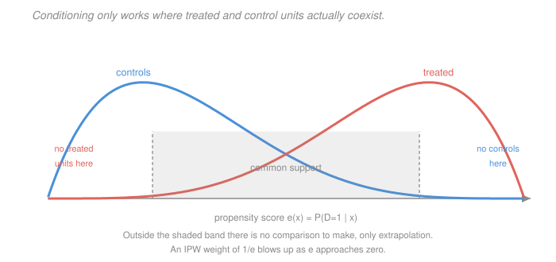

# Econometrics · Lesson 3.2: Selection on observables

> ⏱ ~15 min · Module 3: Endogeneity and causality · Builds on: [3.1 (potential outcomes)](03-01-potential-outcomes-identification.md), [2.7 (multiple testing and specification search)](02-07-multiple-testing-specification-search.md) · Unlocks: 3.3 (regression anatomy), 3.4 (omitted-variable bias)

## Why this matters

[3.1](03-01-potential-outcomes-identification.md) left you with a bias term: the treated and control groups differ in what they would have done untreated. The first and most natural response is to *make them comparable* — find control units who look like the treated ones on everything you measured, and compare within those matched groups.

This is the workhorse of applied economics. It is also the design whose assumption is least testable and most often oversold. Both facts deserve equal time: the machinery is genuinely useful, and the phrase "we control for observables" is doing enormous unexamined work every time it appears.

## The idea

If treated and control units with the *same* characteristics $X$ are otherwise exchangeable — if, within a cell defined by $X$, treatment is as good as randomly assigned — then you can run [3.1](03-01-potential-outcomes-identification.md)'s argument cell by cell and average the results.

That is the whole strategy. Two things can go wrong, and they are different in kind.

**The assumption can fail.** If people select on something you did not measure — motivation, health, private information about their own gains — conditioning on what you *did* measure leaves the bias intact. This is untestable, because the offending variable is by definition absent from your data.

**The overlap can fail.** Even if the assumption holds, you need treated *and* control units at each value of $X$ to make a comparison. Where there are none of one kind, there is nothing to compare, and any answer your software returns is extrapolation from the functional form rather than evidence.

The propensity score is a device that makes both problems tractable: it collapses a high-dimensional $X$ into a single number, which is enough for the conditioning to work and makes the overlap problem visible in one dimension.

## The formal version

> **Assumption (conditional independence / unconfoundedness).**
> $$\bigl(Y(1),\,Y(0)\bigr) \ \perp\ D \ \bigm|\ X .$$

*In words:* among units with identical $X$, who got treated is unrelated to how they would have responded. Also called **selection on observables**, **ignorability**, or **CIA**.

> **Assumption (overlap / common support).** $0 < P(D=1\mid X=x) < 1$ for all $x$ in the support.

*In words:* at every value of the covariates, both treatment and control are possible. Without this, some cells contain only one kind of unit.

> **Theorem (identification under CIA and overlap).**
> $$\mathrm{ATE} = E_X\Bigl[\,E[Y\mid D=1,X] - E[Y\mid D=0,X]\,\Bigr] ,$$
> and $\mathrm{ATT}$ is the same average taken over the distribution of $X$ **among the treated**.

*Proof sketch.* Within a cell $X=x$, CIA gives $E[Y\mid D=1,X=x] = E[Y(1)\mid X=x]$ and likewise for control, so the within-cell difference is the conditional average treatment effect $\tau(x)$. Averaging $\tau(x)$ over the marginal distribution of $X$ gives the ATE; over the treated distribution gives the ATT. The two differ whenever $\tau(x)$ varies with $x$ and the treated are distributed differently in $X$.

> **Definition (propensity score).** $e(x) = P(D=1 \mid X=x)$.

> **Theorem (Rosenbaum–Rubin).** If CIA holds given $X$, then it holds given $e(X)$ alone:
> $$\bigl(Y(1),Y(0)\bigr)\perp D \mid X \quad\Longrightarrow\quad \bigl(Y(1),Y(0)\bigr)\perp D\mid e(X) .$$
> Moreover $D\perp X \mid e(X)$ — the score is a **balancing score**.

*In words:* you do not need to match on twenty covariates; matching on one number, the estimated probability of treatment, suffices. This is a genuine dimension reduction, and it is why propensity-score methods exist.

**Three estimators built on this.**

*Matching.* For each treated unit find the $k$ nearest control units (on $X$ or on $e(X)$) and average their outcomes as the counterfactual. Simple, transparent, and the standard errors need care — Abadie and Imbens showed the naive bootstrap is invalid for matching estimators.

*Inverse-probability weighting (IPW).* Reweight so the control group resembles the treated:
$$\widehat{\mathrm{ATE}} = \frac1n\sum_i\left[\frac{D_iY_i}{\hat e(x_i)} - \frac{(1-D_i)Y_i}{1-\hat e(x_i)}\right] .$$
*In words:* an under-represented treated unit (low $e$) stands in for many like it, so it gets a large weight. The formula's danger is visible in it: as $\hat e\to 0$ the weight explodes, and one unit with $\hat e = 0.01$ carries the weight of a hundred typical units.

*Regression adjustment.* Fit $E[Y\mid D,X]$ and average the predicted difference. **Doubly robust** estimators combine weighting and regression and are consistent if *either* the propensity model or the outcome model is right — a genuinely useful insurance policy, and the modern default.

**Diagnostics that matter.** Report the overlap plot. Report **standardised differences** in covariate means before and after adjustment (a common rule is that anything above $0.1$ in absolute value remains unbalanced), rather than $t$-tests of balance — balance $t$-tests are a many-tests problem in the sense of [2.7](02-07-multiple-testing-specification-search.md) and they mechanically improve as you *drop* observations, which is backwards.

## Picture

Inside the shaded band, both kinds of unit exist and comparison is possible. Outside it, one group is empty: at $e\approx 0.03$ there are essentially no treated units, so any "estimated effect" there comes from the model's functional form, not from data. Trimming to the common support is honest but changes the estimand — you are now estimating an effect for the *overlapping* subpopulation, and you must say so.

## Worked examples

**Example 1 (mechanical): stratification by hand.** A training program, two strata by prior education:

| Stratum | $N$ | treated | $\bar Y$ treated | control | $\bar Y$ control | $\tau(x)$ |
|---|---|---|---|---|---|---|
| Low education | $600$ | $300$ | $22$ | $300$ | $19$ | $+3$ |
| High education | $400$ | $100$ | $35$ | $300$ | $34$ | $+1$ |

*Naive comparison* (pooling): treated mean $= \frac{300(22)+100(35)}{400} = \frac{6600+3500}{400} = 25.25$; control mean $=\frac{300(19)+300(34)}{600} = \frac{5700+10200}{600} = 26.5$. Difference $= -1.25$ — the program looks harmful.

*Stratified (ATE)*, weighting each stratum by its share of the population:
$$\mathrm{ATE} = \frac{600}{1000}(3) + \frac{400}{1000}(1) = 1.8+0.4 = 2.2 .$$

*Stratified (ATT)*, weighting by the treated distribution ($300$ and $100$ treated units):
$$\mathrm{ATT} = \frac{300}{400}(3)+\frac{100}{400}(1) = 2.25+0.25 = 2.5 .$$

The naive figure is negative because high-education people have higher outcomes and are less likely to be treated — a composition effect entirely removed by conditioning. Note ATE and ATT differ ($2.2$ against $2.5$) purely because the treated are over-represented in the high-effect stratum.

**Example 2 (why you'd care): LaLonde's verdict on this whole approach.** In 1986 Robert LaLonde ran the definitive test. He took a randomised job-training experiment — which gives the true effect by construction, around 1,800 dollars — then *discarded* the experimental control group and replaced it with a non-experimental comparison group from survey data. He then applied the era's standard observational estimators.

The results ranged from roughly $-15{,}000$ to $+3{,}000$ dollars depending on the estimator and comparison group. Many were the wrong sign. The experimental benchmark sat in the middle of a range so wide it was useless.

The story has a second act. Dehejia and Wahba (1999) revisited the same data with propensity-score methods and *did* recover something close to the experimental estimate — but only after aggressive trimming to the common support, and Smith and Todd later showed the result was sensitive to which subsample and which specification was used. The honest summary is: propensity-score methods help, they are not magic, and their performance depends on whether the covariates actually capture the selection process.

The practical lesson that survived is about **design, not estimator**: the comparison group matters more than the technique. The observational estimates worked best when the comparison group came from the same local labour market, was screened on the same eligibility rules, and had the same pre-treatment earnings *trajectory* — that last condition is the one that motivates Module 4's panel methods, which condition on unobserved fixed traits rather than measured ones.

## Watch out

- **You might think** adding more controls always reduces bias — **but actually** it can create bias. Controlling for a variable affected by treatment, or for a common effect of treatment and outcome, actively introduces confounding. [3.3](03-03-regression-anatomy-good-and-bad-controls.md) is entirely about which controls help and which hurt.
- **You might think** balance tests confirm the CIA — **but actually** they confirm balance on the covariates you *have*. The CIA is a statement about the ones you do not have, and no test on observed data can speak to it. Good balance on twenty covariates is consistent with catastrophic imbalance on the twenty-first.
- **You might think** a propensity score close to 0 or 1 is just an efficiency issue — **but actually** it is an identification issue. At $e(x)=0$ there are no treated units at that $x$ and the conditional effect is not identified at all; the estimator will still return a number, produced by extrapolating the functional form. **Always plot the overlap before reporting anything.**

## One-liner

> Conditioning on observables identifies the effect only if treatment is as-good-as-random within cells of $X$ and both kinds of unit exist in every cell — the first is untestable, the second is checkable in one dimension via the propensity score, and you should never report the estimate without showing the overlap plot.

## Problems

**P1 (🟢)** Two strata: stratum A has 800 units (200 treated, mean $Y=14$; 600 control, mean $Y=10$); stratum B has 200 units (150 treated, mean $Y=25$; 50 control, mean $Y=22$). Compute the naive difference, the stratified ATE, and the stratified ATT, and explain the gap between the naive and stratified figures.

**P2 (🟡)** Show that under CIA and overlap, the IPW estimand $E\left[\dfrac{DY}{e(X)}\right]$ equals $E[Y(1)]$. Then explain what goes wrong as $e(X)\to 0$ for some units, and describe two practical remedies.

**P3 (🔴, optional)** Prove the Rosenbaum–Rubin balancing property: if $(Y(1),Y(0))\perp D\mid X$, then $(Y(1),Y(0))\perp D\mid e(X)$. Then explain why this does *not* mean you can ignore $X$ once you have $e(X)$ — identify what is lost.

Solutions

**P1** *Naive difference.* Pooled treated mean:
$$\frac{200(14)+150(25)}{350} = \frac{2800+3750}{350} = \frac{6550}{350} = 18.714286 .$$
Pooled control mean:
$$\frac{600(10)+50(22)}{650} = \frac{6000+1100}{650} = \frac{7100}{650} = 10.923077 .$$
Naive difference $= 18.714286 - 10.923077 = 7.791209$.

*Stratum effects.* $\tau_A = 14-10 = 4$ and $\tau_B = 25-22 = 3$.

*ATE*, weighting by population shares $800/1000$ and $200/1000$:
$$\mathrm{ATE} = 0.8(4)+0.2(3) = 3.2+0.6 = 3.8 .$$

*ATT*, weighting by treated counts $200$ and $150$ out of $350$:
$$\mathrm{ATT} = \frac{200}{350}(4)+\frac{150}{350}(3) = \frac{800+450}{350} = \frac{1250}{350} = 3.571429 .$$

*The gap.* The naive figure ($7.79$) is more than double the stratified ones ($3.8$, $3.57$). The cause is composition: stratum B has much higher outcomes overall ($\approx 24$ versus $\approx 11$) **and** a far higher treatment rate ($150/200 = 75\%$ versus $200/800 = 25\%$). So the treated group is loaded with high-$Y$ stratum-B units while the control group is loaded with low-$Y$ stratum-A units, and most of the naive difference is that composition rather than any effect. Conditioning removes it.

Note also $\mathrm{ATT} < \mathrm{ATE}$ here, because the treated are concentrated in stratum B, which has the *smaller* effect ($3 < 4$) — the reverse of the usual selection-on-gains pattern, and a reminder that the direction is an empirical matter.

**P2** *The identity.* Apply the law of iterated expectations, conditioning on $X$:
$$E\left[\frac{DY}{e(X)}\right] = E\left[ E\left[\frac{D\,Y}{e(X)}\,\Big|\,X\right]\right] = E\left[\frac{1}{e(X)}E\bigl[D\,Y(1)\mid X\bigr]\right] ,$$
where we used the switching equation ($DY = D\,Y(1)$, since $Y = Y(1)$ whenever $D=1$) and pulled out $e(X)$, a function of $X$. Now CIA lets $D$ and $Y(1)$ separate inside the conditional expectation:
$$E[D\,Y(1)\mid X] = E[D\mid X]\,E[Y(1)\mid X] = e(X)\,E[Y(1)\mid X] .$$
Substituting,
$$E\left[\frac{DY}{e(X)}\right] = E\Bigl[\frac{e(X)E[Y(1)\mid X]}{e(X)}\Bigr] = E\bigl[E[Y(1)\mid X]\bigr] = E[Y(1)] .\ \checkmark$$
(Overlap is what makes the division by $e(X)$ legitimate — with $e(X)=0$ on a set of positive probability the expression is undefined.) The symmetric argument with $(1-D)Y/(1-e(X))$ gives $E[Y(0)]$, and the difference is the ATE.

*What goes wrong as $e(X)\to 0$.* Three compounding failures. (i) The weights $1/e$ explode, so a handful of observations dominate the estimate — the effective sample size collapses even though $n$ is unchanged. (ii) The estimator's variance becomes very large and, in the limit, infinite; the asymptotic normal approximation degrades badly well before that. (iii) Worst, $e$ is *estimated*, so a unit whose true score is $0.02$ might be estimated at $0.002$, giving it ten times the weight it deserves — and small errors in the tail of a logit produce enormous errors in the reciprocal. The result is an estimate driven by a few observations whose weights are essentially noise.

*Two remedies.* **Trimming**: drop observations with $\hat e$ outside $[0.1, 0.9]$ (or the data-driven rule of Crump and coauthors), accepting that you now estimate an effect for the trimmed subpopulation and saying so explicitly. **Weight stabilisation or normalisation**: use Hájek weights, dividing by $\sum_i D_i/\hat e_i$ rather than by $n$, which bounds the influence of any single observation and is nearly always better behaved; overlap weights $e(1-e)$ go further, smoothly downweighting the tails and targeting a well-defined weighted estimand. A third option worth naming is to use a **doubly robust** estimator, which is far less sensitive to propensity-score error because the outcome model catches what the weights miss.

**P3** *Proof.* It suffices to show $P(D=1\mid Y(1),Y(0),e(X)) = P(D=1\mid e(X))$. Compute the left side by iterating expectations over $X$, conditioning on the potential outcomes and $e(X)$:
$$P\bigl(D=1\mid Y(1),Y(0),e(X)\bigr) = E\Bigl[\,P\bigl(D=1\mid Y(1),Y(0),X\bigr)\ \Big|\ Y(1),Y(0),e(X)\Bigr] .$$
By CIA, the inner probability does not depend on the potential outcomes:
$$P\bigl(D=1\mid Y(1),Y(0),X\bigr) = P(D=1\mid X) = e(X) .$$
So the outer expectation is $E[e(X)\mid Y(1),Y(0),e(X)] = e(X)$, since $e(X)$ is being conditioned on. Hence
$$P\bigl(D=1\mid Y(1),Y(0),e(X)\bigr) = e(X) .$$
The same calculation without the potential outcomes gives $P(D=1\mid e(X)) = E[e(X)\mid e(X)] = e(X)$. The two are equal, so $D$ is independent of $(Y(1),Y(0))$ given $e(X)$. $\square$

(The balancing property $D\perp X\mid e(X)$ follows by the identical argument with $X$ in place of the potential outcomes: $P(D=1\mid X, e(X)) = e(X) = P(D=1\mid e(X))$.)

*What is lost.* Three things, and they matter in practice.

1. **Efficiency.** Conditioning on the full $X$ can reduce residual variance a great deal if $X$ predicts $Y$ well, even beyond what it does for $D$. The score is sufficient for *removing bias*, not for *maximising precision*. Covariates that strongly predict the outcome but not treatment should still be included in the outcome model.
2. **Heterogeneity.** $e(X)$ is a one-dimensional summary, so effects conditional on the score, $\tau(e)$, are averages over all the different $x$ values sharing that score. If you want to know how the effect varies with education or age, the score cannot tell you — you must go back to $X$.
3. **The score is estimated.** The theorem is about the *true* $e(X)$. In practice you fit a model for it, and if that model is misspecified the balancing property does not hold. This is why balance must be *checked* on $X$ after matching on $\hat e$, rather than assumed from the theorem — and why doubly robust methods, which do not stake everything on the score model, have become standard.

## Flashback

**From Lesson 2.7 (multiple testing and specification search):** After matching, you test balance on 25 covariates at the 5 percent level and find 2 significant imbalances. A colleague says this proves the matching failed. Compute what you would expect under perfect balance, and say what you would report instead.

Solution

*What to expect under perfect balance.* If matching worked perfectly, all 25 nulls are true, and each test rejects with probability $0.05$. The expected number of rejections is
$$25\times 0.05 = 1.25 ,$$
and the probability of at least one is
$$1-0.95^{25} = 1-0.2774 = 0.7226 .$$
So finding **2 significant imbalances out of 25 is entirely unremarkable** — it is slightly above the expected $1.25$, and the probability of seeing 2 or more when everything is perfectly balanced is
$$1 - P(0) - P(1) = 1 - 0.2774 - 25(0.05)(0.95)^{24} = 1 - 0.2774 - 0.3650 = 0.3576 ,$$
better than a one-in-three chance. The colleague's inference is backwards: near-*zero* rejections across 25 tests would be the surprising outcome, and would suggest the tests were underpowered rather than that balance was excellent.

*What to report instead.* Balance $t$-tests are the wrong tool here, for a reason beyond the multiple-comparisons arithmetic: **their power depends on sample size, so they conflate "balanced" with "imprecisely measured".** Dropping observations in a matching procedure *mechanically* raises $p$-values and makes balance look better — precisely backwards as a diagnostic.

Report **standardised differences** instead:
$$\mathrm{SD}_j = \frac{\bar x_{j,\text{treated}} - \bar x_{j,\text{control}}}{\sqrt{(s^2_{j,\text{treated}}+s^2_{j,\text{control}})/2}} ,$$
which measures imbalance in units of the covariate's own spread and does **not** depend on $n$. The conventional threshold is $|\mathrm{SD}| < 0.1$. Present them before and after matching, ideally as a "love plot" — a dot chart with one row per covariate showing both — so a reader can see at a glance which covariates improved and which did not. Add variance ratios and, for the covariates you most care about, a comparison of full distributions rather than just means, since matching can equalise means while leaving the tails badly mismatched.

The connection to this lesson's main argument: **none of these diagnostics tests the CIA.** They test whether your procedure balanced the variables you have. Perfect standardised differences on 25 covariates say nothing about the 26th you never measured, which is the one the whole design rests on.

## Connections

- **Backward:** this attacks [3.1](03-01-potential-outcomes-identification.md)'s selection-bias term directly by making it zero within cells. The balance-testing problem is [2.7](02-07-multiple-testing-specification-search.md)'s multiple comparisons in a specific applied costume.
- **Forward:** [3.3](03-03-regression-anatomy-good-and-bad-controls.md) shows that running a regression with controls is *not* the same as the stratified average computed here, and says exactly how they differ. [3.4](03-04-omitted-variable-bias.md) quantifies what CIA failure costs. [4.1](04-01-panel-data-fixed-effects.md) offers an alternative when the confounder is unmeasured but time-invariant — a very different bet on the same problem.
- **Sideways:** estimating $e(x)$ is a pure prediction problem, so machine-learning methods apply directly — and the double/debiased machine-learning literature exists to make that legitimate, since naively plugging a flexible first-stage predictor into a causal estimator introduces regularisation bias. [`statistical-learning` 1.3](../../statistical-learning/lessons/01-03-overfitting-and-train-validation-test.md)'s cross-fitting is the tool that repairs it.
