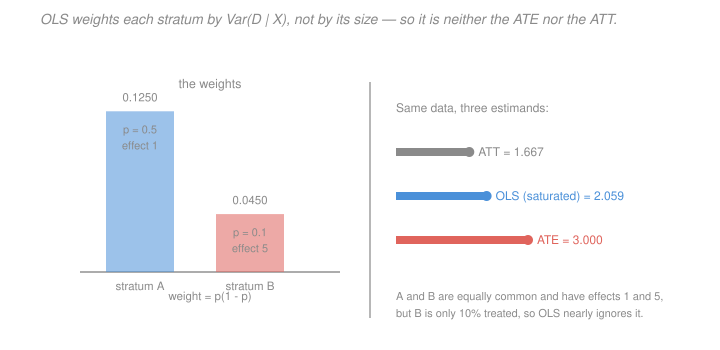

# Econometrics · Lesson 3.3: Regression anatomy — good and bad controls

> ⏱ ~15 min · Module 3: Endogeneity and causality · Builds on: [3.1 (potential outcomes)](03-01-potential-outcomes-identification.md), [1.6 (functional form)](01-06-functional-form-logs-interactions.md) · Unlocks: 3.4 (omitted-variable bias), 4.3 (difference-in-differences)

## Why this matters

[3.2](03-02-selection-on-observables-propensity-score.md) said: if the CIA holds, average the within-cell differences. Nobody does that. Everybody runs a regression with controls on the right-hand side and reads the treatment coefficient. This lesson asks whether those are the same thing.

They are not, and the gap has two parts. Even when the CIA holds perfectly, OLS returns a *particular weighted average* of conditional effects that is generally neither the ATE nor the ATT. And separately, the reflex "add another control, it can only help" is false — some controls create bias where none existed. Both errors are extremely common and both are avoidable once you can see the mechanism.

## The idea

By Frisch–Waugh–Lovell ([1.3](01-03-ols-algebra-geometry-projection.md)), the coefficient on $D$ in a regression with controls is the slope from regressing $Y$ on the part of $D$ that the controls cannot predict. So OLS uses only the *residual* variation in treatment — and where there is little residual variation, that cell contributes little.

That gives the weighting immediately: cells where treatment is nearly all-or-nothing have almost no residual variation and count for almost nothing, while cells where treatment is near a coin flip have the most and count for the most. The weights are $\operatorname{Var}(D\mid X)$, which for binary $D$ is $e(x)(1-e(x))$ — maximised at $e = 1/2$.

That is a strange thing for a policy estimate to be. It is not wrong, but it answers "what is the effect, averaged in a way determined by treatment probabilities" rather than any question you asked.

The bad-controls problem has a different source. Regression is symmetric in its inputs — it does not know which variables are causes and which are consequences. Controlling for something that sits *between* treatment and outcome removes part of the effect you wanted. Controlling for a **collider** — something jointly caused by treatment and outcome — creates a spurious association from nothing.

## The formal version

**Regression anatomy.** With $D$ binary and controls $X$ entered *saturated* (a full set of dummies for every value of $X$), the OLS coefficient on $D$ is

> $$\hat\beta_D \ \xrightarrow{p}\ \frac{E\bigl[\sigma_D^2(X)\,\tau(X)\bigr]}{E\bigl[\sigma_D^2(X)\bigr]}, \qquad \sigma_D^2(X) = \operatorname{Var}(D\mid X) = e(X)\bigl(1-e(X)\bigr) ,$$

where $\tau(x) = E[Y(1)-Y(0)\mid X=x]$ is the conditional average treatment effect.

*In words:* OLS returns a **variance-weighted average of conditional effects**, with weights proportional to how much treatment varies within each cell. Compare:
$$\mathrm{ATE} = E[\tau(X)] \quad\text{(weights: cell sizes)}, \qquad \mathrm{ATT} = \frac{E[e(X)\tau(X)]}{E[e(X)]} \quad\text{(weights: treated counts)} .$$
All three are weighted averages of the same $\tau(x)$, differing only in the weights. They coincide when $\tau(x)$ is constant, and can differ substantially otherwise.

The weights are non-negative, so with a saturated specification the OLS coefficient at least lies inside the range of the $\tau(x)$. **This guarantee fails once the controls are not saturated** — a linear-in-$X$ specification can produce negative implicit weights, and the estimate can fall outside the range of every conditional effect. That failure is the same mechanism that breaks staggered difference-in-differences in [4.5](04-05-staggered-adoption-modern-did.md).

**Good and bad controls.** Write the causal structure explicitly. Let $D$ be treatment, $Y$ the outcome.

> **Good control (confounder).** $W$ causes both $D$ and $Y$. Omitting it biases the estimate; including it removes the bias. *Example:* parental income affects both college attendance and earnings.

> **Bad control 1 (mediator / post-treatment).** $D$ causes $W$, and $W$ causes $Y$. Controlling for $W$ removes the part of the effect that operates *through* $W$, leaving only the direct effect. *Example:* controlling for occupation when estimating the effect of education on wages — much of education's payoff *is* getting a better occupation.

> **Bad control 2 (collider).** $D$ and $Y$ both cause $W$. Conditioning on $W$ induces a spurious association between $D$ and $Y$ even if none exists. *Example:* conditioning on being hired when both talent and credentials raise the chance of being hired.

Colliders are the counter-intuitive one and deserve a mechanism, not just a label. If two independent causes both raise the chance of an event, then among cases where the event occurred, learning that one cause was absent makes the other more likely — because *something* had to produce the event. The association is manufactured by the conditioning.

**Selection bias is collider bias.** Conditioning on being *in the sample* is conditioning on a variable, and if sample inclusion depends on both treatment and outcome, that is a collider. This is why survivorship bias, attrition, and "we restrict to employed workers" are the same statistical phenomenon.

**The practical rule.** Controls should be things determined **before** treatment. Anything measured after treatment is suspect, and a variable that treatment could have affected is not a control — it is an outcome. If you find yourself controlling for something because "it improves the fit", reread [1.5](01-05-goodness-of-fit-interpretation.md).

## Picture

Two equally-sized strata, with effects $1$ and $5$. Stratum B has the large effect but is only 10 percent treated, so its variance weight $0.1(0.9)=0.09$ is well below stratum A's $0.5(0.5) = 0.25$. OLS lands at $2.06$, closer to A's effect of $1$; the ATE is $3.00$; the ATT is $1.67$. **Three defensible numbers from one dataset**, and the difference is entirely about weights.

## Worked examples

**Example 1 (mechanical): the three estimands, computed.** Two strata, each half the population. Stratum A: $e_A = 0.5$, $\tau_A = 1$. Stratum B: $e_B = 0.1$, $\tau_B = 5$.

*Variance weights:*
$$w_A = 0.5\times 0.5(0.5) = 0.125, \qquad w_B = 0.5\times 0.1(0.9) = 0.045, \qquad w_A+w_B = 0.17 .$$
Normalised: $0.7353$ and $0.2647$.

*OLS (saturated):*
$$\hat\beta_D = \frac{0.125(1)+0.045(5)}{0.17} = \frac{0.125+0.225}{0.17} = \frac{0.35}{0.17} = 2.0588 .$$

*ATE:* $0.5(1)+0.5(5) = 3.000$.

*ATT:* weights proportional to $\text{share}\times e$, namely $0.5(0.5)=0.25$ and $0.5(0.1)=0.05$:
$$\mathrm{ATT} = \frac{0.25(1)+0.05(5)}{0.30} = \frac{0.25+0.25}{0.30} = \frac{0.5}{0.3} = 1.6667 .$$

A simulation with 4 million observations returns an OLS coefficient of $2.061$, confirming $2.0588$. The three numbers are $1.67$, $2.06$, $3.00$ — a factor of $1.8$ between the extremes, from identical data with no bias anywhere.

**Example 2 (why you'd care): controlling for occupation destroys the answer.** You want the effect of a college degree on earnings. You have the CIA (suppose parental background is fully measured), so the design is sound. A referee suggests adding occupation dummies "to compare like with like".

What happens: college causes occupation, and occupation causes earnings. Controlling for occupation asks *"among lawyers, do college graduates earn more than non-graduates?"* — a question whose answer is nearly zero, and which has almost nothing to do with the value of college. You have removed the main channel through which the effect operates.

Concretely, suppose the total effect of college is $+0.40$ log points, of which $0.30$ runs through occupational access and $0.10$ is a within-occupation productivity effect. Controlling for occupation returns roughly $0.10$ — a 75 percent understatement of the policy-relevant quantity.

Worse, it is not even a clean estimate of the direct effect. Occupation is a collider on any path where an unobserved trait (ambition, say) affects both occupation and earnings: conditioning on occupation opens that path and introduces bias in an unknown direction. **A mediator that shares an unobserved cause with the outcome is both a bad control and a collider**, so the "direct effect" you get is contaminated too. Recovering direct and indirect effects separately is possible but needs the extra assumptions of formal mediation analysis, not a dummy variable.

The general test to apply before adding any control: **could the treatment have changed this variable?** If yes, it is not a control.

## Watch out

- **You might think** OLS with controls estimates the ATE — **but actually** it estimates a variance-weighted average that systematically overweights cells with treatment probability near one half. If you want the ATE, compute it — stratify and reweight, or use a doubly robust estimator — rather than hoping the regression delivers it.
- **You might think** including a variable can only help if it is correlated with both $D$ and $Y$ — **but actually** that description fits confounders, mediators and colliders alike. The correlations do not distinguish them; only the *causal ordering* does, and that comes from your knowledge of the setting, never from the data.
- **You might think** restricting the sample is not "controlling" — **but actually** conditioning on sample membership is conditioning on a variable. Analysing only employed workers, only surviving firms, or only respondents who answered is collider conditioning whenever selection depends on the outcome.

## One-liner

> Regression uses only the treatment variation the controls cannot explain, so it returns a $\operatorname{Var}(D\mid X)$-weighted average of conditional effects — and since it cannot tell a cause from a consequence, any control the treatment could have affected turns your estimate into an answer to a different question.

## Problems

**P1 (🟢)** Three strata of equal size have $(e,\tau) = (0.2, 6)$, $(0.5, 2)$, $(0.8, 4)$. Compute the OLS variance-weighted estimand, the ATE, and the ATT. Which stratum dominates the OLS number, and why?

**P2 (🟡)** You estimate the effect of a training program on wages and control for "hours worked last month", measured *after* the program. Explain what bias this creates, in which direction you would guess it runs, and what you would do instead. Then give one variable measured after treatment that *would* be safe to control for.

**P3 (🔴, optional)** Demonstrate collider bias numerically. Let $A$ (talent) and $C$ (credential) be independent, each $\pm 1$ with probability $\tfrac12$. A firm hires ($H=1$) if $A + C \ge 0$. Compute $\operatorname{Corr}(A,C)$ unconditionally and $\operatorname{Corr}(A,C\mid H=1)$, and explain what this implies for a study of hired workers.

Solutions

**P1** *Variance weights* $\propto e(1-e)$, with equal stratum sizes so the size factor $\tfrac13$ is common and cancels:
$$w_1 = 0.2(0.8) = 0.16, \qquad w_2 = 0.5(0.5) = 0.25, \qquad w_3 = 0.8(0.2) = 0.16 ,$$
summing to $0.57$.

*OLS estimand:*
$$\frac{0.16(6)+0.25(2)+0.16(4)}{0.57} = \frac{0.96+0.50+0.64}{0.57} = \frac{2.10}{0.57} = 3.6842 .$$

*ATE:* equal weights, $\frac{6+2+4}{3} = 4.0000$.

*ATT:* weights $\propto e$, namely $0.2, 0.5, 0.8$ summing to $1.5$:
$$\mathrm{ATT} = \frac{0.2(6)+0.5(2)+0.8(4)}{1.5} = \frac{1.2+1.0+3.2}{1.5} = \frac{5.4}{1.5} = 3.6000 .$$

*Which stratum dominates OLS.* The middle one, with $e=0.5$. Its weight of $0.25$ is the single largest — $43.9$ percent of the total $0.57$, against $28.1$ percent for each outer stratum — because $e(1-e)$ peaks at $e = 1/2$. Since that stratum carries the *smallest* effect ($\tau = 2$), OLS is pulled below the ATE: $3.68 < 4.00$.

The general mechanism: the weight $e(1-e)$ is symmetric and peaks at $e=1/2$, so OLS always leans toward the effects in cells where treatment is closest to a coin flip. Here that happens to be the low-effect cell, so OLS understates the ATE. Had the middle stratum carried the largest effect, OLS would have overstated it. There is no general direction — only a general *mechanism*.

**P2** *The bias.* Hours worked after the program is a **post-treatment** variable, and the program plausibly affects it — training may raise employment, hours, or the kind of job held. So hours is a mediator: part of the program's wage effect operates *through* getting more or better work. Controlling for it asks "among people working the same hours, did training raise wages?", which strips out the employment channel entirely.

*Direction.* If training raises both hours and wages, then conditioning on hours removes a positive channel and the estimate is biased **toward zero** (or below, once collider effects are added). The collider concern is real here: unobserved motivation likely raises both hours and wages, so conditioning on hours opens a path between training and motivation, and the residual bias direction becomes genuinely ambiguous. The honest answer is "attenuated, with an additional term of unknown sign" — which is a good reason not to do it rather than a quantity to correct for.

*What to do instead.* Estimate the total effect: control only for variables determined **before** the program (pre-program earnings, education, age, prior employment history, local labour-market conditions). If the decomposition into channels is genuinely of interest, that is a mediation analysis with its own assumptions, reported as such, not a control added to the main specification. Reporting hours as a *separate outcome* is also legitimate and often more informative — "the program raised hours by X and wages by Y" tells the reader more than one contaminated coefficient.

*A safe post-treatment control.* Any variable that treatment **could not have affected**, even though it was measured later. Examples: a respondent's date of birth or sex recorded at follow-up; a time-invariant characteristic like country of birth; or a variable determined by a process wholly independent of the treatment, such as the interviewer's identity in a survey where interviewers were assigned at random. The rule is about *causal ordering*, not measurement timing — the two usually coincide, which is why "measured before treatment" is the right heuristic, but it is the causal claim that matters.

**P3** *Unconditional correlation.* $A$ and $C$ are independent by construction, so
$$\operatorname{Corr}(A,C) = 0 .$$

*Conditional on being hired.* $H=1$ iff $A+C\ge 0$. Enumerate the four equally likely cells:

| $A$ | $C$ | $A+C$ | $H$ | prob |
|---|---|---|---|---|
| $+1$ | $+1$ | $2$ | $1$ | $1/4$ |
| $+1$ | $-1$ | $0$ | $1$ | $1/4$ |
| $-1$ | $+1$ | $0$ | $1$ | $1/4$ |
| $-1$ | $-1$ | $-2$ | $0$ | $1/4$ |

So $P(H=1) = 3/4$, and among the hired the three surviving cells are equally likely at $1/3$ each. Compute the conditional moments:
$$E[A\mid H=1] = \tfrac13(1+1-1) = \tfrac13, \qquad E[C\mid H=1]=\tfrac13(1-1+1) = \tfrac13 ,$$
$$E[AC\mid H=1] = \tfrac13\bigl((1)(1)+(1)(-1)+(-1)(1)\bigr) = \tfrac13(1-1-1) = -\tfrac13 .$$
Hence
$$\operatorname{Cov}(A,C\mid H=1) = -\tfrac13 - \tfrac13\cdot\tfrac13 = -\tfrac13-\tfrac19 = -\tfrac49 .$$
Since $A^2 = C^2 = 1$ always, $E[A^2\mid H=1]=1$ and
$$\operatorname{Var}(A\mid H=1) = 1 - \tfrac19 = \tfrac89 ,$$
and identically for $C$. Therefore
$$\operatorname{Corr}(A,C\mid H=1) = \frac{-4/9}{8/9} = -\frac12 .$$

**Two independent variables become correlated $-0.5$ once you condition on their common effect.**

*What it implies for a study of hired workers.* Suppose a researcher studies whether credentials predict talent, using data on hired employees. They find a **negative** relationship — credentialed hires are less talented — and conclude that credentials substitute for ability, or that hiring on credentials is a mistake. Both conclusions are artefacts. In the population the two are independent; the negative association exists only inside the hired sample, and it exists because hiring required at least one of the two. Among the hired, someone with a weak credential must have had talent to get through, so learning the credential is weak is evidence talent is strong.

This is the mechanism behind a long list of famous puzzles — why NBA players' height and shooting ability appear negatively related, why attractiveness and niceness seem to trade off among people you date, why comorbidities appear protective among hospitalised patients. All are the same table. And it is why [3.2](03-02-selection-on-observables-propensity-score.md)'s injunction to control for more covariates has a hard limit: **conditioning on the wrong variable does not merely fail to remove bias, it manufactures bias out of independence.**

## Flashback

**From Lesson 3.1 (potential outcomes and the identification problem):** A voluntary program has $P(D=1) = 0.25$. Among participants, $E[Y(1)]=30$ and $E[Y(0)]=22$. Among non-participants, $E[Y(1)]=26$ and $E[Y(0)]=25$. Compute the naive difference, ATT, ATC, ATE and the selection bias, and say whether the pattern is consistent with people selecting into the program on their expected gains.

Solution

*Observed means.* By the switching equation, participants reveal $Y(1)$ and non-participants reveal $Y(0)$:
$$E[Y\mid D=1] = 30, \qquad E[Y\mid D=0] = 25, \qquad \text{naive difference} = 30-25 = 5 .$$

*ATT and ATC.*
$$\mathrm{ATT} = 30-22 = 8, \qquad \mathrm{ATC} = 26-25 = 1 .$$

*ATE*, weighting by $P(D=1)=0.25$:
$$\mathrm{ATE} = 0.25(8) + 0.75(1) = 2.0+0.75 = 2.75 .$$

*Selection bias.*
$$E[Y(0)\mid D=1] - E[Y(0)\mid D=0] = 22-25 = -3 .$$

*Verification.* $\mathrm{ATT} + \text{bias} = 8 + (-3) = 5$, the naive difference. $\checkmark$

*Is this selection on gains?* **Yes, strongly.** The effect for participants ($8$) is eight times the effect for non-participants ($1$), so the people who chose the program are overwhelmingly those with the most to gain from it — exactly the pattern economic reasoning predicts when enrolment is voluntary and people have some private information about their own returns.

Notice the two distinct phenomena at work, which [3.1](03-01-potential-outcomes-identification.md) insisted on separating. **Selection bias** ($-3$) is about *levels*: participants would have earned less anyway, so the naive comparison understates the ATT. **Selection on gains** ($\mathrm{ATT}=8$ versus $\mathrm{ATC}=1$) is about *slopes*: it makes the ATT and the ATE differ, and it would do so even if the bias term were zero. A randomised experiment among volunteers would eliminate the first and leave the second entirely intact — it would correctly report $8$, which is the ATT for volunteers and tells you nothing about what would happen if the program were made universal.

The policy reading is the one from [3.1](03-01-potential-outcomes-identification.md) Example 2: at a cost of, say, 4 units per participant, the program is clearly worth running for those who choose it ($8 > 4$) and clearly not worth extending to everyone else ($1 < 4$). Reporting only the ATT of $8$ while recommending universal provision would be a serious error, and it is the error that the ATE/ATT distinction exists to prevent.

## Connections

- **Backward:** the anatomy formula is [1.3](01-03-ols-algebra-geometry-projection.md)'s FWL made causal — regression uses residualised treatment variation, and the weights are exactly how much of that variation each cell supplies. The saturated specification is [1.6](01-06-functional-form-logs-interactions.md)'s device for imposing no functional form. The three estimands are [3.1](03-01-potential-outcomes-identification.md)'s, reweighted.
- **Forward:** [3.4](03-04-omitted-variable-bias.md) formalises what omitting a good control costs. The negative-weights failure flagged here is the exact mechanism that breaks two-way fixed effects under staggered adoption in [4.5](04-05-staggered-adoption-modern-did.md) — same theorem, different setting, and it is worth noticing the connection when you get there.
- **Sideways:** collider bias is why [`statistical-learning` 1.1](../../statistical-learning/lessons/01-01-what-is-learning-loss-risk-and-erm.md)'s indifference to causal structure is safe for prediction and fatal for policy: a model that conditions on a collider can predict beautifully in the selected sample and give exactly the wrong advice about an intervention. Prediction cares about association; policy cares about what changes when you act.
