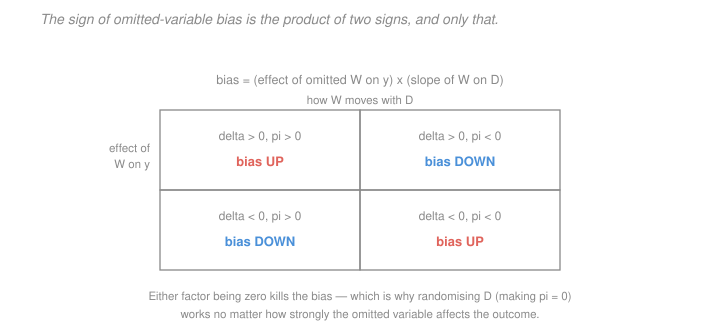

# Econometrics · Lesson 3.4: Omitted-variable bias

> ⏱ ~15 min · Module 3: Endogeneity and causality · Builds on: [3.2 (selection on observables)](03-02-selection-on-observables-propensity-score.md), [1.3 (FWL)](01-03-ols-algebra-geometry-projection.md) · Unlocks: 3.5 (measurement error and simultaneity), 3.6 (instrumental variables)

## Why this matters

[3.2](03-02-selection-on-observables-propensity-score.md) told you what to do if the CIA holds. This lesson is about what happens when it does not — which is the normal case — and it turns the vague worry "there might be a confounder" into a formula you can sign and often bound.

That matters because a referee's objection is not usually "your estimate is wrong". It is "you have not controlled for ability", and the productive response is not to shrug but to say: *the omitted variable would have to affect earnings by at least this much, and be correlated with schooling by at least this much, to explain away my result.* That is an argument. The OVB formula is what makes it possible.

## The idea

Suppose the true relationship involves two variables and you fit only one. The fitted coefficient does not simply lose the missing variable's contribution — it *absorbs* part of it, because the included regressor stands in for the excluded one to the extent they move together.

How much it absorbs is the product of two things: how much the omitted variable matters for the outcome, and how strongly it moves with the included regressor. Both factors are needed. An omitted variable that is a powerful cause of the outcome but uncorrelated with your regressor does no damage at all; neither does one that correlates strongly but has no effect.

The formula is short enough to memorise and general enough to run every argument in this module. It is also, read backwards, exactly the reason randomisation works: randomising forces the second factor to zero.

## The formal version

Let the **long** (correct) model be
$$y = \beta_0 + \beta_1 D + \delta W + \varepsilon, \qquad E[\varepsilon\mid D,W]=0 ,$$
and suppose you estimate the **short** model $y = \gamma_0+\gamma_1 D + u$, omitting $W$.

> **Theorem (omitted-variable bias).**
> $$\gamma_1 \;=\; \beta_1 \;+\; \delta\,\pi , \qquad \pi = \frac{\operatorname{Cov}(D,W)}{\operatorname{Var}(D)} ,$$
> where $\pi$ is the population slope from regressing the omitted $W$ on the included $D$.

*Proof.* $\operatorname{Cov}(D,y) = \beta_1\operatorname{Var}(D)+\delta\operatorname{Cov}(D,W)+0$; divide by $\operatorname{Var}(D)$. $\square$

*In words:* **short equals long plus the effect of the omitted variable times the regression of omitted on included.** The mnemonic is worth having: "the bias is what the omitted variable does, times how much of it your regressor carries".

**Signing the bias.** The bias term $\delta\pi$ has the sign of the product:

| | $\pi > 0$ | $\pi < 0$ |
|---|---|---|
| $\delta > 0$ | bias **up** | bias **down** |
| $\delta < 0$ | bias **down** | bias **up** |

Either factor being zero kills the bias, which is why **randomising $D$ works no matter how large $\delta$ is** — it forces $\pi=0$.

**The general (multivariate) case.** With $X_1$ included and $X_2$ omitted,
$$\gamma_1 = \beta_1 + \Pi'\beta_2, \qquad \Pi = (E[X_1X_1'])^{-1}E[X_1X_2'] ,$$
where $\Pi$ is the matrix of coefficients from regressing each omitted variable on the included ones. The intuition is identical; only the bookkeeping grows.

**Endogeneity, defined.** A regressor is **endogenous** when $\operatorname{Cov}(D,u)\neq 0$ in the equation you are estimating. Omitting a relevant correlated variable is one way to produce it — because the omitted variable ends up inside $u$. [3.5](03-05-measurement-error-and-simultaneity.md) covers the other two classical routes.

**Proxy variables.** If $W$ is unobserved but you have a proxy $P$ with $W = \alpha_0+\alpha_1 P + e$, controlling for $P$ removes part of the bias — the part $P$ captures — and leaves the rest. Proxies help; they rarely finish the job. A proxy is useful in proportion to its correlation with the true confounder *conditional on the treatment*, which is usually much weaker than its raw correlation.

**Coefficient stability as evidence (used carefully).** If adding a rich set of controls barely moves $\hat\beta_1$, that is weak evidence the remaining unobservables would not move it either. Oster's method formalises this: it uses the movement in the coefficient **and** the movement in $R^2$ to estimate what unobservables of a given relative importance would do. Reporting a "$\delta$ for $\beta = 0$" — how strong selection on unobservables would need to be, relative to selection on observables, to eliminate your result — is now standard, and far more informative than a stability claim alone.

**Bounding.** Even without Oster's machinery you can often bound. If theory signs $\delta$ (ability raises earnings: $\delta>0$) and data sign $\pi$ (ability correlates positively with schooling: $\pi>0$), then the bias is positive and your estimate is an **upper bound** on the true effect. A one-sided bound that goes the right way is a real result — if your estimate is an upper bound and it is already small, the honest conclusion follows immediately.

## Picture

Two signs, four cases, and the diagonal pattern is the whole content: bias is upward when the two factors agree in sign and downward when they disagree. The note underneath is the one that matters — either factor being zero empties the cell, and randomisation is the technology for zeroing the second.

## Worked examples

**Example 1 (mechanical): signing the ability bias in a schooling regression.** The classic case. True model:
$$\log(\text{wage}) = \beta_0 + \beta_1 S + \delta A + \varepsilon ,$$
with $S$ years of schooling and $A$ ability, unobserved. You estimate the short regression and get $\hat\gamma_1 = 0.104$.

Sign the bias. Ability raises wages, so $\delta>0$. More able people acquire more schooling (they find it easier and cheaper), so $\pi = \operatorname{Cov}(S,A)/\operatorname{Var}(S) > 0$. The product is positive, so
$$\gamma_1 = \beta_1 + \underbrace{\delta\pi}_{>0} \quad\Longrightarrow\quad \hat\gamma_1 = 0.104 \ \text{ is an UPPER bound on } \beta_1 .$$

Now put numbers on it. Measure ability in standard deviations, so $\operatorname{Var}(A)=1$. Suppose:

- a one-standard-deviation increase in ability raises log wages by $0.08$, so $\delta = 0.08$;
- one standard deviation of ability is associated with $0.6$ extra years of schooling, i.e. the regression of $S$ on $A$ has slope $\operatorname{Cov}(S,A)/\operatorname{Var}(A) = 0.6$, hence $\operatorname{Cov}(S,A) = 0.6$;
- schooling has standard deviation $\sigma_S = 2.5$ years, so $\operatorname{Var}(S) = 6.25$.

The OVB formula needs $\pi$, the regression of the *omitted* variable on the *included* one — ability on schooling, not the other way round:
$$\pi = \frac{\operatorname{Cov}(S,A)}{\operatorname{Var}(S)} = \frac{0.6}{6.25} = 0.096 \ \text{ standard deviations of ability per year of schooling.}$$
The bias is therefore
$$\delta\pi = 0.08\times 0.096 = 0.00768 , \qquad \beta_1 \approx 0.104 - 0.008 = 0.096 .$$
Ability bias of about $0.8$ percentage points on a $10.4$ percent return — real but modest, which is roughly what the twins and instrumental-variables literatures find.

**Example 2 (why you'd care): the bias can exceed the effect.** Return to the hospital-quality example from [1.2](01-02-best-linear-predictor.md). Better hospitals have lower mortality causally ($\beta_1 = -2$ per quality unit), but sicker patients are referred to better hospitals. With severity $s$ having $\delta = +3$ (sicker patients die more) and $\pi = \operatorname{Cov}(q,s)/\operatorname{Var}(q) = +1$,
$$\gamma_1 = -2 + 3(1) = +1 .$$
The naive regression reports that better hospitals **increase** mortality. Here $|\delta\pi| = 3 > |\beta_1| = 2$: the bias is larger than the effect and reverses its sign.

This is the case that makes the formula more than an accounting identity. Whenever you can argue that a confounder's influence plausibly exceeds the effect you are looking for, no amount of precision saves you — and *the more precisely you estimate $\gamma_1$, the more confidently you report the wrong sign*. This is why Module 3 exists, and why the response to a confounding worry is a change of design ([3.6](03-06-instrumental-variables.md), Module 4), not a bigger sample.

Note also what a partial fix buys. If you observe a severity proxy capturing 70 percent of the variation in $s$, controlling for it removes 70 percent of the bias, leaving $-2 + 0.3(3) = -1.1$ — the right sign, still 45 percent understated in magnitude. Proxies move you toward the truth without getting there, and knowing *which direction* you are still wrong in is often the most useful thing the formula gives you.

## Watch out

- **You might think** a confounder must be correlated with the treatment *and* the outcome to matter — **but actually** the requirement is that it affects the outcome ($\delta\neq0$) and correlates with the treatment ($\pi\neq 0$). A variable correlated with the outcome purely *because* of treatment is a mediator, not a confounder, and controlling for it is the bad-control error of [3.3](03-03-regression-anatomy-good-and-bad-controls.md).
- **You might think** a stable coefficient across specifications proves robustness — **but actually** stability is informative only relative to how much the added controls *moved the $R^2$*. A coefficient that does not budge while controls explain nothing extra tells you almost nothing; one that does not budge while controls explain a great deal is genuine evidence. That distinction is precisely what Oster's method formalises, and it is why "the coefficient is stable" without an accompanying $R^2$ path is an incomplete claim.
- **You might think** the OVB formula requires the long model to be causal — **but actually** the algebra is pure projection and holds for any two nested regressions. Its *causal* reading requires the long model to be correctly specified. Keep the two apart: the identity is always true, the interpretation is what you have to defend.

## One-liner

> Short equals long plus $\delta\pi$ — the omitted variable's effect times its regression on the included one — so sign both factors before you argue about magnitude, and remember that randomisation works by forcing $\pi$ to zero rather than by making confounders unimportant.

## Problems

**P1 (🟢)** A wage regression on union membership gives a coefficient of $0.18$. Unions are more common in large firms, and large firms pay more for reasons unrelated to unions. Sign the bias, state whether $0.18$ is an upper or lower bound on the union effect, and compute the corrected value if $\delta = 0.09$ (log-wage effect of log firm size) and $\pi = 0.75$ (regression of log firm size on the union dummy).

**P2 (🟡)** Show that if you control for a *proxy* $P$ for the unobserved confounder $W$, where $W = \alpha_0+\alpha_1P+e$ with $e$ uncorrelated with $P$ and $D$, the remaining bias is $\delta\,\pi_e$ where $\pi_e$ is the regression of $e$ on $D$ after partialling out $P$. Explain when a proxy fully solves the problem.

**P3 (🔴, optional)** You estimate $\hat\beta = 0.30$ with no controls and $\hat\beta = 0.22$ with a rich set of observables, while $R^2$ rises from $0.05$ to $0.30$. Assuming the maximum attainable $R^2$ is $0.50$ and that selection on unobservables is *equally strong* as selection on observables, use Oster's linear extrapolation to estimate the bias-adjusted coefficient. Then say what "equally strong" is doing, and what would change your conclusion.

Solutions

**P1** *Signing.* The omitted variable is firm size. Large firms pay more, so $\delta > 0$. Unions are more common in large firms, so regressing firm size on the union dummy gives $\pi > 0$. The bias $\delta\pi$ is therefore **positive**, so
$$\gamma_1 = \beta_1 + \delta\pi \quad\Longrightarrow\quad \gamma_1 > \beta_1 .$$
The estimate $0.18$ is an **upper bound** on the true union effect.

*Correction.*
$$\delta\pi = 0.09\times 0.75 = 0.0675, \qquad \beta_1 \approx 0.18 - 0.0675 = 0.1125 .$$
So the union premium falls from $0.18$ to about $0.113$ log points. Converting with [1.6](01-06-functional-form-logs-interactions.md)'s exact formula: the raw figure implies $100(e^{0.18}-1) = 19.7$ percent, the corrected one $100(e^{0.1125}-1) = 11.9$ percent. Controlling for firm size cuts the estimated premium by about 40 percent — which is roughly the magnitude found in the labour literature, and a good reminder that firm characteristics are among the most important controls in any wage regression.

**P2** *Setup.* The true model is $y = \beta_0+\beta_1D+\delta W+\varepsilon$. Substituting $W = \alpha_0+\alpha_1P+e$:
$$y = (\beta_0+\delta\alpha_0) + \beta_1 D + \delta\alpha_1 P + \delta e + \varepsilon .$$
So regressing $y$ on $D$ and $P$ is a regression whose composite error is $\delta e + \varepsilon$, and the coefficient on $P$ estimates $\delta\alpha_1$.

*Remaining bias.* By the OVB formula applied to this regression — with $D$ and $P$ included and $e$ effectively omitted — the coefficient on $D$ satisfies
$$\hat\beta_1^{(P)} \ \xrightarrow{p}\ \beta_1 + \delta\,\pi_e ,$$
where $\pi_e$ is the coefficient on $D$ from regressing $e$ on $D$ and $P$ — equivalently, by FWL ([1.3](01-03-ols-algebra-geometry-projection.md)), the regression of $e$ on the part of $D$ orthogonal to $P$. $\checkmark$

*When the proxy fully solves the problem.* Exactly when $\pi_e = 0$, i.e. when the part of $W$ that the proxy fails to capture is uncorrelated with $D$ once $P$ is controlled for. Two sufficient conditions, in decreasing order of realism:

1. **$\alpha_1$ captures all of $W$'s relation to $D$**: the proxy is a "sufficient" proxy in the Wooldridge sense, meaning $E[W\mid D, P] = \alpha_0+\alpha_1 P$ — the treatment provides no information about $W$ beyond what $P$ already provides.
2. **$e = 0$**: the proxy is a perfect measure, in which case $W$ is observed and there is no problem.

The realistic case is neither. Typically $e$ retains some correlation with $D$ — a test score proxies ability imperfectly, and the unmeasured component of ability (motivation, non-cognitive skill) still predicts schooling. So the proxy reduces the bias in rough proportion to how much of $W$'s $D$-relevant variation it absorbs, and leaves the rest. The direction is usually preserved: if $\delta\pi>0$ originally, then $\delta\pi_e$ is typically positive too but smaller, so **a proxy moves you toward the truth from a known side** — which is why "controlling for test scores shrank the schooling coefficient from 0.104 to 0.096" is read as evidence that the remaining bias is small and positive.

**P3** *Oster's linear extrapolation.* The idea: observables moved the coefficient by $\hat\beta_{\text{controlled}} - \hat\beta_{\text{uncontrolled}}$ while explaining $R_{\text{controlled}}^2 - R_{\text{uncontrolled}}^2$ of the variance. If unobservables are equally important per unit of explained variance ($\delta_{\text{Oster}} = 1$), extrapolate the same movement over the remaining explainable variance $R_{\max}^2 - R^2_{\text{controlled}}$:
$$\beta^* \ \approx\ \hat\beta_{\text{controlled}} - \bigl(\hat\beta_{\text{uncontrolled}} - \hat\beta_{\text{controlled}}\bigr)\cdot\frac{R^2_{\max}-R^2_{\text{controlled}}}{R^2_{\text{controlled}}-R^2_{\text{uncontrolled}}} .$$

Substituting $\hat\beta_{\text{uncontrolled}} = 0.30$, $\hat\beta_{\text{controlled}} = 0.22$, $R^2$ from $0.05$ to $0.30$, and $R^2_{\max}=0.50$:
$$\beta^* = 0.22 - (0.30-0.22)\cdot\frac{0.50-0.30}{0.30-0.05} = 0.22 - 0.08\cdot\frac{0.20}{0.25} = 0.22 - 0.08(0.8) = 0.22-0.064 = 0.156 .$$

So the bias-adjusted estimate is $\boxed{0.156}$ — the controlled estimate of $0.22$ is itself still about 30 percent too high if unobservables matter as much as observables. Reporting the identified set $[0.156,\ 0.22]$ is standard practice.

*What "equally strong" is doing.* It is the entire assumption, and it is an assumption about something unobservable. Formally $\delta_{\text{Oster}}=1$ says the selection relationship between treatment and unobservables is the same, per unit of outcome variance explained, as between treatment and observables. There is no way to test it. Its appeal is that it is a *disciplined* default: researchers choose which controls to include, and they usually choose the ones they think matter most, so if anything $\delta_{\text{Oster}}=1$ is conservative — the unobservables are likely *less* important than the observables you deliberately picked.

*What would change the conclusion.* Three things, and each is worth reporting.

1. **$R^2_{\max}$.** The adjustment is highly sensitive to it, and it is chosen by the researcher. If $R^2_{\max}=1.0$ instead of $0.50$, the multiplier becomes $(1.0-0.30)/0.25 = 2.8$ and $\beta^* = 0.22 - 0.224 = -0.004$ — the effect vanishes entirely. Oster's own recommendation, $R^2_{\max} = \min(1.3\,R^2_{\text{controlled}}, 1)= 0.39$, gives $\beta^* = 0.22-0.08(0.36) = 0.191$. **Always report the sensitivity across a range of $R^2_{\max}$**, since the single number can be made to say almost anything.
2. **The direction of the observables' movement.** Here controls *reduced* the coefficient, so extrapolation reduces it further. Had controls *raised* it, the same logic would push it up, and the identified set would lie above the controlled estimate.
3. **The complementary statistic.** Rather than fixing $\delta_{\text{Oster}}=1$, solve for the $\delta$ that drives $\beta^*$ to zero. Here that is $\delta = 0.25/0.20 \times (0.22/0.08) = 1.25\times 2.75 = 3.44$: unobservables would need to be about **3.4 times** as important as the observables to eliminate the effect. That is a demanding requirement, and reporting it is a stronger and more honest defence than reporting any single adjusted point estimate.

## Flashback

**From Lesson 3.2 (selection on observables):** A study matches treated and control units on 8 covariates and reports excellent balance, then claims the conditional independence assumption is satisfied. State precisely what the balance evidence does and does not establish. Then, given that the propensity score ranges from $0.02$ to $0.97$ in the matched sample, say what else you would want to see.

Solution

*What balance establishes.* That the matching procedure succeeded at its stated mechanical task: the treated and control groups now have similar distributions of the **8 covariates that were used**. This is a check that the algorithm did what it was asked, and failing it would be disqualifying. Passing it is a necessary condition.

*What it does not establish.* The CIA is a statement about $(Y(1),Y(0))\perp D \mid X$ — it concerns the **potential outcomes**, which are unobservable, and it can fail through any variable *not* in the 8. Balance on the included covariates is entirely compatible with severe imbalance on a ninth, and no procedure operating on observed data can detect that. Balance is evidence about the algorithm; the CIA is an assumption about the world, and the two are not connected by any inference. Worse, balancing on the 8 gives no reassurance about the 9th unless the 9th is strongly correlated with them — and if it were, it would be less of a threat in the first place. The variables that pose the real risk are precisely the ones least related to what you measured.

*What else to want.* Given the score range $[0.02, 0.97]$:

1. **The overlap plot, and a trimming decision.** A score of $0.02$ means those units are almost never treated: any treated unit down there is a near-outlier, and an IPW weight of $1/0.02 = 50$ means it counts for 50 typical observations. At $0.97$ the mirror problem hits the controls, with weight $1/0.03 = 33$. Report the plot, report how many units sit outside $[0.1,0.9]$, and show the estimate with and without trimming. If those differ materially, the headline estimate is being driven by a handful of extrapolated comparisons.
2. **Standardised differences rather than balance $t$-tests**, per [3.2](03-02-selection-on-observables-propensity-score.md) — reported before and after, with the $0.1$ threshold marked, and including variance ratios rather than means alone.
3. **A sensitivity analysis.** Rosenbaum bounds, or the Oster-style calculation from this lesson's P3: how strong would an unobserved confounder have to be — relative to the observed ones — to overturn the result? This converts an untestable assumption into a quantitative statement a reader can weigh, which is the only honest thing available.
4. **A placebo outcome**, if one exists: a variable the treatment could not plausibly affect but that the same confounder would move. Finding an "effect" there is direct evidence the design is broken, and it is one of the few genuinely informative tests of unconfoundedness.

The connection to this lesson: the CIA failing *is* omitted-variable bias, and the OVB formula tells you exactly what the remaining bias is — $\delta\pi$ for the unmeasured confounder. Sensitivity analysis is just that formula run in reverse, asking how big $\delta$ and $\pi$ would need to be.

## Connections

- **Backward:** the formula is [1.2](01-02-best-linear-predictor.md) P3 and [1.3](01-03-ols-algebra-geometry-projection.md) P2, now read causally rather than as projection algebra. It quantifies precisely what [3.2](03-02-selection-on-observables-propensity-score.md)'s CIA buys and what its failure costs, and the good/bad control distinction of [3.3](03-03-regression-anatomy-good-and-bad-controls.md) determines which variables belong in the "long" model at all.
- **Forward:** [3.5](03-05-measurement-error-and-simultaneity.md) shows two more routes to $\operatorname{Cov}(D,u)\neq0$ that are *not* omitted variables. [3.6](03-06-instrumental-variables.md) stops trying to measure the confounder and looks for variation in $D$ that is unrelated to it. [4.1](04-01-panel-data-fixed-effects.md) handles the case where the confounder is unobserved but constant over time — a bet that is often more credible than measuring it.
- **Sideways:** the formula is the reason economists distrust "kitchen-sink" regressions in a way that prediction-focused fields do not. In [`statistical-learning` 2.4](../../statistical-learning/lessons/02-04-lasso-and-the-geometry-of-sparsity.md), dropping a correlated variable is a variance-reduction decision with a bias cost measured in prediction error; here the same drop changes what the surviving coefficient *means*, which no amount of cross-validation detects.
