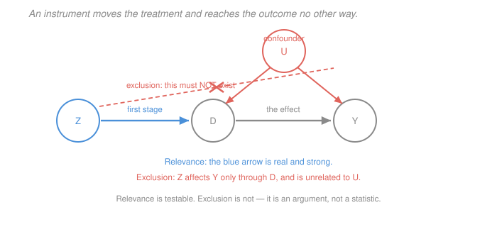

# Econometrics · Lesson 3.6: Instrumental variables

> ⏱ ~15 min · Module 3: Endogeneity and causality · Builds on: [3.4 (omitted-variable bias)](03-04-omitted-variable-bias.md), [3.5 (measurement error and simultaneity)](03-05-measurement-error-and-simultaneity.md) · Unlocks: 3.7 (two-stage least squares), 3.8 (weak instruments and LATE)

## Why this matters

The last three lessons diagnosed the same disease from three causes: the regressor is correlated with the error. Conditioning fixes it only if you can measure the confounder, which is exactly what you usually cannot do.

Instrumental variables abandons that project entirely. Instead of measuring the contamination, find a source of variation in the treatment that is *clean by construction* — something that pushes people into treatment for reasons unrelated to their outcomes — and use only that part. It is the single most important idea in the module, and the one that most often gets misused, because one of its two assumptions is untestable and researchers routinely treat a plausible story as if it were evidence.

## The idea

You cannot use all the variation in $D$, because some of it is contaminated. So use a *subset* of it: the part driven by an instrument $Z$ that has no other route to the outcome.

The mechanics fall out of a ratio. If $Z$ raises the outcome by some amount, and $Z$ raises treatment by some amount, and $Z$ can *only* affect the outcome through treatment, then the effect of treatment per unit is the first divided by the second. That is the entire estimator.

Two conditions make it work, and they are utterly different in character:

- **Relevance:** $Z$ actually moves $D$. Testable — it is a first-stage regression, and you can look at its $F$-statistic.
- **Exclusion:** $Z$ affects $Y$ *only* through $D$, and is unrelated to whatever confounds $D$. **Not testable.** It is an argument about the world, defended with institutional knowledge, and no statistic in your output substitutes for it.

The asymmetry is the thing to internalise. Papers report the first-stage $F$ because they can. The exclusion restriction gets a paragraph of prose, and that paragraph is where the credibility of the whole exercise lives.

## The formal version

Model: $y_i = \beta_0 + \beta_1 D_i + u_i$ with $\operatorname{Cov}(D_i,u_i)\neq 0$. An instrument $Z_i$ satisfies:

> **(IV1) Relevance.** $\operatorname{Cov}(Z,D)\neq 0$.
> **(IV2) Exclusion / exogeneity.** $\operatorname{Cov}(Z,u) = 0$.

> **Theorem (the IV estimator).** Under IV1 and IV2,
> $$\beta_1 = \frac{\operatorname{Cov}(Z,Y)}{\operatorname{Cov}(Z,D)} , \qquad \hat\beta_1^{IV} = \frac{\widehat{\operatorname{Cov}}(Z,Y)}{\widehat{\operatorname{Cov}}(Z,D)} .$$

*Proof.* $\operatorname{Cov}(Z,Y) = \operatorname{Cov}(Z, \beta_0+\beta_1D+u) = \beta_1\operatorname{Cov}(Z,D)+\operatorname{Cov}(Z,u) = \beta_1\operatorname{Cov}(Z,D)$ by IV2. Divide by $\operatorname{Cov}(Z,D)$, which is nonzero by IV1. $\square$

*In words:* IV is **reduced form over first stage**. Define
$$\text{first stage:}\ \ D = \pi_0+\pi_1 Z + v, \qquad \text{reduced form:}\ \ Y = \rho_0 + \rho_1 Z + w .$$
Then $\beta_1 = \rho_1/\pi_1$: the effect of $Z$ on $Y$, divided by the effect of $Z$ on $D$. Both numerator and denominator are ordinary OLS regressions on an exogenous variable, so both are consistently estimated; their ratio is the causal effect.

**The Wald estimator.** With binary $Z$ this becomes
$$\hat\beta_1^{Wald} = \frac{E[Y\mid Z=1]-E[Y\mid Z=0]}{E[D\mid Z=1]-E[D\mid Z=0]} ,$$
which is worth carrying because it is completely transparent: scale up the intention-to-treat effect by the take-up rate it induced. If an offer raises take-up by 25 percentage points and raises earnings by 1.5 units, the effect per unit treated is $1.5/0.25 = 6$.

**Consistency but not unbiasedness.** In matrix form $\hat\beta^{IV} = (Z'X)^{-1}Z'y = \beta + (Z'X)^{-1}Z'u$. The LLN gives consistency, exactly as in [2.2](02-02-consistency-and-asymptotic-normality.md)'s Example 2. But $E[(Z'X)^{-1}Z'u]\neq 0$ because expectation does not pass through the inverse of a random matrix — and the just-identified IV estimator does not even possess a finite mean. Everything here is asymptotic, which is why [3.8](03-08-weak-instruments-and-late.md) matters so much.

**Asymptotic variance.** With one instrument and one endogenous regressor,
$$\operatorname{Avar}(\hat\beta_1^{IV}) = \frac{\sigma_u^2}{n\,\operatorname{Var}(D)\,\operatorname{Corr}(Z,D)^2} = \frac{\operatorname{Avar}(\hat\beta_1^{OLS})}{\operatorname{Corr}(Z,D)^2} .$$
*In words:* IV's variance is OLS's inflated by $1/\operatorname{Corr}(Z,D)^2$. **A weak instrument is expensive.** At $\operatorname{Corr}(Z,D) = 0.1$ the variance is 100 times larger — you have traded bias for a standard error that may be too wide to say anything.

**Exclusion restrictions are arguments.** The instrument must have no direct effect on $Y$, and must be unrelated to the confounders. Classic instruments and the classic objections to them:

| Instrument | For | The objection |
|---|---|---|
| Quarter of birth (Angrist–Krueger) | schooling | season of birth correlates with family background and health |
| Distance to college (Card) | schooling | families sort into neighbourhoods on preferences for education |
| Rainfall | agricultural income | rainfall affects health and conflict directly |
| Draft lottery (Angrist) | military service | genuinely random; the strongest case on this list |

Notice the pattern: the objection is always "there is a second path". Defending an instrument means closing every such path by argument, and a design where the instrument's randomness comes from an actual lottery is worth far more than a clever proxy.

## Picture

The blue arrow is relevance — testable, and it needs to be strong. The crossed-out dashed arrow is exclusion, and it represents everything that must *not* exist: no direct path, and no arrow from $U$ into $Z$. You cannot verify the absence of an arrow with data. You verify it with knowledge of where the variation came from.

## Worked examples

**Example 1 (mechanical): a Wald estimate from a randomised offer.** A job-training program is offered by lottery. Among those offered ($Z=1$), 55 percent enrol; among those not offered ($Z=0$), 30 percent enrol anyway through other channels. Mean earnings are $6.1$ among the offered and $4.6$ among the not-offered (thousands of dollars).

*First stage:* $0.55-0.30 = 0.25$. The lottery moved take-up by 25 percentage points.
*Reduced form (the ITT):* $6.1-4.6 = 1.5$ thousand dollars.
*Wald / IV estimate:*
$$\hat\beta^{IV} = \frac{1.5}{0.25} = 6.0 .$$

The offer raised earnings by 1,500 dollars on average; since it only moved a quarter of people into training, the effect *per person actually moved* is 6,000 dollars.

Both numbers are meaningful and they answer different questions. The ITT of $1.5$ is what a policymaker offering the program to everyone should expect per person offered. The IV estimate of $6.0$ is the effect on those the offer actually shifted — and [3.8](03-08-weak-instruments-and-late.md) will insist that this is a specific subgroup, not the population.

**Example 2 (why you'd care): IV fixes measurement error too.** Suppose schooling is measured with classical error, reliability $\lambda = 0.9$, and there is no ability bias. OLS returns $\hat\beta_{OLS} = 0.9\beta_1$ by [3.5](03-05-measurement-error-and-simultaneity.md).

Now use an independent second measurement $Z$ of the same schooling — say, the value reported by a sibling or recorded in an administrative file. Write $x_1 = x^*+v_1$ and $Z = x^*+v_2$ with $v_1\perp v_2$, both uncorrelated with $x^*$ and $\varepsilon$.

*Relevance:* $\operatorname{Cov}(Z,x_1) = \operatorname{Var}(x^*)\neq 0$. Both measurements track the truth, so they track each other.
*Exclusion:* the composite error in the estimating equation is $\varepsilon-\beta_1v_1$, and
$$\operatorname{Cov}(Z, \varepsilon-\beta_1v_1) = \operatorname{Cov}(x^*+v_2,\ \varepsilon-\beta_1v_1) = 0 ,$$
since $v_2$ is independent of $v_1$ and everything else. Exclusion holds.

Therefore
$$\hat\beta^{IV}\ \xrightarrow{p}\ \frac{\operatorname{Cov}(Z,y)}{\operatorname{Cov}(Z,x_1)} = \frac{\beta_1\operatorname{Var}(x^*)}{\operatorname{Var}(x^*)} = \beta_1 ,$$
**consistent, with the attenuation gone entirely.**

This is why IV estimates of the return to schooling exceed OLS estimates ([3.5](03-05-measurement-error-and-simultaneity.md)'s Example 2): the instrument removes attenuation as well as ability bias. It also shows the general principle — *IV does not care which of the three endogeneity sources you have.* One tool, three diseases, provided the exclusion restriction holds. Note the requirement that the two measurement errors be **independent**: if both come from the same survey respondent on the same day, they share a mood and a memory, $\operatorname{Cov}(v_1,v_2)\neq0$, and exclusion fails.

## Watch out

- **You might think** a significant first stage validates the instrument — **but actually** it validates only relevance. A strongly relevant instrument that violates exclusion produces a confidently wrong answer, and the stronger the first stage, the more precisely wrong it is. The two conditions are independent, and only one is checkable.
- **You might think** you should test exclusion by regressing $Y$ on $Z$ and the controls — **but actually** that regression is the *reduced form*, and a nonzero coefficient is exactly what a valid instrument produces. There is nothing to see. With more instruments than endogenous regressors an overidentification test exists ([3.7](03-07-two-stage-least-squares.md)), but it tests whether the instruments *agree with each other*, not whether they are valid — and if all of them are invalid in the same direction it passes cheerfully.
- **You might think** adding controls to an IV regression is harmless — **but actually** the exclusion restriction is conditional on those controls, so adding or removing them changes the assumption being made. And a control that is a *consequence* of the instrument is a bad control in [3.3](03-03-regression-anatomy-good-and-bad-controls.md)'s sense, which will break the design rather than shore it up.

## One-liner

> IV is the reduced form divided by the first stage: use only the variation in treatment that comes from a source with no other route to the outcome — relevance you can test, exclusion you can only argue, and the cost of a weak instrument is a variance inflated by $1/\operatorname{Corr}(Z,D)^2$.

## Problems

**P1 (🟢)** A randomised encouragement raises program participation from $0.20$ to $0.65$ and raises the outcome from $12.0$ to $15.6$. Compute the ITT, the first stage, and the IV estimate. If instead participation had risen only to $0.25$, what would the IV estimate be, and what would you worry about?

**P2 (🟡)** Show that the IV estimator is the ratio of the reduced-form to first-stage coefficients, and use this to show that IV is invariant to rescaling the instrument. Then explain why this invariance means the *units* of $Z$ never matter but its *strength* always does.

**P3 (🔴, optional)** Suppose the exclusion restriction fails: $Z$ has a small direct effect $\eta$ on $Y$, so $Y = \beta_0+\beta_1D+\eta Z+u$ with $\operatorname{Cov}(Z,u)=0$. Derive the asymptotic bias of the IV estimator, and show that it is amplified by a weak first stage. Then compute the bias when $\eta = 0.02$ and the first stage is $\pi_1 = 0.05$, and compare with $\pi_1 = 0.50$.

Solutions

**P1** *First stage:* $0.65-0.20 = 0.45$.
*ITT (reduced form):* $15.6-12.0 = 3.6$.
*IV estimate:*
$$\hat\beta^{IV} = \frac{3.6}{0.45} = 8.0 .$$

*With a first stage of only $0.05$* (participation rising $0.20\to 0.25$): assuming the same reduced form of $3.6$,
$$\hat\beta^{IV} = \frac{3.6}{0.05} = 72.0 .$$

*What to worry about.* Everything. Three specific concerns:

1. **Implausible magnitude.** An effect of $72$ on an outcome whose baseline is $12$ should be treated as evidence the design is broken, not as a discovery.
2. **A tiny denominator amplifies everything.** Any violation of exclusion is divided by $0.05$, so a direct effect of the encouragement worth even $0.5$ units of outcome contributes $0.5/0.05 = 10$ to the estimate — more than the entire plausible treatment effect. P3 makes this precise.
3. **The variance explodes.** With $\operatorname{Corr}(Z,D)$ correspondingly small, the standard error inflates by $1/\operatorname{Corr}(Z,D)$, and the finite-sample distribution is badly non-normal, so the reported confidence interval is not trustworthy either ([3.8](03-08-weak-instruments-and-late.md)).

The right response is to report the reduced form and first stage separately, note that the ratio is not credibly estimated, and say the design cannot answer the question.

**P2** *The ratio.* The first stage and reduced form are
$$\pi_1 = \frac{\operatorname{Cov}(Z,D)}{\operatorname{Var}(Z)}, \qquad \rho_1 = \frac{\operatorname{Cov}(Z,Y)}{\operatorname{Var}(Z)} .$$
Dividing, the $\operatorname{Var}(Z)$ cancels:
$$\frac{\rho_1}{\pi_1} = \frac{\operatorname{Cov}(Z,Y)}{\operatorname{Cov}(Z,D)} = \hat\beta^{IV} .\ \checkmark$$

*Invariance to rescaling.* Replace $Z$ by $\tilde Z = aZ+b$ for constants $a\neq 0$, $b$. Covariances are unaffected by the shift $b$ and scale linearly in $a$:
$$\frac{\operatorname{Cov}(\tilde Z,Y)}{\operatorname{Cov}(\tilde Z,D)} = \frac{a\operatorname{Cov}(Z,Y)}{a\operatorname{Cov}(Z,D)} = \frac{\operatorname{Cov}(Z,Y)}{\operatorname{Cov}(Z,D)} .$$
The IV estimate is unchanged. (Both $\rho_1$ and $\pi_1$ individually scale by $1/a$; the ratio does not.)

*Why units never matter but strength always does.* The estimator is a ratio of two quantities measured in the *same* units of $Z$, so those units cancel — measuring distance-to-college in miles or kilometres, or coding a lottery as $\{0,1\}$ or $\{-1,+1\}$, gives the identical estimate. That is reassuring: the answer cannot depend on an arbitrary coding choice.

But **strength is not a unit**. Strength is $\operatorname{Corr}(Z,D)$, which is itself unit-free and measures how much of $D$'s variation the instrument actually isolates. Rescaling $Z$ leaves the correlation untouched. So no reparametrisation can rescue a weak instrument — the information content is invariant to how you write it down, and a researcher who "strengthens" an instrument by rescaling has done nothing at all. This is exactly why the first-stage $F$-statistic, not the first-stage coefficient, is the diagnostic to report.

**P3** *Derivation.* With the direct effect present, $Y = \beta_0+\beta_1D+\eta Z+u$. Compute the IV probability limit:
$$\hat\beta^{IV} \xrightarrow{p} \frac{\operatorname{Cov}(Z,Y)}{\operatorname{Cov}(Z,D)} = \frac{\beta_1\operatorname{Cov}(Z,D) + \eta\operatorname{Var}(Z) + \operatorname{Cov}(Z,u)}{\operatorname{Cov}(Z,D)} .$$
The last term is zero by assumption. Using $\operatorname{Cov}(Z,D) = \pi_1\operatorname{Var}(Z)$ from the first stage,
$$\hat\beta^{IV} \xrightarrow{p}\ \beta_1 + \frac{\eta\operatorname{Var}(Z)}{\pi_1\operatorname{Var}(Z)} = \beta_1 + \frac{\eta}{\pi_1} .$$

> $$\boxed{\ \text{asymptotic bias} = \frac{\eta}{\pi_1}\ }$$

*Amplification by a weak first stage.* The bias is the direct effect **divided by** the first stage. A weak instrument ($\pi_1$ small) does not merely make the estimator imprecise — it **multiplies any exclusion violation by $1/\pi_1$.** Weakness and invalidity compound rather than merely coexist, which is why a weak instrument is dangerous even when you believe the exclusion story: your belief has to be far more precise than it usually can be.

*Numerical comparison* with $\eta = 0.02$:

| $\pi_1$ | bias $=\eta/\pi_1$ |
|---|---|
| $0.50$ | $0.02/0.50 = 0.04$ |
| $0.05$ | $0.02/0.05 = 0.40$ |

The same tiny direct effect — a violation so small it would be undetectable and would seem unworthy of mention — produces a bias of $0.04$ with a strong first stage and $0.40$ with a weak one, a **tenfold** difference. If the true $\beta_1$ is around $0.10$, the strong-instrument estimate is off by 40 percent (tolerable, and arguably better than the OLS alternative) while the weak-instrument estimate is off by 400 percent and reports essentially pure bias.

The practical rule that follows: **the burden of proof on exclusion scales inversely with the first stage.** With a strong instrument you need the exclusion restriction to be approximately right; with a weak one you need it to be almost exactly right, and no institutional argument is ever that precise. This is the strongest available argument for preferring designs built on genuine randomisation — a draft lottery, an admissions threshold, a randomised encouragement — over clever but weak natural experiments.

## Flashback

**From Lesson 3.4 (omitted-variable bias):** A regression of firm productivity on R&D spending gives a coefficient of $0.42$. Managerial quality is unobserved; better managers both spend more on R&D and run more productive firms. Sign the bias, say whether $0.42$ is an upper or lower bound, and state what would have to be true for the bias to vanish.

Solution

*Signing.* The omitted variable is managerial quality $M$. Two factors, from [3.4](03-04-omitted-variable-bias.md)'s formula $\gamma_1 = \beta_1 + \delta\pi$:

- $\delta > 0$: better managers run more productive firms, so $M$ raises the outcome.
- $\pi > 0$: better managers spend more on R&D, so regressing $M$ on R&D gives a positive slope.

The product $\delta\pi > 0$, so the bias is **upward** and
$$0.42 = \beta_1 + \underbrace{\delta\pi}_{>0} \quad\Longrightarrow\quad \beta_1 < 0.42 .$$
The estimate is an **upper bound** on the true causal effect of R&D spending.

This direction is the common one in firm-level regressions and is worth expecting by default: good management is correlated with nearly every good input choice, so any regression of firm outcomes on a discretionary input tends to overstate that input's effect.

*What would make the bias vanish.* Either factor being zero suffices:

1. **$\delta = 0$**: managerial quality has no effect on productivity conditional on R&D. Implausible.
2. **$\pi = 0$**: managerial quality is uncorrelated with R&D spending. This is what randomisation would deliver — and it is the realistic target. It does not require managers to stop mattering, only that R&D spending vary for reasons unrelated to them.

Route 2 is the whole design problem, and it names what an instrument must accomplish. A valid instrument for R&D — a tax-credit change that alters the cost of R&D differentially across firms for reasons unrelated to their management, say — creates variation in spending that satisfies $\pi = 0$ *for the portion of variation being used*. That is precisely the sense in which IV constructs the orthogonality that randomisation would have given: it does not measure managerial quality or assume it away, it isolates a slice of R&D variation that managerial quality did not generate.

A third, weaker route is a **proxy** for management quality — a management-practices survey score, for instance ([3.4](03-04-omitted-variable-bias.md)'s P2). That removes the part of the bias the proxy captures and leaves the rest, moving $0.42$ downward toward the truth without reaching it. Useful, and worth reporting alongside, but it does not substitute for a design.

## Connections

- **Backward:** IV solves all three endogeneity sources at once — [3.4](03-04-omitted-variable-bias.md)'s omitted variables, [3.5](03-05-measurement-error-and-simultaneity.md)'s measurement error and simultaneity — because the exclusion restriction is agnostic about what put the correlation in the error. The demand-and-supply identification argument of [3.5](03-05-measurement-error-and-simultaneity.md) *is* this lesson, arriving from the structural-equations tradition rather than the potential-outcomes one.
- **Forward:** [3.7](03-07-two-stage-least-squares.md) generalises to several instruments and adds controls; [3.8](03-08-weak-instruments-and-late.md) confronts the two problems flagged here — what a weak first stage does, and *whose* effect the ratio actually recovers. The fuzzy regression discontinuity of [4.7](04-07-regression-discontinuity.md) is IV with the threshold indicator as the instrument.
- **Sideways:** the ratio structure — reduced form over first stage — is the same "scale the intention-to-treat by the compliance rate" logic used throughout clinical trials, where the ITT is the regulatory standard precisely because it needs no exclusion restriction. Economists usually want the scaled version; regulators usually do not, and both positions are defensible for their purposes.
