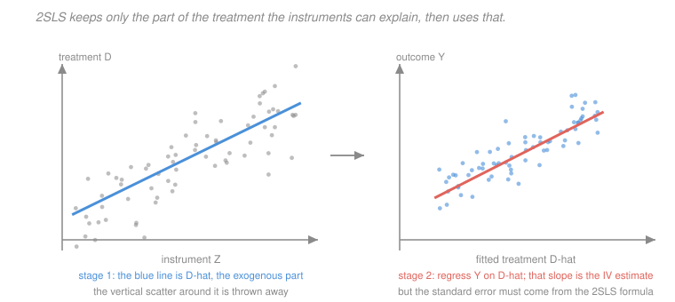

# Econometrics · Lesson 3.7: Two-stage least squares

> ⏱ ~15 min · Module 3: Endogeneity and causality · Builds on: [3.6 (instrumental variables)](03-06-instrumental-variables.md), [1.3 (FWL and projection)](01-03-ols-algebra-geometry-projection.md) · Unlocks: 3.8 (weak instruments and LATE), 4.7 (regression discontinuity)

## Why this matters

[3.6](03-06-instrumental-variables.md) handled one instrument, one endogenous regressor, no controls. Real applications have several instruments, controls that must be included for the exclusion restriction to be defensible, and sometimes more than one endogenous variable. 2SLS is the generalisation, and it is what every software package actually runs when you type an IV command.

Two things make this lesson more than bookkeeping. The projection view explains *why* the procedure works in one line rather than as an algorithm to memorise. And having more instruments than you need buys you a genuine test — the only diagnostic in the IV toolkit that speaks, however imperfectly, to the exclusion restriction.

## The idea

The name describes an algorithm: regress the endogenous variable on the instruments, take the fitted values, then regress the outcome on those fitted values. Stage one manufactures a clean version of the treatment; stage two uses it.

The reason it works is the projection idea from [1.3](01-03-ols-algebra-geometry-projection.md). The fitted value $\hat D$ is the projection of $D$ onto the space spanned by the instruments and controls. Everything in that space is exogenous by assumption, so $\hat D$ is exogenous — the contaminated part of $D$ is precisely the residual that was thrown away. You have split the treatment into a clean component and a dirty one, and kept only the clean one.

With several instruments, 2SLS does something better than picking one: it uses the *optimal linear combination*, weighting each instrument by how much of $D$ it explains. That is where its efficiency comes from, and it is why 2SLS with many weak instruments behaves badly — it is combining a lot of noise.

**Run the command, not the two regressions.** Doing the two stages by hand gives the right coefficient and the *wrong standard errors*, because stage two treats $\hat D$ as data rather than as an estimate. Every package's IV command fixes this; a hand-rolled two-step does not.

## The formal version

Let $X = [X_1\ X_2]$ where $X_1$ is $k_1$ endogenous regressors and $X_2$ is $k_2$ exogenous ones (**included instruments**, always including the constant). Let $Z = [Z_1\ X_2]$ collect $m$ **excluded instruments** $Z_1$ together with the exogenous regressors, so $Z$ has $\ell = m+k_2$ columns.

> **Order condition.** $\ell \ge k$, i.e. $m \ge k_1$: at least as many excluded instruments as endogenous regressors. Necessary, not sufficient.
> **Rank condition.** $E[Z_iX_i']$ has full column rank $k$. This is the real relevance requirement — the instruments must move the endogenous regressors *independently*.

Three cases: $m<k_1$ is **under-identified** (nothing to be done); $m=k_1$ is **just-identified**; $m>k_1$ is **over-identified**.

> **Definition (2SLS).** With $P_Z = Z(Z'Z)^{-1}Z'$ the projection onto the column space of the instruments,
> $$\hat\beta_{2SLS} = (X'P_ZX)^{-1}X'P_Zy = (\hat X'\hat X)^{-1}\hat X'y, \qquad \hat X = P_ZX .$$

*In words:* replace $X$ by its projection onto the instrument space, then run OLS. Because $P_Z$ is idempotent and symmetric, $X'P_ZX = \hat X'\hat X$ and $X'P_Zy = \hat X'y$ — which is exactly why the two-stage algorithm gives the right coefficient.

When $m = k_1$, $Z'X$ is square and invertible, and the formula collapses to $\hat\beta_{IV} = (Z'X)^{-1}Z'y$ — [3.6](03-06-instrumental-variables.md)'s estimator. So 2SLS is a strict generalisation.

**Consistency.** $\hat\beta_{2SLS}\xrightarrow{p}\beta$ provided $E[Z_iu_i]=0$ (exclusion, for **every** instrument) and the rank condition holds.

**Asymptotic variance.** Under homoskedasticity, $\operatorname{Avar} = \sigma_u^2(X'P_ZX)^{-1}$; in general use the robust sandwich
$$\widehat{\operatorname{Var}}(\hat\beta_{2SLS}) = (\hat X'\hat X)^{-1}\Bigl(\sum_i \hat u_i^2 \hat x_i\hat x_i'\Bigr)(\hat X'\hat X)^{-1} ,$$
where — this is the part hand-rolling gets wrong — the residuals are $\hat u_i = y_i - x_i'\hat\beta_{2SLS}$, computed with the **actual** $X$, not with $\hat X$.

**The $J$-test for over-identification.**

> **Sargan–Hansen $J$.** With $m>k_1$, regress the 2SLS residuals $\hat u$ on all instruments $Z$; then $J = n R^2 \xrightarrow{d}\chi^2_{m-k_1}$ under the null that all instruments are valid. (Hansen's version uses the efficient GMM weighting and is robust to heteroskedasticity.)

*In words:* if every instrument is valid, they should all give roughly the same answer. The $J$-test asks whether their disagreement exceeds sampling noise.

**What the $J$-test can and cannot do.** It tests *over-identifying restrictions* — the $m-k_1$ extra ones — never all $m$. You must assume at least $k_1$ instruments are valid to have anything to test against. Two consequences that matter:

- **Passing proves nothing** if all your instruments are invalid in the same way. Instruments chosen from the same institutional story usually fail together, which is exactly the case the test cannot detect.
- **Rejecting** says the instruments disagree — which could mean invalidity, or could mean **heterogeneous treatment effects**, since different instruments move different subpopulations and hence identify different LATEs ([3.8](03-08-weak-instruments-and-late.md)). A rejection is informative but ambiguous.

**Controls and the exclusion restriction.** With controls $X_2$, exclusion is *conditional*: $E[Z_1u\mid X_2]=0$. Adding or removing a control changes the assumption. And by [3.3](03-03-regression-anatomy-good-and-bad-controls.md), a control that is a consequence of the instrument is a bad control and will break the design.

**2SLS as FWL.** By [1.3](01-03-ols-algebra-geometry-projection.md), you can partial the exogenous controls $X_2$ out of $y$, $X_1$ and $Z_1$ first, then run just-identified IV on the residualised variables. Same estimate. This makes clear that the identifying variation is *within* the cells defined by the controls, which is worth knowing whenever a control absorbs most of the instrument's variance.

## Picture

Stage one keeps the line and discards the vertical scatter around it — that scatter is the contaminated variation. Stage two regresses the outcome on what survived. The caption's warning matters: the slope in the right panel is the correct 2SLS coefficient, but the standard error that panel's regression would report is wrong, because it treats the fitted values as if they had been measured rather than estimated.

## Worked examples

**Example 1 (mechanical): why $\hat X$ is exogenous.** Write the first stage as $X_1 = Z\pi + v$, so $\hat X_1 = P_ZX_1 = Z\hat\pi$. Then $\hat X_1$ is a linear combination of the columns of $Z$, and
$$E[\hat X_1'u] = \hat\pi'E[Z'u] = \hat\pi'\cdot 0 = 0 ,$$
using exclusion for every instrument. So the fitted treatment satisfies the exogeneity condition that the raw treatment violated.

Where did the contamination go? Into $v = X_1 - \hat X_1$, the first-stage residual, which is exactly the part of $X_1$ that the instruments cannot explain — and, by construction, the part that carries the correlation with $u$. **2SLS is a decomposition of the treatment into a clean part and a dirty part, followed by discarding the dirty part.** The cost is that you are left with less variation, which is the variance inflation of [3.6](03-06-instrumental-variables.md).

**Example 2 (why you'd care): reading a real 2SLS table.** A study of the returns to schooling uses two instruments — quarter of birth and compulsory-schooling-law changes — with state and year fixed effects as controls.

| Quantity | Value |
|---|---|
| OLS estimate | $0.075$ (se $0.001$) |
| 2SLS estimate | $0.102$ (se $0.024$) |
| First-stage $F$ | $18.4$ |
| Hansen $J$ | $2.31$, $p = 0.13$ |

*Reading it, in order.*

1. **First stage $F = 18.4$.** Above the old rule of thumb of 10 and above Stock–Yogo's 10 percent maximal-bias value of $16.38$, so bias from weakness is modest. It is *far* below what valid $t$-inference requires ([3.8](03-08-weak-instruments-and-late.md)), so treat the confidence interval with caution.
2. **2SLS above OLS.** $0.102$ against $0.075$. Consistent with attenuation from mismeasured schooling dominating ability bias ([3.5](03-05-measurement-error-and-simultaneity.md)'s Example 2) — or with the LATE differing from the population effect, since compulsory-schooling laws bind on people who would otherwise have left early, and their returns need not be typical.
3. **Standard error 24 times larger.** From $0.001$ to $0.024$. That is the $1/\operatorname{Corr}(Z,D)$ price. The 2SLS interval is $[0.055, 0.149]$, which comfortably contains the OLS point estimate — so these data cannot actually reject that OLS was fine.
4. **Hansen $J$ with $p = 0.13$.** One over-identifying restriction ($m=2$, $k_1=1$), not rejected. The two instruments agree. This is mild reassurance and *not* evidence of validity — both instruments are open to the objection that they correlate with family background, and if they do so similarly the test will pass regardless.

The honest summary sentence: *2SLS gives a somewhat larger return with much less precision; the design does not rule out the OLS estimate, and the credibility rests on the exclusion argument rather than on any statistic in the table.*

## Watch out

- **You might think** running the two stages by hand is equivalent to the IV command — **but actually** the coefficients match and the standard errors do not. Stage two's residuals are $y-\hat X\hat\beta$ rather than the correct $y - X\hat\beta$, which understates the variance. Always use the built-in estimator.
- **You might think** more instruments are always better — **but actually** adding weak instruments increases the bias of 2SLS toward OLS, in proportion to $m$. With many weak instruments, $\hat X$ starts fitting noise, $\hat X$ approaches $X$, and 2SLS approaches the OLS estimate it was meant to escape. Limited-information maximum likelihood (LIML) is far more robust in this regime and should be reported alongside whenever $m$ is large.
- **You might think** passing the $J$-test validates your instruments — **but actually** it tests only whether they agree with one another. Instruments derived from a single institutional mechanism share their weaknesses, so the test's power against the failure mode you should most fear is close to zero.

## One-liner

> 2SLS projects the endogenous regressors onto the instrument space and runs OLS on the projection — keeping the clean part of the treatment and discarding the rest — and having a spare instrument buys a test of whether your instruments agree, which is not the same as a test of whether they are right.

## Problems

**P1 (🟢)** A model has 2 endogenous regressors, 3 excluded instruments and 4 exogenous controls including the constant. State whether it is under-, just- or over-identified, give the degrees of freedom of the $J$-test, and say what $\ell$ and $k$ are.

**P2 (🟡)** Show algebraically that when $m = k_1$ (just-identified), the 2SLS formula $(X'P_ZX)^{-1}X'P_Zy$ reduces to $(Z'X)^{-1}Z'y$. Then explain why the $J$-statistic is identically zero in that case.

**P3 (🔴, optional)** A 2SLS estimate is obtained by hand: stage one regresses $D$ on $Z$ and saves $\hat D$; stage two regresses $y$ on $\hat D$. Show that the coefficient is correct but the reported standard error is wrong, identify the direction of the error, and derive the correct variance formula.

Solutions

**P1** Counting: $k_1 = 2$ endogenous regressors, $k_2 = 4$ exogenous controls (constant included), $m = 3$ excluded instruments.

$$k = k_1+k_2 = 2+4 = 6 \ \text{ parameters}, \qquad \ell = m+k_2 = 3+4 = 7 \ \text{ instruments (including included ones)} .$$

*Identification status.* The order condition compares $m$ with $k_1$: here $m = 3 > 2 = k_1$, so the model is **over-identified**, with one surplus instrument. (Equivalently $\ell = 7 > 6 = k$.)

*$J$-test degrees of freedom.*
$$\mathrm{df} = m - k_1 = \ell - k = 3-2 = 1 ,$$
so $J \sim \chi^2_1$ under the null, with a 5 percent critical value of $3.841$.

Worth adding: the order condition is necessary, not sufficient. The **rank** condition can still fail — for instance if all three excluded instruments move only the *first* endogenous regressor and none moves the second. Then $E[Z_iX_i']$ has rank 1 in the endogenous block rather than 2, the second coefficient is not identified, and counting instruments would never have revealed it. The practical check is the first-stage $F$ for *each* endogenous regressor separately, plus the Cragg–Donald or Kleibergen–Paap rank statistic.

**P2** *Reduction.* When $m=k_1$, we have $\ell = k$, so $Z'X$ is a square $k\times k$ matrix, invertible under the rank condition. Expand:
$$X'P_ZX = X'Z(Z'Z)^{-1}Z'X .$$
This is a product of three invertible $k\times k$ matrices, so it inverts factor by factor in reverse order:
$$(X'P_ZX)^{-1} = (Z'X)^{-1}(Z'Z)(X'Z)^{-1} .$$
Therefore
$$\hat\beta_{2SLS} = (Z'X)^{-1}(Z'Z)(X'Z)^{-1}\cdot X'Z(Z'Z)^{-1}Z'y = (Z'X)^{-1}(Z'Z)(Z'Z)^{-1}Z'y = (Z'X)^{-1}Z'y ,$$
which is the IV estimator of [3.6](03-06-instrumental-variables.md). $\checkmark$ (The step $(X'Z)^{-1}X'Z = I$ is what requires squareness — with $m>k_1$ the matrix $X'Z$ is not square and the cancellation is unavailable, which is exactly why over-identified 2SLS is a genuinely different estimator.)

*Why $J\equiv 0$.* The 2SLS residuals satisfy the sample moment conditions $Z'\hat u = 0$ when $Z'X$ is square:
$$Z'\hat u = Z'(y - X\hat\beta_{2SLS}) = Z'y - Z'X(Z'X)^{-1}Z'y = Z'y - Z'y = 0 .$$
So the residuals are *exactly* orthogonal to every instrument, by construction. The $J$-statistic measures how far $Z'\hat u$ is from zero; here it is exactly zero, so $J = 0$ identically — and consistently, its degrees of freedom $m-k_1 = 0$ leave no restrictions to test.

The interpretation is the important part: with just enough instruments, the estimator has exactly enough freedom to satisfy every moment condition, so there is no left-over information with which to check anything. **Over-identification is what makes testing possible, and it is the only source of testable content about instrument validity.** A just-identified design's exclusion restriction is pure assumption, untestable in principle.

**P3** *The coefficient is correct.* Stage two regresses $y$ on $\hat X = P_ZX$:
$$\hat\beta_{\text{stage 2}} = (\hat X'\hat X)^{-1}\hat X'y = (X'P_Z'P_ZX)^{-1}X'P_Z'y = (X'P_ZX)^{-1}X'P_Zy = \hat\beta_{2SLS} ,$$
using $P_Z' = P_Z$ and $P_Z^2 = P_Z$. $\checkmark$ So the point estimate needs no correction.

*The standard error is wrong.* Stage two's software computes its variance using **its own** residuals,
$$\tilde u = y - \hat X\hat\beta_{2SLS} ,$$
and reports $\tilde\sigma^2(\hat X'\hat X)^{-1}$ with $\tilde\sigma^2 = \tilde u'\tilde u/(n-k)$. But the model whose error variance matters is $y = X\beta+u$, so the correct residuals are
$$\hat u = y - X\hat\beta_{2SLS} .$$
These differ. Decompose:
$$\tilde u = y - \hat X\hat\beta = (y - X\hat\beta) + (X-\hat X)\hat\beta = \hat u + v\hat\beta ,$$
where $v = X - \hat X = (I-P_Z)X$ is the first-stage residual. Since $v$ is orthogonal to $\hat X$ and (in large samples) roughly orthogonal to $\hat u$,
$$\tilde u'\tilde u \ \approx\ \hat u'\hat u + \hat\beta'v'v\hat\beta \ \ge\ \hat u'\hat u .$$

*Direction of the error.* The hand-rolled $\tilde\sigma^2$ is **too large**, so the reported standard errors are **too big** and the procedure is conservative. This is the opposite of what most people guess. The intuition: stage two's residuals include the first-stage prediction error $v\hat\beta$, which is genuinely not part of the structural error — it is variation in $X$ that 2SLS deliberately discarded, not noise in $y$.

*The correct variance.* Use the actual residuals throughout. Under homoskedasticity,
$$\widehat{\operatorname{Var}}(\hat\beta_{2SLS}) = \hat\sigma_u^2\,(X'P_ZX)^{-1}, \qquad \hat\sigma_u^2 = \frac{\hat u'\hat u}{n-k}, \qquad \hat u = y - X\hat\beta_{2SLS} ,$$
and in general the robust sandwich
$$\widehat{\operatorname{Var}}(\hat\beta_{2SLS}) = (\hat X'\hat X)^{-1}\Bigl(\sum_i\hat u_i^2\,\hat x_i\hat x_i'\Bigr)(\hat X'\hat X)^{-1} ,$$
with $\hat x_i$ the $i$-th row of $\hat X$ and $\hat u_i$ computed from the **original** $X$. The bread uses fitted values; the meat uses true residuals. Getting that pairing right is the whole correction, and it is why a built-in IV command is not merely a convenience.

## Flashback

**From Lesson 3.5 (measurement error and simultaneity):** A researcher regresses log employment on log minimum wage across cities and finds a coefficient of $+0.08$. Explain, using the simultaneity framework, why this need not mean minimum wages raise employment, and name the kind of instrument that would help.

Solution

*The simultaneity problem.* Minimum wages are not assigned at random — they are **set by legislatures responding to local conditions**, which makes them a jointly determined outcome rather than an exogenous input. Write the system:
$$\text{labour demand}: \ \ \log E = \alpha_0 + \alpha_1\log W + u_d, \qquad \text{policy}: \ \ \log W = \gamma_0 + \gamma_1 \log E + \gamma_2 z_p + u_p .$$
The second equation is the key one and it is easy to motivate: a booming local economy with high employment and rising wages makes a minimum-wage increase both more affordable and more politically attractive, so $\gamma_1 > 0$.

The consequence is exactly [3.5](03-05-measurement-error-and-simultaneity.md)'s result. Solving the system, the observed relationship is a variance-weighted mixture of the two structural slopes:
$$\hat\beta^{OLS}\ \xrightarrow{p}\ w\,\gamma_1^{-1}\text{-type policy slope} + (1-w)\,\alpha_1 ,$$
with weight determined by the relative variance of demand shocks and policy shocks. When most of the observed variation in minimum wages comes from legislatures reacting to strong labour markets, the scatter traces out the **policy reaction function**, not the labour-demand curve. A positive coefficient is then exactly what you should expect even if $\alpha_1 < 0$ — that is, even if minimum wages genuinely reduce employment.

Put in [3.4](03-04-omitted-variable-bias.md)'s language: local labour-market strength is an omitted variable that raises employment ($\delta>0$) and raises the minimum wage ($\pi > 0$), so the bias is upward. Simultaneity and omitted variables are two descriptions of the same contamination here, which is [3.5](03-05-measurement-error-and-simultaneity.md)'s point that IV does not care which.

*What kind of instrument would help.* Something that shifts the minimum wage for reasons **unrelated to local labour-market conditions** — a supply shifter for the policy, in the language of the demand-and-supply identification result. Candidates actually used in this literature:

- **Federal minimum-wage increases**, which bind differentially across states depending on how far each state's prevailing wage sits above the old federal floor. The federal change is national and not driven by any one state's labour market, and the "bite" varies for pre-existing reasons.
- **State-level increases indexed to inflation** under a rule adopted years earlier, so the timing is mechanical rather than responsive.
- **Discrete legislative thresholds** — a ballot measure passing by a narrow margin — which is a regression-discontinuity design ([4.7](04-07-regression-discontinuity.md)) and among the strongest available.

Each requires the exclusion restriction to be argued, and each has a standard objection. Federal increases bite hardest in low-wage states, which differ in many ways and may be on different employment trajectories — so the design usually needs the panel methods of Module 4 (comparing adjacent counties across a state border, for instance) rather than IV alone. That combination is where the modern minimum-wage literature actually lives.

## Connections

- **Backward:** the projection $P_Z$ is [1.3](01-03-ols-algebra-geometry-projection.md)'s hat matrix with $Z$ in place of $X$, and the FWL route to 2SLS is that lesson's partialling-out theorem applied twice. Just-identified 2SLS is [3.6](03-06-instrumental-variables.md)'s estimator exactly, as P2 shows.
- **Forward:** [3.8](03-08-weak-instruments-and-late.md) takes up what the first-stage $F$ really needs to be and whose treatment effect the estimate recovers — including why a rejected $J$-test may signal heterogeneity rather than invalidity. [5.2](05-02-generalized-method-of-moments.md) shows 2SLS is GMM with a particular weighting matrix, and the $J$-statistic is GMM's general specification test. Fuzzy RD in [4.7](04-07-regression-discontinuity.md) is 2SLS with a threshold indicator as the instrument.
- **Sideways:** the first stage is a pure prediction problem, which invites machine-learning methods — and doing that naively is a known trap, since a flexible first stage overfits and pulls $\hat X$ back toward $X$, reintroducing exactly the endogeneity 2SLS removed. Sample-splitting (cross-fitting) repairs it, and the connection to [`statistical-learning` 1.3](../../statistical-learning/lessons/01-03-overfitting-and-train-validation-test.md)'s held-out-data discipline is direct.
