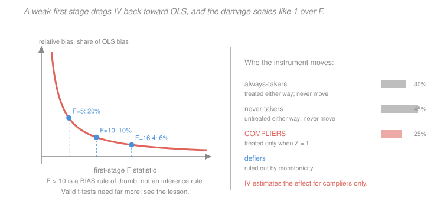

# Econometrics · Lesson 3.8: Weak instruments and LATE

> ⏱ ~15 min · Module 3: Endogeneity and causality · Builds on: [3.6 (instrumental variables)](03-06-instrumental-variables.md), [3.7 (2SLS)](03-07-two-stage-least-squares.md) · Unlocks: 4.3 (difference-in-differences), 4.7 (regression discontinuity)

## Why this matters

Two things can be true at once: your instrument is perfectly valid, and your IV estimate is worthless. This lesson covers both ways that happens, and they are independent problems.

**Weak instruments** break the statistics. When the first stage is small relative to noise, 2SLS is badly biased toward OLS, its distribution is nowhere near normal, and the reported confidence interval has coverage far below its nominal level. The received wisdom — "first-stage $F$ above 10 is fine" — is a rule about *bias*, and it is wildly insufficient for *inference*.

**LATE** breaks the interpretation. Even a strong, valid instrument does not estimate the average treatment effect. It estimates the effect for the people the instrument happened to move, who are generally not a random sample and are sometimes a small and peculiar minority. Reporting a LATE as if it were an ATE is an error of interpretation that no statistic will flag.

## The idea

**Weakness.** IV divides the reduced form by the first stage. Dividing by a number that is small and estimated with error is dangerous — the sampling distribution of a ratio with a near-zero denominator has fat tails and can be bimodal. In the limit of a zero first stage the estimator has no probability limit at all; it converges to a ratio of two correlated normals, which is a Cauchy-like distribution with no mean.

The practical consequence is that a weak instrument does not merely give you a wide interval. It gives you an interval whose stated coverage is false, and a point estimate pulled systematically back toward the OLS estimate you were trying to escape.

**LATE.** Divide the population into four types by how they respond to the instrument: those who always take treatment, those who never do, those who take it only when the instrument pushes them, and those who perversely do the opposite. The instrument moves only the third group. Always-takers and never-takers contribute nothing to the numerator *or* the denominator — they are invisible to the estimator. So the effect you recover is theirs alone.

That is not a defect to apologise for; it is a precise statement of what was learned. But it means "the effect of schooling" estimated from compulsory-schooling laws is the effect *for people who would have dropped out earlier had the law allowed*, and that group's return need not resemble anyone else's.

## The formal version

### Weak instruments

With one endogenous regressor and $m$ instruments, the first-stage $F$-statistic tests $\pi = 0$. The key results:

> **Bias.** The approximate relative bias of 2SLS toward OLS is $\dfrac{1}{F}$ (more precisely $\dfrac{m}{\text{concentration parameter}}$, with $E[F]\approx 1 + \mu^2/m$).

| first-stage $F$ | approximate relative bias |
|---|---|
| $2$ | $50\%$ of the OLS bias |
| $5$ | $20\%$ |
| $10$ | $10\%$ |
| $16.38$ | $6\%$ |

> **Stock–Yogo.** For one endogenous regressor and one instrument, $F > 16.38$ guarantees the bias is at most 10 percent of OLS's; $F>10$ is the looser, and more commonly quoted, threshold.

> **Lee, McCrary, Moreira and Porter (2022).** For a conventional $t$-test at nominal 5 percent to have true size 5 percent, you need roughly $F > 104.7$. Below that, use the $\mathrm{tF}$ adjustment (which inflates the standard error by a factor read off the first-stage $F$) or a weak-instrument-robust method.

That last number deserves a moment. **The gap between $F>10$ and $F>104.7$ is the gap between "the point estimate is not too biased" and "the confidence interval means what it says".** An enormous share of published IV work sits between those two thresholds.

**Weak-instrument-robust inference.** The **Anderson–Rubin** test is the standard fix: test $H_0:\beta = \beta_0$ by regressing $y - \beta_0 D$ on the instruments and testing their joint significance. It is exact under homoskedasticity and **valid regardless of instrument strength**, because it never divides by the first stage. Inverting it — collecting all $\beta_0$ not rejected — gives a confidence set that is honest, and which can legitimately be unbounded or empty. An unbounded AR set is not a failure of the method; it is the correct report that the data do not pin the parameter down.

**Many weak instruments.** As $m$ grows with weak instruments, 2SLS bias grows toward the full OLS bias, because $\hat X$ increasingly overfits and approaches $X$. LIML is far more robust and is the standard alternative. Bound, Jaeger and Baker's demonstration is the canonical warning: replacing Angrist and Krueger's quarter-of-birth instruments with *randomly generated* instruments reproduced similar-looking estimates and standard errors.

### LATE

Let $D_i(z)$ be potential treatment under instrument value $z$, with $Z$ binary. Four types:

| Type | $D_i(0)$ | $D_i(1)$ |
|---|---|---|
| never-taker | $0$ | $0$ |
| always-taker | $1$ | $1$ |
| **complier** | $0$ | $1$ |
| defier | $1$ | $0$ |

> **Assumptions (Imbens–Angrist).** (i) $Z$ independent of $(Y(0),Y(1),D(0),D(1))$; (ii) exclusion — $Z$ affects $Y$ only through $D$; (iii) relevance — $E[D(1)-D(0)]\neq 0$; (iv) **monotonicity** — $D_i(1)\ge D_i(0)$ for all $i$, i.e. no defiers.

> **Theorem (LATE).** Under (i)–(iv),
> $$\frac{E[Y\mid Z=1]-E[Y\mid Z=0]}{E[D\mid Z=1]-E[D\mid Z=0]} \;=\; E\bigl[\,Y_i(1)-Y_i(0)\ \big|\ \text{complier}\,\bigr] .$$

*In words:* the Wald estimator identifies the average treatment effect **among compliers only**.

**Why the other types drop out.** Always-takers have the same $D$ under both values of $Z$, so their outcomes are identical in the two arms and cancel in the numerator; likewise never-takers. They also contribute nothing to the denominator. Only compliers change behaviour, so only they can contribute to either.

**Complier share.** The first stage *is* the complier share: $P(\text{complier}) = E[D\mid Z=1]-E[D\mid Z=0]$. A weak instrument is therefore not only a statistical problem but an interpretive one — **a first stage of 0.05 means the estimate describes 5 percent of the population**, and you cannot say which 5 percent.

**Monotonicity is substantive.** It says the instrument pushes everyone the same direction (or not at all). Plausible for a lottery or an eligibility threshold; questionable when the instrument is a price or an incentive that some people respond to perversely. With defiers, the Wald ratio is a difference of complier and defier effects weighted by their shares, and can lie outside the range of every individual effect.

## Picture

The left panel shows the $1/F$ decay and how flat it becomes past $F\approx 15$ — which is why the "$F>10$" rule felt adequate for bias. The right panel is the interpretive half: only compliers, here 25 percent of the population, contribute anything at all. Three quarters of the sample is invisible to the estimator despite being in the data.

## Worked examples

**Example 1 (mechanical): LATE versus ATE, computed exactly.** Population shares: compliers $0.25$, always-takers $0.30$, never-takers $0.45$, no defiers. Potential outcomes by type:

| Type | $Y(0)$ | $Y(1)$ | effect |
|---|---|---|---|
| complier | $4$ | $10$ | $+6$ |
| always-taker | $6$ | $9$ | $+3$ |
| never-taker | $2$ | $3$ | $+1$ |

*First stage.* Under $Z=1$ the treated are compliers plus always-takers: $E[D\mid Z=1] = 0.25+0.30 = 0.55$. Under $Z=0$ only always-takers: $E[D\mid Z=0] = 0.30$. First stage $= 0.25$, the complier share. $\checkmark$

*Reduced form.* Under $Z=1$: compliers get $Y(1)=10$, always-takers $9$, never-takers $2$:
$$E[Y\mid Z=1] = 0.25(10)+0.30(9)+0.45(2) = 2.5+2.7+0.9 = 6.1 .$$
Under $Z=0$: compliers get $Y(0)=4$, always-takers still $9$, never-takers still $2$:
$$E[Y\mid Z=0] = 0.25(4)+0.30(9)+0.45(2) = 1.0+2.7+0.9 = 4.6 .$$
Reduced form $= 6.1-4.6 = 1.5$.

*Wald estimate.*
$$\frac{1.5}{0.25} = 6.0 = \text{the complier effect} .\ \checkmark$$

*The ATE.*
$$\mathrm{ATE} = 0.25(6)+0.30(3)+0.45(1) = 1.5+0.9+0.45 = 2.85 .$$

**LATE $= 6.0$, ATE $= 2.85$ — the LATE is more than double.** Nothing is estimated badly; a perfectly valid, perfectly strong instrument identifies $6.0$, and $6.0$ is simply not the ATE. Reporting "the effect of the program is 6" would overstate the population effect by a factor of $2.1$.

**Example 2 (why you'd care): two valid instruments that disagree.** Two studies estimate the return to schooling. One uses compulsory-schooling laws and finds $0.13$. One uses distance to college and finds $0.08$. Both have strong first stages, both pass their over-identification tests. Which is right?

**Possibly both.** They identify different LATEs, because they move different people:

- **Compulsory-schooling laws** bind on those who would otherwise leave at the earliest legal age — typically the most disadvantaged, whose marginal year is a year of *high-school* education.
- **Distance to college** binds on those near the margin of attending college at all — typically better prepared, whose marginal year is a year of *college*.

Different compliers, different marginal years of schooling, different returns. A difference of $0.13$ against $0.08$ is not a contradiction requiring one study to be wrong; it is information about **heterogeneity in returns**.

This also explains the ambiguity in [3.7](03-07-two-stage-least-squares.md)'s $J$-test. A rejection means the instruments disagree, which could be invalidity *or* could be exactly this — different instruments recovering genuinely different LATEs. The test cannot distinguish them, so a rejection should prompt a look at which subpopulations each instrument moves, not an automatic conclusion that something is invalid.

The practical discipline this imposes: **describe your compliers.** You can estimate their characteristics — the complier share for any subgroup is that subgroup's first stage, so you can compute the complier profile across education, income or region and report it. A paper that says "our estimate applies to low-income students at the margin of dropping out" has said something a paper reporting only $0.13$ has not.

## Watch out

- **You might think** $F>10$ means your instrument is fine — **but actually** that threshold concerns *bias*, and valid $t$-inference needs roughly $F>104.7$. Between the two, report Anderson–Rubin confidence sets or the $\mathrm{tF}$ adjustment rather than the conventional interval.
- **You might think** an insignificant IV estimate with a wide interval is a null result — **but actually** with a weak instrument the interval's coverage is not what it claims, so it is not evidence of a small effect either. The honest report is that the design does not identify the parameter precisely enough to say anything, and an unbounded AR set states that cleanly.
- **You might think** LATE is a technicality when treatment effects are similar across people — **but actually** you cannot check that, since the effects for always-takers and never-takers are never observed. Constant effects would make LATE $=$ ATE, but constant effects is an assumption of exactly the kind the whole framework exists to avoid making.

## One-liner

> A weak instrument biases 2SLS toward OLS by about $1/F$ and breaks the confidence interval long before it breaks the point estimate, while even a strong valid instrument recovers only the compliers' effect — so report the first-stage $F$, an Anderson–Rubin set when it is small, and a description of who your compliers are.

## Problems

**P1 (🟢)** An IV study reports a first-stage $F$ of $6.2$. Estimate the relative bias toward OLS, state whether conventional $t$-inference is trustworthy, and name what you would report instead. What is the complier share if the first stage is $0.14$?

**P2 (🟡)** With compliers $0.4$ (effect $+2$), always-takers $0.35$ (effect $+8$) and never-takers $0.25$ (effect $+5$), and potential outcomes $Y(0) = 3, 5, 1$ respectively, compute the first stage, the reduced form, the Wald estimate and the ATE. Verify the Wald estimate equals the complier effect and comment on the direction of the gap.

**P3 (🔴, optional)** Prove the LATE theorem for binary $Z$ under the four Imbens–Angrist assumptions, showing explicitly where monotonicity is used. Then construct a numerical example with defiers in which the Wald estimator falls outside the range of every individual treatment effect.

Solutions

**P1** *Relative bias.* Approximately $1/F = 1/6.2 = 0.161$, so 2SLS carries about **16 percent** of the OLS bias. That is below the $F=5$ level but above the Stock–Yogo 10 percent threshold ($F = 16.38$), so the point estimate is meaningfully contaminated.

*Is conventional $t$-inference trustworthy?* **No, not remotely.** With $F = 6.2$ against the Lee–McCrary–Moreira–Porter requirement of about $104.7$, the true size of a nominal 5 percent $t$-test is far above 5 percent — the interval is much too narrow and its coverage is well below 95 percent.

*What to report instead.* An **Anderson–Rubin confidence set**, obtained by inverting the AR test over a grid of candidate $\beta_0$ values. It is valid at any instrument strength, and if it comes back unbounded that is the correct answer: these data do not bound the parameter. Alternatively, the $\mathrm{tF}$ adjustment inflates the standard error by a factor read off the first-stage $F$ (at $F\approx 6$ the factor is large, roughly doubling the standard error or more). Report the reduced form and first stage separately as well — both are ordinary OLS regressions on an exogenous variable and are perfectly well estimated, so the reader can see what the data actually contain before the division.

*Complier share.* The first stage **is** the complier share, so a first stage of $0.14$ means **14 percent** of the population are compliers. The estimate describes those 14 percent, and 86 percent of the sample contributes nothing to it.

**P2** Potential outcomes: compliers $Y(0)=3$, $Y(1)=3+2=5$; always-takers $Y(0)=5$, $Y(1)=5+8=13$; never-takers $Y(0)=1$, $Y(1)=1+5=6$.

*First stage.*
$$E[D\mid Z=1] = 0.4+0.35 = 0.75, \qquad E[D\mid Z=0] = 0.35, \qquad \text{first stage} = 0.40 .$$

*Reduced form.* Under $Z=1$, compliers and always-takers are treated, never-takers are not:
$$E[Y\mid Z=1] = 0.4(5)+0.35(13)+0.25(1) = 2.0+4.55+0.25 = 6.80 .$$
Under $Z=0$, only always-takers are treated:
$$E[Y\mid Z=0] = 0.4(3)+0.35(13)+0.25(1) = 1.2+4.55+0.25 = 6.00 .$$
Reduced form $= 6.80-6.00 = 0.80$.

*Wald estimate.*
$$\frac{0.80}{0.40} = 2.00 = \text{the complier effect } (+2) .\ \checkmark$$

*ATE.*
$$\mathrm{ATE} = 0.4(2)+0.35(8)+0.25(5) = 0.8+2.8+1.25 = 4.85 .$$

*Direction of the gap.* Here **LATE $(2.00)$ is far *below* the ATE $(4.85)$** — the reverse of Example 1, where it was above. The reason is that compliers happen to have the *smallest* effect in this population, while always-takers have by far the largest. Since always-takers are people who take treatment regardless, their large gains are entirely invisible to the instrument.

The lesson worth extracting: **there is no general direction to the LATE/ATE gap.** It depends on whether the compliers happen to be high- or low-return types, which is determined by the instrument and the setting, not by any general economic logic. Selection-on-gains intuition ("volunteers gain most") gives a prior about *always-takers* versus *never-takers*, not about compliers, who sit in the middle by construction. So "LATE is probably an upper bound on the ATE" is not a defensible default — the honest position is that the sign of the gap is unknown without further argument.

**P3** *Proof.* By exclusion, write $Y_i = Y_i(D_i)$ and note $D_i = D_i(Z_i)$. Then for each $z$,
$$E[Y\mid Z=z] = E\bigl[Y(D(z))\bigr] ,$$
using independence of $Z$ from all potential quantities to drop the conditioning. Subtracting,
$$E[Y\mid Z=1]-E[Y\mid Z=0] = E\bigl[Y(D(1)) - Y(D(0))\bigr] .$$
Now split by type. The integrand is zero for always-takers ($D(1)=D(0)=1$) and never-takers ($D(1)=D(0)=0$), since both arguments coincide. For compliers ($D(0)=0, D(1)=1$) it is $Y(1)-Y(0)$. For defiers ($D(0)=1,D(1)=0$) it is $Y(0)-Y(1) = -(Y(1)-Y(0))$. Hence
$$E[Y\mid Z=1]-E[Y\mid Z=0] = P(C)\,E[Y(1)-Y(0)\mid C] \;-\; P(F)\,E[Y(1)-Y(0)\mid F] ,$$
writing $C$ for compliers and $F$ for defiers.

**Monotonicity enters here**: assumption (iv) sets $P(F)=0$, killing the second term. Without it, the numerator is a *difference* of two group effects.

For the denominator, the same type decomposition gives
$$E[D\mid Z=1]-E[D\mid Z=0] = E[D(1)-D(0)] = P(C) - P(F) ,$$
which monotonicity reduces to $P(C)$. Dividing,
$$\frac{E[Y\mid Z=1]-E[Y\mid Z=0]}{E[D\mid Z=1]-E[D\mid Z=0]} = \frac{P(C)E[Y(1)-Y(0)\mid C]}{P(C)} = E[Y(1)-Y(0)\mid C] . \ \square$$

Monotonicity is used **twice** — once to clear the defier term from the numerator and once from the denominator — and it is essential to both.

*Counterexample with defiers.* Let compliers be $40$ percent with effect $+2$, defiers $30$ percent with effect $+10$, and always-takers $30$ percent (effect irrelevant). Then

$$\text{numerator} = 0.4(2) - 0.3(10) = 0.8-3.0 = -2.2 ,$$
$$\text{denominator} = P(C)-P(F) = 0.4-0.3 = 0.10 ,$$
$$\text{Wald} = \frac{-2.2}{0.10} = -22.0 .$$

**Every individual effect in this population is positive** (compliers $+2$, defiers $+10$), yet the Wald estimator returns $-22$ — the wrong sign, and a magnitude more than twice the largest individual effect.

Two mechanisms compound. The numerator is a *difference*, so defiers with large positive effects subtract; and the denominator is a *difference of shares*, so with $P(C)$ and $P(F)$ close together it is near zero and divides a contaminated numerator by a small number. This is the same $1/\pi_1$ amplification as [3.6](03-06-instrumental-variables.md)'s P3, and it shows that **monotonicity is not a regularity condition — it is load-bearing.** When an instrument is a price, an incentive, or an eligibility rule that some agents respond to perversely, its plausibility deserves as much defence as the exclusion restriction usually gets.

## Flashback

**From Lesson 3.6 (instrumental variables):** A study instruments for police numbers using the timing of federal grant cycles, reporting a first stage of $0.62$ (strong), an OLS crime coefficient of $+0.15$ and an IV coefficient of $-0.31$. Explain why OLS and IV differ in sign, and state what must be true of the grant timing for the IV estimate to be credible.

Solution

*Why the signs differ.* This is [3.5](03-05-measurement-error-and-simultaneity.md)'s simultaneity in its cleanest form. Cities hire police **in response to crime**: rising crime produces political pressure, budget increases and more officers. So the policy reaction function has a positive slope, and police numbers are jointly determined with crime rather than exogenous.

In [3.4](03-04-omitted-variable-bias.md)'s notation, the contaminating factor is underlying criminogenic conditions $W$: $\delta > 0$ (worse conditions raise crime) and $\pi > 0$ (worse conditions lead to more police being hired), so the bias $\delta\pi$ is **positive** and large. If the true causal effect is $\beta_1 = -0.31$ — more police reduce crime — then the observed OLS coefficient
$$\gamma_1 = \beta_1 + \delta\pi = -0.31 + 0.46 = +0.15$$
implies a bias of $+0.46$, larger in magnitude than the effect itself. This is exactly [3.4](03-04-omitted-variable-bias.md)'s Example 2 pattern: the bias exceeds the effect and reverses its sign, so OLS confidently reports that police *cause* crime.

A strong first stage of $0.62$ means the weak-instrument concerns of this lesson are not binding — the bias from weakness is small and conventional inference is closer to trustworthy, though $F$ would still need checking against the $104.7$ benchmark before the interval is taken at face value.

*What must be true for credibility.* The exclusion restriction, which here has a specific and checkable-in-principle content: **the timing of federal grant cycles must be unrelated to local crime trends, except through its effect on police hiring.** Three threats to address:

1. **Grants must not be awarded in response to crime.** If the federal formula allocates money to cities with rising crime, the instrument is contaminated by exactly the confounder it was meant to avoid — and would then be a *worse* instrument than no instrument, since it carries the same reverse causality with a small denominator. The design requires that the *timing* be driven by federal budget politics, appropriation cycles, or application deadlines, not by local conditions.
2. **Grants must not fund anything else that affects crime.** If the same grant program also pays for lighting, community programs or prosecutors, then the money reaches crime through channels other than officer counts, the exclusion restriction fails directly, and the estimate attributes the whole package's effect to police alone.
3. **No anticipation.** If cities can predict the grant cycle and adjust hiring or other policies beforehand, the sharp timing contrast is blurred and the first stage measures something other than the true shift.

The strongest version of this design uses variation in grant timing that is genuinely bureaucratic — application backlogs, fiscal-year boundaries, a formula quirk — and shows that pre-grant crime trends do not predict the timing. That last check is the event-study logic of [4.4](04-04-event-studies-dynamic-did.md), and it is the closest thing available to a test of an exclusion restriction: not a proof, but evidence that the most obvious violation is absent.

## Connections

- **Backward:** the $1/F$ bias and $1/\operatorname{Corr}(Z,D)^2$ variance inflation are the sharp versions of [3.6](03-06-instrumental-variables.md)'s warnings, and the ambiguity of a rejected $J$-test in [3.7](03-07-two-stage-least-squares.md) is resolved here as possible effect heterogeneity. The LATE is [3.1](03-01-potential-outcomes-identification.md)'s estimand zoo gaining a fourth member, defined by the instrument rather than by the treatment.
- **Forward:** fuzzy regression discontinuity in [4.7](04-07-regression-discontinuity.md) is IV whose compliers are those induced to switch at the threshold — the narrowest and most explicitly local LATE in the course. Difference-in-differences in [4.3](04-03-difference-in-differences.md) has its own version of this problem: it identifies an ATT for the treated group, not a population effect.
- **Sideways:** the "describe your compliers" discipline is the observational counterpart of external validity in clinical trials, where the analogous complaint is that trial participants differ from the treated population. Both fields converged on the same answer — report the characteristics of the group your estimate actually describes, and let the reader judge transportability.
