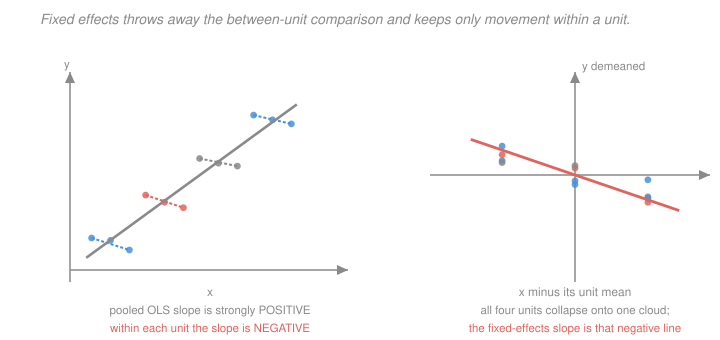

# Econometrics · Lesson 4.1: Panel data and fixed effects

> ⏱ ~15 min · Module 4: Panel data and quasi-experiments · Builds on: [3.7 (2SLS)](03-07-two-stage-least-squares.md), [1.3 (FWL)](01-03-ols-algebra-geometry-projection.md) · Unlocks: 4.2 (first differencing), 4.3 (difference-in-differences)

## Why this matters

Module 3's selection-on-observables approach requires you to *measure* the confounder. Its instrumental-variables approach requires you to *find* an exogenous shifter. Panel data offers a third route that requires neither: if the confounder is a fixed trait of the unit — a firm's management culture, a person's innate ability, a country's institutions — then observing the same unit repeatedly lets you difference it away without ever knowing what it is.

That is a remarkable deal, and it is why panel methods dominate applied microeconomics. It is also a *specific* deal with a *specific* price, and the price is worth stating up front: you can only difference away what does not change, and you can only learn about variables that do.

## The idea

Watch the same unit over time. Whatever is constant about it — call it $\alpha_i$, and never mind what it consists of — shifts every one of its observations by the same amount. So if you compare a unit to *itself*, that shift cancels.

The mechanics are one line from [1.3](01-03-ols-algebra-geometry-projection.md): including a dummy for every unit is, by Frisch–Waugh–Lovell, identical to subtracting each unit's own mean from every variable. Fixed effects is demeaning. That single fact makes the method computable on millions of units and, more importantly, tells you immediately *what variation identifies the coefficient* — only the within-unit deviations survive.

Three consequences follow directly, and each is a real constraint:

- Anything constant within a unit is annihilated. You cannot estimate the effect of sex, race, or country of birth in a unit-fixed-effects model, because those variables have no within variation to use.
- Time-varying confounders are untouched. Fixed effects handles the confounders that stay still; it does nothing about the ones that move.
- Measurement error gets worse. Differencing removes signal along with the fixed effect, so the reliability ratio falls and attenuation ([3.5](03-05-measurement-error-and-simultaneity.md)) worsens — sometimes badly.

## The formal version

A **panel** observes $N$ units over $T$ periods. The model with unobserved heterogeneity:
$$y_{it} = x_{it}'\beta + \alpha_i + u_{it}, \qquad i=1,\dots,N,\ t=1,\dots,T .$$
Here $\alpha_i$ is the **unit fixed effect**, an unobserved time-invariant term that may be *arbitrarily correlated with $x_{it}$* — which is exactly the case that defeats every method in Module 3's first half.

> **Assumption (strict exogeneity, conditional on $\alpha_i$).** $E[u_{it}\mid x_{i1},\dots,x_{iT},\alpha_i]=0$ for all $t$.

*In words:* the idiosyncratic error is unrelated to the regressors in **every** period — past, present and future. This is strong. It rules out feedback from outcomes to future regressors, so a lagged dependent variable violates it by construction (see [4.2](04-02-first-differencing-random-effects.md)).

> **The within transformation.** Let $\bar y_i = \frac1T\sum_t y_{it}$ and likewise $\bar x_i$. Subtracting the unit means,
> $$y_{it}-\bar y_i = (x_{it}-\bar x_i)'\beta + (u_{it}-\bar u_i) ,$$
> since $\alpha_i - \bar\alpha_i = 0$. OLS on this demeaned data is the **within** or **fixed-effects** estimator
> $$\hat\beta_{FE} = \Bigl(\sum_{i,t}\ddot x_{it}\ddot x_{it}'\Bigr)^{-1}\sum_{i,t}\ddot x_{it}\ddot y_{it}, \qquad \ddot z_{it}=z_{it}-\bar z_i .$$

> **Theorem (equivalence to dummies).** $\hat\beta_{FE}$ is numerically identical to the OLS coefficient on $x$ in a regression of $y$ on $x$ and a full set of $N$ unit dummies.

This is FWL with $X_2$ = the dummies, whose residual maker $M_2$ is exactly the demeaning operator. **Identical, not merely similar** — and this is what makes the method feasible, since inverting an $N\times N$ system for $N$ in the millions is impossible while demeaning is one pass through the data.

**Degrees of freedom.** You have implicitly estimated $N$ intercepts, so the residual degrees of freedom are $NT - N - k$, not $NT-k$. Statistical packages handle this; hand-demeaning followed by plain OLS does not, and will report standard errors that are too small.

**Two-way fixed effects.** Adding time effects $\lambda_t$,
$$y_{it} = x_{it}'\beta + \alpha_i + \lambda_t + u_{it} ,$$
absorbs anything common to all units in a period — a national recession, a policy affecting everyone. The transformation becomes $y_{it}-\bar y_i - \bar y_t + \bar y$. This specification is the workhorse of Module 4 and the subject of [4.3](04-03-difference-in-differences.md) and [4.5](04-05-staggered-adoption-modern-did.md).

**Standard errors.** **Cluster by unit.** Non-negotiable. The $u_{it}$ are serially correlated within a unit almost always, and [2.5](02-05-clustered-standard-errors.md)'s Bertrand–Duflo–Mullainathan result is precisely about this setting. The relevant sample size is $N$, the number of units, not $NT$.

**Measurement error is amplified.** If $x^*$ is measured with classical error, the reliability of the *demeaned* regressor is
$$\lambda_{FE} = \frac{\operatorname{Var}(\ddot x^*)}{\operatorname{Var}(\ddot x^*)+\operatorname{Var}(\ddot v)} ,$$
and since demeaning removes the persistent (largely signal) component while leaving the noise, $\lambda_{FE} < \lambda$. Persistent regressors suffer most: if $x^*$ barely moves within a unit, almost all the surviving variation is noise, and the coefficient is attenuated toward zero.

## Picture

The left panel is Simpson's paradox in panel form: the pooled slope is strongly positive while every unit's internal slope is negative. The right panel is the same data after demeaning — the four units land on top of one another and the fixed-effects slope is the negative one. Which is right depends entirely on whether the between-unit differences are confounded, which is a judgement about $\alpha_i$, not a fact the data supply.

## Worked examples

**Example 1 (mechanical): fixed effects equals demeaning.** Two units, three periods:

| unit | $t$ | $x$ | $y$ |
|---|---|---|---|
| 1 | 1 | $2$ | $5$ |
| 1 | 2 | $4$ | $9$ |
| 1 | 3 | $6$ | $13$ |
| 2 | 1 | $1$ | $12$ |
| 2 | 2 | $3$ | $16$ |
| 2 | 3 | $5$ | $20$ |

Unit means: $\bar x_1 = 4$, $\bar y_1 = 9$; $\bar x_2 = 3$, $\bar y_2 = 16$. Demeaned values:
$$\ddot x = (-2,0,2,\ -2,0,2), \qquad \ddot y = (-4,0,4,\ -4,0,4) .$$
The within estimator is
$$\hat\beta_{FE} = \frac{\sum \ddot x\ddot y}{\sum \ddot x^2} = \frac{8+0+8+8+0+8}{4+0+4+4+0+4} = \frac{32}{16} = 2.0 .$$

Now compare with **pooled OLS** ignoring the panel structure. Overall means are $\bar x = 3.5$, $\bar y = 12.5$, and
$$\sum(x-\bar x)(y-\bar y) = (-1.5)(-7.5)+(0.5)(-3.5)+(2.5)(0.5)+(-2.5)(-0.5)+(-0.5)(3.5)+(1.5)(7.5) = 11.25-1.75+1.25+1.25-1.75+11.25 = 21.5 ,$$
$$\sum(x-\bar x)^2 = 2.25+0.25+6.25+6.25+0.25+2.25 = 17.5 ,$$
so $\hat\beta_{\text{pooled}} = 21.5/17.5 = 1.2286$.

The two differ because unit 2 has a much higher intercept ($\alpha_2 - \alpha_1 = 7$) *and* a lower average $x$ — a negative correlation between the fixed effect and the regressor, which is precisely the confounding fixed effects is designed to remove. The true within-unit slope is $2.0$; pooling contaminates it down to $1.23$.

**Example 2 (why you'd care): what fixed effects cannot save you from.** A study of the effect of unionisation on wages uses worker fixed effects, comparing the same worker before and after joining a union. This handles ability, family background, and any other permanent trait — a genuine advance over cross-sectional comparison.

But consider what remains. Workers do not join unions at random moments. Someone whose firm is doing well, whose sector is expanding, or who has just received a promotion may join at that time — and all of those are *time-varying* and correlated with wage growth. Fixed effects removes the level of a worker's earning power and leaves the timing of their union decision entirely unexamined.

Concretely, if workers join unions just as their careers accelerate, the estimated union premium picks up the acceleration. The remedy is not more fixed effects but a design that addresses *timing*: an event study ([4.4](04-04-event-studies-dynamic-did.md)) showing wages were flat before joining, or an instrument for union status.

There is a second, quieter cost. Union status is highly persistent — most workers never switch. The within variation comes from the small minority who do, so the estimate is a LATE-like object for switchers, and if union membership is recorded with any error, the attenuation from demeaning can be severe. **Fixed effects buys credibility by throwing away data, and both halves of that sentence matter.**

## Watch out

- **You might think** fixed effects controls for unobservables — **but actually** it controls for *time-invariant* unobservables only. Time-varying confounders pass through untouched, and they are usually the ones driving the timing of treatment.
- **You might think** you can include a variable that barely changes within units — **but actually** if there is almost no within variation, the coefficient is identified off a tiny and possibly unrepresentative slice of the data, its standard error explodes, and any measurement error is amplified enormously. Report the share of variance that is within, and treat a small one as a warning.
- **You might think** unit fixed effects and clustering are alternatives — **but actually** they solve different problems. Fixed effects removes a *bias* from correlated unobserved levels; clustering fixes *standard errors* for correlated errors. You need both, essentially always.

## One-liner

> Fixed effects is demeaning by unit, so it silently deletes every time-invariant confounder and every time-invariant regressor at once — leaving you with only the within-unit variation, which is credible, small, and unusually vulnerable to measurement error.

## Problems

**P1 (🟢)** Two units, two periods. Unit 1: $(x,y) = (1,3)$ and $(3,7)$. Unit 2: $(x,y)=(4,6)$ and $(6,10)$. Compute the fixed-effects estimate and the pooled OLS estimate. Explain the difference in terms of the correlation between $\alpha_i$ and $\bar x_i$.

**P2 (🟡)** Show that including a variable that is constant within units produces perfect collinearity with the unit dummies. Then explain what happens if the variable is *nearly* constant, and what diagnostic you would report.

**P3 (🔴, optional)** Suppose $x_{it}^* $ follows $x^*_{it} = \mu_i + \eta_{it}$ with $\operatorname{Var}(\mu_i)=\sigma^2_\mu$ and $\operatorname{Var}(\eta_{it})=\sigma^2_\eta$, and is measured with classical error of variance $\sigma^2_v$. Compare the reliability ratio in levels with that after within-demeaning ($T=2$ for concreteness), and evaluate both for $\sigma^2_\mu = 9$, $\sigma^2_\eta = 1$, $\sigma^2_v = 1$.

Solutions

**P1** *Fixed effects.* Unit means: $\bar x_1 = 2$, $\bar y_1 = 5$; $\bar x_2 = 5$, $\bar y_2 = 8$. Demeaned:
$$\ddot x = (-1, 1,\ -1, 1), \qquad \ddot y = (-2, 2,\ -2, 2) .$$
$$\hat\beta_{FE} = \frac{\sum\ddot x\ddot y}{\sum \ddot x^2} = \frac{2+2+2+2}{1+1+1+1} = \frac{8}{4} = 2.0 .$$

*Pooled OLS.* Overall means $\bar x = 3.5$, $\bar y = 6.5$.
$$\sum(x-\bar x)(y-\bar y) = (-2.5)(-3.5)+(-0.5)(0.5)+(0.5)(-0.5)+(2.5)(3.5) = 8.75-0.25-0.25+8.75 = 17.0 ,$$
$$\sum(x-\bar x)^2 = 6.25+0.25+0.25+6.25 = 13.0 ,$$
$$\hat\beta_{\text{pooled}} = \frac{17.0}{13.0} = 1.3077 .$$

*Explanation.* The within-unit slope is exactly $2$ for both units — each moves $+2$ in $x$ and $+4$ in $y$. So $2.0$ is the correct structural slope, and pooling gives $1.31$.

The distortion comes from the fixed effects. Unit 1 has $\alpha$-level implying $y = 3$ at $x=1$; unit 2 has $y=6$ at $x=4$. Fitting the unit-2 points with the true slope $2$ would predict $y = 3 + 2(4-1) = 9$ at $x=4$, but unit 2 actually shows $6$ — so $\alpha_2 - \alpha_1 = -3$. Meanwhile $\bar x_2 = 5 > \bar x_1 = 2$. So the fixed effect is **negatively** correlated with the unit's average $x$: the unit with higher $x$ has a *lower* intercept. Pooled OLS attributes part of that downward level shift to the slope, biasing it toward zero — from $2.0$ to $1.31$.

Had the correlation run the other way (high-$x$ units with high intercepts), pooling would have *overstated* the slope. The direction is [3.4](03-04-omitted-variable-bias.md)'s OVB formula with $\alpha_i$ as the omitted variable, and the sign is $\operatorname{sign}(\operatorname{Cov}(\alpha_i, \bar x_i))$.

**P2** *Perfect collinearity.* Let $z_i$ be constant within unit $i$, and let $d_{i}$ be that unit's dummy. Then the column of $z$ values satisfies
$$z = \sum_{i=1}^N z_i\, d_i ,$$
an exact linear combination of the dummy columns. So the design matrix loses rank, $X'X$ is singular, and $\hat\beta$ is not unique — the dummy-variable trap of [1.3](01-03-ols-algebra-geometry-projection.md) in panel form. Equivalently, in the within transformation $\ddot z_{it} = z_i - \bar z_i = 0$: the demeaned regressor is identically the zero vector, which carries no information and cannot have a coefficient. Software will either drop the variable or report an error.

*Nearly constant.* Now $\ddot z$ is not zero but is very small — say a handful of units switch, or the variable drifts slightly. Three things happen simultaneously:

1. **The variance explodes.** From [1.5](01-05-goodness-of-fit-interpretation.md), $\operatorname{Var}(\hat\beta_z) = \sigma^2/\sum_{i,t}\ddot z_{it}^2$, and the denominator is tiny. The standard error may be so large that the estimate is uninformative.
2. **Attenuation worsens.** By P3's logic, demeaning removes the between-unit signal but not the measurement noise, so the reliability of $\ddot z$ can be far below that of $z$. With a nearly-constant variable, most of what survives demeaning may *be* noise.
3. **Representativeness fails.** The coefficient is identified entirely by the few units that switch, and switchers are rarely a random subset — a LATE-like problem with no instrument to describe it.

*Diagnostic to report.* The **share of the variable's total variance that is within-unit**:
$$\frac{\sum_{i,t}(z_{it}-\bar z_i)^2}{\sum_{i,t}(z_{it}-\bar z)^2} .$$
Report it for every key regressor. Below roughly 10 percent, treat the fixed-effects estimate with real suspicion. Also report **how many units actually switch** — with a binary treatment, "3,000 firms, of which 47 ever change status" tells the reader far more about what the estimate rests on than any standard error does.

**P3** *Reliability in levels.* The observed regressor is $x_{it} = \mu_i + \eta_{it} + v_{it}$, so
$$\lambda_{\text{levels}} = \frac{\operatorname{Var}(x^*)}{\operatorname{Var}(x^*)+\operatorname{Var}(v)} = \frac{\sigma^2_\mu+\sigma^2_\eta}{\sigma^2_\mu+\sigma^2_\eta+\sigma^2_v} .$$

*Reliability after demeaning, $T=2$.* With two periods, $\ddot z_{i1} = (z_{i1}-z_{i2})/2$ and $\ddot z_{i2} = -(z_{i1}-z_{i2})/2$, so the demeaned variable is proportional to the first difference and the factor of $\tfrac12$ cancels in the ratio. Demeaning kills $\mu_i$ entirely:
$$\ddot x^*_{it} \text{ has variance } \tfrac{1}{2}\cdot 2\sigma^2_\eta\cdot\tfrac12 \ \propto\ \sigma^2_\eta, \qquad \ddot v_{it}\ \propto\ \sigma^2_v ,$$
with the same constant of proportionality, so
$$\lambda_{FE} = \frac{\sigma^2_\eta}{\sigma^2_\eta+\sigma^2_v} .$$
**The persistent component $\sigma^2_\mu$ has vanished from the numerator but $\sigma^2_v$ is fully intact in the denominator.**

*Evaluation* at $\sigma^2_\mu = 9$, $\sigma^2_\eta=1$, $\sigma^2_v=1$:
$$\lambda_{\text{levels}} = \frac{9+1}{9+1+1} = \frac{10}{11} = 0.909, \qquad \lambda_{FE} = \frac{1}{1+1} = 0.500 .$$

Attenuation goes from **9 percent to 50 percent**. The fixed-effects estimate is biased toward zero by half, purely from measurement error that was nearly harmless in levels.

The mechanism is worth stating plainly: **demeaning removes signal and keeps noise.** The between-unit variation $\sigma^2_\mu$ was mostly signal, and fixed effects deletes all of it by design; the classical measurement error is unaffected by the transformation, since $v_{it}$ is independent across periods. The more persistent the regressor — the larger $\sigma^2_\mu$ relative to $\sigma^2_\eta$ — the worse the trade.

This is the central tension of panel methods, and it is a genuine trade rather than a flaw: fixed effects removes omitted-variable bias of unknown sign and magnitude, and introduces attenuation bias of known sign toward zero. Whether that is a good bargain depends on how big $\operatorname{Cov}(\alpha_i,\bar x_i)$ was and how well the regressor is measured. When both estimates are reported, the FE estimate is often best read as a **lower bound in magnitude** and the pooled estimate as contaminated in an unknown direction — a pair of one-sided statements that is frequently more honest than either number alone.

## Flashback

**From Lesson 3.7 (two-stage least squares):** A 2SLS specification has 1 endogenous regressor, 4 excluded instruments and 6 exogenous controls. State the identification status and the $J$-test degrees of freedom. The reported first-stage $F$ is $3.1$ and the $J$-test does not reject. What do you conclude?

Solution

*Counting.* $k_1 = 1$, $k_2 = 6$, $m = 4$. So $k = 1+6 = 7$ parameters and $\ell = 4+6 = 10$ instruments.

*Identification status.* $m = 4 > 1 = k_1$, so the model is **over-identified** with three surplus instruments.

*$J$-test degrees of freedom.* $\mathrm{df} = m - k_1 = 4-1 = 3$, so $J\sim\chi^2_3$ with a 5 percent critical value of $7.815$.

*What to conclude from $F = 3.1$ and a non-rejected $J$.* **That the design is in serious trouble, and that the $J$-test provides no comfort whatsoever.**

Taking the two pieces in turn:

1. **$F = 3.1$ is catastrophically weak.** By [3.8](03-08-weak-instruments-and-late.md)'s $1/F$ rule, 2SLS retains roughly $1/3.1 = 32$ percent of the OLS bias — so the estimator has removed less than a third of the problem it exists to solve. It is far below Stock–Yogo's $16.38$ and nowhere near the $F > 104.7$ that valid $t$-inference requires. The reported confidence interval's coverage is not 95 percent and is not knowable without a robust method.

2. **Four instruments makes it worse, not better.** [3.7](03-07-two-stage-least-squares.md)'s warning applies directly: with many weak instruments, the first-stage fitted values increasingly fit noise, $\hat X$ drifts toward $X$, and 2SLS drifts toward the OLS estimate it was meant to escape. The bias grows roughly in proportion to $m$. Dropping to the single strongest instrument, or reporting LIML alongside, would both be improvements.

3. **The non-rejection is uninformative.** A $J$-test has power to detect *disagreement* among instruments, and with a first stage this weak every individual instrument's estimate has an enormous standard error — so they cannot disagree detectably no matter how invalid they are. A weak-instrument $J$-test fails to reject almost regardless of the truth. Reading it as validation inverts what it says.

*What to do.* Report the reduced form and the first stage separately — both are clean OLS regressions on exogenous variables and are well estimated even when their ratio is not. Report an **Anderson–Rubin** confidence set, which is valid at any instrument strength and may well come back unbounded, which would be the honest answer. And state plainly that the design does not identify the parameter with useful precision, rather than presenting a point estimate whose bias is a third of OLS's and whose interval means nothing.

## Connections

- **Backward:** the within transformation is [1.3](01-03-ols-algebra-geometry-projection.md)'s FWL with unit dummies as the partialled-out block — Example 2 of that lesson previewed exactly this. The attenuation amplification is [3.5](03-05-measurement-error-and-simultaneity.md)'s reliability ratio recomputed on demeaned data, and clustering by unit is [2.5](02-05-clustered-standard-errors.md) applied to the setting it was written about.
- **Forward:** [4.2](04-02-first-differencing-random-effects.md) compares this with first differencing and asks when to prefer each; [4.3](04-03-difference-in-differences.md) adds time effects and a treatment indicator to get difference-in-differences, which is two-way fixed effects with a particular treatment structure. [4.5](04-05-staggered-adoption-modern-did.md) shows that structure breaking down.
- **Sideways:** the choice between within and between variation is the panel analogue of [3.3](03-03-regression-anatomy-good-and-bad-controls.md)'s weighting question — both ask which slice of the data a coefficient rests on. And the Simpson's-paradox picture is the same phenomenon that makes aggregate and individual-level regressions disagree, an issue with a long history in the ecological-inference literature.
