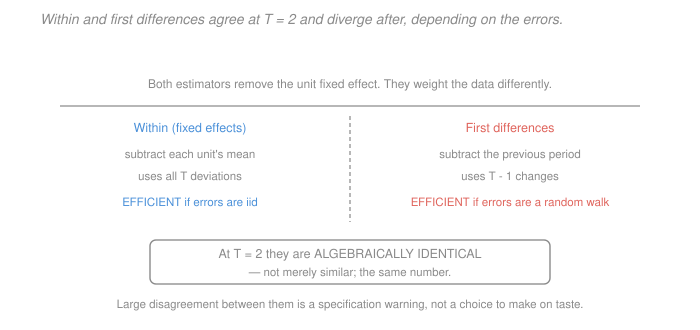

# Econometrics · Lesson 4.2: First differencing and random effects

> ⏱ ~15 min · Module 4: Panel data and quasi-experiments · Builds on: [4.1 (panel data and fixed effects)](04-01-panel-data-fixed-effects.md) · Unlocks: 4.3 (difference-in-differences), 5.1 (maximum likelihood)

## Why this matters

[4.1](04-01-panel-data-fixed-effects.md) gave one way to remove a unit effect. There are two others, and choosing among them is not a matter of taste — each makes a different bet, and the bets have consequences you can check.

**First differencing** removes the fixed effect by subtracting consecutive periods rather than the unit mean. At $T=2$ it is literally the same estimator; beyond that it differs, and which is more efficient depends on how the errors behave over time.

**Random effects** makes a much stronger assumption — that the unit effect is *uncorrelated* with the regressors — and is rewarded with efficiency and the ability to estimate coefficients on time-invariant variables. That assumption is usually false in economics, which is why fixed effects dominates. But knowing exactly what random effects buys, and having a test for whether you can have it, is worth the fifteen minutes.

## The idea

Both transformations kill $\alpha_i$; they differ in what they *keep*.

Demeaning compares each observation with the unit's overall average, so it uses all $T$ deviations and treats every period symmetrically. First differencing compares each observation with the one immediately before, so it uses $T-1$ changes and privileges adjacent periods.

The efficiency question is about the errors. If the $u_{it}$ are independent over time, differencing *creates* negative serial correlation where none existed — so demeaning wins. If instead the errors are a random walk, differencing turns them into white noise and demeaning leaves them correlated — so differencing wins. Neither dominates; the data have to tell you.

Random effects is a different animal. If you are willing to assume $\alpha_i$ is orthogonal to the regressors, you no longer need to remove it — you can treat it as part of a structured error term and use generalised least squares to weight the within and between variation optimally. That extracts more information than fixed effects, which discards the between variation entirely. The price is an assumption that Module 3 spent eight lessons explaining why you should not make casually.

## The formal version

### First differencing

Differencing the model $y_{it} = x_{it}'\beta+\alpha_i+u_{it}$ across adjacent periods:
$$\Delta y_{it} = \Delta x_{it}'\beta + \Delta u_{it}, \qquad \Delta z_{it} = z_{it}-z_{i,t-1} ,$$
with $\alpha_i$ gone. OLS on the differenced data gives $\hat\beta_{FD}$, consistent under the same strict-exogeneity assumption as fixed effects.

> **Theorem.** When $T=2$, $\hat\beta_{FD} = \hat\beta_{FE}$ exactly.

*Why:* with two periods, $\ddot z_{i1} = z_{i1}-\bar z_i = (z_{i1}-z_{i2})/2 = -\Delta z_{i2}/2$ and $\ddot z_{i2} = +\Delta z_{i2}/2$. Both variables are scaled by the same $\pm\tfrac12$, and the estimator is a ratio in which the scaling and the doubling of observations cancel exactly.

**Efficiency for $T>2$.**

| If $u_{it}$ is... | then $\Delta u_{it}$ is... | preferred estimator |
|---|---|---|
| serially uncorrelated | MA(1) with correlation $-0.5$ | **fixed effects** |
| a random walk ($u_{it}=u_{i,t-1}+e_{it}$) | white noise | **first differencing** |
| something in between | serially correlated | either; cluster and compare |

Neither is unbiased-or-not; both are consistent. The choice is about variance — and in practice about which is more robust, since **first differencing survives some violations of strict exogeneity that fixed effects does not.** Under sequential exogeneity ($E[u_{it}\mid x_{it}, x_{i,t-1},\dots]=0$, allowing feedback from past outcomes to future regressors), fixed effects is inconsistent for fixed $T$ because $\bar x_i$ contains future values, while differencing can be repaired with lagged instruments — the Arellano–Bond idea for dynamic panels.

**A useful diagnostic.** Report both. Under correct specification they estimate the same thing and should agree up to sampling error. A large disagreement is evidence of misspecification — a violated exogeneity assumption, a misspecified functional form, or measurement error interacting with the two transformations differently.

### Random effects

> **Assumption (RE).** $E[\alpha_i \mid x_{i1},\dots,x_{iT}] = 0$ — the unit effect is uncorrelated with the regressors in every period.

Under RE, the composite error $\nu_{it} = \alpha_i + u_{it}$ has variance $\sigma^2_\alpha+\sigma^2_u$ and equicorrelation $\rho = \sigma^2_\alpha/(\sigma^2_\alpha+\sigma^2_u)$ within a unit. OLS is then consistent but inefficient (and its classical standard errors are wrong — this is exactly [2.5](02-05-clustered-standard-errors.md)'s clustering problem). GLS is efficient, and it takes the form of **quasi-demeaning**:
$$y_{it} - \theta\bar y_i = (x_{it}-\theta\bar x_i)'\beta + \text{error}, \qquad \theta = 1 - \sqrt{\frac{\sigma_u^2}{\sigma_u^2 + T\sigma_\alpha^2}} .$$

*In words:* subtract a *fraction* $\theta$ of the unit mean rather than all of it. The two extremes are instructive: $\theta = 0$ (when $\sigma^2_\alpha = 0$) gives pooled OLS; $\theta\to 1$ (when $\sigma^2_\alpha$ dominates, or $T\to\infty$) gives fixed effects. **Random effects is a weighted compromise between pooling and demeaning**, and its whole advantage is that it retains some between-unit information rather than discarding it.

What that buys: smaller standard errors, and coefficients on **time-invariant regressors** — sex, race, country of birth — which fixed effects cannot estimate at all.

What it costs: if $\operatorname{Cov}(\alpha_i, x_{it})\neq 0$, random effects is **inconsistent**, with the bias of [3.4](03-04-omitted-variable-bias.md) applied to the omitted $\alpha_i$.

### The Hausman test

> **Hausman.** Under $H_0$ (the RE assumption holds), both $\hat\beta_{FE}$ and $\hat\beta_{RE}$ are consistent and RE is efficient. Under $H_1$, only FE is consistent. Then
> $$H = (\hat\beta_{FE}-\hat\beta_{RE})'\bigl[\widehat{\operatorname{Var}}(\hat\beta_{FE})-\widehat{\operatorname{Var}}(\hat\beta_{RE})\bigr]^{-1}(\hat\beta_{FE}-\hat\beta_{RE}) \ \xrightarrow{d}\ \chi^2_q$$
> under $H_0$, where $q$ is the number of time-varying regressors compared.

*In words:* if the two estimators disagree by more than sampling noise, the RE assumption is rejected. The variance of the *difference* is the difference of the variances — a special feature of comparing an efficient estimator with a consistent one, since $\operatorname{Cov}(\hat\beta_{FE}-\hat\beta_{RE},\hat\beta_{RE})=0$ under $H_0$.

**Three cautions.** The variance difference can be non-positive-definite in finite samples, in which case the statistic is undefined or negative; the standard fix is the Mundlak/Wooldridge regression-based version, which adds $\bar x_i$ to the RE specification and tests whether its coefficients are jointly zero (an ordinary Wald test, robust and always computable). The classical Hausman form also assumes homoskedasticity and no clustering, so it should be replaced by the robust version whenever you are clustering — which you should be. And a failure to reject is not evidence for RE: with noisy fixed-effects estimates the test has little power.

## Picture

The box is the fact worth memorising: at two periods there is no choice to make. Beyond that, the two columns describe a genuine trade, and the line at the bottom is the practical advice — report both, and treat a large gap as a specification warning rather than a menu.

## Worked examples

**Example 1 (mechanical): FE equals FD at $T=2$.** Two units, two periods. Unit 1: $(x,y) = (2,5)$ then $(5,11)$. Unit 2: $(x,y)=(3,4)$ then $(4,6)$.

*First differences.* $\Delta x = (3, 1)$, $\Delta y = (6,2)$, so
$$\hat\beta_{FD} = \frac{\sum\Delta x\Delta y}{\sum(\Delta x)^2} = \frac{18+2}{9+1} = \frac{20}{10} = 2.0 .$$

*Fixed effects.* Unit means $\bar x_1 = 3.5$, $\bar y_1 = 8$; $\bar x_2=3.5$, $\bar y_2 = 5$. Demeaned:
$$\ddot x = (-1.5, 1.5,\ -0.5, 0.5), \qquad \ddot y = (-3, 3,\ -1, 1) ,$$
$$\hat\beta_{FE} = \frac{4.5+4.5+0.5+0.5}{2.25+2.25+0.25+0.25} = \frac{10}{5} = 2.0 .$$

Identical, as the theorem requires. Notice the demeaned quantities are exactly half the differenced ones in magnitude, and there are twice as many of them — the factors of $\tfrac12$ and $2$ cancel in numerator and denominator.

**Example 2 (why you'd care): when random effects is worth the risk.** A study estimates the effect of a person's education on their earnings using a panel of workers observed for five years.

*Fixed effects is unusable for the main question.* Education barely changes for adults, so within variation is nearly zero. [4.1](04-01-panel-data-fixed-effects.md) P2's diagnostic — the within share of variance — would return something like $0.5$ percent, and the estimate would be identified off the handful of workers returning to school, with a standard error to match.

*Random effects can estimate it* — the between-worker variation in education is exactly what it uses. But that variation is confounded by ability, which is the textbook case of $\operatorname{Cov}(\alpha_i, x_{it})\neq 0$, so the estimate carries the full ability bias of [3.4](03-04-omitted-variable-bias.md). A Hausman test would almost certainly reject.

*The honest resolution.* Neither estimator answers the question, and the panel structure does not help with a regressor that does not vary. Use an instrument ([3.6](03-06-instrumental-variables.md)) or a sibling/twins design. What the panel *is* good for is estimating the effect of things that do change — job tenure, union status, hours, firm characteristics — for which fixed effects is available and credible.

The general lesson: **the Hausman test tells you whether RE is safe, not whether it is useful.** When fixed effects has no variation to work with, rejecting RE leaves you with nothing rather than with FE, and the right response is a different identification strategy, not a different panel estimator. A rejected Hausman test is diagnosis, not prescription.

## Watch out

- **You might think** a failure to reject the Hausman test justifies random effects — **but actually** the test has low power when FE is imprecise, which is exactly when the RE-versus-FE choice matters most. Non-rejection is weak evidence, and the Mundlak version at least tells you *which* regressors are correlated with $\bar x_i$ rather than delivering a single verdict.
- **You might think** first differencing and fixed effects should give similar answers — **but actually** they can diverge sharply, and when they do it is informative. Differencing amplifies measurement error more than demeaning does for a persistent regressor, and it responds differently to violated strict exogeneity, so a large gap points at a specific class of problems.
- **You might think** random effects handles the clustering problem — **but actually** it *models* the within-unit correlation via $\alpha_i$ rather than being robust to it. If the true correlation structure differs from equicorrelation — serial correlation in $u_{it}$, for instance — RE standard errors are wrong. Cluster by unit regardless of which estimator you use.

## One-liner

> First differencing and fixed effects are the same estimator at $T=2$ and differ afterwards only in which error structure they suit, while random effects trades the assumption that $\alpha_i$ is uncorrelated with $x$ for efficiency and time-invariant coefficients — a trade Hausman tests and economics usually refuses.

## Problems

**P1 (🟢)** A panel has $T=3$. Unit $i$ has $x = (1,2,4)$ and $y = (3,6,11)$. Compute the demeaned and differenced data for this unit, and verify that the two transformations use different numbers of observations. If all units looked like this, would FE and FD agree?

**P2 (🟡)** Show that when $u_{it}$ is serially uncorrelated with variance $\sigma^2_u$, the differenced errors $\Delta u_{it}$ have variance $2\sigma^2_u$ and first-order autocorrelation $-1/2$. Explain why this makes fixed effects the more efficient choice, and what you would do if you used first differences anyway.

**P3 (🔴, optional)** Derive the quasi-demeaning parameter $\theta$ in the random-effects transformation, and evaluate it for $\sigma^2_\alpha = 4$, $\sigma^2_u = 1$ at $T=2$, $T=5$ and $T=20$. Explain what the pattern implies about the relationship between RE and FE in long panels.

Solutions

**P1** *Demeaned.* $\bar x = (1+2+4)/3 = 7/3 = 2.3\overline{3}$ and $\bar y = (3+6+11)/3 = 20/3 = 6.6\overline{6}$:
$$\ddot x = \bigl(-\tfrac43,\ -\tfrac13,\ \tfrac53\bigr), \qquad \ddot y = \bigl(-\tfrac{11}{3},\ -\tfrac23,\ \tfrac{13}{3}\bigr) .$$
Three observations.

*Differenced.* $\Delta x = (1, 2)$ and $\Delta y = (3, 5)$ for $t = 2,3$. **Two** observations — differencing loses the first period of every unit.

*Would FE and FD agree?* **No, not in general** once $T > 2$. Computing each for this single unit:
$$\hat\beta_{FE} = \frac{\sum\ddot x\ddot y}{\sum\ddot x^2} = \frac{\tfrac{44}{9}+\tfrac{2}{9}+\tfrac{65}{9}}{\tfrac{16}{9}+\tfrac19+\tfrac{25}{9}} = \frac{111/9}{42/9} = \frac{111}{42} = 2.642857 ,$$
$$\hat\beta_{FD} = \frac{\sum\Delta x\Delta y}{\sum(\Delta x)^2} = \frac{(1)(3)+(2)(5)}{1+4} = \frac{13}{5} = 2.600000 .$$

They differ ($2.643$ against $2.600$) because they weight the periods differently: differencing gives the $t=2\to3$ change a weight proportional to $(\Delta x)^2 = 4$ against the earlier change's $1$, while demeaning spreads the influence across all three deviations. Both are consistent for the same $\beta$ under strict exogeneity; the gap here is purely the different weighting of a single unit's variation, and across many units it would shrink to sampling noise unless something is misspecified.

**P2** *Variance.* With $u_{it}$ serially uncorrelated and homoskedastic,
$$\operatorname{Var}(\Delta u_{it}) = \operatorname{Var}(u_{it}-u_{i,t-1}) = \sigma_u^2+\sigma_u^2 - 2\underbrace{\operatorname{Cov}(u_{it},u_{i,t-1})}_{=0} = 2\sigma^2_u .\ \checkmark$$

*Autocorrelation.* Adjacent differences share one term:
$$\operatorname{Cov}(\Delta u_{it},\ \Delta u_{i,t-1}) = \operatorname{Cov}(u_{it}-u_{i,t-1},\ u_{i,t-1}-u_{i,t-2}) = -\operatorname{Var}(u_{i,t-1}) = -\sigma_u^2 ,$$
since every other cross-term is zero. Hence
$$\operatorname{Corr}(\Delta u_{it},\Delta u_{i,t-1}) = \frac{-\sigma_u^2}{2\sigma_u^2} = -\frac12 .\ \checkmark$$
(Differences two or more periods apart share no terms, so their covariance is zero — the differenced errors follow an MA(1) process.)

*Why FE is more efficient.* The Gauss–Markov theorem of [1.4](01-04-gauss-markov-theorem.md) says OLS is efficient when the errors are spherical. Under serially uncorrelated $u_{it}$, the *demeaned* errors are very nearly so, while the *differenced* errors are demonstrably not — they carry a correlation of $-0.5$. Running OLS on differenced data therefore ignores a known correlation structure and throws away efficiency. Concretely, differencing also discards one period per unit, so with $T=3$ you use two observations per unit instead of three.

*If you use first differences anyway.* Two options. **Correct the standard errors**: cluster by unit, which is robust to the induced MA(1) structure (and which you should be doing regardless). **Or use GLS on the differenced equation**, exploiting the known MA(1) form — which, when done exactly, recovers the fixed-effects estimator, since it undoes the transformation's inefficiency. In practice, clustering is what everyone does and is sufficient; the point of the exercise is to know that a differenced regression's residuals *should* look negatively autocorrelated, so finding an autocorrelation near $-0.5$ is confirmation rather than a problem, while finding one near $0$ suggests the original errors were a random walk.

**P3** *Derivation.* The composite error is $\nu_{it}=\alpha_i+u_{it}$, with covariance matrix for unit $i$
$$\Omega = \sigma^2_u I_T + \sigma^2_\alpha \iota_T\iota_T' ,$$
where $\iota_T$ is a $T$-vector of ones. GLS requires $\Omega^{-1/2}$. This matrix has just two distinct eigenvalues: $\sigma^2_u + T\sigma^2_\alpha$ on the one-dimensional space spanned by $\iota_T$ (the unit-mean direction), and $\sigma^2_u$ on the $(T-1)$-dimensional orthogonal complement (the deviations). So
$$\Omega^{-1/2} \ \propto\ \frac{1}{\sigma_u}\Bigl[ (I - P_\iota) + \sqrt{\tfrac{\sigma^2_u}{\sigma^2_u+T\sigma^2_\alpha}}\,P_\iota \Bigr], \qquad P_\iota = \tfrac1T\iota_T\iota_T' .$$
Applying this to a variable $z$ scales the deviation part by $1$ and the mean part by $\sqrt{\sigma^2_u/(\sigma^2_u+T\sigma^2_\alpha)}$. Writing the result as $z_{it}-\theta\bar z_i$ and matching coefficients gives
$$\boxed{\ \theta = 1-\sqrt{\frac{\sigma^2_u}{\sigma^2_u+T\sigma^2_\alpha}}\ }$$

*Evaluation* at $\sigma^2_\alpha = 4$, $\sigma^2_u = 1$:

| $T$ | $\sigma^2_u + T\sigma^2_\alpha$ | $\sqrt{\sigma^2_u/(\cdot)}$ | $\theta$ |
|---|---|---|---|
| $2$ | $9$ | $1/3 = 0.3333$ | $0.6667$ |
| $5$ | $21$ | $0.2182$ | $0.7818$ |
| $20$ | $81$ | $1/9 = 0.1111$ | $0.8889$ |

*What the pattern implies.* $\theta$ rises steadily toward $1$ as $T$ grows — indeed $\theta \to 1$ at rate $1-O(T^{-1/2})$. Since $\theta=1$ *is* the within transformation, **random effects converges to fixed effects in long panels.**

Two consequences worth carrying:

1. **In long panels the choice barely matters numerically.** At $T=20$ with these variance components, RE subtracts 89 percent of the unit mean; the residual difference from FE is small, and the two estimates will usually be close. The RE assumption becomes correspondingly less consequential — which is a relief, since it is the assumption you cannot defend.
2. **In short panels the choice matters enormously**, and short panels are the common case in economics. At $T=2$, RE subtracts only two-thirds of the unit mean and retains a full third of the between-unit variation — precisely the variation that carries the confounding. So the estimator that is most attractive on efficiency grounds (short $T$, where FE is noisiest) is exactly the one where its assumption does the most damage. That asymmetry, rather than any general principle, is why economists default to fixed effects: **the case where RE would help most is the case where it is most dangerous.**

Note also the intuition behind $T$ appearing in the formula at all: with more periods per unit, $\bar y_i$ is a more precise estimate of $\alpha_i$, so more of the unit mean can be safely removed without discarding useful information. GLS is optimally trading off the information in the between variation against the noise in the unit means.

## Flashback

**From Lesson 4.1 (panel data and fixed effects):** A researcher reports that a regressor's within-unit share of variance is $0.04$, and that only 30 of 5,000 firms ever change its value. The fixed-effects coefficient is $0.42$ with a standard error of $0.31$. Write the two-sentence assessment you would give, and name one thing you would want reported.

Solution

*The two-sentence assessment.* With 4 percent within variance and 30 switching firms out of 5,000, this coefficient is identified off a tiny and almost certainly non-random subset of the sample, so its standard error of $0.31$ — already too large to distinguish $0.42$ from zero — understates the real uncertainty about what population the estimate describes. Any classical measurement error in the regressor will be severely amplified by demeaning ([4.1](04-01-panel-data-fixed-effects.md) P3), biasing the estimate toward zero on top of that, so $0.42$ should be read as a noisy lower bound in magnitude for switchers rather than as an estimate of a population effect.

*What to want reported.* The most valuable single addition is a **description of the 30 switchers** — how they compare with the other 4,970 firms on size, sector, age and pre-switch outcome trajectory. That is the panel analogue of [3.8](03-08-weak-instruments-and-late.md)'s "describe your compliers": the estimate is a local effect for a self-selected group, and whether it transports anywhere depends on who they are. Thirty firms is few enough to characterise them properly, and the fact that they switched at all is likely to be informative about why.

Two other things worth asking for, in order of value:

- **An event study** around the switch dates ([4.4](04-04-event-studies-dynamic-did.md)). With 30 switches you can plot outcomes in the periods before and after each firm changes. If outcomes were already trending before the switch, the fixed-effects estimate is picking up the timing of the decision rather than its effect — the exact failure mode [4.1](04-01-panel-data-fixed-effects.md)'s Example 2 warned about, and one that unit fixed effects cannot detect on its own.
- **Standard errors clustered by firm, with the small-$G$ caveat.** With effectively 30 informative clusters, [2.5](02-05-clustered-standard-errors.md)'s asymptotics are shaky and [2.6](02-06-bootstrap-and-few-clusters.md)'s wild cluster bootstrap should be reported alongside. At $G$ in the low tens the conventional interval is likely too narrow, so the honest interval is wider still than the already-uninformative $0.42 \pm 0.61$.

The overall verdict: this is not a result, it is a null with a large point estimate attached, and the write-up should say so.

## Connections

- **Backward:** both transformations remove [4.1](04-01-panel-data-fixed-effects.md)'s $\alpha_i$; the $T=2$ equivalence is why difference-in-differences can be described either way in [4.3](04-03-difference-in-differences.md). The RE inconsistency under $\operatorname{Cov}(\alpha_i,x_{it})\neq0$ is [3.4](03-04-omitted-variable-bias.md)'s OVB formula with $\alpha_i$ as the omitted variable, and the Hausman statistic is [2.3](02-03-hypothesis-tests-confidence-intervals.md)'s Wald form applied to a difference of estimators.
- **Forward:** [4.3](04-03-difference-in-differences.md) is two-way fixed effects with a treatment indicator, and the $T=2$ case is exactly the classic 2x2 design. The GLS quasi-demeaning here is the first appearance of a weighting scheme derived from an assumed error structure, which is the general principle behind [5.1](05-01-maximum-likelihood-estimation.md) and the optimal weighting matrix of [5.2](05-02-generalized-method-of-moments.md).
- **Sideways:** random effects is a **hierarchical** or multilevel model, the same object statisticians and epidemiologists use routinely under that name and with a Bayesian reading in which $\alpha_i$ has a prior. The disciplines differ less in machinery than in default assumptions — economists expect $\alpha_i$ to be correlated with the regressors and design around it, while fields with more experimental data often do not need to.
