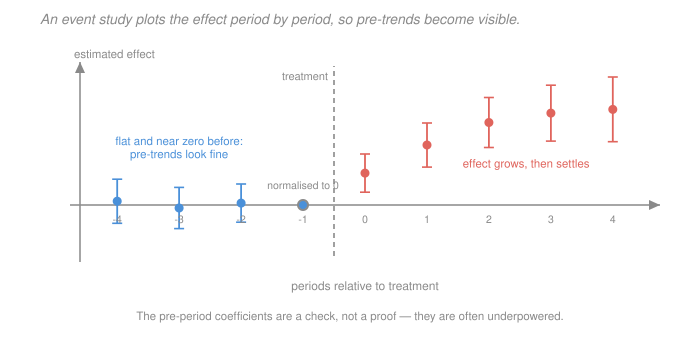

# Econometrics · Lesson 4.4: Event studies and dynamic DiD

> ⏱ ~15 min · Module 4: Panel data and quasi-experiments · Builds on: [4.3 (difference-in-differences)](04-03-difference-in-differences.md), [2.7 (multiple testing)](02-07-multiple-testing-specification-search.md) · Unlocks: 4.5 (staggered adoption), 4.7 (regression discontinuity)

## Why this matters

[4.3](04-03-difference-in-differences.md) delivered one number and one untestable assumption. The event study is what turns that into something a reader can evaluate: instead of a single treatment coefficient, estimate one for each period relative to treatment, and plot them.

Two things become visible at once. Before treatment, the coefficients *should* be zero — so the pre-period estimates are the closest thing available to a test of parallel trends. After treatment, the coefficients trace the effect's **timing**: does it appear immediately, build gradually, or fade? A policy whose effect appears two years before it was enacted is telling you something, and only this plot shows it.

The plot has also become the standard target of misuse. "Pre-trends look flat" is often a statement about statistical power rather than about the world, and this lesson is as much about reading the figure honestly as about producing it.

## The idea

Replace the single post-treatment dummy with a full set of dummies for **event time** — periods measured relative to each unit's treatment date rather than in calendar time. Period $-1$ is dropped as the reference, so every coefficient reads as "relative to the year before treatment".

The pre-treatment coefficients estimate differences in trend that existed *before* the policy could have done anything. If parallel trends holds, they should be zero. If they slope, the design is in trouble — the groups were already diverging, and the post-treatment coefficients inherit that divergence.

The post-treatment coefficients tell you the dynamic response. This matters for policy in a way a single average does not: an effect that peaks in year one and vanishes by year three implies something very different from one that grows steadily, even if both average to the same number.

The honest caveats are two. Pre-trend tests are often **underpowered**, so passing one is weak evidence. And the whole plot is a family of estimates, which raises the multiple-comparison issues of [2.7](02-07-multiple-testing-specification-search.md) in a form most papers ignore.

## The formal version

Let $E_i$ be unit $i$'s treatment date and $k = t - E_i$ be **event time**. The specification is
$$Y_{it} = \alpha_i + \lambda_t + \sum_{k=-K,\ k\neq -1}^{L}\beta_k\,\mathbf 1\{t-E_i = k\} + u_{it} ,$$
with unit and time fixed effects, and $k=-1$ omitted as the reference period.

*In words:* $\beta_k$ is the treated-versus-control difference in period $k$ relative to treatment, measured against the difference in the period just before treatment.

**The normalisation is arbitrary and consequential.** Dropping $k=-1$ means every coefficient is *relative to* $k=-1$. If that period is unusual — an Ashenfelter dip, say — the entire plot shifts. Two consequences:

- Only *differences* between coefficients are identified, not their levels. A plot that slopes upward throughout the pre-period says the same thing whichever period you normalise on; the level does not.
- You must also drop one more coefficient (or bin the endpoints) when there is no never-treated group, because the event-time dummies, unit effects and time effects are otherwise collinear.

**Binning the endpoints.** With unbalanced event time, the extreme $k$ values are estimated off few units and are wildly noisy. Standard practice bins them: $\mathbf 1\{k\le -K\}$ and $\mathbf 1\{k\ge L\}$. The binned coefficients are averages, not point-in-time estimates, and should be labelled as such.

**Testing pre-trends.** The natural test is $H_0: \beta_{-K}=\cdots=\beta_{-2}=0$, a joint $F$-test in the sense of [2.3](02-03-hypothesis-tests-confidence-intervals.md). Three things go wrong with using it as a gate:

1. **Power.** Pre-period coefficients are estimated on the same noisy data as everything else. Roth (2022) showed that in published event studies, the pre-trend test often has power below 50 percent against violations large enough to overturn the headline result. **Failing to reject is compatible with a violation big enough to matter.**
2. **Pre-testing distorts inference.** Conditioning your analysis on having passed a pre-trend test changes the sampling distribution of the estimate you then report — a selection effect on your own results, in the sense of [2.7](02-07-multiple-testing-specification-search.md).
3. **It tests the wrong period.** Parallel trends is an assumption about the *post*-treatment counterfactual. A shock coinciding with treatment leaves pre-trends pristine and destroys the design.

**What to do instead.** Report the plot, report the power of the pre-trend test against economically meaningful violations, and — increasingly standard — report **honest DiD** bounds (Rambachan and Roth): instead of assuming parallel trends exactly, assume the post-treatment violation is no larger than some multiple $\bar M$ of the largest pre-treatment violation, and report the resulting identified set. This converts an untestable binary assumption into a sensitivity curve, which is the same move as [3.4](03-04-omitted-variable-bias.md)'s Oster bounds.

**Anticipation.** If units respond before treatment — firms adjusting to an announced tax, workers timing retirement to a pension reform — the coefficients at $k=-2,-3$ are picking up real effects, not violations. The remedy is to normalise on an earlier period, before the announcement, and to say which date is the announcement and which the implementation.

## Picture

The pre-period coefficients are flat and near zero, and their intervals comfortably include zero — the picture a reader wants. The post-treatment path rises over about three periods and then flattens, which is a substantive finding: the effect is not instantaneous, so a design measuring only the first year would understate it by more than half. The circled point at $k=-1$ carries no information; it is the normalisation.

## Worked examples

**Example 1 (mechanical): reading a plot, and what the single DiD coefficient hides.** Suppose the event-study coefficients are

| $k$ | $-4$ | $-3$ | $-2$ | $-1$ | $0$ | $1$ | $2$ | $3$ | $4$ |
|---|---|---|---|---|---|---|---|---|---|
| $\hat\beta_k$ | $0.10$ | $-0.08$ | $0.05$ | $0$ | $0.85$ | $1.60$ | $2.20$ | $2.45$ | $2.55$ |
| se | $0.30$ | $0.28$ | $0.26$ | — | $0.26$ | $0.30$ | $0.34$ | $0.38$ | $0.44$ |

*Pre-trends.* All three estimated pre-coefficients are within $0.4$ standard errors of zero, and a joint test would not come close to rejecting. Good — subject to the power caveat below.

*Dynamics.* The effect is $0.85$ on impact and reaches $2.55$ by $k=4$, so **two-thirds of the eventual effect arrives after the first year.** A study with only one post-period would have reported $0.85$ and understated the long-run effect by a factor of three.

*The single DiD coefficient.* A standard 2x2 DiD pooling all post-periods returns roughly the average of the post-treatment coefficients,
$$\frac{0.85+1.60+2.20+2.45+2.55}{5} = \frac{9.65}{5} = 1.93 ,$$
which is a real quantity — the average effect over the five years observed — but it is neither the impact effect nor the long-run effect, and which one a policymaker needs depends on the question.

*The power caveat, made concrete.* With pre-period standard errors around $0.28$, the smallest pre-trend slope this design could reliably detect is roughly $2\times 1.96\times 0.28 \approx 1.1$ over the four pre-periods, or about $0.27$ per period. But a pre-existing trend of $0.27$ per period, extrapolated over the five post-periods, would generate a spurious "effect" of well over $1.0$ by $k=4$ — comparable to half the estimated effect. So *this pre-trend test cannot rule out a violation large enough to matter*, which is precisely Roth's point. The plot is reassuring; it is not decisive.

**Example 2 (why you'd care): a pre-trend that reverses the conclusion.** A study of a job-training program finds a large positive effect. The event study shows:

| $k$ | $-3$ | $-2$ | $-1$ | $0$ | $1$ | $2$ |
|---|---|---|---|---|---|---|
| $\hat\beta_k$ | $1.20$ | $0.55$ | $0$ | $0.90$ | $1.35$ | $1.60$ |

The post-treatment coefficients look like a clean, growing effect. But the pre-period is **not flat**: it falls from $1.20$ to $0.55$ to $0$, a decline of about $0.6$ per period.

This is **Ashenfelter's dip**. Participants enter training after a spell of falling earnings — that is why they enrol — so their outcome is unusually low exactly at $k=-1$, the normalisation period. The post-treatment rise is then partly a mechanical rebound that would have happened anyway.

Extrapolating the pre-trend forward at $-0.6$ per period from $k=-1$ would give a counterfactual of $-0.6, -1.2, -1.8$ at $k=0,1,2$. Detrending against that would *increase* the estimated effect, not decrease it. Extrapolating the *rebound* interpretation instead — that the dip is transitory and earnings revert to their $k=-3$ level of $1.20$ — implies a counterfactual near $+1.2$ and shrinks the effect at $k=2$ from $1.60$ to about $0.40$, a 75 percent reduction.

**The two readings of the same figure differ by a factor of four**, and the data cannot distinguish them: whether the dip is a trend to extrapolate or a transitory dip to revert is exactly the untestable question. This is why the honest response is a sensitivity analysis over assumed post-treatment violations rather than a single detrended point estimate — and why normalising on $k=-3$ instead of $k=-1$, which some papers do silently, is a substantive choice that can move the headline number by more than the estimate itself.

## Watch out

- **You might think** flat pre-trends validate the design — **but actually** they are evidence about the pre-period, tested with limited power, and the assumption concerns the post-period. Report what violation size your test *could* have detected; if the answer is "larger than my effect", say so.
- **You might think** the choice of reference period is a formality — **but actually** every coefficient is measured relative to it, so an unusual reference period shifts the whole plot. State which period you normalised on and why, and show the plot under an alternative normalisation when the pre-period is not flat.
- **You might think** you can test each pre-period coefficient individually — **but actually** that is a family of tests, and with five pre-periods at 5 percent you have a $1-0.95^5 = 23$ percent chance of at least one "significant" pre-trend under a perfectly valid design. Use the joint test, and be as sceptical of a single significant pre-coefficient as of a single significant post one.

## One-liner

> An event study replaces one treatment coefficient with one per relative period, making pre-trends visible and dynamics readable — but the pre-period estimates are a weakly powered check on an assumption about the post-period, so report what your test could have detected rather than only what it did not reject.

## Problems

**P1 (🟢)** An event study has pre-period coefficients $(k=-3,-2)$ of $0.42$ and $0.21$ with standard errors $0.20$ and $0.18$, normalised at $k=-1$. Post-period coefficients are $0.65$, $0.90$, $1.10$. Describe the pre-trend, estimate what the $k=2$ coefficient would be after linearly detrending, and say what you would report.

**P2 (🟡)** With five pre-period coefficients tested individually at 5 percent, compute the probability of at least one spurious rejection under a valid design. Then explain why the joint $F$-test is the right tool, and why even it does not settle the matter.

**P3 (🔴, optional)** A design has post-treatment coefficients averaging $1.5$ and pre-period standard errors of $0.35$ across four pre-periods. Compute the minimum per-period pre-trend slope the joint test could detect with reasonable power, extrapolate it over three post-periods, and assess whether the pre-trend test is informative about this study's headline result.

Solutions

**P1** *Describing the pre-trend.* The coefficients run $0.42$ at $k=-3$, $0.21$ at $k=-2$, $0$ at $k=-1$ (by normalisation). That is a **steady decline of about $0.21$ per period** toward the reference period — a clear linear pre-trend, not noise. Individually, $t = 0.42/0.20 = 2.10$ and $t=0.21/0.18 = 1.17$: the first is significant at 5 percent, and the pattern is monotone, which is far more suspicious than either $t$-statistic alone. Monotone pre-trends are much stronger evidence of a problem than scattered significant coefficients, because noise does not usually line up.

*Linear detrending.* Extrapolate the trend forward. From $k=-1$ (value $0$) at $+0.21$ per period, the counterfactual at $k=2$ is
$$0 + 0.21\times 3 = 0.63 .$$
The detrended estimate is
$$1.10 - 0.63 = 0.47 .$$
So the $k=2$ effect falls from $1.10$ to about $0.47$ — a **57 percent reduction**. The apparent effect is largely a continuation of a divergence already underway.

*What to report.* Not the detrended number as a new headline — linear extrapolation is itself an assumption, and a strong one. Report:

1. **The plot**, prominently, so the pre-trend is visible rather than buried in a table.
2. **Rambachan–Roth honest DiD bounds**, which formalise exactly this exercise: assume the post-treatment violation is at most $\bar M$ times the largest pre-treatment violation and report the identified set as $\bar M$ varies. Report the **breakdown value** — the $\bar M$ at which the interval first includes zero — which here would be small, since a violation comparable to the observed pre-trend already erases most of the effect.
3. **The linear-detrended estimate as one point on that curve**, labelled as the $\bar M = 1$ case rather than as the answer.

The honest summary sentence: *the design shows a pre-existing divergence of similar magnitude to the estimated effect, so these data cannot separate the policy from the trend it interrupted.*

**P2** *Probability of a spurious rejection.* Under a valid design all five pre-period nulls are true, and (treating the tests as independent, which overstates the problem slightly since the estimates are correlated)
$$P(\text{at least one rejection}) = 1-(1-0.05)^5 = 1-0.95^5 = 1-0.773781 = 0.226219 \approx 22.6\% .$$
So roughly **one valid design in four** will show at least one "significant" pre-period coefficient. Treating that as disqualifying rejects a quarter of good studies; treating its absence as validation is the error this lesson is about.

*Why the joint $F$-test is right.* It tests $H_0:\beta_{-K}=\cdots=\beta_{-2}=0$ as a single hypothesis at a single level, so its size is 5 percent by construction rather than 22.6 percent. It also accounts for the **correlation** between the coefficient estimates — which is substantial, since they share the same control group and the same normalisation period — through the covariance matrix in [2.3](02-03-hypothesis-tests-confidence-intervals.md)'s Wald form. Five separate $t$-tests ignore that correlation entirely, and the ellipse-versus-rectangle picture from that lesson applies directly here.

*Why it still does not settle the matter.* Three reasons, in increasing order of importance:

1. **Power.** The joint test has more power than any individual test, but still often too little. P3 quantifies this.
2. **It tests the wrong period.** Parallel trends is a claim about the post-treatment counterfactual. A shock that arrives exactly with treatment — a recession, a simultaneous policy — leaves every pre-period coefficient at zero and invalidates the design completely. No pre-period test can detect it.
3. **Pre-testing changes the distribution of what you report.** Conditioning on having passed the test and then reporting the treatment effect gives an estimate whose sampling distribution is not the unconditional one. Roth showed this can *worsen* bias: studies that pass a pre-trend test are selected toward samples where noise happened to mask a violation, so the surviving estimates are biased in the direction of the undetected trend.

The constructive conclusion is the same as P1's: report the joint test's $p$-value *and* the magnitude of violation it could have detected, then present a sensitivity analysis rather than a binary verdict.

**P3** *Minimum detectable slope.* Consider a linear pre-trend of slope $s$ per period, normalised at $k=-1$. The coefficient at event time $k$ would be $\beta_k = s\cdot(k+1)$, so the four pre-periods $k=-5,-4,-3,-2$ have expected values $-4s, -3s, -2s, -s$.

The joint test's power depends on the non-centrality parameter. A workable approximation: the test detects a violation with about 80 percent power when the largest coefficient is roughly $2.8$ standard errors from zero (the standard $1.96 + 0.84$ rule for 80 percent power at 5 percent). The largest pre-coefficient is $4s$ with standard error $0.35$, so
$$4s \ \approx\ 2.8\times 0.35 = 0.98 \qquad\Longrightarrow\qquad s \approx 0.245 \ \text{ per period.}$$
(The joint test does somewhat better than this single-coefficient calculation by pooling four coefficients, so a more generous figure is around $s\approx 0.15$–$0.20$; the conclusion below holds either way.)

*Extrapolating over three post-periods.* A trend of $s = 0.245$ per period continuing after treatment would generate a spurious effect at $k=2$ of
$$s\times(k+1) = 0.245\times 3 = 0.735 ,$$
and even at the more generous $s = 0.15$ it would generate $0.45$.

*Is the pre-trend test informative?* **Barely.** The headline effect is $1.5$. The test can reliably detect only violations that would generate a spurious effect of roughly $0.74$ — that is, **about half the reported effect**. Violations smaller than that pass the test routinely, and a violation generating even $0.5$ of spurious effect (a third of the headline) is essentially invisible to this design.

So "we find no evidence of pre-trends" here means "we could not have detected a trend that would explain a third of our result". That is a much weaker statement than it sounds, and it is the statement most event-study papers are actually making.

*What follows.* Report the **minimum detectable violation** alongside the pre-trend $p$-value — it is a two-line calculation and it converts an uninformative non-rejection into an honest bound on what the test establishes. Then report the Rambachan–Roth breakdown value: the size of post-treatment violation, relative to the observed pre-treatment ones, at which the confidence set first includes zero. If that breakdown value is below $1$ — meaning a post-treatment violation *no larger* than what the pre-period already permits would erase the result — the design does not support the claim, whatever the $p$-value says.

## Flashback

**From Lesson 4.3 (difference-in-differences):** A DiD study reports treated-group outcomes of $340$ before and $391$ after, with control-group outcomes of $520$ and $572$. Compute the estimate in levels and in logs, state whether they agree in sign, and say which specification you would have chosen in advance and why.

Solution

*Levels.*
$$\text{treated change} = 391-340 = +51, \qquad \text{control change} = 572-520 = +52, \qquad \mathrm{DiD} = 51-52 = -1 .$$
Essentially zero, and slightly **negative**.

*Logs.*
$$\log(391/340) = \log(1.150000) = 0.139762, \qquad \log(572/520) = \log(1.100000) = 0.095310 ,$$
$$\mathrm{DiD}_{\log} = 0.139762-0.095310 = 0.044452 \ \text{log points} .$$
Converting with [1.6](01-06-functional-form-logs-interactions.md)'s exact formula, $100(e^{0.044452}-1) = 4.54$ percent — a clearly **positive** effect.

*Do they agree in sign?* **No.** Levels give $-1$; logs give $+4.5$ percent. This is [4.3](04-03-difference-in-differences.md)'s Example 2 pattern exactly: the treated group grew by 15 percent and the control by 10 percent, so proportionally the treated group did better; but because the control group starts much larger ($520$ against $340$), its 10 percent is 52 units against the treated group's 51, so in absolute terms they moved identically.

The two specifications encode different counterfactuals. Parallel trends in **levels** says the treated group would have gained $+52$ units — but $52$ units on a base of $340$ is a 15.3 percent gain, which is larger in proportional terms than what the control actually experienced. Parallel trends in **logs** says the treated group would have gained 10 percent, or $+34$ units. Both cannot be true, and neither is testable.

*Which to choose in advance, and why.* **Logs**, in almost any setting where the groups differ this much in scale ($520$ against $340$, a 53 percent difference). Two reasons:

1. **Economic content.** Most policies plausibly operate proportionally — a tax change, a regulation, a subsidy affects a *share* of activity rather than a fixed number of units. If the treated and control groups differ in size for reasons unrelated to the policy, a common proportional shock is the more natural null, and a common absolute shock would imply the smaller group is far more sensitive in percentage terms for no stated reason.
2. **Scale invariance.** The level specification's answer depends on the units of measurement in a way the log specification's does not: it treats a 1-unit gain as equally meaningful for a group of 340 and a group of 520. When the groups are similar in scale that hardly matters; here it drives the entire result.

The decisive discipline is [4.3](04-03-difference-in-differences.md)'s: **state the scale before estimating.** Having computed both and found opposite signs, choosing the one you prefer is the specification search of [2.7](02-07-multiple-testing-specification-search.md). The correct write-up names logs as the pre-specified choice, gives the levels result as a transparent sensitivity, and — since the two disagree in sign — says plainly that the finding rests on the proportional-trends assumption rather than presenting $+4.5$ percent as robust.

## Connections

- **Backward:** each $\beta_k$ is [4.3](04-03-difference-in-differences.md)'s DiD estimate computed for one relative period, so the pooled DiD coefficient is roughly their average. The joint pre-trend test is [2.3](02-03-hypothesis-tests-confidence-intervals.md)'s $F$-test, and the individual-versus-joint testing problem is [2.7](02-07-multiple-testing-specification-search.md)'s family-wise error rate in a setting where it is routinely ignored.
- **Forward:** [4.5](04-05-staggered-adoption-modern-did.md) shows that when units adopt at different times, even this specification misbehaves — the event-time coefficients become contaminated by other cohorts' dynamic effects, and the plot can slope in the pre-period for purely mechanical reasons. [4.6](04-06-synthetic-control.md) offers a different route when the pre-period fit is the whole problem.
- **Sideways:** the honest-DiD sensitivity approach is the same intellectual move as [3.4](03-04-omitted-variable-bias.md)'s Oster bounds and [3.1](03-01-potential-outcomes-identification.md)'s Manski bounds — replace an untestable point assumption with a family of weaker ones and report how the conclusion varies. That pattern, rather than any specific estimator, is the most transferable idea in this module.
