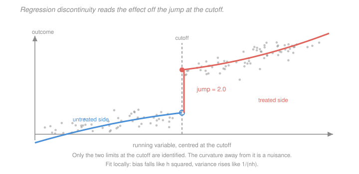

# Econometrics · Lesson 4.7: Regression discontinuity

> ⏱ ~15 min · Module 4: Panel data and quasi-experiments · Builds on: [4.6 (synthetic control)](04-06-synthetic-control.md), [3.7 (2SLS)](03-07-two-stage-least-squares.md) · Unlocks: 5.5 (a taste of time series)

## Why this matters

Bureaucracies run on thresholds. Scholarships go to students above a cutoff score; firms above an employee count face different regulation; a candidate winning 50.1 percent of the vote takes office and one winning 49.9 percent does not. Each threshold is an accident of administration, and each creates a comparison between units that are almost identical except for the treatment.

Regression discontinuity exploits this, and it has the strongest claim to credibility of any observational design. The identifying assumption — that everything else about units varies *smoothly* across the cutoff — is weaker than parallel trends and far weaker than conditional independence. It is also, unusually, partly testable.

The price is that the estimate is intensely **local**: it tells you about units at the threshold and nobody else.

## The idea

Units are assigned treatment by a rule based on a **running variable**: treated if it exceeds a cutoff, untreated otherwise. Someone scoring 69 and someone scoring 71 on an exam are, in every way that matters, the same kind of person — but one gets the scholarship.

So compare outcomes just above and just below. If there were no treatment, the outcome would move smoothly through the threshold; any *jump* must be the treatment, because nothing else changes discontinuously at an arbitrary number.

The whole method is estimating two limits — the outcome's limit from the left and from the right — and taking their difference. Everything else is technique for estimating limits well: how wide a window, what functional form, how to weight.

Two threats organise the practice. If units can **manipulate** their position — a teacher nudging a 69 up to 70 — the units just above and just below are no longer comparable, and the design is dead. And if the outcome's relationship to the running variable is curved, fitting a line over too wide a window will mistake curvature for a jump.

## The formal version

Let $X_i$ be the running variable and $c$ the cutoff.

> **Sharp RD.** Treatment is a deterministic function of the running variable: $D_i = \mathbf 1\{X_i \ge c\}$.

> **Assumption (continuity).** $E[Y_i(0)\mid X=x]$ and $E[Y_i(1)\mid X=x]$ are continuous in $x$ at $c$.

*In words:* absent treatment, average potential outcomes would not jump at the cutoff. This is weaker than "as good as random near the cutoff" and is the standard modern statement.

> **Theorem (identification).** Under continuity,
> $$\tau_{RD} = \lim_{x\downarrow c}E[Y\mid X=x] \;-\; \lim_{x\uparrow c}E[Y\mid X=x] \;=\; E\bigl[Y_i(1)-Y_i(0)\ \big|\ X_i=c\bigr] .$$

*In words:* the jump identifies the average treatment effect **for units exactly at the cutoff**. Not the ATE, not the ATT — a limit-point effect.

**Estimation is a limit problem.** Fit locally on each side and read off the intercepts:
$$\min_{a,b}\ \sum_{i: c\le X_i\le c+h}\bigl(Y_i - a - b(X_i-c)\bigr)^2 K\!\left(\frac{X_i-c}{h}\right) ,$$
and symmetrically to the left; $\hat\tau = \hat a_{\text{right}} - \hat a_{\text{left}}$. Here $h$ is the **bandwidth** and $K$ a kernel (triangular is standard, weighting nearby points more).

**The bias-variance trade-off, exactly.** For a uniform design and a locally quadratic CEF with curvature $c_1$ above and $c_0$ below the cutoff, the local-linear estimator's bias is
$$\mathbb E[\hat\tau] - \tau \;=\; -\frac{(c_1-c_0)\,h^2}{6} ,$$
so **halving the bandwidth quarters the bias**. Meanwhile the effective sample size is proportional to $nh$, so the variance grows like $1/(nh)$. Minimising $C^2h^4 + V/(nh)$ gives the optimal bandwidth
$$h^* \ \propto\ n^{-1/5} .$$
Standard practice uses the Calonico–Cattaneo–Titiunik data-driven bandwidth together with their **robust bias-corrected** confidence intervals, which account for the fact that the MSE-optimal bandwidth leaves a bias large enough to distort coverage.

| bandwidth $h$ | bias, for $c_1-c_0 = 1.5$ |
|---|---|
| $1.00$ | $-0.250$ |
| $0.50$ | $-0.0625$ |
| $0.25$ | $-0.0156$ |
| $0.10$ | $-0.0025$ |

**Use local linear, not a global polynomial.** Gelman and Imbens showed that high-order global polynomials give poor coverage, weight observations far from the cutoff heavily, and produce estimates sensitive to the polynomial order. Local linear or local quadratic within a bandwidth is the standard.

> **Fuzzy RD.** The cutoff changes the *probability* of treatment rather than determining it: $\lim_{x\downarrow c}P(D=1\mid x) \neq \lim_{x\uparrow c}P(D=1\mid x)$. Then
> $$\tau_{\text{fuzzy}} = \frac{\lim_{x\downarrow c}E[Y\mid x]-\lim_{x\uparrow c}E[Y\mid x]}{\lim_{x\downarrow c}E[D\mid x]-\lim_{x\uparrow c}E[D\mid x]} .$$

This is exactly [3.6](03-06-instrumental-variables.md)'s Wald estimator with $\mathbf 1\{X\ge c\}$ as the instrument, and it inherits everything from [3.8](03-08-weak-instruments-and-late.md): it identifies a **LATE for compliers at the cutoff**, and a small jump in treatment probability is a weak instrument with all the attendant problems.

**Validity checks — and these are unusually informative.**

- **McCrary density test.** If units manipulate the running variable, the *density* of $X$ will jump at the cutoff — bunching just above. Testing for a discontinuity in the density is a direct test of manipulation. It is the closest thing in this course to a testable identifying assumption.
- **Covariate balance.** Pre-determined characteristics should not jump at the cutoff. Run the same RD on each covariate; a jump indicates sorting.
- **Placebo cutoffs.** Estimate the same discontinuity at fake thresholds away from $c$. Finding jumps there suggests the method is picking up curvature rather than treatment.
- **Bandwidth sensitivity.** Plot the estimate against $h$. A result that appears only at one bandwidth is not a result.
- **Donut hole.** Drop observations immediately at the cutoff, where manipulation and rounding concentrate, and re-estimate.

## Picture

Only the two limits at the cutoff are identified — the curvature away from it is a nuisance to be fitted well enough not to distort them. Note the two sides curve *differently* here, which is why their boundary biases do not cancel and why the bandwidth matters. Fit a single line across the whole range and you would recover $1.75$ instead of $2.00$.

## Worked examples

**Example 1 (mechanical): how bandwidth controls bias.** Suppose the true jump is $\tau = 2.0$, with $E[Y(0)\mid x] = 1 + 0.8x - 0.6x^2$ below the cutoff and $E[Y(1)\mid x] = 3 + 0.8x + 0.9x^2$ above it (running variable centred at $c=0$). The curvature differs across the cutoff: $c_0 = -0.6$, $c_1 = +0.9$.

The predicted bias of a local linear fit is $-(c_1-c_0)h^2/6 = -1.5h^2/6 = -0.25h^2$. Computed exactly on a dense grid:

| $h$ | $\hat\tau$ | bias | predicted $-0.25h^2$ |
|---|---|---|---|
| $1.00$ | $1.750000$ | $-0.250000$ | $-0.250000$ |
| $0.50$ | $1.937501$ | $-0.062499$ | $-0.062500$ |
| $0.25$ | $1.984375$ | $-0.015625$ | $-0.015625$ |
| $0.10$ | $1.997500$ | $-0.002500$ | $-0.002500$ |

The formula matches to six decimals. Two readings. At $h=1$ — which is a *global* fit here, using the entire support — the estimate is $1.75$, a 12.5 percent understatement produced purely by curvature. Halving the bandwidth quarters the bias, exactly as $h^2$ requires.

Note what makes this work: the two sides curve in *opposite* directions ($-0.6$ and $+0.9$). Had they curved identically, the two boundary biases would have been equal and would have **cancelled in the difference**, leaving no bias at any bandwidth. The bias depends on the *difference* in curvature, not on curvature itself.

**Example 2 (why you'd care): a design killed by manipulation.** A government offers a subsidy to firms with fewer than 50 employees. A researcher estimates the subsidy's effect on productivity using an RD at 50.

The McCrary test finds a large spike in the density just below 50 and a deficit just above. Firms are staying below the threshold — declining to hire the 50th worker, splitting into two legal entities, or reclassifying staff as contractors.

**The design is dead, and no bandwidth choice repairs it.** Continuity fails: firms at 49 are firms that *chose* to remain at 49, and that choice reveals something about them (they value the subsidy highly, they are near a growth constraint, they have flexible organisational structure). They are not exchangeable with firms at 51.

Worse, the manipulation is *itself an outcome* of the policy. Firms that would have grown to 55 stayed at 49, so the sample just below the cutoff is contaminated with firms whose entire trajectory the policy altered.

*What can be salvaged.* Sometimes, three things. **A donut-hole design** dropping firms in, say, $[45,55]$ and estimating from further out — valid only if manipulation is local, and it changes the estimand to something no longer at the cutoff. **A different threshold** in the same institution that firms cannot manipulate, such as one based on a lagged headcount recorded before the policy existed. Or **treating the bunching itself as the finding**: the mass just below the cutoff is direct evidence of how much firms value the subsidy, and there is a whole bunching-estimator literature that recovers elasticities from exactly this pattern.

The general lesson: **run the McCrary test first.** It costs nothing and it can tell you before you invest in the analysis whether the design exists.

## Watch out

- **You might think** a higher-order polynomial gives a better fit and hence a better estimate — **but actually** global high-order polynomials are known to give poor coverage and unstable estimates, because they let observations far from the cutoff determine the value *at* the cutoff. Local linear within a data-driven bandwidth is the standard, and Gelman and Imbens' recommendation is to go no higher than local quadratic.
- **You might think** covariate balance at the cutoff validates the design — **but actually** it is evidence against sorting on those covariates, which is genuinely useful, but manipulation can occur on dimensions you did not measure. The McCrary density test is more fundamental, because manipulation of any kind moves the density.
- **You might think** the RD estimate generalises to units away from the cutoff — **but actually** it is defined as a limit at a point. A scholarship's effect at the 70-point threshold says nothing about its effect on a student scoring 40, and extrapolating requires assumptions the design was chosen to avoid making.

## One-liner

> Estimate the two limits of the outcome at an administrative cutoff and take their difference — the jump is the effect for units exactly at the threshold, the bandwidth trades bias falling like $h^2$ against variance rising like $1/(nh)$, and the McCrary density test is the rare case where you can actually check whether the design exists.

## Problems

**P1 (🟢)** A sharp RD finds the outcome jumping from $12.4$ just below the cutoff to $15.1$ just above. In a second study the outcome jumps by $0.9$ while the probability of treatment jumps from $0.15$ to $0.60$. Compute both estimates and say what each identifies.

**P2 (🟡)** Using the bias formula $-(c_1-c_0)h^2/6$, compute the bias for $c_1-c_0 = 2.4$ at $h = 0.8$ and $h=0.4$. Then explain why a design in which both sides have the *same* curvature has no bias at any bandwidth, and what that implies about which RD designs are most fragile.

**P3 (🔴, optional)** Show that fuzzy RD is 2SLS with $\mathbf 1\{X\ge c\}$ as the instrument for $D$, and state what the resulting estimand is in the language of [3.8](03-08-weak-instruments-and-late.md). Then explain what a jump in treatment probability from $0.48$ to $0.53$ implies for the reliability of the estimate.

Solutions

**P1** *Sharp RD.*
$$\hat\tau_{RD} = 15.1 - 12.4 = 2.70 .$$
This identifies $E[Y(1)-Y(0)\mid X = c]$ — the **average treatment effect for units exactly at the cutoff**. Not the ATE, not the ATT: a limit-point effect, informative about marginal units and silent about everyone else.

*Fuzzy RD.* The jump in treatment probability is $0.60-0.15 = 0.45$, so
$$\hat\tau_{\text{fuzzy}} = \frac{0.9}{0.45} = 2.00 .$$
This identifies a **LATE at the cutoff**: the average treatment effect among **compliers at the threshold** — units who take treatment when just above the cutoff but would not when just below. Always-takers (the 15 percent treated even below) and never-takers (the 40 percent untreated even above) contribute nothing, exactly as in [3.8](03-08-weak-instruments-and-late.md).

Note the estimand is doubly local: local in the running variable (at the cutoff) *and* local in the population (compliers only). It is the narrowest estimand in the course, and correspondingly the one whose internal validity is easiest to defend and whose external validity is hardest.

**P2** *Bias computations.* With $c_1-c_0 = 2.4$, the bias is $-2.4h^2/6 = -0.4h^2$:
$$h = 0.8: \quad -0.4(0.64) = -0.256 , \qquad h = 0.4: \quad -0.4(0.16) = -0.064 .$$
Halving the bandwidth cut the bias by a factor of four, as $h^2$ requires.

*Why equal curvature gives no bias.* The bias arises from fitting a straight line to a curved function over a one-sided window: on $[c, c+h]$ with a uniform design, the local-linear intercept at $c$ is biased by $+c_1h^2/6$ where $c_1$ is the curvature above the cutoff (the sign follows from the boundary-fitting geometry), and symmetrically the left-side intercept is biased by $+c_0h^2/6$. The RD estimate is the **difference** of the two intercepts:
$$\text{bias}(\hat\tau) = \frac{c_1h^2}{6} - \frac{c_0h^2}{6} = \frac{(c_1-c_0)h^2}{6} ,$$
up to sign convention. If $c_1 = c_0$, the two biases are identical and **cancel exactly**, leaving zero bias at every bandwidth — even a global fit over the entire support.

(This is worth flagging because it is a trap: a naive simulation with symmetric curvature on both sides will show essentially zero bias at any $h$ and appear to prove that bandwidth does not matter. It does; the simulation was just built on the one case where the biases cancel.)

*Which designs are most fragile.* Those where the outcome's relationship to the running variable **differs in shape** across the cutoff — a large $|c_1-c_0|$. That happens precisely when the treatment changes not just the level of the outcome but its *slope or curvature* with respect to the running variable. Concrete examples: a scholarship whose value scales with need, so its effect grows as the score falls toward the cutoff from above; a regulation whose burden increases with firm size, so the treated side bends away from the untreated side.

Conversely, designs where treatment shifts the level but leaves the shape alone are robust to bandwidth choice, and their bandwidth-sensitivity plots are flat. **That flat plot is itself the diagnostic** — it is direct evidence that $c_1 \approx c_0$ and that the bias term is small, which is why bandwidth sensitivity should always be reported rather than treated as a robustness afterthought.

**P3** *Fuzzy RD as 2SLS.* Let $Z_i = \mathbf 1\{X_i\ge c\}$ be the indicator for being above the cutoff, and work locally within a bandwidth around $c$ (so that continuity makes the running variable's direct influence negligible, or is controlled for with a local linear term on each side). The two regressions are

- **first stage:** $D_i = \pi_0 + \pi_1 Z_i + \text{(local linear in } X_i) + v_i$, with $\hat\pi_1$ estimating the jump in treatment probability;
- **reduced form:** $Y_i = \rho_0+\rho_1 Z_i + \text{(local linear in } X_i) + w_i$, with $\hat\rho_1$ estimating the jump in the outcome.

By [3.6](03-06-instrumental-variables.md)'s reduced-form-over-first-stage identity,
$$\hat\beta^{IV} = \frac{\hat\rho_1}{\hat\pi_1} = \frac{\text{jump in } E[Y]}{\text{jump in } P(D=1)} = \hat\tau_{\text{fuzzy}} . \ \checkmark$$
The instrument's validity comes from the design itself: **relevance** is the observable jump in treatment probability, and **exclusion** is the continuity assumption — crossing an arbitrary administrative threshold affects the outcome only by changing treatment status, since nothing else about a unit changes discontinuously at that number. This is an unusually strong exclusion argument, which is why fuzzy RD is among the most credible IV designs available.

*The estimand.* A **LATE for compliers at the cutoff** — units who are treated when just above the threshold and untreated when just below. Always-takers and never-takers at the cutoff drop out of both numerator and denominator, and monotonicity here means the threshold does not *reduce* anyone's treatment probability, which is usually guaranteed by how the rule is written.

*A jump from $0.48$ to $0.53$.* The first stage is
$$\hat\pi_1 = 0.53-0.48 = 0.05 .$$
Two serious problems, and they compound:

1. **The complier share is 5 percent.** Ninety-five percent of units at the cutoff are always-takers or never-takers and contribute nothing. The estimate describes a twentieth of the population at a single point of the running variable.
2. **The instrument is weak, and exclusion violations are amplified by $1/\pi_1 = 20$.** From [3.6](03-06-instrumental-variables.md) P3, a direct effect $\eta$ of crossing the threshold contributes $\eta/\pi_1$ to the estimate. If anything *else* changes at that cutoff — and administrative thresholds are frequently reused across programs, so a single score often triggers several things at once — a direct effect of $0.10$ becomes a bias of $2.0$. The conventional interval will also have coverage well below its nominal level, since $F$ here is far below the $104.7$ benchmark of [3.8](03-08-weak-instruments-and-late.md).

*What to do.* Report the first-stage jump prominently — it is the complier share and readers need it. Use Anderson–Rubin confidence sets rather than the conventional interval. Check specifically whether the threshold triggers other programs, since that is the exclusion violation this design is most exposed to. And consider whether the honest conclusion is that the discontinuity in treatment is too small to support a fuzzy RD, in which case the reduced form — the effect of *being above the cutoff*, which is a well-estimated intention-to-treat quantity requiring no exclusion restriction — may be the only thing worth reporting.

## Flashback

**From Lesson 4.6 (synthetic control):** A synthetic control study has 24 donors. The treated unit's pre-treatment RMSPE is $4.8$ on an outcome with standard deviation $6.0$, and its post-treatment RMSPE is $7.2$. Compute the RMSPE ratio, comment on the pre-treatment fit, and say what the smallest attainable $p$-value is.

Solution

*RMSPE ratio.*
$$\frac{\text{post-treatment RMSPE}}{\text{pre-treatment RMSPE}} = \frac{7.2}{4.8} = 1.50 .$$

*The pre-treatment fit is poor, and this is the important observation.* The pre-treatment RMSPE of $4.8$ is 80 percent of the outcome's standard deviation of $6.0$ — so the synthetic control explains only about $1 - 0.8^2 = 36$ percent of the variation it was fitted to. The synthetic unit does not track the treated unit; it wanders around it by nearly a full standard deviation.

That undermines the study before any post-treatment comparison is made. [4.6](04-06-synthetic-control.md)'s Study B is exactly this case: when the fit is this loose, a post-treatment gap of any size is within the range the method produces routinely with no treatment at all. The ratio of $1.50$ says the post-period discrepancy is only half again as large as the pre-period discrepancy — which is unremarkable, and would place the treated unit well down the placebo ranking.

The likely cause is that the treated unit lies outside, or near the edge of, the convex hull of the donor pool — it is extreme on some dimension that no weighted average of the donors can reach. That is the method's built-in failure mode, and the correct response is to report that synthetic control does not apply here rather than to present a gap plot.

*Smallest attainable $p$-value.* With 24 donors there are $J+1 = 25$ units, so
$$p_{\min} = \frac{1}{25} = 0.04 .$$
A 5 percent result is attainable in principle — but only from a first-place ranking, which a ratio of $1.50$ will not achieve given that poorly-fitting donors routinely produce ratios above that.

*What to report.* The pre-treatment fit statistic, prominently, and the conclusion that the donor pool cannot construct a credible counterfactual for this unit. If a plausible restriction of the donor pool (to units more similar on observables) improves the fit substantially, that is worth trying and reporting transparently as a pre-specified alternative — but fishing across donor pools until the fit improves is [2.7](02-07-multiple-testing-specification-search.md)'s specification search, and the resulting $p$-value would mean nothing.

## Connections

- **Backward:** fuzzy RD is [3.6](03-06-instrumental-variables.md)'s IV with a threshold indicator as the instrument, inheriting [3.8](03-08-weak-instruments-and-late.md)'s LATE interpretation and weak-instrument warnings. Like [4.6](04-06-synthetic-control.md), it addresses the case where a credible comparison group must be constructed rather than assumed — there by weighting donors, here by shrinking the window.
- **Forward:** [5.5](05-05-a-taste-of-time-series.md) meets the local-fitting idea again in a different guise, where the question is how much of the past to use. The bias-variance calculation here — squared bias $C^2h^4$ against variance $V/(nh)$, optimised at $h^*\propto n^{-1/5}$ — is the same optimisation that governs every nonparametric smoother.
- **Sideways:** the $h^{-1/5}$ rate and the kernel-weighting machinery are standard nonparametric regression, which [`statistical-learning` 6.4](../../statistical-learning/lessons/06-04-density-estimation.md) develops for density estimation with the same bias-variance structure. The difference in purpose is instructive: there the goal is to estimate a whole function well, here it is to estimate two boundary points well and everything else is nuisance.
