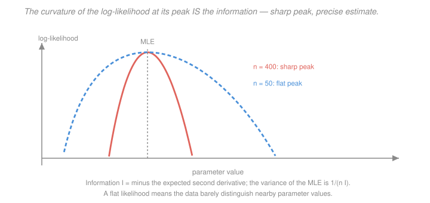

# Econometrics · Lesson 5.1: Maximum likelihood estimation

> ⏱ ~15 min · Module 5: Estimation principles and extensions · Builds on: [4.2 (random effects)](04-02-first-differencing-random-effects.md), [`prob-stat-refresher` 4.1 (estimation and MLE)](../../prob-stat-refresher/lessons/04-01-estimation-and-mle.md) · Unlocks: 5.2 (GMM), 5.3 (logit and probit)

## Why this matters

Everything so far has been built around a linear model and least squares. But binary outcomes, counts, durations, censored variables and selection processes are not linear models, and OLS on them is at best a crude approximation.

Maximum likelihood is the general machine. Write down the probability of seeing the data you saw, as a function of the parameters, and pick the parameters that make it largest. That single recipe produces OLS, logit, probit, Tobit, random effects, and most of what applied econometrics uses outside the linear-causal core.

It also produces something the previous modules had to assume: an *efficiency* result. Gauss–Markov gave a best-in-class result among linear unbiased estimators. Maximum likelihood is asymptotically efficient among *all* consistent estimators — a much stronger claim, bought with a much stronger assumption.

## The idea

You have data and a family of candidate distributions. Ask: under each candidate, how probable was the sample you actually observed? Pick the candidate that makes it most probable.

That is the whole idea, and it comes with a natural measure of confidence. If the likelihood has a **sharp peak**, nearby parameter values make the data much less probable, so the data pin the parameter down tightly. If the peak is **flat**, many values explain the data almost equally well, and your estimate is imprecise.

Curvature *is* precision. The second derivative of the log-likelihood at the peak — the Fisher information — is exactly what appears in the variance formula, inverted. That connection is not a coincidence or an analogy; it is the theorem.

The strong assumption is that the distributional family is *correct*. Get it right and MLE is the best you can do. Get it wrong and you can be consistent for nothing at all — though there is an important class of exceptions, covered below.

## The formal version

Let $\{f(y\mid x;\theta):\theta\in\Theta\}$ be a parametric family and let the data be i.i.d.

> **Definition.** The **log-likelihood** is $\ell(\theta) = \sum_{i=1}^n \log f(y_i\mid x_i;\theta)$, and the MLE is $\hat\theta = \arg\max_\theta \ell(\theta)$.

Logs are used because they turn products into sums, which makes both the calculus and the asymptotics tractable. The maximiser is unchanged, since $\log$ is monotone.

> **Score.** $s_i(\theta) = \dfrac{\partial \log f(y_i\mid x_i;\theta)}{\partial\theta}$, and the first-order condition is $\sum_i s_i(\hat\theta) = 0$.

*In words:* the MLE sets the average score to zero. Keep that phrasing — it is the bridge to [5.2](05-02-generalized-method-of-moments.md), where the score becomes just another moment condition.

> **Information matrix.** $I(\theta) = E\bigl[s_i(\theta)s_i(\theta)'\bigr]$.

> **Information matrix equality.** If the model is correctly specified,
> $$I(\theta_0) = E\bigl[s_i s_i'\bigr] = -E\left[\frac{\partial^2 \log f}{\partial\theta\,\partial\theta'}\right] .$$

*In words:* the variance of the score equals minus the expected curvature. Two quite different-looking quantities coincide — **only when the model is right**, which is what makes their disagreement a specification test.

> **Theorem (properties of the MLE).** Under regularity conditions and correct specification:
> 1. **Consistency.** $\hat\theta \xrightarrow{p}\theta_0$.
> 2. **Asymptotic normality.** $\sqrt n(\hat\theta-\theta_0)\xrightarrow{d}\mathcal N\bigl(0, I(\theta_0)^{-1}\bigr)$.
> 3. **Efficiency.** The asymptotic variance attains the Cramér–Rao lower bound: no consistent, asymptotically normal estimator does better.
> 4. **Invariance.** For any function $g$, the MLE of $g(\theta)$ is $g(\hat\theta)$.

Property 3 is the payoff and property 4 is the convenience — no reparametrisation problem, unlike unbiasedness, which does not survive nonlinear transformation.

**OLS is MLE under normal errors.** With $y_i\mid x_i\sim\mathcal N(x_i'\beta,\sigma^2)$,
$$\ell(\beta,\sigma^2) = -\frac n2\log(2\pi) - \frac n2\log\sigma^2 - \frac{1}{2\sigma^2}\sum_i (y_i-x_i'\beta)^2 .$$
Maximising over $\beta$ *is* minimising the sum of squared residuals, so $\hat\beta_{MLE} = \hat\beta_{OLS}$. The variance estimate differs: $\hat\sigma^2_{MLE} = \hat e'\hat e/n$, which is biased downward, against the unbiased $s^2 = \hat e'\hat e/(n-k)$ of [1.4](01-04-gauss-markov-theorem.md).

**Three asymptotically equivalent tests.** All test $H_0: c(\theta)=0$ with $q$ restrictions, all are $\chi^2_q$ under the null:

| Test | What it uses | Requires estimating |
|---|---|---|
| **Wald** | distance of $\hat\theta$ from the restriction | unrestricted model only |
| **Likelihood ratio** | $LR = 2\bigl[\ell(\hat\theta)-\ell(\tilde\theta)\bigr]$ | both models |
| **Lagrange multiplier (score)** | how far the score is from zero at $\tilde\theta$ | restricted model only |

Use whichever is cheapest to compute. They agree asymptotically and can differ noticeably in finite samples; the LR test is generally the best behaved.

**When the model is wrong.** The **quasi-MLE** result: if the model is misspecified, $\hat\theta$ still converges to the parameter minimising the Kullback–Leibler divergence from the truth — which may or may not be interesting — and the correct variance is the **sandwich**
$$\operatorname{Avar}(\hat\theta) = A^{-1}BA^{-1}, \qquad A = -E\Bigl[\tfrac{\partial^2\log f}{\partial\theta\partial\theta'}\Bigr], \quad B = E[ss'] ,$$
which collapses to $I^{-1}$ exactly when the information equality holds. **This is the same sandwich as [2.4](02-04-heteroskedasticity-robust-standard-errors.md)**, and for the same reason: the assumption that made the two pieces coincide has failed.

The important exception is the **linear exponential family** (normal, Poisson, binomial, gamma). For these, if the *conditional mean* is correctly specified, the quasi-MLE is consistent for the mean parameters even if the rest of the distribution is wrong. This is why **Poisson pseudo-MLE** is the standard tool for models with an exponential mean — it delivers an elasticity, handles zeros natively (answering [1.6](01-06-functional-form-logs-interactions.md)'s $\log(1+y)$ problem), and needs only the mean to be right, with robust standard errors covering the rest.

## Picture

Both curves peak at the same estimate, so both give the same point answer. They differ in **curvature**, and that difference is the entire content of a standard error: the sharp curve says nearby parameter values are much less consistent with the data, the flat one says they are nearly as good. The variance is $1/(nI)$, and $I$ is that curvature.

## Worked examples

**Example 1 (mechanical): the Bernoulli MLE from first principles.** Observe $n$ independent binary outcomes with $\sum y_i = k$ successes. The likelihood is
$$L(p) = p^{k}(1-p)^{n-k}, \qquad \ell(p) = k\log p + (n-k)\log(1-p) .$$
The score is
$$s(p) = \frac{k}{p} - \frac{n-k}{1-p} ,$$
and setting it to zero gives $k(1-p) = (n-k)p$, hence $\hat p = k/n$ — the sample proportion.

Curvature:
$$\frac{\partial^2\ell}{\partial p^2} = -\frac{k}{p^2}-\frac{n-k}{(1-p)^2}, \qquad -E\left[\frac{\partial^2\ell}{\partial p^2}\right] = \frac{n}{p} + \frac{n}{1-p} = \frac{n}{p(1-p)} .$$
So the information per observation is $I(p) = 1/(p(1-p))$, and
$$\operatorname{Var}(\hat p) \approx \frac{1}{nI(p)} = \frac{p(1-p)}{n} ,$$
the familiar formula, *derived* rather than recalled. At $n=100$, $p=0.3$: $\mathrm{se} = \sqrt{0.3(0.7)/100} = 0.0458$.

Note the information is smallest at $p=0.5$ (where $p(1-p)$ is largest) — a fair coin is the hardest case to pin down, and $\mathrm{se}=0.05$ there against $0.030$ at $p=0.1$.

**Example 2 (why you'd care): efficiency has a price, and the sandwich is the insurance.** Suppose the true errors in a linear model are heteroskedastic but you estimate by normal MLE, which assumes homoskedasticity.

*What survives.* The conditional mean $x_i'\beta$ is correctly specified, and the normal is a linear exponential family, so $\hat\beta$ remains **consistent**. This is [1.4](01-04-gauss-markov-theorem.md)'s result arriving by a different route: heteroskedasticity does not bias the coefficients.

*What breaks.* The information equality fails, so $I^{-1}$ is the wrong variance and the reported standard errors, $t$-tests, and likelihood-ratio tests are all invalid.

*The fix.* Report the sandwich $A^{-1}BA^{-1}$ — in this setting numerically identical to the White standard errors of [2.4](02-04-heteroskedasticity-robust-standard-errors.md). The MLE loses its efficiency claim (it is no longer attaining the Cramér–Rao bound for the true model) but keeps consistency and gains valid inference.

The general discipline: **MLE's efficiency is conditional on the distributional assumption, and you should almost never bet the inference on it.** Report robust standard errors by default, exactly as in the linear case. And when $A^{-1}$ and $B$ differ substantially, that gap is itself informative — it is the basis of White's information-matrix test, and a large gap says the distributional assumption is doing real work that the data do not support.

## Watch out

- **You might think** a higher likelihood means a better model — **but actually** likelihood always rises with more parameters, exactly as $R^2$ does in [1.5](01-05-goodness-of-fit-interpretation.md). Comparing non-nested models needs AIC, BIC or out-of-sample validation; comparing nested ones needs the LR test with the right degrees of freedom.
- **You might think** MLE is unbiased — **but actually** it is generally biased in finite samples, and only consistent. $\hat\sigma^2_{MLE}=\hat e'\hat e/n$ is the standard example. What MLE guarantees is asymptotic, and invariance under reparametrisation is precisely what makes finite-sample unbiasedness unattainable in general.
- **You might think** the likelihood-ratio test is safe under misspecification — **but actually** it relies on the information equality and is invalid without it. Under quasi-MLE use a robust Wald test built on the sandwich, or a corrected LR statistic; the raw $2\Delta\ell$ does not have a $\chi^2$ distribution.

## One-liner

> Pick the parameters that make your data most probable; the curvature of the log-likelihood at that peak is the Fisher information, its inverse is the variance, and both the efficiency claim and the information equality hold only while the distributional assumption does — so report the sandwich anyway.

## Problems

**P1 (🟢)** You observe $n=25$ i.i.d. draws from an exponential distribution with rate $\lambda$, and $\sum y_i = 50$. Derive the MLE of $\lambda$, compute it, find the information, and give an approximate 95 percent confidence interval.

**P2 (🟡)** Show that for the linear model with normal errors, the MLE of $\beta$ equals the OLS estimator, and that $\hat\sigma^2_{MLE} = \hat e'\hat e/n$. Explain why the latter is biased and by exactly what factor.

**P3 (🔴, optional)** Derive the information matrix equality from the fact that $\int f(y;\theta)\,dy = 1$ for every $\theta$. Then explain precisely why its failure motivates the sandwich variance, and describe how the gap between the two sides can be turned into a specification test.

Solutions

**P1** *Deriving the MLE.* The exponential density with rate $\lambda$ is $f(y;\lambda)=\lambda e^{-\lambda y}$ for $y>0$, so
$$\ell(\lambda) = \sum_{i=1}^n\bigl(\log\lambda - \lambda y_i\bigr) = n\log\lambda - \lambda\sum_i y_i .$$
Score and first-order condition:
$$s(\lambda) = \frac{n}{\lambda} - \sum_i y_i = 0 \qquad\Longrightarrow\qquad \hat\lambda = \frac{n}{\sum_i y_i} = \frac{1}{\bar y} .$$

*Computation.* With $n=25$ and $\sum y_i = 50$ (so $\bar y = 2$):
$$\hat\lambda = \frac{25}{50} = 0.50 .$$

*Information.* The second derivative is $\partial^2\ell/\partial\lambda^2 = -n/\lambda^2$, which is nonrandom, so
$$-E\left[\frac{\partial^2\ell}{\partial\lambda^2}\right] = \frac{n}{\lambda^2} \qquad\Longrightarrow\qquad I(\lambda) = \frac{1}{\lambda^2} \ \text{ per observation.}$$

*Confidence interval.*
$$\operatorname{Var}(\hat\lambda)\approx\frac{1}{nI(\lambda)} = \frac{\lambda^2}{n} , \qquad \mathrm{se}(\hat\lambda) = \frac{\hat\lambda}{\sqrt n} = \frac{0.50}{5} = 0.10 .$$
$$0.50 \pm 1.96(0.10) = [0.304,\ 0.696] .$$

Two remarks. The standard error is proportional to $\lambda$ itself, so the *relative* precision $\mathrm{se}/\hat\lambda = 1/\sqrt n = 0.20$ depends only on the sample size — a scale-free property of the exponential family. And by invariance, the MLE of the mean $1/\lambda$ is simply $1/\hat\lambda = \bar y = 2$, with delta-method standard error $\mathrm{se}(\hat\lambda)/\hat\lambda^2 = 0.10/0.25 = 0.40$.

**P2** *MLE of $\beta$.* With $y_i\mid x_i\sim\mathcal N(x_i'\beta,\sigma^2)$ independent,
$$\ell(\beta,\sigma^2) = -\frac n2\log(2\pi) - \frac n2\log\sigma^2 - \frac{1}{2\sigma^2}\sum_i (y_i-x_i'\beta)^2 .$$
Only the last term involves $\beta$, and it enters with a negative coefficient $-1/(2\sigma^2)$. Maximising over $\beta$ therefore **minimises** $\sum_i(y_i-x_i'\beta)^2$ — which is precisely the least-squares criterion of [1.3](01-03-ols-algebra-geometry-projection.md). Hence
$$\hat\beta_{MLE} = \hat\beta_{OLS} = (X'X)^{-1}X'y ,$$
for any $\sigma^2 > 0$, so the two maximisations separate.

*MLE of $\sigma^2$.* Differentiate with respect to $\sigma^2$ (treating it as a single parameter):
$$\frac{\partial\ell}{\partial\sigma^2} = -\frac{n}{2\sigma^2} + \frac{1}{2\sigma^4}\sum_i \hat e_i^2 = 0 \quad\Longrightarrow\quad \hat\sigma^2_{MLE} = \frac{1}{n}\sum_i\hat e_i^2 = \frac{\hat e'\hat e}{n} .$$

*Why biased, and by what factor.* From [1.4](01-04-gauss-markov-theorem.md) P3, $E[\hat e'\hat e] = \sigma^2(n-k)$. Therefore
$$E[\hat\sigma^2_{MLE}] = \frac{\sigma^2(n-k)}{n} = \sigma^2\left(1-\frac kn\right) < \sigma^2 .$$
The bias factor is exactly $\dfrac{n-k}{n}$, so the MLE **understates** the error variance by the fraction $k/n$. At $n=100$, $k=5$ it is 5 percent too small; at $n=20$, $k=5$ it is 25 percent too small.

The reason is the one from [1.3](01-03-ols-algebra-geometry-projection.md): the residual vector lives in an $(n-k)$-dimensional subspace, having spent $k$ dimensions on the fit, so dividing by $n$ ignores that $k$ degrees of freedom were used up. The unbiased correction $s^2 = \hat e'\hat e/(n-k)$ is not the MLE, which is a clean illustration of the general point that **MLE trades finite-sample unbiasedness for invariance and asymptotic efficiency**. It cannot have all three: if $\hat\sigma^2$ were unbiased for $\sigma^2$, then by Jensen $\hat\sigma$ would be biased for $\sigma$, so unbiasedness cannot survive reparametrisation while invariance can.

**P3** *Deriving the equality.* Start from the fact that a density integrates to one for every parameter value:
$$\int f(y;\theta)\,dy = 1 \qquad \text{for all }\theta .$$
Differentiate both sides with respect to $\theta$ and interchange (permissible under the regularity conditions):
$$\int \frac{\partial f}{\partial\theta}\,dy = 0 .$$
Write $\partial f/\partial\theta = f\cdot\partial\log f/\partial\theta = f\, s$, so this says
$$\int s\,f\,dy = E[s] = 0 :$$
**the score has mean zero.** Now differentiate again:
$$\int \frac{\partial}{\partial\theta'}\bigl(s\,f\bigr)dy = \int\left(\frac{\partial s}{\partial\theta'}f + s\frac{\partial f}{\partial\theta'}\right)dy = \int\left(\frac{\partial s}{\partial\theta'} + ss'\right)f\,dy = 0 ,$$
using $\partial f/\partial\theta' = f s'$ in the second term. Reading this as an expectation,
$$E\left[\frac{\partial^2\log f}{\partial\theta\partial\theta'}\right] + E[ss'] = 0 \qquad\Longrightarrow\qquad I(\theta) = E[ss'] = -E\left[\frac{\partial^2\log f}{\partial\theta\partial\theta'}\right] .\ \square$$

The derivation makes the fragility visible: **every step used the fact that $f$ is the true density.** If the model is misspecified, $\int f(y;\theta)dy=1$ still holds for the assumed $f$, but the expectations are taken under the *true* distribution, and the two sides no longer coincide.

*Why this motivates the sandwich.* The general asymptotic argument for an M-estimator solving $\sum_i s_i(\hat\theta)=0$ is a mean-value expansion:
$$\sqrt n(\hat\theta-\theta_0) \approx \Bigl(-\tfrac1n\textstyle\sum_i \tfrac{\partial s_i}{\partial\theta'}\Bigr)^{-1}\ \tfrac{1}{\sqrt n}\sum_i s_i \ \xrightarrow{d}\ A^{-1}\mathcal N(0, B) ,$$
giving $\operatorname{Avar} = A^{-1}BA^{-1}$ with $A = -E[\partial s/\partial\theta']$ (the curvature) and $B = E[ss']$ (the score variance). **This is always the right formula.** The information equality says $A = B$, and only then does the sandwich collapse:
$$A^{-1}BA^{-1} = I^{-1}II^{-1} = I^{-1} .$$
So the tidy $I^{-1}$ is not a separate result — it is the sandwich under a condition that correct specification supplies and misspecification removes. Structurally this is identical to [2.4](02-04-heteroskedasticity-robust-standard-errors.md), where homoskedasticity was the condition making $\Omega = \sigma^2 Q$ and collapsing $Q^{-1}\Omega Q^{-1}$ to $\sigma^2Q^{-1}$.

*Turning the gap into a test.* Since $A = B$ under correct specification and generally not otherwise, the difference is a testable implication. **White's information-matrix test** estimates both
$$\hat A = -\frac1n\sum_i \frac{\partial s_i(\hat\theta)}{\partial\theta'}, \qquad \hat B = \frac1n\sum_i s_i(\hat\theta)s_i(\hat\theta)' ,$$
and tests $H_0: A - B = 0$ by forming a Wald statistic on the distinct elements of $\hat A - \hat B$, which is $\chi^2$ with degrees of freedom equal to the number of elements compared.

It is an **omnibus** test: it has power against many kinds of misspecification — wrong distributional family, neglected heteroskedasticity, omitted variables, wrong functional form — but a rejection does not tell you which. In practice its finite-sample behaviour is poor and bootstrap critical values are advisable. The more useful everyday version of the same idea is simply to **report both $I^{-1}$ and the sandwich and compare them**: if they differ substantially, the distributional assumption is doing work the data do not support, and the sandwich is the one to trust.

## Flashback

**From Lesson 4.2 (first differencing and random effects):** A random-effects model has $\sigma^2_\alpha = 2$ and $\sigma^2_u = 3$, observed over $T = 4$ periods. Compute the quasi-demeaning parameter $\theta$, state what value of $\theta$ would correspond to pooled OLS and what value to fixed effects, and say where this model sits between them.

Solution

*Computing $\theta$.* From [4.2](04-02-first-differencing-random-effects.md),
$$\theta = 1 - \sqrt{\frac{\sigma^2_u}{\sigma^2_u+T\sigma^2_\alpha}} = 1-\sqrt{\frac{3}{3+4(2)}} = 1-\sqrt{\frac{3}{11}} = 1-\sqrt{0.272727} = 1-0.522233 = 0.477767 .$$

So $\theta \approx 0.478$: the GLS transformation subtracts about **48 percent** of each unit's mean from every observation.

*The two extremes.* $\theta = 0$ corresponds to **pooled OLS** — nothing is subtracted, and all the between-unit variation is used at full weight. $\theta = 1$ corresponds to **fixed effects** — the full unit mean is subtracted, and the between-unit variation is discarded entirely.

*Where this model sits.* At $\theta = 0.478$ it is almost exactly halfway between the two, leaning very slightly toward pooling. That reflects the variance components: the idiosyncratic noise $\sigma^2_u = 3$ is larger than the unit heterogeneity $\sigma^2_\alpha = 2$, so a given unit's mean is a fairly noisy estimate of its own $\alpha_i$, and GLS declines to subtract all of it. Removing the full mean would discard genuine signal along with the heterogeneity.

Two things worth adding, both from [4.2](04-02-first-differencing-random-effects.md). First, $\theta$ rises with $T$: at $T=20$ the same variance components give $\theta = 1-\sqrt{3/43} = 0.736$, and at $T=100$, $\theta = 0.878$. More periods make each unit's mean a sharper estimate of its own effect, so more of it can safely be removed — which is why RE and FE converge in long panels.

Second, and more consequentially: at $\theta = 0.478$ this estimator retains **more than half** the between-unit variation, which is precisely the variation that carries any confounding from $\operatorname{Cov}(\alpha_i, x_{it})$. So if the random-effects assumption fails, this specification inherits a large share of the omitted-variable bias, and a Hausman or Mundlak test is essential before reporting it. The efficiency gain over fixed effects is real, but it is bought entirely with the assumption.

The connection to this lesson: the GLS weighting derived in [4.2](04-02-first-differencing-random-effects.md) is exactly what maximum likelihood produces for this model under normality — random effects **is** an MLE, with $\sigma^2_\alpha$ and $\sigma^2_u$ estimated jointly with $\beta$ rather than plugged in. That is why RE is usually estimated by maximum likelihood or REML in practice, and why its standard errors inherit all the caveats of this lesson.

## Connections

- **Backward:** MLE generalises the estimation principle behind everything in Modules 1–4; OLS under normality is a special case, and [4.2](04-02-first-differencing-random-effects.md)'s random-effects GLS is another. The sandwich variance is [2.4](02-04-heteroskedasticity-robust-standard-errors.md)'s, arrived at from the likelihood side, and the three-test triad extends [2.3](02-03-hypothesis-tests-confidence-intervals.md)'s Wald statistic.
- **Forward:** [5.2](05-02-generalized-method-of-moments.md) shows that "set the average score to zero" is a moment condition, making MLE a special case of GMM and unifying it with OLS and IV. [5.3](05-03-logit-and-probit.md) and [5.4](05-04-censoring-truncation-sample-selection.md) apply the machinery to binary and censored outcomes, where no least-squares alternative is adequate.
- **Sideways:** the likelihood is the same object [`statistical-learning` 2.5](../../statistical-learning/lessons/02-05-regularization-as-a-bayesian-prior.md) treats as a Bayesian ingredient — maximising it is finding the posterior mode under a flat prior, and the information matrix is the curvature that determines the Laplace approximation to the posterior. The two courses differ in what they do next: this one inverts the curvature to get a confidence interval, that one integrates against a prior.
