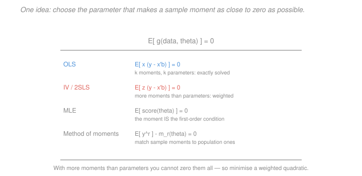

# Econometrics · Lesson 5.2: The generalized method of moments

> ⏱ ~15 min · Module 5: Estimation principles and extensions · Builds on: [5.1 (maximum likelihood)](05-01-maximum-likelihood-estimation.md), [3.7 (2SLS)](03-07-two-stage-least-squares.md) · Unlocks: 5.3 (logit and probit), 5.4 (censoring and selection)

## Why this matters

You have now met OLS, IV, 2SLS, fixed effects, GLS and maximum likelihood as separate techniques with separate derivations. GMM shows they are one technique.

The unification is not just tidy. It tells you where the standard errors come from in every case, why over-identification produces a specification test, and — most usefully — how to build an estimator for a model you have never seen, provided you can state what the economics implies about some expectation being zero.

That last point is the practical payoff. Economic theory rarely delivers a full likelihood. It routinely delivers **orthogonality conditions**: a rational agent's forecast error is uncorrelated with information available when the forecast was made; an optimising consumer's marginal-utility ratio satisfies an Euler equation. GMM turns such statements directly into estimators without inventing a distribution nobody believes.

## The idea

Every estimator you know sets some sample average to zero. OLS sets $\frac1n\sum x_i\hat u_i = 0$. IV sets $\frac1n\sum z_i\hat u_i = 0$. MLE sets $\frac1n\sum s_i(\hat\theta)=0$. In each case a population statement $E[g(\cdot,\theta_0)]=0$ is replaced by its sample analogue — [1.3](01-03-ols-algebra-geometry-projection.md)'s analogy principle again.

When you have exactly as many moment conditions as parameters, you can usually solve them all exactly, and the resulting estimator is the familiar one.

When you have **more** conditions than parameters — several instruments for one endogenous regressor — you cannot set them all to zero simultaneously. So minimise a weighted distance from zero instead. The weighting matters: conditions estimated precisely should count for more, and the optimal weight turns out to be the inverse of the moments' covariance matrix.

And once you have more conditions than you need, their residual disagreement is a **test**. If all the conditions are true, they should nearly agree; substantial disagreement is evidence something is wrong.

## The formal version

> **Setup.** Let $\theta\in\mathbb R^k$ and let $g(w_i,\theta)$ be a vector of $q$ **moment functions** with
> $$E[g(w_i,\theta_0)] = 0$$
> holding at the true $\theta_0$ and only there (**global identification**), with $q\ge k$.

The sample analogue is $\bar g_n(\theta) = \frac1n\sum_i g(w_i,\theta)$.

> **Definition (GMM estimator).** For a positive definite weight matrix $W_n$,
> $$\hat\theta_{GMM} = \arg\min_\theta\ \bar g_n(\theta)'\,W_n\,\bar g_n(\theta) .$$

*In words:* choose the parameter making all the moment conditions as close to zero as possible, with $W_n$ deciding how to trade off one condition against another.

**Just-identified case ($q=k$).** The minimum is exactly zero — you can solve $\bar g_n(\hat\theta)=0$ — and the weight matrix is irrelevant, since any positive definite $W_n$ gives the same answer.

> **Theorem (asymptotics).** Under regularity conditions, with $G = E[\partial g/\partial\theta']$ and $S = E[gg']$,
> $$\sqrt n(\hat\theta_{GMM}-\theta_0)\ \xrightarrow{d}\ \mathcal N\Bigl(0,\ (G'WG)^{-1}G'WSWG(G'WG)^{-1}\Bigr) .$$

> **Optimal weighting.** The variance is minimised at $W = S^{-1}$, giving
> $$\operatorname{Avar}(\hat\theta) = (G'S^{-1}G)^{-1} .$$

*In words:* weight each moment by the inverse of its variance, so noisy conditions count less. In practice this is **two-step GMM** — estimate with any $W$ (usually $I$ or $(Z'Z)^{-1}$), form $\hat S$ from the residuals, then re-estimate with $\hat S^{-1}$. Continuously-updated GMM iterates to convergence and has better finite-sample behaviour.

**The unification.** Every estimator in this course is GMM with a particular $g$:

| Estimator | Moment function $g$ | $q$ vs $k$ |
|---|---|---|
| **OLS** | $x_i(y_i - x_i'\beta)$ | $q=k$ |
| **IV (just-identified)** | $z_i(y_i-x_i'\beta)$, $\dim z = \dim x$ | $q=k$ |
| **2SLS** | $z_i(y_i-x_i'\beta)$, $\dim z > \dim x$, with $W=(Z'Z/n)^{-1}$ | $q>k$ |
| **MLE** | $s_i(\theta)$, the score | $q=k$ |
| **Method of moments** | $y_i^r - m_r(\theta)$ | $q\ge k$ |

Two of these are worth dwelling on. **2SLS is GMM with $W = (Z'Z/n)^{-1}$**, which is optimal only under homoskedasticity; under heteroskedasticity the optimal weight is $\hat S^{-1}$ with $\hat S = \frac1n\sum \hat u_i^2z_iz_i'$, and the resulting estimator is *two-step efficient GMM*, which differs from and improves on 2SLS. **MLE is GMM with the score as the moment**, which explains [5.1](05-01-maximum-likelihood-estimation.md)'s sandwich immediately: it is the general GMM variance formula, collapsing to $I^{-1}$ when the information equality makes $G = -S$.

> **The $J$-test.** With optimal weighting,
> $$J = n\,\bar g_n(\hat\theta)'\hat S^{-1}\bar g_n(\hat\theta)\ \xrightarrow{d}\ \chi^2_{q-k}$$
> under the null that all moment conditions hold.

*In words:* if every condition is valid, the minimised objective should be small. The degrees of freedom are the number of **surplus** conditions, since $k$ of them are used up fitting $\theta$. This is exactly [3.7](03-07-two-stage-least-squares.md)'s Sargan–Hansen statistic, now visible as a general specification test rather than an IV-specific trick.

And the limitation carries over unchanged: with $q=k$ the objective is identically zero, $J\equiv 0$, and there is nothing to test. **Over-identification is the only source of testable content about the moment conditions.**

**Where the moments come from.** This is the part that makes GMM more than a repackaging. Economic theory generates orthogonality conditions directly:

- **Rational expectations:** a forecast error is uncorrelated with any information available when the forecast was made, giving $E[(y_{t+1}-E_t[y_{t+1}])\,z_t]=0$ for every $z_t$ in the period-$t$ information set — an unlimited supply of instruments.
- **Consumption Euler equation:** $E\bigl[\beta(1+r_{t+1})u'(c_{t+1})/u'(c_t) - 1\,\big|\,\mathcal I_t\bigr]=0$, which Hansen and Singleton used to estimate preference parameters without ever specifying the distribution of shocks. That paper is what put GMM at the centre of empirical macro and finance.

**Weak identification.** GMM inherits [3.8](03-08-weak-instruments-and-late.md)'s problem in general form: if $G$ is near-singular, the moments barely respond to $\theta$, and the asymptotics fail badly. Two-step GMM is also known to be biased with many moment conditions, for the same reason 2SLS is biased with many weak instruments — the estimated $\hat S$ correlates with the moments it is weighting.

## Picture

Four estimators, one line at the top. The rows differ only in what goes inside $g$ and in whether $q$ exceeds $k$. The bottom line is the whole reason the framework needs a weight matrix at all: with surplus moments you cannot zero them, so you must decide how to trade off missing one against missing another.

## Worked examples

**Example 1 (mechanical): IV as method of moments.** The exclusion restriction of [3.6](03-06-instrumental-variables.md) says $E[z_i u_i]=0$, i.e.
$$E\bigl[z_i(y_i - x_i'\beta)\bigr] = 0 .$$
That is a moment condition with $g(w_i,\beta) = z_i(y_i-x_i'\beta)$. With one instrument and one regressor, $q=k=1$, so set the sample analogue to zero exactly:
$$\frac1n\sum_i z_i(y_i - x_i\hat\beta) = 0 \quad\Longrightarrow\quad \sum_i z_iy_i = \hat\beta\sum_i z_ix_i \quad\Longrightarrow\quad \hat\beta = \frac{\sum_i z_iy_i}{\sum_i z_ix_i} = \frac{Z'y}{Z'X} .$$
The IV estimator, derived in two lines from the exclusion restriction with no mention of two stages, projections or fitted values. Adding a constant and demeaning turns this into $\widehat{\operatorname{Cov}}(z,y)/\widehat{\operatorname{Cov}}(z,x)$, the Wald form.

Now add a second instrument: $q=2 > 1 = k$. There is no $\hat\beta$ setting both sample moments to zero, so minimise
$$\bar g_n(\beta)'W_n\bar g_n(\beta) ,$$
and the choice of $W_n$ now matters. Taking $W_n = (Z'Z/n)^{-1}$ delivers 2SLS; taking $W_n = \hat S^{-1}$ delivers efficient GMM, which is strictly better under heteroskedasticity. The two coincide when errors are homoskedastic.

**Example 2 (why you'd care): estimating preferences without a distribution.** A consumer maximises $E_0\sum_t \delta^t\frac{c_t^{1-\gamma}}{1-\gamma}$. The Euler equation is
$$E\left[\delta\,(1+r_{t+1})\left(\frac{c_{t+1}}{c_t}\right)^{-\gamma} - 1 \ \Bigg|\ \mathcal I_t\right] = 0 ,$$
with two unknowns: the discount factor $\delta$ and risk aversion $\gamma$.

To estimate by maximum likelihood you would need the joint distribution of consumption growth and returns — a strong assumption nobody can defend, and one that would drive the results.

GMM needs none of it. The conditional statement implies an unconditional one for any $z_t$ known at $t$:
$$E\left[\left(\delta(1+r_{t+1})\left(\tfrac{c_{t+1}}{c_t}\right)^{-\gamma}-1\right)z_t\right] = 0 .$$
Take $z_t = (1,\ r_t,\ c_t/c_{t-1},\ r_{t-1})'$ — four instruments, two parameters, so $q=4$, $k=2$, and the model is over-identified with two surplus conditions. Estimate by two-step GMM; test with $J\sim\chi^2_2$.

Two things this buys. It estimates **structural preference parameters** from an equilibrium condition, requiring only that the theory's orthogonality holds — that is the whole appeal of the method in macro and finance. And the $J$-test becomes a **test of the model**: a rejection says the Euler equation is inconsistent with the data. Hansen and Singleton's rejections, and the implausibly high risk aversion needed to fit the data, are one route into the equity premium puzzle that [`grad-macro` 5.5](../../grad-macro/lessons/05-05-equity-premium-puzzle.md) develops.

The caution from [3.8](03-08-weak-instruments-and-late.md) applies with force: lagged consumption growth is a notoriously weak instrument, so these estimates are often weakly identified and their conventional standard errors unreliable — a known and much-discussed limitation of the Euler-equation literature.

## Watch out

- **You might think** more moment conditions are always better — **but actually** each adds a constraint that must be *true*, and one invalid condition contaminates the whole estimate. Many moments also worsen the finite-sample bias of two-step GMM, exactly as many weak instruments worsen 2SLS in [3.7](03-07-two-stage-least-squares.md).
- **You might think** a passing $J$-test validates the model — **but actually** it tests only the over-identifying restrictions, taking $k$ of the conditions as maintained. If all your moments come from the same flawed theory, they fail together and the test does not notice. And with weak identification, $J$ loses power almost entirely.
- **You might think** the optimal weight matrix is free — **but actually** $\hat S$ must be estimated, and in small samples that estimate is noisy and correlated with the moments it weights, producing bias. With few observations relative to $q$, one-step GMM with a fixed $W$ is often better behaved, and continuously-updated GMM better still.

## One-liner

> Every estimator in this course sets some sample average to zero; GMM says so explicitly, weights the surplus conditions by the inverse of their covariance when there are more than parameters, and turns whatever disagreement remains into the $J$-test — which is why over-identification is the only thing that ever makes a moment condition testable.

## Problems

**P1 (🟢)** A GMM problem has 7 moment conditions and 3 parameters. State the degrees of freedom of the $J$-test and its 5 percent critical value. What would the $J$-statistic be if there were 3 moment conditions instead, and why?

**P2 (🟡)** Show that OLS is GMM with $g(w_i,\beta)=x_i(y_i-x_i'\beta)$, and that in this just-identified case the weight matrix is irrelevant. Then show that the general GMM variance formula reduces to the sandwich of [2.2](02-02-consistency-and-asymptotic-normality.md).

**P3 (🔴, optional)** Show that MLE is GMM with the score as the moment function, and use the general GMM variance formula to derive both $I(\theta)^{-1}$ under correct specification and the sandwich $A^{-1}BA^{-1}$ under misspecification. Identify exactly which GMM quantity plays the role of the information matrix.

Solutions

**P1** *Degrees of freedom.* $q - k = 7-3 = 4$, so $J\sim\chi^2_4$ under the null. The 5 percent critical value is
$$\chi^2_{4,\,0.95} = 9.488 .$$

*With 3 moment conditions.* Then $q = k = 3$: the model is **just-identified**. There exists a $\hat\theta$ solving $\bar g_n(\hat\theta)=0$ exactly — three equations in three unknowns — so the minimised objective is
$$J = n\cdot 0'\hat S^{-1}0 = 0$$
**identically**, for every dataset. Consistently, the degrees of freedom are $q-k=0$, and a $\chi^2_0$ distribution is degenerate at zero.

The interpretation matters more than the arithmetic: with exactly enough moments to pin down the parameters, every condition is used up in estimation and none is left over to check anything. **The moment conditions of a just-identified model are untestable in principle** — the same point as [3.7](03-07-two-stage-least-squares.md) P2 about just-identified IV, now visible as a general feature rather than a quirk of instrumental variables.

**P2** *OLS as GMM.* The population moment condition defining the best linear predictor of [1.2](01-02-best-linear-predictor.md) is
$$E\bigl[x_i(y_i-x_i'\beta)\bigr] = 0 ,$$
which is $k$ equations in $k$ unknowns, so $q=k$ and the model is just-identified. The sample analogue is
$$\bar g_n(\beta) = \frac1n\sum_i x_i(y_i-x_i'\beta) = \frac1n\bigl(X'y - X'X\beta\bigr) .$$
Setting this to zero gives $X'X\hat\beta = X'y$, the **normal equations** of [1.3](01-03-ols-algebra-geometry-projection.md), so $\hat\beta = (X'X)^{-1}X'y$. $\checkmark$

*Irrelevance of $W$.* The objective is $\bar g_n(\beta)'W_n\bar g_n(\beta)$, a positive definite quadratic form in $\bar g_n$. Since $\bar g_n$ is a $k$-vector and $\beta$ has $k$ free components, and since $\partial\bar g_n/\partial\beta' = -X'X/n$ is invertible under [1.3](01-03-ols-algebra-geometry-projection.md)'s full-rank condition, there is a $\hat\beta$ with $\bar g_n(\hat\beta)=0$ exactly. That $\hat\beta$ attains the objective's global minimum of zero **for any positive definite $W_n$**, because a positive definite form is zero only at zero. So all weight matrices give the identical estimator.

*Reduction to the sandwich.* Apply the GMM variance formula with $q=k$. Here
$$G = E\left[\frac{\partial g}{\partial\beta'}\right] = E[-x_ix_i'] = -Q , \qquad S = E[gg'] = E\bigl[x_ix_i'u_i^2\bigr] = \Omega ,$$
in the notation of [2.2](02-02-consistency-and-asymptotic-normality.md). With $q=k$, $G$ is square and invertible, so the general expression collapses:
$$(G'WG)^{-1}G'WSWG(G'WG)^{-1} = G^{-1}S\,G'^{-1} ,$$
since $(G'WG)^{-1}G'W = G^{-1}$ when $G$ is invertible (the $W$'s cancel — another route to the irrelevance result). Substituting,
$$\operatorname{Avar}(\hat\beta) = (-Q)^{-1}\Omega(-Q)^{-1} = Q^{-1}\Omega Q^{-1} ,$$
which is exactly [2.2](02-02-consistency-and-asymptotic-normality.md)'s sandwich. $\checkmark$ Under homoskedasticity $\Omega = \sigma^2 Q$ and it collapses further to $\sigma^2Q^{-1}$.

So the sandwich was never a special feature of least squares — it is the GMM variance formula, and every appearance of it in this course ([2.2](02-02-consistency-and-asymptotic-normality.md), [2.4](02-04-heteroskedasticity-robust-standard-errors.md), [2.5](02-05-clustered-standard-errors.md), [5.1](05-01-maximum-likelihood-estimation.md)) is the same theorem.

**P3** *MLE as GMM.* [5.1](05-01-maximum-likelihood-estimation.md) showed the MLE solves the first-order condition $\sum_i s_i(\hat\theta)=0$, where $s_i = \partial\log f(y_i\mid x_i;\theta)/\partial\theta$. Taking
$$g(w_i,\theta) = s_i(\theta) ,$$
the population condition $E[s_i(\theta_0)]=0$ is precisely the zero-mean-score property derived in [5.1](05-01-maximum-likelihood-estimation.md) P3. Since $s_i$ and $\theta$ both have dimension $k$, this is **just-identified** GMM, and the sample condition $\bar g_n(\hat\theta)=0$ is the likelihood equation. $\checkmark$

*The two GMM quantities.*
$$G = E\left[\frac{\partial s_i}{\partial\theta'}\right] = E\left[\frac{\partial^2\log f}{\partial\theta\partial\theta'}\right] = -A , \qquad S = E[s_is_i'] = B .$$
So $G$ is the **expected curvature** (Hessian) of the log-likelihood, and $S$ is the **variance of the score**.

*Variance under misspecification.* Just-identified GMM gives $\operatorname{Avar} = G^{-1}SG'^{-1}$, and substituting:
$$\operatorname{Avar}(\hat\theta) = (-A)^{-1}B(-A)^{-1} = A^{-1}BA^{-1} ,$$
which is exactly [5.1](05-01-maximum-likelihood-estimation.md)'s quasi-MLE sandwich. $\checkmark$

*Variance under correct specification.* The information matrix equality states $A = B = I(\theta_0)$. Substituting,
$$\operatorname{Avar}(\hat\theta) = I^{-1}I\,I^{-1} = I(\theta_0)^{-1} ,$$
the Cramér–Rao bound. $\checkmark$

*Which GMM quantity is the information matrix.* **Both $G$ and $S$ are, and that is the content of the information equality.** Precisely: $S = E[gg'] = I(\theta_0)$ always (the information matrix is *defined* as the score's variance), while $-G = A = I(\theta_0)$ only when the model is correctly specified. So

- $S$ is the information matrix by definition, whatever the model;
- $-G$ equals it if and only if the density is correct.

Two consequences worth carrying. First, this explains why MLE is efficient in a way GMM makes transparent: with $G = -S$, the general optimal-GMM variance $(G'S^{-1}G)^{-1}$ becomes $(S\,S^{-1}S)^{-1} = S^{-1} = I^{-1}$, so the score is automatically the optimally-weighted moment — no weighting choice can improve on it. **The likelihood hands you the efficient moment condition for free**, which is the precise sense in which MLE is the best estimator when its assumption holds.

Second, White's information-matrix test of [5.1](05-01-maximum-likelihood-estimation.md) P3 is, in this language, a test of $H_0: -G = S$. It is a specification test of a just-identified model, made possible not by surplus moments but by the *extra structure* the likelihood supplies — a rare case where a just-identified model has testable implications, and one that shows exactly what the $J$-test's limitation to over-identified models really rests on.

## Flashback

**From Lesson 5.1 (maximum likelihood estimation):** You observe $n=64$ i.i.d. Poisson counts with $\sum y_i = 192$. Derive the MLE of the rate $\lambda$, compute it, find the Fisher information per observation, and give an approximate 95 percent interval. Then state what happens to the estimate if the data are overdispersed.

Solution

*Deriving the MLE.* The Poisson pmf is $f(y;\lambda) = e^{-\lambda}\lambda^y/y!$, so
$$\ell(\lambda) = \sum_i\bigl(-\lambda + y_i\log\lambda - \log y_i!\bigr) = -n\lambda + \log\lambda\sum_i y_i + \text{const} .$$
Score and first-order condition:
$$s(\lambda) = -n + \frac{\sum_i y_i}{\lambda} = 0 \qquad\Longrightarrow\qquad \hat\lambda = \frac{\sum_i y_i}{n} = \bar y .$$

*Computation.* $\hat\lambda = 192/64 = 3.0$.

*Information.* The second derivative is $\partial^2\ell/\partial\lambda^2 = -\sum_i y_i/\lambda^2$, so
$$-E\left[\frac{\partial^2\ell}{\partial\lambda^2}\right] = \frac{nE[y_i]}{\lambda^2} = \frac{n\lambda}{\lambda^2} = \frac n\lambda \qquad\Longrightarrow\qquad I(\lambda) = \frac1\lambda \ \text{ per observation.}$$

*Interval.*
$$\operatorname{Var}(\hat\lambda)\approx\frac{1}{nI(\lambda)} = \frac{\lambda}{n}, \qquad \mathrm{se} = \sqrt{\frac{3.0}{64}} = \sqrt{0.046875} = 0.216506 ,$$
$$3.0 \pm 1.96(0.216506) = 3.0\pm 0.424352 = [2.576,\ 3.424] .$$

(Equivalently $\mathrm{se} = \sqrt{\hat\lambda/n}$, the standard error of a mean whose variance equals its mean.)

*Under overdispersion.* Real count data usually has $\operatorname{Var}(y)>E[y]$ — the Poisson's defining restriction that mean equals variance almost never holds, because of unobserved heterogeneity across units. Two things happen, and they are quite different:

- **The point estimate survives.** The Poisson is a linear exponential family, so by [5.1](05-01-maximum-likelihood-estimation.md)'s quasi-MLE result, $\hat\lambda$ remains **consistent** for $E[y]$ provided the conditional mean is correctly specified. Overdispersion is a variance failure, not a mean failure.
- **The standard error is badly wrong.** The information equality fails, so $I^{-1}$ understates the variance. If the true variance is $\phi\lambda$ with dispersion $\phi>1$, the correct standard error is $\sqrt\phi$ times the reported one. With $\phi = 4$ — not unusual — the honest interval is twice as wide, and a $t$-statistic of $4$ is really $2$.

The fix is exactly [5.1](05-01-maximum-likelihood-estimation.md)'s: **report the sandwich variance** $A^{-1}BA^{-1}$, which is robust to any variance structure. In this literature it is called **Poisson pseudo-maximum-likelihood with robust standard errors**, and it is the standard tool for exponential-mean models — trade gravity equations, patent counts, doctor visits — precisely because it needs only the mean to be right, handles zeros natively (unlike logging the outcome), and delivers an elasticity directly. The alternative of switching to a negative binomial model adds a variance assumption that is not needed if you are willing to use robust standard errors.

## Connections

- **Backward:** GMM contains every estimator in this course as a special case — [1.3](01-03-ols-algebra-geometry-projection.md)'s OLS, [3.6](03-06-instrumental-variables.md)'s IV, [3.7](03-07-two-stage-least-squares.md)'s 2SLS (with a particular non-optimal weight matrix), and [5.1](05-01-maximum-likelihood-estimation.md)'s MLE. The $J$-test is [3.7](03-07-two-stage-least-squares.md)'s Sargan–Hansen statistic generalised, and the sandwich variance appearing throughout Module 2 is the GMM variance formula.
- **Forward:** [5.3](05-03-logit-and-probit.md) and [5.4](05-04-censoring-truncation-sample-selection.md) use likelihood-based estimators that are GMM with score moments; the robust standard errors reported there come from the sandwich derived here. Weak identification in GMM is [3.8](03-08-weak-instruments-and-late.md)'s problem in its general form.
- **Sideways:** GMM is the estimation technology that made structural macro and asset pricing empirically testable — the Euler equations of [`grad-macro` 5.4](../../grad-macro/lessons/05-04-consumption-based-asset-pricing.md) are moment conditions, and the puzzle in [`grad-macro` 5.5](../../grad-macro/lessons/05-05-equity-premium-puzzle.md) is in part a $J$-test rejection. The framework is what lets a theory be confronted with data without a full distributional specification.
