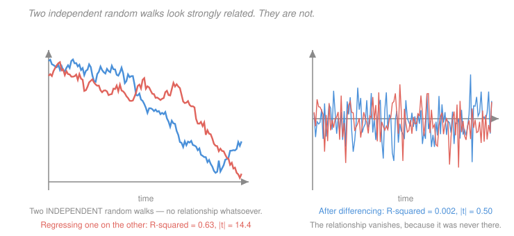

# Econometrics · Lesson 5.5: A taste of time series

> ⏱ ~15 min · Module 5: Estimation principles and extensions · Builds on: [4.7 (regression discontinuity)](04-07-regression-discontinuity.md), [2.2 (consistency and asymptotic normality)](02-02-consistency-and-asymptotic-normality.md) · Unlocks: this is the course's final lesson

## Why this matters

Everything in this course assumed observations were independent draws, or at worst correlated within known clusters. Time series breaks that assumption at the root: today's GDP is not an independent draw given yesterday's, and the entire asymptotic apparatus of [2.2](02-02-consistency-and-asymptotic-normality.md) rests on averages of things that are not too dependent.

This lesson is deliberately a taste, not a module — the syllabus scopes out macroeconometrics. But one result is genuinely dangerous and every applied economist must know it: **regress one trending series on another and you will get a large $R^2$ and an enormous $t$-statistic even when the two are completely unrelated.** Not occasionally. Roughly 80 percent of the time.

That is not a subtle failure. It is a regression machine reporting overwhelming evidence for a relationship that does not exist, and it has produced a great deal of published nonsense.

## The idea

The asymptotic results of [2.2](02-02-consistency-and-asymptotic-normality.md) needed sample averages to converge to population means. That requires the series to *have* a stable population mean to converge to — which is what **stationarity** provides.

A stationary series fluctuates around a fixed level and forgets shocks: hit it today and the effect decays. A **random walk** does not forget. Each shock is permanently absorbed into the level, the variance grows without bound, and there is no fixed mean for an average to converge to. The LLN and CLT as you know them simply do not apply.

Two independent random walks will nonetheless *appear* related, because both wander persistently, and a regression cannot distinguish "both wandering" from "moving together". The residuals from such a regression are themselves a random walk, so the standard-error formula — which assumes residuals that die out — is wildly too small.

The diagnosis is simple and the fix usually is too: **difference the series.** The difference of a random walk is white noise, stationary and well behaved, and the regression in differences is honest.

## The formal version

> **Covariance stationarity.** $\{y_t\}$ is stationary if $E[y_t]=\mu$ for all $t$, $\operatorname{Var}(y_t)=\sigma^2 < \infty$ for all $t$, and $\operatorname{Cov}(y_t,y_{t-h})=\gamma_h$ depends on $h$ but not on $t$.

*In words:* the mean and variance do not drift, and the correlation between two observations depends only on how far apart they are.

**AR(1).** $y_t = \phi y_{t-1}+\varepsilon_t$ with $\varepsilon_t$ white noise.

| $|\phi|$ | behaviour |
|---|---|
| $<1$ | stationary; shocks decay geometrically; $\operatorname{Var}(y_t)=\sigma^2_\varepsilon/(1-\phi^2)$; $\gamma_h/\gamma_0 = \phi^h$ |
| $=1$ | **random walk** (unit root); shocks permanent; $\operatorname{Var}(y_t)=t\sigma^2_\varepsilon\to\infty$ |
| $>1$ | explosive |

The half-life of a shock is $\log(0.5)/\log\phi$: at $\phi=0.9$ about 6.6 periods, at $\phi = 0.99$ about 69.

**MA(1).** $y_t = \varepsilon_t+\theta\varepsilon_{t-1}$ — always stationary, with correlation $\theta/(1+\theta^2)$ at lag 1 and exactly zero beyond. The differenced errors of [4.2](04-02-first-differencing-random-effects.md) P2 were an MA(1) with $\theta=-1$.

**OLS on an AR(1) is biased but consistent.** Strict exogeneity ([1.4](01-04-gauss-markov-theorem.md)) is *structurally impossible* here: $y_{t-1}$ is correlated with $\varepsilon_{t-1}$, which is in $y_{t-1}$'s own history, so the regressor cannot be independent of all errors. But contemporaneous exogeneity $E[y_{t-1}\varepsilon_t]=0$ holds, so [2.2](02-02-consistency-and-asymptotic-normality.md)'s consistency applies. The finite-sample bias is
$$E[\hat\phi]-\phi \approx -\frac{1+3\phi}{T} ,$$
downward, and non-trivial in short samples: at $\phi = 0.9$ and $T=50$, about $-0.074$.

> **Spurious regression (Granger–Newbold).** If $y_t$ and $x_t$ are **independent** random walks, regressing $y$ on $x$ gives a $t$-statistic that diverges with $T$, an $R^2$ that does not converge to zero, and residuals that are themselves nonstationary.

The simulation numbers are worth memorising. With $T=120$ and two independent random walks, over 4,000 replications:

| statistic | value |
|---|---|
| rejection rate of a nominal 5% test | **0.796** |
| median $R^2$ | $0.175$ |
| median $|t|$ | $5.04$ |
| $P(R^2 > 0.5)$ | $0.162$ |
| rejection rate **after differencing** | $0.056$ |

**Eighty percent of the time you reject a true null.** The $t$-statistic does not have a $t$ distribution; it grows like $\sqrt T$, so *more data makes it worse*. Differencing restores the nominal 5 percent size exactly.

The mechanism: the true residual is a random walk, so its variance grows with $T$ while the formula $s^2/\sum(x_t-\bar x)^2$ assumes it does not. The standard error is understated by a factor that itself grows.

**Testing for a unit root.** The **Dickey–Fuller** test regresses $\Delta y_t$ on $y_{t-1}$ (augmented with lagged differences to whiten the errors) and tests whether the coefficient is zero.

Two cautions that matter. The null is "there **is** a unit root", so failing to reject is not evidence of stationarity — and these tests are notoriously **low-powered** against $\phi$ near but below one. At $\phi = 0.95$ with $T=100$, power is often below 30 percent. Distinguishing a random walk from a highly persistent stationary series is genuinely hard, and in many macro applications it cannot be done with the available data.

**Cointegration.** The important exception. If $y_t$ and $x_t$ are each nonstationary but some linear combination $y_t - \beta x_t$ **is** stationary, they are **cointegrated** — they wander, but not apart. Then the regression is not spurious: it estimates a genuine long-run relationship, and $\hat\beta$ is **superconsistent**, converging at rate $T$ rather than $\sqrt T$.

This is the distinction that matters in practice. Two random walks that happen to drift together produce spurious regression; two series tied by an economic equilibrium — consumption and income, spot and forward prices, prices across integrated markets — produce cointegration. **The difference is testable** (Engle–Granger: test whether the residuals are stationary), and the practical workflow is: test for unit roots, test for cointegration, and difference only if the second test fails. Differencing a cointegrated pair throws away the long-run information, which is what the error-correction model exists to retain.

## Picture

The two series on the left were generated **independently** — there is no relationship whatsoever. A regression of one on the other returns $R^2 = 0.63$ and $|t| = 14.4$, which would be reported as overwhelming evidence. On the right, the same two series differenced: $R^2 = 0.002$, $|t| = 0.50$, correctly finding nothing. The left panel is not an unlucky draw; it is a representative one.

## Worked examples

**Example 1 (mechanical): persistence and half-lives.** For a stationary AR(1), a shock's effect after $h$ periods is $\phi^h$, so the half-life solves $\phi^h = 0.5$:
$$h = \frac{\log 0.5}{\log\phi} .$$

| $\phi$ | half-life (periods) | $\operatorname{Var}(y_t)/\sigma^2_\varepsilon = 1/(1-\phi^2)$ |
|---|---|---|
| $0.5$ | $1.00$ | $1.33$ |
| $0.8$ | $3.11$ | $2.78$ |
| $0.9$ | $6.58$ | $5.26$ |
| $0.95$ | $13.51$ | $10.26$ |
| $0.99$ | $68.97$ | $50.25$ |

Two things to read off. The half-life explodes as $\phi\to 1$ — the process approaches a random walk, where shocks never decay and the half-life is infinite. And the unconditional variance explodes as $1/(1-\phi^2)$, which is why a persistent series ranges so much more widely than its shocks would suggest.

The practical relevance is the low power of unit-root tests: at $\phi=0.95$ the series is genuinely stationary and mean-reverting, but with a 13-period half-life it looks like a random walk over any sample of a few hundred observations. **The statistical question and the economic question can come apart**, and it is often more useful to report the estimated persistence with a confidence interval than to force a binary verdict.

**Example 2 (why you'd care): a spurious relationship, followed all the way through.** You regress a country's annual health spending on its annual imports, 1960–2020. Both series trend strongly upward. The regression returns
$$\hat\beta = 0.84 \ (\mathrm{se}\ 0.06), \qquad t = 14.0, \qquad R^2 = 0.91 .$$
A tempting conclusion: trade drives health spending.

*What to check, in order.*

1. **Plot the residuals.** If they wander persistently rather than fluctuating around zero, the regression is suspect. A Durbin–Watson statistic well below the $R^2$ is the classic Granger–Newbold red flag.
2. **Test each series for a unit root.** Both will almost certainly fail to reject — nearly all macro levels do.
3. **Test for cointegration.** Regress one on the other and test whether the *residuals* are stationary. If they are, the relationship is real and long-run. If not, it is spurious.
4. **If not cointegrated, difference.** Regress the change in health spending on the change in imports. Typically the coefficient collapses and the $t$-statistic falls below 2.

*The likely resolution here.* Both series are driven by a third factor — GDP growth, population growth, general economic development — that trends. Neither causes the other. This is [3.4](03-04-omitted-variable-bias.md)'s omitted-variable bias, with the extra twist that the confounder is a **trend**, and trends are so strongly correlated with one another that the resulting bias is enormous and the standard errors are simultaneously far too small.

Note that including a linear time trend as a regressor is *not* a general fix. It works if the series are trend-stationary — deterministic trend plus stationary noise — but not if they have unit roots, where the nonstationarity is stochastic rather than deterministic. Distinguishing the two cases is exactly what unit-root tests are for, and exactly what they do badly.

## Watch out

- **You might think** a high $t$-statistic with $T=200$ is decisive — **but actually** with nonstationary series the $t$-statistic diverges with $T$, so a *larger* sample produces a *more* significant spurious result. This is the one setting in this course where more data actively makes inference worse.
- **You might think** failing to reject a unit root establishes one — **but actually** the null *is* the unit root, and these tests have poor power against $\phi$ near one. Non-rejection is compatible with $\phi=0.95$, which is stationary. Report the point estimate of persistence and its interval, not just the verdict.
- **You might think** differencing is always the safe choice — **but actually** if the series are cointegrated, differencing discards the long-run relationship you were trying to estimate. Test for cointegration first, and use an error-correction model when it holds — it keeps both the long-run level relationship and the short-run dynamics.

## One-liner

> Two independent random walks produce a large $R^2$ and a $t$-statistic near 5 about eighty percent of the time, and the problem grows with the sample — so test for unit roots, test for cointegration, and difference unless the series are genuinely tied together.

## Problems

**P1 (🟢)** An AR(1) has $\phi = 0.85$. Compute the half-life of a shock, the unconditional variance in units of $\sigma^2_\varepsilon$, and the correlation at lags 1, 5 and 10. Then compute the approximate finite-sample bias of $\hat\phi$ at $T = 80$.

**P2 (🟡)** Explain why the $t$-statistic in a spurious regression diverges with $T$ rather than converging to a $t$ distribution. Then explain why differencing fixes it, and state one situation where differencing would be the wrong response.

**P3 (🔴, optional)** Two series are each I(1) — nonstationary, stationary in first differences. Explain what it would mean for them to be cointegrated, describe the Engle–Granger test, and explain why $\hat\beta$ is "superconsistent". Then explain what an error-correction model adds.

Solutions

**P1** *Half-life.*
$$h = \frac{\log 0.5}{\log 0.85} = \frac{-0.693147}{-0.162519} = 4.265 \ \text{periods} .$$

*Unconditional variance.*
$$\frac{\operatorname{Var}(y_t)}{\sigma^2_\varepsilon} = \frac{1}{1-\phi^2} = \frac{1}{1-0.7225} = \frac{1}{0.2775} = 3.604 .$$
The series ranges about $\sqrt{3.604} = 1.90$ times as widely as its shocks — persistence amplifies.

*Autocorrelations.* $\rho_h = \phi^h$:
$$\rho_1 = 0.850, \qquad \rho_5 = 0.85^5 = 0.4437, \qquad \rho_{10} = 0.85^{10} = 0.1969 .$$

*Finite-sample bias at $T=80$.*
$$E[\hat\phi]-\phi \approx -\frac{1+3\phi}{T} = -\frac{1+2.55}{80} = -\frac{3.55}{80} = -0.0444 .$$
So $\hat\phi$ would average about $0.806$ rather than $0.85$ — a downward bias of roughly 5 percent of the parameter. The bias is $O(1/T)$ so it vanishes asymptotically, consistent with [2.2](02-02-consistency-and-asymptotic-normality.md)'s "consistent but biased" result for exactly this model, but at $T=80$ it is large enough to matter for any calibration that uses $\hat\phi$ directly.

**P2** *Why the $t$-statistic diverges.* Consider regressing one random walk on another. The usual $t$-statistic is
$$t = \frac{\hat\beta}{s/\sqrt{\sum_t (x_t-\bar x)^2}} .$$
Two things go wrong at once, and both push in the same direction.

First, the **residuals are nonstationary.** Since $y_t$ and $x_t$ are both I(1) and (being independent) not cointegrated, $\hat u_t = y_t - \hat\beta x_t$ is itself I(1) — a random walk. Its variance grows with $t$, so $s^2$ does not converge to a constant; it grows like $T$.

Second, the **denominator grows even faster.** For a random walk, $\sum_t(x_t-\bar x)^2$ is $O_p(T^2)$ rather than the $O_p(T)$ of stationary data, because the series wanders ever further from its own mean.

The net effect, worked out by Phillips, is that $\hat\beta$ does **not** converge to zero — it converges to a random variable, different in every sample — and the $t$-statistic behaves like
$$t = O_p(\sqrt T) \ \xrightarrow{\ }\ \infty .$$
So the $t$-statistic diverges. There is no fixed critical value that controls size, and using $1.96$ gives a rejection rate that **rises with the sample size**, reaching about 80 percent at $T=120$ and higher beyond. The standard asymptotics of [2.2](02-02-consistency-and-asymptotic-normality.md) fail at the first step: the LLN does not apply because there is no population mean for the averages to converge to.

*Why differencing fixes it.* If $y_t$ is a random walk, $\Delta y_t = \varepsilon_t$ is white noise — stationary, with a well-defined mean and variance, and shocks that do not accumulate. The regression of $\Delta y$ on $\Delta x$ is then a regression of one stationary series on another, the LLN and CLT apply as usual, and the $t$-statistic recovers its standard distribution. The simulation confirms it exactly: the rejection rate falls from $0.796$ to $0.056$, essentially the nominal 5 percent.

*When differencing is wrong.* When the series are **cointegrated**. If $y_t - \beta x_t$ is stationary, the levels regression is not spurious — it estimates a genuine long-run equilibrium relationship, and does so superconsistently. Differencing then removes exactly the information you wanted: the differenced regression estimates only the short-run co-movement of changes and is silent about the long-run relationship between levels. Worse, the differenced specification is *misspecified*, omitting the error-correction term, which biases the short-run dynamics too. **Test for cointegration before differencing** — that is the whole practical content of P3.

**P3** *What cointegration means.* Two series $y_t$ and $x_t$ are each I(1), so each individually wanders without a fixed mean and neither is stationary. They are **cointegrated** if there exists a constant $\beta$ such that
$$u_t = y_t - \beta x_t$$
is I(0) — stationary.

Economically: the two series wander, but **not apart**. They are tethered. Any shock that pushes them away from the relationship $y \approx \beta x$ is temporary, and forces pull them back, even though shocks to their common level are permanent. Standard examples are consumption and income (the saving rate is stable even though both series trend), spot and forward exchange rates, short and long interest rates, and prices of the same good in integrated markets. The vector $(1,-\beta)$ is the **cointegrating vector**, and $\beta$ is the long-run equilibrium relationship.

*The Engle–Granger test.* Two steps.

1. Estimate $y_t = \alpha + \beta x_t + u_t$ by OLS on the **levels** and save the residuals $\hat u_t$.
2. Test whether $\hat u_t$ has a unit root, using an augmented Dickey–Fuller regression of $\Delta\hat u_t$ on $\hat u_{t-1}$ and lagged differences.

If you **reject** the unit root in the residuals, the residuals are stationary and the series are cointegrated — the levels regression is meaningful. If you **fail to reject**, the residuals wander and the regression is spurious.

One technical point: the critical values are **not** the standard Dickey–Fuller ones. Because $\hat u_t$ are residuals from an estimated $\hat\beta$ chosen to make them as small as possible, they are biased toward looking stationary, so the correct critical values (Engle–Granger, or MacKinnon) are more negative and depend on how many series are in the regression. Using standard DF critical values finds cointegration too often.

*Why $\hat\beta$ is superconsistent.* In standard stationary settings, $\hat\beta-\beta = O_p(T^{-1/2})$ — the familiar root-$n$ rate of [2.2](02-02-consistency-and-asymptotic-normality.md). Under cointegration the rate is $O_p(T^{-1})$, one full order faster, and $T(\hat\beta-\beta)$ converges to a non-degenerate (non-normal) limit.

The intuition follows from P2's variance calculation. The denominator $\sum_t(x_t-\bar x)^2$ is $O_p(T^2)$ for an I(1) regressor rather than the $O_p(T)$ of stationary data — the regressor's variation grows quadratically because it wanders. Meanwhile the numerator $\sum_t(x_t-\bar x)u_t$ involves a *stationary* error and is only $O_p(T)$. The ratio is therefore $O_p(T^{-1})$.

Put plainly: **an I(1) regressor supplies overwhelming variation relative to a stationary error**, so the long-run parameter is pinned down extremely precisely — the same feature that makes spurious regression so dangerous makes cointegrating regression so accurate. A useful consequence is that superconsistency dominates second-order problems: endogeneity of $x_t$ and serial correlation in $u_t$ do not affect the consistency of $\hat\beta$, though they do affect its distribution, which is why fully-modified OLS or dynamic OLS are used for inference.

*What an error-correction model adds.* By the Granger representation theorem, cointegration is *equivalent* to the existence of an error-correction representation:
$$\Delta y_t = \gamma\,\underbrace{(y_{t-1}-\beta x_{t-1})}_{\text{last period's disequilibrium}} + \sum_j \delta_j\Delta x_{t-j} + \sum_j\psi_j\Delta y_{t-j} + \varepsilon_t ,$$
with $\gamma < 0$.

This does two things a pure differenced regression cannot. It **retains the long-run relationship** through the level term $y_{t-1}-\beta x_{t-1}$, so the model knows where equilibrium is; and it **separates the two timescales** — the $\delta_j$ describe short-run responses to changes, while $\gamma$ measures the speed of return to equilibrium. A $\gamma$ of $-0.3$ means 30 percent of any gap is closed each period, implying a half-life of $\log(0.5)/\log(0.7) = 1.94$ periods.

That decomposition is exactly what a differenced regression throws away, and it is why the ECM — not first differences — is the right specification for cointegrated data. It is also a fitting place for this course to end: the same discipline that runs through every module, of asking what a coefficient identifies and under what assumption, here separates a long-run equilibrium parameter from a short-run adjustment rate, two quantities a single regression coefficient would silently blend.

## Flashback

**From Lesson 4.7 (regression discontinuity):** A sharp RD uses a local linear fit with bandwidth $h$. The curvature of the conditional expectation is $-0.4$ below the cutoff and $+1.1$ above. Compute the bias at $h=1.0$, $h=0.5$ and $h=0.2$, and state what bandwidth would be needed to hold the bias below $0.01$.

Solution

*The bias formula.* From [4.7](04-07-regression-discontinuity.md), the local-linear boundary bias of the RD estimate under a uniform design is
$$\text{bias} = -\frac{(c_1-c_0)h^2}{6} ,$$
where $c_1$ and $c_0$ are the curvatures above and below the cutoff. Here
$$c_1 - c_0 = 1.1 - (-0.4) = 1.5 ,$$
so the bias is $-1.5h^2/6 = -0.25h^2$.

*Evaluations.*

| $h$ | bias $=-0.25h^2$ |
|---|---|
| $1.0$ | $-0.2500$ |
| $0.5$ | $-0.0625$ |
| $0.2$ | $-0.0100$ |

Halving the bandwidth quarters the bias, as the $h^2$ dependence requires.

*Bandwidth needed for bias below $0.01$.* Solve $0.25h^2 < 0.01$:
$$h^2 < 0.04 \qquad\Longrightarrow\qquad h < 0.2 .$$
So $h = 0.2$ sits exactly at the boundary, and anything strictly below it suffices.

*The trade-off this ignores, which is the point.* Driving $h$ to $0.2$ controls the bias but costs precision: the effective sample size is proportional to $nh$, so the variance rises like $1/(nh)$ and shrinking the bandwidth by a factor of five multiplies the variance by five and the standard error by $\sqrt 5 = 2.24$. Minimising the mean squared error $C^2h^4 + V/(nh)$ gives $h^*\propto n^{-1/5}$, which deliberately leaves some bias in exchange for precision — which is why [4.7](04-07-regression-discontinuity.md) recommends the Calonico–Cattaneo–Titiunik **robust bias-corrected** confidence intervals, which account for the residual bias the MSE-optimal bandwidth leaves behind rather than trying to eliminate it.

*One further note tying back to this lesson.* The bias depends on the **difference** in curvature, $c_1-c_0$, not on curvature itself. Had both sides curved at $-0.4$, the two boundary biases would have been identical and would have cancelled in the difference, leaving zero bias at every bandwidth. That is why a **flat bandwidth-sensitivity plot** is genuine evidence the design is robust: it is direct evidence that $c_1\approx c_0$, and it is the diagnostic to report rather than a single estimate at one chosen $h$.

## Connections

- **Backward:** the spurious-regression result is [2.2](02-02-consistency-and-asymptotic-normality.md)'s asymptotics failing at the first step — no population mean means no LLN. Serial correlation is [2.5](02-05-clustered-standard-errors.md)'s within-cluster correlation with time as the cluster dimension, which is exactly why the Bertrand–Duflo–Mullainathan result was so damaging for difference-in-differences. The AR(1) bias is [2.2](02-02-consistency-and-asymptotic-normality.md) P3's "consistent but biased" case made numerical.
- **Sideways:** the same nonstationarity that makes spurious regression dangerous makes cointegrating regression superconsistent — one phenomenon, two consequences, separated only by whether an economic relationship ties the series together. And the macro models of [`grad-macro` 4.2](../../grad-macro/lessons/04-02-calibration-stochastic-growth.md) are calibrated to persistence parameters estimated exactly this way, with the finite-sample bias of P1 a live concern.

## Closing the course

You began with a definition — the conditional expectation function — and a single organising question: *what does this coefficient identify, and under what assumptions is that a causal effect?* Every module was an answer to some part of it.

**Module 1** established what a regression coefficient *is* before any estimation: a projection, computable whether or not the CEF is linear, with "controlling for" given the precise meaning of residualising. **Module 2** made the randomness precise, and the recurring lesson was that the sandwich variance $Q^{-1}\Omega Q^{-1}$ is always the right formula — every familiar simplification is that sandwich under an assumption that usually fails.

**Module 3** was the heart. Potential outcomes turned "correlation is not causation" into a specific bias term you can sign, bound, and sometimes eliminate. Conditioning, instruments, and the LATE framework are three different bets on how to make that term vanish, and each is only as good as an assumption you must defend in prose rather than test in output.

**Module 4** manufactured the missing randomisation from panels, policy timing and thresholds — and, in the staggered-DiD result, delivered the most useful methodological lesson available: a specification the profession trusted for thirty years turned out to be badly biased, and the discovery came from asking *what weighted average of what effects does this regression actually compute?* **Module 5** stepped back to the machinery — likelihood, moments — that generates every estimator here as a special case.

If one habit survives, make it that question. Not "is this significant?" but "what is this the average of, over whom, and what would have to be true for it to be the number I want?" Most of what has gone wrong in applied economics, including the episodes in [2.5](02-05-clustered-standard-errors.md), [2.7](02-07-multiple-testing-specification-search.md) and [4.5](04-05-staggered-adoption-modern-did.md), was a failure to ask it.

Deliberately left for elsewhere: nonparametric and semiparametric estimation, Bayesian methods, structural estimation, and the macroeconometrics this lesson only sampled. The natural next steps are [`grad-macro`](../../grad-macro/syllabus.md) and [`grad-micro`](../../grad-micro/syllabus.md), whose structural parameters this course teaches you to estimate, and [`statistical-learning`](../../statistical-learning/syllabus.md), whose prediction-first worldview is the sharpest available contrast to everything here.
