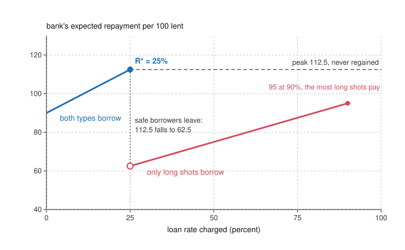

# Economics of Debt · Lesson 1.2: Credit rationing: Stiglitz-Weiss

> ⏱ ~15 min · Module 1: Why debt? Contracts under hidden information · Builds on: [1.1 Costly state verification](01-01-costly-state-verification.md), [`grad-micro` 5.1 Adverse selection](../../grad-micro/lessons/05-01-adverse-selection-lemons.md) · Unlocks: [1.3 Pledgeable income, collateral and monitors](01-03-pledgeable-income-collateral-and-monitors.md), [1.4 The price of a loan](01-04-the-price-of-a-loan.md), [2.3 Agency costs of debt and equity](02-03-agency-costs-of-debt-and-equity.md)

## Why this matters

When demand exceeds supply, the price is supposed to rise until the excess is gone. Lenders often do something else: they hold the rate and say no. Adam Smith saw why. Defending a legal maximum only a little above what the best borrowers pay, he warned that at 8 or 10 percent the money would go to "prodigals and projectors": "Sober people, who will give for the use of money no more than a part of what they are likely to make by the use of it, would not venture into the competition" (*Wealth of Nations*, 1776, II.4). Stiglitz and Weiss (1981, *AER*; SW from here on) showed that a bank that cannot tell borrowers apart may impose that limit on itself, with no law: when the rate changes who borrows or what they do with the money, the rate need not also clear the market. [`philosophy-of-debt` 2.3](../../philosophy-of-debt/lessons/02-03-justifying-interest.md) left this course the question of why a lender facing risky borrowers might refuse rather than charge more, and its [3.2](../../philosophy-of-debt/lessons/03-02-predatory-lending-and-usury-caps.md) weighed Smith's cap against Bentham's reply. This is the model both hand over.

## The idea

A bank lends 100 each to borrowers it cannot tell apart, and none has anything to pledge: a borrower whose project fails hands over what is left, here nothing. Eighty in every hundred have a safe project that returns 130 for sure. The other twenty have a long shot that returns 200 half the time and nothing otherwise. Anyone who does not borrow can earn 5 elsewhere.

At 25 percent interest everyone applies, and a safe borrower keeps 5, just enough. The bank collects 125 from every safe borrower and from half the long shots, so it averages $0.8\times125+0.2\times62.5=112.5$ per loan. At 26 percent a safe borrower would keep only 4, so she stays out. A long shot still wants the loan: if she succeeds she keeps 74, and if she fails she loses nothing. Now every applicant is a long shot, and the bank collects 63 per loan. One more point of interest cost the bank 44 percent of its take.

So a bank with more applicants than money stops at 25 percent and turns the rest away. The refused look exactly like those who got loans, and offering 26 percent does not help: only a long shot would pay it, so the offer marks the applicant as one.

The rate can also change what a single borrower does. A point of interest costs her only when she repays. A steady project repays almost always and bears nearly all of it; a gamble fails often and bears less. Raise the rate far enough and she switches to the gamble, and the bank's expected repayment falls again.

## The formal version

**Setup** (SW 1981). A borrower needs a loan $L$ for an indivisible project with random gross return $y\ge0$. She owes $RL$, where $R$ is the gross loan rate, and has [limited liability](../reference.md#limited-liability): in default the bank takes $y$ and nothing more. Everyone is risk-neutral, so the payoffs are

$$\begin{aligned}\text{borrower: }&\max(y-RL,\,0),\\ \text{bank: }&\min(y,\,RL).\end{aligned}$$

*In words:* the bank holds [standard debt](../reference.md#standard-debt-contract), the contract [1.1](01-01-costly-state-verification.md) derives; the borrower's claim is convex in $y$ and the bank's is concave.

She borrows only if her expected payoff is at least an outside income $w>0$, so a borrower sure to default stays out.

Types $\theta$ differ in risk: a higher $\theta$ is a [mean-preserving spread](../reference.md#mean-preserving-spread) of a lower one, the same mean with more weight in the tails ([`grad-micro` 2.5](../../grad-micro/lessons/02-05-choice-under-uncertainty.md)). The bank sees the mean but not $\theta$. By Jensen's inequality, a spread raises the expected value of a convex payoff and lowers that of a concave one.

**Adverse selection effect** (SW's Theorems 1–3):

1. At any $R$, the borrowers who apply are those with $\theta$ above a cutoff $\hat\theta(R)$.
2. The cutoff $\hat\theta(R)$ rises with $R$.
3. The bank's expected return on a loan falls with $\theta$.

*In words:* the riskiest find a loan most attractive, each rise in the rate drives out the safest remaining applicants, and those who stay repay least. This is the lemons logic of [`grad-micro` 5.1](../../grad-micro/lessons/05-01-adverse-selection-lemons.md), with the loan rate as the price that selects who trades.

**Incentive effect.** Now one borrower picks between projects, a hidden action as in [`grad-micro` 5.4](../../grad-micro/lessons/05-04-moral-hazard-principal-agent.md). For any project,

$$\frac{\partial}{\partial R}\,\mathbb{E}\big[\max(y-RL,\,0)\big]=-L\,\Pr(y\ge RL).$$

*In words:* a point of interest costs her in proportion to her chance of repaying. So if she is indifferent between two projects at some rate, a rise in the rate tips her to the one more likely to default (SW's Theorem 7). For projects $i=A,B$ that pay $Y_i$ with probability $p_i$ and nothing otherwise, with $p_A>p_B$, she is indifferent at the [switch rate](../reference.md#switch-rate) $\hat R$:

$$\hat R L=\frac{p_AY_A-p_BY_B}{p_A-p_B}.$$

*In words:* the steady project's extra expected output, divided by its extra chance of repaying, is the most she can owe before the gamble wins.

**The bank's return and rationing.** Let $\bar\rho(R)$ be the bank's expected repayment per unit lent, averaged over the applicants that $R$ attracts and the projects they choose. A higher $R$ raises what each repaid loan brings in but, through either effect, makes the book riskier. With discrete types, $\bar\rho$ drops each time a type leaves (Theorem 4), so it need not rise with $R$. The [bank-optimal rate](../reference.md#bank-optimal-rate) is

$$R^*=\arg\max_R\,\bar\rho(R).$$

Depositors supply funds $S(\bar\rho)$, rising in what the bank can pay them, so the supply of loans, $S(\bar\rho(R))$, is [backward-bending](../reference.md#backward-bending-loan-supply): it peaks at $R^*$, and a higher rate brings in less money, not more. If loan demand at an interior $R^*$ exceeds this supply, $D(R^*)>S(\bar\rho(R^*))$, the market settles at $R^*$ with the excess demand unmet (Theorem 5).

*In words:* a bank that raised its rate would earn less per loan, and one that cut it would have less to pay depositors, so the queue is never bid away. This is [credit rationing](../reference.md#credit-rationing) in SW's sense: among applicants who look identical, some get loans and some do not, and the refused could not get one by offering more. More deposits shorten the queue without moving $R^*$, so a change in the supply of funds moves the quantity of credit, not its price.

**The contrast: de Meza and Webb** (1987, *QJE*). Keep limited liability and hidden types, but let every project pay the same when it succeeds, differing only in how often it does, so better types first-order dominate worse ones. Now a higher rate drives out the least likely to succeed first, the pool improves with $R$, and the market clears. The pooled rate prices average risk, so the marginal borrower pays less than her own risk warrants and projects worth less than they cost get funded: [too much lending](../reference.md#de-meza-webb), not too little. De Meza and Webb show that raising the rate above its free-market level restores efficiency. *In words:* whether hidden risk starves or floods the market depends on its shape.

## Picture

Blue is the pooled book; red is the long shots alone. Squeezing the long shots as hard as they will bear, 90 percent, gets the bank 95: their mean of 100 less the 5 they could earn elsewhere, still below the peak. So 25 percent is the bank's best rate, and that is where it rations.

## Worked examples

**Example 1 (the idea's bank, with a queue).** Loans of 100; 80 percent safe (130 for sure), 20 percent long shots (200 with probability $\tfrac12$); outside income 5. A safe borrower applies while $130-100R\ge5$, that is $R\le1.25$, and a long shot while $0.5\,(200-100R)\ge5$, that is $R\le1.9$. So

$$\bar\rho(R)=\begin{cases}(0.8+0.2\times0.5)\,R=0.9R, & R\le1.25,\\ 0.5R, & 1.25<R\le1.9.\end{cases}$$

- $\bar\rho$ climbs to $0.9\times1.25=1.125$ at 25 percent, then drops to $0.5\times1.26=0.63$ at 26 percent.
- The long shots alone pay at most $0.5\times1.9=0.95$. So $R^*=1.25$ is the global maximum, with $\bar\rho^*=1.125$.
- Suppose savers deposit enough for 70 loans at a return of 12.5 percent. All 100 apply at $R^*$: 70 are funded and 30 refused, on average 24 safe and 6 long shots if the bank picks at random. A refused long shot would pay up to 90 percent and is still turned away.
- If deposits grow to cover 90 loans, the rate stays at 25 percent and only 10 are refused.

**Example 2 (the incentive effect).** One borrower of 100 can run a steady project paying 160 with probability 0.9 (mean 144) or a gamble paying 210 with probability 0.4 (mean 84). The switch rate is

$$\hat R L=\frac{144-84}{0.9-0.4}=120,$$

so $\hat R=1.2$. At 20 percent each project leaves her $0.9\times40=0.4\times90=36$. A point of interest costs her 0.9 of a point on the steady project and 0.4 on the gamble, so above 20 percent she gambles.

- At 20 percent the bank expects $0.9\times120=108$. Just above, she gambles and it expects $0.4\times120=48$, while her own expected payoff is still 36: the whole fall in expected output, from 144 to 84, comes out of the bank.
- However high the rate goes, the gamble pays the bank less than $0.4\times210=84$. So $R^*=1.2$: with more such borrowers than funds, those who offer more are refused.
- A pledge helps on this margin. If failure also costs her collateral $C$, each side of her indifference condition loses $(1-p_i)C$, and the switch repayment becomes $120+C$: each unit she stands to lose lets the bank charge one more before she gambles. [1.3](01-03-pledgeable-income-collateral-and-monitors.md) builds on this.

## Watch out

- **You might think rationed credit is expensive credit, but actually** the rate is held *below* what some of the refused would pay, and quantity does the allocating. SW's second kind of rationing refuses whole identifiable groups at any rate until funds grow; they call it red-lining.
- **You might think the drop alone makes a bank ration, but actually** its peak must also beat every higher rate. In Example 1 it does because long shots are worse on average (100 against 130). Give them the safe mean, 260 on success, and squeezing them pays the bank 125, above the peak. SW's Theorem 6 then allows loans at two rates, and the refused safe borrowers, who will not pay the higher one, are left out.
- **You might think collateral cures it, but actually** SW show collateral selects too. If the wealthy, who can pledge the most, are the least risk-averse (decreasing absolute risk aversion), they run riskier projects, so a higher collateral requirement leaves a riskier pool and the bank's return can fall with collateral as it does with the rate. When a menu of rates and pledges does sort borrowers is [1.3](01-03-pledgeable-income-collateral-and-monitors.md)'s question.
- **You might think SW explain why loans are debt, but actually** they take the debt contract as given. With same-mean types, an equity stake pays every type the same expected amount and selects nothing; de Meza and Webb show that under SW's assumptions equity, not debt, is the equilibrium form of finance. Debt's case rests on something like [1.1](01-01-costly-state-verification.md)'s verification cost.

## One-liner

> When a higher loan rate changes who borrows or what they do, the bank's return peaks before the market clears, so it holds the rate there and turns identical-looking borrowers away.

## Problems

**P1 (🟢) *(Formal (a)–(b) · Exegetical (c).)*** A bank lends 100 each to two kinds of borrower it cannot tell apart. Neither has anything to pledge, and anyone who does not borrow can earn 5 elsewhere. Ninety percent have a project that returns 125 for sure; ten percent have one that returns 300 with probability 0.3 and nothing otherwise. (a) Compute the bank's expected repayment per loan at interest rates of 10 percent and 30 percent. (b) Find the rate that maximizes it, and the maximum. (c) One usury law would cap the rate at 25 percent, another at 10 percent. In one sentence each, what does each cap change?

**P2 (🟡) *(Formal (a)–(c) · Exegetical (d).)*** An invented borrower needs 100, has nothing to pledge and earns nothing if she does not borrow. She can run a steady project that returns 180 for sure or a gamble that returns 250 with probability 0.5 and nothing otherwise; the bank cannot see which, and when she is indifferent she runs the steady project. (a) Find the switch rate. (b) Compute the bank's expected repayment at the switch rate and at 140 percent, saying which project she runs at each. Which rate does the bank prefer? (c) A usury law caps the rate at the switch rate. Compared with lending at 140 percent, find the change per loan in expected output, in her expected payoff and in the bank's expected repayment. (d) Who gains and who pays, and what changes before any loan is made if depositors supply less when they are paid less? Two sentences.

**P3 (🔴, optional) *(Exegetical (a) · Formal (b)–(c).)*** (a) Two invented loan markets. In market M, all projects have the same expected return but some are much riskier than others. In market N, every project pays 200 if it succeeds and nothing if it fails, but projects differ in how often they succeed. For each market, say which applicants leave first as the loan rate rises, and whether hidden types push lending below or above the efficient level. One sentence each. (b) In market N, each entrepreneur needs 100 and gives up an outside income of 25 to run her project. Half succeed with probability 0.9 and half with probability 0.6; lenders cannot tell which, compete, and break even at a zero safe rate. Find the pooled loan rate, check that both types borrow, and compute each type's project value net of the loan and the income forgone. (c) What range of borrowing rates would fund only the better type? Why can't competition among lenders get there on its own, and who pays for the worse type's loans at the pooled rate?

Solutions

**P1** *(Formal (a)–(b) · Exegetical (c).)*

(a) A safe borrower applies while $125-100R\ge5$, that is up to 20 percent. A long shot applies while $0.3\,(300-100R)\ge5$, that is while she owes at most $283.3$. At 10 percent both apply:

$$0.9\times110+0.1\times0.3\times110=99+3.3=102.3.$$

At 30 percent only long shots apply, and the bank expects $0.3\times130=39$.

(b) Up to 20 percent, $\bar\rho=(0.9+0.1\times0.3)\times100R=93R$, which peaks at $93\times1.2=111.6$. Above 20 percent the bank expects $0.3\times100R$, at most $0.3\times283.3=85$. So the best rate is 20 percent, with 111.6 per loan.

**Must hit, strict (c):**

- A 25 percent cap changes nothing: the bank already stops at 20 percent.
- A 10 percent cap binds. The bank's expected repayment falls from 111.6 to 102.3, and the 9.3 per loan goes to borrowers (a safe borrower keeps 15 instead of 5, a long shot expects 57 instead of 54). Nobody changes whether to apply, so output per loan is unchanged.
- Depositors now earn 2.3 percent instead of 11.6, so if they supply less, fewer loans are made and more applicants are refused.

**Wrong turns:** keeping the safe borrowers in the pool at 30 percent, which gives $0.9\times125+0.1\times0.3\times130=116.4$ and makes 30 percent look better than 20 (at 30 percent a safe borrower would keep nothing, less than her 5 outside). Treating the 10 percent cap as making the pool safer: below 20 percent the rate changes no one's decision.

**Model answer (c):** A 25 percent cap never binds, because the bank already stops at 20 percent. A 10 percent cap moves 9.3 per loan from the bank to borrowers without changing who applies, and if depositors, now paid 2.3 percent instead of 11.6, lend less, more applicants are refused.

---

**P2** *(Formal (a)–(c) · Exegetical (d).)*

(a) The steady project always repays, so she is indifferent where

$$180-RL=0.5\,(250-RL)\iff 0.5\,RL=55\iff RL=110.$$

The switch rate is 10 percent, where each project leaves her 70.

(b) At 10 percent she runs the steady project and the bank collects 110 for sure. At 140 percent she owes 240, more than the steady project returns: it would leave her nothing, while the gamble leaves her $0.5\times(250-240)=5$. So she gambles, and the bank expects $0.5\times240=120$. The bank prefers 140 percent, and its take keeps rising toward $0.5\times250=125$ as the rate nears 150 percent. This is the case in which the bank's best rate lies above the switch rate and the gamble gets financed.

(c) Per loan, against lending at 140 percent:

- expected output: $180-0.5\times250=180-125=+55$;
- her expected payoff: $70-5=+65$;
- the bank's expected repayment: $110-120=-10$.

Check: $65-10=55$.

**Must hit, strict (d):**

- She gains 65: the 55 of output the cap saves, plus 10 taken from the bank, which falls on its depositors, whose return drops from 20 percent to 10.
- Before any loan is made, depositors who are paid less supply less, so fewer loans are made: the cap trades more output per loan for more rationing.

**Wrong turns:** in (b), keeping her on the steady project at 140 percent. It would default for sure and leave her nothing, so she gambles, and that switch is the incentive effect itself. In (c), counting her payoff at 140 percent as zero instead of 5.

**Model answer (d):** The borrower gains 65 per loan, the 55 of output the cap saves plus 10 taken from the bank and so from depositors, who now earn 10 percent instead of 20. Before any loan is made, depositors paid less supply less, so the cap buys more output per loan at the price of more refused borrowers. Stiglitz and Weiss make the output point themselves: in this case a usury law at the switch rate raises output.

---

**P3** *(Exegetical (a) · Formal (b)–(c).)*

**Must hit, strict (a):**

- Market M is Stiglitz-Weiss (mean-preserving spreads): the safest leave first, the pool worsens as the rate rises, and lenders may stop short and ration, so hidden types push lending below the efficient level.
- Market N is de Meza-Webb (same success payoff, first-order dominance): the least likely to succeed leave first, the pool improves, and the market clears at a pooled rate that subsidizes the marginal borrower, so hidden types push lending above the efficient level.

(b) The average chance of success is $0.75$, so lenders need $100/0.75=133.3$ back: a pooled rate of 33.3 percent. A better borrower expects $0.9\times(200-133.3)=60\ge25$ and a worse one $0.6\times(200-133.3)=40\ge25$, so both borrow. Net values:

$$\begin{aligned}\text{better: }&0.9\times200-100-25=55,\\ \text{worse: }&0.6\times200-100-25=-5.\end{aligned}$$

The worse project is funded although it destroys 5.

(c) A worse borrower borrows only while $0.6\,(200-RL)\ge25$, that is $RL\le158.3$; a better one while $RL\le172.2$. A borrowing rate between 58.3 and 72.2 percent funds only the better type. Competition cannot hold it there: lenders serving only better types would break even at 11.1 percent, and at any rate below 58.3 percent the worse types return, so rivals undercut down to the pooled 33.3 percent. The rate has to be pushed above its free-market level from outside, for instance by a tax on loans; that doing so restores efficiency is de Meza and Webb's result. At 33.3 percent the better borrowers pay for the worse: a better borrower's fair rate is 11.1 percent, so she overpays $0.9\times(133.3-111.1)=20$ in expectation, exactly what a worse borrower saves, $0.6\times(166.7-133.3)=20$.

**Wrong turns:** in (a), reversing market N, as if the likeliest to fail stayed longest (they leave first, because they gain least from a success they rarely reach). In (b), comparing the worse type's payoff with zero instead of 25. In (c), proposing a lower rate to screen out the worse type.

## Connections

- **Backward:** [1.1](01-01-costly-state-verification.md) derived the debt contract whose payoff shapes drive this lesson, and its revenue ceiling refused a project with no hidden type at all. The lemons logic is [`grad-micro` 5.1](../../grad-micro/lessons/05-01-adverse-selection-lemons.md), the hidden choice of project is [5.4](../../grad-micro/lessons/05-04-moral-hazard-principal-agent.md)'s moral hazard, and mean-preserving spreads are [2.5](../../grad-micro/lessons/02-05-choice-under-uncertainty.md)'s.
- **Forward:** [1.3](01-03-pledgeable-income-collateral-and-monitors.md) asks who escapes the pool: borrowers with net worth, or with a pledge that sorts them. [1.4](01-04-the-price-of-a-loan.md) prices a loan with the default probability held fixed and asks what a ceiling does; P2 is Stiglitz and Weiss's own case for one. [2.3](02-03-agency-costs-of-debt-and-equity.md) is the incentive effect inside a levered firm. SW drew a macro lesson: under rationing, monetary policy works through the availability of credit rather than its price; [3.3](03-03-the-financial-accelerator.md)'s financial accelerator is the route by which borrowers' net worth carries credit conditions into the whole economy. Whether private borrowing can be too high for a whole economy, the question de Meza and Webb raise for one market, is [4.4](04-04-overborrowing.md)'s.
- **Sideways (the debt thread):** Sirach observes that "Many have refused to lend, not out of wickedness, but they were afraid to be defrauded without cause" (Ecclesiasticus 29:10, Douay-Rheims; read in [`theology-of-debt` 1.1](../../theology-of-debt/lessons/01-01-lending-in-the-covenant.md)). A lender who may take no increase has no rate to raise, so refusal is the only margin left, [1.4](01-04-the-price-of-a-loan.md)'s ceiling of zero; Stiglitz and Weiss add that a lender free to charge may refuse anyway. The first position in [`history-of-debt` 1.2](../../history-of-debt/lessons/01-02-debt-bondage-and-the-royal-clean-slate.md)'s P3, that the risk of a royal cancellation made lenders refuse cultivators rather than charge more, is a rationing claim, and this lesson says when refusal beats repricing: when a higher rate would change who borrows or what they do.
