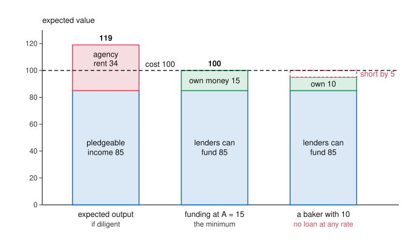

# Economics of Debt · Lesson 1.3: Pledgeable income, collateral and monitors

> ⏱ ~15 min · Module 1: Why debt? Contracts under hidden information · Builds on: [1.1 Costly state verification](01-01-costly-state-verification.md), [1.2 Credit rationing: Stiglitz-Weiss](01-02-credit-rationing-stiglitz-weiss.md) · Unlocks: [1.4 The price of a loan](01-04-the-price-of-a-loan.md), [3.3 The financial accelerator](03-03-the-financial-accelerator.md)

## Why this matters

[1.1](01-01-costly-state-verification.md) explained why outside finance takes the form of debt, and [1.2](01-02-credit-rationing-stiglitz-weiss.md) why a bank may turn a borrower away rather than raise her rate. This lesson asks who gets the loan. The answer is the borrower with money of her own, something to pledge, or someone watching her. That explains why good projects of poor entrepreneurs go unfunded, why a firm's net worth drives investment in Module 3, and why banks exist. It also answers two questions [`history-of-debt`](../../history-of-debt/syllabus.md) hands over: what a poor debtor could borrow against once Athens and Rome took his body off the table, and why pawn lenders insisted on pledges.

## The idea

A baker wants an oven that costs 100. If she works hard, it pays 140 with probability 0.85 and nothing otherwise. If she coasts, the chance falls to 0.55, but coasting is worth 12 to her in comfort. Hard work is plainly better for the project: an expected 119 against 77.

Lenders cannot watch her, so her share of the output must make hard work pay for itself. Working hard raises her chance of collecting that share by 0.30, and this must be worth the 12 she gives up. So she must keep at least 12/0.30 = 40 whenever the oven succeeds. That leaves at most 100 per success for lenders, worth 0.85 × 100 = 85 in expectation. The oven costs 100, so she must put in 15 of her own.

A baker with only 10 gets no loan at any interest rate, although the oven is worth 19 more than it costs. A higher rate would cut into her 40; she would coast, and lenders would expect less, not more. Lenders can be promised only the part of the output that does not have to be left with the borrower.

Three things close the gap: her own money, a pledge she loses if she fails, and a monitor who makes coasting harder. And one fact limits every contract: a lender can take the oven but not the baker.

## The formal version

**Holmström-Tirole, fixed investment** (Holmström and Tirole 1997, *QJE*; the textbook version is Tirole, *The Theory of Corporate Finance*, 2006, ch. 3). An entrepreneur has net worth $A$ and a project costing $I>A$ that returns $R$ on success and $0$ on failure. Her effort is hidden action as in [`grad-micro` 5.4](../../grad-micro/lessons/05-04-moral-hazard-principal-agent.md), but everyone is risk-neutral. Diligence gives success probability $p_H$; shirking gives $p_L=p_H-\Delta p$ plus a private benefit $B>0$. Lenders are competitive, the safe rate is $0$, and she has [limited liability](../reference.md#limited-liability): she can lose what she puts in but owes nothing beyond the project's return. A contract pays her $R_b$ on success and lenders $R-R_b$, which is a debt with face value $R-R_b$. Assume the project is worth doing only with diligence: $p_HR-I>0>p_LR+B-I$.

Diligence is incentive compatible if

$$p_H R_b \;\ge\; p_L R_b + B \quad\iff\quad R_b \;\ge\; \frac{B}{\Delta p}.$$

*In words:* her success share, times the extra success probability that diligence buys, must cover what shirking is worth to her.

So the most lenders can be promised is the [pledgeable income](../reference.md#pledgeable-income)

$$\mathcal{P} \;=\; p_H\Big(R-\frac{B}{\Delta p}\Big).$$

*In words:* expected output minus the [minimum incentive stake](../reference.md#minimum-incentive-stake) she must keep; the withheld part, $p_HB/\Delta p$, is her agency rent.

Lenders break even if $p_H(R-R_b)\ge I-A$. Together with the incentive constraint, the project is funded if and only if

$$A \;\ge\; \bar A \;\equiv\; I-p_H\Big(R-\frac{B}{\Delta p}\Big).$$

*In words:* her [own money](../reference.md#minimum-net-worth) must cover the gap between the cost and the pledgeable income.

Nothing stops $\bar A>0$ while $p_HR>I$, so entrepreneurs with $A<\bar A$ are [rationed](../reference.md#credit-rationing) with a good project in hand, and no rate helps. This is a cousin of 1.2's incentive effect that needs no adverse selection: a higher rate changes what the borrower does. It also makes $A$ a state variable. A loss that lowers net worth cuts investment though no project has changed, and in Holmström and Tirole's model any tightening of capital, a credit crunch or a collateral squeeze, falls hardest on the firms with the least of it.

**Raising pledgeable income.** Anything that makes failure costlier to her, or shirking less tempting, lowers $\bar A$. Collateral forfeited on failure does the first, and the lender also collects what the asset fetches. A monitor who cuts $B$ does the second.

**Walking away** (Hart and Moore 1994, *QJE*). Human capital is [inalienable](../reference.md#inalienable-human-capital): she cannot commit not to withdraw her skills, and the returns need them. If she leaves, the lender's fallback is to seize and sell the assets for their liquidation value $L$. So once the money is sunk she can threaten to leave, and any debt above $L$ is renegotiated down. In the stark case where she makes the renegotiation offer,

$$\text{debt capacity} \;=\; L.$$

*In words:* a lender can take the oven but not the baker, so what she can credibly owe rests on what the assets are worth without her. [`philosophy-of-debt` 3.3](../../philosophy-of-debt/lessons/03-03-what-may-be-pledged.md) cites this as the empirical claim beside its own normative one: whether the law should let a lender try.

**Collateral as a screen** (Bester 1985, *AER*). Now bring back 1.2's hidden types. A contract is a pair $(R,C)$ per unit lent: repay $R$ on success and forfeit [collateral](../reference.md#collateral) $C$ on failure, of which the lender realizes $\delta C$, with $0\le\delta\le1$. A borrower who succeeds with probability $p_i$ bears expected cost $p_iR+(1-p_i)C$, so along her indifference curve

$$\frac{dR}{dC} \;=\; -\frac{1-p_i}{p_i}.$$

*In words:* collateral is cheap for a borrower who expects to repay, so the safe type asks a smaller rate cut per unit pledged. That is single crossing ([`grad-micro` 5.3](../../grad-micro/lessons/05-03-screening.md)), and it lets a bank offer a menu. The risky type gets its full-information contract with no collateral; the safe type gets the least-collateral contract on its zero-profit line that the risky type does not prefer. Bester showed that in this separating equilibrium no one is rationed.

**Monitors** (Diamond 1984, *RES*). Monitoring a borrower costs $K$. If $m$ small savers fund her and each monitors, the total is $mK$; if each waits for another, no one does. A bank monitors once, for $K$, but depositors cannot see the bank's loans either. Its deposits are debt, and the expected deadweight cost when it falls short, per loan, is its [delegation cost](../reference.md#delegated-monitoring) $\phi_N$ when it holds $N$ loans. Banking wins when

$$K+\phi_N \;<\; mK.$$

*In words:* one monitor plus the cost of watching the watcher beats everyone watching. With independent loans, $\phi_N\to0$ as $N$ grows. An illustration: $K=0.02$ per unit lent and $m=20$, so direct monitoring costs $0.40$. Each loan repays $1.2$ with probability $0.9$, else nothing; the bank owes depositors $1$ per loan, and each unit of shortfall is lost (a stylized version of Diamond's penalty). Then $\phi_N$ is $0.10$ for one loan, $0.021$ for ten and $0.0003$ for a hundred, so the bank's cost falls from $0.12$ to about $0.020$.

## Picture

The dashed line is the oven's cost. The first bar clears it by 19, so the project is worth doing, but only its blue part can be promised to lenders. Own money must fill the rest, and a baker who cannot fill it is refused at every rate.

## Worked examples

**Example 1 (the baker's loan).** From the idea: $I=100$, $R=140$, $p_H=0.85$, $p_L=0.55$, $B=12$, so $\Delta p=0.30$, $B/\Delta p=40$, $\mathcal{P}=0.85\times100=85$ and $\bar A=15$.

- *Net worth 32.* She borrows 68. Lenders break even at $0.85D=68$, so the face value is $D=80$: interest of $80/68-1\approx17.6\%$, which is just $1/p_H-1$. She keeps $140-80=60\ge40$, so she stays diligent, and her expected gain is $0.85\times60-32=19$, the whole NPV.
- *Net worth 15.* $D=85/0.85=100$, and she keeps exactly 40: the incentive constraint binds.
- *Net worth 10.* Lenders need 90. With diligence the face value would be $90/0.85\approx105.9$, leaving her $34.1<40$, so she coasts and lenders expect $0.55\times105.9\approx58.2$. Claiming all 140 gets them only $0.55\times140=77$. She is rationed at every rate.

Every funded baker pays the same 17.6%, and the rest get nothing: credit adjusts through quantity, not price. If a bad year cuts the first baker's savings from 32 to 10, she drops from funded to rationed while the oven's NPV stays at 19. Across many firms, a fall in net worth becomes a fall in investment ([3.3](03-03-the-financial-accelerator.md)).

**Example 2 (a bank that sorts instead of rationing).** A bank lends 100 at a zero safe rate to safe borrowers ($p_s=0.85$) and risky ones ($p_r=0.75$) that it cannot tell apart. It realizes half of any collateral it seizes ($\delta=0.5$). A 50/50 pool without collateral would have to repay $100/0.8=125$, well above the safe type's full-information $100/0.85\approx117.6$: the cross-subsidy that, in 1.2, makes safe borrowers the first to leave.

The menu: the risky type repays $100/0.75\approx133.3$ with no collateral, and the bank breaks even. For the safe type, solve the bank's zero-profit condition together with the risky type's indifference:

$$\begin{aligned} 0.85R_s+0.15\times0.5\,C_s &= 100 \\ 0.75R_s+0.25\,C_s &= 100 \end{aligned}$$

which gives $C_s=64$ and $R_s=112$. Check both incentive constraints with expected costs $p_iR+(1-p_i)C$:

- *Risky:* own contract $0.75\times133.3=100$; safe contract $0.75\times112+0.25\times64=84+16=100$. Indifferent, so this constraint binds (ties go to the contract meant for her).
- *Safe:* own contract $0.85\times112+0.15\times64=95.2+9.6=104.8$; risky contract $0.85\times133.3\approx113.3$. She strictly prefers her own.

The safe type pays 12% and posts a pledge instead of paying 33.3%, and no one is refused. The cost of separating is the collateral destroyed in default, $0.5\times0.15\times64=4.8$ per loan, and the safe type bears all of it. That beats the $0.85\times125-100=6.25$ she would overpay in the pool. With fewer risky borrowers the pool would be cheaper for her, and whether a competitive market then settles on the menu is the Rothschild-Stiglitz existence problem of [`grad-micro` 5.3](../../grad-micro/lessons/05-03-screening.md).

## Watch out

- **You might think the minimum stake is a risk premium,** as in [`grad-micro` 5.4](../../grad-micro/lessons/05-04-moral-hazard-principal-agent.md). Everyone here is risk-neutral. The stake is a rent created by limited liability: she cannot be fined after failure, so she must be rewarded after success, and competition among lenders cannot bid it away.
- **You might think collateral always signals safety.** In Bester the safe type pledges more. In Holmström-Tirole, pledges fill the gap for any borrower short of pledgeable income, so it is the weaker borrowers who are asked to pledge. The two roles predict opposite correlations between collateral and risk, and which dominates is an empirical question.
- **You might think a big bank is safe because it is big.** $\phi_N$ falls only because loans fail independently. If every borrower shares one shock (one valley's harvest, one city's house prices), the loans rise and fall together and $\phi_N$ stays at its one-loan value, $0.10$ in the illustration, however many loans the bank holds.
- **You might think diversification makes any shortfall less likely.** In the illustration the chance of some shortfall *rises*, from 10% with one loan to 26% with ten. What falls is the expected shortfall, because shortfalls get small, and that is what $\phi_N$ measures.

## One-liner

> Lenders can be promised only what need not be left with the borrower to keep her working; own money, pledges and monitors close the gap, and her skills, which can walk away, close none of it.

## Problems

**P1 (🟢) *(Formal.)*** A project costs 50 and returns 80 on success, 0 on failure. It succeeds with probability 0.75 if the entrepreneur is diligent and 0.5 if she shirks, and shirking gives her a private benefit of 5. Lenders are competitive and risk-neutral, and the safe rate is 0. (a) Find the minimum net worth $\bar A$. (b) An entrepreneur with net worth 8 is funded by a debt repaid on success. Find its face value and interest rate, and check that she stays diligent. (c) Show that an entrepreneur with net worth 3 cannot be funded at any face value.

**P2 (🟡) *(Formal (a) · Exegetical (b).)*** An invented pawnbroker lends 100 at a zero safe rate to two kinds of borrowers he cannot tell apart. Each borrower's project pays 250 on success and nothing on failure; safe borrowers succeed with probability 0.8, risky ones with probability 0.5. He offers two contracts. A: repay 200, no pledge. B: repay 125 and pledge a family heirloom worth 75 to the borrower and nothing to him. A borrower indifferent between the two takes the one meant for her type. (a) Compute each type's expected payoff under each contract, say which contract each type takes, and find the pawnbroker's expected profit on each contract as chosen. What does the arrangement cost, and who bears it? (b) Suppose a safe borrower's most precious possession is worth only 60 to her, and contract B asks for that instead. Which types now prefer B, and what does the pawnbroker earn on a risky borrower who takes it? In two sentences, say what this implies about who can use a pledge to escape 1.2's pooled rate.

**P3 (🔴, optional) *(Formal (a) · Exegetical (b).)*** Take P1's project and the entrepreneur with net worth 3. Before Solon, an Athenian debtor could pledge his person: on failure the creditor could impose bondage, which costs the debtor $\Pi$ and, to keep things simple, yields the creditor nothing. (a) Rewrite the incentive constraint with $\Pi$. Find the smallest $\Pi$ at which she is funded, and her expected payoff net of her own 3. (b) Solon's ban sets $\Pi=0$. In this model, who pays for the ban, who is unaffected, and what changes before anyone borrows? Two sentences. Whether the ban is just is [`philosophy-of-debt` 3.3](../../philosophy-of-debt/lessons/03-03-what-may-be-pledged.md)'s question, not this one.

Solutions

**P1** *(Formal.)*

(a) $\Delta p=0.25$, so the minimum stake is $B/\Delta p=5/0.25=20$. Pledgeable income is $0.75\times(80-20)=45$, so $\bar A=50-45=5$. The project is worth doing only with diligence: $0.75\times80-50=10>0>0.5\times80+5-50=-5$.

(b) She borrows $50-8=42$. Lenders break even at $0.75D=42$, so $D=56$, an interest rate of $56/42-1\approx33.3\%$ (that is, $1/0.75-1$). She keeps $80-56=24\ge20$, so she stays diligent. Her expected gain is $0.75\times24-8=10$, the whole NPV.

(c) She needs 47. With diligence, lenders can be promised at most the pledgeable income, 45. The face value that would return 47 under diligence is $47/0.75\approx62.67$, which leaves her $17.33<20$, so she shirks and lenders expect $0.5\times62.67\approx31.33$. Even claiming all 80 yields $0.5\times80=40<47$. No face value works.

**Wrong turns:** computing pledgeable income as $p_HR-B=55$, which forgets that the stake is $B$ scaled up by $1/\Delta p$; answering (c) by raising the face value until $0.75D=47$ without rechecking the incentive constraint.

---

**P2** *(Formal (a) · Exegetical (b).)*

(a) Type $i$'s payoff at $(R,C)$ is $p_i(250-R)-(1-p_i)C$.

| | A: repay 200, no pledge | B: repay 125, heirloom 75 |
|---|---|---|
| Risky (0.5) | $0.5\times50=25$ | $0.5\times125-0.5\times75=25$ |
| Safe (0.8) | $0.8\times50=40$ | $0.8\times125-0.2\times75=85$ |

The risky type is indifferent and takes A; the safe type takes B by a wide margin. Profit on A from risky borrowers: $0.5\times200-100=0$. Profit on B from safe borrowers: $0.8\times125-100=0$, since the heirloom is worth nothing to him. The cost is the heirloom lost in default, $0.2\times75=15$ per safe loan: a pure deadweight loss, borne entirely by the safe type.

**Must hit, strict (b):**

- With a pledge worth 60, the risky type gets $0.5\times125-0.5\times60=32.5>25$ from B, so both types prefer B (the safe type gets $0.8\times125-0.2\times60=88$).
- The pawnbroker earns $0.5\times125-100=-37.5$ on each risky borrower who takes B, so he cannot keep offering B at 125: the screen fails.
- A pledge sorts only if losing it hurts enough (at least 75 here). Safe borrowers with too little to pledge are pooled with the risky and overpay, or are rationed as in 1.2.

**Wrong turns:** counting the heirloom at 75 in the pawnbroker's profit (it is worth nothing to him, which is why it is a pure cost); concluding that a pledge that fetches nothing is useless, when its job is to sort. It works as a hostage in [`philosophy-of-debt` 3.3](../../philosophy-of-debt/lessons/03-03-what-may-be-pledged.md)'s sense.

**Model answer (b):** At 60 the risky type would take B too (32.5 against 25), and each risky borrower on B costs the pawnbroker 37.5, so the cheap contract cannot survive. Only a borrower with something she would hate to lose, worth at least 75 here, can prove she is safe; the rest are back in 1.2's pool.

---

**P3** *(Formal (a) · Exegetical (b).)*

(a) Diligence pays $p_HR_b-(1-p_H)\Pi$ and shirking pays $p_LR_b-(1-p_L)\Pi+B$. The difference is $\Delta p\,(R_b+\Pi)-B$, so

$$\Delta p\,(R_b+\Pi)\;\ge\;B \quad\iff\quad R_b\;\ge\;\frac{B}{\Delta p}-\Pi=20-\Pi.$$

The penalty lets her keep less on success. Pledgeable income becomes $0.75\times(80-20+\Pi)=45+0.75\,\Pi$, and funding needs $45+0.75\,\Pi\ge47$, so $\Pi\ge8/3\approx2.67$. At that penalty the face value is $47/0.75\approx62.67$, she keeps $17.33$, and $17.33+2.67=20$: the constraint binds. Her expected payoff is $0.75\times17.33-0.25\times2.67-3\approx13-0.67-3=9.33$, which is the NPV of 10 less the expected deadweight penalty of $0.67$. She would accept the pledge.

**Must hit, strict (b):**

- **Who pays:** would-be borrowers with net worth below $\bar A=5$, who lose access to credit (she loses 9.33 in expected value).
- **Unaffected:** borrowers with net worth of 5 or more, who never needed the pledge, and competitive lenders, who earn zero either way.
- **Before anyone borrows:** lending to the poorest stops, and no borrower is ever bound. Accept a note that any gain from the ban lies outside this model.

**Wrong turns:** counting the ban as a gain for the poor borrower inside the model (she takes the pledge voluntarily, and the ban erases her 9.33); treating the penalty as something the creditor collects, when it works only through the incentive constraint; ruling on whether the ban is just.

**Model answer (b):** In this model the ban's whole cost falls on would-be borrowers with net worth below 5, who lose the 9.33 the loan was worth to them, while richer borrowers and zero-profit lenders are unaffected. Before anyone borrows, lending to the poorest stops; whatever gain the ban brings (from misjudged risks, penalties harsher than needed, or bondage's cost to the city) lies outside the model.

## Flashback

**From Lesson [1.1](01-01-costly-state-verification.md) (Costly state verification: debt as the optimal contract):** *(Formal.)* A glassblower's furnace upgrade returns $y$ uniform on $[40, 220]$ (so $\mathbb{E}[y]=130$); only she observes it, and verifying her books costs 18. Under the standard debt contract the lender is paid the face value $D$ whenever no check is needed, and when a check is needed he collects the average return below $D$ less the 18. Suppose the contract ends up verifying her books 20 percent of the time. Find the face value $D$, and the largest investment $I$ the lender would extend at that $D$.

Solution

Verification happens iff $y<D$, so $\Pr(y<D)=0.2$ pins down $D-40=0.2\times180=36$, giving $D=76$.

Below $D$, the average return is $(40+76)/2=58$, so the lender's expected revenue is

$$L(D) = 0.8\times76 + 0.2\times(58-18) = 60.8+8 = 68.8.$$

Since the lender breaks even by construction, this is the largest investment he would extend: $I=68.8$.

**Wrong turns:** computing $L(D)$ as $E[\min(y,D)]=0.8\times76+0.2\times58=72.4$ and forgetting the audit cost entirely; subtracting the full 18 instead of its 20 percent expectation ($72.4-18=54.4$), which prices verification as certain rather than a one-in-five event.

## Connections

- **Backward:** [1.1](01-01-costly-state-verification.md)'s verification cost is what Diamond's monitor pays once instead of $m$ times, and the bank's shortfall penalty is 1.1's deadweight cost of default one level up. [1.2](01-02-credit-rationing-stiglitz-weiss.md) rationed through adverse selection and the incentive effect. Holmström-Tirole keeps only an incentive effect, and Bester's menu is 1.2's way out for borrowers with something to pledge. The constraints are [`grad-micro` 5.3](../../grad-micro/lessons/05-03-screening.md)'s screening and [5.4](../../grad-micro/lessons/05-04-moral-hazard-principal-agent.md)'s hidden action.
- **Forward:** [1.4](01-04-the-price-of-a-loan.md) prices a loan with a recovery rate, which is collateral's value to the lender. [3.1](03-01-diamond-dybvig.md) turns to the other side of the bank's balance sheet, its demandable deposits. [3.3](03-03-the-financial-accelerator.md) makes net worth set the cost of outside finance, and [3.4](03-04-kiyotaki-moore-collateral-cycles.md) turns Hart and Moore's liquidation value into a market price that moves with credit.
- **Sideways (the debt thread):** Solon's ban on loans secured on the person and the *Lex Poetelia Papiria*'s "goods, not person" ([`history-of-debt` 1.4](../../history-of-debt/lessons/01-04-solons-shaking-off-of-burdens.md), [1.5](../../history-of-debt/lessons/01-05-nexum-and-the-roman-plebs.md)) remove P3's penalty, so credit had to rest on land and goods. The Roman creditor's case in 1.5, that a poor debtor has nothing to seize but himself and that a fearsome default protects good faith, is P3's incentive channel in a jurist's words. The *monte* that lent only a share of a pledge's value ([2.2](../../history-of-debt/lessons/02-02-jewish-lenders-and-the-monti-di-pieta.md)) was taking a haircut on a pledge worth less to the lender than to the borrower, $\delta<1$. [`philosophy-of-debt` 3.3](../../philosophy-of-debt/lessons/03-03-what-may-be-pledged.md) sorts pledges into value and hostage collateral and asks what may be pledged at all. P3's penalty is also the debtors' prison of [`history-of-debt` 4.2](../../history-of-debt/lessons/04-02-debtors-prisons-and-the-invention-of-bankruptcy.md), seen as an incentive device.
