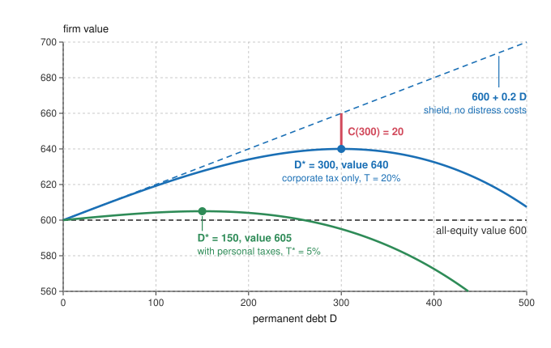

# Economics of Debt · Lesson 2.2: Taxes and bankruptcy costs: the trade-off theory

> ⏱ ~15 min · Module 2: Capital structure and debt overhang · Builds on: [2.1 Modigliani-Miller](02-01-modigliani-miller.md), [1.1 Costly state verification](01-01-costly-state-verification.md) · Unlocks: [2.3 Agency costs of debt and equity](02-03-agency-costs-of-debt-and-equity.md), [2.4 Debt overhang](02-04-debt-overhang.md)

## Why this matters

[Modigliani-Miller](../reference.md#modigliani-miller) ([2.1](02-01-modigliani-miller.md)) says financing cannot change a firm's value, yet firms, bankers and regulators argue about leverage constantly. Two simple reasons each break one of its assumptions. Tax codes generally let a firm deduct interest but not dividends, so the Treasury subsidizes debt. And a firm that cannot pay its debts loses value to lawyers, departing customers and forced sales. The **trade-off theory** borrows until these balance at the margin. Its rival, the **pecking order**, says that what managers know and investors don't drives financing instead. The subsidy is part of why equity is privately expensive for a bank ([3.2](03-02-stopping-runs.md)), and distress costs are what bankruptcy procedure tries to contain ([7.3](07-03-designing-bankruptcy.md)).

## The idea

A firm earns 90 a year before interest and taxes, forever, and pays a 20 percent corporate tax. All numbers here are illustrative.

- **All equity:** the government takes 18 and shareholders get 72.
- **Borrow 300 at 6 percent** and buy back shares. Interest is 18, taxable profit falls to 72, tax to 14.4, and shareholders get 57.6. Bondholders get 18, so investors in total get 75.6.

The business is unchanged, yet investors collect 3.6 more every year, because the government collects 3.6 less. That is the **interest tax shield**: 20 percent of the 18 of interest. It is as safe as the debt, so discount it at 6 percent: $3.6/0.06 = 60$, which is 20 percent of the 300 borrowed.

If that were all, the firm would borrow until its whole profit went out as interest. But a firm that cannot pay loses value: legal and advisers' fees, customers who stop buying from a supplier that may vanish, suppliers who want cash up front, assets sold at fire-sale prices, managers busy with creditors. The more it borrows, the likelier all that becomes. So value first rises with debt and then falls, and the trade-off theory puts the firm at the top of the hump.

Who gains and who pays? The shield is a transfer from the Treasury to investors. Distress costs are a pure loss, which creditors who see them coming charge for when they lend, so shareholders bear them from the start.

## The formal version

**Setup.** A firm earns expected operating income $X$ per year forever, before interest and taxes. The corporate tax rate is $T_c$, and $r_U$ is the return investors require on the all-equity firm, whose value is

$$V_U = \frac{(1-T_c)X}{r_U}.$$

With $X=90$, $T_c=20\%$ and $r_U=12\%$, $V_U = 72/0.12 = 600$.

**The tax shield.** The firm issues permanent riskless debt $D$ at rate $r_D$ and buys back shares. Each year investors as a group receive

$$(X - r_D D)(1-T_c) + r_D D = (1-T_c)X + T_c\, r_D D.$$

The first stream is the unlevered firm's, worth $V_U$. The second is as safe as the debt, so discount it at $r_D$: it is worth $T_c r_D D / r_D = T_c D$. The levered firm is worth

$$V_L = V_U + T_c D.$$

*In words:* debt raises investors' value by the tax rate times the debt, because the government's claim shrinks by that much. This is the [interest tax shield](../reference.md#interest-tax-shield) of Modigliani and Miller's 1963 correction (*AER*). The formula needs the debt to be permanent and riskless and the firm to have taxable profit to deduct against every year; relax either and the shield is worth less. A 10-year loan at 6 percent, repaid and not replaced, shields only $1-1.06^{-10} = 44\%$ of $T_c D$.

**Personal taxes.** Let $T_D$ be investors' tax rate on interest income and $T_E$ their rate on equity income (dividends and capital gains). After every tax, shareholders get $(X - r_D D)(1-T_c)(1-T_E)$ and bondholders get $r_D D(1-T_D)$. The sum is

$$X(1-T_c)(1-T_E) + r_D D\,(1-T_D)\,T^*, \qquad T^* = 1 - \frac{(1-T_c)(1-T_E)}{1-T_D}.$$

The first term is the unlevered firm's stream. The second is $T^*$ times what bondholders keep after tax, a stream they paid $D$ for. So $V_L = V_U + T^* D$.

*In words:* a dollar paid out as interest is taxed once, at $T_D$; a dollar paid to shareholders is taxed twice, at $T_c$ and then $T_E$. [Miller's net advantage](../reference.md#miller-net-tax-advantage) $T^*$ compares the two. If $T_E = T_D$ it is $T_c$ again; if $(1-T_c)(1-T_E) = 1-T_D$ it is zero. Miller's "Debt and Taxes" (1977, *JF*) argued that when equity income is lightly taxed and investors' rates on interest differ, firms issue debt until the personal tax of the marginal bondholder just offsets the corporate saving. That fixes how much debt the economy holds but leaves each firm's choice irrelevant.

**Distress costs.** Let $C(D)$ be the present value of expected [costs of financial distress](../reference.md#costs-of-financial-distress): probability times cost, both rising with debt; take $C$ increasing and convex. Direct costs are legal and administrative. For 11 railroads in bankruptcy between 1933 and 1955, Warner (1977, *JF*) put them at about 5 percent of market value just before the filing and about 1 percent seven years earlier. Indirect costs appear larger. Andrade and Kaplan (1998, *JF*) separated financial from economic distress by studying 31 highly leveraged transactions of the 1980s that became distressed while their operations stayed profitable. Their preferred estimate of the cost, direct and indirect, is about 10 percent of firm value, incurred mostly before any Chapter 11 filing, through cut investment, asset sales at depressed prices and troubles with customers and suppliers.

**The trade-off.** With tax advantage $T$ ($T_c$, or $T^*$ with personal taxes),

$$V_L(D) = V_U + T D - C(D), \qquad \text{maximized at } D^* \text{ where } T = C'(D^*).$$

*In words:* borrow until the last unit of debt saves exactly as much tax as it adds in expected distress costs. That is the [trade-off theory](../reference.md#trade-off-theory).

**The rival.** Myers and Majluf (1984, *JFE*) drop taxes and distress and give managers information investors lack. A firm with assets in place worth $a$ needs $I$ for a project worth $B$, so the project's net present value (NPV) is $B-I$. Investors, not knowing $a$, value an issuing firm at $\bar a + B$, where $\bar a$ is the average $a$ among issuers, so new shareholders need a fraction $s = I/(\bar a + B)$ of it. Acting for the old shareholders, managers issue if $(1-s)(a+B) \ge a$, which rearranges to

$$B - I \;\ge\; s\,(a+B) - I.$$

*In words:* a firm issues only if the project's NPV covers the gift to new shareholders, the excess of what they get over what they pay (the [issue condition](../reference.md#myers-majluf-issue-condition)). For a firm better than investors think, the gift is positive, so a positive-NPV project can be passed up. Safe debt is worth the same whoever issues it, so it carries no gift. Hence the [pecking order](../reference.md#pecking-order): internal cash, then safe debt, then riskier debt, then equity last. There is no target debt ratio; a firm's leverage is the running total of its need for outside money.

## Picture

The dashed blue line counts the shield alone; the red gap, the distress cost of 20 at $D=300$, brings 660 down to the peak of 640. With personal taxes (green) the advantage falls to 5 percent, the hump flattens, and the peak moves to $D=150$.

## Worked examples

**Example 1 (clean): the optimum, with and without personal taxes.** Take the firm from The idea, with $V_U = 600$ and $T_c = 20\%$. Stipulate $C(D) = 160\,(D/600)^3$: trivial for modest debt, steep as $D$ nears the firm's value.

- *Corporate tax only.* $C'(D) = 0.8\,(D/600)^2 = 0.2$ gives $D/600 = 0.5$, so $D^* = 300$ and $V_L = 600 + 60 - 20 = 640$.
- *With personal taxes* $T_D = 36\%$ and $T_E = 24\%$. A dollar of interest leaves its holder 0.64, and a dollar of pre-tax profit paid to shareholders leaves $0.8 \times 0.76 = 0.608$, so $T^* = 1 - 0.608/0.64 = 5\%$. Then $0.8\,(D/600)^2 = 0.05$ gives $D^* = 150$ and $V_L = 600 + 7.5 - 2.5 = 605$.

Quartering the tax advantage halves the optimal debt and cuts the gain from leverage from 40 to 5. With cubic costs, distress eats exactly a third of the shield at the optimum (20 of 60, and 2.5 of 7.5). The hump is also flat on top: under $T_c$, debt of 200 or 400 leaves value within 8 of the peak (634.1 and 632.6), so a firm some way off $D^*$ loses little.

**Example 2 (why you'd care): a good project left on the table.** An invented firm's existing assets are worth 150 or 50 with equal probability; managers know which, investors do not. A project costs 100 and is worth 120 to either type (NPV 20), and the firm has no cash.

- *If both types issue,* investors value an issuer at $100 + 120 = 220$, so 100 of new money buys $100/220 = 45.5\%$ of the firm.
- *The good firm* would keep $54.5\%$ of $150 + 120 = 270$, which is 147.3, less than the 150 it has by doing nothing. The gift to new shareholders, 22.7, exceeds the NPV of 20, so it passes up the project.
- *So only the bad firm issues.* Investors know this and value an issuer at $50 + 120 = 170$, so new money takes $100/170 = 58.8\%$ and the bad firm's owners keep 70: their 50 plus the NPV. It still issues.

Before any announcement the market values a firm at $\tfrac12(150) + \tfrac12(70) = 110$, and an announced issue drops it to 70. Half the time a project worth 20 is lost, 10 in expectation. Now let the firm borrow the 100 instead. Even the bad firm will be worth 170, so the debt is riskless and priced the same whoever takes it: no gift, both types invest, nothing is lost.

Myers set the two theories against the evidence in *The Capital Structure Puzzle* (1984, *JF*). The tax side of the trade-off says profitable, fully taxed firms should borrow more, while the pecking order says an unusually profitable firm ends up with unusually little debt, because it rarely needs outside money. In cross-sections of firms, the more profitable ones do tend to carry less debt. Myers also noted that share prices fall on average when a stock issue is announced, and much less for high-grade debt, as Example 2 predicts.

## Watch out

- **You might think the tax shield creates value, but actually it moves it** from the Treasury to investors. In this model only distress costs change the total, and they shrink it: investors and Treasury together would do best with no debt, and $D^*$ maximizes the investors' slice.
- **You might think $T_c D$ is what any borrowing is worth, but actually** a firm with tax losses gains little, a 10-year loan repaid at maturity gains 44 percent of it, and personal taxes can cut it to a quarter (Example 1) or to zero (Miller).
- **You might think the expected distress cost is the cost of going bankrupt, but actually** $C(D)$ is probability times cost. A firm unlikely to default bears almost none of it, however large the cost would be.
- **You might think the price drop on announcing an equity issue means the issue destroys value, but actually** it reveals value. In Example 2 the fall from 110 to 70 is the market learning which firm it is; the issue itself adds the NPV of 20.

## One-liner

> Deducting interest moves value from the Treasury to investors and distress destroys value outright; the trade-off theory borrows until the last dollar of each is equal, and the pecking order replies that what managers know decides first.

## Problems

**P1 (🟢) *(Formal (a)–(c) · Exegetical (d).)*** A bank has 100 of permanent riskless debt paying interest of 5 a year. The corporate tax rate is 30 percent, investors' tax rate on interest is 40 percent, and their rate on equity income is 16 percent (all illustrative). (a) Compute Miller's net advantage $T^*$. (b) A regulator requires the bank to replace the 100 of debt with equity, a capital requirement of the kind [3.2](03-02-stopping-runs.md) studies. How much value do the bank's investors lose counting only the corporate tax, and how much once personal taxes are counted? (c) Compute the change per year in total taxes collected (corporate plus personal) and in investors' after-tax income, and reconcile it with (b). (d) Who gains what the investors lose, and is their loss a cost to the economy in this model? Two sentences.

**P2 (🟡) *(Formal (a)–(b) · Exegetical (c).)*** A firm's tax advantage is $T = 30\%$ per unit of permanent debt, and the present value of its expected distress costs is $C(D) = k\,(e^{D/150} - 1)$. (a) With $k = 10$, find the value-maximizing debt $D^*$ and the gain from leverage $V_L - V_U$ there. (b) Redo (a) with $k = 20$, and show that doubling $k$ lowers $D^*$ by the same amount whatever $T$ is, as long as both optima are interior. (c) One firm's value is mostly long-lived pipelines; another's is mostly its engineers and its customer relationships. Which should have the larger $k$, and why? Two sentences.

**P3 (🔴, optional) *(Formal (a)–(b) · Exegetical (c).)*** An invented firm's existing assets are worth 175 or 105 with equal probability; its managers know which, and investors do not. It has no cash and a project that costs 60 and is worth 68 (NPV 8) to either type. (a) If investors price new shares as though both types issue, what fraction of the firm must new shareholders receive, and does the good type issue? (b) Holding the cost at 60, what is the smallest project NPV at which the good type would issue at that pooled price? (c) The firm can instead borrow the 60 at the riskless rate. Does the good type invest, and what does this say about the order in which firms use sources of finance? Two sentences.

Solutions

**P1** *(Formal (a)–(c) · Exegetical (d).)*

(a) Equity income keeps $(1-0.30)(1-0.16) = 0.588$ of each pre-tax dollar and interest keeps $1-0.40 = 0.60$, so

$$T^* = 1 - \frac{0.588}{0.60} = 1 - 0.98 = 0.02.$$

(b) Counting only the corporate tax, investors lose $T_c D = 0.30 \times 100 = 30$. With personal taxes they lose $T^* D = 0.02 \times 100 = 2$.

(c) Before: bondholders receive 5 and pay 40 percent, so taxes are 2.00 and investors keep 3.00. After: the 5 is corporate profit. Corporate tax takes 1.50, shareholders receive 3.50 and pay 16 percent (0.56), and keep 2.94. Taxes rise from 2.00 to 2.06, by 0.06 a year, and investors' income falls by the same 0.06. Discounted at the bondholders' after-tax rate, $5\% \times (1-0.40) = 3\%$, a loss of 0.06 a year is worth $0.06/0.03 = 2$, which is (b). Counting only the corporate tax, taxes would rise by 1.50 a year, worth $1.50/0.05 = 30$.

**Must hit, strict (d):**

- The Treasury, and so other taxpayers, gains exactly what investors lose: 0.06 a year.
- In this model the investors' loss is a transfer, not a loss of total value; a social cost or benefit of the requirement has to come from somewhere else, such as the distress costs that more equity reduces.

**Wrong turns:** adding the rates, $0.30 + 0.16 - 0.40 = 0.06$, instead of multiplying the equity-side retentions; quoting 30 as the private cost of the requirement once personal taxes are in play; discounting the 0.06 at the pre-tax 5 percent, which gives 1.2 and breaks the reconciliation.

**Model answer (d):** The Treasury gains the 0.06 a year that the bank's investors lose, so the 2 is a transfer from shareholders to taxpayers. In this model it costs the economy nothing; whatever the requirement costs or saves society must show up elsewhere, for instance in lower expected distress costs.

---

**P2** *(Formal (a)–(b) · Exegetical (c).)*

(a) The first-order condition is $T = C'(D) = \frac{k}{150}e^{D/150}$, so $e^{D^*/150} = 150T/k = 45/10 = 4.5$ and

$$D^* = 150 \ln 4.5 = 150 \times 1.5041 = 225.6.$$

There $C(D^*) = 10 \times (4.5 - 1) = 35$ and the shield is $0.3 \times 225.6 = 67.7$, so $V_L - V_U = 67.7 - 35 = 32.7$.

(b) Now $e^{D^*/150} = 45/20 = 2.25$, so $D^* = 150 \ln 2.25 = 121.6$, $C(D^*) = 20 \times 1.25 = 25$, the shield is $0.3 \times 121.6 = 36.5$, and the gain is 11.5. In general $D^*(k) = 150 \ln(150T/k)$, so

$$D^*(k) - D^*(2k) = 150 \ln\frac{150T/k}{150T/(2k)} = 150 \ln 2 = 104.0,$$

with $T$ cancelling. Both optima are interior because $150T = 45$ exceeds $2k = 20$.

**Must hit, strict (c):**

- The engineers-and-customers firm has the larger $k$.
- Its value leaves or shrinks in distress (staff quit, customers doubt a supplier that may vanish) and fetches little in a forced sale, while pipelines keep their value through a reorganization and can be sold or run by someone else. So the trade-off theory gives it less debt.

**Wrong turns:** dropping the $-1$ in $C$, which gives a distress cost of 45 and a gain of 22.7 in (a); assuming $D^*$ halves when $k$ doubles, which gives 112.8 instead of 121.6, when with exponential costs it falls by a fixed 104.

**Model answer (c):** The engineering firm should have the larger $k$, because its value walks out the door or with its customers when distress threatens and brings little in a forced sale. Pipelines keep their value whoever owns them, so a pipeline firm loses less in distress and can carry more debt.

---

**P3** *(Formal (a)–(b) · Exegetical (c).)*

(a) Average assets are $\tfrac12(175 + 105) = 140$, so investors value an issuer at $140 + 68 = 208$ and new shareholders need $60/208 = 28.85\%$. The good type's old shareholders would keep $71.15\%$ of $175 + 68 = 243$, which is 172.90, less than 175. The gift to new shareholders, $\tfrac{60}{208} \times 243 - 60 = 10.10$, exceeds the NPV of 8, so the good type does not issue. (Only the bad type issues, then, and at its own price its owners keep $105 + 8 = 113$.)

(b) With NPV $N$ the project is worth $60 + N$, the pooled value is $200 + N$, and the good type issues if

$$\frac{140 + N}{200 + N}\,(235 + N) \;\ge\; 175 \iff N^2 + 200N - 2100 \ge 0 \iff N \ge 10.$$

At $N = 10$ new shareholders need $60/210 = 2/7$ and the old ones keep $\tfrac57 \times 245 = 175$ exactly.

**Must hit, strict (c):**

- Yes, it invests: even the bad type is worth $105 + 68 = 173$ with the project, so a loan of 60 is riskless.
- A riskless loan is worth the same whatever the managers know, so there is no gift, and the good type's owners end with $175 + 8 = 183$.
- So firms use internal cash and safe debt before equity: the pecking order.

**Wrong turns:** valuing the good type's old stake at the pooled market price instead of its true value; counting the project's full 68 as the gain rather than its NPV; using the bad type's price in (a), which answers a different question.

**Model answer (c):** Yes: even the bad type will be worth 173, so a loan of 60 is riskless, priced the same whoever takes it, and hands no gift to anyone, leaving the good type's owners 183. Debt whose value does not depend on what managers know escapes the problem that sinks the equity issue, so firms turn to cash and safe debt first and to equity last.

## Flashback

**From Lesson [1.4](01-04-the-price-of-a-loan.md) (The price of a loan: risk, cost, markup and ceilings):** *(Formal (a)–(b) · Exegetical (c).)* Competitive lenders make one-year loans of 2,000 dollars to small firms. Funds cost 4 percent, handling costs 40 dollars a loan, and 6 percent of borrowers default. In default a lender recovers a fraction $\lambda$ of the principal by selling the firm's equipment. (a) With $\lambda=0.7$, find the zero-profit rate. Then a change in bankruptcy procedure makes reorganizations slower and costlier, and legal fees and forced sales cut $\lambda$ to 0.4: find the new zero-profit rate. (b) A 10 percent cap on loan rates did not bind before the change. After it, what does a lender expect to earn per loan by lending at the cap? (c) With the cap in force, who bears the cost of the change? One sentence.

Solution

(a) Zero profit means $(1-p)(1+r)L+p\lambda L=(1+r_f)L+k$, so with $p=0.06$, $r_f=0.04$ and $k/L=40/2{,}000=0.02$,

$$r^{zp}=\frac{r_f+p(1-\lambda)+k/L}{1-p},$$

$$\begin{aligned}\lambda=0.7:&\quad \frac{0.04+0.06\times0.3+0.02}{0.94}=\frac{0.078}{0.94}=8.30\%,\\ \lambda=0.4:&\quad \frac{0.04+0.06\times0.6+0.02}{0.94}=\frac{0.096}{0.94}=10.21\%.\end{aligned}$$

The rate rises by 1.91 points.

(b) The 10 percent cap did not bind before, since 8.30 is below it. After the change, lending at 10 percent brings in $1.10\times2{,}000=2{,}200$ from each of the 94 percent who repay and $0.4\times2{,}000=800$ from each of the 6 percent who default, so expected receipts per loan are

$$0.94\times2{,}200+0.06\times800=2{,}068+48=2{,}116,$$

while the lender needs $1.04\times2{,}000+40=2{,}120$. It expects to lose 4 dollars a loan, because the new zero-profit rate, 10.21 percent, is above the cap.

**Must hit, strict (c):**

- The borrowers bear it. Lending at the cap loses money, so these firms are refused: they lose the loan, where without a cap they would have paid about 1.9 points more.
- The lenders bear none of it: competitive lenders earn zero before and after.

**Wrong turns:** using the additive shortcut $r_f+p(1-\lambda)+k/L$, which gives 9.6 percent after the change, below the cap, and so predicts that lenders still profit at 10 percent (the shortcut is short by the fraction $p$ of the true rate: $0.94\times10.21=9.60$); reading the cap as fixing these loans' price at 10 percent, when it only forbids higher rates.

**Model answer (c):** The borrowers bear it: after the change the zero-profit rate, 10.21 percent, is above the 10 percent cap, so lenders would lose 4 dollars a loan and refuse these firms, who lose the loan (without the cap they would have paid about 1.9 points more), while competitive lenders earn zero either way.

## Connections

- **Backward:** set $T = 0$ and $C = 0$ and $V_L = V_U$ is [2.1](02-01-modigliani-miller.md)'s Proposition I; this lesson breaks its no-tax and no-distress assumptions one at a time. The direct cost of distress is [1.1](01-01-costly-state-verification.md)'s deadweight verification cost at the scale of a firm: there debt was optimal because it paid that cost only in default, and here the chance of paying it rises with $D$. Myers-Majluf is the lemons problem of [`grad-micro` 5.1](../../grad-micro/lessons/05-01-adverse-selection-lemons.md) in the market for new shares, with the good firm as the owner of a good car who withdraws, and the announcement drop is an action read as a signal, as in [`grad-micro` 5.2](../../grad-micro/lessons/05-02-signaling.md).
- **Forward:** [2.3](02-03-agency-costs-of-debt-and-equity.md) adds risk shifting to the costs of distress and sets a second trade-off, over agency costs, beside this one. [2.4](02-04-debt-overhang.md)'s debt overhang is one reason a distressed firm cuts good investment, as Andrade and Kaplan's firms did. P1's arithmetic says who pays when [3.2](03-02-stopping-runs.md)'s regulator asks a bank for more equity. The automatic stay and the collective procedure of [7.3](07-03-designing-bankruptcy.md) are designs to shrink $C(D)$.
- **Sideways (the debt thread):** [`history-of-debt` 4.2](../../history-of-debt/lessons/04-02-debtors-prisons-and-the-invention-of-bankruptcy.md) sets an eighteenth-century London bankruptcy, whose fees take part of the estate, against a composition that lets the trader keep trading: both halves of $C(D)$, the direct fees and the lost going concern. Who ultimately bears the corporate tax whose deduction creates the shield is the incidence question of [`public-economics`](../../public-economics/syllabus.md) (its Harberger lesson, 2.2).
