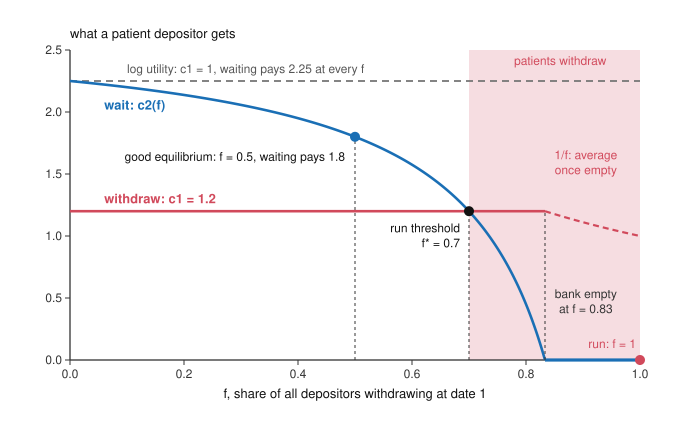

# Economics of Debt · Lesson 3.1: Diamond-Dybvig

> ⏱ ~15 min · Module 3: Banks, runs, collateral and amplification · Builds on: [1.3 Pledgeable income, collateral and monitors](01-03-pledgeable-income-collateral-and-monitors.md), [grad-micro 2.5 Choice under uncertainty](../../grad-micro/lessons/02-05-choice-under-uncertainty.md) · Unlocks: [3.2 Stopping runs](03-02-stopping-runs.md), [6.5 Self-fulfilling debt crises](06-05-self-fulfilling-debt-crises.md)

## Why this matters

A bank lends long and borrows short. Its loans pay off over years, and its deposits can leave today. That mismatch is useful, and it is also why a bank can fail within days once its depositors expect one another to leave: on 9 March 2023 depositors pulled more than 40 billion dollars out of Silicon Valley Bank in a single day (Michael Barr's testimony for the Federal Reserve, March 2023). Diamond and Dybvig (1983, *JPE*) showed that the usefulness and the fragility come from one contract. A deposit is insurance against needing your money early, and the same promise has a second equilibrium, the run. Diamond and Dybvig shared the 2022 Nobel prize in economics with Ben Bernanke, and their coordination failure returns whenever creditors each wait to see what the others do.

## The idea

A hundred people each have 1 unit of savings. The best investment around is a long project: 1 unit put in now returns 2.25 in two periods, but pulled out after one period it returns just the 1. Each saver has an even chance of needing her money next period, for an emergency or a purchase that cannot wait, and she cannot know in advance which way it will go. Alone, she gets 1 if the emergency comes and 2.25 if it doesn't.

A bank pools the hundred. About half will need their money early, and with many savers that share is predictable even though nobody knows who. So the bank can promise 1.2 to anyone who withdraws next period. It pays the 50 early withdrawers 60 by cashing in 60 units of the project and keeps 40 invested, which grow to 90, or 1.8 for each of the 50 who wait. The unlucky get more than they would alone (1.2 instead of 1) and the lucky get less (1.8 instead of 2.25). If savers dread the emergency enough, every one of them prefers this before learning which she is. The deposit is insurance against needing cash early.

Now the catch. The bank has promised 1.2 on demand to everyone, but each unit it holds fetches only 1 if cashed early. Suppose a patient saver expects 20 other patient savers to withdraw as well. Then 70 withdraw, the bank cashes in 84 units, and the 16 left grow to 36, which is 1.2 for each of the 30 who wait: no better than withdrawing. If she expects more than 70 withdrawals, waiting pays less than withdrawing, so she withdraws too, and a little past 83 withdrawals the bank has nothing left. The fear of a run is enough to cause one, though the bank's assets were sound throughout.

## The formal version

**Setup ([Diamond-Dybvig](../reference.md#diamond-dybvig)).** Dates 0, 1 and 2. A continuum of depositors of mass 1 each hold 1 unit at date 0. A long technology turns 1 unit at date 0 into $R>1$ at date 2, or into 1 if it is liquidated at date 1. At date 1 each depositor privately learns her type. With probability $\pi$ she is *impatient* and values only date-1 consumption. Otherwise she is *patient*: she values consumption at either date equally and can store goods from date 1 to date 2. Exactly a share $\pi$ turns out impatient. Utility is CRRA, $u(c)=c^{1-\gamma}/(1-\gamma)$ (or $\ln c$ at $\gamma=1$), with [relative risk aversion](../reference.md#crra-utility) $\gamma$ ([grad-micro 2.5](../../grad-micro/lessons/02-05-choice-under-uncertainty.md)). In autarky the impatient consume 1 and the patient $R$.

**The optimum.** A planner who gives $c_1$ to each impatient depositor and $c_2$ to each patient one solves

$$\max_{c_1,\,c_2}\ \pi\,u(c_1)+(1-\pi)\,u(c_2)\quad\text{s.t.}\quad \pi c_1+\frac{(1-\pi)\,c_2}{R}=1.$$

*In words:* paying the impatient uses up $\pi c_1$ units of the project at date 1, and what is left grows by $R$ to pay the patient. The first-order condition is

$$u'(c_1)=R\,u'(c_2).$$

*In words:* a unit of the project spent at date 1 would have been $R$ units at date 2, so the last unit given to the impatient must be worth $R$ times the last unit given to the patient. With CRRA, $u'(c)=c^{-\gamma}$, so $c_2=R^{1/\gamma}c_1$ and

$$c_1^*=\frac{1}{\pi+(1-\pi)\,R^{(1-\gamma)/\gamma}}.$$

**Result ([liquidity insurance](../reference.md#liquidity-insurance)).** If $\gamma>1$, then $1<c_1^*<c_2^*<R$. *In words:* the impatient get more than their deposit and the patient less than $R$, so the patient insure the impatient. The reason: at the autarky point the impatient's marginal utility $u'(1)=1$ exceeds $R\,u'(R)=R^{1-\gamma}$ exactly when $\gamma>1$, so shifting resources toward date 1 raises expected utility. (With $\gamma<1$ the transfer runs the other way.) Diamond and Dybvig assume relative risk aversion above 1. Since $c_2^*>c_1^*$, no patient depositor gains by posing as impatient, so the optimum survives private types.

**Demand deposits.** A bank takes the deposits, invests them in the project, and promises $c_1$ to anyone who withdraws at date 1, liquidating as it goes. Withdrawers are paid in order of arrival until the money runs out, which is [sequential service](../reference.md#sequential-service), and those who wait share what is left at date 2. If a share $f$ of all depositors, impatient included, withdraws at date 1 and $f c_1<1$, each waiter receives

$$c_2(f)=\frac{R\,(1-f c_1)}{1-f},$$

and nothing once $f\ge 1/c_1$, when the bank is empty. *In words:* each withdrawal takes $c_1$ units of the project although its owner's share was 1, and the extra $c_1-1$ comes out of the waiters' pot. Indeed $c_2'(f)=R(1-c_1)/(1-f)^2$, which is negative exactly when $c_1>1$: withdrawals hurt those who wait only at a bank that insures.

With $c_1=c_1^*$ there are two equilibria. **Good:** only the impatient withdraw, $f=\pi$, and $c_2(\pi)=c_2^*>c_1^*$, so the patient wait. **Run:** everyone withdraws. A waiter then gets nothing, while a withdrawer is paid $c_1$ if she is early enough in line, so withdrawing is the best reply, and a run is an equilibrium whenever $c_1>1$. Between them sits the [run threshold](../reference.md#run-threshold): a patient depositor withdraws once $c_2(f)<c_1$, that is, once

$$f>f^*=\frac{R-c_1}{c_1\,(R-1)}.$$

*In words:* if she expects more than a share $f^*$ of all depositors to withdraw, she joins them. Writing $f^*=(R/c_1-1)/(R-1)$ shows that the threshold falls as the promise $c_1$ rises: the more a bank insures, the smaller the panic that topples it.

## Picture

Blue is what a patient depositor gets by waiting and red what she gets by withdrawing, both plotted against the share $f$ who withdraw, with Example 1's numbers. The curves cross at $f^*=0.7$. In the shaded band every patient depositor prefers to withdraw, so expecting a run makes one. The dashed grey line is Example 2's log-utility bank: waiting pays 2.25 whatever others do, and withdrawing pays 1, so its curves never cross.

## Worked examples

**Example 1 (the model on a clean case).** Take $\gamma=2$, $\pi=0.5$ and $R=2.25$, the illustrative numbers from The idea. The first-order condition gives $c_2=\sqrt{2.25}\,c_1=1.5\,c_1$, and the resource constraint gives $0.5\,c_1+0.5\,(1.5\,c_1)/2.25=\tfrac56 c_1=1$. So $c_1^*=1.2$ and $c_2^*=1.8$. Check: liquidating $0.5\times1.2=0.6$ leaves 0.4, which grows to $0.9=0.5\times1.8$.

- *Who gains and who pays, in the good equilibrium.* The impatient gain 0.2 over autarky and the patient give up 0.45. Before types are known everyone gains. With $u(c)=-1/c$, expected utility rises from $-0.722$ to $-0.694$, as much as 4% more wealth would add in autarky.
- *The threshold.* $f^*=(2.25-1.2)/(1.2\times1.25)=1.05/1.5=0.7$, and the bank is empty at $f=1/1.2\approx0.83$. The impatient already make $f=0.5$, so a run needs only $0.2/0.5=40\%$ of the patient depositors to panic.
- *Who pays in a run.* Everyone withdraws, and the bank liquidates its whole unit to pay 1.2 each to the first $5/6$ of the line. The last $1/6$ get nothing, impatient or not. Patient depositors near the front take 1.2 instead of 1.8. Total consumption falls from 1.5 to 1, and the 0.5 destroyed is the return $0.4\times(2.25-1)$ that the liquidated project would have earned. It goes to no one.

**Example 2 (why you'd care: no insurance, no run).** Same $\pi$ and $R$, but log utility, $\gamma=1$. The first-order condition gives $c_2=R\,c_1$, so the resource constraint becomes $\pi c_1+(1-\pi)c_1=1$. Hence $c_1^*=1$ and $c_2^*=2.25$, which is autarky: pooling buys nothing. A bank that promises $c_1=1$ has $c_2(f)=R(1-f)/(1-f)=2.25$ at every $f$, and $f^*=(R-1)/(R-1)=1$. Each withdrawal takes exactly its owner's share, so no one's withdrawal hurts those who wait and no panic pays.

Put the two examples together. A bank is fragile only because it promises more on demand than its assets fetch if sold today, $c_1>1$, and when $\gamma>1$ that promise is exactly what makes it useful. Runs are the price of the insurance. Once runs have some probability, the promise itself moves that probability, which is where [3.2](03-02-stopping-runs.md) picks up.

## Watch out

- **You might think a run needs bad news, but actually** nothing in the model goes wrong: $R$ is certain, and the bank pays everyone in full if nobody panics. The run is self-fulfilling. Runs that start from real losses, and which equilibrium gets played, are [3.2](03-02-stopping-runs.md)'s.
- **You might think $f^*$ is the share of patient depositors who must panic, but actually** $f$ counts all withdrawals, the $\pi$ impatient included. The panic needed is $(f^*-\pi)/(1-\pi)$ of the patient: 40% in Example 1, not 70%.
- **You might think the resource constraint is $\pi c_1+(1-\pi)c_2=1$, but actually** date-2 payments are divided by $R$, since each unit left in the project pays $R$. Dropping the $R$ gives $c_1^*=0.8$ in Example 1, below the deposit, which contradicts the result for $\gamma>1$.
- **You might think depositors who run are irrational, but actually** each is choosing her best reply: above $f^*$, withdrawing really does pay more. The failure is one of coordination, not of reasoning.

## One-liner

> A bank insures depositors against needing cash early by promising more on demand than its assets fetch if sold early, and that same promise lets the mere expectation of withdrawals empty a sound bank.

## Problems

**P1 (🟢) *(Formal.)*** Depositors have CRRA utility with $\gamma=3$, a share $\pi=0.4$ turn out impatient, and the project returns $R=1.5$ at date 2, or 1 if liquidated at date 1. (a) Find the optimal $(c_1^*,c_2^*)$ and check the resource constraint. (b) The bank offers this as a demand deposit. Find the run threshold $f^*$ and the share of depositors at which the bank is empty. (c) What share of the patient depositors must panic to tip the bank into a run? Three decimals throughout.

**P2 (🟡) *(Formal (a) · Exegetical (b).)*** Keep P1's $R=1.5$ and $\pi=0.4$, but let the bank promise any $c_1\ge1$ on demand, with waiters sharing whatever is left at date 2. (a) Show that the run threshold falls as $c_1$ rises. Find the largest $c_1$ for which the good equilibrium exists (the patient wait when only the impatient withdraw), and say what each type gets at that promise. (b) A reformer blames first come, first served: when the bank cannot pay every date-1 withdrawer $c_1$, it should split everything it can liquidate equally among them. Does this remove the run equilibrium? Say what the bank would need to know, which sequential service denies it, to make waiting a patient depositor's best reply at every $f$. Three sentences or fewer for (b).

**P3 (🔴, optional) *(Formal (a)–(b) · Exegetical (c).)*** Example 1's bank ($\gamma=2$, $\pi=0.5$, $R=2.25$, promise $c_1=1.2$) now keeps its date-1 payments in reserve. It stores $\pi c_1=0.6$ (storage returns 1 for 1) and invests 0.4 in the project. The project can be sold early for only $\ell=0.5$ per unit, a [fire sale](../reference.md#fire-sale). (a) Show that the good equilibrium still pays each patient depositor 1.8. (b) Find the run threshold $f^*$, the share at which the bank is empty, and the share of patient depositors who must panic. (c) In two sentences: why does a lower $\ell$ make a run easier to start, and why would that make one bank's run a danger to other banks holding the same asset?

Solutions

**P1** *(Formal.)*

(a) With $u'(c)=c^{-3}$ the first-order condition $c_1^{-3}=1.5\,c_2^{-3}$ gives $c_2=1.5^{1/3}c_1=1.1447\,c_1$. The resource constraint is

$$\begin{aligned}0.4\,c_1+\frac{0.6\times1.1447\,c_1}{1.5}&=c_1\,\bigl(0.4+0.6\times1.5^{-2/3}\bigr)\\&=c_1\,(0.4+0.4579)=0.8579\,c_1=1,\end{aligned}$$

so $c_1^*=1.166$ and $c_2^*=1.1447\times1.1657=1.334$. Check: the impatient take $0.4\times1.1657=0.4663$ of the project at date 1, the rest grows to pay $0.6\times1.3343/1.5=0.5337$ of it, and $0.4663+0.5337=1.000$. As the result predicts for $\gamma>1$, $1<1.166<1.334<1.5$.

(b) $f^*=(1.5-1.1657)/(1.1657\times0.5)=0.3343/0.5828=0.574$. The bank is empty at $f=1/c_1^*=0.858$.

(c) The impatient supply $f=0.4$ on their own, so the panic needed is $(f^*-\pi)/(1-\pi)=0.289$: about 29% of the patient depositors.

**Wrong turns:** dropping the $R$ from the resource constraint, which gives $c_1=1/(0.4+0.6\times1.1447)=0.920$, below 1, and contradicts $\gamma>1$; reporting $f^*=0.574$ as the answer to (c).

---

**P2** *(Formal (a) · Exegetical (b).)*

(a) $f^*(c_1)=(R/c_1-1)/(R-1)$, so $df^*/dc_1=-R/\bigl(c_1^2(R-1)\bigr)<0$: the threshold falls from $f^*=1$ at $c_1=1$ as the promise grows. The good equilibrium needs the patient to prefer waiting at $f=\pi$, that is, $c_2(\pi)\ge c_1$, which is the same as $f^*\ge\pi$:

$$\frac{1.5/c_1-1}{0.5}\ge0.4\iff\frac{1.5}{c_1}\ge1.2\iff c_1\le1.25.$$

In general $c_1\le R/\bigl(1+\pi(R-1)\bigr)$. At $c_1=1.25$ a waiter gets $c_2(0.4)=1.5\times(1-0.5)/0.6=1.25$, so both types get 1.25. That is full insurance of the timing risk, and it leaves no margin: $f^*=\pi$, so a single extra withdrawal tips the bank. P1's optimum, $c_1^*=1.166$, sits inside the bound with a margin of $0.574-0.4$.

**Must hit, strict (b):**

- No. Equal splitting changes only how the bank's last unit is shared once it is empty. If everyone withdraws, each withdrawer gets $1/f=1$ and a waiter still gets nothing, so the run remains an equilibrium, and $f^*$ does not move, because it lies where the bank still pays $c_1$ in full.
- What would remove the run is a date-1 payment that depends on the total number of withdrawals $f$, lower once $f$ passes $\pi$, so that enough stays invested for waiting to beat withdrawing at every $f$.
- Sequential service denies exactly that: the bank pays each withdrawer as she arrives, before it knows how many will follow.

**Wrong turns:** in (a), requiring only $f^*\ge0$, which gives $c_1\le1.5$ (at $c_1=1.3$ a patient depositor who waits gets $1.2<1.3$ even with no panic); in (b), answering yes because no one gains by being first. The scramble is not the problem: the problem is that withdrawers are paid ahead of those who wait.

**Model answer (b):** No: equal splitting only changes how the last of the bank's assets are divided once it is empty, so in a run each withdrawer still gets 1 while a waiter gets nothing, and the threshold is unchanged. To remove the run the bank would have to make each date-1 payment depend on how many withdraw in total, paying less once withdrawals pass $\pi$ so that enough stays invested for those who wait. Sequential service forbids that, since the bank must pay each withdrawer as she arrives, before it knows how many will follow.

---

**P3** *(Formal (a)–(b) · Exegetical (c).)*

(a) If only the impatient withdraw ($f=0.5$), the reserves pay them $0.5\times1.2=0.6$ exactly and nothing is sold. The 0.4 in the project grows to 0.9, which is $0.9/0.5=1.8$ per patient depositor. The fire-sale price never matters on the good path.

(b) Let $g=f-0.5$ be the withdrawals beyond the impatient. Paying them takes $1.2g/0.5=2.4g$ units of the project, so a waiter gets $2.25\,(0.4-2.4g)/(0.5-g)$. Setting this equal to 1.2:

$$0.9-5.4g=0.6-1.2g\implies g=\frac{0.3}{4.2}=\frac1{14},$$

$$f^*=0.5+\frac1{14}=\frac47\approx0.571.$$

The project runs out when $2.4g=0.4$, at $g=1/6$, so the bank is empty at $f=2/3\approx0.667$. The panic needed is $(1/14)/0.5=1/7\approx14\%$ of the patient depositors, against 40% when the project sells at par (Example 1). In general $f^*-\pi=(1-\pi)(c_2-c_1)\big/\bigl(c_1(R/\ell-1)\bigr)$, which reproduces Example 1's $0.2$ at $\ell=1$.

**Must hit, strict (c):**

- Each withdrawal beyond $\pi$ now uses up $c_1/\ell=2.4$ units of the project instead of 1.2, so the waiters' pot shrinks twice as fast and a smaller panic makes waiting a loser.
- $\ell$ is the price at which the asset sells in a hurry. If other banks holding it sell at the same time, that price falls, which lowers every holder's threshold, so one bank's run makes the next more likely.

**Wrong turns:** valuing every date-1 payment at the fire-sale price, when the reserves are cash and pay the first $\pi$ withdrawals at par (a bank with no reserves that sold the project at 0.5 even on the good path would have nothing left for the patient); using $c_1(R-1)$ in the denominator, which returns Example 1's 0.7.

**Model answer (c):** A lower $\ell$ means each extra withdrawal destroys more of the project, 2.4 units rather than 1.2 here, so waiting stops paying at a smaller panic. Since $\ell$ is the price the asset fetches in a hurry, sales by other banks holding it push it down and lower every holder's run threshold, which is how one run spreads.

## Flashback

**From Lesson [2.3](02-03-agency-costs-of-debt-and-equity.md) (Agency costs of debt and equity):** *(Formal (a)–(b) · Exegetical (c).)* An invented owner-manager runs a firm whose cash flow before perks is $Y=200$. She chooses perks that cost the firm $x$ and are worth $b(x)=8\sqrt{x}$ to her, to maximize $\alpha(Y-x)+b(x)$, where $\alpha$ is her ownership share. (a) With $\alpha=1$, find her perks and her total wealth, $Y-x+b(x)$. (b) She sells 60 percent of the equity to outside investors, so $\alpha=0.4$. They foresee her behavior and pay a fair price for their share. Find her perks, the price they pay, and her total wealth (the sale price plus her retained stake plus the perks' worth to her). (c) By how much does her wealth fall between (a) and (b), and who bears the loss? One sentence.

Solution

(a) She maximizes $200-x+8\sqrt x$. The first-order condition is $-1+4/\sqrt x=0$, so $x=16$, the perks are worth $b=32$ to her, and her wealth is $200-16+32=216$.

(b) The first-order condition is now $-0.4+4/\sqrt x=0$ (in general $b'(x)=\alpha$), so $\sqrt x=10$, $x=100$, and the perks are worth $8\times10=80$ to her. The firm keeps $200-100=100$. Investors pay $0.6\times100=60$ for their share, and her retained stake is worth $0.4\times100=40$, so her wealth is $60+40+80=180$.

(c) It falls by $216-180=36$.

**Must hit, strict (c):**

- She bears the loss. Investors foresee the extra perks and pay a price that already reflects them, so they earn a fair return and the whole 36 falls on her.
- The 36 is the value the extra spending destroys: perks add $b(x)-x=32-16=16$ at $x=16$ but $80-100=-20$ at $x=100$, and $16-(-20)=36$.

**Wrong turns:** pricing the outside share at $0.6\times200=120$, ignoring the perks, which makes selling look like a gain (wealth 240 against 216) when investors would never pay that; leaving her perks at 16 after the sale, when a smaller stake makes each dollar of perks cheaper to her and she spends more.

**Model answer (c):** Her wealth falls by 36, and she bears all of it: investors foresee that a smaller stake means more perks and pay a price that already reflects them, so they earn a fair return and the value the extra spending destroys falls on her.

## Connections

- **Backward:** [1.3](01-03-pledgeable-income-collateral-and-monitors.md)'s delegated monitoring explains why banks hold loans at all. This lesson turns to the other side of the balance sheet, the deposits that fund them. [1.1](01-01-costly-state-verification.md) made debt the contract that asks for nothing to be verified unless payment fails. A deposit is such a fixed claim, and its fixity, $c_1$ owed however many others withdraw, is what a run feeds on. The condition $c_2^*\ge c_1^*$ is an incentive-compatibility constraint ([grad-game-theory 5.2](../../grad-game-theory/lessons/05-02-revelation-principle-incentive-compatibility.md)): depositors reveal their type by when they withdraw.
- **Forward:** [3.2](03-02-stopping-runs.md) compares the tools that remove the run (suspension of convertibility, deposit insurance, a lender of last resort) and uses global games to pick an equilibrium. [3.5](03-05-the-leverage-cycle.md) treats fire sales and the run on repo, and [4.4](04-04-overborrowing.md) prices the externality that P3's falling $\ell$ hints at. Creditors who each wait to see what the others do return in [6.5](06-05-self-fulfilling-debt-crises.md), where a government's lenders refuse to roll over its debt, and, in a cousin form, in the holdouts of [7.2](07-02-holdouts-and-collective-action-clauses.md), where each creditor gains by letting the others accept the haircut.
- **Sideways:** the patient depositors play a Stag Hunt ([grad-game-theory 2.4](../../grad-game-theory/lessons/02-04-computing-characterizing-equilibria.md)): waiting pays best if others wait, withdrawing is the safer choice, and, as that lesson says of Nash equilibrium, the model cannot say which is played. In the debt thread, [history-of-debt 2.4](../../history-of-debt/lessons/02-04-lending-to-kings.md) has Neapolitan depositors withdrawing in 1342–43, after Edward III had stopped paying the Florentine companies and before the Peruzzi and Bardi failed. Whether withdrawals like these topple sound firms or expose broken ones is the line between illiquidity and insolvency that 3.2 draws. Whether it is fair that a run's losses land on whoever stands at the back of the line, or that a bailout moves them to taxpayers, is a question of the kind [philosophy-of-debt 5.2](../../philosophy-of-debt/lessons/05-02-moral-hazard-and-fairness-to-those-who-paid.md) asks. This lesson says only who bears them.
