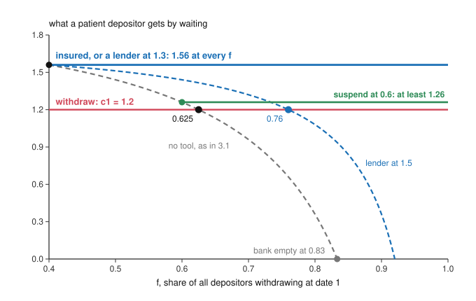

# Economics of Debt · Lesson 3.2: Stopping runs

> ⏱ ~15 min · Module 3: Banks, runs, collateral and amplification · Builds on: [3.1 Diamond-Dybvig](03-01-diamond-dybvig.md), [2.3 Agency costs of debt and equity](02-03-agency-costs-of-debt-and-equity.md), [2.1 Modigliani-Miller](02-01-modigliani-miller.md) · Unlocks: [3.5 The leverage cycle](03-05-the-leverage-cycle.md), [6.5 Self-fulfilling debt crises](06-05-self-fulfilling-debt-crises.md)

## Why this matters

[3.1](03-01-diamond-dybvig.md) left a sound bank that its depositors can empty because each fears the others will. Silicon Valley Bank, with about 94 percent of its deposits above the 250,000-dollar insurance limit at the end of 2022, was run in March 2023 (Federal Reserve Board review, April 2023). Two days after it failed, the Treasury invoked a systemic-risk exception so that every depositor got every dollar back, and the Fed opened a lending facility for other banks. Shareholders were not protected, and the insurance fund's losses were to be recovered from other banks by a special assessment (joint statement, 12 March 2023). This lesson asks what each tool against runs fixes, what it costs, and who pays.

## The idea

A run on a sound bank feeds on one fact: the more others withdraw, the less is left for those who wait. Every cure cuts that link, so that a patient depositor does better by waiting *whatever* the others do. A cure that works is therefore never used.

Take a bank with 100 depositors of 1 each. Its project turns 1 into 1.8 over two periods, or back into 1 if cashed after one, and the bank promises 1.2 on demand. In a normal week 40 depositors need their money. Paying them takes 48 units, and the 52 left grow to 93.6, or 1.56 for each of the 60 who wait. If 25 patient depositors panic too, paying 65 takes 78 units, and the 22 left grow to 39.6, or 1.13 for each of the 35 who wait. That is less than withdrawing pays, so fear spreads.

Three ways to cut the link:

- **Close the window.** The bank will pay at most 60 withdrawals. At least 28 units then stay invested for at most 40 waiters, who get at least 1.26, so nobody panics. But in a bad week when 75 depositors truly need their money, 15 are turned away.
- **Guarantee the waiters.** The state promises 1.56 to everyone who waits, so nobody runs and the promise costs nothing. But guaranteed depositors stop caring what the bank does with their money.
- **Lend.** A central bank lends against the project at 30 percent for the period. If 65 withdraw, the bank borrows the extra 30 rather than cash its project, owes 39, and still has 54.6, or 1.56 apiece, for the 35 who wait. The loan is safe only if the project is good.

## The formal version

**Setup.** Keep [3.1](03-01-diamond-dybvig.md)'s bank. A mass 1 of depositors deposit 1 unit each, and a share $\pi$ turn out impatient. The project returns $R>1$ per unit at date 2, or 1 if liquidated at date 1. The bank promises $c_1>1$ on demand and pays withdrawers in order of arrival. If a share $f$ of all depositors withdraws, each waiter gets $c_2(f)=R(1-fc_1)/(1-f)$, which falls with $f$; a patient depositor runs once $f$ passes the [run threshold](../reference.md#run-threshold) $f^*=(R-c_1)/\bigl(c_1(R-1)\bigr)$. Write $c_2=c_2(\pi)>c_1$ for the patient's payoff when only the impatient withdraw.

**The test for a tool.** A tool removes the run if, with it, waiting pays a patient depositor at least $c_1$ at every $f$. *In words:* whatever she expects, running never strictly pays, so only the impatient withdraw and the tool is never triggered.

**[Suspension of convertibility](../reference.md#suspension-of-convertibility).** The bank stops paying once withdrawals reach $\bar f$. Waiters then get $c_2(\min(f,\bar f))\ge c_2(\bar f)$, so

$$\begin{aligned}\text{no run}&\iff\bar f\le f^*,\\ \text{every impatient depositor paid}&\iff\bar f\ge\pi.\end{aligned}$$

*In words:* stop early enough to protect the waiters and late enough to pay the needy. With $\pi$ known, any $\bar f\in[\pi,f^*]$ does both at no cost (Diamond and Dybvig 1983, *JPE*). If the impatient share can reach $\pi_H>f^*$, no $\bar f$ does both: the bank must give up paying everyone in a bad week, or stopping runs, or some insurance, by cutting the promise to $c_1\le R/\bigl(1+\pi_H(R-1)\bigr)$, which lifts $f^*$ to $\pi_H$. It cannot pick $\bar f$ after seeing the week, since an impatient withdrawer looks just like a frightened one; Diamond and Dybvig prove that with random $\pi$ no contract bound by sequential service reaches the full optimum.

**[Deposit insurance](../reference.md#deposit-insurance).** A guarantor promises every waiter $c_2$, whatever $f$. Waiting then pays $c_2>c_1$ at every $f$, so nobody runs and nothing is paid out. Diamond and Dybvig fund it with a tax set after the fact on the total withdrawn, which a bank paying on arrival cannot do, so it works even with random $\pi$; it is the state's job because it must be believed. Its cost is moral hazard (an incentive effect). With end-of-period assets $V$ and insured deposits $D$,

$$\mathbb E[\text{equity}]=\mathbb E[\max(V-D,0)]=\mathbb E[V]-D+\mathbb E[\max(D-V,0)].$$

*In words:* shareholders own the assets, owe the deposits, and hold a put on the insurer, whose expected payout is the last term. Extra risk raises the put's value, and under a flat premium the insurer pays for it: [2.3](02-03-agency-costs-of-debt-and-equity.md)'s [risk shifting](../reference.md#risk-shifting) with the insurer as creditor. Merton (1977, *Journal of Banking and Finance*) priced deposit insurance as exactly this put.

**[Capital requirements](../reference.md#capital-requirement).** More equity per unit of assets shrinks the put and the gain from gambling (Example 2). The objection that equity is expensive was answered in [2.1](02-01-modigliani-miller.md)'s Example 2: by Modigliani-Miller it is not, socially, and the tax shield and guarantee that thin equity wins a bank's owners are transfers (Admati and Hellwig, *The Bankers' New Clothes*, 2013).

**[Lender of last resort](../reference.md#lender-of-last-resort).** Let each unit paid out beyond $\pi$ cost the waiters $\kappa$ at date 2: $\kappa=R$ if the bank liquidates, $R/\ell$ if it must sell at a fire-sale price $\ell<1$, and $\rho$ if a central bank lends at gross rate $\rho$ against the project. Then waiting pays

$$W(f)=\frac{(1-\pi)\,c_2-\kappa\,c_1\,(f-\pi)}{1-f},$$

and the threshold becomes

$$f^*(\kappa)=\pi+\frac{(1-\pi)(c_2-c_1)}{c_1(\kappa-1)}.$$

*In words:* each extra withdrawal takes $\kappa c_1$ from the waiters' pot, so cheaper cash raises the threshold. $W(f)\ge c_1$ at every $f$ exactly when $\rho\le c_2/c_1$, and at that rate the project, worth $(1-\pi)c_2$ at date 2, repays the loan even if everyone withdraws: the rate that stops the run is the rate at which the loan is safe. Bagehot's rules for the Bank of England in a panic (*Lombard Street*, 1873, ch. VII):

> First. That these loans should only be made at a very high rate of interest. … Secondly. That at this rate these advances should be made on all good banking securities, and as largely as the public ask for them.

The high rate, he explains, fines nervousness and saves the reserve for those who need it. The model lets the rate exceed what cash earns but caps it at $c_2/c_1$: any higher and the fine comes out of the waiters' pot and the run survives. Lending only on good security separates [illiquidity from insolvency](../reference.md#illiquidity-versus-insolvency). An illiquid bank's assets, held to maturity, cover what it owes but cannot become cash today except at a loss; an insolvent bank's fall short even held to maturity. A loan to the first is repaid. A loan to the second is a transfer to its depositors and shareholders.

**Which equilibrium? A sketch.** Two equilibria leave a run's probability, and so a tool's value, undetermined. [Global games](../reference.md#global-games) fix this (Morris and Shin 1998, *AER*). Let each depositor see the bank's fundamental $\theta$ with small private noise. Running is dominant for very low $\theta$ and waiting for very high $\theta$, and iterated dominance ([grad-game-theory 2.1](../../grad-game-theory/lessons/02-01-normal-form-dominance-rationalizability.md)) works inward from both ends to one threshold $\theta^*$: all patient depositors run below it, none above. In the simplest version a withdrawer always gets $c_1$, a waiter gets $c_2$ if the bank survives and 0 if not, and the bank survives if fewer than a share $\theta$ of the patient run. A depositor at the threshold cannot rank her signal among the others', so every share of runners looks equally likely, the bank survives with probability $\theta^*$ in her eyes, and indifference gives

$$\theta^*=\frac{c_1}{c_2}.$$

*In words:* the more a contract insures, the more often the bank is run. Goldstein and Pauzner (2005, *JF*) prove this for the Diamond-Dybvig bank itself: the equilibrium is unique, the threshold rises with $c_1$, and the best contract insures less than 3.1's optimum, which ignored runs. The runs are still panics: just below $\theta^*$, a depositor who believed the others would wait would wait too.

## Picture

Each tool bends 3.1's waiting curve (grey) and works if the whole curve stays above the red line. Suspension, insurance and a lender at 1.3 do; a lender at 1.5 only delays the crossing, to 0.76.

## Worked examples

**Example 1 (the model on a clean case).** The bank from The idea: $R=1.8$, $c_1=1.2$, $\pi=0.4$.

- *No tool.* $f^*=0.6/(1.2\times0.8)=0.625$, the bank is empty at $1/1.2\approx0.833$, and $c_2=1.8\times0.52/0.6=1.56$.
- *Suspension.* With $\pi$ known, any $\bar f\in[0.4,\,0.625]$ works; at $\bar f=0.6$ waiters get at least $c_2(0.6)=1.26$. Now let a bad week bring $\pi_H=0.75$. (i) Suspending at 0.625 turns away 0.125 of depositors, a sixth of the impatient. (ii) Suspending at 0.75 pays them all, but a waiter caught in a run gets $c_2(0.75)=1.8\times0.1/0.25=0.72<1.2$, so the run survives. (iii) Cutting the promise to $1.8/(1+0.75\times0.8)=1.125$ lifts $f^*$ to 0.75. The impatient then get 1.125 instead of 1.2 in every week, and the patient $1.8\times0.55/0.6=1.65$ in a normal one.
- *Lender of last resort.* $(1-\pi)(c_2-c_1)/c_1=0.6\times0.36/1.2=0.18$, so $f^*(\rho)=0.4+0.18/(\rho-1)$. That is 0.625 at $\rho=R=1.8$, where borrowing is no cheaper than liquidating; 0.76 at 1.5; and 1 at $\rho=c_2/c_1=1.3$, where the run is gone. In a total run the bank borrows $0.6\times1.2=0.72$ and owes 0.936, exactly what its project pays ($1.8\times0.52$). In the bad week it borrows $0.35\times1.2=0.42$ and each waiter still gets 1.56: cash from outside the bank does what suspension could not. For a whole system that cash must come from taxes or money creation; with a riskless project, Diamond and Dybvig note, central-bank lending then does deposit insurance's job.

**Example 2 (why you'd care: the insured bank's gamble).** A bank has 100 of assets, 96 of insured deposits and 4 of equity; everyone is risk-neutral and rates are zero. A safe loan book pays 103 next period; a risky one pays 118 or 70 on a coin flip.

| | Safe | Risky |
|---|---|---|
| Shareholders | $103-96=7$ | $\tfrac12(118-96)=11$ |
| Insurer's expected payout | 0 | $\tfrac12(96-70)=13$ |
| Total value | 103 | 94 |

Check: $94-96+13=11$. Shareholders choose the gamble and gain 4; the insurer's 13 pays for that and for the 9 destroyed. Under a flat premium the loss lands on the insurance fund, so on the banks that pay into it, or on taxpayers if it runs dry.

A premium equal to the put (13 on the risky book) would leave shareholders $-2$ against 7, but it needs an insurer who can see the risk. A capital requirement works without seeing the choice. Shareholders prefer the safe book when $103-D\ge\tfrac12(118-D)$, that is $D\le88$: equity of at least 12 per 100 of assets, at which both books give them 15. The requirement costs shareholders the 4 they took from the insurer and restores the 9 destroyed; by MM the extra equity itself costs nothing.

## Watch out

- **You might think a tool that is never used costs nothing, but actually** its costs come off the equilibrium path or before it: suspension strands the needy in a bad week, insurance changes what the bank does with the money, and a lender that banks count on lets them hold thinner reserves.
- **You might think Bagehot's rate should be as high as possible, but actually** the fine comes out of the waiters' pot, and above $c_2/c_1$ the run survives: at 1.5, Example 1's bank is still run once 76 percent withdraw.
- **You might think deposit insurance ends runs, but actually** it ends runs by the insured. Deposits above the limit, like most of SVB's, still run, and so does short-term wholesale funding ([3.5](03-05-the-leverage-cycle.md)'s run on repo).

## One-liner

> A run stops once waiting pays whatever others do, so a working tool is never used; its price is paid elsewhere, by stranded depositors, by an insurer the bank gambles against, or by whoever lent to a bank that was insolvent.

## Problems

**P1 (🟢) *(Formal.)*** A bank promises $c_1=1.25$ on demand. Its project returns $R=1.4$ per unit at date 2, or 1 per unit liquidated at date 1. In a normal week a share 0.2 of depositors is impatient; in a bad week, 0.4. The bank cannot tell which week it is. (a) Find the run threshold $f^*$, the share at which the bank is empty, and what each waiter gets when only the impatient withdraw, in each week. (b) The bank will suspend convertibility once withdrawals reach $\bar f$. Find the largest $\bar f$ at which waiting pays at least $c_1$ whatever others do, and the fraction of the impatient it turns away in a bad week. (c) Find the largest promise $c_1$ for which suspending at 0.4 both pays every impatient depositor and removes the run, and what each waiter then gets in a normal week. Three decimals.

**P2 (🟡) *(Formal (a)–(c) · Exegetical (d).)*** An invented bank has 100 of assets, funded by 90 of insured deposits and 10 of equity. Everyone is risk-neutral, rates are zero, and the insurance premium is flat, so ignore it. The bank can hold a safe loan book paying 104 next period, or a risky one paying 180 with probability 0.2 and 75 otherwise. (a) Which book do shareholders choose? Find the insurer's expected payout under each, and split the change in total value between shareholders and the insurer. (b) Deposits fall one for one as equity rises. Find the smallest equity at which shareholders (weakly) prefer the safe book. (c) Now let deposits be uninsured, with depositors who foresee the book and set the promised repayment $F$ so that they expect 90 back. Show that $F=150$ and that the risky book is still chosen. (d) In three sentences or fewer, say who bears the value the gamble destroys with and without insurance, and why only the uninsured bank's shareholders want to hold more equity or accept covenants.

**P3 (🔴, optional) *(Formal (a)–(b) · Exegetical (c).)*** Two invented banks each owe 100 of deposits, and depositors at both are running. North's loans will repay 112 next month for sure; sold today they fetch 84. South's loans will repay 120 or 60 next month with equal probability; sold today they fetch 70. The central bank lends for the month at 5 percent against loans. (a) For each bank, find the most the central bank can lend against its loans and still be repaid in every state, and say whether that covers the run. (b) The central bank lends South 100 anyway. Find its expected loss and the expected gains of South's depositors (against a fire sale) and shareholders, and check that they add up. (c) Classify each bank as illiquid, insolvent or both, and say how Bagehot's test of "good banking securities" sorts them without the central bank ruling on solvency directly, and where that test is hardest to apply in a panic. Three sentences.

Solutions

**P1** *(Formal.)*

(a) $f^*=(1.4-1.25)/(1.25\times0.4)=0.15/0.5=0.300$. The bank is empty at $f=1/1.25=0.800$. Normal week: $c_2(0.2)=1.4\times0.75/0.8=1.3125$. Bad week: $c_2(0.4)=1.4\times0.5/0.6=1.167$, already below $c_1$: in a bad week the patient would rather withdraw even with no panic.

(b) Waiting pays at least $c_2(\bar f)$, which is at least $c_1$ exactly when $\bar f\le f^*$, so the largest is $\bar f=0.300$ (waiters then get $c_2(0.3)=1.25$ in a run, a tie). In a bad week it pays $0.3$ of the $0.4$ who are impatient and turns away $0.1$, a quarter of them ($0.250$).

(c) Both need $f^*\ge0.4$, that is $c_1\le R/\bigl(1+0.4(R-1)\bigr)=1.4/1.16=1.207$. At that promise a normal week's waiter gets $1.4\times(1-0.2\times1.2069)/0.8=1.328$, more than the 1.3125 at $c_1=1.25$, while the impatient get 1.207 instead of 1.25.

**Wrong turns:** using the normal week's share in (c), which gives $1.4/1.08=1.296$ and leaves $f^*$ below 0.4; suspending at 0.4 with $c_1=1.25$ and calling it run-proof, when a waiter caught in a run would get $c_2(0.4)=1.167<1.25$.

---

**P2** *(Formal (a)–(c) · Exegetical (d).)*

(a) Safe: shareholders get $104-90=14$ and the insurer pays nothing. Risky: shareholders get $0.2\times(180-90)=18$, and the insurer pays $90-75=15$ with probability 0.8, an expected 12. Check: the mean is $0.2\times180+0.8\times75=96$, and $96-90+12=18$. Shareholders choose the risky book. Total value falls from 104 to 96, by 8: shareholders gain 4 and the insurer loses 12.

(b) Shareholders prefer safe when $104-D\ge0.2\,(180-D)$, that is $0.8D\le68$, $D\le85$. So equity must be at least 15; at $D=85$ both books give them 19.

(c) With the risky book, $F$ (between 75 and 180) must satisfy $0.2F+0.8\times75=90$, so $F=150$. At $F=150$ shareholders get $0.2\times30=6$ from the risky book and nothing from the safe one, which cannot pay 150, so the risky book is chosen and depositors do expect 90. A promise of 90 is not an equilibrium: at $F=90$ shareholders would take the risky book anyway (18 against 14).

**Must hit, strict (d):**

- Uninsured: shareholders bear the 8, since they get 6 against the 14 they would get if they could commit to the safe book.
- Insured: the insurer bears it, paying 12, which is the 8 destroyed plus the 4 handed to shareholders.
- So only uninsured shareholders gain (8) from a credible commitment such as more equity or covenants. Insured shareholders would lose 4 by committing, which is why the regulator must impose the capital requirement of (b).

**Wrong turns:** in (b), requiring enough equity that the risky book never defaults ($D\le75$, equity 25), which is more than the choice needs; in (c) and (d), concluding that uninsured depositors stop the gamble. Here they price it, and the risky book is still chosen; what changes is who pays for it.

**Model answer (d):** Without insurance the shareholders bear the 8 the gamble destroys, because depositors price it and leave them 6 instead of the 14 a credible commitment to the safe book would bring. With insurance the insurer bears it, paying 12, the 8 destroyed plus 4 to shareholders. So uninsured shareholders gain 8 from committing through more equity or covenants, while insured shareholders lose 4 by committing and must be made to hold capital.

---

**P3** *(Formal (a)–(b) · Exegetical (c).)*

(a) North: $112/1.05=106.67\ge100$, so a loan of 100 is repaid in full (105) and covers the run, and shareholders keep 7. South: its loans pay at least 60, so it can be lent only $60/1.05=57.14$ with repayment in every state, which does not cover 100.

(b) South owes 105. The central bank expects $\tfrac12\times105+\tfrac12\times60=82.5$, an expected loss of 17.5. Depositors get 100 instead of the 70 a fire sale would raise, a gain of 30. Shareholders expect $\tfrac12\times(120-105)=7.5$ instead of nothing. Check: $30+7.5-17.5=20=90-70$, the fire-sale loss avoided.

**Must hit, strict (c):**

- North is illiquid but solvent: held to maturity its loans (112) cover its deposits, but today they raise only 84.
- South is insolvent as well as illiquid: its loans are worth 90 on average against 100 owed.
- The test lends against collateral valued at what it will pay: North's loans secure the advance in every state and South's cannot, so the central bank rules on the collateral rather than on the bank. It is hardest to apply in a panic, when market prices of collateral (84, 70) are fire-sale prices; Bagehot's standard is what counts as good security in ordinary times.

**Wrong turns:** valuing North's loans at 84 and calling it insolvent; calling South solvent because its good state (120) exceeds 100; calling the 17.5 a social loss, when it is a transfer and the loan also saves 20 of fire-sale losses.

**Model answer (c):** North is illiquid but solvent, since its loans will pay 112 against 100 owed though they fetch only 84 today, while South is insolvent as well as illiquid, with loans worth 90 on average. Bagehot's test lends only against security that covers the advance, which North's loans do in every state and South's do not, so the central bank values collateral instead of ruling on solvency. The hard part is the valuation: in a panic the market price is a fire-sale price, and the lender must judge what the collateral is worth in ordinary times.

## Flashback

**From Lesson [2.4](02-04-debt-overhang.md) (Debt overhang):** *(Formal (a)–(b) · Exegetical (c).)* An invented firm owes 120 next year. Its assets in place will be worth 50 or 170 with equal probability, so with no project its debt is worth 85 and its equity 25. Rates are zero and everyone is risk-neutral. Shareholders can pay 30 today for a project that adds 45 next year for sure, and they refuse it. (a) Show that no write-down of the face value gets the project built while leaving creditors at least as well off as now. (b) Instead, creditors swap their claim for a share $s$ of an all-equity firm that raises the 30 at a fair price, so the old claimants together own $V=\mathbb{E}[\tilde A]+45-30$, where $\tilde A$ is the assets in place. Find the range of $s$ at which neither creditors nor old shareholders lose, and each side's gain at each end. (c) In one sentence, why does the swap work where the write-down cannot?

Solution

(a) At the present face of 120 the project makes the bad state worth $95<120$, so creditors take all 45 there: the debt goes from 85 to $\tfrac12\times95+\tfrac12\times120=107.5$ and the equity from 25 to $\tfrac12\times(215-120)-30=17.5$. Creditors gain 22.5, shareholders lose 7.5, and the NPV is $22.5-7.5=15$, so they refuse. Now cut the face to $F'$. Shareholders choose after the deal, so they build iff building beats not building at $F'$.

- For $50\le F'\le95$ the project makes the debt safe, worth $F'$, while with no project it is worth $\tfrac12\times50+\tfrac12F'$. Building adds $F'/2-25$ to the debt, hence $15-(F'/2-25)=40-F'/2$ to the equity, so they build iff $F'\le80$.
- For $F'>95$ the bad state still defaults, so building costs them 7.5 as at 120. For $F'<50$ creditors get less than 50.

Creditors need at least their present 85, which takes $F'\ge85$. No face value satisfies both.

(b) $V=110+45-30=125$. Creditors need $125s\ge85$, so $s\ge0.68$; old shareholders need $125\,(1-s)\ge25$, so $s\le0.80$. At $s=0.68$ creditors are unchanged at 85 and old shareholders hold 40, a gain of 15, the whole NPV. At $s=0.80$ old shareholders are unchanged at 25 and creditors hold 100, a gain of 15.

**Must hit, strict (c):**

- The swap removes the fixed claim, so no one's payoff is capped at a face value and the firm builds; the old claimants, now owners of the whole firm, split $V$ as they like.
- A write-down leaves a fixed claim in place, which still takes the project's payoff in the bad state and hands shareholders the cut in the good state whether or not they build, so creditors cannot recover enough (here, no acceptable face exists).

**Wrong turns:** measuring shareholders against their status-quo 25 instead of against not building at the new face: at a face of 90 that looks like a Pareto improvement (creditors 90 against 85, shareholders 35 against 25), but shareholders then compare building (35) with not building at 90 (40), skip the project, and leave creditors with 70. Taking $V=110$ in (b), forgetting the project's net 15, which leaves no range (0.77 at both ends).

**Model answer (c):** A swap leaves no fixed claim behind, so the old claimants own the whole firm, build, and split all of $V$, while a write-down keeps a fixed claim that still takes part of the project's payoff and hands shareholders the cut whether or not they build, which is why no write-down works here.

## Connections

- **Backward:** [3.1](03-01-diamond-dybvig.md) supplied the run threshold that every tool here raises, and its fire-sale price $\ell$ is what a lender of last resort replaces with its own rate. The insurer's put is [2.3](02-03-agency-costs-of-debt-and-equity.md)'s convex equity payoff with a new creditor, and why thicker bank equity is not a social cost is [2.1](02-01-modigliani-miller.md)'s Example 2. A premium priced to risk needs an insurer who can observe the bank's risk, the hidden-action problem of [`grad-micro` 5.4](../../grad-micro/lessons/05-04-moral-hazard-principal-agent.md).
- **Forward:** [3.5](03-05-the-leverage-cycle.md) follows the run to collateralized short-term funding, where a spike in repo margins does the running. [4.4](04-04-overborrowing.md) prices the fire-sale externality: each seller ignores the discount her selling forces on everyone else. In [6.5](06-05-self-fulfilling-debt-crises.md) a government's lenders refuse to roll over its debt and a lender of last resort can shrink the crisis zone. [8.1](08-01-forgiveness-commitment-and-the-fresh-start.md) turns SVB's weekend into the general problem: relief that is efficient after the fact changes what borrowers and lenders do before it.
- **Sideways:** in the debt thread, [history-of-debt 6.2](../../history-of-debt/lessons/06-02-the-eurozone-and-greece.md) records a central-bank bond-buying program announced in 2012 and never used, the sovereign version of a tool that works by not being used, and [history-of-debt 6.1](../../history-of-debt/lessons/06-01-the-american-mortgage-and-2008.md) has the Federal Reserve financing about 30 billion dollars of Bear Stearns's assets in March 2008. [philosophy-of-debt 5.2](../../philosophy-of-debt/lessons/05-02-moral-hazard-and-fairness-to-those-who-paid.md) separates the incentive objection to rescues, which this lesson computes, from the charge that they are unfair to those who paid, which it does not judge. The global-games argument is iterated dominance ([grad-game-theory 2.1](../../grad-game-theory/lessons/02-01-normal-form-dominance-rationalizability.md)) in a Bayesian game ([grad-game-theory 4.1](../../grad-game-theory/lessons/04-01-bayesian-games-bayes-nash.md)).
