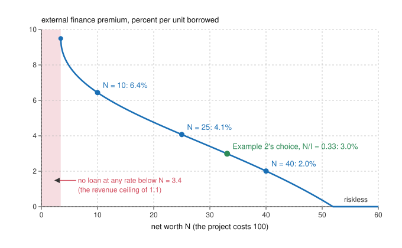

# Economics of Debt · Lesson 3.3: The financial accelerator

> ⏱ ~15 min · Module 3: Banks, runs, collateral and amplification · Builds on: [1.1 Costly state verification](01-01-costly-state-verification.md), [1.3 Pledgeable income, collateral and monitors](01-03-pledgeable-income-collateral-and-monitors.md), [1.4 The price of a loan](01-04-the-price-of-a-loan.md) · Unlocks: [3.4 Kiyotaki-Moore: collateral cycles](03-04-kiyotaki-moore-collateral-cycles.md), [4.1 Fisher's debt-deflation, formalized](04-01-fishers-debt-deflation-formalized.md)

## Why this matters

Recessions are larger than the shocks that seem to start them. A modest rise in interest rates can be followed by a fall in investment far larger than models with Modigliani-Miller built in ([2.1](02-01-modigliani-miller.md)) predict, because in them who pays for a project has no bearing on whether it gets built. Bernanke and Gertler (1989, *AER*) and Bernanke, Gertler and Gilchrist (1999, *Handbook of Macroeconomics*) dropped one assumption, that lenders see outcomes for free, and got a mechanism: a borrower's own wealth sets the price of outside money, and that wealth falls in a downturn. It is [1.1](01-01-costly-state-verification.md)'s verification cost priced into the loan. Fisher (1933) blamed the depth of the Depression partly on debt burdens swollen by deflation, and Bernanke (1983) took the theme up again; the model here is one way to make it precise.

## The idea

A potter wants a kiln that costs 100. It will return 60, 120 or 180, each equally likely, and only she sees which. A lender who doubts her report of a bad year can send in an accountant for 12. Ignore interest for now, so the lender needs only its money back on average. As in 1.1, the best contract is a debt: a fixed repayment, with the accountant called only when she says she cannot pay it.

- **None of her own money.** She borrows 100 and promises 144. The lender collects 144 in the best year and, after paying the accountant, 108 and 48 in the other two: 100 on average. She defaults two years in three, so the expected accounting bill is 8.
- **20 of her own.** She borrows 80 and promises 96. Only the worst year defaults (96, 96 and 48 average 80). The bill is 4.
- **40 of her own.** She borrows 60 and promises 60, which even the worst year covers. No accountant, no bill.

The lender breaks even every time. The potter pays the bill, because it is built into what she promises: her expected profit is the kiln's 20 of value minus the bill, so 12, 16 or 20. The fee buys nothing but the check. The bill per unit borrowed is the **external finance premium**: 8%, 5% and 0% here.

Now run it backwards. A bad year that costs her 20 of savings raises the premium on her next kiln. If many potters are hit at once and some kilns stop being worth their premium, fewer get built, potters earn less, their savings fall again, and the premium rises again. A shock to borrowers' wealth feeds on itself: the **financial accelerator**.

## The formal version

**Setup.** An entrepreneur with net worth $N$ undertakes a project costing $I>N$ and borrows $B=I-N$. The project returns $y$, with c.d.f. $F$ and density $f$ on $[a,b]$. She sees $y$; a lender sees it only by paying a verification cost $c$ ([costly state verification](../reference.md#costly-state-verification)). Lenders are competitive and can earn the gross safe rate $R_f=1+r_f$. [1.1](01-01-costly-state-verification.md) showed that the optimal contract is a [standard debt contract](../reference.md#standard-debt-contract): she pays $\min(y,D)$ for a face value $D$, and the lender verifies exactly when $y<D$. Net worth enters only through the size of the loan:

$$L(D)\equiv\int_a^D (y-c)\,dF(y)+D\,\bigl(1-F(D)\bigr)=R_f\,(I-N).$$

*In words:* what the lender collects, net of audits, must equal the safe return on what it lends. $L$ rises with $D$ up to 1.1's [revenue ceiling](../reference.md#lender-revenue-ceiling), and $D(N)$ is the smallest solution. If $R_f(I-N)$ exceeds $\max L$, no face value works and she is [rationed](../reference.md#credit-rationing).

**Who pays.** Her expected payoff is $E[\max(y-D,0)]=E[y]-E[\min(y,D)]$, and the lender's condition says $E[\min(y,D)]=R_fB+cF(D)$. So

$$E[\max(y-D,0)]-R_fN=\underbrace{E[y]-R_fI}_{\text{NPV}}-\underbrace{c\,F(D)}_{\text{audit bill}}.$$

*In words:* the lender earns exactly the safe rate, and the borrower keeps the project's NPV minus the expected cost of audits, a real resource cost that neither side gets back. Bernanke, Gertler and Gilchrist define the [external finance premium](../reference.md#external-finance-premium) as the cost of funds raised outside minus the opportunity cost of the firm's own. Here, per unit borrowed,

$$\text{EFP}(N)=\frac{c\,F\bigl(D(N)\bigr)}{I-N}.$$

*In words:* each borrowed unit costs the safe rate plus its share of the audit bill.

**Result.** More net worth means a smaller loan, a lower face value, default in fewer states and fewer audits: the bill $cF(D)$ falls as $N$ rises, and with the uniform returns used below so does the premium per unit borrowed. Once $R_f(I-N)\le a$ the debt is riskless and the premium is zero. *In words:* the same project costs more to finance the less of it the borrower pays for herself.

**What the loan rate measures.** Rearranging $L(D)=R_fB$, with $(x)^+=\max(x,0)$:

$$\frac{D}{B}-R_f=\underbrace{\frac{E\bigl[(D-y)^+\bigr]}{B}}_{\text{default shortfall}}+\underbrace{\frac{c\,F(D)}{B}}_{\text{premium}}.$$

*In words:* the first layer pays the lender for the part of the promise that bad years break, so on average the borrower does not pay it; only the second is a cost to her. These are [1.4](01-04-the-price-of-a-loan.md)'s risk and handling layers ([rate decomposition](../reference.md#rate-decomposition)), with the handling done only in default.

**The accelerator.** Bernanke, Gertler and Gilchrist define net worth as liquid assets plus the collateral value of illiquid ones, minus debts. It rises with profits and asset prices, so it is procyclical, which makes the premium countercyclical. Two relations carry the mechanism in their model:

1. With the financing need held fixed, the premium falls as net worth rises: it depends on $N/I$ (Example 1).
2. With constant returns, investment is proportional to net worth, $I=x^*N$, and the leverage $x^*$ is set by the project's return and the premium schedule (Example 2).

Together they make the [financial accelerator](../reference.md#financial-accelerator). A fall in $N$ raises the premium on today's plans, investment is cut by a multiple of the loss, next period's net worth (this period's profits) falls, and lower investment lowers the price of capital and so the net worth of everyone who holds it. Net worth has become a state variable, so a one-time shock to it echoes into later periods (Bernanke and Gertler 1989).

The squeeze is uneven. Borrowers with the least net worth relative to their needs pay the most, and the weakest are pushed past the ceiling or past the point where the audit bill eats the project's value. Bernanke, Gertler and Gilchrist (1996, *REStat*) call this the [flight to quality](../reference.md#flight-to-quality): early in a recession, borrowers with high agency costs should get a falling share of credit and account for a disproportionate part of the decline, and they present evidence from a panel of large and small manufacturers. Gertler and Gilchrist (1994, *QJE*) found that after monetary tightening small manufacturers' sales fell faster than large ones' for more than two years, and bank lending to small firms shrank while lending to large firms rose.

## Picture

The curve is Example 1's premium. In the pink band 1.1's revenue ceiling rations her; past 51.9 the worst outcome covers the debt. The green point is the leverage Example 2's entrepreneur picks when she can choose her scale.

## Worked examples

**Example 1 (the bridge: 1.1's contract, now with net worth).** $I=100$, $y$ uniform on $[50,170]$, so $E[y]=110$ and the NPV at a 4% safe rate ($R_f=1.04$) is $110-104=6$; verification costs $c=10$. With $w=b-a=120$ and $u=D-a$, the lender's revenue is $L=50+u-u^2/240-u/12$, and $L=1.04B$ gives

$$u=110-\sqrt{110^2-240\,(1.04B-50)}.$$

| $N$ | $B$ | $D$ | $F(D)$ | audit bill | premium | promised rate |
|---|---|---|---|---|---|---|
| 10 | 90 | 119.55 | 0.580 | 5.80 | 6.44% | 32.8% |
| 25 | 75 | 86.65 | 0.305 | 3.05 | 4.07% | 15.5% |
| 40 | 60 | 64.48 | 0.121 | 1.21 | 2.01% | 7.5% |

At $N=25$: $\sqrt{12100-240\times28}=\sqrt{5380}=73.35$, so $u=36.65$ and $D=86.65$. Her payoff is $110-78-3.05=28.95$, which is her own $1.04\times25=26$ plus the NPV of 6 minus the bill.

The edges: at $N=0$ the lender would need 104, but its revenue peaks at $L(160)=100.42$ (1.1's ceiling at $D=b-c$), so the threshold is $N=100-100.42/1.04=3.4$. From $N=100-50/1.04=51.9$ on, $1.04B\le50$ and the debt is riskless. At $N=10$ the bill of 5.80 nearly swallows the NPV of 6.

**Example 2 (why you'd care: a loss of wealth becomes a larger loss of investment).** Make the project divisible: each unit invested returns $y$ uniform on $[0.5,1.7]$ and costs $0.1$ to verify, so Example 1 is the case $I=100$. Everything above depends only on $N/I$: scale $N$ and $I$ up together and the face value per unit, the default probability and the premium stay put while her payoff grows in proportion. With leverage $x=I/N$, face value $d$ per unit invested, and $m=E[y]-R_f=0.06$, her payoff over $R_fN$ is

$$N\,x\,\bigl[m-c\,F\bigl(d(x)\bigr)\bigr].$$

So she picks one leverage $x^*$ whatever her wealth and invests $I=x^*N$. More leverage adds units worth $m-cF$ each but raises the default probability on all of them. With uniform returns the first-order condition reduces to $F(d^*)=2m/c-1$, here $0.2$ (an interior optimum needs $m>c/2$; otherwise she borrows only what is riskless). Then $d^*=0.74$, the lender nets $0.696$ per unit invested, which funds a share $0.696/1.04=0.669$ of the project, so $N/I=0.331$ and $x^*=3.023$. The premium is $0.02/0.669=3.0\%$, the green point in the figure.

Now the shock. Entrepreneurs start date 1 with net worth 40 in total and invest $3.023\times40=120.9$. A loss of 10 (a fall in the value of what they own, or old debts growing in real terms as prices fall, [4.1](04-01-fishers-debt-deflation-formalized.md)) leaves 30.

- *On impact*, at the old plan of 120.9, their own share falls from 0.331 to 0.248 and the premium jumps from 3.0% to 4.1%.
- *They scale back* to $3.023\times30=90.7$, which restores the premium to 3.0%. Investment falls by 30.2, three times the loss.
- *Next period*, net worth is what date-1 projects paid their owners: across many entrepreneurs, $R_f+x^*(m-cF^*)=1.04+3.023\times0.04=1.161$ per unit of date-1 net worth. It is 11.6 lower, so date-2 investment is $3.023\times11.61=35.1$ lower.

Over two dates the loss of 10 costs 65.3 of investment, and no project's prospects changed. With $c=0$ lenders would fund any scale at the safe rate, her wealth would not limit investment at all, and the loss would change only who owns the projects. The general-equilibrium step, falling investment lowering the price of capital and so the net worth of all who hold it, is [3.4](03-04-kiyotaki-moore-collateral-cycles.md)'s.

## Watch out

- **You might think the premium is the gap between the loan rate and the safe rate, but actually** most of that gap pays for promises that bad years break, which the borrower does not pay on average. At $N=25$ the promised rate is 15.5%, 11.5 points over the safe rate, and the premium is only 4.1 of them.
- **You might think the low-net-worth borrower pays more because her project is worse, but actually** Example 1's projects are identical; only her stake differs. That is why a shock to wealth that says nothing about projects still moves investment.
- **You might think the accelerator needs the premium to stay high, but actually** in Example 2 it is back at 3.0% once she has cut back. The premium jumps on the old plan; what lasts is the smaller scale, and the smaller net worth it leaves for next period.

## One-liner

> Outside money costs more than your own because someone must check when you cannot pay, and the less you bring the more often they check; so a loss of wealth raises the cost of credit, cuts investment by a multiple, and lowers tomorrow's wealth too.

## Problems

**P1 (🟢) *(Formal (a) · Exegetical (b).)*** Example 1's project ($I=100$, $y$ uniform on $[50,170]$, $c=10$, safe rate 4%), with net worth $N=20$. (a) Find the face value $D$, the default probability, the audit bill and the external finance premium. (b) Split the promised spread over the safe rate into its two layers. An invented op-ed calls the whole spread "the bank's profit on a thin borrower." In two sentences, say who receives each layer and who bears the premium.

**P2 (🟡) *(Formal.)*** Use Example 2's economy: leverage $x^*=3.023$ and gross return on net worth 1.161. Entrepreneurs own land worth 150 and owe 100. (a) Land prices fall 4%. By what percentage do their net worth and their investment fall, and by how much does investment fall? (b) Redo (a) for entrepreneurs with the same net worth of 50 held as land and no debt. (c) In case (a), how much lower are date-2 net worth and investment?

**P3 (🔴, optional) *(Formal (a)–(b) · Exegetical (c).)*** Example 1's project again. (a) She invests only if the audit bill is no larger than the NPV. Find the net worth below which she turns down a loan she could get. (b) Two such firms, with net worth 45 and 15, each lose 7. Which still invests? Find the stronger firm's premium before and after. (c) A regulator sees the weaker firm vanish from the banks' books and blames the banks for hoarding. In two sentences, say whose decision ended the borrowing and why a bank could not keep the firm by asking a lower face value.

Solutions

**P1** *(Formal (a) · Exegetical (b).)*

(a) $B=80$ and $1.04B=83.2$, so

$$u=110-\sqrt{12100-240\times33.2}=110-\sqrt{4132}=110-64.28=45.72,$$

and $D=95.72$. The default probability is $45.72/120=0.381$, the audit bill $10\times0.381=3.81$, and the premium $3.81/80=4.76\%$. Check: her payoff is $110-83.2-3.81=22.99$, her own $1.04\times20=20.8$ plus the NPV of 6 minus 3.81.

(b) The promised rate is $95.72/80-1=19.65\%$, a spread of 15.65 points. The shortfall layer is $E[(D-y)^+]/B=(45.72^2/240)/80=8.71/80=10.89$ points, and the premium is 4.76.

**Must hit, strict (b):**

- The shortfall layer goes to the lender but only offsets what it fails to collect in bad years, so the lender earns exactly the 4% safe rate: no profit.
- The premium is paid out to verification (accountants, lawyers, the costs of bankruptcy). It is a deadweight cost, and the borrower bears it, since her payoff is the NPV minus the bill.

**Wrong turns:** counting the whole 15.65 points as the cost of borrowing (her expected payment is $83.2+3.81$, not $95.72$); calling the premium a markup, when competition has already set the lender's profit to zero.

**Model answer (b):** The 10.89-point shortfall layer is the lender's, but it only makes up for the years she cannot pay, so the lender ends up with the safe 4% and nothing more. The 4.76-point premium goes to whoever does the checking in default, a deadweight cost that the borrower bears through a higher face value; whether charging a thin borrower more is fair is a question for [philosophy-of-debt 3.2](../../philosophy-of-debt/lessons/03-02-predatory-lending-and-usury-caps.md), not this model.

---

**P2** *(Formal.)*

(a) The loss is $0.04\times150=6$, which is $6/50=12\%$ of net worth. Investment is proportional to net worth, so it also falls 12%: from $3.023\times50=151.2$ to $3.023\times44=133.0$, a fall of $3.023\times6=18.1$.

(b) The loss is $0.04\times50=2$, only 4% of net worth, and investment falls 4%, by $3.023\times2=6.0$. Debt makes the entrepreneur's net worth a leveraged claim on the land: a 4% price fall becomes a 12% fall in net worth when land is three times net worth.

(c) Date-2 net worth is $1.161\times6=6.97$ lower, and date-2 investment $3.023\times6.97=21.1$ lower, so investment over the two dates falls by 39.2.

**Wrong turns:** applying the 4% to net worth in (a), which ignores that the debt does not fall with the land; forgetting in (c) that date-2 net worth grows at 1.161, not 1.

---

**P3** *(Formal (a)–(b) · Exegetical (c).)*

(a) The bill equals the NPV when $10\,F(D)=6$, so $F=0.6$ and $D=50+0.6\times120=122$. Then $L(122)=50+72-72^2/240-72/12=94.4$, so $B=94.4/1.04=90.77$ and $N=9.23$. Between 3.4 (the ceiling) and 9.23 a loan is on offer but she is better off keeping her money in safe assets.

(b) The weaker firm drops from 15 to 8, below 9.23: at $N=8$ its bill would be 6.36, more than the NPV of 6, so it stops investing (at 15 its bill was 4.69). The stronger firm drops from 45 to 38 and still invests. At $N=45$, $1.04\times55=57.2$, so $u=110-\sqrt{12100-240\times7.2}=8.16$, $F=0.0680$ and the premium is $10\times0.0680/55=1.24\%$. At $N=38$, $1.04\times62=64.48$, so $u=110-\sqrt{12100-240\times14.48}=17.13$, $F=0.1428$ and the premium is $10\times0.1428/62=2.30\%$.

**Must hit, strict (c):**

- The borrower ended it: at $N=8$ a loan is available (8 is above 3.4), but the expected audit bill exceeds the project's NPV.
- A lower face value is not on offer, because at $D(N)$ the lender already earns just the safe rate; any lower $D$ loses it money. There is no markup to cut.

**Wrong turns:** reading the exit as rationing by the lender (that is the band below 3.4); judging the project by its promised rate: at $N=15$ that rate is already 25.1% against an expected return of 10%, which would wrongly say the weaker firm should not have invested even before the loss (most of the rate is default shortfall she does not pay on average).

**Model answer (c):** The firm declined the loan: a bank would still lend at a net worth of 8, but the expected cost of verification, 6.36, exceeds everything the project adds, 6. A bank cannot sweeten the terms, since at the break-even face value it already earns only the safe rate, so credit flows to the stronger firm: the flight to quality.

## Flashback

**From Lesson [3.1](03-01-diamond-dybvig.md) (Diamond-Dybvig):** *(Formal.)* A bank promises a fixed payment $c_1$ to any depositor who withdraws at date 1; the project it holds returns $R$ per unit at date 2, or 1 per unit if liquidated early. The run threshold is $f^*=(R-c_1)/(c_1(R-1))$: a patient depositor withdraws once she expects more than a share $f^*$ of all depositors to withdraw. At $R=1.75$ this bank's threshold is $f^*=0.6$. Find its promise $c_1$, and the share of all depositors at which the bank is completely emptied.

Solution

Invert the threshold formula: $f^*c_1(R-1)=R-c_1$, so $c_1\bigl(1+f^*(R-1)\bigr)=R$ and

$$c_1=\frac{R}{1+f^*(R-1)}=\frac{1.75}{1+0.6\times0.75}=\frac{1.75}{1.45}=1.207.$$

The bank empties once withdrawals reach $f=1/c_1=1/1.207=0.829$: once 82.9% of all depositors have withdrawn, the last 17.1% get nothing.

**Wrong turns:** dropping the extra $c_1$ inside the denominator and solving $f^*=(R-c_1)/(R-1)$ gives $c_1=R-f^*(R-1)=1.3$, which looks plausible but fails the real formula ($(1.75-1.3)/(1.3\times0.75)=0.462\neq0.6$); getting $c_1<1$ back should also read as an error, since a run is only possible when the promise exceeds the liquidation value of 1.

## Connections

- **Backward:** [1.1](01-01-costly-state-verification.md) derived the contract and the revenue ceiling that rations the poorest borrower here; this lesson adds net worth and prices the audit into the loan. In [1.3](01-03-pledgeable-income-collateral-and-monitors.md) net worth decided who got a loan, and every funded baker paid the same rate; with costly verification it sets the price as well. The loan rate's two layers are [1.4](01-04-the-price-of-a-loan.md)'s risk and handling layers. With $c=0$ this is [2.1](02-01-modigliani-miller.md)'s world, and the audit cost is one of [2.2](02-02-taxes-bankruptcy-costs-trade-off-theory.md)'s direct costs of distress, which creditors charge for and borrowers bear.
- **Forward:** [3.4](03-04-kiyotaki-moore-collateral-cycles.md) closes the loop through the price of land, which sets both collateral and net worth. [3.5](03-05-the-leverage-cycle.md) lets leverage itself swing with beliefs and margins. [4.1](04-01-fishers-debt-deflation-formalized.md)'s deflation is a shock to net worth of the kind Bernanke and Gertler (1989) say can start a downturn, and [4.4](04-04-overborrowing.md) asks whether borrowers who ignore their effect on prices borrow too much.
- **Sideways:** [grad-macro 4.3](../../grad-macro/lessons/04-03-propagation-impulse-responses.md) finds that the basic real business cycle model barely propagates a shock; net worth as a state variable is one of the frictions built to supply it. [grad-macro 5.3](../../grad-macro/lessons/05-03-q-theory-investment.md) reads cash flow's extra power in investment regressions as a financing friction, and this lesson is that friction. In the debt thread, [history-of-debt 6.1](../../history-of-debt/lessons/06-01-the-american-mortgage-and-2008.md) follows the mortgage losses of 2006–08 into banks around the world; when the borrower whose net worth falls is itself a lender, the accelerator runs through bank balance sheets as well.
