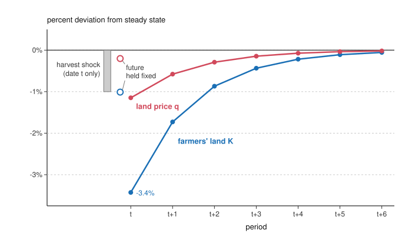

# Economics of Debt · Lesson 3.4: Kiyotaki-Moore: collateral cycles

> ⏱ ~15 min · Module 3: Banks, runs, collateral and amplification · Builds on: [3.3 The financial accelerator](03-03-the-financial-accelerator.md), [1.3 Pledgeable income, collateral and monitors](01-03-pledgeable-income-collateral-and-monitors.md) · Unlocks: [3.5 The leverage cycle](03-05-the-leverage-cycle.md), [4.1 Fisher's debt-deflation, formalized](04-01-fishers-debt-deflation-formalized.md)

## Why this matters

Most borrowing is secured on something with a market price: land, buildings, houses. The price decides how much can be borrowed, and the borrowing helps decide the price. Kiyotaki and Moore (1997, *JPE*) worked out what that loop does over time. A small shock that lasts one period becomes a large fall in asset prices and in borrowers' holdings that lasts many periods, and it is large *because* it lasts. Their working paper (NBER Working Paper 5083, 1995) cites Japan, where much business borrowing was secured on real estate and where, by their count, land-value gains over 1986–90 and losses over 1990–94 each exceeded a year's GDP.

## The idea

Farmers are good at farming but can borrow only against their land: a farmer can walk away from his crop, but not with his fields. Say land sells for 5 a plot, and lenders advance 4 against each plot, because at 25 percent interest a season 4 grows to 5, what the plot will fetch next season. A farmer whose land is worth exactly what he owes has one asset left, his harvest of 1, and with it he can put 1 down on one plot.

Now the harvest comes in 1 percent short. He can put down only 0.99, so he holds less land, and someone must take up the rest: gatherers, who get less out of land and hold more of it only if holding land gets cheaper. So the land price falls. His plot is worth less and his debt is not, so every 1 percent off the price takes 0.05 off his net worth of 1, five times the harvest loss.

Next season he has less land, so a smaller harvest, so less to put down, so less land again. The shortfall fades slowly, so gatherers must be coaxed into holding extra land for many seasons, which takes a lower cost of holding land in each of them. Today's price is the value of holding land through all those seasons, so it falls by far more than one lean season would justify, and that bigger fall cuts his net worth today, which deepens every later shortfall. In the economy below, the land price falls about 1 percent and the farmers' land about 3 percent on impact, and the gap halves each season. The shock lasted one season.

## The formal version

**Setup** ([Kiyotaki-Moore](../reference.md#kiyotaki-moore), basic model). Land never depreciates and its supply is fixed. The one good is fruit, which cannot be stored; $q_t$ is the price of land in fruit (a land price here, not a bond price). Everyone is risk neutral and discounts at gross rate $R>1$, which is therefore the gross interest rate.

- *Farmers* (mass 1): land $k_t$ held at date $t$ yields $(a+c)\,k_t$ fruit at $t+1$. Only $a\,k_t$ can be sold; the farmer eats the rest. Kiyotaki and Moore assume $c>(R-1)a$, which makes expanding the farm worth it, so farmers borrow all they can.
- *Gatherers*: they turn land $k'_t$ into $G(k'_t)$ fruit next period, with diminishing returns, and are never constrained. In equilibrium they are the lenders.

A farm's fruit needs the farmer's own labor, which he cannot commit to supply: his human capital is [inalienable](../reference.md#inalienable-human-capital), Hart and Moore's point from [1.3](01-03-pledgeable-income-collateral-and-monitors.md). So lenders lend only against the land, and never more than it will fetch:

$$R\,b_t \le q_{t+1}\,k_t,$$

that is, $b_t \le q_{t+1}k_t/R$, where $b_t$ is what the farmer borrows at $t$. *In words:* the [collateral constraint](../reference.md#collateral-constraint) caps debt plus interest at next period's value of the land.

**Farmers' demand.** Near the steady state the constraint binds, and farmers consume only the fruit they cannot sell. With $K_t$ the farmers' total land and $B_t$ their total debt,

$$\begin{aligned} K_t &= \frac{(a+q_t)\,K_{t-1} - R\,B_{t-1}}{u_t}, \\ u_t &\equiv q_t - \frac{q_{t+1}}{R}. \end{aligned}$$

*In words:* land equals net worth (harvest plus land, minus the debt now due) divided by the down payment per plot, which is the price less what a lender advances against it.

**Gatherers and the price.** A gatherer holds land until $G'(k'_t)/R = u_t$: the discounted fruit from one more plot equals the cost of holding it a period (buy at $q_t$, sell next period for $q_{t+1}$, worth $q_{t+1}/R$ today). So $u_t$, the [user cost of land](../reference.md#user-cost-of-land), is both the gatherers' holding cost and the farmers' down payment. Clearing the land market gives $u_t = u(K_t)$, increasing: when farmers hold more land, gatherers hold less and value a plot more at the margin. Let $\eta$ be the elasticity of the land supply facing farmers with respect to the user cost, $1/\eta = d\ln u/d\ln K$ at the steady state. Solving $q_t = u_t + q_{t+1}/R$ forward with no bubble ([grad-macro 3.3](../../grad-macro/lessons/03-03-money-rational-bubbles.md)),

$$q_t = \sum_{s=0}^{\infty} R^{-s}\,u(K_{t+s}).$$

*In words:* land is worth the discounted stream of its future user costs, as a share is worth its dividends. Anything that lowers the farmers' land in later periods lowers today's price.

**Steady state.** Constant land and prices need the harvest to cover exactly the down payment on the same land, $u^*=a$, so

$$q^* = \frac{R\,a}{R-1}.$$

*In words:* the debt due is $RB^*=q^*K^*$, so farmers owe exactly what their land is worth. Lenders advance $1/R$ of the price, the [loan-to-value](../reference.md#loan-to-value) ratio, and net worth is only the harvest $aK^*$, so land is $R/(R-1)$ times net worth.

**The shock.** At date $t$, unexpectedly and for one period only, the harvest is $1+\Delta$ times normal ($\Delta<0$ is a shortfall). The debt now due, $q^*K^*$, is fixed, but the land farmers hold is revalued at $q_t$. From then on the debt due always equals the land's value, so net worth is just the harvest from last period's land:

$$\begin{aligned} u(K_t)\,K_t &= \big[(1+\Delta)\,a + q_t - q^*\big]\,K^*, \\ u(K_{t+s})\,K_{t+s} &= a\,K_{t+s-1}, \quad s\ge1. \end{aligned}$$

With hats for percent deviations from the steady state, the first-order versions are

$$\begin{aligned} \Big(1+\frac1\eta\Big)\hat K_t &= \Delta + \frac{R}{R-1}\,\hat q_t, \\ \hat K_{t+s} &= \Big(\frac{\eta}{1+\eta}\Big)^{s}\hat K_t. \end{aligned}$$

*In words:* the date-$t$ hit to net worth is the shock plus the capital loss, which leverage scales up by $R/(R-1)$. A falling down payment cushions part of it (the $1/\eta$). After that, each period's shortfall in land is the fraction $\eta/(1+\eta)$ of the last, because net worth is the harvest from last period's land.

**The price, and two multipliers.** Linearizing the price sum and using that decay,

$$\begin{aligned} \hat q_t &= \frac{R-1}{R\eta}\sum_{s\ge0} R^{-s}\,\hat K_{t+s} \\ &= \frac{R-1}{R\eta}\cdot\frac{\hat K_t}{1-\eta/[R(1+\eta)]}. \end{aligned}$$

Solving this with the date-$t$ equation gives

$$\begin{aligned} \hat q_t &= \frac{\Delta}{\eta}, \\ \hat K_t &= \frac{\eta}{1+\eta}\Big(1 + \frac{R}{(R-1)\,\eta}\Big)\Delta. \end{aligned}$$

*In words:* the land price moves by the shock divided by $\eta$, and the farmers' land by a multiple of the shock. Kiyotaki and Moore contrast this with the [static multiplier](../reference.md#static-and-dynamic-multipliers), the loop within date $t$ alone. Hold $q_{t+1}$ at $q^*$, so that only the first term of the sum survives, and the same algebra gives $\hat q_t = \frac{R-1}{R\eta}\Delta$ and $\hat K_t = \Delta$. *In words:* the dynamic multiplier moves the price $R/(R-1)$ times as much as the static one, because it prices the whole persistent shortfall into today's land.

## Picture

Exact equilibrium paths (not the linear approximation) for Example 1's economy; both deviations roughly halve each period. The open circles are the date-$t$ responses with the future price held fixed: the static multiplier alone.

## Worked examples

**Example 1 (the model on a clean case).** Take $a=1$, $K^*=1$, $R=1.25$ and $u(K)=aK/K^*$, a user cost proportional to the farmers' land (the gatherers' marginal product falls linearly, to zero if they hold all the land), so $\eta=1$.

- *Steady state.* $q^* = 1.25/0.25 = 5$. Lenders advance $5/1.25 = 4$ a plot, a loan-to-value ratio of 80 percent, and the down payment is $u^*=1$. Farmers owe 5, hold land worth 5, and have net worth 1.
- *The static loop,* with $\Delta=-1\%$ and $q_{t+1}$ held at 5. Round one: net worth falls 1 percent and land 0.5 percent, since the down payment falls with it. Today's user cost falls by 0.005, and so, with the future fixed, does today's price: a capital loss of 0.5 percent of net worth. Each round is half the last, so net worth falls 2 percent, land 1 percent, and the price 0.01, which is 0.2 percent.
- *The full response.* $\hat q_t = -1\%$ and $\hat K_t = \tfrac12(1+5)(-1\%) = -3\%$, then $-1.5\%$, $-0.75\%$, and so on. Net worth falls 6 percent: 1 point from the harvest and 5 from the capital loss. In levels the price falls by 0.05. Today's user cost is 0.03 lower, next period's 0.015 lower (worth 0.012 today), the next 0.0075 lower (worth 0.0048), and in all $0.03/(1-0.4) = 0.05$. Three-fifths of the fall is today's user cost, itself three times its static size; two-fifths is later periods'. As a loop, each round now returns $5/6$ of the last instead of $1/2$, so net worth falls six times the shock instead of twice.
- *The exact model.* Solving the nonlinear equations gives $-3.43\%$ for land and $-1.15\%$ for the price. A 1 percent windfall raises them by only $2.73\%$ and $0.91\%$: busts are bigger than booms.

**Example 2 (why you'd care: debt as the shock).** Same economy, but the farmers' debt is written in money, and the price level comes in 0.2 percent below what the contract assumed. The real value of the 5 they owe rises by about 0.01, the same blow to net worth as the short harvest, so land prices fall about 1 percent and farmers' land about 3 percent with no crop failure at all. In Kiyotaki and Moore's general form: since debt is $R/(R-1)$ times net worth, a surprise of $(R-1)/R$ percent in its value does what a 1 percent productivity shock does. This is Fisher's [debt deflation](../reference.md#debt-deflation) ([4.1](04-01-fishers-debt-deflation-formalized.md)) working through collateral values instead of through spending.

Who gains and who pays? Creditors gain 0.01 per plot on the debt itself. Farmers lose about six times that, because the price fall the transfer sets off wipes out another 0.05 of their equity. Output is lower in every later period, because land moves from farmers, who produce $a+c$ per plot, to gatherers, whose marginal product at the steady state is $Ra<a+c$. Run it backward: a surprise write-down of 0.2 percent of farmers' debt raises land prices about 1 percent. Creditors pay 0.01, and farmers gain 0.06 to first order, five-sixths of it a capital gain on land they already hold. If lenders came to expect write-downs, they would advance less against each plot beforehand.

## Watch out

- **You might think the amplification is the loop within the period** (low net worth, less land, lower price, lower net worth). **Actually,** with the future held fixed that loop moves the price only 0.2 percent in Example 1. The full 1 percent comes from pricing lower user costs in every later period.
- **You might think persistence needs a persistent shock.** **Actually,** the harvest is normal again from $t+1$. The shortfall lasts because farmers carry no equity in land from one period to the next: their debt due always equals the land's value, so net worth is the harvest, and a farmer with less land has less harvest.
- **You might think the linear formulas hold for any shock.** **Actually,** the exact model is asymmetric (Example 1) and can break: in Example 1's economy a shortfall beyond about 2.3 percent leaves the equations with no solution (at $R=1.05$, with loans at 95 percent of value, beyond 0.16 percent). Even with no shock there is a second, self-fulfilling equilibrium, which Kiyotaki and Moore flag, with 27 percent less land in farmers' hands at a price 9 percent lower: expected low holdings mean a low price, low net worth and low holdings.

## One-liner

> When land is both what farmers farm with and what they borrow against, a one-period loss becomes a many-period shortfall in their net worth, and because today's land price capitalizes the whole shortfall, the loss comes back multiplied.

## Problems

**P1 (🟢) *(Formal.)*** An economy has Kiyotaki and Moore's structure with $R=1.2$ and $\eta=2$, and the harvest at date $t$ comes in 1 percent short ($\Delta=-0.01$). Use the first-order formulas. (a) Find the steady-state loan-to-value ratio and the ratio of the farmers' land value to their net worth. (b) With the future price held at its steady state (the static multiplier), find $\hat q_t$, $\hat K_t$ and the percent change in farmers' net worth. (c) In full equilibrium, find $\hat q_t$, $\hat K_t$ and $\hat K_{t+2}$, and the ratio of the full to the static price response. Percentages to two decimals.

**P2 (🟡) *(Formal (a)–(b) · Exegetical (c).)*** Take $R=1.1$ and $a=1$, so the steady-state land price is 11. A farmer arrives at date $t$ holding 2 plots, harvests 2 of saleable fruit, and owes 22 (a loan of 20 plus interest). (a) With $q_t=q_{t+1}=11$, find his net worth, the loan per plot, the down payment per plot and the land he holds. Then keep $q_t=11$ but let lenders expect $q_{t+1}$ to be 2 percent lower, and recompute the down payment and his land, holding everything else fixed. (b) Instead let both $q_t$ and $q_{t+1}$ fall 2 percent. Recompute his net worth, down payment and land. (c) Kiyotaki and Moore note that when $q_t$ and $q_{t+1}$ move in proportion, the farmers' land demand can move the same way as the price. State the condition on a farmer's balance sheet under which it does, and why the steady state meets it. Two sentences.

**P3 (🔴, optional) *(Formal (a) · Exegetical (b).)*** Return to P1's economy and shock. (a) Suppose instead that gatherers will hold any amount of land at the steady-state user cost $a$, so that $u(K)=a$ whatever $K$ (the limit $\eta\to\infty$). Find, exactly, the land price at every date and the farmers' land at $t$, $t+1$ and $t+10$, relative to the steady state. (b) P1(b) is what would happen if a transfer at $t+1$, known at date $t$, restored farmers' net worth, so that land holdings and the price are back at the steady state from $t+1$ on. Using P1(b), P1(c) and (a), name the ingredient that produces persistence (the internal propagation that [grad-macro 4.3](../../grad-macro/lessons/04-03-propagation-impulse-responses.md) found too weak in the RBC model), name the ingredient that turns persistence into a large price fall, and say which of them each counterfactual switches off. Three sentences.

Solutions

**P1** *(Formal.)*

(a) The loan-to-value ratio is $1/R = 1/1.2 = 83.33\%$, and land is $R/(R-1) = 6$ times net worth.

(b) With the future fixed, $\hat q_t = \dfrac{R-1}{R\eta}\,\Delta = \dfrac{0.2}{2.4}(-1\%) = -0.08\%$ (exactly $-1/12$ of a percent), and $\hat K_t = \Delta = -1.00\%$. Net worth changes by $\Delta + 6\,\hat q_t = -1\% - 0.5\% = -1.50\%$. Check with the date-$t$ equation: $(1+\tfrac12)(-1\%) = -1.5\%$.

(c) In full equilibrium $\hat q_t = \Delta/\eta = -0.50\%$. Net worth changes by $-1\% + 6\times(-0.5\%) = -4.00\%$, so $\hat K_t = -4\%/1.5 = -2.67\%$. The formula agrees: $\tfrac23\big(1+\tfrac{1.2}{0.2\times2}\big)(-1\%) = \tfrac23\times4\times(-1\%)$. The decay factor is $\eta/(1+\eta) = 2/3$, so $\hat K_{t+1} = -1.78\%$ and $\hat K_{t+2} = \tfrac49\times(-2.67\%) = -1.19\%$. Check the price: $\frac{R-1}{R\eta} = \frac1{12}$ and $1/\big(1-\tfrac{2/3}{1.2}\big) = \tfrac94$, so $\hat q_t = \tfrac1{12}\times\tfrac94\times(-2.67\%) = -0.50\%$. The full price response is $0.5/0.0833 = 6 = R/(R-1)$ times the static one.

**Wrong turns:** using $1/(1+\eta)$ as the decay factor instead of $\eta/(1+\eta)$; reporting the static response as the model's answer.

---

**P2** *(Formal (a)–(b) · Exegetical (c).)*

(a) Net worth is the harvest 2 plus land $2\times11 = 22$ minus the 22 owed: 2. A lender advances $q_{t+1}/R = 11/1.1 = 10$ a plot, so the down payment is $11-10 = 1$, 9.1 percent of the price, and he holds $2/1 = 2$ plots, borrowing 20 again. With $q_{t+1} = 10.78$ the loan per plot is $10.78/1.1 = 9.8$, the down payment $11 - 9.8 = 1.2$ (20 percent higher), and his land $2/1.2 = 1.67$ plots, 16.7 percent less. A 2 percent fall in the *expected* price raises the down payment ten times as much in percent, because the down payment is a thin difference of two large numbers.

(b) Net worth is $2 + 2\times10.78 - 22 = 1.56$, 22 percent lower. The down payment is $10.78 - 9.8 = 0.98$, 2 percent lower. Land is $1.56/0.98 = 1.59$ plots, 20.4 percent less: the price fell, and he wants less land.

**Must hit, strict (c):**

- The condition: the debt now due exceeds current saleable output, $RB_{t-1} > aK_{t-1}$ (here $22 > 2$).
- The reason: with $q_t = q_{t+1} = q$, land demand is $\big[(a+q)K_{t-1} - RB_{t-1}\big]/\big[q\,(1-1/R)\big]$, whose derivative in $q$ has the sign of $RB_{t-1} - aK_{t-1}$. Leverage makes net worth rise faster than in proportion to the price, while the down payment rises only in proportion.
- The steady state: $RB^* = q^*K^* = \frac{R}{R-1}\,aK^* > aK^*$.

**Wrong turns:** advancing $q_t/R$ rather than $q_{t+1}/R$, which makes the second half of (a) show no effect at all; leaving out the capital loss on the 2 plots in (b), which makes land *rise* to $2/0.98 = 2.04$ plots.

**Model answer (c):** A proportional price rise raises land demand exactly when the debt now due exceeds current saleable output, $RB_{t-1} > aK_{t-1}$, since then net worth rises more than in proportion to the price while the down payment rises only in proportion. At the steady state the debt due equals the land's value, which is $R/(R-1)$ times output, so the condition holds with room to spare.

---

**P3** *(Formal (a) · Exegetical (b).)*

(a) With $u$ constant at $a$, every term of the price sum is $a$, so $q_t = \sum_s R^{-s}a = Ra/(R-1) = q^*$ at every date: the price never moves. Net worth at $t$ is $\big[0.99\,a + q^* - q^*\big]K^* = 0.99\,aK^*$, and land is net worth over the down payment $a$, so $K_t = 0.99\,K^*$. Next period net worth is $aK_t$, so $K_{t+1} = K_t$, and so on: the farmers' land is 1 percent below the steady state at $t$, $t+1$, $t+10$ and forever. No linearization is involved.

**Must hit, strict (b):**

- Persistence comes from net worth carried forward: the debt due equals the land's value, so next period's net worth is the harvest from this period's land, and a shortfall in land reproduces itself. It shrinks only as a falling user cost lets farmers rebuy, by the factor $\eta/(1+\eta)$ each period ($2/3$ in P1); in (a) nothing lets them rebuy, so it never dies.
- The large price fall comes from a forward-looking price that capitalizes lower user costs in every future period, together with leverage $R/(R-1)$, which turns that price fall into a large loss of net worth.
- (a) switches off the price response: persistence without amplification, with land 1 percent lower forever and the price unchanged. P1(b) switches off persistence: the price falls $0.08\%$ instead of $0.50\%$, and land $1.00\%$ instead of $2.67\%$.

**Wrong turns:** crediting the collateral constraint alone with the amplification (in (a) the constraint binds and nothing is amplified); saying persistence comes from forward-looking prices (in (a) the price never moves and persistence is complete).

**Model answer (b):** Persistence comes from net worth: because the debt due always equals the land's value, next period's net worth is the harvest from this period's land, so less land today means less land tomorrow, and in (a), where nothing lets farmers rebuy, the shortfall is permanent. The large price fall comes from a forward-looking price that capitalizes the lower user costs of all those future periods, which leverage turns into a large loss of net worth. Counterfactual (a) switches off the price response and leaves persistence without amplification, while P1(b) switches off persistence and leaves a price fall of $0.08\%$ instead of $0.50\%$.

## Flashback

**From Lesson [3.2](03-02-stopping-runs.md) (Stopping runs):** *(Formal.)* A bank holds 1 from each of a mass 1 of depositors, and a share $\pi=0.3$ of them are impatient and withdraw at date 1. Its project returns $R=1.5$ per unit at date 2, or 1 per unit if liquidated at date 1. The bank promises $c_1$ on demand, so a patient depositor gets $c_2=R(1-\pi c_1)/(1-\pi)$ when only the impatient withdraw. Each unit of cash the bank must raise beyond the impatient's needs costs the waiters $\kappa$ units at date 2: $\kappa=\rho$ if a central bank lends against the project at gross rate $\rho$, and $\kappa=R/\ell$ if the bank instead sells project units at price $\ell\le1$. When a share $f$ of depositors withdraws, each waiter gets $W(f)=\dfrac{(1-\pi)c_2-\kappa c_1(f-\pi)}{1-f}$, and the run is removed if $W(f)\ge c_1$ at every $f<1$. (a) The central bank stands ready to lend at $\rho=1.1$. Find the largest promise $c_1$ (four decimals) for which that removes the run. (b) At that promise, what fire-sale price $\ell$ would let a market sale do the same job, and is that price possible? One sentence.

Solution

Rewrite $W(f)\ge c_1$ as $(1-\pi)(c_2-c_1)\ge c_1(\kappa-1)(f-\pi)$. The right side grows with $f$, so the binding case is $f\to1$, where the condition becomes $c_2\ge\kappa c_1$: the cost of cash must not exceed $c_2/c_1$.

(a) With $\kappa=\rho$ and $c_2$ written out, the condition is $R(1-\pi c_1)\ge\rho(1-\pi)c_1$, so

$$c_1\le\frac{R}{\rho(1-\pi)+R\pi}=\frac{1.5}{1.1\times0.7+1.5\times0.3}=\frac{1.5}{1.22}=1.2295.$$

At this promise $c_2=1.5\times(1-0.3\times1.2295)/0.7=1.3525$ and $c_2/c_1=1.1=\rho$, and waiting pays exactly $c_2$ at every $f$. With no tool ($\kappa=R$) the same algebra gives $c_1\le1$, so the lender raises the largest run-proof promise from 1 to 1.2295.

(b) At this promise the run is removed only if $\kappa\le c_2/c_1=1.1$, that is $R/\ell\le1.1$, so $\ell\ge1.5/1.1=1.364$. No such price is possible, since $\ell\le1$: even a sale at par ($\ell=1$) costs the waiters $\kappa=R=1.5$ per unit of cash, because every unit sold gives up its date-2 return. The lender works because it replaces the market's cost of cash, at best $R$, with its own rate.

**Wrong turns:** solving $c_1=c_2/\rho$ with $c_2$ frozen at its value for a smaller promise ($1.3714$ at $c_1=1.2$ gives $1.2468$), which forgets that $c_2$ falls as the promise rises; at $1.2468$ the ratio $c_2/c_1$ is $1.076<1.1$ and the run returns once more than 0.831 of depositors withdraw. Reading a sale at par as costless ($\kappa=1$) instead of $\kappa=R$.

## Connections

- **Backward:** [1.3](01-03-pledgeable-income-collateral-and-monitors.md) explained why only the land can be pledged, and valued it at a fixed liquidation value; here that value is a market price, $q_{t+1}$, that moves with credit. [3.3](03-03-the-financial-accelerator.md) let net worth set the *price* of outside funds; here it sets the *quantity*, through collateral, and the asset price makes the effect dynamic. The persistence factor $\eta/(1+\eta)$ is internal propagation of the kind [grad-macro 4.3](../../grad-macro/lessons/04-03-propagation-impulse-responses.md) found too weak in the RBC model.
- **Forward:** [3.5](03-05-the-leverage-cycle.md) lets the loan-to-value ratio move, where here it is pinned at $1/R$. [4.1](04-01-fishers-debt-deflation-formalized.md) freezes the collateral's price and follows what forced repayment does to spending; Example 2 is the same Fisher mechanism on the asset-price side. Each farmer here takes the land price as given, though it sits inside every farmer's constraint, and [4.4](04-04-overborrowing.md) asks when that makes privately chosen borrowing too high. [8.1](08-01-forgiveness-commitment-and-the-fresh-start.md) sets the ex post gains of a write-down like Example 2's against what expected relief does to lending.
- **Sideways:** in the debt thread, [history-of-debt 6.1](../../history-of-debt/lessons/06-01-the-american-mortgage-and-2008.md) tells the 2008 mortgage story; a fall in house prices that shrinks what owners can borrow is this lesson's mechanism with houses for land. [theology-of-debt 1.3](../../theology-of-debt/lessons/01-03-the-jubilee-the-land-is-mine.md) prices a field sold before the Jubilee by the harvests left to run, an undiscounted cousin of pricing land by its future user costs. Whether a write-down is fair to creditors, or to borrowers who paid, is [philosophy-of-debt 5.2](../../philosophy-of-debt/lessons/05-02-moral-hazard-and-fairness-to-those-who-paid.md)'s question.
