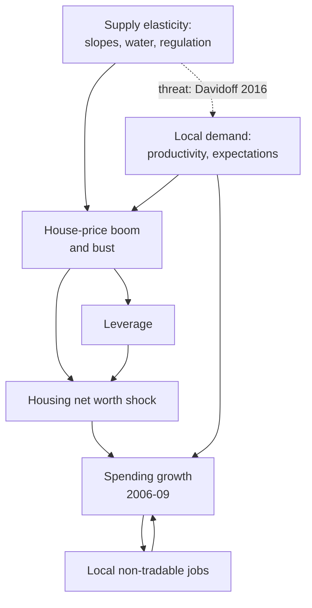

# Economics of Debt · Lesson 4.3: Household debt and the Great Recession: the evidence

> ⏱ ~15 min · Module 4: Debt-deflation, Minsky and 2008 · Builds on: [4.1 Fisher's debt-deflation, formalized](04-01-fishers-debt-deflation-formalized.md), [4.2 Minsky, informally and formally](04-02-minsky-informally-and-formally.md) · Unlocks: [4.4 Overborrowing](04-04-overborrowing.md), [8.3 Relief written into the contract](08-03-relief-written-into-the-contract.md)

## Why this matters

[4.1](04-01-fishers-debt-deflation-formalized.md)'s model rests on an empirical claim: households in debt cut spending by more per dollar of lost wealth than households without it. The 2006–09 housing bust is the test. House prices fell nationwide, but the damage to balance sheets was wildly uneven: the hardest-hit tenth of ZIP codes lost 45 percent of their net worth to the housing collapse, while the least-hit tenth gained slightly (Mian, Rao and Sufi 2013, *QJE*). This lesson reads the research program Mian, Sufi and co-authors built on that unevenness as a set of designs: what each compares, what must hold for it to be causal, and where critics push. The episode, and the dispute over who did the borrowing, are in [`history-of-debt` 6.1](../../history-of-debt/lessons/06-01-the-american-mortgage-and-2008.md).

## The idea

Ana and Ben own identical 100,000-dollar houses. Ana owes nothing; Ben owes 80,000. Prices fall 10 percent. Ana loses a tenth of her net worth. Ben's equity falls from 20,000 to 10,000, half his net worth: the same price fall hits him five times as hard, and he can no longer borrow against the house. If spending follows net worth, especially if home equity was Ben's credit line, his spending falls much further than Ana's.

Showing this in data is hard. Where house prices fell most, people may have cut spending anyway, because a local industry was collapsing or incomes were expected to fall, and a regression of spending on housing losses mixes the two. The researcher needs something that enlarged housing losses in some places for reasons unrelated to local demand.

Mian and Sufi's answer is geography. In a metro area hemmed in by ocean and mountains, the credit boom of the 2000s could not be met by building, so it went into prices, and homeowners borrowed against them. When the boom reversed, those metros had the biggest busts. In a flat metro that could build easily, more of the boom went into new houses. Comparing the two is the design: geography plays the lottery, the loss of housing net worth is the treatment, and spending is the outcome.

## The formal version

**The shock.** For households in county (or ZIP code) $i$, let $F_i$ be financial assets, $H_i$ the value of their housing, $D_i$ their debt and $NW_i = F_i + H_i - D_i$ their net worth, all per household in 2006, and let $g_i$ be house-price growth from 2006 to 2009. The [housing net worth shock](../reference.md#housing-net-worth-shock) is

$$s_i = \frac{g_i H_i}{NW_i}, \qquad\text{which equals}\qquad s_i = \frac{g_i}{1-\ell_i}\ \text{ when } F_i = 0,$$

where $\ell_i = D_i/H_i$ is the loan-to-value ratio (LTV). *In words:* the share of net worth the price change wipes out; leverage divides the price change by the owner's equity share, so an 80 percent LTV quintuples it.

**The equation.** With $C_i$ spending per household,

$$\Delta \log C_i = \alpha + \eta\, s_i + \varepsilon_i ,$$

where $\eta$ is the elasticity of spending with respect to housing net worth and $\varepsilon_i$ is everything else that moved local spending. *In words:* if regions insured one another fully, the representative-agent benchmark, local losses would not move local spending and $\eta = 0$. Since $\Delta \log C_i \approx \Delta C_i/C_i$ and $s_i = \Delta H_i/NW_i$, the [MPC out of housing wealth](../reference.md#mpc-out-of-housing-wealth) is

$$\frac{\Delta C_i}{\Delta H_i} = \eta\,\frac{C_i}{NW_i}.$$

*In words:* the elasticity is percent per percent of net worth, the MPC is cents per dollar of house value, and one elasticity gives more cents where net worth is thin relative to spending.

**The design.** OLS fails because local demand moves both house prices and spending, so $\operatorname{Cov}(s_i,\varepsilon_i) \neq 0$. Mian, Rao and Sufi instrument $s_i$ with $Z_i$, the metro [housing supply elasticity](../reference.md#supply-elasticity-instrument) of Saiz (2010, *QJE*), built from satellite data on land lost to steep slopes and water, plus land-use regulation. With first stage $s_i = \pi_0 + \pi Z_i + v_i$ and reduced form $\Delta\log C_i = \rho_0 + \rho Z_i + w_i$, the IV estimate is $\hat\eta = \hat\rho/\hat\pi$ ([econometrics 3.6](../../econometrics/lessons/03-06-instrumental-variables.md)). The [exclusion restriction](../reference.md#exclusion-restriction) is $\operatorname{Cov}(Z_i,\varepsilon_i) = 0$. *In words:* supply elasticity moves 2006–09 spending only through what it did to housing net worth. If it also has a direct effect $\delta$, so that $\rho = \eta\pi + \delta$, then

$$\hat\eta_{IV} \;\to\; \eta + \frac{\delta}{\pi},$$

econometrics 3.6's bias formula (its P3). *In words:* a violation is divided by the first stage, so a strong first stage dilutes it and a weak one magnifies it.

**What it estimates.** IV recovers the effect where the instrument moved the treatment ([econometrics 3.8](../../econometrics/lessons/03-08-weak-instruments-and-late.md)): metros whose boom and bust geography amplified. It also counts a feedback that runs through $s_i$ and so violates nothing: lost spending cost local restaurant and retail jobs, which cut spending again. The result is a local total effect.

**Results** (Mian, Rao and Sufi 2013). Across 944 counties OLS gives $\hat\eta = 0.63$, or 0.59 with industry and income controls; IV on the 540 counties with a Saiz measure gives 0.77 (standard error 0.24). The MPC is 5.4 cents per dollar by OLS and 7.2 by IV. On car purchases, the one spending category they observe by ZIP code, ZIP codes with LTV below 30 percent cut spending by about 1 cent per dollar of lost home value and those at 90 percent or more by three times that; the poorest ZIP codes (average income under 35,000 dollars) cut almost three times as much as the richest (over 200,000). Levered and poorer ZIP codes also lost more home-equity credit and refinancing, a credit channel.

**Critics.** Davidoff (2016, *Critical Finance Review*): supply constraints are invalid instruments for home prices, because constrained markets are high-demand markets. Supply grew *more* there in recent decades, constraints track productivity proxies (historical education, immigration, nationwide growth of local industries), and some of the wildest cycles were in flat inland California. Mian, Rao and Sufi's balance checks: inelastic metros show no differential wage growth in 2002–06 over 1998–2002 and no different construction exposure, and their higher income and wealth *levels* difference out. Guren, McKay, Nakamura and Steinsson (2021, *REStud*) instrument with cities' systematic exposure to regional house-price cycles and find housing wealth effects more precise and smaller than recent estimates, though still important, and not especially large in the 2000s.

**Four more designs.**

- *Jobs.* Mian and Sufi (2014, *Econometrica*): where housing net worth fell more, more non-tradable jobs (retail, restaurants) were lost, while tradable losses, driven by national demand, were spread evenly (their 2012 working paper). Tradables are the control group in a [difference-in-differences](../../econometrics/lessons/04-03-difference-in-differences.md) across sectors.
- *Foreclosures.* Campbell, Giglio and Pathak (2011, *AER*): foreclosed Massachusetts houses sold at an average discount of 27 percent, and a foreclosure 0.05 miles away cut a house's price by about 1 percent. Mian, Sufi and Trebbi (2015, *JF*): states with no judicial requirement foreclosed on delinquent borrowers twice as often; at state borders foreclosures jump while credit scores, incomes and education do not (a [regression discontinuity](../../econometrics/lessons/04-07-regression-discontinuity.md)); with the law as instrument, foreclosures cut house prices, residential investment and consumer demand. This [foreclosure externality](../reference.md#foreclosure-externality) lands on neighbors who never signed the mortgage; a judicial requirement slows foreclosure, shifting loss from neighbors to lenders, who will price it in.
- *Overhang.* Melzer (2017, *JF*): owners at risk of default cut home improvements and principal payments, even when they look unconstrained, but not the cars and furniture they would keep in default: [2.4](02-04-debt-overhang.md)'s [debt overhang](../reference.md#debt-overhang) inside a household.
- *Other countries.* Mian, Sufi and Verner (2017, *QJE*), 30 countries, 1960–2012: a rise in household debt to GDP over three years predicts lower growth over the next three and higher unemployment. Low mortgage spreads predict both the rise and the slowdown, forecasters overpredict growth at the end of such booms, and the link is stronger under less flexible exchange rates. As with Schularick and Taylor in [4.2](04-02-minsky-informally-and-formally.md), the regression is prediction; the spread instrument carries the causal claim.

## Picture

Geography must reach spending only through the housing net worth shock; the jobs loop sits downstream of it, so it is part of the effect. Local demand is why OLS fails; the dashed edge, geography correlated with local demand, is why IV might.

## Worked examples

**Example 1 (clean): the design on invented numbers.** Two ZIP codes; the typical household has a 300,000-dollar house and spends 24,000 a year. In A it owes 60,000 and holds 60,000 of financial assets, so $NW_A = 300{,}000$; in B it owes 240,000 and holds 20,000, so $NW_B = 80{,}000$. Prices fall 10 percent, a loss of 30,000 in each.

- *Shocks:* $s_A = -30/300 = -10\%$ and $s_B = -30/80 = -37.5\%$, 3.75 times as large. B's LTV rises from 80 to 89 percent and its equity halves.
- *Wald estimate:* across county groups, inelastic counties' shock averaged 16 points more negative than elastic counties' (first stage) and their spending growth 11.2 points lower (reduced form), so $\hat\eta = 11.2/16 = 0.7$.
- *MPCs:* $0.7 \times 24/300 = 0.056$ in A and $0.7 \times 24/80 = 0.21$ in B, so the same 30,000 loss cuts spending by 1,680 dollars in A and 6,300 in B. Per percent of net worth lost the two respond identically; B's MPC is 3.75 times A's because its net worth is thin.
- *Bias:* if 1.6 of the 11.2 points would have happened anyway, the true $\eta$ is $9.6/16 = 0.6$, a bias of $1.6/16 = 0.1$. With a first stage of only 4 points, the same 1.6 would bias the estimate by $1.6/4 = 0.4$.

**Example 2 (why you'd care): who defaulted.** Adelino, Schoar and Severino (2016, *RFS*) find, borrower by borrower, that mortgage originations rose at all incomes and credit scores, that mortgage growth tracked income growth through 2006, and that middle-income, high-income and prime borrowers sharply increased their *share* of delinquencies in the crisis. They read this as a demand-side story: buyers and lenders bet on rising prices, and borrowers defaulted when prices fell. Mian and Sufi (2017, *RFS*) reply that incomes stated on applications outgrew IRS incomes where credit grew fastest, a sign of fraud, so application income misleads. The share claim needs care. Invented numbers: low-, middle- and high-income borrowers hold 20, 50 and 30 percent of mortgage balances.

| Default rate | Low | Middle | High | Middle and high share of defaults |
|---|---|---|---|---|
| Normal year | 6% | 1% | 0.5% | 35.1% |
| Crisis | 18% | 8% | 5% | 60.4% |

Group $k$'s [share of defaults](../reference.md#default-shares-versus-default-rates) is $w_k r_k / \sum_j w_j r_j$, where $w_k$ is its share of balances and $r_k$ its default rate. The middle and high groups' share jumps 25 points and their rates rise eight- and tenfold, yet the low-income rate is still the highest and rose most in points (12, against 7 and 4.5). Both accounts can claim this table. What would split them is who took on the *extra* debt in the boom, measured borrower by borrower with a clean income measure. And none of it touches $\eta$: that is about how spending responded to a loss, not about who borrowed.

## Watch out

- **You might think a cross-county estimate measures the national effect, but actually it is [relative](../reference.md#relative-versus-aggregate-effects).** Whatever hit all counties alike (monetary policy, federal transfers, national demand) is differenced out. Mian, Rao and Sufi's estimate that housing losses explain almost 40 percent of the 2006–09 spending shortfall against trend assumes no general-equilibrium shift in the national level, as they note; aggregating takes a model such as [4.1](04-01-fishers-debt-deflation-formalized.md)'s.
- **You might think IV close to OLS validates the instrument, but actually** agreement is consistent with both being biased the same way. Balance checks and Davidoff's correlations are evidence on exclusion, not tests of it.

## One-liner

> Geography decided where the housing bust hit, leverage decided how much of it fell on net worth, and spending fell most where debt was highest; county comparisons cannot deliver the national total, and they cannot settle who did the borrowing.

## Problems

**P1 (🟢) *(Formal.)*** Across metro counties, an illustrative study finds that each extra unit of the Saiz supply elasticity makes the 2006–09 housing net worth shock 2.5 percentage points less negative and spending growth 1.5 points higher. (a) Find the IV estimate of $\eta$. (b) Two households each spend 40,000 dollars a year; one has net worth 500,000, the other 125,000. Find each one's MPC out of housing wealth implied by (a). (c) A 50,000-dollar fall in home values will land entirely on one of the two. How much does spending fall in each case?

**P2 (🟡) *(Formal (a)–(b) · Exegetical (c).)*** An invented study of the bust reports an IV estimate of $\eta = 0.9$: inelastic counties' housing net worth shock was 10 points more negative than elastic counties' (the first stage). OLS gives 0.5. (a) What reduced form does this imply? If inelastic counties' spending growth would have been 2 points lower even with no housing loss, what is the corrected estimate, and what was the bias? (b) How large would that direct effect have to be for the corrected estimate to equal OLS? (c) State the exclusion restriction. Then classify each claim as *violates exclusion*, *weak instrument* or *not a violation*, with a one-clause reason: (i) inelastic metros host more high-productivity firms whose hiring collapsed in 2008 for reasons unrelated to housing; (ii) the first-stage $F$-statistic is 6; (iii) lost spending in inelastic metros cost local restaurant and retail jobs, which cut spending further; (iv) households in inelastic metros held more stock, and stock prices fell in 2008.

**P3 (🔴, optional) *(Formal (a) · Evaluative (b).)*** Invented crisis-year data: 8 percent of mortgage balances are in default. Low-, middle- and high-income borrowers hold 25, 50 and 25 percent of balances and account for 50, 37.5 and 12.5 percent of defaulted balances. (a) Find each group's default rate, and the ratio of the low-income rate to the high-income rate. (b) Both accounts in Example 2 accept these numbers. Propose one comparison that could move the dispute over who did the extra borrowing: name its unit and income measure, the result each account predicts, and one threat to it. 100 words or fewer; take no side.

Solutions

**P1** *(Formal.)*

(a) With a continuous instrument the IV estimate is still reduced form over first stage: $\hat\eta = 1.5/2.5 = 0.6$.

(b) The MPC is $\eta\,C/NW$:

$$0.6 \times \frac{40{,}000}{500{,}000} = 0.048, \qquad 0.6 \times \frac{40{,}000}{125{,}000} = 0.192,$$

4.8 cents per dollar of lost home value for the first household and 19.2 cents for the second.

(c) On the high-net-worth household: $0.048 \times 50{,}000 = 2{,}400$ dollars. On the low-net-worth household: $0.192 \times 50{,}000 = 9{,}600$, four times as much. Check: that loss is $50/125 = 40\%$ of net worth, and $0.6 \times 40\% = 24\%$ of 40,000 is 9,600. The same aggregate loss cuts spending four times as much when it lands on the thin balance sheet, which is [4.1](04-01-fishers-debt-deflation-formalized.md)'s point that the distribution of a loss, not only its size, sets the fall in demand.

**Wrong turns:** reading 0.6 as 60 cents per dollar (it is percent per percent of net worth); dividing the first stage by the reduced form ($2.5/1.5 = 1.67$).

---

**P2** *(Formal (a)–(b) · Exegetical (c).)*

(a) The reduced form is $0.9 \times 10 = 9$ points. With a direct effect of 2 points, $\rho = \eta\pi + \delta$ gives $\eta = (9-2)/10 = 0.7$, so the reported 0.9 was biased up by $2/10 = 0.2$.

(b) Set $(9-\delta)/10 = 0.5$: $\delta = 4$ points, 44 percent of the reduced form.

**Must hit, strict (c):**

- Exclusion: supply elasticity affects 2006–09 spending growth only through the housing net worth shock, $\operatorname{Cov}(Z_i,\varepsilon_i) = 0$.
- (i) Violates exclusion: geography reaches spending through local incomes, bypassing housing wealth (Davidoff's concern).
- (ii) Weak instrument: a relevance problem; the estimate is pulled toward OLS, its confidence interval is unreliable, and any violation is multiplied by $1/\pi$.
- (iii) Not a violation: the path runs through housing net worth, so the estimate includes this local multiplier and measures a local total effect.
- (iv) Violates exclusion unless the financial net worth shock is controlled: it is a second wealth loss correlated with geography. Mian, Rao and Sufi add that control, and their housing coefficient barely moves (0.634 to 0.613).

**Wrong turns:** calling (iii) a violation because spending feeds back on itself (the feedback is downstream of the treatment); filing (ii) under exclusion; in (b), solving $9 - \delta = 0.5$ and forgetting to divide by the first stage.

**Model answer (c):** Supply elasticity may move 2006–09 spending only through what it did to housing net worth. (i) violates this through local incomes; (ii) is a weak instrument, a relevance problem that also magnifies any violation; (iii) is not a violation, because the jobs channel runs through housing net worth and makes the estimate a local total effect; (iv) violates it unless the stock-market loss is controlled for.

---

**P3** *(Formal (a) · Evaluative (b).)*

(a) A group's default rate is its share of defaulted balances $d_k$ over its share of balances $w_k$, times the overall rate $R = 8\%$: $r_k = R\,d_k/w_k$.

- Low: $8\% \times 50/25 = 16\%$.
- Middle: $8\% \times 37.5/50 = 6\%$.
- High: $8\% \times 12.5/25 = 4\%$.

Check: $0.25 \times 16 + 0.5 \times 6 + 0.25 \times 4 = 8$. The low-income rate is 4 times the high-income rate, although middle- and high-income borrowers account for half of all defaulted balances.

**Must hit, any verdict (b):**

- A comparison with a stated unit (the borrower, or incumbents against in-movers within a ZIP code) and an income measure not taken from the mortgage application (tax records, or income before the boom), since application incomes were overstated where credit grew fastest.
- The result each account predicts, stated so that they differ: credit supply predicts the extra credit, and the later rise in default *rates*, concentrated among borrowers with low verified incomes or scores; the demand view predicts extra credit spread across verified incomes, investors included, with default rates rising wherever prices fell.
- One threat to the comparison: sorting of in-movers, investors holding several mortgages, differences in LTV at origination, or shares read as rates.

**Wrong turns:** proposing default shares as the test (they move with loan shares, as (a) shows); relying on application income; declaring a winner.

**Model answer (b), one of several:** Link each 2003–06 purchase mortgage to the borrower's pre-boom IRS income, and compare incumbents with in-movers within ZIP codes. If credit supply drove the boom, the extra credit in high-growth ZIP codes went disproportionately to incumbents with low verified incomes, and their default rates rose most. If beliefs drove it, extra credit went across the verified-income distribution, much of it to in-movers and investors, and default rates rose with the local price fall at every income. The main threat: who moves in is itself a choice, so sorting on expectations could mimic either pattern.

## Flashback

**From Lesson [4.1](04-01-fishers-debt-deflation-formalized.md) (Fisher's debt-deflation, formalized):** *(Formal.)* Savers (log utility, discount factor $\beta$, endowment $y_s=2$) lend to borrowers who sit at their limit. The limit is cut, unexpectedly and for good, from $D_H=1$ to $D_L=0.8$. The natural rate, the real rate at which the goods market clears at full employment, is then

$$1+r^n_1=\frac{y_s+D_L}{\beta\,(y_s+D_H/P_1)},$$

where $P_1$ is the date-1 price level relative to the level at which the legacy debt $D_H$ was contracted; that debt is fixed in money, while the new limit $D_L$ is in goods. (a) With $P_1=1$, for which values of $\beta$ is $r^n_1$ negative? (b) A saver has $\beta=0.92$. Find $r^n_1$ with $P_1=1$ and again with $P_1=0.9$, and find the values of $\beta$ for which $r^n_1$ is negative at $P_1=0.9$.

Solution

(a) $r^n_1<0$ means $y_s+D_L<\beta\,(y_s+D_H)$, so

$$\beta>\frac{y_s+D_L}{y_s+D_H}=\frac{2.8}{3}=0.933.$$

Only patient savers are pushed below zero: a saver spends about $1-\beta$ of a one-period windfall, so the more patient she is, the lower the rate must fall to make her spend the borrowers' repayment.

(b) At $P_1=1$, $1+r^n_1=2.8/(0.92\times3)=1.0145$, so $r^n_1=+1.45\%$: 0.92 is below 0.933, and the cut alone leaves the natural rate positive. At $P_1=0.9$ the real legacy debt is $1/0.9=1.111$, so

$$1+r^n_1=\frac{2.8}{0.92\times(2+1.111)}=\frac{2.8}{2.862}=0.978,\qquad r^n_1=-2.17\%.$$

The critical patience is now $2.8/(2+1.111)=0.900$, so $r^n_1<0$ for every $\beta>0.900$. Deflation moved the threshold from 0.933 down to 0.900, and a saver at 0.92 crosses it.

**Wrong turns:** deflating the new limit as well ($D_L/P_1$), which gives $r^n_1=+0.93\%$ and hides the slump, when only the legacy debt is fixed in money; multiplying $D_H$ by $P_1$ instead of dividing, which makes deflation look like relief ($+4.95\%$).

## Connections

- **Backward:** [4.1](04-01-fishers-debt-deflation-formalized.md) supplies the claim tested here, a gap in MPCs between the indebted and everyone else; the leverage gradient in car spending is that gap measured, and [grad-macro 6.4](../../grad-macro/lessons/06-04-heterogeneous-agent-taste.md)'s hand-to-mouth households at the borrowing limit are why it exists. Lost home-equity credit is [3.4](03-04-kiyotaki-moore-collateral-cycles.md)'s collateral constraint tightening. The designs are [econometrics 3.6](../../econometrics/lessons/03-06-instrumental-variables.md), [3.8](../../econometrics/lessons/03-08-weak-instruments-and-late.md), [4.3](../../econometrics/lessons/04-03-difference-in-differences.md) and [4.7](../../econometrics/lessons/04-07-regression-discontinuity.md), and the cross-country regression is a forecasting result like those in [4.2](04-02-minsky-informally-and-formally.md).
- **Forward:** [4.4](04-04-overborrowing.md) turns the demand and foreclosure spillovers into a welfare argument: borrowers did not price what their leverage did to other people's spending and house values. [8.3](08-03-relief-written-into-the-contract.md) takes up Mian and Sufi's shared-responsibility mortgage, which writes the sharing of a price fall into the contract, and household overhang returns there.
- **Sideways:** [`history-of-debt` 6.1](../../history-of-debt/lessons/06-01-the-american-mortgage-and-2008.md) tells the episode and maps the dispute over who borrowed; this lesson adds the designs. The ZIP-code-versus-borrower disagreement is the aggregation problem [econometrics 4.1](../../econometrics/lessons/04-01-panel-data-fixed-effects.md) ties to Simpson's paradox. Whether relief for underwater borrowers is fair to those who kept paying is [`philosophy-of-debt` 5.2](../../philosophy-of-debt/lessons/05-02-moral-hazard-and-fairness-to-those-who-paid.md)'s question; this course only counts who gains and who pays.
