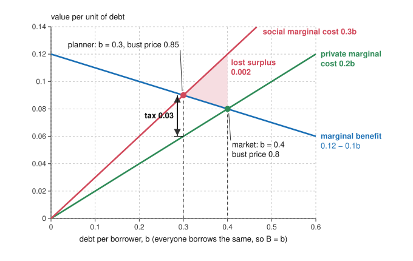

# Economics of Debt · Lesson 4.4: Overborrowing: when private leverage is too high

> ⏱ ~15 min · Module 4: Debt-deflation, Minsky and 2008 · Builds on: [4.1 Fisher's debt-deflation, formalized](04-01-fishers-debt-deflation-formalized.md), [4.2 Minsky, informally and formally](04-02-minsky-informally-and-formally.md), [3.5 The leverage cycle](03-05-the-leverage-cycle.md), [grad-micro 6.3](../../grad-micro/lessons/06-03-externalities-coase-theorem.md) · Unlocks: [5.1 The government budget constraint and debt dynamics](05-01-the-government-budget-constraint.md), [8.3 Relief written into the contract](08-03-relief-written-into-the-contract.md)

## Why this matters

Module 4 has traced what heavy debt does once a bust arrives: a forced repayment the real rate cannot absorb ([4.1](04-01-fishers-debt-deflation-formalized.md)), margins of safety worn thin by a long calm ([4.2](04-02-minsky-informally-and-formally.md)), and the household evidence from 2007–09 ([4.3](04-03-household-debt-and-the-great-recession.md)). None of that shows anyone borrowed *too much*: a large mortgage in 2005 may have been a sound bet at correct odds. Can borrowing that is privately optimal, chosen with correct beliefs and no bailout in view, still be too high for the economy? It can, when each borrower's debt moves a price, or an income, that lands on others who are short of cash. That is the leading theoretical case for macroprudential policy: loan-to-value and debt-to-income limits, countercyclical capital buffers and, in principle, a tax on borrowing.

## The idea

A harbor full of fishing firms has borrowed against its boats. In a bad season every firm is short of cash at once, so boats come up for sale together, and the only buyers are outsiders who value boats less. The more boats for sale, the lower the price. Each firm, when it borrowed, allowed for selling its own boats cheaply. It did not count that its boats, added to the pile, lower the price every other seller gets.

Is that a loss to the economy? Not by itself. Say the extra boats cut the price by 1,000 dollars on 40 boats sold. Sellers receive 40,000 dollars less and buyers pay 40,000 less. If a dollar is worth the same to both sides, that is a transfer, and nothing is wasted.

It becomes a loss because the sellers are desperate for cash. Each still owes its bank whatever the sale did not cover, and in a bad season it can raise that money only by laying up boats it would otherwise fish, at a cost of, say, 2 dollars of income per dollar raised. Now the price cut costs sellers 80,000 dollars and hands buyers 40,000, so 40,000 dollars simply vanishes, and no firm put any of it into its borrowing decision. That is a **pecuniary externality**, a side effect that travels through a price, and it bites only because the price lands on people who value a dollar differently. Every firm would gain if all borrowed a little less, but none gains by cutting back alone. A tax on borrowing, or a cap on it, puts the missing cost back into each firm's sums.

## The formal version

**Setup.** Three dates, a unit mass of identical borrowers, and outside buyers with deep pockets. Everyone is risk-neutral and the safe rate is zero, so all values are in date-0 dollars.

- *Date 0.* A borrower borrows $b$ and buys $b$ units of an asset (houses, land, machines) at its normal price of 1. Holding them is worth $w(b) = mb - \tfrac{k}{2}b^2$ to her beyond their normal value, with $m, k > 0$, so the marginal benefit of debt is $w'(b) = m - kb$.
- *Date 1, a normal year* (probability $1-\pi$). She repays $b$ out of income and keeps the asset, worth 1 a unit at date 2, so the loan nets out.
- *Date 1, a bust* (probability $\pi$). She has no income, so all $b$ units are sold to outsiders, who value the $s$-th unit they buy at $1-\gamma s$. With total sales $S$ the [fire-sale](../reference.md#fire-sale) price is $p = 1-\gamma S$, and since everyone sells, $S = B$, aggregate debt. The lender receives $pb$, and the borrower owes it the deficiency $(1-p)\,b$. Having nothing left to sell, she covers it by cutting what she can least spare, so each dollar costs her $\lambda > 1$, the shadow value of cash in her binding bust-state budget constraint.

Lenders are repaid in full either way, so they lend at the safe rate.

**Private choice.** Each borrower is too small to move $p$, so she maximizes $w(b) - \pi\lambda(1-p)\,b$ taking $p$ as given:

$$\underbrace{m - kb}_{\text{MB}} \;=\; \underbrace{\pi\lambda(1-p)}_{\text{PMC}} \;=\; \pi\lambda\gamma B .$$

*In words:* she borrows until the last unit's benefit equals its private marginal cost, the expected deficiency on that unit valued at $\lambda$. At the symmetric competitive equilibrium (CE), $b = B$:

$$b^{CE} = \frac{m}{k + \pi\lambda\gamma}.$$

**The planner.** A [constrained planner](../reference.md#constrained-efficiency) chooses everyone's $b$ but must leave the bust market as it is: same sales, same price schedule. She counts what the borrower ignores: that $p$ falls with $B$, and the buyers, who in a bust earn surplus $\int_0^B (1-\gamma s)\,ds - pB = \gamma B^2/2$. Expected total surplus is

$$W(B) = mB - \tfrac{k}{2}B^2 - \pi\lambda\gamma B^2 + \tfrac12\pi\gamma B^2,$$

and its first-order condition splits the social marginal cost in two, giving the social planner's (SP) debt:

$$m - kB = \underbrace{\pi\lambda\gamma B}_{\text{PMC}} + \underbrace{\pi\gamma(\lambda-1)B}_{\text{external}} .$$

$$b^{SP} = \frac{m}{k + \pi\gamma(2\lambda-1)} \;<\; b^{CE}.$$

*In words:* one more unit of aggregate debt cuts the bust price by $\gamma$, which raises every borrower's deficiency by $\gamma$ per unit of debt, $\gamma B$ in all. Borrowers lose $\lambda\gamma B$ and buyers gain $\gamma B$. The difference, weighted by the bust probability, is the [pecuniary externality](../reference.md#pecuniary-externality) that nobody prices.

**The tax.** A [tax on borrowing](../reference.md#macroprudential-tax) of $\tau$ per unit, rebated lump-sum, adds $\tau$ to each borrower's marginal cost. As in [grad-micro 6.3](../../grad-micro/lessons/06-03-externalities-coase-theorem.md), set it equal to the external marginal cost *at the planner's optimum*:

$$\tau^* = \pi\gamma(\lambda-1)\,b^{SP}.$$

*In words:* charge each unit of debt the loss it imposes on others when debt is where it should be.

**Why $\lambda > 1$ is the whole story.** At $\lambda = 1$ the external term vanishes. The price still falls with borrowing, but every dollar it takes from sellers lands with buyers who value it the same. That is what complete markets deliver: if a borrower could insure her deficiency at fair odds, a bust dollar would cost her exactly 1, and the first welfare theorem of [grad-micro 4.4](../../grad-micro/lessons/04-04-two-welfare-theorems.md) applies. With markets incomplete, price effects stop netting out. Dávila and Korinek (2018, *Review of Economic Studies*) sort the survivors into two kinds. **Distributive** externalities move wealth between agents who value it differently because insurance is missing, as here. **Collateral** externalities arise when a price sits inside a [borrowing constraint](../reference.md#collateral-constraint). Lorenzoni (2008, *Review of Economic Studies*) derived excessive borrowing from limited commitment plus asset prices set in a spot market; Bianchi (2011, *AER*) found the collateral kind in a small open economy calibrated to emerging markets, where raising the cost of borrowing in tranquil times makes crises rarer and milder.

**Through aggregate demand.** In [4.1](04-01-fishers-debt-deflation-formalized.md)'s slump the price that fails is the real interest rate, stuck at the floor, so output adjusts instead. With prices rigid and the real rate at zero, $(1-\theta)Y_1 = c^s_1 + D_L - D_H$, where $\theta$ is borrowers' share of output, $c^s_1$ savers' spending (pinned by their Euler equation), $D_L$ the new debt limit and $D_H$ the debt falling due. *In words:* each unit of debt carried into the slump cuts output by $1/(1-\theta)$, or 1.67 at 4.1's $\theta = 0.4$. Savers lose a unit of income but receive the unit repaid, so their spending holds; borrowers repay the unit and also lose $\theta/(1-\theta)$ of income. The loan contract prices the repayment, a transfer; the lost output is priced by no one. That is the [aggregate-demand externality](../reference.md#aggregate-demand-externality), and it exists only at the floor: while the [natural rate](../reference.md#natural-rate) stays above it, the central bank lowers the real rate until savers spend the repayment. Korinek and Simsek (2016, *AER*) show that macroprudential limits on leverage then raise welfare, and that interest-rate policy is the inferior tool for the job. Farhi and Werning (2016, *Econometrica*) extend the logic to other constraints on monetary policy, such as a fixed exchange rate.

## Picture

Example 1's economy. The tax is the gap between the cost lines at the planner's debt; the shaded triangle is the surplus the market throws away.

## Worked examples

**Example 1 (the wedge in numbers).** Busts come one year in five ($\pi = 0.2$), the price falls half a unit per unit sold ($\gamma = 0.5$), a bust dollar is worth two ($\lambda = 2$), and $m = 0.12$, $k = 0.1$. All illustrative.

- *Market:* $0.12 - 0.1b = \pi\lambda\gamma\, b = 0.2b$, so $b^{CE} = 0.4$, and the bust price is $1 - 0.5 \times 0.4 = 0.8$.
- *Planner:* $0.12 - 0.1b = \pi\gamma(2\lambda - 1)\, b = 0.3b$, so $b^{SP} = 0.3$, and the bust price is 0.85.
- *Tax:* $\tau^* = \pi\gamma(\lambda-1)\,b^{SP} = 0.1 \times 0.3 = 0.03$ per unit borrowed, 3 points on a loan rate of zero. Check: facing it, a borrower stops where $0.12 - 0.1b = 0.2 \times 0.3 + 0.03 = 0.09$, at $b = 0.3$.
- *The market's loss* is the triangle between social cost and benefit from 0.3 to 0.4: $\tfrac12 \times 0.1 \times (0.12 - 0.08) = 0.002$, an eighth of the market's total surplus of 0.016.

**Example 2 (who pays, who gains).** Same economy. The tax raises $0.03 \times 0.3 = 0.009$, rebated to borrowers.

| Expected surplus | Market, $b = 0.4$ | Taxed, $b = 0.3$ | Change |
|---|---|---|---|
| Borrowers: $w(b) - \pi\lambda\gamma b^2$ | 0.0080 | 0.0135 | +0.0055 |
| Buyers: $\pi\gamma b^2/2$ | 0.0080 | 0.0045 | −0.0035 |
| Total | 0.0160 | 0.0180 | +0.0020 |

Borrowers give up 0.0085 of holding value but save 0.014 of expected bust losses. Buyers lose because in a bust they buy less, at 0.85 instead of 0.8. So the tax is a transfer plus an efficiency gain, and it has losers: the outsiders who would have picked up assets cheap. Pay them 0.0035 out of the revenue and rebate the other 0.0055 to borrowers, and borrowers gain 0.002 while buyers break even: a Pareto improvement, of the kind Greenwald and Stiglitz (1986, *QJE*) showed almost always exists once markets are incomplete or information imperfect. Without a rebate, borrowers would be down 0.0035 and the Treasury up 0.009.

A cap, $b \le 0.3$, gives the same allocation with no revenue. It binds: at 0.3 a borrower's marginal benefit (0.09) exceeds her private cost (0.06), so she would pay up to $0.03 = \tau^*$ for one more unit. Borrowers as a group gain from a limit each would break alone. Debt-to-income and [loan-to-value](../reference.md#loan-to-value) caps are such limits in practice, and countercyclical capital buffers apply the same logic to banks' own leverage. Cap and tax part company when borrowers value credit differently: the tax lets those who value it most borrow more, which a uniform cap cannot.

## Watch out

- **You might think any price that falls when everyone borrows is a reason to tax borrowing, but actually** a price change is a transfer, what sellers lose buyers gain, and destroys value only when the two sides value money differently: at $\lambda = 1$ the wedge is zero, however steep the fire sale.
- **You might think fire sales always mean overborrowing, but actually** the sign depends on who is short of cash. Here the cash-starved side sells. If the buyers were the constrained ones, a lower price would move money toward those who value it most, and the planner would want *more* borrowing. Dávila and Korinek show that distributive externalities can go either way and that fire sales are neither necessary nor sufficient for inefficiency; collateral externalities typically push toward overborrowing.
- **You might think "overborrowing" means more debt than a frictionless economy would carry, but actually** the benchmark is a planner facing the same frictions. Lorenzoni's competitive equilibrium always borrows less than the first best, yet can borrow more than the constrained optimum.

## One-liner

> Each borrower prices her own fire sale but not the discount her selling forces on everyone else's: a mere transfer when buyer and seller value a dollar alike, a real loss worth taxing when the sellers are short of cash.

## Problems

**P1 (🟢) *(Formal.)*** Keep Example 1's borrowers and buyers ($m = 0.12$, $k = 0.1$, $\lambda = 2$, $\gamma = 0.5$), but busts come one year in ten: $\pi = 0.1$. (a) Find the market's debt $b^{CE}$, the planner's debt $b^{SP}$ and the tax $\tau^*$. (b) Find the bust price in each case, and say in one sentence why the rarer bust is the deeper one.

**P2 (🟡) *(Formal (a) · Exegetical (b).)*** Stay with P1's economy, but at date 0 each borrower can now buy fair insurance that pays her deficiency in a bust; the asset is still sold as before. (a) Find the market's debt, the planner's debt and the bust price. (b) Your bust price is lower than in P1. In two sentences, explain why this deeper fire sale is no longer a reason to tax borrowing.

**P3 (🔴, optional) *(Formal (a) · Exegetical (b)–(c).)*** A slump like 4.1's: the real rate is stuck at zero, prices are rigid, savers' spending is pinned by the floor, and borrowers earn a share $\theta = 0.25$ of output and spend all of it. (a) Borrowers as a group carry one more unit of debt into the slump. By how much does output fall? Split the change in savers' and in borrowers' consumption into income and repayment. (b) In two sentences: why does neither a borrower nor her lender count this loss when the loan is made, and why would it disappear if the natural rate stayed above zero? (c) [`philosophy-of-debt` 3.2](../../philosophy-of-debt/lessons/03-02-predatory-lending-and-usury-caps.md) sorts reasons for restricting loans into exploitation, paternalism and reasons about third parties. In one sentence: which does this externality supply for a leverage cap, and what does it not need to assume about borrowers?

Solutions

**P1** *(Formal.)*

(a) The three slopes are $\pi\lambda\gamma = 0.1 \times 2 \times 0.5 = 0.1$ (private), $\pi\gamma(\lambda-1) = 0.05$ (external) and $\pi\gamma(2\lambda-1) = 0.15$ (social). So

$$
\begin{aligned}
b^{CE} &= \frac{0.12}{0.1 + 0.1} = 0.6,\\
b^{SP} &= \frac{0.12}{0.1 + 0.15} = 0.48,
\end{aligned}
$$

and $\tau^* = 0.05 \times 0.48 = 0.024$. Check: at 0.48 the marginal benefit is $0.12 - 0.048 = 0.072$, and private cost plus tax is $0.1 \times 0.48 + 0.024 = 0.072$.

(b) The market's bust price is $1 - 0.5 \times 0.6 = 0.70$ and the planner's is $1 - 0.5 \times 0.48 = 0.76$, both below Example 1's 0.8 and 0.85. A rarer bust makes each unit of debt cheaper in expectation, so more debt is carried into the bust that does come, and it clears at a deeper discount: a version of [4.2](04-02-minsky-informally-and-formally.md)'s *stability is destabilizing*, with correct beliefs. Only the product $\pi\gamma$ enters debt and the tax, so halving $\gamma$ instead would give the same 0.6, 0.48 and 0.024, but milder bust prices (0.85 and 0.88).

**Wrong turns:** evaluating the tax at the market's debt, $0.05 \times 0.6 = 0.03$, which pushes debt to $0.09/0.2 = 0.45$, below 0.48; counting the borrowers' loss from the lower price but not the buyers' gain, a social slope of $2\pi\lambda\gamma = 0.2$ that gives $b = 0.4$.

---

**P2** *(Formal (a) · Exegetical (b).)*

(a) Fair insurance costs $\pi$ per unit of cover, so a bust dollar now costs the borrower exactly 1: $\lambda = 1$. Her condition becomes $0.12 - 0.1b = \pi(1-p) = 0.05b$, so $b^{CE} = 0.8$. The planner's social slope is $\pi\gamma(2 \times 1 - 1) = 0.05$, the same, so $b^{SP} = 0.8$ and the tax is zero. The bust price is $1 - 0.5 \times 0.8 = 0.6$.

**Must hit, strict (b):**

- The lower price still moves money from sellers to buyers, but a transfer destroys value only if the two sides value a dollar differently; with insurance both value it at 1, so the external term $\pi\gamma(\lambda-1)B$ is zero.
- What remains of the fire sale's cost, the marginal unit going to a buyer who values it at only $p$, each borrower already pays through her own deficiency, $1-p$, so private and social marginal costs coincide: the first welfare theorem's logic.

**Wrong turns:** keeping $\lambda = 2$ in the planner's problem because "the price still falls"; counting the insurance premium as a social cost, when it is a fair transfer to the insurer.

**Model answer (b):** The lower price still moves money from sellers to buyers, but with insurance a bust dollar is worth 1 to a borrower, as it is to a buyer, so the transfer nets out and the external term $\pi\gamma(\lambda-1)B$ is zero. The one real cost left, the marginal unit ending up with a buyer who values it at only $p$, is already in each borrower's own deficiency, so private and social marginal costs coincide and the market's 0.8 is efficient.

---

**P3** *(Formal (a) · Exegetical (b)–(c).)*

(a) With savers' spending and the new limit fixed, $(1-\theta)\,\Delta Y_1 = -1$, so output falls by $1/(1-0.25) = 1.333$.

| One more unit of debt | Income | Repayment | Consumption |
|---|---|---|---|
| Savers | $-0.75 \times 1.333 = -1$ | $+1$ | 0 |
| Borrowers | $-0.25 \times 1.333 = -0.333$ | $-1$ | $-1.333$ |

Borrowers' consumption absorbs the whole fall in output; savers' spending does not move.

**Must hit, strict (b):**

- The contract moves one unit from borrower to lender, and each counts exactly that unit. The loss arises because at the floor the repaid unit is not spent, which lowers everyone's income, and every party takes income as given.
- Above the floor the central bank cuts the real rate until savers spend the repayment, output stays at potential, and the repayment is only a transfer.

**Must hit, strict (c):** a reason about third parties, the incomes of other borrowers and of savers; it needs no mistake by borrowers (paternalism) and no markup by lenders (exploitation), since borrowers here hold correct beliefs.

**Wrong turns:** in (a), putting the output loss at the one unit repaid, or applying the multiplier to savers' consumption; in (c), calling it paternalism because a cap limits what borrowers may choose, when the reason for the limit is harm to others.

**Model answer (b)–(c):** (b) The loan moves one unit from borrower to lender, and that is all either of them prices; the 1.333 of output is lost because the saver who is repaid does not spend it, and that loss arrives through everyone's income, which no one controls. If the natural rate stayed positive, the central bank would lower the real rate until savers spent the repayment, and output would not fall. (c) It is a reason about third parties, which needs neither borrower error nor a lender's markup: fully informed borrowers are capped for the sake of other people's incomes.

## Flashback

**From Lesson [4.2](04-02-minsky-informally-and-formally.md) (Minsky, informally and formally):** *(Formal.)* An invented economy has many units of equal size. Each owes debt $D$ at interest rate $i$, with principal $P=0.04D$ due this year, and earns operating cash flow $Y$; the ratio $Y/D$ differs across units and is spread uniformly between 0.02 and 0.12. A unit is hedge if $Y\ge iD+P$, speculative if $iD\le Y<iD+P$, and Ponzi if $Y<iD$. (a) Find the share of units in each class at $i=4.5\%$ and at $i=6.5\%$, and say in one clause which share does not change and why. (b) Now every unit's cash flow grows at $g=2\%$ a year forever and lenders always refinance at $i$, so a unit is solvent if and only if $Y\ge(i-g)D$. At $i=6.5\%$, what share of all units is insolvent, and what share of the Ponzi units is solvent?

Solution

Write $x=Y/D$, uniform on $[0.02,0.12]$, so a threshold $t$ in that range has a share $(t-0.02)/0.10$ of units below it. The classes are hedge for $x\ge i+0.04$, speculative for $i\le x<i+0.04$, and Ponzi for $x<i$.

(a) At $i=4.5\%$: hedge is $x\ge0.085$, a share $(0.12-0.085)/0.10=35\%$; Ponzi is $x<0.045$, a share 25%; speculative is the remaining 40%. At $i=6.5\%$: hedge is $x\ge0.105$, 15%; Ponzi is $x<0.065$, 45%; speculative is again 40%. The rise moves 20 points of units from hedge to Ponzi and leaves the speculative share unchanged: the band between the two cutoffs is always $P/D=0.04$ wide (the parallel lines of the lesson's figure), and while it lies inside the range of $x$ it holds the same share of units.

(b) A unit is solvent when $x\ge i-g=0.045$, so at 6.5% the insolvent units are those with $x<0.045$, a share $(0.045-0.02)/0.10=25\%$ of all units. The Ponzi units are the 45% with $x<0.065$; those with $0.045\le x<0.065$, 20 points, are solvent, so $20/45=44\%$ of Ponzi units are solvent. Ponzi is a cash-flow class, not insolvency: 45% of units must borrow to pay interest, but only 25% are insolvent.

**Wrong turns:** testing the hedge class with $Y\ge iD$ and forgetting the principal, which gives 55% hedge at 6.5%; treating Ponzi as insolvent, which reports 45% insolvent instead of 25%.

## Connections

- **Backward:** [3.5](03-05-the-leverage-cycle.md) asked whether each holder's leverage ignores what his fire sale does to the price others get. It does, and that matters when sellers value a bust dollar above 1. Geanakoplos's proposal (2010, *FRBNY Economic Policy Review*), to curtail leverage in ebullient times and prop it up in crises, pairs this lesson's cap with a bust-time intervention its constrained planner was not allowed. [4.3](04-03-household-debt-and-the-great-recession.md)'s foreclosure discounts and spending collapse are measured versions of the two spillovers priced here. [3.1](03-01-diamond-dybvig.md)'s P3 showed that a lower liquidation value makes a run easier; here that value falls with everyone's leverage. [4.1](04-01-fishers-debt-deflation-formalized.md) supplied the slump and its demand equation, and [4.2](04-02-minsky-informally-and-formally.md) asked whether privately chosen leverage is too high: it can be, with no biased beliefs and no expected rescue. The tax at the efficient quantity is [grad-micro 6.3](../../grad-micro/lessons/06-03-externalities-coase-theorem.md)'s, and the benchmark it restores is the first welfare theorem of [grad-micro 4.4](../../grad-micro/lessons/04-04-two-welfare-theorems.md).
- **Forward:** [8.3](08-03-relief-written-into-the-contract.md) writes contingency into debt itself (shared-responsibility mortgages, GDP-linked bonds), a step toward P2's insured case, where a fire sale is only a transfer. [8.1](08-01-forgiveness-commitment-and-the-fresh-start.md) asks what relief expected after the fact does to borrowing before it.
- **Sideways (the debt thread):** [`philosophy-of-debt` 3.2](../../philosophy-of-debt/lessons/03-02-predatory-lending-and-usury-caps.md) sorts the reasons for restricting loans. This lesson's reason is the third-party kind, stated as positive economics; whether it licenses binding informed borrowers is that course's question. The 2008 episode itself, foreclosures included, is [`history-of-debt` 6.1](../../history-of-debt/lessons/06-01-the-american-mortgage-and-2008.md). Choosing between a tax and a quantity limit when borrowers differ or damages are uncertain is [`public-economics`](../../public-economics/syllabus.md) Module 3.
