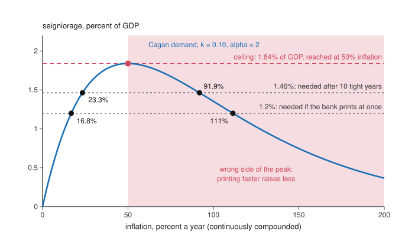

# Economics of Debt · Lesson 5.4: Fiscal limits and unpleasant arithmetic

> ⏱ ~15 min · Module 5: Public debt · Builds on: [5.1 The government budget constraint and debt dynamics](05-01-the-government-budget-constraint.md), [5.2 When r < g](05-02-when-r-is-less-than-g.md), [`grad-macro` 6.2 Policy rules and the Taylor principle](../../grad-macro/lessons/06-02-policy-rules-taylor-principle.md) · Unlocks: [5.5 The fiscal theory and inflating debt away](05-05-the-fiscal-theory-and-inflating-debt-away.md), [6.2 Willingness to pay: reputation and Eaton-Gersovitz](06-02-reputation-and-eaton-gersovitz.md)

## Why this matters

[5.1](05-01-the-government-budget-constraint.md) showed that a debt is backed by the present value of future primary surpluses, and surpluses come from taxes. No tax raises more than the top of its Laffer curve, so some debts are beyond what any feasible tax policy can carry. Past that fiscal limit, what pays is growth ([5.2](05-02-when-r-is-less-than-g.md)), default (Module 6) or money. This lesson follows the money. Money is taxed by inflation, and that tax has a ceiling too. Sargent and Wallace (1981) showed that a central bank facing a treasury that will not adjust chooses only when inflation comes, not whether. Leeper's (1991) active and passive policies name which authority adjusts, and so who pays.

## The idea

Take an invented country whose taxes can raise at most 40 percent of GDP, because past that rate the base shrinks faster than the rate rises, and whose spending cannot fall below 37 percent. Its largest possible primary surplus is 3 percent of GDP. With a real interest rate of 3 percent and growth of 1 percent, interest net of growth costs about 2 percent of the debt a year. A debt of about 150 percent of GDP costs about 3 percent of GDP, all the budget can ever spare: that is the country's fiscal limit. At 160 percent the ratio rises even under maximum austerity.

Beyond the limit, bondholders are paid by a default or by the printing press. Money is a tax base too. When prices rise 10 percent in a year, cash loses about a tenth of its value, and the government that issued it gains what holders lose. But the faster money melts, the less of it people hold, so the inflation tax has a Laffer curve and a ceiling of its own.

Now the trap. The treasury will not change its deficits. The central bank, to hold inflation down, refuses to print, so the deficits are financed with bonds. The bonds pay interest faster than the economy grows, and the debt ratio climbs. When the public will hold no more bonds, the central bank must print enough to pay interest on a larger debt than if it had printed at once. Tight money now means more inflation later. And if people see that coming, they hold less money today, so prices start rising before the printing does.

## The formal version

**The fiscal limit.** As in 5.1, $d_t$ is debt and $s_t$ the primary surplus, both over GDP, and $a=\frac{1+r}{1+g}$ with real interest rate $r$ above real growth $g$. Revenue is a tax rate $\tau$ times a base that shrinks as the rate rises; if the base is proportional to $(1-\tau)^e$, where $e$ is its elasticity to $1-\tau$, revenue peaks at $\tau^*=1/(1+e)$ ([`public-economics`](../../public-economics/syllabus.md) 5.1). Let $\bar s$ be peak revenue minus the lowest feasible spending, the largest primary surplus the government can run. The [intertemporal budget constraint](../reference.md#intertemporal-budget-constraint) (IBC), $d_t=\sum_{j\ge0}s_{t+j}/a^{j+1}$, can then hold only if

$$d_t\le\bar d\equiv\frac{\bar s}{a-1}=\frac{(1+g)\,\bar s}{r-g}.$$

*In words:* the [fiscal limit](../reference.md#fiscal-limit) $\bar d$ is the present value of the largest surplus the government can run forever, and no tax policy backs a debt above it. Bi (2012, *European Economic Review*) derives fiscal limits from dynamic Laffer curves and gets a distribution, not a number, shaped by the size of government, the growth of transfers and the state of the economy; risk premia then stay low and rise rapidly as debt nears it. Leeper and Walker (2011, *Economic Papers*) add that once taxes and spending no longer adjust to stabilize debt, monetary policy may lose control of inflation. The rest of this lesson shows why.

**Seigniorage.** Let $M$ be base money (currency and bank reserves), $P$ the price level, $Y$ real output (held constant) and $m=M/(PY)$ real balances over GDP. [Seigniorage](../reference.md#seigniorage), the revenue from issuing money, is $\sigma=\dot M/(PY)$ a year. With $m$ constant, money grows at the inflation rate $\pi$ (continuously compounded), so $\sigma=\pi m$: an inflation tax at rate $\pi$ on the base $m$. [Cagan money demand](../reference.md#cagan-money-demand) (Cagan 1956, fitted to hyperinflations) is

$$m=k\,e^{-\alpha\pi},\qquad\text{so seigniorage is}\qquad S(\pi)=k\,\pi\,e^{-\alpha\pi},$$

where $k$ is real balances at zero inflation and the semi-elasticity $\alpha>0$ says each point of inflation cuts real balances by about $\alpha$ percent. Since $S'(\pi)=k\,e^{-\alpha\pi}(1-\alpha\pi)$,

$$\pi^*=\frac1\alpha,\qquad S_{\max}=\frac{k}{\alpha e}.$$

*In words:* the inflation tax peaks where the base's elasticity to its rate, $-\alpha\pi$, reaches $-1$, as on any Laffer curve. Past the peak, printing faster raises less.

**[Unpleasant monetarist arithmetic](../reference.md#unpleasant-monetarist-arithmetic).** With seigniorage, 5.1's identity becomes $d_{t+1}=a\,d_t-s_t-\sigma_t$, and the IBC becomes $d_0=\sum_{t\ge0}(s_t+\sigma_t)/a^{t+1}$. Sargent and Wallace (1981, Federal Reserve Bank of Minneapolis *Quarterly Review*; SW) assume *fiscal dominance*: the treasury fixes the whole path of $s_t$ and never revises it. Bonds are real, they pay $r>g$, and the public will hold only so many. Then

$$\sum_{t\ge0}\frac{\sigma_t}{a^{t+1}}=d_0-\sum_{t\ge0}\frac{s_t}{a^{t+1}}$$

is fixed. *In words:* the treasury sets how much seigniorage the central bank must raise in present value; the bank chooses only when.

Take a constant surplus $s$. Printing $\sigma_0=(a-1)d_0-s$ from today holds the ratio. If the bank instead prints only $\sigma_1<\sigma_0$ for $T$ years and then whatever holds the ratio at $d_T$, iterating the identity gives

$$\sigma_L=\sigma_0+(a^T-1)(\sigma_0-\sigma_1),$$

which is $a^T\sigma_0$ if it prints nothing. *In words:* seigniorage declined today comes back with growth-adjusted interest. With quantity-theory demand ($\alpha=0$, so $\pi=\sigma/k$), later inflation rises by the same factor. That is SW's first result, and they name its two crucial assumptions: $r>g$, and a fiscal path that does not respond to monetary policy.

Cagan demand adds two twists. First, $\sigma_L$ must come from the Laffer curve: if $a^T\sigma_0>S_{\max}$, no inflation rate raises it, and the standoff ends in a fiscal adjustment or a default. Second, with foresight and $Y=1$ the demand reads $\ln M_t-p_t=\ln k-\alpha\,\dot p_t$, where $p_t=\ln P_t$, and its stable solution is

$$p_t=\frac1\alpha\int_t^\infty e^{-(u-t)/\alpha}\,(\ln M_u-\ln k)\,du.$$

*In words:* today's price level is a discounted average of all future money supplies. If money is held constant until date $T$ and grows at rate $\mu$ after it, inflation at $t<T$ is already $\mu\,e^{-(T-t)/\alpha}$. SW built an example in which the tighter policy has higher inflation in every period of their table and a price level about 1 percent higher at the start. Werning (2021, a teaching note) shows that this backfire needs the falling side of the money Laffer curve.

**[Active and passive policy](../reference.md#active-and-passive-policy).** Leeper (1991, *Journal of Monetary Economics*) calls an authority *active* when it sets its instrument without regard to the debt, and *passive* when it adjusts to keep the budget constraint satisfied, given what the active one does. A central bank with a Taylor rule that obeys the Taylor principle ([`grad-macro` 6.2](../../grad-macro/lessons/06-02-policy-rules-taylor-principle.md)) is active; one that prints whatever the budget requires is passive. A treasury whose surplus rises with debt by $\rho>a-1$ per unit, 5.1's [fiscal reaction function](../reference.md#fiscal-reaction-function), is passive; one that fixes its surpluses is active. (Bohn's weaker $\rho>0$ keeps the IBC; Leeper asks for a stable debt.) With one of each there is a unique equilibrium, and the passive authority adjusts. Two passive authorities leave the price level undetermined. Two active ones contradict the budget constraint, so one must give way: a game of chicken. SW's fiscal dominance is active fiscal with passive money, as Leeper notes, and he reads Sargent's (1982) account of the 1920s European hyperinflations as that regime, ended by a switch to the reverse.

Who pays depends on who yields: taxpayers if the treasury does, holders of money if the central bank does, bondholders through default if neither. At the fiscal limit the treasury cannot yield. Here inflation is a tax on money. On nominal bonds it also taxes bondholders, and the price level can then close the gap with no money printed at all: that is [5.5](05-05-the-fiscal-theory-and-inflating-debt-away.md)'s fiscal theory.

## Picture

This is Example 1's demand. The inflation tax peaks at 1.84 percent of GDP at 50 percent inflation, and in the shaded region printing faster raises less. The dashed lines are Example 2's needs: 1.2 percent if the central bank prints at once, 1.46 percent after ten tight years. Each year of delay lifts the line by 2 percent of itself, and after 21.6 years it clears the peak.

## Worked examples

**Example 1 (the model on a clean case): the inflation tax's ceiling.** Take $k=0.10$, base money worth 10 percent of GDP at zero inflation, and $\alpha=2$.

- *The peak.* $\pi^*=1/2$: 50 percent a year, so prices rise $e^{0.5}-1=65$ percent over a year. $S_{\max}=0.10/(2e)=0.0184$: the printing press can raise at most 1.84 percent of GDP a year. At the peak people hold money worth only $k/e=3.7$ percent of GDP.
- *Two rates for each revenue.* 1.2 percent of GDP comes from 16.8 percent inflation or from 111 percent. At the high rate the same revenue is taxed out of balances of 1.1 percent of GDP instead of 7.1, so holders of money bear a far larger distortion for nothing.
- *The money limit.* With $a-1=0.02$, the ceiling backs at most $S_{\max}/(a-1)=0.92$ of GDP of debt, at 65 percent price increases forever. A debt above $(\bar s+S_{\max})/(a-1)$ can be backed by neither taxes nor money, and only default is left.

Who pays: holders of money, taxed at rate $\pi$ on their balances, who also bear the cost of holding less money than they would like.

**Example 2 (why you'd care): tight money under fiscal dominance.** An invented country with zero growth owes real debt of 40 percent of GDP at $r=2$ percent, so $a=1.02$. Its treasury will run a primary deficit of 0.4 percent of GDP forever, $s=-0.004$, and base money is 10 percent of GDP.

*Print now.* $\sigma_0=0.02\times0.40+0.004=0.012$: seigniorage of 1.2 percent of GDP a year holds the ratio. Under the quantity theory, $\pi=0.012/0.10=12$ percent.

*Tight money.* The central bank prints nothing for ten years, so the deficits and interest go onto the debt:

$$\begin{aligned}d_{10}&=1.02^{10}\times0.40+0.004\times\frac{1.02^{10}-1}{0.02}\\&=0.488+0.044=0.531.\end{aligned}$$

Holding it there takes $\sigma_L=0.02\times0.531+0.004=0.0146$, which is $1.02^{10}\times0.012$. Inflation is 14.6 percent forever: ten years at zero cost 2.6 points for ever after. Both paths raise seigniorage worth $0.012/0.02=0.6$ of GDP in present value, the debt plus the present value of the deficits, $0.40+0.004/0.02$.

*With Cagan demand* ($\alpha=2$, Example 1). The same revenues need 16.8 and 23.3 percent inflation, since the base shrinks as inflation rises. Tight money can last at most $\ln(0.0184/0.012)/\ln1.02=21.6$ years; after that, $1.02^T\times0.012$ exceeds the ceiling. And prices move early: with money to grow 23.3 percent a year from year 10, inflation is already $0.233\,e^{-1}=8.6$ percent in year 8, and it passes the print-now rate of 16.8 percent about eight months before any money is printed.

Who gains and who pays: holders of money gain while money is tight and pay more afterwards, for ever; bondholders are paid in full; taxpayers pay the same either way, because the treasury never moves.

## Watch out

- **You might think the arithmetic makes tight money futile,** but it needs both of SW's assumptions. With $r<g$ the debt ratio settles without printing ([5.2](05-02-when-r-is-less-than-g.md)), and with a passive treasury the extra debt is serviced by taxes. Drop either and tight money lowers inflation for good.
- **You might think a government can always print its way out,** but seigniorage has a ceiling, $k/(\alpha e)$. A need above it is met at no inflation rate, however high.
- **You might think "active" means hawkish,** but in Leeper's sense it means ignoring the debt. A treasury at its fiscal limit is active whether it wants to be or not.

## One-liner

> Taxes and money each have a Laffer ceiling, so debt has a limit; and a central bank that refuses to finance a treasury that will not adjust only chooses when the inflation comes, paying interest for the delay.

## Problems

**P1 (🟢) *(Formal.)*** Money demand is Cagan with $k=0.12$ and $\alpha=4$, with inflation continuously compounded. (a) Find the revenue-maximizing inflation rate, the maximum seigniorage and real balances at the peak. (b) The treasury wants 1.5 percent of GDP a year from the printing press. At what inflation rate can it get it? (c) Compute seigniorage at half and at twice the peak rate, each as a share of the maximum. Which is larger? Three significant figures.

**P2 (🟡) *(Formal (a)–(b) · Exegetical (c).)*** An invented economy with zero real growth owes real debt of 32 percent of GDP at $r=2.5$ percent. Its treasury will run a primary deficit of 0.2 percent of GDP every year, whatever happens. Base money is 8 percent of GDP at any inflation rate (the quantity theory). (a) What inflation rate, starting now, holds the debt ratio constant? (b) The central bank instead holds inflation at 4 percent for 8 years, then prints whatever holds the ratio where it has got to. Find the debt ratio after 8 years and the inflation rate from then on. (c) Suppose instead that $r=1$ percent, real growth is 2 percent, and the deficit is financed with bonds alone, forever. Where does the debt ratio go, and which of Sargent and Wallace's two crucial assumptions has failed? Two sentences.

**P3 (🔴) *(Formal (a) · Exegetical (b).)*** An invented government's tax revenue peaks at 38 percent of GDP and its spending cannot fall below 34 percent; $r=3.5$ percent and $g=1$ percent. (a) Find its fiscal limit. Debt is 175 percent of GDP: how much does the ratio change next year if the government runs its largest possible surplus? (b) For each policy pair below, classify each authority as active or passive in Leeper's sense and say who adjusts, or what must give. Answer with a four-row table.

- (i) The treasury follows $s_t=0.04\,d_t-0.01$ with debt at 60 percent of GDP; the central bank follows a Taylor rule with $\phi_\pi=1.5$, raising its nominal rate 1.5 points per point of inflation.
- (ii) The treasury runs a primary deficit of 1 percent of GDP every year whatever the debt; the central bank buys whatever bonds the public will not hold, printing money to do it.
- (iii) The treasury as in (ii); the central bank holds money growth at 2 percent a year whatever the budget.
- (iv) The treasury of (i) once debt has reached 175 percent of GDP, where its rule asks for a surplus of 6 percent; the central bank as in (i).

Solutions

**P1** *(Formal.)*

(a) $\pi^*=1/\alpha=0.25$: 25 percent a year, continuously compounded, so prices rise $e^{0.25}-1=28.4$ percent over the year. $S_{\max}=k/(\alpha e)=0.12/(4e)=0.0110$, or 1.10 percent of GDP. Real balances at the peak are $k/e=0.0441$, or 4.41 percent of GDP.

(b) At none. 1.5 percent exceeds 1.10 percent, the most any inflation rate raises, and printing faster than 25 percent raises less, not more. The gap must come from the treasury or from a default.

(c) $S(0.125)=0.12\times0.125\times e^{-0.5}=0.00910$, which is $\tfrac12e^{1/2}=82.4$ percent of $S_{\max}$. $S(0.5)=0.12\times0.5\times e^{-2}=0.00812$, which is $2/e=73.6$ percent. Half the peak rate raises more: overshooting the peak by a factor of two costs more revenue than undershooting it by the same factor. Neither share depends on $k$ or $\alpha$.

**Wrong turns:** evaluating $S(\pi^*)$ without the factor $e^{-1}$, which gives $k/\alpha=3$ percent of GDP and makes (b) look feasible; answering (b) with a rate on the far side of the peak, where revenue is lower still.

---

**P2** *(Formal (a)–(b) · Exegetical (c).)*

(a) $a=1.025$. Holding the ratio takes $\sigma_0=0.025\times0.32+0.002=0.010$, so $\pi_0=0.010/0.08=12.5$ percent.

(b) At 4 percent inflation the bank raises $\sigma_1=0.08\times0.04=0.0032$ a year, which more than covers the 0.002 deficit, so each year the debt grows by its interest less $0.0012$:

$$\begin{aligned}d_8&=1.025^8\times0.32-0.0012\times\frac{1.025^8-1}{0.025}\\&=0.3899-0.0105=0.3794.\end{aligned}$$

Holding the ratio there takes $\sigma_L=0.025\times0.3794+0.002=0.01149$, which matches $\sigma_0+(a^8-1)(\sigma_0-\sigma_1)=0.010+0.2184\times0.0068=0.01149$. Inflation from year 8 on is $0.01149/0.08=14.4$ percent, forever, against 12.5 percent from the start: eight years at 4 percent cost 1.9 points for ever after. Both paths raise seigniorage worth $0.010/0.025=0.4$ of GDP in present value.

**Must hit, strict (c):**

- $a=1.01/1.02=0.990$, below 1 ($a-1=-0.98$ percent), so the ratio falls from 32 percent toward $0.002\times1.02/0.01=0.204$, [5.2](05-02-when-r-is-less-than-g.md)'s sustainable deficit, and no printing is ever needed.
- The assumption that fails is $r>g$. The fixed fiscal path is still in place, so it is the growth-adjusted interest rate, not the treasury, that rescues the central bank.

**Wrong turns:** in (b), leaving out the 0.0032 raised during the tight years, which gives $d_8=0.407$ and 15.2 percent; in (c), expecting a permanent deficit to push the ratio up forever.

**Model answer (c):** With $r=1$ percent and $g=2$ percent, $a=0.990<1$, so with bond finance alone the ratio drifts down from 32 percent toward $0.002\times1.02/0.01=20.4$ percent, and no printing is ever needed. What fails is Sargent and Wallace's assumption that the interest rate on bonds exceeds the growth rate, which is what made deferred seigniorage grow.

---

**P3** *(Formal (a) · Exegetical (b).)*

(a) $\bar s=0.38-0.34=0.04$ and $a-1=0.025/1.01=0.02475$, so $\bar d=0.04\times1.01/0.025=1.616$: a fiscal limit of 161.6 percent of GDP. At 175 percent, interest net of growth costs $0.02475\times1.75=0.0433$ of GDP, more than the 0.04 the budget can spare, so the ratio rises by 0.33 points, to 175.3 percent, even at maximum austerity.

**Must hit, strict (b):**

| Pair | Treasury | Central bank | Who adjusts |
|---|---|---|---|
| (i) | passive: $\rho=0.04>a-1=0.02475$ | active: $\phi_\pi>1$ | taxpayers: surpluses rise with debt, and the bank sets inflation |
| (ii) | active: deficits ignore the debt | passive: money follows the budget | holders of money, through the inflation tax (SW's fiscal dominance) |
| (iii) | active | active | no equilibrium: debt grows until one side yields, or the government defaults |
| (iv) | active by necessity: 6 percent exceeds the 4 percent maximum | active | as in (iii), but the treasury cannot yield, so the bank turns passive (inflation) or bondholders take a default |

**Wrong turns:** using $r-g$ without dividing by $1+g$, which gives a limit of 160 percent; calling (ii)'s central bank active because it buys bonds, when it is passive because the budget sets its money growth; calling (iv)'s treasury passive because its rule is, when a rule it cannot follow is not its policy.

## Flashback

**From Lesson [5.2](05-02-when-r-is-less-than-g.md) (When $r<g$):** *(Formal.)* An invented government's debt is all one-year, so the whole stock pays this year's rate $r(d)=r_0+\theta d$, where $d$ is debt over GDP, $r_0=0.5\%$ and $\theta>0$ is the slope. Growth is $g=3\%$, and with a constant primary deficit $\delta$ over GDP the ratio follows $d_{t+1}=\dfrac{1+r(d_t)}{1+g}\,d_t+\delta$. The government holds the ratio at 100 percent ($d=1$) with the deficit that keeps it there. (a) For which slopes $\theta$ is that a stable resting point, one that a small shock does not push away from? (b) At the threshold slope, find the deficit, and the deficit that a flat rate $r_0$ would allow at $d=1$. (c) Take $\theta=0.02$, that is 2 basis points of rate per point of debt. Find the largest deficit that any debt ratio can hold, and say whether the deficit from (b) can be held at any ratio.

Solution

The map is $F(d)=\dfrac{1+r_0+\theta d}{1+g}\,d+\delta$. A resting point solves $F(d)=d$, that is $(1+g)\,\delta=(g-r_0)\,d-\theta d^2$, and it is stable when $F'(d)<1$.

(a) $F'(d)=\dfrac{1+r_0+2\theta d}{1+g}$, which is below 1 exactly when $r_0+2\theta d<g$: the marginal cost of debt, $r(d)+\theta d$, must be below growth, because a new unit pays its own rate and also raises the rate on every unit already owed. At $d=1$ this reads

$$\theta<\frac{g-r_0}{2}=\frac{0.025}{2}=0.0125,$$

or 1.25 basis points of rate per point of debt. At $\theta^*=0.0125$ the ratio sits at the peak of the sustainable-deficit curve, where the stable and the unstable resting point merge.

(b) At $\theta^*$ the rate at $d=1$ is $0.5\%+1.25\%=1.75\%$, so the deficit that holds the ratio is $\delta=\dfrac{(g-r(1))\,d}{1+g}=\dfrac{0.0125}{1.03}=0.01214$: 1.21 percent of GDP. A flat rate $r_0$ would allow $\dfrac{0.025}{1.03}=0.02427$: 2.43 percent, exactly twice as much. At the threshold, the rising rate has already halved what the ratio can carry.

(c) At $\theta=0.02$ the most that any ratio can hold is

$$\delta_{\max}=\frac{(g-r_0)^2}{4\theta\,(1+g)}=\frac{0.025^2}{0.08\times1.03}=0.00758,$$

or 0.76 percent of GDP, reached at $d=\dfrac{g-r_0}{2\theta}=0.625$. The deficit from (b), 1.21 percent, is 1.6 times that, so no ratio can hold it and the ratio rises from every start. From 100 percent it reaches 100.7 percent after one year, although the average rate there, 2.5 percent, is below growth.

**Wrong turns:** testing stability with the average rate, $r(1)<g$, which gives $\theta<0.025$, twice the right threshold, and lets slopes up to that look safe; in (b), using the flat rate, which doubles the deficit.

## Connections

- **Backward:** the fiscal limit is [5.1](05-01-the-government-budget-constraint.md)'s IBC with the largest feasible surplus put in, and 5.1's fiscal fatigue (Ghosh et al. 2013) is its empirical cousin, a surplus response that weakens as debt climbs. [5.3](05-03-tax-smoothing-and-optimal-debt.md) spreads the surpluses the IBC demands over time; the fiscal limit caps them, and smoothing cannot smooth past it. Active monetary policy is [`grad-macro` 6.2](../../grad-macro/lessons/06-02-policy-rules-taylor-principle.md)'s Taylor principle.
- **Forward:** [5.5](05-05-the-fiscal-theory-and-inflating-debt-away.md) treats inflation as a tax on nominal bonds and reads the IBC as an equation for the price level when the treasury is active. Module 6 takes the other exit: [6.2](06-02-reputation-and-eaton-gersovitz.md) asks why a sovereign repays at all, and [6.5](06-05-self-fulfilling-debt-crises.md) locates the debts at which lenders' fear of default is self-fulfilling.
- **Sideways:** [`history-of-debt` 5.1](../../history-of-debt/lessons/05-01-war-debts-and-reparations.md) has the German government financing passive resistance in the Ruhr largely by printing money in 1923, as prices went into hyperinflation; how much the occupation caused the collapse is disputed there. [`philosophy-of-debt` 6.2](../../philosophy-of-debt/lessons/06-02-public-debt-and-the-unborn.md) names inflation as a way out of its premise that borrowing binds later taxpayers. Financing the debt with money has a price too, paid by holders of money; whether that is fair is philosophy's question. The tax Laffer rate belongs to [`public-economics`](../../public-economics/syllabus.md) 5.1.
