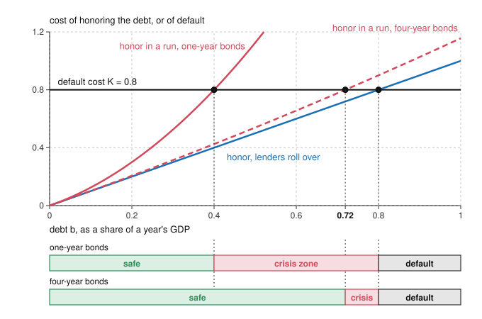

# Economics of Debt · Lesson 6.5: Self-fulfilling debt crises

> ⏱ ~15 min · Module 6: Sovereign default · Builds on: [3.1 Diamond-Dybvig](03-01-diamond-dybvig.md), [3.2 Stopping runs](03-02-stopping-runs.md), [6.4 The Arellano model](06-04-the-arellano-model.md) · Unlocks: [7.1 Haircuts, the debt Laffer curve and buybacks](07-01-haircuts-the-debt-laffer-curve-and-buybacks.md), [7.2 Holdouts and collective action clauses](07-02-holdouts-and-collective-action-clauses.md)

## Why this matters

In 2012 the European Central Bank announced that it would buy, without a preset limit, the bonds of euro-area governments that accepted a rescue program. It never had to buy one ([history-of-debt 6.2](../../history-of-debt/lessons/06-02-the-eurozone-and-greece.md) tells the story). Altavilla, Giannone and Lenza (2014, ECB Working Paper 1707) estimate that the announcements cut Italian and Spanish two-year yields by about 2 percentage points and left German and French yields unchanged. If an unused promise moved yields that much, part of what it removed may have been fear. Cole and Kehoe (2000, *RES*) built the model for Mexico in 1994–95, where a government whose debt ratio looked prudent, but whose debt was very short, could not sell new bonds until the United States stepped in with a rescue package. This lesson finds the range of debt in which lenders' fear alone can force a default, what shrinks it, and when a promise to lend removes the fear at no cost.

## The idea

A government owes debt worth 60 percent of a year's GDP, all in one-year bonds. Each year it pays the bonds falling due by selling new ones, so the debt is serviced out of ordinary taxes. Defaulting would cost it the equivalent of 80 percent of GDP in lost output and lost access to credit. Paying 60 beats losing 80, so it pays.

Now suppose this year's lenders refuse to buy the new bonds. The whole 60 must come out of this year's budget, and a crash budget is far costlier than a smooth one: say the emergency tax rises and spending cuts destroy another 90. Honoring the debt now costs 150, so the government defaults. Knowing that, no lender wants to be the one who buys, since the new bonds would be defaulted on along with the old. Rolling over and refusing are both self-consistent. The debt gets paid if lenders expect it to be paid, and not if they don't.

The danger has edges. At debt 30 a crash budget costs 30 + 22.5 = 52.5, less than 80, so the government pays even in a run and lenders have nothing to fear. At 90 it defaults even if lenders roll over. And if the 60 were in four-year bonds with a quarter due each year, a run would force only 15 out of this year's budget, the crash would cost 60 + 5.6 = 65.6, and the danger would vanish. This is [3.1](03-01-diamond-dybvig.md)'s bank run with a government in place of the bank.

## The formal version

**Setup (a reduced form of Cole and Kehoe).** A government owes debt $b$, measured as a share of a year's GDP. A share $\lambda$ of it falls due each year: $\lambda=1$ for one-year bonds, $\lambda=1/N$ for $N$-year bonds issued in equal yearly slices. Defaulting costs $K$, which folds [6.2](06-02-reputation-and-eaton-gersovitz.md)'s exclusion and [6.3](06-03-bulow-rogoff-and-sanctions.md)'s sanctions into one number. If lenders roll over the maturing slice, honoring the debt costs $b$, because the payments are spread thinly. If they refuse, a [rollover crisis](../reference.md#rollover-crisis), the slice $\lambda b$ must be raised this year at an extra cost $\kappa(\lambda b)^2$, with $\kappa>0$. The extra cost is convex for the same reason as [5.3](05-03-tax-smoothing-and-optimal-debt.md)'s [convex distortion cost](../reference.md#convex-distortion-cost) $\kappa\tau^2$: squeezing a payment into one year costs more than spreading it. The government repays when honoring costs no more than $K$ (ties go to repaying). New lenders lend only if they expect to be repaid, and a default wipes out new bonds along with old.

*In words:* a run does not change what is owed, only how fast it must be paid, and paying fast is expensive.

**Three zones.** The government repays if lenders roll over iff $b\le K$, and repays in a run iff $b+\kappa\lambda^2b^2\le K$. So there are three ranges of debt:

- *Safe*, $b\le\underline b(\lambda)$: it repays even in a run, so refusing to lend protects no one and a run is not an equilibrium.
- *[Crisis zone](../reference.md#crisis-zone)*, $\underline b(\lambda)<b\le K$: it repays if lenders roll over and defaults if they refuse. Both are equilibria.
- *Default*, $b>K$: it defaults whatever lenders do.

The lower edge is the positive root of $\kappa\lambda^2b^2+b-K=0$:

$$\underline b(\lambda)=\frac{\sqrt{1+4\kappa\lambda^2K}-1}{2\kappa\lambda^2}.$$

*In words:* the crisis zone starts at the debt whose crash repayment just uses up the whole cost of defaulting.

**Maturity.** $\underline b(\lambda)$ falls as $\lambda$ rises, and $\underline b\to K$ as $\lambda\to0$. *In words:* the less that falls due at once, the smaller the crash a run can force, and a long enough maturity closes the zone (Cole and Kehoe's result). What counts is the maturity of the debt already outstanding: long bonds sold after a run has started protect next year, not this one.

**Prices.** Nothing in $b$, $\lambda$ or $K$ says which equilibrium is played. Let lenders put probability $p$ on a run next year, set off by a *sunspot*: any event that coordinates expectations without changing fundamentals. With risk-neutral lenders, a safe rate $r^*$ and nothing recovered in a default, a one-year bond sells for

$$q(b)=\begin{cases}1/(1+r^*) & \text{safe,}\\ (1-p)/(1+r^*) & \text{crisis zone,}\\ 0 & \text{default.}\end{cases}$$

*In words:* the [bond price schedule](../reference.md#bond-price-schedule) of [6.4](06-04-the-arellano-model.md) gains a middle step whose spread prices fear, and any $p$ between 0 and 1 is consistent with equilibrium.

**Calvo's route: the rate as the trigger.** Above, the cost of rolling over ignored the rate lenders charge. In a stripped-down version of Calvo (1988, *AER*), that rate is the trigger: a government must raise $A$ now by selling bonds with face value $F$ due next year, and it repays iff $F\le\tilde K$, where its default cost $\tilde K$ is not yet known. Lenders pay $q(F)=\Pr(\tilde K\ge F)/(1+r^*)$, and equilibrium requires

$$q(F)\,F=A.$$

*In words:* the face value must be just large enough that, at the price its own default risk implies, the sale raises $A$. Revenue $q(F)F$ rises and then falls in $F$, so any $A$ below the peak is raised at two face values. With $\tilde K$ uniform on $[0,1]$ and $r^*=0$ the condition is $F(1-F)=A$, and at $A=0.21$ the roots are $F=0.3$ (price 0.7) and $F=0.7$ (price 0.3). At the high root the rate is high because default is likely, and default is likely because the rate is high: a [self-fulfilling risk premium](../reference.md#self-fulfilling-risk-premium).

**The sovereign [lender of last resort](../reference.md#lender-of-last-resort).** A backstop (a central bank, the IMF, a rescue fund) promises to buy new bonds at the safe price $1/(1+r^*)$ whenever private lenders refuse. A refusal then cannot force the crash budget, so honoring costs $b$, a government in the crisis zone repays, no lender gains by refusing, and the backstop never buys. The promise is free under two conditions: it is credible (deep pockets, committed in advance), and the government is solvent at the good price, $b\le K$, the sovereign form of 3.2's line between [illiquidity and insolvency](../reference.md#illiquidity-versus-insolvency). In the default zone the same purchase is followed by default, and getting the debt repaid takes a transfer of at least $b-K$: a bailout.

**Fear or fundamentals?** The data struggle to separate them. A spread in the zone prices $p$, which no one observes, and weak fundamentals are what put a country in the zone in the first place; a global-games selection ([3.2](03-02-stopping-runs.md)) would even make $p$ a function of fundamentals. Bocola and Dovis (2016, NBER Working Paper 22694) separate the two through maturity. Facing rollover risk a government lengthens its debt to shrink the zone; facing fundamental risk it shortens, because short debt disciplines its future borrowing and so carries a lower premium. Italy shortened at the height of its crisis (the average life of its debt fell by half a year), so their model attributes only about 12 percent of Italian spreads over 2008–12 to rollover risk. It also finds the Italian spread observed after the 2012 announcements about 1 percentage point below the spread its model gives for a world without rollover crises, consistent with markets expecting some bailout, not only the end of fear.

## Picture

Blue is the cost of honoring the debt when lenders roll over, red the cost in a run, and black the cost of defaulting, with Example 1's numbers. Where blue lies below the black line and red above it, the government pays only if lenders keep lending: that stretch is the crisis zone, marked on the bars. Four-year bonds flatten the red curve and shrink the zone to a fifth of its width.

## Worked examples

**Example 1 (the model on a clean case).** Take $\kappa=2.5$ and $K=0.8$, The idea's numbers.

- *One-year bonds.* $b+2.5b^2=0.8$ gives $\underline b=(\sqrt9-1)/5=0.4$, so the crisis zone is $(0.4,\,0.8]$.
- *Four-year bonds.* $b+2.5(b/4)^2=0.8$, that is $0.15625\,b^2+b-0.8=0$, gives $\underline b=(\sqrt{1.5}-1)/0.3125=0.719$. The zone shrinks to $(0.719,\,0.8]$, a fifth as wide.
- *Who pays in a run at $b=0.6$, one-year bonds.* The government defaults and bears $K=0.8$ instead of paying 0.6, a loss of 0.2. Bondholders lose the 0.6 they would have been paid. Together they lose 0.8, the default cost, and it goes to no one. Both sides prefer the good equilibrium; neither can get there alone.
- *The spread.* With $r^*=3\%$ and a 5% chance of a run, a bond issued in the zone sells for $0.95/1.03=0.922$ instead of $1/1.03=0.971$. Its yield is $1.03/0.95-1=8.42\%$: a spread of 5.4 points with nothing about the debt changed.

**Example 2 (why you'd care: when a backstop is free).** Same country, one-year bonds, $r^*=3\%$, and a backstop that will buy at $1/1.03$.

- *At $b=0.6$, in the crisis zone.* A refusal now leaves honoring at 0.6, below 0.8, so the government repays whatever private lenders do. Refusing gains a lender nothing, the run equilibrium disappears, the spread falls from 5.4 points to zero, and the backstop buys nothing. The government and its bondholders gain, and nobody pays.
- *At $b=0.9$, in the default zone.* The government defaults even if lenders roll over, since $0.9>0.8$, so a backstop buying at the safe price buys a claim that will not be paid. The least transfer that makes repaying worthwhile is $0.9-0.8=0.1$, say as a loan at a subsidized rate. Bondholders then get 0.9 instead of nothing, the government is exactly indifferent, and the backstop's taxpayers pay 0.1. The 0.8 default cost is saved, and the bondholders collect it along with the 0.1.

The line between the cases is solvency at the good price, which a backstop cannot observe perfectly. Conditions attached to the promise, as the European program's were, are its way of lending only where $b\le K$. And a government that expects rescue even beyond $K$ has less reason to stay below it: moral hazard, as an incentive effect.

## Watch out

- **You might think a default in the crisis zone proves the debt was unpayable, but actually** at the same $b$ the government would have paid had lenders rolled over. The default reveals the run, not insolvency.
- **You might think a costlier default closes the zone, but actually** it moves the zone up and widens it: the upper edge rises one for one with $K$ and the lower edge by less, since $d\underline b/dK=1/(1+2\kappa\lambda^2\underline b)<1$. With one-year bonds, $K=0.9$ turns Example 1's $(0.4,\,0.8]$ into $(0.432,\,0.9]$. A government that uses the new room to borrow more is back in a crisis zone, where a run now costs it 0.9. Cole and Kehoe call this the price of credibility.
- **You might think Calvo's bad equilibrium is always available, but actually** it needs lenders to set the price before the government decides how much to issue. A government that picks $F$ against 6.4's schedule never picks the high root, which raises the same $A$ with more to repay.

## One-liner

> When much of a government's debt falls due at once, lenders' fear of default can cause the default; longer maturities shrink the range of debt where that can happen, and a credible promise to lend at the good price removes it for free, unless the government is insolvent at that price, when the promise becomes a bailout.

## Problems

**P1 (🟢) *(Formal.)*** An invented country's default cost is $K=0.9$, as a share of a year's GDP. If lenders roll over, honoring debt $b$ costs $b$. In a run the maturing slice $\lambda b$ must be paid by selling state assets in a hurry at two-thirds of their value, so each unit paid costs 1.5 and honoring costs $b+0.5\lambda b$. (a) Find the crisis zone with one-year bonds and with four-year bonds (a quarter due each year). (b) The debt is 0.84. What is the shortest maturity $N$, in equal yearly slices, that takes the country out of the crisis zone?

**P2 (🟡) *(Formal (a) · Exegetical (b).)*** Keep P1's country, with one-year bonds. Lenders are risk-neutral, the safe rate is 2%, a default pays bondholders nothing, and whenever a run is an equilibrium lenders put a 4% chance on one. (a) Find the price and yield of a one-year bond, and its spread over the safe rate, at debt 0.5, 0.75 and 1.05. (b) A backstop promises to buy the country's new bonds at the safe price whenever private lenders refuse. What does the promise cost at $b=0.75$, and why? At $b=1.05$, find the least transfer that gets the debt repaid, and say who gains and who pays. Then say, in two sentences, what separates the two cases.

**P3 (🔴, optional) *(Formal (a)–(b) · Exegetical (c).)*** An invented government must raise $A=0.2$ now by selling one-year bonds with face value $F$. Next year it repays iff $F\le\tilde K$, where its default cost $\tilde K$ is uniform on $[0,\,1.25]$. Lenders are risk-neutral, the safe rate is zero, and a default pays nothing. (a) Find both equilibria: face value, price and default probability. (b) A central bank promises to buy any amount of these bonds at a price of 0.8. Show that only the good equilibrium survives and that the bank buys nothing. If it sets the floor at 0.9 instead, find its expected loss and who receives it. (c) In one sentence: what makes the 0.9 floor a bailout when the 0.8 floor is not?

Solutions

**P1** *(Formal.)*

(a) The country repays if lenders roll over iff $b\le0.9$, and in a run iff $b(1+0.5\lambda)\le0.9$, that is, iff $b\le0.9/(1+0.5\lambda)$.

- One-year bonds ($\lambda=1$): $\underline b=0.9/1.5=0.6$, so the crisis zone is $(0.6,\,0.9]$.
- Four-year bonds ($\lambda=1/4$): $\underline b=0.9/1.125=0.8$, so the crisis zone is $(0.8,\,0.9]$, a third as wide.

(b) With $\lambda=1/N$ the country is safe iff $0.84\,(1+0.5/N)\le0.9$, that is, $0.5/N\le0.9/0.84-1=1/14$, so $N\ge7$. At $N=7$ a run costs $0.84\times15/14=0.9$, a tie, so the country repays; at $N=6$ it costs $0.84\times13/12=0.91>0.9$. Seven-year bonds are the shortest that work.

**Wrong turns:** charging the fire-sale cost on the whole debt, $1.5b$, at every maturity, which makes maturity irrelevant; calling 0.84 safe because it is below $K$, when $K$ is only the zone's upper edge.

---

**P2** *(Formal (a) · Exegetical (b).)*

(a) From P1, the zone for one-year bonds is $(0.6,\,0.9]$.

- $b=0.5$ is safe: $q=1/1.02=0.9804$, a yield of 2% and no spread.
- $b=0.75$ is in the crisis zone: $q=0.96/1.02=0.9412$, a yield of $1.02/0.96-1=6.25\%$, a spread of 4.25 points.
- $b=1.05$ is in the default zone: the country defaults whatever lenders do, so no one buys ($q=0$) and there is no yield to quote.

**Must hit, strict (b):**

- At 0.75 the promise costs nothing. With it, a refusal leaves honoring at $0.75\le0.9$, so the country repays whatever private lenders do; refusing gains no one anything, the run equilibrium and its 4.25-point spread vanish, and the backstop never buys.
- At 1.05 the least transfer is $1.05-0.9=0.15$. Bondholders gain 1.05 (paid in full instead of nothing), the country is indifferent (it pays $1.05-0.15=0.9$, its default cost), and the backstop's taxpayers pay 0.15.
- What separates the cases is solvency at the good price, $b\le K$. In the zone the promise removes an equilibrium; in the default zone it has to change the country's payoff, and that takes money.

**Wrong turns:** pricing the 0.75 bond at the safe price because the debt is below $K$; answering that at 1.05 the backstop should simply lend at the safe price, when the country still defaults and the backstop loses everything it lent, far more than 0.15.

**Model answer (b):** At 0.75 the promise is free: once a refusal cannot force the fire sale, honoring costs 0.75, less than the default cost of 0.9, so the country repays whatever private lenders do, nobody gains by refusing, and the backstop never buys. At 1.05 the country defaults even with full rollover, so getting it to pay takes a transfer of at least 0.15; bondholders gain the 1.05 they are paid, the country gains nothing, and the backstop's taxpayers pay 0.15. The difference is solvency at the good price: in the zone the promise only removes the bad equilibrium, while beyond $K$ it must pay the country to repay, and the money ends up with the bondholders, which is why [history-of-debt 6.2](../../history-of-debt/lessons/06-02-the-eurozone-and-greece.md) treats rescuing a state and rescuing the banks that held its bonds as one act.

---

**P3** *(Formal (a)–(b) · Exegetical (c).)*

(a) $\Pr(\tilde K\ge F)=1-F/1.25=1-0.8F$, so $q(F)=1-0.8F$ and the equilibrium condition is

$$\begin{aligned}F\,(1-0.8F)=0.2&\iff0.8F^2-F+0.2=0\\&\iff F=\frac{1\pm\sqrt{1-0.64}}{1.6}=\frac{1\pm0.6}{1.6}.\end{aligned}$$

- Good equilibrium: $F=0.25$, price 0.8, default probability 0.2 (a yield of 25%).
- Bad equilibrium: $F=1$, price 0.2, default probability 0.8 (a yield of 400%).

(b) *Floor at 0.8.* Whatever private lenders offer, the country can raise 0.2 by selling $F=0.2/0.8=0.25$ to the bank. A bond with that face value is worth exactly $1-0.8\times0.25=0.8$, so private lenders pay 0.8 and the bank buys nothing. The bad equilibrium dies: at a private price of 0.2 the country would sell to the bank instead, and the only prices consistent with the face value they imply solve $q=1-0.16/q$, which gives $q=0.8$ or $0.2$, and the floor rules out 0.2.

*Floor at 0.9.* The country sells $F=0.2/0.9=2/9\approx0.222$, which repays with probability $1-0.8\times2/9=37/45\approx0.822$. Private lenders will not pay 0.9 for that, so the bank buys it all: it pays 0.2 for an expected $0.822\times0.222=74/405\approx0.183$, an expected loss of $7/405\approx0.0173$, or 8.6% of what it lends. The loss goes to the country, which owes $2/9$ instead of $1/4$ and defaults less often: its expected cost $\mathbb E[\min(F,\tilde K)]$ falls from 0.225 to 0.2025, the bank's 0.0173 plus 0.0052 of default costs no longer incurred.

**Must hit, strict (c):** the 0.8 floor sits at the price the bonds are worth in the good equilibrium, so it only removes the bad one and is never used; the 0.9 floor sits above what the bonds are worth, so it is used, and it transfers the difference to the country.

**Wrong turns:** thinking a floor works only if it is used (the 0.8 floor works because it is never needed); computing the loss per unit of face, $0.9-0.822=0.078$, and calling it the loss per unit lent.

## Flashback

**From Lesson [6.3](06-03-bulow-rogoff-and-sanctions.md) (Bulow-Rogoff: why reputation is not enough, and what sanctions add):** *(Formal.)* An invented country's income is 1.4 with probability 0.4 and 0.5 with probability 0.6, independently each year. Foreign lenders are risk-neutral and earn a safe 8 percent, and they sell the country fair insurance: each year it pays them 0.54 if income is high and receives 0.36 if it is low, so its consumption is 0.86 every year. Assume Bulow and Rogoff's conditions: a defaulter can still buy state-contingent claims from foreign investors at fair prices if it pays up front. A default costs the country its future credit and also a sanction, a fixed loss of $s$ in output in every year and state, forever. (a) Find the contract's peak debt (the largest present value of what the country still owes, this year's payment included) and the smallest $s$ at which a Bulow-Rogoff default at that peak stops raising the country's consumption. (b) Lenders now add a perpetual loan: at date 0 the country receives $L$, and from date 1 it pays $0.08L$ in every year and state, on top of the insurance payments. With $s=0.06$, find the largest $L$ the sanction supports.

Solution

(a) Fair insurance has expected payment $0.4\times0.54-0.6\times0.36=0$, so the debt at a year's start is that year's payment alone: $D(\text{high})=0.54$ and $D(\text{low})=-0.36$, and the peak is $\bar D=0.54$. A defaulter at the peak buys next year's claim $\bar D-D(h')$, which pays 0 if next year's income is high and 0.90 if it is low, at a price of $0.6\times0.90/1.08=0.50$. It consumes $1.4-0.5=0.9$ in a high year and $0.5+0.9-0.5=0.9$ in a low one, against the contract's 0.86: a gain of $\tfrac{r}{1+r}\bar D=0.08\times0.54/1.08=0.04$ in every state and year. The sanction takes $s$ from consumption in every state and year too, so the default stops paying at $s=0.04$.

(b) The loan adds $0.08L$ to every payment, so the payments from next year on have expected present value $0.08L/0.08=L$, and $D(h)=P(h)+L$ with $P(\text{high})=0.54+0.08L$. The peak is $\bar D=0.54+1.08L$, and the default's gain is $\tfrac{r}{1+r}\bar D=0.04+0.08L$: the insurance's 0.04 plus the interest the country would stop paying. The sanction cancels it when $0.04+0.08L\le0.06$, that is, $L\le0.25$. Check: at $L=0.25$ the peak is 0.81, which is the sanction's own present value from the default year on, $0.06\times1.08/0.08$; and the sanction's 0.06 splits into 0.04 for the insurance and $0.08\times0.25=0.02$ for the loan.

**Wrong turns:** using $r\bar D$ instead of $\tfrac{r}{1+r}\bar D$, which gives 0.0432 in (a), when the peak debt includes this year's payment and so its interest starts a year later; applying the lesson's perpetual-loan rule $L\le s/r=0.75$ in (b), which spends the whole sanction on the loan and forgets that the insurance already has a peak debt and needs 0.04 of it.

## Connections

- **Backward:** [3.1](03-01-diamond-dybvig.md)'s bank run with a government as the bank: the maturing slice plays the demand deposit, and the crash budget plays liquidation at a loss. [3.2](03-02-stopping-runs.md)'s lender of last resort, and its line between illiquidity and insolvency, become the backstop's two conditions. [6.4](06-04-the-arellano-model.md)'s price schedule priced default driven by fundamentals; this lesson adds a step driven by beliefs. [5.2](05-02-when-r-is-less-than-g.md) flagged a risk premium that fulfills itself and can flip the sign of $r-g$: Calvo's high root is that premium. [4.2](04-02-minsky-informally-and-formally.md)'s speculative unit, which needs its lenders to roll over principal, is a government in the crisis zone.
- **Forward:** [7.1](07-01-haircuts-the-debt-laffer-curve-and-buybacks.md)'s debt Laffer curve is another hump in what creditors collect as face value rises, there produced by overhang. In [7.2](07-02-holdouts-and-collective-action-clauses.md) creditors again fail to coordinate, this time over accepting a restructuring.
- **Sideways:** the lenders play a Stag Hunt ([grad-game-theory 2.4](../../grad-game-theory/lessons/02-04-computing-characterizing-equilibria.md)), and that lesson's point that Nash equilibrium cannot say which outcome is played is why the sunspot $p$ is left free. The IMF as an organization belongs to [`international-relations`](../../international-relations/syllabus.md); here it appears only as a backstop in a model. In the debt thread, [history-of-debt 6.2](../../history-of-debt/lessons/06-02-the-eurozone-and-greece.md) tells the European program's story, conditions included. Whether it is fair for a backstop's taxpayers to fund payments to bondholders is the kind of question [philosophy-of-debt 5.2](../../philosophy-of-debt/lessons/05-02-moral-hazard-and-fairness-to-those-who-paid.md) asks; this lesson says only who pays.
