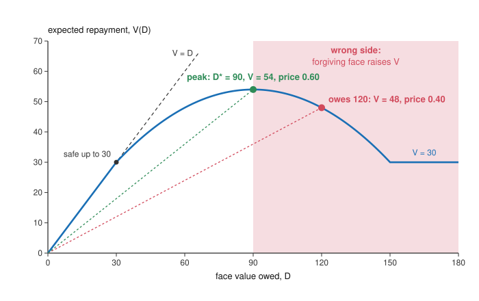

# Economics of Debt · Lesson 7.1: Haircuts, the debt Laffer curve and buybacks

> ⏱ ~15 min · Module 7: Restructuring and bankruptcy · Builds on: [2.4 Debt overhang](02-04-debt-overhang.md), [6.4 The Arellano model](06-04-the-arellano-model.md), [`mathematical-finance` 4.1 The term structure and bond pricing](../../mathematical-finance/lessons/04-01-term-structure-bond-pricing.md) · Unlocks: [7.2 Holdouts and collective action clauses](07-02-holdouts-and-collective-action-clauses.md), [8.1 Forgiveness, commitment and the fresh start](08-01-forgiveness-commitment-and-the-fresh-start.md)

## Why this matters

A restructuring ends in a headline number, "a 20 percent haircut", and the number depends on who is counting. Sturzenegger and Zettelmeyer (2008, *Journal of International Money and Finance*) measured investors' losses in six countries' restructurings of 1998–2005 and found averages from 13 percent (Uruguay, 2003) to 73 percent (Argentina, 2005). Two questions from the end of the 1980s debt crisis ([history-of-debt 5.4](../../history-of-debt/lessons/05-04-from-mexico-1982-to-the-brady-plan.md)) sit behind the number. Can forgiving part of a debt raise what creditors collect? Krugman (1988) and Sachs (1989) said yes, when the debt taxes the effort that would repay it. Should a debtor buy back its debt when the market sells it cheap? Bulow and Rogoff (1988) said no, unless creditors concede something in return. This lesson measures haircuts, builds the debt Laffer curve from [2.4](02-04-debt-overhang.md)'s overhang, and finds who gains from each way of cutting a debt.

## The idea

Swap a bond that pays 100 next year for one that pays 100 in ten years. Nothing was written off, so the *nominal* haircut is zero. But at an 8 percent yield money doubles in about nine years, so pushing the payment nine years out halves its value: creditors lost half of what they held. Real exchanges also cut face and coupon, and the measured loss then depends on the benchmark: the old face, or the old payments valued at the same yield.

Now take a country whose capacity to pay next year will be 150 in a good year or 30 in a bad one. Its government can make the good year likelier with costly effort: reform, investment, restraint. It owes 120. In a good year it pays 120 and keeps 30; in a bad year creditors take the whole 30. So creditors collect 90 of the 120 extra that a good year brings, a 75 percent tax on effort. Suppose the chance of a good year is proportional to what the country keeps from it: 0.2 when it keeps 30. Creditors expect $30+0.2\times90=48$. Cut the debt to 90: the country keeps 60, the tax falls to 50 percent, the chance doubles to 0.4, and creditors expect $30+0.4\times60=54$. Forgiving 30 of face raised what creditors collect by 6. This is the wrong side of the *debt Laffer curve*.

Why not let the country buy its debt back cheaply instead? At 120 of face the debt sells for $48/120=0.40$ per unit. But once a buyback is announced, every holder can see that the 90 left will be worth 54, or 0.60 per unit, and nobody sells for less. And a unit bought back saves the country money only in good years, since in bad years it would not have been paid anyway. The country pays the debt's average value for units worth less to it.

## The formal version

**Haircuts.** A bond with face $F$, annual coupon rate $c$ and $n$ years to run is worth, at yield $y$,

$$\begin{aligned}PV(y)&=cF\,a_n(y)+\frac{F}{(1+y)^n},\\ a_n(y)&=\frac{1-(1+y)^{-n}}{y}.\end{aligned}$$

*In words:* coupons are an annuity; the principal is one final payment. An exchange swaps an old bond (face $F_o$, value $PV_o$) for a new one (face $F_n$, value $PV_n$), and the [exit yield](../reference.md#exit-yield) $y^e$ is the new bond's market yield just after the exchange. The three [haircut measures](../reference.md#haircut-measures), nominal, Sturzenegger-Zettelmeyer (SZ) and market, are

$$\begin{aligned}H^{N}&=1-\frac{F_n}{F_o}&&\text{(nominal)},\\ H^{SZ}&=1-\frac{PV_n(y^e)}{PV_o(y^e)}&&\text{(SZ)},\\ H^{M}&=1-\frac{PV_n(y^e)}{F_o}&&\text{(market)}.\end{aligned}$$

*In words:* the nominal haircut counts face only, the SZ haircut values old and new payments at the same yield, and the market haircut sets the new bond's value against the old face. Market practice uses face because a default *accelerates* the bonds, turning the claim into face value due now. Sturzenegger and Zettelmeyer discount the old payments at the exit yield instead, so that $H^{SZ}$ measures what a participant gave up relative to a holdout still paid on the old terms: the temptation to hold out that [7.2](07-02-holdouts-and-collective-action-clauses.md) must overcome. When the old coupon is below the exit yield, as is typical, $PV_o<F_o$ and $H^{SZ}<H^M$, and the gap widens with the old bond's maturity. Size matters later: in 180 restructurings with foreign banks and bondholders (68 countries, 1970–2010), Cruces and Trebesch (2013, *AEJ: Macroeconomics*) find that larger haircuts go with significantly higher spreads and longer exclusion from capital markets afterward.

**The debt Laffer curve.** A country owes face value $D$, due next year. Its capacity to pay is $Y=Y_H$ with probability $p$ and $Y_L<Y_H$ otherwise, and creditors collect $\min(D,Y)$: ability to pay binds, and willingness ([6.2](06-02-reputation-and-eaton-gersovitz.md), [6.3](06-03-bulow-rogoff-and-sanctions.md)) is set aside. Beforehand the government chooses effort, the probability $p$, at cost $p^2/(2k)$, where $k>0$ measures how responsive effort is. Rates are zero and creditors risk-neutral. For $Y_L<D<Y_H$ the country keeps $Y_H-D$ in a good year and nothing in a bad one, so it maximizes $p\,(Y_H-D)-p^2/(2k)$:

$$p(D)=k\,(Y_H-D).$$

*In words:* effort is proportional to what the country keeps from a good year. For $D\le Y_L$ it keeps the whole gain and $p=\bar p\equiv k(Y_H-Y_L)$; for $D\ge Y_H$, $p=0$. The debt's market value is $V(D)=\mathbb E[\min(D,Y)]$ and its price per unit of face is $q=V/D$. For $Y_L<D<Y_H$,

$$\begin{aligned}V(D)&=Y_L+p(D)\,(D-Y_L),\\ V'(D)&=p(D)-k\,(D-Y_L).\end{aligned}$$

*In words:* an extra unit of face is collected only in a good year, with probability $p$; it also cuts effort by $k$, and each unit of effort lost costs creditors $D-Y_L$. The overhang term grows with $D$ and the direct term shrinks, so $V$ peaks where they balance, at $D^*=(Y_L+Y_H)/2$. That hump is the [debt Laffer curve](../reference.md#debt-laffer-curve): $V$ rises one for one up to $Y_L$, peaks at $D^*$ and falls back to $Y_L$ at $Y_H$. Above $D^*$ lies the *wrong side*, where forgiving face raises what creditors collect. Let $t=(D-Y_L)/(Y_H-Y_L)$ be the share of a good year's extra resources that creditors take: [2.4](02-04-debt-overhang.md)'s [overhang tax rate](../reference.md#overhang-tax-rate), now levied on a country's effort. Then $p=\bar p\,(1-t)$ and

$$V-Y_L=\bar p\,(Y_H-Y_L)\,t\,(1-t).$$

*In words:* creditors' extra take is a rate times a base that shrinks as the rate rises, a Laffer curve that peaks here at $t=1/2$. The less effort responds, the further out the peak (P2).

Who gains? The country's payoff $U(D)$, what it keeps minus its effort cost, falls at rate $p(D)$ by the envelope theorem, since a unit of face costs it a unit only in good years. Total value $U+V$ falls at rate $k(D-Y_L)$: each unit of face above $Y_L$ destroys value by depressing effort. On the wrong side a write-down raises both $U$ and $V$, a Pareto improvement. All of this is ex post; what expected write-downs do to lending beforehand is [8.1](08-01-forgiveness-commitment-and-the-fresh-start.md)'s question.

**Buybacks.** The country retires $X$ of face with cash $C$ that creditors could not otherwise reach. A holder sells only if paid what a unit will be worth after the buyback (Bulow and Rogoff 1988, *Brookings Papers on Economic Activity*), so

$$\frac{C}{X}=q(D-X)=\frac{V(D-X)}{D-X}.$$

*In words:* announcing a buyback raises the price to the value of the debt that will remain, and every unit gains the same, sold or held. The country saves $U(D-X)-U(D)=\int_{D-X}^{D}p(x)\,dx$, which per unit retired is the average probability of full repayment across the retired units: the [marginal value of debt](../reference.md#marginal-and-average-value-of-debt). It pays the average value, $q=p+(1-p)\,Y_L/(D-X)$ with $p=p(D-X)$, which exceeds every $p(x)$ on the retired range because $p$ falls with face. So in this model the country loses on every buyback, and creditors take the whole efficiency gain plus the country's loss: the [buyback boondoggle](../reference.md#buyback-boondoggle).

## Picture

Blue is expected repayment $V(D)$ for Example 2's country. The debt is safe up to 30; beyond, each extra unit of face is collected only in good years and erodes effort, so $V$ peaks at 54 at $D^*=90$. Anywhere in the shaded wrong side, a write-down to 90 raises what creditors collect. Each dotted ray's slope is a price: 0.40 at 120, 0.60 at 90.

## Worked examples

**Example 1 (the three haircuts).** An invented exchange swaps an old bond (face 100, 7 percent coupon, 4 years left) for a new one (face 80, 4.5 percent coupon, 12 years), and the exit yield is 11 percent. With $a_4(0.11)=3.1024$ and $a_{12}(0.11)=6.4924$,

$$\begin{aligned}PV_o&=7\times3.1024+\frac{100}{1.11^4}=21.72+65.87=87.59,\\ PV_n&=3.6\times6.4924+\frac{80}{1.11^{12}}=23.37+22.87=46.24.\end{aligned}$$

So $H^N=20\%$, $H^{SZ}=1-46.24/87.59=47.2\%$ and $H^M=1-46.24/100=53.8\%$. The old bond pays 7 percent against an 11 percent yield, so it was worth 87.59, not 100, and the SZ haircut is below the market one. The debtor can announce 20 percent, the face struck off. Creditors lost 47 percent of what the old bond was worth at the new yield, and 54 percent of what they were owed. The discount rate divides them too. Valued at 5 percent, a rate the debtor may expect to borrow at once it recovers, the swap cuts the value of what it owes from 107.09 to 76.45, only 28.6 percent: stretching payments to 12 years costs creditors who discount at 11 percent more than it saves a debtor who discounts at 5.

**Example 2 (forgive or buy back?).** The idea's country has $Y_L=30$, $Y_H=150$ and $k=1/150$, so effort costs $75p^2$ and $\bar p=0.8$. At $D=120$: $p=0.2$, $V=48$, $q=0.40$, and the country's payoff is $U=0.2\times30-75\times0.04=3$. There $V'(120)=0.2-0.6=-0.4$, so forgiving a unit of face raises collections by about 0.4. At $D^*=90$: $p=0.4$, $V=54$, $q=0.60$ and $U=0.4\times60-75\times0.16=12$. Two ways to cut the face from 120 to 90:

| Change from 120 of face | Creditors | Country | Total |
|---|---|---|---|
| Write-down to 90 | $+6$ | $+9$ | $+15$ |
| Buyback of 30 at 0.60, cash 18 | $+24$ | $-9$ | $+15$ |

The write-down is a Pareto improvement. The buyback makes the same cut and creates the same 15, but the price jumps from 0.40 to 0.60 on announcement, and the country pays 18 in cash to save 9, which is 0.30 per unit, the average of $p$ between 0.2 and 0.4. Sellers gain $18-0.40\times30=6$ and holders $54-0.40\times90=18$, 0.20 per unit either way. Even at the old price the country would pay 12 to save 9.

Bulow and Rogoff's own case is Bolivia. In March 1988 it used 34 million dollars donated by other governments to buy back 308 million of its 670 million of commercial bank debt, at about 11 cents. When a buyback was first discussed in 1986 the debt traded at 6 cents, a market value of 40.2 million. Afterward the remaining 362 million traded at 11 cents, or 39.8 million. The donors' 34 million cut the market value of Bolivia's debt by about 0.4 million, which they put at 1.2 percent of the cost; the rest raised the value of the banks' claims. They caution that the market was thin, and that the buyback may have bought Bolivia concessions elsewhere.

## Watch out

- **You might think any debt that may default is on the wrong side, but actually** $V$ falls only where the overhang term beats the direct one: above 90 in Example 2, though default is possible from 30. In between, forgiveness raises total value but is a transfer from creditors, who will not volunteer it.
- **You might think a deep discount alone puts a debt on the wrong side, but actually** with capacity fixed and no incentive effect, $V'(D)=\Pr(Y>D)\ge0$: more face never lowers collections, and a write-down is a pure transfer. A hump needs extra face to cut what is paid in some states: through effort here, or through the default decision itself, as in [6.4](06-04-the-arellano-model.md) and [6.5](06-05-self-fulfilling-debt-crises.md), where a default pays nothing.
- **You might think buybacks fail for every debtor, but actually** the result rests on the cash being beyond creditors' reach. In Bulow and Rogoff's "corporate" case, where default would hand creditors the cash itself, a buyback spends money they would otherwise seize, and they find that it favors the debtor.

## One-liner

> A debt that taxes the effort that would repay it can pass the peak of a Laffer curve, where a write-down pays creditors too; a buyback hands them all of that gain and more, because it buys units worth their marginal value at the debt's average price.

## Problems

**P1 (🟢) *(Formal (a)–(b) · Exegetical (c).)*** An invented sovereign swaps an old bond (face 100, 5 percent annual coupon, 3 years left) for a new one (face 85, 3 percent coupon, 10 years). The exit yield is 9 percent. (a) Compute the nominal, SZ and market haircuts. (b) At what exit yield would the SZ and market haircuts coincide, and why? (c) Just before the exchange the old bond traded at 49. What did a participant gain or lose on the day, and what does the SZ haircut measure instead? Two sentences for (c).

**P2 (🟡) *(Formal (a)–(b) · Exegetical (c).)*** An invented country's capacity to pay next year is 96 in a good year and 24 in a bad one, and it pays $\min(D,Y)$ on face value $D$. It chooses the probability $p$ of the good year at a cost of $32p^3$. Rates are zero and creditors risk-neutral. (a) For $24<D<96$, find the country's effort $p(D)$, the face value $D^*$ that maximizes expected repayment, and $V(D^*)$ and the price there. (b) The country owes 90. Find the price of its debt, and what creditors and the country each gain if the face is written down to $D^*$. (c) With the lesson's quadratic effort cost and these capacities, the peak would be at 60. Why is it further out here? One sentence.

**P3 (🔴, optional) *(Formal (a)–(b) · Exegetical (c).)*** An invented country's capacity to pay next year, $Y$, is uniform on $[0,100]$ whatever it owes or does, and it pays $\min(D,Y)$ on face value $D$. It owes 70; rates are zero and creditors risk-neutral. (a) Find the market value and price of its debt. (b) A donor pays for a buyback of 20 of face at the post-announcement price. Find that price, the donor's cost, and the gains of the country, of the creditors who sell and of those who hold. (c) Who gains from the donor's money, and what would a grant of the same cash, held beyond creditors' reach, do instead? Why does a unit retired save the country less than its price? Three sentences.

Solutions

**P1** *(Formal (a)–(b) · Exegetical (c).)*

(a) With $a_3(0.09)=2.5313$ and $a_{10}(0.09)=6.4177$, and a new coupon of $0.03\times85=2.55$,

$$\begin{aligned}PV_o&=5\times2.5313+\frac{100}{1.09^3}=12.656+77.218=89.87,\\ PV_n&=2.55\times6.4177+\frac{85}{1.09^{10}}=16.365+35.905=52.27.\end{aligned}$$

So $H^N=15\%$, $H^{SZ}=1-52.27/89.87=41.8\%$ and $H^M=1-52.27/100=47.7\%$.

(b) At 5 percent, the old coupon rate. The two haircuts share a numerator and differ only in the denominator, $PV_o(y^e)$ against $F_o=100$, and a bond discounted at its own coupon rate is worth exactly its face: $PV_o(0.05)=100$. Both haircuts are then $1-71.87/100=28.1\%$. Since $PV_o$ falls as the yield rises, 5 percent is the only such yield.

**Must hit, strict (c):**

- On the day the participant gained: the new bond is worth 52.27 against 49 for the old one just before, a gain of 3.27 (about 6.7 percent).
- $H^{SZ}$ compares the new bond with the old bond's payments valued at the exit yield, 89.87, which is what a holdout would hold if the debtor kept paying the old terms. It measures the concession the terms extracted relative to equal treatment, the temptation to hold out, and the pre-exchange price had already priced that concession in.

**Wrong turns:** a new coupon of 3 on 100 of face instead of $0.03\times85=2.55$; discounting the old bond at its own 5 percent coupon, which gives 100 and turns the SZ haircut into the market one; in (c), reading 41.8 percent as what participants lost that day.

**Model answer (c):** A participant gained about 3.27 on the day, since the new bond is worth 52.27 and the old one sold for 49 just before. The SZ haircut compares the new bond instead with the old bond's payments valued at the exit yield, 89.87, what a holdout paid on the old terms would hold, so it measures the concession the terms extracted, which the pre-exchange price had already reflected.

---

**P2** *(Formal (a)–(b) · Exegetical (c).)*

(a) For $24<D<96$ the country keeps $96-D$ in a good year, so it maximizes $p\,(96-D)-32p^3$. The first-order condition $96-D=96p^2$ gives $p(D)=\sqrt{(96-D)/96}$. Expected repayment is $V(D)=24+p(D)\,(D-24)$, and since $p'(D)=-1/(192\,p)$,

$$\begin{aligned}V'(D)=p-\frac{D-24}{192\,p}=0&\iff192\,p^2=D-24\\&\iff2\,(96-D)=D-24,\end{aligned}$$

so $D^*=72$. There $p=\sqrt{24/96}=0.5$, $V=24+0.5\times48=48$, and the price is $48/72=0.667$.

(b) At $D=90$, $p=\sqrt{6/96}=0.25$ and $V=24+0.25\times66=40.5$, a price of $0.45$. Writing the face down to 72 raises creditors from 40.5 to 48, a gain of 7.5. The country's payoff $p\,(96-D)-32p^3$ rises from $0.25\times6-32/64=1$ to $0.5\times24-32/8=8$, a gain of 7. Both gain, because 90 is on the wrong side.

**Must hit, strict (c):**

- Effort now falls with the square root of what the country keeps, so it is less responsive to creditors' share $t=(D-24)/72$: $p=\bar p\,(1-t)^{1/2}$ instead of $\bar p\,(1-t)$.
- A less responsive base lets creditors raise their share further before the shrinking effort costs them more than the higher share brings: the peak moves from $t=1/2$ to $t=2/3$, which is $24+\tfrac23\times72=72$.

**Wrong turns:** reusing the quadratic model's midpoint out of habit; differentiating $V$ with $p$ held fixed, which gives $V'=p>0$ and suggests more face always pays.

**Model answer (c):** Here effort falls only with the square root of what the country keeps, so creditors can take a larger share, two-thirds rather than a half of a good year's extra resources, before the lost effort costs them more than the larger share brings.

---

**P3** *(Formal (a)–(b) · Exegetical (c).)*

(a) With $Y$ uniform on $[0,100]$,

$$V(D)=\int_0^D\frac{y}{100}\,dy+D\Big(1-\frac{D}{100}\Big)=D-\frac{D^2}{200},$$

so $V(70)=70-24.5=45.5$ and the price is $45.5/70=0.65$.

(b) After the buyback 50 of face remains, worth $V(50)=50-12.5=37.5$, a price of $0.75$. No holder sells for less, so the donor pays $20\times0.75=15$. The country's expected payments fall from 45.5 to 37.5, a gain of 8. Sellers get 15 for claims worth $20\times0.65=13$, a gain of 2. Holders' 50 of face rises from $32.5$ to $37.5$, a gain of 5. Check: $8+2+5=15$.

**Must hit, strict (c):**

- Of the donor's 15, the country gets 8 and creditors 7, the same 0.10 per unit to sellers and holders.
- A grant of 15 beyond creditors' reach leaves $Y$, and so $V$, unchanged: the country gains all 15 and creditors nothing.
- A retired unit saves the country money only in the states where it would have been paid in full, $Y$ above it, and that probability averages 0.40 over units 50 to 70 (from 0.5 down to 0.3). The price, 0.75, is a unit's average value, which also collects part of $Y$ when $Y$ falls short.

**Wrong turns:** buying at the pre-announcement price of 0.65, which no holder accepts once the price after the buyback is 0.75; counting all of the donor's 15 as the country's gain.

**Model answer (c):** Of the donor's 15, the country gains 8 and creditors 7, split evenly per unit between those who sell and those who hold, while a grant of 15 would give the country all of it, since the resources creditors collect from would not change. A retired unit saves the country money only in the states where it would have been paid in full, whose probability averages 0.40 over the units retired, but the price of 0.75 is a unit's average value, which also collects part of the country's resources when they fall short.

## Flashback

**From Lesson [6.4](06-04-the-arellano-model.md) (The Arellano model):** *(Formal.)* An invented country sells one-year discount bonds with face $b'$, a promise to pay $b'$ next year. Lenders are competitive and risk neutral and can earn $r^*=2.5\%$ elsewhere. Next year is the last, and its income $y'$ will be uniform on $[0.85,\,1.15]$. If the government repays, it consumes $y'-b'$. If it defaults, it owes nothing and consumes its output, which default caps at 0.88: $\min(y',0.88)$. It repays whenever repaying leaves it at least as well off as defaulting. (a) At which incomes does it default, what is the largest face that is ever repaid, and what does a bond of face $b'$ sell for? (b) Which face raises the most today, and what are the price and the amount raised there? (c) The government is about to issue $b'=0.22$. What does it raise, what smaller face would raise exactly the same, and how do the two bonds' default probabilities compare?

Solution

(a) Default costs nothing below the cap: at $y'\le0.88$ the government consumes $y'$ by defaulting and $y'-b'$ by repaying, so it defaults at every such income. Above the cap it repays iff $y'-b'\ge0.88$. So it defaults iff $y'<0.88+b'$, and the largest face ever repaid is $1.15-0.88=0.27$. The chance of repayment is $(0.27-b')/0.30$, so for $0<b'\le0.27$

$$q(b')=\frac{1}{1.025}\cdot\frac{0.27-b'}{0.30}=\frac{0.27-b'}{0.3075},$$

and $q=0$ above 0.27. Every positive promise carries a spread, because default below 0.88 is free: $q\to0.878$ as $b'\to0$, against the safe $1/1.025=0.976$.

(b) Proceeds are $q(b')\,b'=b'\,(0.27-b')/0.3075$, a parabola in $b'$ with the same $t\,(1-t)$ shape as this lesson's debt Laffer curve ($t=b'/0.27$), so it peaks at half the largest repayable face: $b'=0.135$. There $q=0.135/0.3075=0.4390$ and the government raises $0.135\times0.4390=0.0593$, the most it can. Past the peak a larger promise raises less, and at 0.27 nothing.

(c) At 0.22, $q=0.05/0.3075=0.1626$ and the government raises $0.22\times0.1626=0.0358$. The parabola is symmetric about its peak, since $b'(0.27-b')$ takes the same value at $b'$ and at $0.27-b'$, so the face $0.27-0.22=0.05$ (price $0.22/0.3075=0.7154$) raises the same 0.0358. The default probabilities are $(0.88+0.22-0.85)/0.30=5/6$ for 0.22 and $(0.88+0.05-0.85)/0.30=4/15$ for 0.05. Lenders expect to collect the same from either, $0.22\times\tfrac16=0.05\times\tfrac{11}{15}=0.0367$, and break even on both. But the large bond is defaulted on far more often, and the output that default throws away, $\int_{0.88}^{0.88+b'}(y'-0.88)\,dy'/0.30=b'^2/0.60$ on average, is 0.081 for it against 0.004 for the small one. So 0.22 lies past the peak: the smaller promise raises the same money with less waste.

**Wrong turns:** reading default as inability to pay, $y'<b'$, which never triggers for a face below 0.85 and prices every bond at the safe 0.976; issuing the largest repayable face, 0.27, to raise the most, when its price is zero; dropping the safe-rate discount, which puts the price at the peak at 0.45.

## Connections

- **Backward:** [2.4](02-04-debt-overhang.md) made overhang a tax on a firm's investment and found a window of write-downs both sides accept. Here the tax falls on a country's effort, and creditors accept any face from 60 to 120, where $V$ is at least 48. In [6.4](06-04-the-arellano-model.md) and in [6.5](06-05-self-fulfilling-debt-crises.md)'s Calvo curve, what a promise raises, its price times its face, also turns down as face grows, because more face triggers default; here more face depresses effort. [5.4](05-04-fiscal-limits-and-unpleasant-arithmetic.md)'s tax and seigniorage Laffer curves are the same rate-times-base algebra.
- **Forward:** [7.2](07-02-holdouts-and-collective-action-clauses.md) takes up the holdout temptation that the SZ haircut measures: a write-down on the wrong side helps every creditor, but each gains more by keeping full face while the others forgive. [8.1](08-01-forgiveness-commitment-and-the-fresh-start.md) asks what expected relief does to lending beforehand. Krugman (1988) also proposed tying relief to things beyond the country's control, such as commodity prices and world interest rates, which [8.3](08-03-relief-written-into-the-contract.md) writes into the contract.
- **Sideways:** [history-of-debt 5.4](../../history-of-debt/lessons/05-04-from-mexico-1982-to-the-brady-plan.md) works a buyback in which payments do not depend on face and the country buys at the old price. This lesson adds the jump in price on announcement and the effort effect, and neither rescues the buyback. A Brady exchange, that lesson notes, was a simultaneous, collective swap rather than quiet purchases in the market, closer to the write-down row of Example 2's table. Its [5.5](../../history-of-debt/lessons/05-05-jubilee-2000-and-hipc.md) hands over why cancelling debt can raise a country's investment rather than merely its consumption, which is this lesson's effort effect, and its [6.2](../../history-of-debt/lessons/06-02-the-eurozone-and-greece.md) reports three different haircut numbers for Greece in 2012. [theology-of-debt 2.3](../../theology-of-debt/lessons/02-03-the-parables-of-debt.md) reads the parable of a king who forgives a debt no servant could repay; the model says only that writing off face a debtor cannot pay costs a creditor nothing he could have collected, and on the wrong side gains him something. Whether relief is fair to those who paid is [philosophy-of-debt 5.2](../../philosophy-of-debt/lessons/05-02-moral-hazard-and-fairness-to-those-who-paid.md)'s question.
