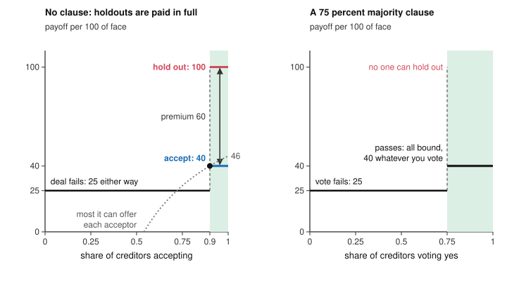

# Economics of Debt · Lesson 7.2: Holdouts and collective action clauses

> ⏱ ~15 min · Module 7: Restructuring and bankruptcy · Builds on: [7.1 Haircuts, the debt Laffer curve and buybacks](07-01-haircuts-the-debt-laffer-curve-and-buybacks.md), [3.1 Diamond-Dybvig](03-01-diamond-dybvig.md), [2.4 Debt overhang](02-04-debt-overhang.md) · Unlocks: [7.3 Designing bankruptcy](07-03-designing-bankruptcy.md)

## Why this matters

A country that cannot pay has no court to write its debts down ([history-of-debt 6.3](../../history-of-debt/lessons/06-03-holdouts-and-the-law-of-sovereign-restructuring.md)). It restructures by offer: bondholders are invited to swap their bonds for new ones worth less, and nobody has to accept. Every bondholder would like the others to accept, because a country that has shed most of its debt can afford to pay a few refusers in full. Argentina's refusers were paid in 2016, more than fourteen years after its 2001 default. In Greece's 2012 exchange, holdouts built blocking positions in about half of its foreign-law bond series (IMF staff, 2014). This lesson models the holdout problem as a game and shows what majority clauses change, what a veto costs, and what senior claims take from everyone else.

## The idea

A country's bonds have a face value of 100, spread over thousands of investors. It can pay at most 46 of it, in present value. It offers each bondholder a new bond worth 40 per 100 of face, take it or leave it. A refuser keeps the old bond, and once the country's finances are back in order she can sue and collect in full. If the deal collapses, the default turns disorderly and every old bond is worth 25.

Can the country afford the deal? If 90 percent accept, it owes them $0.9\times40=36$ and the holdouts $0.1\times100=10$: 46, its limit. With fewer acceptances it cannot pay both, and the deal collapses.

Now take one bondholder, too small to change how many accept. If 90 percent or more accept, the deal works, and accepting pays 40 while holding out pays 100. If fewer accept, the deal fails and she gets 25 either way. Holding out is never worse and sometimes far better. Every bondholder reasons the same way, nobody accepts, and each ends with 25, although all would have had 40 had all accepted. That is the [holdout problem](../reference.md#holdout-problem).

Now write a majority rule into the bonds: if holders of 75 percent vote yes, the new terms bind everyone, including those who voted no. Your vote matters only if it decides the outcome, and then you are choosing between 40 and 25, so you vote yes. The offer passes and everyone gets 40.

## The formal version

**Setup.** A continuum of creditors of mass 1 each hold a bond of face 100. The sovereign can pay at most $C<100$ in present value to all bondholders together: its capacity. It offers a new claim worth $v$ per bond, with $d<v\le C$, where $d$ is what each bond is worth if the exchange fails and the default turns disorderly. A holdout collects $h$ if the exchange goes through: 100 if holdouts are paid in full, more if a judgment adds accrued interest. Law and courts set $h$; IMF staff (2014) expected the *pari passu* rulings of history-of-debt 6.3 to invite more blocking positions. A share $\theta$ accepts, and the exchange goes through iff the country can pay both groups:

$$\theta v+(1-\theta)h\le C\iff\theta\ge\hat\theta=\frac{h-C}{h-v}\qquad(h>C).$$

*In words:* the participants' haircuts must pay for the holdouts' full recovery, and the [participation threshold](../reference.md#participation-threshold) $\hat\theta$ is the smallest share that frees enough. It falls with $C$ and rises with $h$ and with $v$: a more generous offer needs more takers.

**The free ride.** One creditor cannot move $\theta$. If $\theta\ge\hat\theta$ she gets $v$ by accepting and $h$ by holding out; otherwise she gets $d$ either way. So when $h>v$, holding out is weakly dominant ([grad-game-theory 2.1](../../grad-game-theory/lessons/02-01-normal-form-dominance-rationalizability.md)): never worse, and better by the [holdout premium](../reference.md#holdout-premium) $h-v$ whenever the deal goes through. No $\theta\ge\hat\theta$ is an equilibrium, since every participant would rather switch. The deal fails and each creditor gets $d<v$.

*In words:* each creditor wants the others to accept and herself to hold out, so the relief a deal would create is a public good nobody pays for ([grad-micro 6.4](../../grad-micro/lessons/06-04-public-goods.md)). And when $h>C$, no affordable offer ends the free ride, since every affordable offer is at most $C$.

**A run in reverse.** In [3.1](03-01-diamond-dybvig.md) a depositor withdraws because others withdraw. Here a creditor holds out because others accept: the more they concede, the more a holdout collects. In both, individually sensible choices block an outcome every creditor prefers, and the cure is to take away the option whose exercise hurts the rest.

**Changing the game.**

- *[Exit consents](../reference.md#exit-consents)* (Buchheit and Gulati 2000, *UCLA Law Review*). Accepting creditors vote, on their way out, to strip the old bonds of non-payment protections such as listing, cross-default and the waiver of immunity, which usually takes a simple majority and cuts $h$ for those left behind. Once $h<v$, accepting beats holding out whenever the deal goes through. Ecuador (2000) and Uruguay (2003) used them. Pushed far enough they coerce: if the stripped bond is worth less than the offer, creditors accept even an offer below $d$.
- *Minimum participation.* The offer is void unless a share $\theta_{\min}\ge\hat\theta$ accepts, so accepting costs nothing if too few join, and once $h<v$ it is weakly dominant. Without the condition, an acceptor stuck in a failed deal holds a smaller claim in the default, and all-hold-out survives beside all-accept (Bi, Chamon and Zettelmeyer 2011, IMF Working Paper 11/265).
- *A [collective action clause](../reference.md#collective-action-clause).* If holders of a share $\kappa$ of the bonds vote yes, the new terms bind them all. A creditor gets $v$ if the vote passes and $d$ if it fails, whatever her own vote, and a vote matters only when pivotal, where it compares $v$ with $d$. *In words:* a supermajority binds the minority, and it passes exactly the offers that beat the default, $v>d$.

**Voting pools and [blocking stakes](../reference.md#blocking-stake).** A clause binds only the bonds in its voting pool. Series-by-series clauses typically need 75 percent of each bond series. The ICMA model clauses of 2014, as IMF staff describe them, add two aggregated options: a two-limb vote needing $66\tfrac23$ percent of all affected series together and more than 50 percent of each, and a single-limb vote needing 75 percent of the aggregate, allowed only if every series is offered the same terms (the "uniformly applicable" condition). A veto needs a stake of face value $b$ just over the share $1-\kappa$ of the face value in its voting pool (exactly half suffices against a limb that asks for more than half), and costs $qb$ at a market price $q$ per unit of face.

*In words:* under series-by-series voting the smallest series sets the price of a veto, under a single limb the whole stock does, and a blocked series must be paid in full, litigated with, or left out.

**[Seniority](../reference.md#sovereign-seniority)** (handed over by [history-of-debt 6.4](../../history-of-debt/lessons/06-04-new-creditors.md)). Some claims are paid before the bonds whatever the bondholders vote: loans secured on an escrowed revenue stream, and the IMF and other multilaterals. Schlegl, Trebesch and Wright (2019, NBER Working Paper 25793) confirm that multilaterals are senior in practice, and find official bilateral debt junior, or at least not senior, to bonds and bank loans. With senior claims $S$ paid first out of $C$, bonds of face $B$ recover $(C-S)/B$ per unit instead of the $C/(S+B)$ an equal split would give, a transfer to the seniors of

$$S\left(1-\frac{C}{S+B}\right).$$

*In words:* the juniors lose exactly what the seniors would have lost under equal treatment, and the capacity left for the bond exchange shrinks, which raises $\hat\theta$.

## Picture

Left, Example 1's creditor: above $\hat\theta=0.9$ holding out pays 60 more, so the shaded region is never reached. The dotted curve, $(C-(1-\theta)h)/\theta$, is the most the country can pay each acceptor, and it meets the offer of 40 exactly at $\hat\theta$. Right: under a 75 percent clause a creditor's payoff depends on the others' votes, never on her own.

## Worked examples

**Example 1 (the model on a clean case).** The idea's numbers, per 100 of face: $C=46$, $v=40$, $h=100$, $d=25$.

- *Threshold and premium.* $\hat\theta=(100-46)/(100-40)=54/60=0.9$. Check: $0.9\times40+0.1\times100=46=C$. The premium is $100-40=60$. Holding out is weakly dominant, and each creditor ends with 25.
- *A sweeter offer backfires.* At $v=44$, $\hat\theta=54/56\approx96.4\%$, and holding out still pays 56 more.
- *Exit consents.* Suppose that once half the bonds are tendered, the amendments leave a holdout's bond worth 35. At any $\theta\ge\tfrac12$ the country can pay everyone, since $40\theta+35(1-\theta)\le40<46$, and accepting pays 40 against 35. Below one half the consents fail, the deal is unaffordable, and a minimum participation condition voids the offer, so both actions pay 25. Accepting is weakly dominant, and all accept.
- *A 75 percent clause.* A pivotal voter compares 40 with 25 and votes yes, all are bound, and each creditor gets 40. Who gains and who pays: every creditor gains 15 over the disorderly default, and the country pays 40 of its 46 and avoids the default's costs. The clause would pass any offer above 25, so where in $(25,46]$ the offer lands is left to bargaining ([grad-game-theory 3.5](../../grad-game-theory/lessons/03-05-bargaining.md)). Before the fact, Eichengreen and Mody (2000, NBER Working Paper 7458) found that such clauses lowered spreads for more creditworthy issuers and, if anything, raised them for less creditworthy ones.

**Example 2 (why you'd care: a realistic debt stack).** A country owes 3 billion dollars to the IMF, 5 billion on a loan secured on oil revenue, and bonds with face value 32 billion in four series of 16, 9, 5 and 2 billion. It can pay 20 billion in total, in present value. Its bonds trade at 30 cents on the dollar.

- *What seniority takes.* The IMF and the secured lender are paid first, which leaves $20-8=12$ billion for the bonds: 37.5 cents per dollar of face. An equal split of all 40 billion of claims would give 50 cents. The transfer is $8\times(1-20/40)=4$ billion: bondholders get 12 billion rather than 16.
- *The price of a veto.* Under series-by-series 75 percent votes, a fund blocks the 2-billion series with just over 0.5 billion of face, costing about 150 million dollars at 30 cents. Under the two-limb clause it needs half that series, 1 billion of face, or 300 million dollars. Under a single limb it needs more than a quarter of all 32 billion, over 8 billion of face, about 2.4 billion dollars: sixteen times the series-by-series price.
- *Who pays for the veto.* If the blocked series is paid in full, the other 30 billion of face share $12-2=10$ billion, a third of a dollar each instead of 37.5 cents. The fund's stake, bought for about 150 million dollars, collects 500 million, and the rest of its series rides along. The other bondholders pay for all of it, 1.25 billion dollars, which is why they balk at a deal that leaves a small series blocked.

## Watch out

- **You might think a more generous offer fixes the holdout problem, but actually** it raises $\hat\theta$, since $\partial\hat\theta/\partial v=(h-C)/(h-v)^2>0$: each participant now takes more of the capacity. The premium stays positive whenever $h>C$; only lowering $h$ or binding the minority helps.
- **You might think the free ride is 3.1's coordination failure, with a good equilibrium waiting to be selected, but actually** with $h>v$ all-accept is not an equilibrium at all, as in a prisoner's dilemma. The game acquires 3.1's two equilibria only once $h<v$, and then a minimum participation condition picks the good one.
- **You might think collective action clauses ended holdouts, but actually** a series-by-series clause invites a blocking stake in the smallest series, and no bond clause reaches the IMF, a secured lender or a bilateral official creditor.
- **You might think holdouts sank most bond restructurings, but actually** Bi, Chamon and Zettelmeyer (2011) find that bond exchanges since the late 1990s were mostly quick, with little litigation. Argentina's 2005 offer, the one many creditors rejected, combined a deep haircut with no participation threshold and no exit consents.

## One-liner

> A holdout collects more than the offer whenever the deal succeeds, so every small creditor waits for the others to accept; a majority clause removes the option to wait, but only within its voting pool.

## Problems

**P1 (🟢) *(Formal.)*** A sovereign can pay at most 52 per 100 of face, in present value, to all its bondholders together. A creditor who holds out and sues collects a judgment worth 115 per 100 of face (principal plus accrued interest), paid in full once the country is solvent again. The country offers a new bond worth 38 per 100 of face. (a) Find the participation share the exchange needs, and the holdout premium. (b) The country sweetens the offer to 45. Recompute both. (c) Could any offer the country can afford make accepting at least as good as holding out? If not, what would have to happen to the holdouts' recovery, and by how much?

**P2 (🟡) *(Formal (a)–(b) · Exegetical (c).)*** A sovereign's bonds have face value 20 billion dollars in three series of 12, 6.5 and 1.5 billion, trading at 20 cents on the dollar. It can pay its bondholders 8 billion in present value, so it plans to offer 40 cents per dollar of face to every series. (a) Find the cost, at the market price, of the cheapest stake that gives one investor a veto: under series-by-series 75 percent votes, under the two-limb clause (more than 50 percent of each series and $66\tfrac23$ percent of the total), and under a single-limb 75 percent clause. (b) Under series-by-series voting, a fund blocks the smallest series and the country pays that series in full. What is the most it can now offer per dollar of the other series? What does the fund make, and who pays for it? (c) In two sentences: why does the single-limb clause require that every series be offered the same terms, and who would pay without that condition?

**P3 (🔴, optional) *(Formal.)*** A country can pay 24 billion dollars in total, in present value. It owes 4 billion to the IMF and 6 billion on a loan secured on export revenue, both paid first, and 50 billion of bonds. (a) Find the bonds' recovery per dollar of face, the recovery if all claims shared equally, and the transfer from bondholders to the senior creditors. (b) Bonds with face value 5 billion fall due now. The IMF lends 5 billion more, senior like the rest of its claims, and the country uses it to repay those bonds at par. Capacity is unchanged. Find the recovery of the remaining bonds, and who gains and who loses how much. (c) Supporters say the IMF program raises the country's capacity to pay. By how much must capacity rise for the remaining bondholders to be no worse off than in (a)?

Solutions

**P1** *(Formal.)*

(a) $\hat\theta=(h-C)/(h-v)=(115-52)/(115-38)=63/77=9/11\approx81.8\%$. Check: $\tfrac{9}{11}\times38+\tfrac{2}{11}\times115=(342+230)/11=52=C$. The holdout premium is $115-38=77$.

(b) $\hat\theta=(115-52)/(115-45)=63/70=90\%$, and the premium is $115-45=70$. Check: $0.9\times45+0.1\times115=40.5+11.5=52$. The sweeter offer needs more participation, and holding out still pays 70 more.

(c) No. Every affordable offer is at most $C=52<115$, so holding out pays more whenever the deal goes through. Accepting is weakly dominant only if $h\le v=38$, so the holdouts' recovery would have to fall by at least $115-38=77$ per 100 of face, through exit consents or courts that stop enforcing full payment. Then $h\le C$ and every participation share is affordable. The alternative is to bind the holdouts with a majority clause.

**Wrong turns:** reporting $(C-v)/(h-v)=14/77\approx18.2\%$, which is the largest share of *holdouts* the country can carry, as the participation needed; concluding from (b) that sweetening helps because each participant is better off.

---

**P2** *(Formal (a)–(b) · Exegetical (c).)*

(a) Series-by-series: block the 1.5-billion series with more than a quarter of it, just over 0.375 billion of face, which costs about 75 million dollars at 20 cents. Two-limb: the cheapest veto is still one series, now with at least half of it, 0.75 billion of face, or 150 million dollars; blocking the aggregate limb instead would take more than a third of all 20 billion, about 1.33 billion dollars. Single limb: more than a quarter of the whole 20 billion, over 5 billion of face, about 1 billion dollars, which is $40/3\approx13.3$ times the series-by-series price.

(b) The other 18.5 billion of face now share $8-1.5=6.5$ billion, so the most they can be offered is $6.5/18.5\approx35.1$ cents per dollar, down from 40. The fund's stake, about 375 million dollars of face bought for 75 million, collects 375 million: a profit of about 300 million. The other two series pay. They get 6.5 billion instead of $0.4\times18.5=7.4$ billion, a loss of 0.9 billion, and the blocked series as a whole gains $1.5-0.6=0.9$ billion. Of that, 225 million over the offer goes to the fund and 675 million to the series' other holders, who ride along.

**Must hit, strict (c):**

- Aggregation lets votes cast in one series bind another, so without the condition a 75 percent majority built from the larger series could impose worse terms on a small series than it accepts for itself.
- The small series' holders would pay, and the majority would gain. The condition makes the majority vote for terms it must take too, so the vote cannot move value between series.

**Wrong turns:** in (a), taking a quarter of the smallest series under the single limb, or more than a quarter of a series under the two-limb clause, whose per-series limb is a simple majority; forgetting to price the face value at 20 cents. In (b), keeping the 40-cent offer for the other series, which is no longer affordable: $0.4\times18.5+1.5=8.9>8$.

**Model answer (c):** A single-limb vote lets holders of some series bind others, so without the condition a majority drawn from the larger series could vote a deeper cut onto a small series while keeping better terms for themselves, and the small series' holders would pay. Requiring the same menu for every series means the majority can bind the minority only to a deal it accepts for itself.

---

**P3** *(Formal.)*

(a) The seniors take $4+6=10$ billion, which leaves 14 billion for 50 billion of bonds: 28 cents per dollar of face. An equal split would give $24/60=40$ cents. Bondholders get 14 billion instead of 20, a transfer of $10\times(1-24/60)=6$ billion to the senior creditors.

(b) Senior claims rise to 15 billion, so the remaining 45 billion of bonds share $24-15=9$ billion: 20 cents per dollar. Holders of the maturing bonds get 5 billion instead of $5\times0.28=1.4$, a gain of 3.6 billion. The remaining bondholders get 9 billion instead of $45\times0.28=12.6$, a loss of 3.6 billion. The IMF is repaid in full either way, so its loan moved 3.6 billion from the bondholders who stayed to those who were repaid. In general, repaying $L$ of junior claims at par with senior money cuts the others' recovery from $(C-S)/B$ to $(C-S-L)/(B-L)$, which is lower whenever the juniors are impaired, $C-S<B$.

(c) The remaining bondholders need 12.6 billion again, 3.6 billion more than they now get, so capacity must rise by 3.6 billion, to 27.6. Check: $(27.6-15)/45=0.28$. If it rises by less, the remaining bondholders pay the rest of the maturing holders' 3.6 billion gain.

**Wrong turns:** treating the new IMF loan as extra resources for all creditors, when it pays the maturing holders at par and adds to the senior claims; spreading the 9 billion over all 50 billion of original face.

## Flashback

**From Lesson [6.5](06-05-self-fulfilling-debt-crises.md) (Self-fulfilling debt crises):** *(Formal.)* In an invented rollover model, honoring a government's debt $b$ (a share of one year's GDP) costs $b$ if lenders roll over what falls due, and $b+\kappa(\lambda b)^2$ if they refuse (a run), where $\kappa>0$ and $\lambda$ is the share of the debt falling due each year: $\lambda=1$ for one-year bonds and $\lambda=\tfrac12$ for two-year bonds in equal yearly slices. The government honors iff the cost is at most its default cost $K$. The crisis zone is the range of debt in which it honors if lenders roll over and defaults if they refuse, and you observe that the zone starts at a debt of 0.75 with one-year bonds and at 1.0 with two-year bonds. (a) Find $\kappa$ and $K$. (b) The government's debt is 0.95, all in one-year bonds, and a unit of face sells for 0.875 while the safe rate is 4 percent. Lenders are risk-neutral, a default pays nothing, and whenever a run is an equilibrium they put probability $p$ on one. Find $p$. What would a unit of face sell for if the same debt were in two-year bonds?

Solution

(a) The zone starts where honoring in a run just costs $K$, so $b+\kappa\lambda^2b^2=K$ at each edge. With one-year bonds, $0.75+0.5625\,\kappa=K$. With two-year bonds, $\lambda^2=\tfrac14$ and $1.0+0.25\,\kappa=K$. Subtracting gives $0.3125\,\kappa=0.25$, so $\kappa=0.8$ and $K=1.2$.

(b) At 0.95 rolling over costs 0.95, below $K=1.2$, but a run costs $0.95+0.8\times0.95^2=1.672>1.2$, so with one-year bonds the debt is in the crisis zone and its price is $(1-p)/(1+r^*)$, with $r^*=0.04$ the safe rate. Then $0.875=(1-p)/1.04$ gives $1-p=0.91$, so $p=9\%$ (a yield of 14.3 percent against the safe 4). With two-year bonds a run costs only $0.95+0.8\times\tfrac14\times0.95^2=1.1305\le1.2$, so the government repays even in a run, refusing protects no lender, and the run equilibrium is gone. The bond sells at the safe price $1/1.04=0.9615$: the spread of 10.3 points disappears, though the debt, $\kappa$ and $K$ are unchanged.

**Wrong turns:** putting $\lambda$ into the run cost linearly, $\kappa\lambda b^2$, which gives $\kappa=4$ and $K=3$, far above either edge; reading the price as $1-p$ and forgetting to discount at the safe rate, which gives $p=12.5\%$.

## Connections

- **Backward:** [3.1](03-01-diamond-dybvig.md)'s run is this game with the sign flipped, and [3.2](03-02-stopping-runs.md)'s remedies have counterparts here: suspension of convertibility takes away the option to run, a majority clause the option to hold out, and a minimum participation condition, like deposit insurance, makes the cooperative choice safe whatever the others do. [2.4](02-04-debt-overhang.md) met the holdout problem in a firm's exchange offer, and $\hat\theta$ generalizes its three-quarters. The offer's value $v$ is a haircut measured as in [7.1](07-01-haircuts-the-debt-laffer-curve-and-buybacks.md). [6.5](06-05-self-fulfilling-debt-crises.md)'s lenders fail to coordinate on rolling a debt over; here they fail to coordinate on writing it down.
- **Forward:** [7.3](07-03-designing-bankruptcy.md) designs the court that sovereigns lack, where a stay and class voting do by statute what clauses do by contract, and where classes are sorted by priority rather than by series.
- **Sideways:** Grossman and Hart (1980, *Bell Journal of Economics*) found the same free ride in takeover bids: a small shareholder refuses to tender, because if the bid succeeds she keeps the value the raider adds. In the debt thread, [history-of-debt 6.3](../../history-of-debt/lessons/06-03-holdouts-and-the-law-of-sovereign-restructuring.md) tells the Argentine litigation and the fate of a statutory mechanism, and [6.4](../../history-of-debt/lessons/06-04-new-creditors.md) the secured and bilateral lenders that no bond clause reaches. [philosophy-of-debt 5.3](../../philosophy-of-debt/lessons/05-03-bankruptcy-as-a-moral-institution.md) reads a majority clause as the creditors' bargain written in advance. Whether it is fair to bind a dissenting minority, or to buy a blocking stake and sue for par, is the kind of question that course asks; this lesson says only who gains and who pays.
