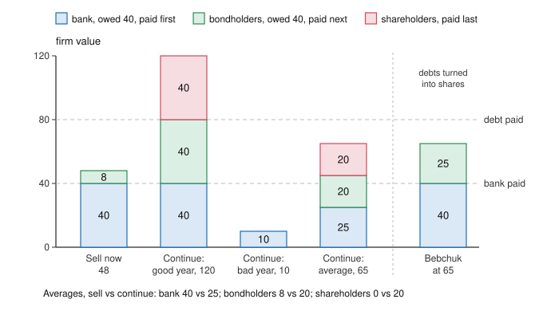

# Economics of Debt · Lesson 7.3: Designing bankruptcy

> ⏱ ~15 min · Module 7: Restructuring and bankruptcy · Builds on: [2.3 Agency costs of debt and equity](02-03-agency-costs-of-debt-and-equity.md), [2.4 Debt overhang](02-04-debt-overhang.md), [7.2 Holdouts and collective action clauses](07-02-holdouts-and-collective-action-clauses.md) · Unlocks: [8.1 Forgiveness, commitment and the fresh start](08-01-forgiveness-commitment-and-the-fresh-start.md)

## Why this matters

A firm that cannot pay its debts is often worth more whole than in pieces, and its creditors, acting alone, will take it apart anyway. Bankruptcy law exists to stop them; then it must decide whether to sell the firm or keep it running, and divide what there is. [2.2](02-02-taxes-bankruptcy-costs-trade-off-theory.md) priced the costs of financial distress; the procedure decides how large they get. This lesson shows why a class vote under US Chapter 11 decides badly, and how Bebchuk (1988) and Aghion, Hart and Moore (1992) decide by value and divide by priority without anyone knowing what the firm is worth. A state has no such court, and the missing pieces show why.

## The idea

Four suppliers are each owed 30 by a machine shop that cannot pay: 120 in all. Sold as a working business, the shop would fetch 96; taken apart machine by machine, 60. (The numbers are invented.)

Outside bankruptcy, a supplier with a court judgment can have the sheriff seize machines worth her 30. The first seizure stops the shop, so the rest sells piece by piece. From one supplier's side:

- If the others wait, grabbing gets her 30 in full; waiting with them gets a quarter of 96, which is 24.
- If others grab, waiting leaves her a share of the scraps, or nothing.

Grabbing pays more whatever the others do, so everyone grabs. The 60 pays the first two in line, and each supplier, not knowing her place, expects 15 instead of 24. The race destroys 36. It is a prisoner's dilemma, and that shapes the cure. In the bank run of [3.1](03-01-diamond-dybvig.md), waiting was also an equilibrium, so a guarantee could restore it; here waiting is never a best reply, so the law must take the grab away. That is the automatic stay.

Stopping the race raises two more questions: sell or keep running, and who gets what. A bank ranked first gets its money back from a sale today and gains nothing from a risky future; bondholders behind it get little today and most of the upside. Each class votes for its slice, not for the pie.

## The formal version

**The race ([creditors' bargain](../reference.md#creditors-bargain)).** A firm owes $n$ creditors $d$ each. Kept whole it is worth $G$, its going-concern value; broken up, it fetches $L<G$. It is insolvent, $G<nd$, and $d\le L$. Each creditor grabs (seizes assets worth up to $d$) or waits. The first grab breaks the firm up: grabbers are paid in random order until $L$ runs out, and waiters share what is left. If nobody grabs, the firm is sold whole and each creditor gets $G/n$.

*Result.* Grabbing strictly dominates waiting, so everyone grabs, each creditor expects $L/n$, and $G-L$ is lost. *In words:* a lone grabber gets $d>G/n$, and against other grabbers she is sometimes first in line, while a waiter only shares the scraps.

Jackson (1986, *The Logic and Limits of Bankruptcy Law*) called this a common-pool problem and asked what creditors would agree to before knowing their places in line: $G/n$ for sure beats $L/n$ on average, so all would sign. Creditors who lend at different times cannot all sign, so the law signs for them ([philosophy-of-debt 5.3](../../philosophy-of-debt/lessons/05-03-bankruptcy-as-a-moral-institution.md) weighs it as a moral argument).

**The stay ([automatic stay](../reference.md#automatic-stay)).** A bankruptcy petition halts creditors' suits, seizures, lien enforcement and collection against the debtor (11 U.S.C. §362(a)). *In words:* the grab is no longer available, so the dilemma is gone.

**Priority ([absolute priority](../reference.md#absolute-priority)).** Classes $k=1,\dots,m$, with 1 the most senior, have face values $D_k$, and $K_k=D_1+\dots+D_{k-1}$ is the debt ranked ahead of class $k$. At firm value $V$, class $k$ receives

$$x_k(V)=\min\bigl\{D_k,\ \max(V-K_k,\,0)\bigr\},$$

and the shareholders keep $\max(V-K_{m+1},\,0)$. *In words:* pay each class in full, in order of rank, until the money runs out. The senior payoff is concave in $V$, the shareholders' convex (a call option, [2.3](02-03-agency-costs-of-debt-and-equity.md)), and a middle class's flat, then rising, then flat.

**Sell or continue.** Selling yields $L$ now; continuing yields a random $\tilde V$. Continuing maximizes value if $\mathbb{E}\tilde V>L$, but class $k$ prefers it only if $\mathbb{E}\,x_k(\tilde V)>x_k(L)$. *In words:* a class that a sale pays in full prefers selling whenever continuing risks leaving it short, however large $\mathbb{E}\tilde V$ is; a class that a sale leaves with nothing prefers continuing whenever it has any chance of being paid, however small $\mathbb{E}\tilde V$ is. That is [risk shifting](../reference.md#risk-shifting) fought through the ballot.

**Chapter 7 and Chapter 11 ([class voting and cramdown](../reference.md#class-voting-and-cramdown)).** Under Chapter 7 a trustee sells the assets and pays by priority. Under Chapter 11 the firm keeps operating, usually under its managers, who get the first chance to propose a plan, and creditors vote on it by class. A class accepts when holders of at least two-thirds of the amount and more than half of the number of the claims voting say yes (11 U.S.C. §1126(c)); a class that gets nothing is deemed to reject. The court may confirm a plan over a dissenting class, a *cramdown*, only if the plan is "fair and equitable" to it, which for unsecured creditors means absolute priority: the class is paid in full or no junior class receives anything (§1129(b)). Every dissenting creditor must also get at least its Chapter 7 payoff (§1129(a)(7)). And the court can rank new loans ahead of old claims ([senior new money](../reference.md#senior-new-money)), 2.4's cure for overhang.

**Priority in practice.** Juniors and shareholders can delay, and a cramdown needs a costly court valuation, so seniors pay for their votes. In 30 Chapter 11 cases, Eberhart, Moore and Roenfeldt (1990, *JF*) found that shareholders received on average 7.6 percent of the total paid to all claimants beyond what absolute priority allowed. Weiss (1990, *JFE*) found priority broken in 29 of 37 cases, mostly between unsecured creditors and shareholders, while secured claims were generally honored.

**Bebchuk's options ([Bebchuk options](../reference.md#bebchuk-options)).** Plan fights are fights over one number, the reorganized firm's value $V$: seniors argue it is low, juniors high. Bebchuk (1988, *Harvard Law Review*) made the number unnecessary. Make the firm all equity and give class 1 all the shares. Give every other class $k$, the shareholders included, an option to buy all the shares for $K_k$, the money paying the classes above it in full.

*Result.* If every class acts on the true $V$, the most junior class with $K_k<V$ exercises and each class receives exactly $x_k(V)$. Whatever the others believe, a class that exercises exactly when $V>K_k$ receives at least $x_k(V)$. *In words:* the strikes are face values, which everyone knows, so no one has to agree on $V$, and only a class's own misjudgment can push it below its priority share.

**The auction ([Aghion-Hart-Moore procedure](../reference.md#aghion-hart-moore-procedure)).** Aghion, Hart and Moore (1992, *JLEO*) put the options inside an auction. Cancel the debts; invite cash bids and non-cash bids (plans to keep the firm running) for the debt-free firm; allocate its shares by Bebchuk's options once the bids are in; then let the new shareholders vote on the bids. *In words:* every voter now holds a slice proportional to $V$, so the vote picks the highest-value bid. The decision is made by value, the division by priority.

**No court for a state.** A sovereign lacks every piece. Nothing can be sold, so there is no $L$ and no auction; its residual claimants are its citizens, so priority has no bottom class to wipe out; and no court can impose a stay on a state and all its creditors. The IMF's proposed Sovereign Debt Restructuring Mechanism would have supplied a stay and a supermajority vote by treaty; it was shelved in 2003 ([history-of-debt 6.3](../../history-of-debt/lessons/06-03-holdouts-and-the-law-of-sovereign-restructuring.md)), and collective action clauses ([7.2](07-02-holdouts-and-collective-action-clauses.md)) supply only the vote.

## Picture

A firm owes a bank 40 and, behind it, bondholders 40. Sold now it fetches 48; kept running a year it will be worth 120 or 10 with even odds, 65 on average, so continuing adds 17. The bank gets 40 from a sale and 25 on average from continuing, so it votes to sell; the bondholders (8 against 20) and shareholders (0 against 20) vote to continue. Make the good year 80 and continuing is worth only 45 on average, yet the bondholders still prefer it, 20 against 8. The last bar is Example 2.

## Worked examples

**Example 1 (the race on a clean case).** Take The idea's shop: $n=4$, $d=30$, $G=96$, $L=60$. One supplier's payoff, by how many of the other three grab:

| Others grabbing | 0 | 1 | 2 | 3 |
|---|---|---|---|---|
| She grabs | 30 | 30 | 20 | 15 |
| She waits | 24 | 10 | 0 | 0 |

With two others grabbing, three grabbers split 60 in random order: each is paid 30 if among the first two, so she expects 20. Grabbing wins every column, so the equilibrium is the last one: 15 each, against 24 under a stay.

- *Who gains and who pays, after the fact.* The stay costs the two suppliers who would have been first in line 6 each (30 down to 24) and gives the last two 24 each instead of nothing.
- *Before the fact.* Suppose the suppliers sell on credit, the shop fails with probability $p=0.1$, and funds cost nothing. A failure returns, on average, half of a supplier's principal under a race and 80 percent under a stay, so [1.4](01-04-the-price-of-a-loan.md)'s zero-profit rate $r=p(1-\lambda)/(1-p)$, with recovery fraction $\lambda$, is $0.05/0.9=5.6$ percent under the race and $0.02/0.9=2.2$ percent under the stay. On 120 of credit the shop saves $1-p$ times the rate gap, which is $p$ times the recovery gap: $0.1\times(0.8-0.5)\times120=3.6$, exactly $0.1\times36$. In a competitive credit market the creditors' bargain is paid to the borrower.

**Example 2 (why you'd care: dividing without a valuation).** Reorganize the Picture's firm with Bebchuk's options. The bank receives all the shares of the debt-free firm, the bondholders an option to buy them all for 40, the shareholders one at 80. A liquidator bids 48 in cash; the managers bid to keep running, worth 65 on average.

- *Allocation.* At $V=65$ the bondholders exercise ($65>40$) and the shareholders do not ($65<80$). The bank is paid 40 in cash, the bondholders own a firm worth 65 that cost them 40, a net 25, and the shareholders get nothing. That is $x_k(65)$, and no one stated a value.
- *Decision.* Owning the whole firm, the bondholders compare 65 with 48 and keep it running. The 17 that the bank's vote would have thrown away goes to them (25 against 8 from a sale), and the bank takes 40 in cash instead of a gamble worth 25.
- *Mistakes.* If the bondholders overrate the firm and exercise when it is worth 35, they lose 5 and the bank collects 40 rather than 35. If they underrate it and hold back when it is worth 65, the bank keeps a firm worth 65 and they lose the 25 priority gave them. The class that errs pays, never a class above it, so the court needs no valuation. Aghion, Hart and Moore also let the options trade: a bondholder short of cash or confidence can sell to someone who has both.

## Watch out

- **You might think the stay forgives debt, but actually** it only freezes collection: claims survive and are paid by priority out of what the procedure saves. Cancelling the unpaid rest is the discharge, with its own economics ([8.1](08-01-forgiveness-commitment-and-the-fresh-start.md)) and its own moral case ([philosophy-of-debt 5.3](../../philosophy-of-debt/lessons/05-03-bankruptcy-as-a-moral-institution.md)).
- **You might think deviations from priority are a loss creditors simply absorb, but actually** they are anticipated. Eberhart, Moore and Roenfeldt found share prices already reflected them, and lenders who expect to concede a slice charge for it up front, so borrowers pay in their rates.

## One-liner

> Bankruptcy stops a creditor race that wrecks a firm worth more whole, then must decide by value and divide by priority; class votes blur the two, and Bebchuk's options inside an auction separate them without anyone knowing the firm's value.

## Problems

**P1 (🟢) *(Formal (a)–(b) · Exegetical (c).)*** An invented firm in Chapter 11 owes a senior bank 30 and unsecured creditors 60, and a Chapter 7 sale would raise 54. Management's plan keeps the firm running and values it at 80. It gives the bank a new loan worth 30 with a later maturity, and splits the shares of the reorganized firm 70 percent to the unsecured creditors and 30 percent to the old shareholders. (a) Tabulate what each class gets under the plan and under Chapter 7. (b) The unsecured class has five members, with claims of 24, 12, 12, 6 and 6. All vote; the holder of 24 and one holder of 6 reject. Does the class accept? Which member could block it alone, and why? (c) The bank accepts. Can the court confirm the plan over the unsecured class? Name the rule that decides it, and give the old shareholders' take as a share of the 80 distributed.

**P2 (🟡) *(Formal (a)–(b) · Exegetical (c).)*** An invented firm is reorganized with Bebchuk's options. It owes a bank 20, then trade creditors 30, then bondholders 50; the shareholders come last. (a) Give each option's strike. If everyone agrees the firm is worth 68, who ends up owning it, and what does each class receive? (b) The true value is 44, but the bondholders think it is 68 and exercise. Give each class's payoff and compare it with absolute priority at 44. Then do the same when the true value is 68 but the bondholders think it is below 50 and hold back, while the trade creditors know the truth. (c) In two sentences: what do (b)'s two mistakes have in common, and why does that let the court skip valuing the firm?

**P3 (🔴, optional) *(Formal (a)–(b) · Exegetical (c).)*** An invented firm owes a senior bank 70 and junior bondholders 30. Three plans are on the table. A: sell now for 70. B: keep running cautiously, worth 90 or 60 with even odds. C: keep running boldly, worth 110 or nothing with even odds. (a) Tabulate each class's expected payoff (bank, bondholders, shareholders) and the total value under each plan. Name each class's first choice and the plan that maximizes value. (b) An investor holds one-tenth of every class: a tenth of the bank loan, of the bonds and of the shares. Which plan does she prefer? (c) In three sentences or fewer: why is the value-maximizing plan no class's first choice, and what does the Aghion-Hart-Moore procedure change so that the vote picks it?

Solutions

**P1** *(Formal (a)–(b) · Exegetical (c).)*

(a) The bank's new loan is a claim on the 80, so the reorganized firm's shares are worth $80-30=50$.

| Class | Plan | Chapter 7 |
|---|---|---|
| Bank | 30 | 30 |
| Unsecured creditors | $0.7\times50=35$ | $54-30=24$ |
| Old shareholders | $0.3\times50=15$ | 0 |
| Total | 80 | 54 |

The unsecured creditors recover $35/60\approx58.3$ percent under the plan and $24/60=40$ percent in Chapter 7.

(b) The claims voting yes are $12+12+6=30$ of 60: one-half of the amount, short of two-thirds. By number, 3 of 5 is more than half, but both tests must pass, so the class rejects. The holder of 24 has 40 percent of the amount, more than a third, so its no alone keeps the yes side below two-thirds: even with everyone else in favor, the yes side holds 36 of 60, or 60 percent. If it voted yes, the class would carry with 54 of 60 (90 percent) and 4 of 5.

**Must hit, strict (c):**

- No. Over a dissenting unsecured class, a cramdown requires that the class be paid in full or that no junior class receive anything (§1129(b), absolute priority). The old shareholders keep 15 while the class gets 35 of its 60.
- The best-interests test is met (58.3 percent against 40 percent in Chapter 7), but it does not license a cramdown on its own.
- The shareholders' take is $15/80=18.75$ percent of the total, the measure Eberhart, Moore and Roenfeldt averaged at 7.6 percent. Absolute priority would give the unsecured class all 50 of the shares.

**Wrong turns:** valuing the unsecured creditors' 70 percent at $0.7\times80=56$, as if the bank's new loan came from nowhere; counting heads only, which passes the class; treating the best-interests test as enough for a cramdown.

**Model answer (c):** No. A plan can be forced on a dissenting unsecured class only if the class is paid in full or no junior class receives anything, and here the old shareholders keep 15 while the class recovers 35 of 60; that the class does better than in Chapter 7 is necessary but not sufficient. The shareholders' 15 is 18.75 percent of the 80 distributed.

---

**P2** *(Formal (a)–(b) · Exegetical (c).)*

(a) A class's strike is the debt ranked ahead of it: trade creditors 20, bondholders $20+30=50$, shareholders $20+30+50=100$. At 68 the bondholders' option is in the money ($68>50$) and the shareholders' is not ($68<100$), so the bondholders end up owning the firm. They pay 50, which pays the bank 20 and the trade creditors 30, and keep a firm worth 68, a net 18. The shareholders get nothing. Absolute priority at 68 gives the same: 20, 30, 18, 0.

(b) *Overrating.* The bondholders pay 50 for a firm worth 44, a net $-6$; the bank gets 20, the trade creditors 30, the shareholders 0. Priority at 44 gives 20, 24, 0, 0, so the bondholders lose 6 and the trade creditors gain 6.

*Underrating.* The bondholders hold back, so the trade creditors exercise ($68>20$): they pay the bank 20 and own a firm worth 68, a net 48. The bondholders and shareholders get 0, the bank 20. Priority at 68 gives 20, 30, 18, 0, so the bondholders lose 18 and the trade creditors gain 18.

**Must hit, strict (c):**

- In both mistakes only the class that erred loses, and what it loses goes to the class ranked above it; the bank collects 20 in every case.
- So each class can secure its priority share by acting on its own estimate of $V$, and no share depends on anyone else's valuation: the court needs only the face values, which everyone knows.

**Wrong turns:** giving the trade creditors $68-20=48$ in (a), as if their exercise settled things, when the bondholders' exercise takes the firm at 50 and pays them their 30; setting a class's strike at its own claim instead of the debt ahead of it; in (b), charging the overrating loss to the bank.

**Model answer (c):** Both times the bondholders alone pay for their error, and the value they lose goes to the trade creditors ranked above them, while the bank collects 20 either way. Because every class can secure its priority share by acting on its own estimate, the court needs only the face values, not a valuation of the firm.

---

**P3** *(Formal (a)–(b) · Exegetical (c).)*

(a) The bank is paid first up to 70, the bondholders next up to 30, and the shareholders take anything above 100.

| Plan | Bank | Bondholders | Shareholders | Total |
|---|---|---|---|---|
| A: sell for 70 | 70 | 0 | 0 | 70 |
| B: 90 or 60 | $\tfrac{70+60}{2}=65$ | $\tfrac{20+0}{2}=10$ | 0 | 75 |
| C: 110 or 0 | $\tfrac{70+0}{2}=35$ | $\tfrac{30+0}{2}=15$ | $\tfrac{10+0}{2}=5$ | 55 |

First choices: the bank A ($70>65>35$), the bondholders C ($15>10>0$), the shareholders C ($5>0$). Plan B maximizes value at 75, and it is no class's first choice, while C, the plan worth least, is the first choice of two of the three classes.

(b) She receives one-tenth of the total: 7 under A, 7.5 under B and 5.5 under C. She prefers B. Holding every class in proportion, her claim is proportional to $V$.

**Must hit, strict (c):**

- Each class's payoff is a different bend of the firm's value. The bank's is capped at 70 (concave), so it ranks plans by their downside, and a sale pays it in full. The shareholders' pays only above 100 (convex), so they rank by the upside. The bondholders are paid in full only above 100, which B's good year never reaches, so C's long shot suits them better.
- Only a claim proportional to $V$, like the strip in (b), ranks plans by total value.
- The Aghion-Hart-Moore procedure turns every claim into shares of a debt-free firm, allocated by priority, so every voter holds such a claim. Here the best bid is B at 75: the bondholders buy the bank out for 70, own the firm, and vote for B, leaving the bank 70, themselves 5 and the shareholders 0.

**Wrong turns:** giving the bondholders $110-70=40$ in C's good year, past their claim of 30; calling A best because it is safe, when B is worth 5 more; explaining the choices by bad faith rather than by the shapes of the claims.

**Model answer (c):** Each class's payoff bends differently with the firm's value: the bank's is capped at 70, so it wants the sale that pays it in full; the shareholders' is a call on value above 100, so they want the long shot; and the bondholders are paid in full only above 100, which the cautious plan never reaches, so they want the long shot too. Only a claim proportional to value, like the strip in (b), ranks the plans by total value. The Aghion-Hart-Moore procedure turns every claim into shares of a debt-free firm allocated by priority, so the owners, here the bondholders after buying the bank out for 70, vote for B.

## Flashback

**From Lesson [7.1](07-01-haircuts-the-debt-laffer-curve-and-buybacks.md) (Haircuts, the debt Laffer curve and buybacks):** *(Formal (a)–(b) · Exegetical (c).)* An invented country owes face value $D=108$ next year and pays $\min(D,Y)$, where its capacity to pay $Y$ is 44 in a bad year and $Y_H$ in a good one. Once $D$ is set, it chooses the probability $p$ of a good year to maximize what it keeps minus an effort cost of $80p^2$. Rates are zero and creditors are risk-neutral. After a commodity slump, $Y_H=140$. (a) Find $p$ and the debt's expected repayment at $D=108$, find the face that maximizes expected repayment, and say whether a write-down from 108 would raise or lower what creditors collect. (b) Creditors accept any restructured face that leaves them at least as well off as 108 does. What is the lowest such face, and what does the country gain from it, in what it keeps net of effort cost? (c) Before the slump $Y_H$ was 180. On which side of the peak was 108 then? Give the creditors' share $t=(D-44)/(Y_H-44)$ of a good year's extra resources at $D=108$, before and after, and say in one sentence what the slump did to the debt.

Solution

Write the effort cost as $p^2/(2k)$ with $k=1/160$. For $44<D<Y_H$ the country keeps $Y_H-D$ in a good year and nothing in a bad one, so it maximizes $p\,(Y_H-D)-80p^2$, which gives $p(D)=(Y_H-D)/160$. Expected repayment is $V(D)=44+p(D)\,(D-44)$, and its slope $V'(D)=p(D)-(D-44)/160$ is zero where $Y_H-D=D-44$: the peak is the midpoint $D^*=(44+Y_H)/2$.

(a) With $Y_H=140$, $p(108)=32/160=0.2$ and $V(108)=44+0.2\times64=56.8$. The peak is $D^*=92$, where $p=48/160=0.3$ and $V=44+0.3\times48=58.4$. Since $108>92$ the debt is on the wrong side: $V'(108)=0.2-0.4=-0.2$, so a write-down raises what creditors collect, by about 0.2 per unit of face at the margin.

(b) $V(D)-44=(Y_H-D)(D-44)/160$ is symmetric about the peak, so 108 and $44+140-108=76$ are worth the same to creditors: $p(76)=64/160=0.4$ and $V(76)=44+0.4\times32=56.8$. Every face from 76 to 108 leaves them at least as well off, and 76 is the lowest. The country's payoff is $U(D)=p\,(Y_H-D)-80p^2=(Y_H-D)^2/320$, which is $32^2/320=3.2$ at 108 and $64^2/320=12.8$ at 76: a gain of 9.6 from a write-down of 32 (29.6 percent of face) that costs creditors nothing. All of it is new value, since the total $U+V$ rises from 60 to 69.6.

**Must hit, strict (c):**

- Before the slump the peak was $(44+180)/2=112$, so 108 was on the rising side: $p(108)=72/160=0.45$ and $V'(108)=0.45-0.40=+0.05$, so a write-down would have cost creditors. After the slump the peak is 92 and 108 is on the wrong side.
- The share $t$ was $64/136=8/17\approx0.47$ before and is $64/96=2/3$ after. The face did not change, but the slump cut the good-year gain that effort can win, so creditors' cut of it rose past one-half.

**Wrong turns:** holding effort at 0.2 when the face falls, which makes every write-down a pure loss to creditors (a face of 92 would seem to cost them 3.2) and the window vanish; dropping the effort cost from the country's gain, which gives $0.4\times64-0.2\times32=19.2$ instead of 9.6.

**Model answer (c):** 108 was on the rising side before the slump ($t\approx0.47$, peak at 112) and is on the wrong side after it ($t=\tfrac23$, peak at 92). The face did not change, but a smaller good-year gain raised creditors' share of it past one-half, so the same debt became an overhang.

## Connections

- **Backward:** [1.1](01-01-costly-state-verification.md) made default the moment someone must look at the firm; bankruptcy is where the looking happens, and [2.2](02-02-taxes-bankruptcy-costs-trade-off-theory.md) priced what it costs. [2.3](02-03-agency-costs-of-debt-and-equity.md)'s concave debt and convex equity are the shapes behind the class votes, and [2.4](02-04-debt-overhang.md)'s senior new money is Chapter 11's loan to the debtor in possession. [3.1](03-01-diamond-dybvig.md)'s run is this race's cousin: a coordination game there, a prisoner's dilemma here. [7.2](07-02-holdouts-and-collective-action-clauses.md)'s clauses do by contract part of what a court does, and [7.1](07-01-haircuts-the-debt-laffer-curve-and-buybacks.md) measures what a restructuring takes.
- **Forward:** [8.1](08-01-forgiveness-commitment-and-the-fresh-start.md) turns from firms to people: the discharge that cancels what the procedure cannot pay, priced as insurance.
- **Sideways:** the deviations from priority follow the bargaining logic of [grad-game-theory 3.5](../../grad-game-theory/lessons/03-05-bargaining.md): a better disagreement point, here the power to delay, buys a bigger slice. With costless bargaining the creditors would strike the collective deal themselves ([grad-micro 6.3](../../grad-micro/lessons/06-03-externalities-coase-theorem.md)); many creditors and a race make it too costly, and the stay strikes it for them. Bebchuk's options are mechanism design: the designer lacks $V$, and the scheme lets those who hold the information act on it without anyone having to report it ([grad-game-theory 5.2](../../grad-game-theory/lessons/05-02-revelation-principle-incentive-compatibility.md)). In the debt thread, [history-of-debt 4.2](../../history-of-debt/lessons/04-02-debtors-prisons-and-the-invention-of-bankruptcy.md) tells how discharge began as a price creditors paid for disclosure and needed four-fifths of them to sign, an early supermajority rule; [history-of-debt 6.3](../../history-of-debt/lessons/06-03-holdouts-and-the-law-of-sovereign-restructuring.md) tells why sovereigns got clauses instead of a court; and [philosophy-of-debt 5.3](../../philosophy-of-debt/lessons/05-03-bankruptcy-as-a-moral-institution.md) asks whether the creditors' bargain, or anything, justifies the discharge. Bankruptcy as constitutional doctrine belongs to [`constitutional-law`](../../constitutional-law/syllabus.md).
