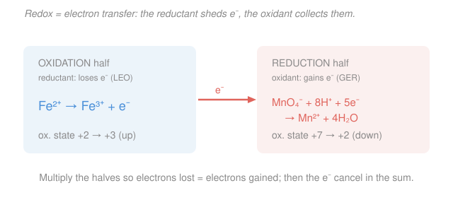

# Electrochemistry · Lesson 1.1: Redox & balancing half-reactions

> ⏱ ~15 min · Module 1: Redox, cells & the thermodynamics of voltage · Builds on: [general-chemistry 2.3 (aqueous reactions & redox)](../../general-chemistry/lessons/02-03-aqueous-reactions-precipitation-acid-base-redox.md) · Unlocks: [1.2 galvanic & electrolytic cells; Faraday's laws](01-02-galvanic-electrolytic-cells-faraday.md)

## Why this matters

Every cell in this course — every battery, every fuel cell, the wire growing copper on a circuit board, the rust eating a hull — is one redox reaction with its two halves pulled apart and wired through a meter. Before we can read a voltage off that meter (the whole point of Module 1), we have to know *exactly* how many electrons cross and where they go. That's not a warm-up; it's the conservation law the rest of the subject is built on. Faraday's laws in 1.2, the $n$ in $\Delta G = -nFE$, the current in a Butler–Volmer rate law — all of them are just this electron count, cashed out. Get the bookkeeping wrong here and every number downstream is wrong. So we spend one lesson making it airtight.

## The idea

A **redox** ("reduction–oxidation") reaction is nothing but a transfer of electrons from one species to another. That's the entire concept. One partner hands electrons away; the other takes them. The rest is learning to *count* — to see which atom lost how many and which gained them, so the ledger balances.

The tool for counting is the **oxidation state**: a bookkeeping charge we assign each atom by pretending every bond is fully ionic (the more electron-greedy atom "keeps" the shared electrons). It isn't a real charge — it's a tally. When an atom's oxidation state goes **up**, it lost electrons: it was **oxidized**. When it goes **down**, it gained them: it was **reduced**. Two mnemonics, same fact: **LEO the lion says GER** — *Lose Electrons = Oxidation, Gain Electrons = Reduction*; or **OIL RIG** — *Oxidation Is Loss, Reduction Is Gain*.

The species that *gets reduced* is doing the oxidizing to its partner, so we call it the **oxidant** (oxidizing agent). The species that *gets oxidized* is the **reductant** (reducing agent). It's backwards on purpose and worth burning in: the oxidant is the electron *thief*, the one that ends up reduced.

The move that makes messy reactions tractable is to **split the reaction into two half-reactions** — one pure oxidation (electrons written as a product) and one pure reduction (electrons as a reactant). Balance each half on its own, scale them so the electrons match, and add. Because a cell physically separates these two halves into two beakers, half-reactions aren't just an algebra trick — they're the literal wiring diagram of everything ahead.

## The formal version

**Oxidation-state rules**, applied top-down until every atom has a number (earlier rules win ties):

1. A free element is $0$ ($\ce{Fe}$, $\ce{O2}$, $\ce{Cl2}$ all $= 0$).
2. A monatomic ion equals its charge ($\ce{Na+} = +1$, $\ce{S^2-} = -2$).
3. Fluorine is always $-1$; the other halogens are $-1$ except when bonded to O or a heavier halogen.
4. Oxygen is $-2$ (exceptions: peroxides $-1$, superoxides $-\tfrac12$, $\ce{OF2}$ positive).
5. Hydrogen is $+1$ with nonmetals, $-1$ with metals (metal hydrides).
6. **The sum of oxidation states equals the species' overall charge.** This is the workhorse — it pins down whatever atom the earlier rules left unassigned.

*In words: assign the atoms you know for sure, then let "the numbers must add to the total charge" solve for the one you don't.*

Example of rule 6: in the permanganate ion $\ce{MnO4-}$, oxygen is $-2$ (rule 4), so $x + 4(-2) = -1 \Rightarrow x = +7$ for Mn.

**Oxidation and reduction, precisely.** For an atom whose oxidation state changes from $s_i$ to $s_f$, the electrons transferred is $\Delta s = s_f - s_i$. If $\Delta s > 0$ the atom was **oxidized** (lost $\Delta s$ electrons); if $\Delta s < 0$ it was **reduced** (gained $|\Delta s|$). *In words: the change in oxidation state is literally the number of electrons that moved.*

**The half-reaction balancing algorithm (acidic solution).** For each half:

1. **Balance the atom** being oxidized or reduced.
2. **Balance O** by adding $\ce{H2O}$.
3. **Balance H** by adding $\ce{H+}$.
4. **Balance charge** by adding electrons $\ce{e-}$ to the more-positive side.
5. **Scale** the two halves by integers so each carries the *same* number of electrons.
6. **Add and cancel** anything appearing on both sides (electrons must cancel *completely* — that's the check).

**Basic solution:** run steps 1–6 exactly as in acid, then neutralize the $\ce{H+}$. Add as many $\ce{OH-}$ to **both** sides as there are $\ce{H+}$; on the side with $\ce{H+}$ they combine, $\ce{H+ + OH- -> H2O}$; finally cancel any $\ce{H2O}$ that now appears on both sides. *In words: do the acid balance, then trade every $\ce{H+}$ for water by pouring equal base on both sides.*

Three balances must hold in the final equation — check all three: **mass** (each element's atoms match), **charge** (total charge matches side-to-side), and **electrons** (fully cancelled). These three *are* the conservation laws the whole course rests on.

## Picture

## Worked examples

**Example 1 (in acid — the classic titration).** Balance $\ce{MnO4- + Fe^2+ -> Mn^2+ + Fe^3+}$ in acidic solution.

*Split into halves.* Iron's state rises $+2 \to +3$ (oxidation); manganese's falls $+7 \to +2$ (reduction).

*Reduction half* ($\ce{MnO4- -> Mn^2+}$), steps 1–4:

$$\ce{MnO4- -> Mn^2+} \;\to\; \ce{MnO4- -> Mn^2+ + 4H2O} \;\to\; \ce{8H+ + MnO4- -> Mn^2+ + 4H2O}.$$

Charge is now $+7$ on the left, $+2$ on the right; add $5\,\ce{e-}$ to the left:

$$\ce{5e- + 8H+ + MnO4- -> Mn^2+ + 4H2O} \qquad (\text{left } +2 = \text{right } +2\ \checkmark).$$

*Oxidation half:* $\ce{Fe^2+ -> Fe^3+ + e-}$ (charge $+2 = +2$, already balanced).

*Scale (step 5).* The reduction eats 5 electrons; the oxidation gives 1. Multiply the oxidation by 5:

$$\ce{5Fe^2+ -> 5Fe^3+ + 5e-}.$$

*Add and cancel (step 6).* The $5\,\ce{e-}$ cancel:

$$\boxed{\ce{8H+ + MnO4- + 5Fe^2+ -> Mn^2+ + 4H2O + 5Fe^3+}}$$

*Check.* Mn $1=1$, Fe $5=5$, O $4=4$, H $8=8$ (mass $\checkmark$). Charge: left $8-1+10 = +17$, right $+2 + 15 = +17$ ($\checkmark$). Electrons fully cancelled ($\checkmark$). This is the reaction behind a permanganate titration — the deep purple $\ce{MnO4-}$ decolorizes exactly when the iron runs out.

**Example 2 (in base — permanganate makes a solid).** Balance $\ce{MnO4- + SO3^2- -> MnO2 + SO4^2-}$ in *basic* solution. Here Mn falls $+7 \to +4$ (reduction, 3 electrons) and S rises $+4 \to +6$ (oxidation, 2 electrons).

*Balance each half in acid first.*

$$\text{Reduction: } \ce{3e- + 4H+ + MnO4- -> MnO2 + 2H2O}, \qquad \text{Oxidation: } \ce{H2O + SO3^2- -> SO4^2- + 2H+ + 2e-}.$$

*Scale* to a common 6 electrons: reduction $\times 2$, oxidation $\times 3$, then add:

$$\ce{8H+ + 2MnO4- + 3SO3^2- + 3H2O -> 2MnO2 + 4H2O + 3SO4^2- + 6H+}.$$

Cancel $6\,\ce{H+}$ and $3\,\ce{H2O}$ from both sides — the **acidic** answer:

$$\ce{2H+ + 2MnO4- + 3SO3^2- -> 2MnO2 + H2O + 3SO4^2-}.$$

*Convert to base.* There are $2\,\ce{H+}$; add $2\,\ce{OH-}$ to **both** sides. On the left, $\ce{2H+ + 2OH- -> 2H2O}$:

$$\ce{2H2O + 2MnO4- + 3SO3^2- -> 2MnO2 + H2O + 3SO4^2- + 2OH-}.$$

Cancel one $\ce{H2O}$ (appears on both sides) — the **basic** answer:

$$\boxed{\ce{H2O + 2MnO4- + 3SO3^2- -> 2MnO2 + 3SO4^2- + 2OH-}}$$

*Check.* Mn $2=2$, S $3=3$, O: left $1+8+9 = 18$, right $4+12+2 = 18$; H $2=2$ (mass $\checkmark$). Charge: left $-2-6 = -8$, right $-6-2 = -8$ ($\checkmark$). In base, permanganate stops at brown solid $\ce{MnO2}$ instead of the pale $\ce{Mn^2+}$ of Example 1 — same oxidant, different landing spot set by pH.

## Watch out

- **You might think the oxidant is the thing that gets oxidized.** It's the opposite. The **oxidant** *causes* oxidation in its partner and is itself **reduced** (it's the electron thief). Say it against the reaction, not the name: whatever's oxidation state *drops* is the oxidant.
- **You might treat oxidation states as real charges.** They're not — in $\ce{MnO4-}$ the Mn is *not* literally $+7$; that's a bookkeeping fiction from pretending every bond is ionic. It's a counting device, and it works precisely *because* it's consistent, not because it's physical.
- **You might balance mass and forget charge (or vice-versa).** A half-reaction with the atoms matched can still have the wrong number of electrons — the charge won't balance, and that mismatch *is* the electron count you skipped. Always confirm all three: mass, charge, electrons cancelled.
- **In base, you might add $\ce{OH-}$ to only one side.** Add it to *both* — you're neutralizing, not inventing atoms. Adding to one side breaks the mass balance you just earned.

## One-liner

> Redox is electron transfer counted by oxidation state; split it into two halves, balance atoms then O with water, H with $\ce{H+}$, charge with $\ce{e-}$, scale the electrons to match, add — and in base, mop up the $\ce{H+}$ with equal $\ce{OH-}$ on both sides.

## Problems

**P1 (🟢)** For the reaction of copper with nitric acid,
$$\ce{3Cu + 8HNO3 -> 3Cu(NO3)2 + 2NO + 4H2O},$$
assign oxidation states to Cu, N, H, and O throughout, state what is oxidized and what is reduced, and name the oxidant and the reductant. (Watch the nitrogen — not all of it changes.)

**P2 (🟡)** Balance the reduction half-reaction $\ce{Cr2O7^2- -> Cr^3+}$ in **acidic** solution, showing every step of the algorithm. State how many electrons it consumes.

**P3 (🔴)** Fully balance, in **basic** solution,
$$\ce{Cr(OH)3 + Br2 -> CrO4^2- + Br-}.$$
Do the acid balance first, then convert with $\ce{OH-}$, and verify mass **and** charge balance in the final equation.

Solutions

**P1** Assign states:
- $\ce{Cu}$ (free element) $= 0$; in $\ce{Cu(NO3)2}$, copper is $\ce{Cu^2+} = +2$.
- In $\ce{HNO3}$: H is $+1$, each O is $-2$, so $+1 + N + 3(-2) = 0 \Rightarrow N = +5$. The nitrate ions in $\ce{Cu(NO3)2}$ are also $\ce{NO3-}$ with $N = +5$ (unchanged — spectators). In $\ce{NO}$: $N + (-2) = 0 \Rightarrow N = +2$.
- H is $+1$ and O is $-2$ everywhere (neither changes).

So **Cu is oxidized** ($0 \to +2$, loses 2 e⁻) and **N is reduced** — but *only the nitrogen that becomes $\ce{NO}$* ($+5 \to +2$, gains 3 e⁻); the nitrogen staying as nitrate is unchanged. The **reductant is Cu** (it gets oxidized); the **oxidant is $\ce{HNO3}$/nitrate** (it supplies the N that gets reduced). Electron check: $3\,\ce{Cu}$ lose $3\times 2 = 6\,\ce{e-}$; $2\,\ce{N}$ gain $2 \times 3 = 6\,\ce{e-}$ — balanced, as the coefficients demand.

**P2** Half-reaction $\ce{Cr2O7^2- -> Cr^3+}$:

1. Balance Cr: $\ce{Cr2O7^2- -> 2Cr^3+}$.
2. Balance O with $\ce{H2O}$ (7 O on the left): $\ce{Cr2O7^2- -> 2Cr^3+ + 7H2O}$.
3. Balance H with $\ce{H+}$ (14 H on the right): $\ce{14H+ + Cr2O7^2- -> 2Cr^3+ + 7H2O}$.
4. Balance charge with $\ce{e-}$: left $= 14 - 2 = +12$, right $= 2(+3) = +6$. Add $6\,\ce{e-}$ to the left (the more-positive side):
$$\boxed{\ce{6e- + 14H+ + Cr2O7^2- -> 2Cr^3+ + 7H2O}}$$
Left charge $+12 - 6 = +6 = $ right ($\checkmark$). Steps 5–6 (scale, add) only apply once it's paired with an oxidation half. It **consumes 6 electrons** — consistent with two Cr atoms each dropping $+6 \to +3$, i.e. $2 \times 3 = 6$.

**P3** States: Cr rises $+3 \to +6$ (oxidation, 3 e⁻); Br falls $0 \to -1$ (reduction, 1 e⁻each, 2 per $\ce{Br2}$).

*Oxidation half in acid* ($\ce{Cr(OH)3 -> CrO4^2-}$): balance O by adding one $\ce{H2O}$ to the left (3 O → 4 O), then H with $\ce{H+}$, then charge:
$$\ce{H2O + Cr(OH)3 -> CrO4^2- + 5H+ + 3e-} \qquad (\text{left } 0 = \text{right } -2+5-3 = 0\ \checkmark).$$

*Reduction half:* $\ce{Br2 + 2e- -> 2Br-}$ (charge $-2 = -2\ \checkmark$).

*Scale* to 6 electrons: oxidation $\times 2$, reduction $\times 3$; add:
$$\ce{2H2O + 2Cr(OH)3 + 3Br2 -> 2CrO4^2- + 10H+ + 6Br-} \quad(\text{acidic answer}).$$

*Convert to base:* there are $10\,\ce{H+}$; add $10\,\ce{OH-}$ to both sides. On the right, $\ce{10H+ + 10OH- -> 10H2O}$:
$$\ce{2H2O + 2Cr(OH)3 + 3Br2 + 10OH- -> 2CrO4^2- + 10H2O + 6Br-}.$$
Cancel $2\,\ce{H2O}$ (net $8\,\ce{H2O}$ on the right):
$$\boxed{\ce{2Cr(OH)3 + 3Br2 + 10OH- -> 2CrO4^2- + 6Br- + 8H2O}}$$

*Verify.* Mass — Cr $2=2$, Br $6=6$; O: left $2(3) + 10 = 16$, right $2(4) + 8 = 16$; H: left $2(3) + 10 = 16$, right $2(8) = 16$ (all $\checkmark$). Charge: left $-10$, right $-4 - 6 = -10$ ($\checkmark$). Electrons cancelled ($\checkmark$). Bromine bleach oxidizing chromium(III) to yellow chromate in caustic solution.

## Connections

- **Backward:** this sharpens the redox you met in [general-chemistry 2.3](../../general-chemistry/lessons/02-03-aqueous-reactions-precipitation-acid-base-redox.md) — same electron-transfer idea, now with an algorithm strict enough to hang quantitative electrochemistry on. The oxidation-state rules are the same accounting used to track acids, bases, and precipitation there.
- **Forward:** [1.2](01-02-galvanic-electrolytic-cells-faraday.md) pulls the two halves into two beakers wired through a meter — the reduction half becomes the cathode, the oxidation half the anode — and the electron count you found *is* the $n$ in Faraday's law $Q = nF\xi$ (charge per mole reacted). That same $n$ reappears in $\Delta G = -nFE$ ([1.4](01-04-cell-emf-gibbs-equilibrium.md)) and the Nernst equation ([1.5](01-05-nernst-equation-concentration-cells.md)).
- **Sideways:** the "assign states, then force the totals to match" move is the same conservation reasoning as balancing mass and charge in any reaction network — here it happens to pay off as a voltage you can read on a meter.
