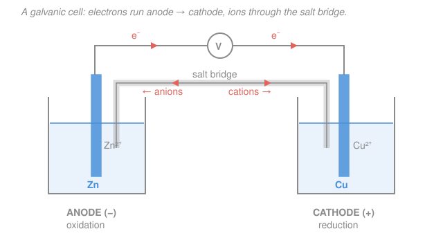

# Electrochemistry · Lesson 1.2: Galvanic & electrolytic cells; Faraday's laws

> ⏱ ~15 min · Module 1: Redox, cells & the thermodynamics of voltage · Builds on: [1.1 Redox & balancing half-reactions](01-01-redox-balancing-half-reactions.md), [general-chemistry 4.4](../../general-chemistry/lessons/04-04-taste-of-electrochemistry.md) · Unlocks: [1.3 Electrode potentials & the SHE series](01-03-electrode-potentials-she-series.md)

## Why this matters

A redox reaction moves electrons from one species to another. If it happens in a single beaker, that transfer is just heat — the electrons hop directly and you get nothing useful. The entire trick of electrochemistry is to **physically separate the two halves** so the electrons are *forced* to travel through a wire you control. Now the same reaction is a battery: current on demand. Run it backward with a plug in the wall and it becomes electrolysis — the way we plate chrome, refine copper, and split water for hydrogen. This lesson is the plumbing: which electrode is which, which way everything flows, and Faraday's bookkeeping that turns "amps for so many minutes" into "grams of metal."

## The idea

Take the reaction from [1.1](01-01-redox-balancing-half-reactions.md): zinc metal hands two electrons to a copper ion. Dump zinc into copper sulfate and it happens instantly — copper plates out on the zinc, energy wasted as warmth. Instead, put the zinc (and its $\ce{Zn^2+}$) in one beaker and the copper (and its $\ce{Cu^2+}$) in another. Now zinc *wants* to give up electrons but the copper ions are across the room. Connect the two metals with a wire and the electrons finally have a path — they stream from zinc to copper, and that stream is your current.

Two names, and they trip everyone up, so pin them down once: the **anode** is where **oxidation** happens, the **cathode** is where **reduction** happens. That's the *definition*, full stop — it has nothing to do with plus or minus signs. The mnemonic is **"An Ox, Red Cat"**: *An*ode = *Ox*idation, *Red*uction = *Cat*hode. Oxidation releases electrons, so the anode is the source; reduction consumes them, so the cathode is the sink. Electrons always run anode → cathode through the outside wire.

One problem: as zinc dissolves, the left beaker fills with positive $\ce{Zn^2+}$ and goes positive; the right beaker loses $\ce{Cu^2+}$ and goes negative. Charge piles up and the whole thing stalls in a fraction of a second. The fix is a **salt bridge** — a tube of inert electrolyte (say $\ce{KNO3}$) whose ions drift to cancel the buildup: negative ions toward the anode, positive ions toward the cathode. Electrons flow through the wire; ions flow through the bridge; the loop is closed.

Whether this runs *by itself* or *has to be forced* splits every cell into two types:

- **Galvanic (voltaic) cell** — the reaction is spontaneous ([1.1](01-01-redox-balancing-half-reactions.md)'s zinc–copper). It *pushes* electrons out on its own, like water running downhill. This is a battery.
- **Electrolytic cell** — the reaction is non-spontaneous. You wire in a power supply that *pumps* electrons uphill against their will. This is electrolysis, plating, charging.

## The formal version

**Anode and cathode (sign-independent definitions).**

$$\text{anode} \equiv \text{electrode where oxidation occurs}, \qquad \text{cathode} \equiv \text{electrode where reduction occurs}.$$

*In words: name the electrode by the chemistry happening on it, never by its charge.* For the zinc–copper cell the half-reactions are

$$\text{anode (oxidation):}\quad \ce{Zn -> Zn^2+ + 2e-}, \qquad \text{cathode (reduction):}\quad \ce{Cu^2+ + 2e- -> Cu}.$$

**The signs, and why they flip.** The label (anode/cathode) is fixed by the chemistry; the *sign* (+/−) is set by which way electrons are being pushed:

| | anode | cathode | electron flow (external wire) |
|---|---|---|---|
| **Galvanic** (spontaneous) | **−** | **+** | anode → cathode |
| **Electrolytic** (driven) | **+** | **−** | anode → cathode |

*In words: electrons always leave the anode and enter the cathode — that never changes. What changes is the sign.* In a galvanic cell the anode is the electron **source**, so it's the negative terminal; electrons pour out because the reaction wants them to. In an electrolytic cell an external supply **rips** electrons off the anode — to pull them it must hold the anode **positive**, and it shoves them onto the cathode by holding it **negative**. Same electrode names, opposite polarity, because the driver overrules the chemistry's preference.

**Cell line notation.** A compact shorthand, anode on the **left**, cathode on the **right**:

$$\ce{Zn|Zn^2+||Cu^2+|Cu}$$

Reading conventions: a single bar $\vert$ is a **phase boundary** (solid electrode meeting its ion solution), the double bar $\Vert$ is the **salt bridge**, and you write each half-cell from the electrode outward toward the bridge. *In words: solid $\vert$ ions of the anode, then the bridge $\Vert$, then ions $\vert$ solid of the cathode — left to right is the direction electrons travel.*

**Faraday's laws of electrolysis.** The amount of substance transformed at an electrode is proportional to the electric charge passed. Quantitatively, the charge needed to run a half-reaction $\xi$ times is

$$Q = n F \xi,$$

where $Q$ is charge in coulombs (C), $\xi$ is the extent of reaction in moles (moles of formula units reacted), $n$ is the number of electrons per formula unit, and $F = 96485\ \mathrm{C/mol}$ is the **Faraday constant** — the charge carried by one mole of electrons. *In words: to react one mole of a species needing $n$ electrons, you must push $n$ moles of electrons, i.e. $nF$ coulombs.* Charge is delivered by a current $I$ (amperes = coulombs per second) flowing for a time $t$ (seconds):

$$Q = I\,t.$$

Combine them and multiply by molar mass $M$ (g/mol) to get the deposited mass:

$$\boxed{\; m = \frac{Q}{nF}\,M = \frac{I\,t}{nF}\,M \;}$$

*In words: current × time gives coulombs; divide by $nF$ to get moles of product; multiply by molar mass to get grams.* The same equation runs in reverse — solve for $I$ or $t$ when you're handed a target mass.

This constant $F$ is where circuits meet chemistry: it is exactly Avogadro's number times the elementary charge, $F = N_A e = (6.022\times10^{23})(1.602\times10^{-19}\ \mathrm{C}) \approx 96485\ \mathrm{C/mol}$.

## Picture

## Worked examples

**Example 1 (name everything, both cell types).** For the galvanic zinc–copper cell above: zinc is oxidized, so zinc is the **anode**, and since it's spontaneous the anode is **−**; copper ion is reduced, so copper is the **cathode**, and it's **+**. Electrons leave the zinc, run through the wire to the copper. Line notation $\ce{Zn|Zn^2+||Cu^2+|Cu}$.

Now *drive the same beakers backward* with a battery (an electrolytic cell that re-plates zinc and dissolves copper). The chemistry reverses: now copper is oxidized (copper = anode) and zinc ion is reduced (zinc = cathode). Because a power supply forces it, the anode is now **+** and the cathode **−**. Electrons still flow anode → cathode inside the wire — the direction rule never breaks; only the polarity flipped.

**Example 2 (Faraday — mass from current and time).** A current of $2.0\ \mathrm{A}$ runs for $30$ minutes through a cell depositing copper, $\ce{Cu^2+ + 2e- -> Cu}$. How much copper plates out? Molar mass $M(\ce{Cu}) = 63.55\ \mathrm{g/mol}$, $n = 2$.

$$Q = It = (2.0\ \mathrm{A})(30 \times 60\ \mathrm{s}) = 3600\ \mathrm{C}.$$
$$\text{moles Cu} = \frac{Q}{nF} = \frac{3600}{2 \times 96485} = 1.866\times10^{-2}\ \mathrm{mol}.$$
$$m = (1.866\times10^{-2})(63.55) = 1.19\ \mathrm{g}.$$

So about $1.2$ grams of copper. Notice $n = 2$ matters: if you'd wrongly used $n = 1$ you'd double the answer.

## Watch out

- **You might think the cathode is always positive.** It's positive in a *galvanic* cell but negative in an *electrolytic* one. Only "cathode = reduction" is universal; the sign depends on whether the cell drives itself or is driven. When in doubt, find the reduction, then decide the sign from the cell type.
- **You might think electrons travel through the salt bridge.** They don't — electrons go through the metal wire; the salt bridge carries only **ions**, moving to neutralize charge buildup. Anions head to the anode, cations to the cathode. No bridge, no sustained current.
- **You might forget $n$ in Faraday's law.** Depositing one $\ce{Al}$ from $\ce{Al^3+}$ takes $n=3$ electrons; one $\ce{Ag}$ from $\ce{Ag+}$ takes $n=1$. The charge per mole of metal is $nF$, not $F$ — using the wrong $n$ is the single most common electrolysis error.

## One-liner

> Anode oxidizes, cathode reduces (signs flip between galvanic and electrolytic); electrons cross the wire and ions cross the salt bridge, and $m = ItM/nF$ converts amp-seconds into grams.

## Problems

**P1 (🟢)** A galvanic cell uses a silver electrode in $\ce{Ag+}$ solution and a nickel electrode in $\ce{Ni^2+}$ solution; nickel is oxidized. (a) Which electrode is the anode, which the cathode, and what is the sign of each? (b) Which way do electrons flow in the external wire? (c) Write the cell in line notation. (d) If instead this exact setup were run as an *electrolytic* cell (driven backward by a power supply), what would the sign of each electrode be?

**P2 (🟡)** A silver-plating bath runs at $1.5\ \mathrm{A}$ for $20$ minutes via $\ce{Ag+ + e- -> Ag}$. How many grams of silver are deposited? Use $M(\ce{Ag}) = 107.87\ \mathrm{g/mol}$, $F = 96485\ \mathrm{C/mol}$.

**P3 (🔴)** You need to electroplate exactly $5.00\ \mathrm{g}$ of chromium from a $\ce{Cr^3+}$ bath ($\ce{Cr^3+ + 3e- -> Cr}$, $M(\ce{Cr}) = 52.00\ \mathrm{g/mol}$) in $45.0$ minutes. (a) What constant current is required? (b) If your power supply can only deliver $6.00\ \mathrm{A}$, how long would the job take at that current instead?

Solutions

**P1**
(a) Nickel is oxidized, so **nickel = anode**; by elimination **silver = cathode** (it's reduced, $\ce{Ag+ + e- -> Ag}$). It's a galvanic cell, so anode = **−**, cathode = **+**. Thus nickel is the negative terminal, silver the positive.
(b) Electrons flow from the anode to the cathode through the wire: **nickel → silver**.
(c) Anode on the left, cathode on the right: $\ce{Ni|Ni^2+||Ag+|Ag}$.
(d) Driven as an electrolytic cell, the signs flip: anode = **+**, cathode = **−** (the power supply forces electrons out of the anode by holding it positive). The *labels* anode/cathode still follow whichever reaction each electrode runs; only the polarity reverses.

**P2** With $n = 1$ (silver is $\ce{Ag+}$):

$$Q = It = (1.5)(20 \times 60) = (1.5)(1200) = 1800\ \mathrm{C}.$$
$$\text{moles Ag} = \frac{Q}{nF} = \frac{1800}{1 \times 96485} = 1.866\times10^{-2}\ \mathrm{mol}.$$
$$m = (1.866\times10^{-2})(107.87) = 2.01\ \mathrm{g}.$$

So about **2.0 g** of silver. *Check.* Units: $\mathrm{A\cdot s} = \mathrm{C}$; $\mathrm{C}/(\mathrm{C/mol}) = \mathrm{mol}$; $\mathrm{mol}\times\mathrm{g/mol} = \mathrm{g}$ ✓.

**P3** Rearrange $m = \dfrac{ItM}{nF}$ for whichever unknown you need. First get the moles and total charge, which are fixed by the target mass:

$$\text{moles Cr} = \frac{m}{M} = \frac{5.00}{52.00} = 9.615\times10^{-2}\ \mathrm{mol}.$$
$$Q = nF \cdot (\text{moles}) = (3)(96485)(9.615\times10^{-2}) = 2.784\times10^{4}\ \mathrm{C}.$$

(a) With $t = 45.0\ \mathrm{min} = 2700\ \mathrm{s}$,

$$I = \frac{Q}{t} = \frac{2.784\times10^{4}}{2700} = 10.3\ \mathrm{A}.$$

(b) The charge $Q$ needed doesn't change — it's set by the mass. At $I = 6.00\ \mathrm{A}$,

$$t = \frac{Q}{I} = \frac{2.784\times10^{4}}{6.00} = 4.64\times10^{3}\ \mathrm{s} = 77.3\ \mathrm{min}.$$

*Check.* Lower current → longer time for the same charge, as expected; and $10.3\ \mathrm{A}\times 2700\ \mathrm{s} \approx 6.00\ \mathrm{A}\times 4640\ \mathrm{s} \approx 2.78\times10^4\ \mathrm{C}$ ✓. The factor $n = 3$ is doing heavy lifting here: chromium needs three electrons per atom, tripling the charge versus a $+1$ metal.

## Connections

- **Backward:** the half-reactions and electron counts come straight from [1.1](01-01-redox-balancing-half-reactions.md) — balancing tells you $n$, which is exactly the $n$ in $Q = nF\xi$. The spontaneous zinc–copper reaction is the [general-chemistry 4.4](../../general-chemistry/lessons/04-04-taste-of-electrochemistry.md) cell, now dissected into anode, cathode, and bridge.
- **Forward:** we've said *which* way electrons flow but not *how hard* they're pushed — that voltage is the subject of [1.3](01-03-electrode-potentials-she-series.md), where each half-cell gets a standard potential measured against the standard hydrogen electrode, and the cell's total emf tells you galvanic-vs-electrolytic without guessing.
- **Sideways:** Faraday's $Q = nF\xi$ is the bridge between a chemistry problem and a circuits problem — it converts the electrical engineer's amps-and-seconds into the chemist's moles. That same molar charge $F$ reappears in the [general-chemistry 4.4](../../general-chemistry/lessons/04-04-taste-of-electrochemistry.md) picture and will anchor $\Delta G = -nFE$ two lessons from now, where the voltage on the voltmeter *is* the reaction's Gibbs free energy per electron.
