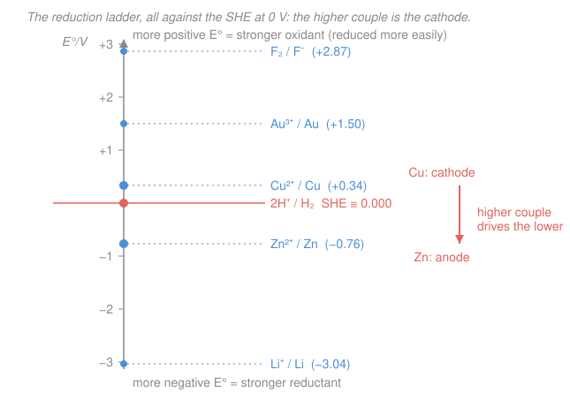

# Electrochemistry · Lesson 1.3: Electrode potentials, the SHE & the series

> ⏱ ~15 min · Module 1: Redox, cells & the thermodynamics of voltage · Builds on: [1.2 Galvanic & electrolytic cells; Faraday's laws](01-02-galvanic-electrolytic-cells-faraday.md) · Unlocks: [1.4 Cell EMF, Gibbs energy & the equilibrium constant](01-04-cell-emf-gibbs-equilibrium.md)

## Why this matters

In [1.2](01-02-galvanic-electrolytic-cells-faraday.md) you built a cell and watched a voltmeter read a number — but where does that number *come from*? You'd love to say "the zinc electrode is worth $-0.76$ V and the copper one is worth $+0.34$ V, so the cell is $1.10$ V." That's exactly how it works in practice, yet there's a catch that runs to the foundation of the subject: **you can never measure the potential of a single electrode.** A voltmeter has two leads; it only ever reports a *difference*. So the entire quantitative machinery of electrochemistry — every cell voltage, every $\Delta G$ and $K$ in [1.4](01-04-cell-emf-gibbs-equilibrium.md), the Nernst equation in [1.5](01-05-nernst-equation-concentration-cells.md) — rests on one convention: pick a reference half-cell, call it zero, and measure everything else against it. Do that and you get a single ranked table that predicts, at a glance, which way *any* redox reaction wants to run.

## The idea

Think of altitude. You can't state a hiker's "absolute" height in the universe — height only means anything relative to a datum, so we all agree to call **sea level** zero and quote everything from there. Electrode potentials are identical. There is no absolute voltage of a lone electrode dipped in solution; there is only the voltage *between* two of them. So chemists chose a "sea level" half-cell — the **standard hydrogen electrode (SHE)** — nailed it to exactly $0.000$ V, and then measured every other half-cell by building a cell with the SHE on one side and reading the voltmeter.

Do this for hundreds of half-reactions and you get one master list: the **standard reduction potentials** $E^\circ$. Line them up and it becomes a **ladder of eagerness to grab electrons**. Couples near the top ($\ce{F2}$, $\ce{Au^3+}$) are electron-hungry — strong oxidizing agents, easily reduced. Couples near the bottom (the alkali metals, $\ce{Li+}$) hate holding their electrons — strong reducing agents that would much rather hand them off. Put any two couples together and the higher one wins: it pulls electrons down the ladder, getting reduced (the **cathode**) while forcing the lower couple to give them up and get oxidized (the **anode**). The whole of "which way does this reaction go?" reduces to "which couple sits higher on the ladder?"

## The formal version

**The measurement problem.** A single electrode–solution interface has a potential difference across it, but any wire you attach to the solution to measure it creates *another* interface with its own unknown drop. Only a complete cell — two half-cells — gives a measurable voltage. So we report **relative** potentials against a shared reference.

**The standard hydrogen electrode (SHE).** The chosen reference is the half-reaction

$$\ce{2H+ + 2e- <=> H2}, \qquad E^\circ \equiv 0.000\ \mathrm{V},$$

realized as a platinized-Pt electrode bathed in $\ce{H+}$ at unit activity ($a_{\ce{H+}}=1$, roughly $1\ \mathrm{M}$) with $\ce{H2}$ gas bubbled over it at $1\ \mathrm{bar}$, all at the stated temperature (usually $298\ \mathrm{K}$). *In words: hydrogen bubbling over platinum in acid, under standard conditions, is defined to be worth exactly zero volts — the sea level of electrochemistry.* The Pt is inert; it just ferries electrons and hosts the $\ce{H+}/\ce{H2}$ equilibrium.

**Standard reduction potential.** For any other couple, build the cell (SHE) $\Vert$ (that couple) with everything at unit activity/standard conditions and read the voltmeter. That reading, *with a sign*, is the couple's **standard reduction potential** $E^\circ$. By IUPAC convention **every** $E^\circ$ is tabulated for the half-reaction written **as a reduction** (electrons on the left):

$$\ce{Cu^2+ + 2e- <=> Cu}, \quad E^\circ = +0.34\ \mathrm{V}; \qquad \ce{Zn^2+ + 2e- <=> Zn}, \quad E^\circ = -0.76\ \mathrm{V}.$$

*In words: $E^\circ$ answers one fixed question — "how badly does this species want to be reduced, compared with $\ce{H+}$?"* A positive $E^\circ$ means "more eagerly than hydrogen"; negative means "less."

**Reading the table.**

- **More positive $E^\circ$ $\Rightarrow$ stronger tendency to be reduced $\Rightarrow$ stronger oxidizing agent.** $\ce{F2}$ ($+2.87\ \mathrm{V}$) and $\ce{Au^3+}$ ($+1.50\ \mathrm{V}$) sit at the top: ferocious electron grabbers.
- **More negative $E^\circ$ $\Rightarrow$ reluctant to be reduced $\Rightarrow$ the *reverse* runs easily $\Rightarrow$ strong reducing agent.** $\ce{Li+}/\ce{Li}$ ($-3.04\ \mathrm{V}$) sits at the bottom: lithium metal is a fierce electron donor.

This ranking is the **electrochemical (activity) series** — the same "reactivity series" from general chemistry, now with numbers attached.

**Predicting the spontaneous cell.** Given two couples, the one with the **higher $E^\circ$** becomes the **cathode** (it gets reduced); the one with the **lower $E^\circ$** becomes the **anode** (its tabulated reduction runs *backward*, as an oxidation). *In words: the higher couple wins the tug-of-war for electrons and pulls them out of the lower couple.* Next lesson turns this into a voltage with

$$E^\circ_{\text{cell}} = E^\circ_{\text{cat}} - E^\circ_{\text{an}},$$

where **both** $E^\circ$ values are the tabulated *reduction* potentials, plugged in as-is. This is the sign trap worth burning in now (see Watch out): you do **not** flip the sign of the anode's $E^\circ$ when you reverse its half-reaction — the subtraction already accounts for the reversal.

**Practical reference electrodes.** The SHE is a nuisance in the lab (flammable gas, fragile Pt, drifting acid), so day-to-day work uses stable secondary references of accurately known potential vs SHE — the **silver/silver-chloride** electrode ($\ce{Ag/AgCl}$, $+0.197\ \mathrm{V}$ in saturated KCl) and the **saturated calomel electrode** (SCE, $\ce{Hg/Hg2Cl2}$, $+0.241\ \mathrm{V}$) — then quote results "vs SHE" by adding the offset.

## Picture

## Worked examples

**Example 1 (mechanical — read the ladder).** Given $E^\circ(\ce{Ag+}/\ce{Ag}) = +0.80\ \mathrm{V}$ and $E^\circ(\ce{Ni^2+}/\ce{Ni}) = -0.25\ \mathrm{V}$, which is the stronger oxidizing agent, and in a silver–nickel cell which electrode is the cathode? Silver's couple is more positive, so $\ce{Ag+}$ is the stronger oxidant (more eager to be reduced). It therefore sits higher on the ladder and is the **cathode** ($\ce{Ag+ + e- -> Ag}$); nickel, lower, is the **anode** ($\ce{Ni -> Ni^2+ + 2e-}$). *The higher couple always takes the reduction.*

**Example 2 (why you'd care — will the reaction go?).** Drop zinc metal into copper sulfate solution — does it react? The two relevant couples are $\ce{Cu^2+}/\ce{Cu}$ ($+0.34\ \mathrm{V}$) and $\ce{Zn^2+}/\ce{Zn}$ ($-0.76\ \mathrm{V}$). The proposed reaction $\ce{Zn + Cu^2+ -> Zn^2+ + Cu}$ uses $\ce{Cu^2+}$ as the thing reduced (cathode couple, higher) and $\ce{Zn}$ as the thing oxidized (anode couple, lower). Since the reducing agent ($\ce{Zn}$) is the *lower* couple and the oxidizing agent ($\ce{Cu^2+}$) is the *higher* one, electrons flow downhill and the reaction is **spontaneous** — zinc dissolves and copper plates out. Quantitatively, $E^\circ_{\text{cell}} = E^\circ_{\text{cat}} - E^\circ_{\text{an}} = 0.34 - (-0.76) = +1.10\ \mathrm{V} > 0$, and a positive cell potential means spontaneous (that's the $\Delta G = -nFE < 0$ link of [1.4](01-04-cell-emf-gibbs-equilibrium.md)). Try the reverse — copper metal in zinc sulfate — and you'd need $E^\circ_{\text{cell}} = -0.76 - 0.34 = -1.10\ \mathrm{V} < 0$: it does **not** happen. This is exactly why zinc displaces copper but not vice versa.

## Watch out

- **You might think you can just measure one electrode's potential.** You can't — a voltmeter has two leads and only ever reads a *difference*. Every $E^\circ$ is secretly "vs SHE"; the SHE's zero is a *choice*, not a physical absolute.
- **You might flip the sign of $E^\circ$ when you reverse a half-reaction.** Don't. $E^\circ$ is an intensive property of the *couple*, tagged to the reduction direction, and it does **not** scale or flip when you reverse or multiply the half-reaction. The reversal of the anode is already baked into $E^\circ_{\text{cell}} = E^\circ_{\text{cat}} - E^\circ_{\text{an}}$ — subtract the tabulated reduction potentials as printed. (Contrast $\Delta G^\circ = -nFE^\circ$, which *is* extensive and does scale with $n$ — that's [1.4](01-04-cell-emf-gibbs-equilibrium.md).)
- **You might read a very negative $E^\circ$ as "weak."** It's the opposite: very negative means the *forward reduction* is weak, so the *reverse oxidation* is strong — a powerful reducing agent. Lithium's $-3.04\ \mathrm{V}$ marks it as one of the strongest reductants there is, not a feeble couple.
- **You might expect "standard" to mean "at any concentration."** $E^\circ$ requires *unit activity* (all dissolved species $\approx 1\ \mathrm{M}$, gases at $1\ \mathrm{bar}$). Away from standard conditions the potential shifts — that correction is the Nernst equation, [1.5](01-05-nernst-equation-concentration-cells.md).

## One-liner

> You can only ever measure voltage differences, so pin the hydrogen electrode at zero, tabulate every couple as a reduction against it, and the higher couple on that ladder is always the cathode that drives the lower.

## Problems

**P1 (🟢)** From the table $E^\circ(\ce{Cl2}/\ce{Cl-}) = +1.36\ \mathrm{V}$, $E^\circ(\ce{Fe^2+}/\ce{Fe}) = -0.44\ \mathrm{V}$: (a) which species is the stronger oxidizing agent and which the stronger reducing agent? (b) If you build a cell from these two couples, which is the cathode and which the anode?

**P2 (🟡)** You have $E^\circ(\ce{Sn^2+}/\ce{Sn}) = -0.14\ \mathrm{V}$ and $E^\circ(\ce{Pb^2+}/\ce{Pb}) = -0.13\ \mathrm{V}$. Predict whether the reaction $\ce{Sn + Pb^2+ -> Sn^2+ + Pb}$ is spontaneous under standard conditions — i.e. will a strip of tin displace lead from solution? Justify with the ladder and confirm with the sign of $E^\circ_{\text{cell}}$.

**P3 (🔴)** Given the standard reduction potentials $E^\circ(\ce{Mg^2+}/\ce{Mg}) = -2.37$, $E^\circ(\ce{Zn^2+}/\ce{Zn}) = -0.76$, $E^\circ(\ce{Fe^2+}/\ce{Fe}) = -0.44$, $E^\circ(\ce{Cu^2+}/\ce{Cu}) = +0.34\ \mathrm{V}$: (a) rank the four *metals* from strongest to weakest reducing agent. (b) Write the resulting displacement series: which metals will displace $\ce{Cu^2+}$ from solution, and which will displace $\ce{Fe^2+}$? (c) If iron and copper are electrically connected in a wet environment (a galvanic couple), which one corrodes preferentially, and what is the $E^\circ_{\text{cell}}$ of the corrosion cell that forms? (This sets up the mixed-potential picture of corrosion in 4.3.)

Solutions

**P1** (a) More positive $E^\circ$ = stronger oxidant. $\ce{Cl2}$ ($+1.36\ \mathrm{V}$) is far more positive than $\ce{Fe^2+}$ ($-0.44\ \mathrm{V}$), so **$\ce{Cl2}$ is the stronger oxidizing agent**. Stronger reducing agent = the species that gives up electrons most readily = the reduced form of the *lower* couple, so **$\ce{Fe}$ metal is the stronger reducing agent**. (b) The higher couple is the cathode: **$\ce{Cl2}/\ce{Cl-}$ is the cathode** ($\ce{Cl2 + 2e- -> 2Cl-}$), and **$\ce{Fe^2+}/\ce{Fe}$ is the anode** ($\ce{Fe -> Fe^2+ + 2e-}$).

**P2** On the ladder, $\ce{Pb^2+}/\ce{Pb}$ ($-0.13\ \mathrm{V}$) sits just *above* $\ce{Sn^2+}/\ce{Sn}$ ($-0.14\ \mathrm{V}$). The proposed reaction reduces $\ce{Pb^2+}$ (higher couple → cathode) and oxidizes $\ce{Sn}$ (lower couple → anode), so electrons flow downhill and it should be **spontaneous**. Confirm:

$$E^\circ_{\text{cell}} = E^\circ_{\text{cat}} - E^\circ_{\text{an}} = (-0.13) - (-0.14) = +0.01\ \mathrm{V} > 0.$$

Positive, so **yes — tin displaces lead**, though only barely ($+0.01\ \mathrm{V}$ is a whisker above zero, so in practice it's sluggish and easily reversed by concentration via the Nernst equation).

**P3** (a) Reducing strength of a *metal* is set by how negative its couple is (the more negative $E^\circ$, the more the reverse oxidation is favored). Ranking most-negative → least-negative $E^\circ$:

$$\ce{Mg}\ (-2.37) \;>\; \ce{Zn}\ (-0.76) \;>\; \ce{Fe}\ (-0.44) \;>\; \ce{Cu}\ (+0.34).$$

So **Mg > Zn > Fe > Cu** as reducing agents.

(b) A metal displaces an ion whenever the metal's couple lies *below* the ion's couple on the ladder (metal is the stronger reductant, giving $E^\circ_{\text{cell}} > 0$).
- **Displace $\ce{Cu^2+}$ ($+0.34$):** every metal above copper on the reductant list — **Mg, Zn, and Fe all displace $\ce{Cu^2+}$** (Cu can't displace itself).
- **Displace $\ce{Fe^2+}$ ($-0.44$):** only metals more negative than iron — **Mg and Zn displace $\ce{Fe^2+}$**; copper ($+0.34$, higher) cannot.

(c) In an iron–copper galvanic couple, the metal with the *lower* (more negative) $E^\circ$ is the anode and corrodes. Iron ($-0.44\ \mathrm{V}$) is below copper ($+0.34\ \mathrm{V}$), so **iron corrodes preferentially** (copper is protected — this is why an iron rivet in a copper sheet rots out). The corrosion cell has copper as cathode, iron as anode:

$$E^\circ_{\text{cell}} = E^\circ_{\text{cat}} - E^\circ_{\text{an}} = 0.34 - (-0.44) = +0.78\ \mathrm{V}.$$

The large positive value is the thermodynamic driving force for galvanic corrosion; how *fast* it actually proceeds is a kinetics question waiting in Module 2 and the Evans-diagram treatment of [4.3](04-03-corrosion-mixed-potential.md).

## Flashback

**From Lesson 1.2 (Galvanic & electrolytic cells; Faraday's laws):** An electrolytic cell deposits silver from $\ce{Ag+}$ solution via $\ce{Ag+ + e- -> Ag}$. A steady current of $2.0\ \mathrm{A}$ runs for $30\ \mathrm{minutes}$. How many grams of silver plate onto the cathode? (Take $F = 96485\ \mathrm{C/mol}$, molar mass of $\ce{Ag} = 107.9\ \mathrm{g/mol}$.)

Solution

Charge passed:

$$Q = It = (2.0\ \mathrm{A})(30 \times 60\ \mathrm{s}) = 3600\ \mathrm{C}.$$

Moles of electrons, then moles of Ag (one electron per silver, $n=1$):

$$n_{e^-} = \frac{Q}{F} = \frac{3600}{96485} = 0.0373\ \mathrm{mol} \;\Longrightarrow\; n_{\ce{Ag}} = 0.0373\ \mathrm{mol}.$$

Mass:

$$m = n_{\ce{Ag}} \times M = 0.0373 \times 107.9 \approx 4.0\ \mathrm{g}.$$

*Check.* Units: $\mathrm{A\cdot s = C}$, $\mathrm{C}/(\mathrm{C/mol}) = \mathrm{mol}$ ✓. Because $n=1$, moles of electrons equal moles of silver directly; a $+2$ ion like $\ce{Cu^2+}$ would deposit half as many moles for the same charge. About $4$ g of silver is deposited.

## Connections

- **Backward:** this lesson labels the anode and cathode you assembled in [1.2](01-02-galvanic-electrolytic-cells-faraday.md) with *numbers*, and the "who gets oxidized" question rests on the half-reaction bookkeeping of [1.1](01-01-redox-balancing-half-reactions.md). The ladder is general chemistry's reactivity series made quantitative — see [general-chemistry 4.4](../../general-chemistry/lessons/04-04-taste-of-electrochemistry.md).
- **Forward:** [1.4](01-04-cell-emf-gibbs-equilibrium.md) converts $E^\circ_{\text{cell}} = E^\circ_{\text{cat}} - E^\circ_{\text{an}}$ into $\Delta G^\circ = -nFE^\circ$ and $\ln K = nFE^\circ/RT$ — the voltmeter as a thermometer for Gibbs energy, borrowing the $\Delta G$–$K$ thermodynamics of [physical-chemistry 2.6](../../physical-chemistry/lessons/02-06-chemical-equilibrium-constant.md). [1.5](01-05-nernst-equation-concentration-cells.md) then relaxes the "unit activity" requirement.
- **Sideways (corrosion → materials science):** P3's galvanic couple is the seed of the mixed-potential theory in [4.3](04-03-corrosion-mixed-potential.md) — why connected dissimilar metals rot the less-noble one — bridging to the corrosion treatment in the [materials-science](../../materials-science/syllabus.md) syllabus. The activity of the ions that shifts these potentials off-standard is the fugacity/activity idea of [physical-chemistry 1.6](../../physical-chemistry/lessons/01-06-fugacity-activity.md).
