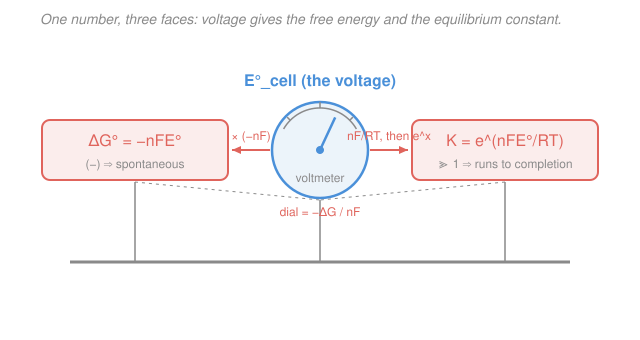

# Electrochemistry · Lesson 1.4: Cell EMF, Gibbs energy & the equilibrium constant

> ⏱ ~15 min · Module 1: Redox, cells & the thermodynamics of voltage · Builds on: [1.3 Electrode potentials & the SHE series](01-03-electrode-potentials-she-series.md), [`physical-chemistry` 1.3 Gibbs & Helmholtz energies](../../physical-chemistry/lessons/01-03-gibbs-helmholtz-energies.md), [`physical-chemistry` 2.6 The equilibrium constant](../../physical-chemistry/lessons/02-06-chemical-equilibrium-constant.md) · Unlocks: [1.5 The Nernst equation & concentration cells](01-05-nernst-equation-concentration-cells.md)

## Why this matters

In [1.3](01-03-electrode-potentials-she-series.md) you learned to read a voltage off two half-cells. This lesson says what that voltage *is*: **a cell's EMF is the reaction's Gibbs free energy, converted to volts.** That's the single most important bridge in electrochemistry. It means a voltmeter is a thermometer for spontaneity — a positive reading is a negative $\Delta G$, the exact criterion from [physical chemistry](../../physical-chemistry/lessons/01-03-gibbs-helmholtz-energies.md), now something you can watch on a dial. And because $\Delta G^\circ$ also fixes the equilibrium constant $K$, one measured voltage hands you *three* numbers at once: how the cell runs, how much work it can do, and how far the reaction goes. It even lets you extract entropy and enthalpy without a calorimeter — just by warming the cell and watching the voltage drift.

## The idea

A galvanic cell is a chemical reaction that has been forced to push its electrons through a wire instead of just dumping heat. Every mole of reaction shoves $n$ moles of electrons "downhill" from the anode to the cathode. The *size* of that downhill drop, per unit charge, is the voltage. So voltage $\times$ charge $=$ energy — specifically, the useful (electrical) energy the reaction can deliver, which thermodynamics already has a name for: the **Gibbs free energy** $\Delta G$, the maximum non-expansion work a process can do (from [phys-chem 1.3](../../physical-chemistry/lessons/01-03-gibbs-helmholtz-energies.md)).

That's the whole story in one line: $\Delta G = -nFE$. The reaction's free-energy drop shows up as electrical work $nFE$; the minus sign just says a *spontaneous* reaction (energy released, $\Delta G < 0$) produces a *positive* voltage.

And here's the payoff. In [phys-chem 2.6](../../physical-chemistry/lessons/02-06-chemical-equilibrium-constant.md), the same $\Delta G^\circ$ that measures spontaneity also fixed the equilibrium constant via $\Delta G^\circ = -RT\ln K$. Set the two expressions for $\Delta G^\circ$ equal and $K$ falls out of the voltage. Because the conversion factor $nF/RT$ is huge (about 39 per volt at room temperature), even a modest one-volt cell corresponds to an equilibrium constant around $10^{17}$ — the reaction goes essentially to completion. A voltmeter reading of "1 V" quietly means "this reaction finishes."

## The formal version

**Standard cell EMF.** Assemble a cell from two half-reactions, each with its tabulated **standard reduction potential** $E^\circ$ (from the [1.3](01-03-electrode-potentials-she-series.md) series, all referenced to the SHE). The standard cell EMF is

$$E^\circ_\text{cell} = E^\circ_\text{cathode} - E^\circ_\text{anode},$$

where both $E^\circ$ are taken **as tabulated reduction potentials** — you do *not* flip the sign of the anode's value. *In words: subtract the two reduction potentials; the electrode with the higher reduction potential is the cathode, and the difference is the cell voltage.* If $E^\circ_\text{cell} > 0$ the cell runs spontaneously as a galvanic cell; if $E^\circ_\text{cell} < 0$ the reaction as written is non-spontaneous (you'd need to drive it — an electrolytic cell, [1.2](01-02-galvanic-electrolytic-cells-faraday.md)).

**The master relation.** Let $n$ be the number of moles of electrons transferred per mole of reaction (a pure integer, read off the balanced equation from [1.1](01-01-redox-balancing-half-reactions.md)), and let $F = 96485\ \mathrm{C/mol}$ be the **Faraday constant** (the charge of one mole of electrons). Then

$$\boxed{\;\Delta G = -nFE \qquad\text{and, at standard conditions,}\qquad \Delta G^\circ = -nFE^\circ_\text{cell}.\;}$$

*In words: the free-energy change equals the charge pushed ($nF$) times the voltage it's pushed through, with a minus sign so that "energy released" reads as "positive voltage."* This comes straight from the definition of $\Delta G$ as maximum non-expansion work: the electrical work of moving charge $nF$ through a potential difference $E$ is $w_\text{elec} = nFE$, and a reversible cell delivers exactly $-\Delta G$ of it. So the three statements

$$E^\circ_\text{cell} > 0 \quad\Longleftrightarrow\quad \Delta G^\circ < 0 \quad\Longleftrightarrow\quad \text{spontaneous}$$

are one fact wearing three costumes. The units check: $[n F E] = \mathrm{mol} \cdot \dfrac{\mathrm{C}}{\mathrm{mol}} \cdot \mathrm{V} = \mathrm{C}\cdot\mathrm{V} = \mathrm{J}$, energy per mole of reaction.

**The link to equilibrium.** Equilibrium is where the reaction has no more free energy to give: $\Delta G = 0$, hence $E_\text{cell} = 0$ (a dead battery). Combining the standard master relation with $\Delta G^\circ = -RT\ln K$ from [phys-chem 2.6](../../physical-chemistry/lessons/02-06-chemical-equilibrium-constant.md),

$$-nFE^\circ_\text{cell} = \Delta G^\circ = -RT\ln K \quad\Longrightarrow\quad \boxed{\;\ln K = \frac{nFE^\circ_\text{cell}}{RT}\;}$$

with $R = 8.314\ \mathrm{J\,mol^{-1}K^{-1}}$ and $T$ the temperature in kelvin. *In words: the equilibrium constant is set entirely by the standard voltage; the prefactor $nF/RT$ turns a small voltage into an enormous $K$.* At $T = 298\ \mathrm{K}$, $RT/F = 0.0257\ \mathrm{V}$, so $nF/RT = n/0.0257 \approx 38.9\,n$ per volt — every extra volt (per electron) multiplies $K$ by $e^{38.9} \approx 10^{17}$.

**Temperature dependence — thermodynamics without a calorimeter.** Differentiate $\Delta G^\circ = -nFE^\circ$ with respect to temperature. From [phys-chem 1.3](../../physical-chemistry/lessons/01-03-gibbs-helmholtz-energies.md), $\left(\partial(\Delta G^\circ)/\partial T\right)_p = -\Delta S^\circ$, so

$$\left(\frac{\partial E^\circ_\text{cell}}{\partial T}\right)_p = \frac{\Delta S^\circ}{nF}, \qquad \Delta H^\circ = \Delta G^\circ + T\Delta S^\circ.$$

*In words: how fast the cell voltage drifts as you warm it directly reports the reaction entropy; combine with $\Delta G^\circ$ and you get the enthalpy too.* This is remarkable — measuring a voltage and its temperature coefficient hands you all of $\Delta G^\circ$, $\Delta S^\circ$, and $\Delta H^\circ$, quantities you'd otherwise chase with a calorimeter.

## Picture

One number — the standard cell voltage in the middle — wears three faces. Multiply by $-nF$ and it becomes the free energy $\Delta G^\circ$ (left); divide by $RT$ and exponentiate and it becomes the equilibrium constant $K$ (right). The voltmeter's dial is really a Gibbs-energy meter in disguise.

## Worked examples

**Example 1 (the three faces of one voltage).** Build a cell from copper and iron:

$$\ce{Cu^2+ + 2e- -> Cu}\quad E^\circ = +0.34\ \mathrm{V}, \qquad \ce{Fe^2+ + 2e- -> Fe}\quad E^\circ = -0.44\ \mathrm{V}.$$

Copper has the higher reduction potential, so it is the cathode and iron the anode:

$$E^\circ_\text{cell} = E^\circ_\text{cathode} - E^\circ_\text{anode} = 0.34 - (-0.44) = 0.78\ \mathrm{V} > 0 \;\Rightarrow\; \text{spontaneous.}$$

Both half-reactions carry 2 electrons, so $n = 2$. The free energy:

$$\Delta G^\circ = -nFE^\circ_\text{cell} = -(2)(96485)(0.78) = -1.505\times10^{5}\ \mathrm{J/mol} \approx -150.5\ \mathrm{kJ/mol}.$$

And the equilibrium constant, at $T = 298\ \mathrm{K}$ ($RT = 2477.6\ \mathrm{J/mol}$):

$$\ln K = \frac{nFE^\circ_\text{cell}}{RT} = \frac{(2)(96485)(0.78)}{2477.6} = 60.75 \;\Rightarrow\; K = e^{60.75} \approx 2.4\times10^{26}.$$

One voltmeter reading, and we know the cell is spontaneous, releases 150 kJ per mole, and drives the reaction $10^{26}$-fold toward products.

**Example 2 (entropy and enthalpy from a warming cell).** Take that same Cu/Fe cell and measure its voltage as you change the temperature; suppose $\left(\partial E^\circ_\text{cell}/\partial T\right)_p = +1.5\times10^{-4}\ \mathrm{V/K}$. Then

$$\Delta S^\circ = nF\left(\frac{\partial E^\circ}{\partial T}\right)_p = (2)(96485)(1.5\times10^{-4}) = +28.9\ \mathrm{J\,mol^{-1}K^{-1}}.$$

The positive coefficient means the voltage *rises* with temperature, i.e. the reaction gains entropy. Now the enthalpy, using $\Delta G^\circ = -150.5\ \mathrm{kJ/mol}$ from Example 1:

$$\Delta H^\circ = \Delta G^\circ + T\Delta S^\circ = -150{,}517 + (298)(28.9) = -150{,}517 + 8626 \approx -141.9\ \mathrm{kJ/mol}.$$

No calorimeter, no heat measurement — just a voltmeter and a thermometer gave us the full thermodynamic profile. This is exactly the machinery Boss Problem 1 asks you to run.

## Watch out

- **You might think you flip the anode's sign** because "oxidation is the reverse of reduction." You don't — not in $E^\circ_\text{cell} = E^\circ_\text{cathode} - E^\circ_\text{anode}$. Both numbers go in as their *tabulated reduction potentials*; the subtraction already accounts for the anode running backward. (Flipping the sign *and* subtracting double-counts and gives the wrong voltage.)
- **You might treat $E^\circ$ like an extensive energy and scale it with $n$.** It isn't — $E^\circ$ is intensive (volts, energy *per* charge). Doubling a half-reaction doubles $n$ and doubles $\Delta G$, but leaves $E^\circ$ unchanged. Never multiply a reduction potential by its coefficient.
- **You might read "small voltage" as "barely spontaneous."** Because of the $nF/RT$ amplification, a mere $+0.2\ \mathrm{V}$ single-electron cell already has $K \approx 10^{3}$, and $+1\ \mathrm{V}$ means $K \approx 10^{17}$. Voltages that look tiny correspond to reactions that finish completely.

## One-liner

> A cell's voltage *is* its Gibbs free energy on a per-charge dial: $\Delta G^\circ = -nFE^\circ$ makes a positive EMF mean spontaneity, and $\ln K = nFE^\circ/RT$ turns that same voltage into an astronomically large equilibrium constant.

## Problems

**P1 (🟢)** A galvanic cell pairs a silver electrode and a copper electrode:

$$\ce{Ag+ + e- -> Ag}\quad E^\circ = +0.80\ \mathrm{V}, \qquad \ce{Cu^2+ + 2e- -> Cu}\quad E^\circ = +0.34\ \mathrm{V}.$$

Identify the cathode and anode, compute $E^\circ_\text{cell}$, and find $\Delta G^\circ$ in kJ/mol. (Watch the electron balance: how many electrons transfer per mole of reaction?)

**P2 (🟡)** A galvanic cell has $E^\circ_\text{cell} = 1.00\ \mathrm{V}$ and transfers $n = 2$ electrons. Compute its equilibrium constant $K$ at $298\ \mathrm{K}$. Then explain, using the structure of $\ln K = nFE^\circ/RT$, why such a "mere one volt" produces such an astronomically large $K$ — and what $K$ would be instead if only $n = 1$ electron were transferred.

**P3 (🔴, Boss-1 rehearsal)** The classic Daniell (zinc–copper) cell:

$$\ce{Zn^2+ + 2e- -> Zn}\quad E^\circ = -0.76\ \mathrm{V}, \qquad \ce{Cu^2+ + 2e- -> Cu}\quad E^\circ = +0.34\ \mathrm{V}, \qquad n = 2.$$

Find $E^\circ_\text{cell}$, then $\Delta G^\circ$ (kJ/mol), then $K$ at $298\ \mathrm{K}$. Comment on what a $K$ of that magnitude says about how completely zinc metal reduces copper ions.

Solutions

**P1** Silver has the higher reduction potential ($+0.80 > +0.34$), so **silver is the cathode** (reduction) and **copper is the anode** (oxidation). Standard EMF, using tabulated reduction potentials directly:

$$E^\circ_\text{cell} = E^\circ_\text{cathode} - E^\circ_\text{anode} = 0.80 - 0.34 = 0.46\ \mathrm{V}.$$

Electron balance: copper releases 2 electrons ($\ce{Cu -> Cu^2+ + 2e-}$), so we must reduce *two* silver ions ($\ce{2Ag+ + 2e- -> 2Ag}$) to match. Thus $n = 2$. Note $E^\circ = +0.80\ \mathrm{V}$ for silver is **unchanged** by doubling the half-reaction — potentials are intensive.

$$\Delta G^\circ = -nFE^\circ_\text{cell} = -(2)(96485)(0.46) = -8.877\times10^{4}\ \mathrm{J/mol} \approx -88.8\ \mathrm{kJ/mol}.$$

Negative, as required for a spontaneous ($E^\circ_\text{cell} > 0$) cell.

*Check.* Units: $\mathrm{mol}\cdot(\mathrm{C/mol})\cdot\mathrm{V} = \mathrm{C\cdot V} = \mathrm{J}$ ✓.

**P2** With $n = 2$, $E^\circ = 1.00\ \mathrm{V}$, $T = 298\ \mathrm{K}$ so $RT = 8.314 \times 298 = 2477.6\ \mathrm{J/mol}$:

$$\ln K = \frac{nFE^\circ}{RT} = \frac{(2)(96485)(1.00)}{2477.6} = 77.89 \;\Rightarrow\; K = e^{77.89} \approx 6.7\times10^{33}.$$

*Why so enormous:* the exponent is $nF/RT$ per volt $= 2/0.0257 \approx 77.9$ here. Since $e^{77.9} = 10^{77.9/2.303} = 10^{33.8}$, the equilibrium constant is $10^{33}$-scale. The point is that $F$ (about $10^5\ \mathrm{C/mol}$) dwarfs $RT$ (about $2.5\times10^3\ \mathrm{J/mol}$), so their ratio $\approx 39$ per electron-volt sits in the *exponent*. Voltage enters linearly but $K$ responds *exponentially*.

If instead $n = 1$, the exponent halves: $\ln K = 38.9$, so $K = e^{38.9} \approx 8.2\times10^{16}$ — the square root of the $n = 2$ value (halving the exponent square-roots $K$). Either way the reaction goes essentially to completion.

*Check.* $6.7\times10^{33} = (8.2\times10^{16})^2$ ✓, consistent with doubling the exponent.

**P3** Copper has the higher reduction potential, so **copper is the cathode**, **zinc the anode**:

$$E^\circ_\text{cell} = E^\circ_\text{cathode} - E^\circ_\text{anode} = 0.34 - (-0.76) = 1.10\ \mathrm{V}.$$

Free energy with $n = 2$:

$$\Delta G^\circ = -nFE^\circ_\text{cell} = -(2)(96485)(1.10) = -2.123\times10^{5}\ \mathrm{J/mol} \approx -212\ \mathrm{kJ/mol}.$$

Equilibrium constant at $298\ \mathrm{K}$:

$$\ln K = \frac{nFE^\circ_\text{cell}}{RT} = \frac{(2)(96485)(1.10)}{2477.6} = 85.7 \;\Rightarrow\; K = e^{85.7} \approx 1.6\times10^{37}.$$

A $K$ of $\sim 10^{37}$ means the reaction $\ce{Zn + Cu^2+ -> Zn^2+ + Cu}$ lies essentially entirely to the right: drop zinc metal into copper-ion solution and virtually every copper ion is reduced to metal — the equilibrium ratio $[\ce{Zn^2+}]/[\ce{Cu^2+}]$ at completion is astronomically large. This is why the Daniell cell is a reliable, high-driving-force battery.

*Check.* All three numbers match the master bridge: $1.10\ \mathrm{V} \to -212\ \mathrm{kJ/mol} \to 1.6\times10^{37}$. Sanity: $\ln(1.6\times10^{37}) = 37.2\times2.303 = 85.7$ ✓.

## Flashback

**From Lesson 1.3 (Electrode potentials & the SHE series):** Given the standard reduction potentials

$$\ce{Ni^2+ + 2e- -> Ni}\quad E^\circ = -0.25\ \mathrm{V}, \qquad \ce{Ag+ + e- -> Ag}\quad E^\circ = +0.80\ \mathrm{V},$$

determine which metal is the anode and which the cathode in the spontaneous galvanic cell, and state the direction electrons flow through the external wire. (Fresh variant — a nickel/silver pair.)

Solution

The species with the **higher reduction potential is reduced**, so silver ($+0.80\ \mathrm{V}$) is the cathode and nickel ($-0.25\ \mathrm{V}$), forced to run in reverse (oxidation), is the anode. Electrons are released at the anode and consumed at the cathode, so they flow **from the nickel electrode to the silver electrode** through the external wire.

Confirm spontaneity with today's formula: $E^\circ_\text{cell} = 0.80 - (-0.25) = 1.05\ \mathrm{V} > 0$, so the cell is indeed galvanic (and by $\Delta G^\circ = -nFE^\circ$, $\Delta G^\circ < 0$).

*Check.* The mnemonic from 1.3 holds — reduction happens at the electrode that "wants electrons more" (higher $E^\circ$), and current in the wire runs anode → cathode as electrons. ✓

## Connections

- **Backward:** this turns the [1.3](01-03-electrode-potentials-she-series.md) reduction-potential series into quantitative thermodynamics, and it *is* the electrical face of [phys-chem 1.3](../../physical-chemistry/lessons/01-03-gibbs-helmholtz-energies.md)'s $\Delta G$ (max non-expansion work) and [phys-chem 2.6](../../physical-chemistry/lessons/02-06-chemical-equilibrium-constant.md)'s $\Delta G^\circ = -RT\ln K$. The cell voltage is the Gibbs energy from physical chemistry, read on a voltmeter.
- **Forward:** [1.5 The Nernst equation](01-05-nernst-equation-concentration-cells.md) drops the "standard" restriction — replacing $E^\circ$ with $E = E^\circ - \frac{RT}{nF}\ln Q$ to handle real concentrations — and at equilibrium ($Q = K$, $E = 0$) it collapses back to exactly the $\ln K = nFE^\circ/RT$ derived here. This lesson also feeds **Boss Problem 1**, whose parts (a)/(b) are the temperature-coefficient extraction of $\Delta S^\circ$ and $\Delta H^\circ$ from Example 2.
- **Sideways:** the temperature trick is a general thermodynamic move — reading a derivative of a free energy to get entropy — the same idea as Maxwell relations in physical chemistry, here made unusually easy because the free energy is literally a measurable voltage.
