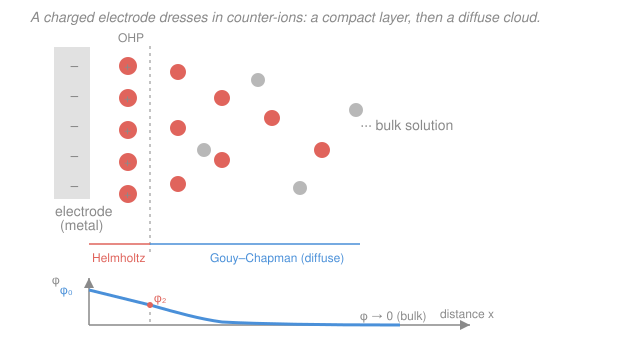

# Electrochemistry · Lesson 2.1: The interface & the electrical double layer

> ⏱ ~15 min · Module 2: Electrode kinetics & overpotential · Builds on: [1.5 Nernst equation & concentration cells](01-05-nernst-equation-concentration-cells.md), [1.3 Electrode potentials & the SHE](01-03-electrode-potentials-she-series.md) · Unlocks: 2.2 (activation overpotential & exchange current)

## Why this matters

Module 1 handed you voltages: the Nernst equation told you *where equilibrium sits* — the potential at which no net current flows. But a battery sitting at equilibrium does no work, and a real electrode that's actually *reacting* runs at a different potential than Nernst predicts. To understand that gap — the **overpotential** that all of Module 2 is about — you have to zoom all the way in to where electrochemistry physically happens: the few nanometers where metal meets solution. That interface is not a passive boundary. A charged electrode pulls a countercharge of ions out of solution and pins them against its surface, building a structure called the **electrical double layer**. It behaves like a capacitor, it stores charge without any reaction occurring, and — because it squeezes a whole volt across a nanometer — it hosts electric fields strong enough to rip electrons across the gap. Every rate law in this course starts here.

## The idea

Think of the electrode surface as one plate of a capacitor. Put excess negative charge on the metal (make its potential more negative) and it does what any charged plate does: it attracts the opposite charge. But there's no second metal plate — the "other plate" is the *solution*, which is full of mobile ions. Positive ions (cations) swarm toward the negative surface and negative ions retreat. The result is two sheets of opposite charge separated by a tiny gap: negative charge smeared on the metal, positive charge piled just outside it in solution. Two layers of charge, hence **double layer**, and it's exactly the charge-separated-across-a-gap geometry of a parallel-plate capacitor.

But solution ions aren't rigid tacks — they're jostled by thermal motion and they're solvated (wrapped in water). So the countercharge doesn't sit in one crisp sheet. Some ions press right up against the metal (held there electrically), but the rest form a fuzzy, thinning *cloud* that fades into the neutral bulk over a nanometer or so. Physics built up the picture in three passes, each fixing the last one's flaw:

1. **Helmholtz** — pretend the ions form one rigid sheet at a fixed distance. Clean parallel-plate capacitor, but too rigid.
2. **Gouy–Chapman** — let thermal motion spread the ions into a diffuse cloud. Realistic tail, but it wrongly lets ions pile up infinitely close to a highly charged surface.
3. **Stern** — do both: a rigid *compact* layer right at the surface, then a *diffuse* cloud beyond it. This is the working picture.

The payoff is one mental model you will use for the entire rest of the course: **the electrode interface is a capacitor (the double layer) sitting in parallel with a chemical reaction.** Charging the capacitor is one current; running the reaction is another. Keeping them separate is the whole trick.

## The formal version

**The double layer as a capacitor.** A capacitor stores charge $q$ in proportion to the voltage $E$ across it, $q = C E$, where $C$ (farads, F) is the capacitance. For an electrode we quote **double-layer capacitance per unit area**, $C_{dl}$, typically

$$C_{dl} \approx 10\text{–}40\ \mu\mathrm{F/cm^2}.$$

*In words: every square centimeter of electrode holds tens of microcoulombs of charge for each volt you push its potential.* This is enormous for a "capacitor" — because the plate separation is molecular. A parallel-plate capacitor has $C/A = \varepsilon\varepsilon_0/d$, with $\varepsilon_0 = 8.85\times10^{-12}\ \mathrm{F/m}$ the permittivity of vacuum, $\varepsilon$ the relative permittivity of the medium, and $d$ the plate gap; when $d$ is a fraction of a nanometer, $C/A$ balloons into the μF/cm² range.

**The three models.** Let $\phi(x)$ be the electric potential a distance $x$ from the electrode surface, dropping from $\phi_0$ at the metal to $0$ in the bulk.

- **Helmholtz:** all countercharge sits at one plane a distance $d$ (the ion radius, ~0.3 nm) from the surface. The potential falls *linearly* to zero across that gap, and $C_H = \varepsilon\varepsilon_0/d$ is a **constant**, independent of concentration or potential. *In words: a rigid parallel-plate capacitor.*

- **Gouy–Chapman:** ions are spread by thermal motion into a **diffuse layer**; the potential decays *exponentially* into solution, $\phi(x) \approx \phi_0\, e^{-\kappa x}$, over a characteristic thickness — the **Debye length** — $\kappa^{-1}$ that shrinks as ionic concentration $c$ rises, $\kappa^{-1}\propto 1/\sqrt{c}$. Here capacitance *depends on both concentration and potential*. *In words: a fuzzy ionic atmosphere whose thickness (and hence capacitance) you can tune with salt.*

- **Stern:** the two in **series** — a compact Helmholtz layer ($C_H$) right against the surface, then the diffuse Gouy–Chapman layer ($C_{GC}$) beyond it:

$$\frac{1}{C_{dl}} = \frac{1}{C_H} + \frac{1}{C_{GC}}.$$

*In words: capacitors in series add reciprocals, so the **smaller** capacitance dominates* — in dilute solution the thick diffuse layer wins; in concentrated solution it collapses and the fixed compact layer takes over.

**Charging current (non-Faradaic).** Because the interface is a capacitor, changing its potential *at all* forces current to flow just to rebuild the charge — no reaction needed. Differentiate $q = C_{dl} A\, E$ (with electrode area $A$) in time:

$$\boxed{\,i_c = C_{dl}\, A\,\frac{dE}{dt}\,}$$

*In words: sweep the potential faster and you draw a proportionally bigger **charging current**, purely to re-dress the double layer.* This $i_c$ is **non-Faradaic** — it moves no electrons across the interface into a chemical reaction, it just piles charge on the "plates." It is the background current you must subtract in voltammetry (Module 3.5), and it is physically distinct from the **Faradaic** reaction current $i_F$ that actually converts species.

**Ideally polarizable electrode vs. a reacting electrode.** An electrode where *no* reaction can occur over some potential window (e.g. clean mercury in inert electrolyte) is **ideally polarizable**: all current is charging current, so it is a *pure capacitor* — every electron you supply just changes its potential. A real reacting electrode instead behaves as that capacitor $C_{dl}$ **in parallel** with a resistor-like path (the charge-transfer resistance) carrying the Faradaic reaction. Total current splits:

$$i = \underbrace{C_{dl}A\,\frac{dE}{dt}}_{\text{charging the double layer}} + \underbrace{i_F}_{\text{driving the reaction}}.$$

*In words: the equivalent circuit for any electrode is a capacitor (double layer) in parallel with a reaction path — this is the skeleton every kinetics model in this course hangs on.*

**The field across the gap.** The whole interfacial potential drop $\Delta\phi$ (often a fraction of a volt, up to ~1 V) falls across a layer only a nanometer thick. The electric field is drop over distance:

$$\mathcal{E} = \frac{\Delta\phi}{d} \sim \frac{0.1\text{–}1\ \mathrm{V}}{10^{-9}\ \mathrm{m}} \sim 10^{8}\text{–}10^{9}\ \mathrm{V/m}.$$

*In words: nanometer thickness turns an ordinary voltage into a colossal field* — larger than lightning, sitting permanently at the electrode. That field is what physically drives electron transfer, and tuning it with the applied potential is how you steer reaction rates in [2.2](02-02-activation-exchange-current.md).

## Picture

## Worked examples

**Example 1 (charging a clean electrode).** A 2 cm² platinum electrode in inert electrolyte has $C_{dl} = 20\ \mu\mathrm{F/cm^2}$. You sweep its potential at $50\ \mathrm{mV/s}$. What charging current flows, and how much charge moves if you sweep across a 0.5 V window?

Total capacitance: $C = C_{dl}A = 20\ \mu\mathrm{F/cm^2}\times 2\ \mathrm{cm^2} = 40\ \mu\mathrm{F}$. Charging current:

$$i_c = C\frac{dE}{dt} = 40\times10^{-6}\ \mathrm{F}\times 0.05\ \mathrm{V/s} = 2\times10^{-6}\ \mathrm{A} = 2\ \mu\mathrm{A}.$$

Charge to move across the 0.5 V window: $q = C\,\Delta E = 40\times10^{-6}\times 0.5 = 20\ \mu\mathrm{C}$. No reaction happened — this is all non-Faradaic. In a voltammogram it's the flat background box you subtract before reading the reaction peaks.

**Example 2 (why salt changes the capacitance).** Add supporting electrolyte to the cell — raise the ionic concentration a hundredfold. In the Gouy–Chapman picture the diffuse-layer thickness (Debye length) scales as $\kappa^{-1}\propto 1/\sqrt{c}$, so it shrinks by $\sqrt{100} = 10\times$. Since a capacitor's capacitance goes as $1/(\text{gap})$, the diffuse-layer capacitance rises about tenfold. In the Stern series formula $1/C_{dl} = 1/C_H + 1/C_{GC}$, the once-dominant diffuse term collapses and the fixed compact term $C_H$ takes over — which is exactly why experimentalists flood cells with inert salt: it pins the double layer down to a small, reproducible, potential-independent capacitance and crushes the diffuse-layer field, so the measured potential drop happens right at the reacting surface.

## Watch out

- **You might think charging current means a reaction is happening.** It isn't — $i_c = C_{dl}A\,dE/dt$ flows even at an ideally polarizable electrode where nothing reacts. Current at an electrode is not proof of chemistry; you must separate the non-Faradaic (capacitor) part from the Faradaic (reaction) part.
- **You might picture the double layer as one sheet of ions.** Helmholtz alone is the rigid-sheet cartoon; reality is Stern — a compact layer *plus* a diffuse cloud, which is why capacitance depends on concentration and potential rather than being a fixed constant.
- **You might think a fraction of a volt is a gentle push.** Across a nanometer it is a $10^8$–$10^9\ \mathrm{V/m}$ field. The interface is a violently strong-field environment; that's the reason electron transfer can happen at all, and the reason small potential changes make big rate changes (2.2).

## One-liner

> The electrode/solution interface is a nanometer-thick capacitor — the electrical double layer — that stores charge non-Faradaically, sits in parallel with the reaction, and packs an ordinary voltage into a field fierce enough to drive electron transfer.

## Problems

**P1 (🟢)** A 5 cm² carbon electrode has a double-layer capacitance of $30\ \mu\mathrm{F/cm^2}$. It is held in inert electrolyte (no reaction) and its potential is swept at $100\ \mathrm{mV/s}$. (a) What charging current flows? (b) How much charge is stored on the double layer when the potential has moved by $0.4\ \mathrm{V}$?

**P2 (🟡)** In one or two sentences each, state what the Gouy–Chapman model *adds* to Helmholtz, and what Stern *adds* to Gouy–Chapman. Then explain physically why the double-layer capacitance depends on electrolyte concentration in the diffuse-layer picture but *not* in the pure Helmholtz picture.

**P3 (🔴)** A metal electrode carries an interfacial potential drop of $0.2\ \mathrm{V}$ across a compact layer $0.3\ \mathrm{nm}$ thick. (a) Estimate the electric field in the layer. (b) An electron-transfer step has to climb an activation barrier. Suppose shifting the electrode potential by $0.10\ \mathrm{V}$ lowers that barrier by $\alpha F\,\Delta E$ with $\alpha = 0.5$ (the transfer coefficient you'll meet in 2.2). By what factor does the reaction rate change at $298\ \mathrm{K}$? Comment on why such fields make electrode kinetics so sensitive to potential.

Solutions

**P1** (a) Total capacitance $C = C_{dl}A = 30\ \mu\mathrm{F/cm^2}\times 5\ \mathrm{cm^2} = 150\ \mu\mathrm{F}$. Charging current:

$$i_c = C\frac{dE}{dt} = 150\times10^{-6}\ \mathrm{F}\times 0.100\ \mathrm{V/s} = 1.5\times10^{-5}\ \mathrm{A} = 15\ \mu\mathrm{A}.$$

(b) Charge at $\Delta E = 0.4\ \mathrm{V}$:

$$q = C\,\Delta E = 150\times10^{-6}\ \mathrm{F}\times 0.4\ \mathrm{V} = 6.0\times10^{-5}\ \mathrm{C} = 60\ \mu\mathrm{C}.$$

*Check.* Units: $\mathrm{F}\cdot\mathrm{V/s} = (\mathrm{C/V})(\mathrm{V/s}) = \mathrm{C/s} = \mathrm{A}$ ✓, and $\mathrm{F}\cdot\mathrm{V} = \mathrm{C}$ ✓. Both are non-Faradaic — no electrons crossed into a reaction.

**P2** *Gouy–Chapman adds thermal spreading:* instead of Helmholtz's single rigid sheet at a fixed distance, the counter-ions form a **diffuse cloud** whose density falls off with distance, so the potential decays exponentially (over the Debye length) rather than linearly, and the layer's thickness responds to concentration and potential. *Stern adds the finite ion size back in:* it recognizes ions cannot approach closer than their radius, so it places a **compact (Helmholtz) layer** right at the surface **in series** with the diffuse Gouy–Chapman layer — fixing Gouy–Chapman's unphysical prediction of infinite ion density and infinite capacitance at highly charged surfaces.

Concentration dependence: in the pure Helmholtz model the gap $d$ is just the fixed ion radius, so $C_H = \varepsilon\varepsilon_0/d$ is a constant — no concentration anywhere. In the diffuse picture the *effective* charge-separation distance is the Debye length $\kappa^{-1}\propto 1/\sqrt{c}$: more ions in solution screen the electrode's charge over a shorter distance, shrinking the gap and *raising* the capacitance. So capacitance grows with concentration precisely because concentration sets how far the ionic cloud extends.

**P3** (a) Field is potential drop over thickness:

$$\mathcal{E} = \frac{\Delta\phi}{d} = \frac{0.2\ \mathrm{V}}{0.3\times10^{-9}\ \mathrm{m}} \approx 6.7\times10^{8}\ \mathrm{V/m}.$$

That sits squarely in the $10^{8}$–$10^{9}\ \mathrm{V/m}$ range — a field no macroscopic capacitor could survive, held routinely at an electrode because the gap is molecular.

(b) The barrier drops by $\Delta G^\ddagger = \alpha F\,\Delta E = 0.5\times 96485\ \mathrm{C/mol}\times 0.10\ \mathrm{V} \approx 4824\ \mathrm{J/mol}$. By the Arrhenius/Boltzmann factor the rate multiplies by

$$\exp\!\left(\frac{\alpha F\,\Delta E}{RT}\right) = \exp\!\left(\frac{4824}{8.314\times 298}\right) = \exp(1.95) \approx 7.$$

So a mere **100 mV** nudge speeds the reaction about **sevenfold**. Because the interfacial field is so intense, a small change in electrode potential shifts the activation barrier by an amount comparable to $RT$, and rate depends *exponentially* on that barrier — this exponential sensitivity of current to potential is exactly the Butler–Volmer/Tafel behavior of Module 2. (Bridge: this is Arrhenius kinetics with the barrier tilted by the applied potential — see physical chemistry's [Arrhenius & transition-state theory](../../physical-chemistry/lessons/03-04-arrhenius-transition-state-theory.md).)

## Flashback

**From Lesson 1.5 (Nernst equation & concentration cells):** A concentration cell is built from two copper electrodes, each dipping in $\ce{Cu^2+}$ solution — one at $0.100\ \mathrm{M}$, the other at $0.00100\ \mathrm{M}$ — joined by a salt bridge ($\ce{Cu | Cu^2+ (0.001\,M) || Cu^2+ (0.1\,M) | Cu}$). With $\ce{Cu^2+ + 2e- -> Cu}$ ($n = 2$) and $E^\circ = 0$ for a cell of identical electrodes, find the cell emf at $298\ \mathrm{K}$, and say which electrode is the cathode.

Solution

For a concentration cell the standard emf is zero (same half-reaction on both sides), so the entire voltage comes from the concentration term of the Nernst equation. The cell drives itself toward equalizing the two concentrations, so the **more concentrated** side is reduced (plates out $\ce{Cu}$) — it is the **cathode** — and the dilute side is the anode. Using $E = \frac{RT}{nF}\ln\frac{c_\text{high}}{c_\text{low}} = \frac{0.0592}{n}\log_{10}\frac{c_\text{high}}{c_\text{low}}$ at 298 K:

$$E = \frac{0.0592}{2}\log_{10}\!\frac{0.100}{0.00100} = 0.0296\times\log_{10}(100) = 0.0296\times 2 = 0.0592\ \mathrm{V} \approx 59\ \mathrm{mV}.$$

*Check.* Positive emf ✓ (a spontaneous cell), and the sign is right: the $0.1\ \mathrm{M}$ electrode is the cathode. Sanity: a hundredfold concentration ratio gives exactly one $\tfrac{0.0592}{2}\times 2$ = 59 mV, the textbook "59 mV per decade, halved for $n=2$" result. The interface where this 59 mV is actually established is the double layer of this very lesson.

## Connections

- **Backward:** the potentials of Module 1 — the [Nernst equilibrium potential](01-05-nernst-equation-concentration-cells.md) and the [electrode potentials on the SHE scale](01-03-electrode-potentials-she-series.md) — are the potential *drops* that fall across this double layer. Module 1 told you the equilibrium value; this lesson says where it physically lives.
- **Forward:** [2.2 (activation overpotential & exchange current)](02-02-activation-exchange-current.md) turns the huge interfacial field into a rate law — how far you push the potential from Nernst sets the barrier for electron transfer. The charging current $i_c$ returns in [3.5 (voltammetry)](03-05-linear-sweep-cyclic-voltammetry.md) as the non-Faradaic background you subtract to see the reaction.
- **Sideways:** the barrier-tilting in P3 is physical chemistry's [Arrhenius / transition-state theory](../../physical-chemistry/lessons/03-04-arrhenius-transition-state-theory.md) with the applied potential doing the work — the same activated-rate idea that will become Butler–Volmer in 2.3.
