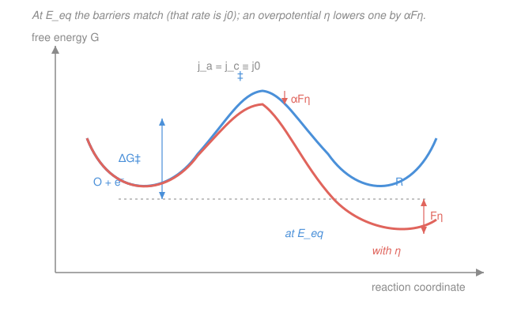

# Electrochemistry · Lesson 2.2: From equilibrium to current — activation & j₀

> ⏱ ~15 min · Module 2: Electrode kinetics & overpotential · Builds on: [2.1 The interface & the electrical double layer](02-01-interface-electrical-double-layer.md), [physical-chemistry 3.4 Arrhenius & transition-state theory](../../physical-chemistry/lessons/03-04-arrhenius-transition-state-theory.md) · Unlocks: 2.3 (the Butler–Volmer equation)

## Why this matters

Thermodynamics (Module 1) told you *whether* a reaction runs and what voltage it's worth — but it said nothing about *how fast*. A cell can be wildly favorable ($\Delta G \ll 0$) and still deliver almost no current, because electrons have to *cross the interface*, and that crossing has a barrier. This lesson is where electrochemistry stops being bookkeeping and becomes **kinetics**: the same Arrhenius picture you built in physical chemistry, but with a knob thermodynamics doesn't have — the electrode potential physically **tilts the barrier**. That one idea is the seed of everything in Module 2: overpotential, Tafel slopes, why platinum is a magic catalyst and mercury is a terrible one, and the Butler–Volmer equation ([2.3](02-03-butler-volmer-equation.md)) that ties it all together.

## The idea

Sit an electrode in solution at its equilibrium potential $E_\text{eq}$ — the voltage where the Nernst equation ([1.5](01-05-nernst-equation-concentration-cells.md)) says "no net reaction." Here's the surprise: the electrode is **not asleep**. Reduction ($\ce{O + e- -> R}$) and oxidation ($\ce{R -> O + e-}$) are both happening, constantly, at the *same rate*. Every electron handed to the solution is matched by one taken back. The two currents are equal and opposite, so the **net** current is zero — but each one is a real, nonzero flow. It's a busy stalemate, not a dead stop, exactly like a chemical equilibrium where forward and reverse reactions both run at equal rates.

That common one-way rate, expressed as a current per unit area, is the **exchange current density $j_0$**. It's the single most important number in electrode kinetics because it measures how *facile* the electron transfer is — how easily this particular reaction happens on this particular surface. A big $j_0$ (like $\ce{H+}/\ce{H2}$ on platinum) means a fast, "reversible" couple that springs into current the instant you nudge it. A tiny $j_0$ (the same reaction on mercury, or oxygen reactions on almost anything) means a sluggish couple that just sits there until you *shove* — apply a large **overpotential** — before meaningful current flows.

Why is any of this rate-limited? Because turning $\ce{O}$ into $\ce{R}$ passes through a high-energy transition state: an **activation barrier**, just like every reaction in [physical-chemistry 3.4](../../physical-chemistry/lessons/03-04-arrhenius-transition-state-theory.md). The rate is Arrhenius, $\propto e^{-\Delta G^\ddagger/RT}$. And now the electrochemical twist that makes this its own subject: **the barrier isn't fixed.** Change the electrode potential and you shift the energy of the charged species relative to the transition state — you *tilt* the free-energy landscape, lowering the barrier for one direction and raising it for the other. Potential is a kinetic knob on the barrier height. That's the whole engine of Module 2.

## The formal version

**Exchange current density.** At $E_\text{eq}$ the cathodic (reduction) and anodic (oxidation) partial current densities are equal in magnitude:

$$\lvert j_c\rvert = \lvert j_a\rvert \equiv j_0, \qquad j_\text{net} = j_a - \lvert j_c\rvert = 0.$$

*In words: at equilibrium both half-reactions carry the current $j_0$, in opposite directions, so nothing shows up on an ammeter — but the traffic is real.* Units: $\mathrm{A/cm^2}$. Typical values span **twelve orders of magnitude**: $\ce{H+}/\ce{H2}$ on Pt has $j_0 \sim 10^{-3}\ \mathrm{A/cm^2}$; the same reaction on Hg has $j_0 \sim 10^{-12}\ \mathrm{A/cm^2}$.

**Rate as an activated process.** Each direction has a rate constant of Arrhenius/transition-state form,

$$k = A\,e^{-\Delta G^\ddagger/RT},$$

where $\Delta G^\ddagger$ is the **activation free energy** (J/mol), $R = 8.314\ \mathrm{J\,mol^{-1}K^{-1}}$, $T$ is temperature (K), and $A$ is a pre-exponential factor. *In words: only the fraction $e^{-\Delta G^\ddagger/RT}$ of attempts have enough energy to clear the barrier* — identical to the gas-phase kinetics of phys-chem 3.4, with a free-energy barrier instead of an energy barrier.

**Potential tilts the barrier.** Define the **overpotential** $\eta \equiv E - E_\text{eq}$ (volts): how far you've pushed the electrode from equilibrium. Shifting the potential by $\eta$ shifts the electrical energy of the transferring charge by $F\eta$ (with $F = 96485\ \mathrm{C/mol}$). Only a *fraction* of that shift reaches the transition state, set by the **transfer coefficient** (or **symmetry factor**) $\alpha$, a dimensionless number near $0.5$. The activation free energies become

$$\Delta G^\ddagger_a(\eta) = \Delta G^\ddagger_a(0) - \alpha_a F\eta, \qquad \Delta G^\ddagger_c(\eta) = \Delta G^\ddagger_c(0) + \alpha_c F\eta.$$

*In words: a positive (anodic) overpotential lowers the oxidation barrier by $\alpha_a F\eta$ and raises the reduction barrier by $\alpha_c F\eta$* — the same push helps one direction by exactly as much as it hinders the other. Feeding these into $k = A e^{-\Delta G^\ddagger/RT}$ gives partial currents that grow (or shrink) exponentially with $\eta$:

$$j_a = j_0\,e^{\,\alpha_a F\eta/RT}, \qquad \lvert j_c\rvert = j_0\,e^{-\alpha_c F\eta/RT}.$$

Their difference is the Butler–Volmer equation of [2.3](02-03-butler-volmer-equation.md). $\alpha$ is literally the **fraction of the applied potential that goes into lowering the forward barrier**, and geometrically it's *where along the reaction coordinate the barrier peak sits* — the symmetry of the crossing. At $\eta = 0$ both exponentials are $1$ and we recover $\lvert j_c\rvert = j_a = j_0$, as they must.

## Picture

The blue curve is the free-energy landscape at $E_\text{eq}$: two wells (reactant $\ce{O + e-}$ and product $\ce{R}$) separated by a barrier. The barriers seen from each side are equal, so forward and back rates match — that's $j_0$. The coral curve is the *same reaction with an overpotential applied*: the whole product side slides down by $F\eta$, and because the transition state sits a fraction $\alpha$ of the way along, the barrier top drops by only $\alpha F\eta$. Lower barrier, exponentially faster rate — current flows.

## Worked examples

**Example 1 (how hard the knob turns).** Take $\alpha = 0.5$, $T = 298\ \mathrm{K}$, so $RT/F = 0.0257\ \mathrm{V}$. Apply a modest overpotential $\eta = 100\ \mathrm{mV} = 0.1\ \mathrm{V}$. By how much does it speed the favored direction?

$$\frac{j_a}{j_0} = e^{\,\alpha F\eta/RT} = \exp\!\left(\frac{0.5 \times 0.1}{0.0257}\right) = e^{1.95} \approx 7.0.$$

A tenth of a volt — pocket-change on a battery — multiplies the rate sevenfold. Push another 100 mV and you multiply by $7$ again. This exponential leverage is why electrode kinetics is so responsive to potential, and why a *little* extra voltage can unstick a sluggish reaction.

**Example 2 (why $j_0$ is a catalyst score).** The hydrogen reaction $\ce{2H+ + 2e- <=> H2}$ is thermodynamically the same on any metal — same $E^\circ$, same $\Delta G$. Yet $j_0$ ranges from $\sim 10^{-3}\ \mathrm{A/cm^2}$ on Pt to $\sim 10^{-12}\ \mathrm{A/cm^2}$ on Hg, a factor of a *billion*. Thermodynamics is blind to this (Module 1 would call the two electrodes identical); only kinetics sees it. The gap is pure barrier height: Pt binds the H intermediate just right, lowering $\Delta G^\ddagger$; Hg binds it poorly, leaving a tall barrier. That single number decides whether an electrolyzer runs at 1.5 V or wastes energy at 2.5 V — the entire game of electrocatalysis is *raising $j_0$*.

## Watch out

- **You might think zero net current means nothing is happening.** At $E_\text{eq}$ the electrode is at its busiest balanced state — two equal currents of magnitude $j_0$ flowing in opposite directions. "Equilibrium" is dynamic, not dead. It's the *net* that's zero.
- **You might conflate $j_0$ with thermodynamic favorability.** $j_0$ is a *kinetic* quantity (barrier height, surface chemistry); $E^\circ$ and $\Delta G$ are *thermodynamic*. A reaction can be hugely favorable ($\Delta G \ll 0$) yet have a microscopic $j_0$ — favorable but slow. They are independent axes.
- **You might read $\alpha$ as a fudge factor.** It's not: $\alpha$ is the fraction of the applied potential that reaches the transition state, fixed by *where the barrier peak sits along the reaction coordinate*. A symmetric barrier gives $\alpha = 0.5$; an early or late transition state pushes it off $0.5$. It carries real mechanistic information.

## One-liner

> Even at equilibrium each direction carries the exchange current $j_0$; the electrode potential is a knob that tilts the Arrhenius barrier by $\alpha F\eta$, turning a balanced stalemate into net current.

## Problems

**P1 (🟢)** Explain in words what the exchange current density $j_0$ *is*, physically, and why a nonzero $j_0$ is compatible with zero net current at $E_\text{eq}$. Then contrast a large-$j_0$ couple (e.g. $\ce{H+}/\ce{H2}$ on Pt) with a small-$j_0$ couple (e.g. on Hg): which needs a larger overpotential to deliver a useful current, and why?

**P2 (🟡)** An electrode reaction has rate constant $k = A\,e^{-\Delta G^\ddagger/RT}$. Show that shifting the electrode potential by an overpotential $\eta$ lowers the forward activation free energy by $\alpha F\eta$, and hence multiplies the forward rate by $e^{\alpha F\eta/RT}$. With $\alpha = 0.5$ and $T = 298\ \mathrm{K}$ ($RT/F = 0.0257\ \mathrm{V}$), compute the rate-enhancement factor for $\eta = 120\ \mathrm{mV}$.

**P3 (🔴)** In the Tafel (large-$\eta$) regime the net current is $j \approx j_0\,e^{\alpha F\eta/RT}$, so $\eta = \dfrac{RT}{\alpha F}\ln\dfrac{j}{j_0}$. Two electrodes must both deliver $j = 10\ \mathrm{mA/cm^2}$: electrode A has $j_0 = 10^{-3}\ \mathrm{A/cm^2}$, electrode B has $j_0 = 10^{-9}\ \mathrm{A/cm^2}$. Take $\alpha = 0.5$, $298\ \mathrm{K}$. Find the overpotential each needs, and explain physically why the small-$j_0$ electrode is so much more expensive. Then say what $\alpha$ has to do with the *symmetry* of the barrier.

Solutions

**P1** $j_0$ is the magnitude of the (equal) one-directional current density flowing across the interface at the equilibrium potential $E_\text{eq}$. At $E_\text{eq}$ the reduction $\ce{O + e- -> R}$ and oxidation $\ce{R -> O + e-}$ both proceed, at the *same* rate; each is a genuine flow of charge, but because they are equal and opposite the **net** current an ammeter reads is zero. So a large $j_0$ is perfectly consistent with $j_\text{net} = 0$ — it just means both directions are running fast in balance.

$j_0$ measures how *facile* the electron transfer is (low barrier / good surface chemistry = large $j_0$). A **large-$j_0$** couple like $\ce{H+}/\ce{H2}$ on Pt reacts readily: a tiny overpotential unbalances the two big currents and immediately yields substantial net current. A **small-$j_0$** couple (same reaction on Hg) is sluggish; its balanced currents are minuscule, so to build the same net current you must drive the potential far from equilibrium — a **large overpotential** — before the exponential $e^{\alpha F\eta/RT}$ lifts the current to a useful level. Small $j_0$ ⇒ large overpotential ⇒ wasted energy.

**P2** The transferring charge is $1\times$ electron worth of charge per ion; shifting the electrode potential by $\eta$ changes its electrical (free) energy by $F\eta$ per mole. A fraction $\alpha$ of that shift is felt at the transition state, so the forward (say anodic) barrier changes as

$$\Delta G^\ddagger(\eta) = \Delta G^\ddagger(0) - \alpha F\eta.$$

Substituting into the Arrhenius/TST rate constant:

$$k(\eta) = A\,e^{-\Delta G^\ddagger(\eta)/RT} = A\,e^{-[\Delta G^\ddagger(0) - \alpha F\eta]/RT} = \underbrace{A\,e^{-\Delta G^\ddagger(0)/RT}}_{k(0)}\;e^{\,\alpha F\eta/RT}.$$

So the rate (and hence the partial current) is multiplied by $e^{\alpha F\eta/RT}$. For $\eta = 0.120\ \mathrm{V}$:

$$\frac{\alpha F\eta}{RT} = \frac{\alpha \eta}{RT/F} = \frac{0.5 \times 0.120}{0.0257} = \frac{0.060}{0.0257} = 2.335, \qquad e^{2.335} \approx 10.3.$$

A 120 mV overpotential speeds the forward direction by about **a factor of 10**. *(Sanity: this matches the Tafel rule of thumb — one decade of current per $\approx 0.118\ \mathrm{V}$ when $\alpha = 0.5$.)*

**P3** Use $\eta = \dfrac{RT}{\alpha F}\ln\dfrac{j}{j_0}$. With $\alpha = 0.5$, $RT/F = 0.0257\ \mathrm{V}$, the prefactor is $\dfrac{RT}{\alpha F} = \dfrac{0.0257}{0.5} = 0.0514\ \mathrm{V}$. Target $j = 10\ \mathrm{mA/cm^2} = 10^{-2}\ \mathrm{A/cm^2}$.

*Electrode A* ($j_0 = 10^{-3}$): $\dfrac{j}{j_0} = \dfrac{10^{-2}}{10^{-3}} = 10$, so

$$\eta_A = 0.0514 \times \ln 10 = 0.0514 \times 2.303 = 0.118\ \mathrm{V} \approx 118\ \mathrm{mV}.$$

*Electrode B* ($j_0 = 10^{-9}$): $\dfrac{j}{j_0} = \dfrac{10^{-2}}{10^{-9}} = 10^{7}$, so

$$\eta_B = 0.0514 \times \ln(10^{7}) = 0.0514 \times 16.12 = 0.829\ \mathrm{V} \approx 830\ \mathrm{mV}.$$

Electrode B needs **~0.7 V more** overpotential for the identical current. Physically: current climbs only *exponentially* with $\eta$ (each factor of 10 in $j$ costs one Tafel slope, here $2.303 \times 0.0514 = 0.118\ \mathrm{V/decade}$). Electrode B starts six decades lower in $j_0$, so it must climb six extra decades — six extra Tafel slopes ($6 \times 0.118 \approx 0.71\ \mathrm{V}$) — just to reach the same current. That entire $0.71\ \mathrm{V}$ is dissipated as heat: the direct energy penalty of a poor catalyst.

**On $\alpha$ and barrier symmetry:** $\alpha$ is the fraction of the applied potential $F\eta$ that lowers the forward barrier, and geometrically it equals the *position of the transition state along the reaction coordinate*. If the barrier peak sits exactly halfway between reactant and product (a **symmetric** barrier), the potential shift splits evenly and $\alpha = 0.5$ — anodic and cathodic directions respond equally. An **early** transition state (peak near the reactant) gives $\alpha < 0.5$; a **late** one gives $\alpha > 0.5$. So $\alpha$ reads out the shape of the energy landscape at the crossing point.

## Flashback

**From Lesson 2.1 (the electrical double layer):** Model the compact (Helmholtz) double layer as a parallel-plate capacitor with plate separation $d = 0.30\ \mathrm{nm}$ and relative permittivity $\varepsilon_r = 6$ (water is stiffened near the electrode, so it's well below the bulk 78). Using $\varepsilon_0 = 8.85\times10^{-12}\ \mathrm{F/m}$, find the **areal capacitance** $C$ (in $\mathrm{\mu F/cm^2}$), and the surface charge density $\sigma$ needed to hold a potential drop of $0.20\ \mathrm{V}$ across the layer.

Solution

Parallel-plate capacitance per unit area:

$$C = \frac{\varepsilon_0 \varepsilon_r}{d} = \frac{(8.85\times10^{-12})(6)}{0.30\times10^{-9}} = \frac{5.31\times10^{-11}}{3.0\times10^{-10}} = 0.177\ \mathrm{F/m^2}.$$

Convert to lab units ($1\ \mathrm{m^2} = 10^{4}\ \mathrm{cm^2}$, so divide by $10^4$ and multiply by $10^6$ for $\mu$):

$$C = 0.177\ \mathrm{F/m^2} \times \frac{10^{6}\ \mu\mathrm{F/F}}{10^{4}\ \mathrm{cm^2/m^2}} = 17.7\ \mathrm{\mu F/cm^2}.$$

That lands squarely in the measured $10\text{–}40\ \mathrm{\mu F/cm^2}$ range for real double layers — a reassuring check on the crude parallel-plate model. The charge density to sustain $\Delta\phi = 0.20\ \mathrm{V}$:

$$\sigma = C\,\Delta\phi = 0.177\ \mathrm{F/m^2} \times 0.20\ \mathrm{V} = 0.0354\ \mathrm{C/m^2} = 3.5\ \mathrm{\mu C/cm^2}.$$

*Check.* Units: $\mathrm{(F/m^2)(V)} = \mathrm{C/m^2}$ ✓. The nanometre-thin gap is why the double layer packs such a large capacitance into so little space — the same geometry that makes it respond almost instantly when you step the potential, the charging current of 2.1.

## Connections

- **Backward:** the barrier itself is the Arrhenius/transition-state picture of [physical-chemistry 3.4](../../physical-chemistry/lessons/03-04-arrhenius-transition-state-theory.md) — same $e^{-\Delta G^\ddagger/RT}$, now with a free-energy barrier the *potential can move*. The equilibrium potential $E_\text{eq}$ around which $\eta$ is measured comes from the Nernst equation ([1.5](01-05-nernst-equation-concentration-cells.md)) and the $\Delta G = -nFE$ thermodynamics of [1.4](01-04-cell-emf-gibbs-equilibrium.md); and the interface that hosts all this is the double layer of [2.1](02-01-interface-electrical-double-layer.md).
- **Forward:** taking the *difference* of the two tilted partial currents $j_a - \lvert j_c\rvert$ gives the **Butler–Volmer equation** ([2.3](02-03-butler-volmer-equation.md)); its large-$\eta$ limit is the **Tafel analysis** of [2.4](02-04-overpotential-tafel-analysis.md), where a plot of $\log\lvert j\rvert$ vs $\eta$ reads off both $\alpha$ (from the slope) and $j_0$ (from the intercept) — exactly the numbers introduced here.
- **Sideways:** "Butler–Volmer is Arrhenius kinetics with the barrier tilted by potential" — the same idea recurs whenever an applied field biases a rate (ion channels, semiconductor junctions, catalysis). And the billion-fold spread in $j_0$ across metals is the quantitative core of electrocatalyst design, the bridge to materials science ([materials-science syllabus](../../materials-science/syllabus.md)).
