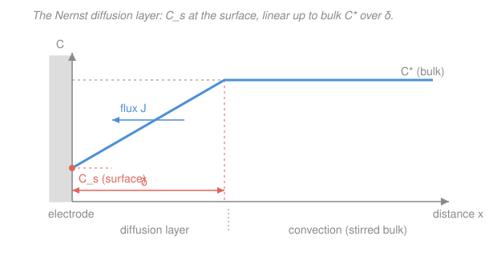

# Electrochemistry · Lesson 3.1: Three modes of transport & the diffusion layer

> ⏱ ~15 min · Module 3: Mass transport & voltammetry · Builds on: [2.4 Overpotential & Tafel analysis](02-04-overpotential-tafel-analysis.md) · Unlocks: 3.2 (diffusion-limited current & concentration overpotential)

## Why this matters

In Module 2 you learned that an electrode reaction can be *slow* — the activation barrier limits how fast electrons cross the interface, and you pay an activation overpotential ([2.4](02-04-overpotential-tafel-analysis.md)) to speed it up. But now imagine you've made electron transfer arbitrarily fast: infinite exchange current, no barrier. The current still can't run away to infinity, because the reaction can only consume what actually *reaches* the surface. Every ampere is a certain number of moles of reactant delivered per second, and delivery has its own speed limit. This is **mass transport**, and it governs everything downstream: the limiting current of a sensor, the shape of a cyclic voltammogram, why you stir a solution, and how fast a battery can discharge. Get transport straight and the rest of Module 3 is bookkeeping.

## The idea

A reactant molecule in solution has to physically travel from the bulk to the electrode surface before it can react. There are exactly **three ways** it can move:

1. **Diffusion** — random thermal wandering that, on average, carries molecules *down* a concentration gradient: from crowded regions to empty ones. When the electrode eats reactant near the surface, it leaves a "hole" in the concentration, and diffusion flows in to fill it.
2. **Migration** — if the molecule is *charged*, the electric field in solution pushes it (cations toward the cathode, anions toward the anode). This is real current-carrying motion, but it's a nuisance: it's tangled up with the field, which changes as the cell operates, so it's hard to control or predict.
3. **Convection** — the whole fluid moves, dragging molecules with it: stirring, pumping, a rotating electrode, or even density-driven currents. It's fast and long-range but doesn't reach the last thin sliver right at the surface, where the fluid is essentially stuck.

The experimentalist's trick is to **kill migration of the reactant of interest**. You dump in a large excess of an inert salt — a **supporting electrolyte** — that doesn't react at the electrode but carries essentially all the ionic current. With so many spectator ions shouldering the current, the electric field in the bulk collapses to nearly zero, and your analyte no longer feels a meaningful push. Now it moves by diffusion and (controlled) convection only — the two modes you *can* model cleanly.

In a **quiescent** (unstirred) solution, convection is absent near the surface, so the reactant arrives only by diffusion through a thin skin next to the electrode. Inside that skin — the **Nernst diffusion layer** of thickness $\delta$ — the concentration climbs from a depleted surface value $C_s$ up to the bulk value $C^*$. We idealize that climb as a straight line. Outside $\delta$, convection keeps everything mixed at $C^*$. The steepness of that line — how fast concentration rises over the distance $\delta$ — is exactly the gradient that Fick's law turns into a flux, and hence a current.

## The formal version

**The three fluxes.** The total flux $J$ (mol per m$^2$ per s) of a species is the sum of the three modes (one-dimensional form, motion along $x$ away from the electrode):

$$J = \underbrace{-D\frac{dC}{dx}}_{\text{diffusion}} \;\underbrace{-\;\frac{z F}{RT}\,D\,C\,\frac{d\phi}{dx}}_{\text{migration}} \;+\; \underbrace{C\,v}_{\text{convection}}.$$

*In words: stuff moves because concentration is uneven (diffusion), because a field pushes charge (migration), or because the fluid itself flows (convection).* Here $D$ is the diffusion coefficient (m$^2$/s), $C$ the concentration (mol/m$^3$), $z$ the species charge number, $F=96485\ \mathrm{C/mol}$ the Faraday constant, $R=8.314\ \mathrm{J\,mol^{-1}K^{-1}}$, $T$ the temperature (K), $\phi$ the electric potential in solution (V), and $v$ the local fluid velocity (m/s). Excess supporting electrolyte drives $d\phi/dx \to 0$ at the analyte, deleting the migration term; a quiescent cell sets $v=0$ near the surface. What survives is pure diffusion.

**Fick's first law.** With migration and convection gone, the analyte flux is

$$J = -D\,\frac{dC}{dx}.$$

*In words: the diffusive flux is proportional to the steepness of the concentration profile, and points from high concentration to low* (the minus sign). This is the diffusion analogue of every "flow $\propto$ gradient" law you've met — Fourier's law for heat, Ohm's law for charge.

**The Nernst diffusion layer.** Model the profile inside the layer as linear from $C_s$ at the surface ($x=0$) to $C^*$ at the layer edge ($x=\delta$):

$$\frac{dC}{dx} \approx \frac{C^* - C_s}{\delta}\quad\Longrightarrow\quad J = -D\,\frac{C^* - C_s}{\delta}.$$

*In words: replace the true curved profile with a straight ramp of thickness $\delta$; the gradient is just rise-over-run, $(C^*-C_s)/\delta$.* The reactant flux *toward* the electrode has magnitude $D(C^*-C_s)/\delta$ — larger when the bulk is richer, the depletion deeper, or the layer thinner.

**Flux becomes current.** Each mole reacting transfers $n$ electrons, so the current density $j$ (A/m$^2$) is $n F$ times the reactant's arrival flux:

$$|j| = nF\,D\,\frac{C^* - C_s}{\delta}.$$

*In words: current is just the arrival rate of reactant, converted to charge.* Two limits are worth naming now. When the surface is barely disturbed, $C_s \approx C^*$ and the transport current is small. When electron transfer is so fast that every arriving molecule reacts instantly, $C_s \to 0$ — the surface is starved — and the current hits its ceiling, the **limiting current** $j_L = nFDC^*/\delta$. That ceiling is the entire subject of [3.2](03-02-diffusion-limited-current-concentration-overpotential.md).

## Picture

## Worked examples

**Example 1 (mechanical — read the gradient, get the current).** A one-electron reduction ($n=1$) runs at a flat electrode in a solution with bulk analyte $C^* = 1.0\ \mathrm{mol/m^3}$ (that's $1.0\ \mathrm{mM}$) and $D = 1.0\times10^{-9}\ \mathrm{m^2/s}$. The electrode holds the surface concentration at $C_s = 0.4\ \mathrm{mol/m^3}$, and the diffusion layer is $\delta = 30\ \mu\mathrm{m} = 3.0\times10^{-5}\ \mathrm{m}$. Then

$$|j| = nF D\,\frac{C^* - C_s}{\delta} = (1)(96485)(1.0\times10^{-9})\,\frac{1.0-0.4}{3.0\times10^{-5}}.$$

The gradient is $(0.6)/(3.0\times10^{-5}) = 2.0\times10^{4}\ \mathrm{mol\,m^{-4}}$, so $|j| = 96485\times10^{-9}\times2.0\times10^{4} \approx 1.93\ \mathrm{A/m^2} = 0.19\ \mathrm{mA/cm^2}$. Drive the surface all the way to starvation ($C_s\to0$) and the gradient rises to $1.0/(3.0\times10^{-5}) = 3.33\times10^4$, giving the limiting current $j_L \approx 3.2\ \mathrm{A/m^2}$ — the most this layer can ever deliver.

**Example 2 (why you'd care — stirring buys you current).** Same solution, but now compare quiescent versus stirred. Quiescently the layer might grow to $\delta = 300\ \mu\mathrm{m}$; a brisk stir thins it to $\delta = 20\ \mu\mathrm{m}$. Since $j_L = nFDC^*/\delta \propto 1/\delta$, thinning the layer by a factor of $15$ multiplies the limiting current by $15$. This is the whole reason analytical electrochemists use rotating-disk electrodes and stirred cells: convection can't touch the last micrometers next to the surface, but it *sets how thick* that diffusion-only skin is, and a thinner skin means a steeper gradient means more current. Same chemistry, same potential — fifteen times the throughput, purely from transport.

## Watch out

- **You might think supporting electrolyte speeds the reaction up.** It doesn't touch the kinetics at all. Its job is to *carry the current* so the analyte stops migrating — it makes transport clean and analyzable (pure diffusion), not faster. If anything it removes a transport mode.
- **You might think migration always helps deliver reactant.** Only if the reactant happens to be a counter-ion drawn toward the electrode; a reactant repelled by the electrode's charge would migrate *away*. Because the sign and size depend on the uncontrolled field, migration of the analyte is a bug, not a feature — which is exactly why you suppress it.
- **The Nernst layer is a fiction — a useful one.** The real profile is curved and, in a truly still solution, never stops growing. The linear-ramp-of-thickness-$\delta$ picture is a model that packages all the messy hydrodynamics into a single number $\delta$. Treat $\delta$ as "the effective distance diffusion has to bridge," not a physical wall.
- **You might think a quiescent solution reaches a nice steady $\delta$.** It doesn't. With no convection to pin it, the depleted zone keeps spreading outward, $\delta$ grows with time (roughly as $\sqrt{Dt}$), and the current *decays* — the [Cottrell](03-04-chronoamperometry-cottrell.md) behavior of 3.4. Only convection gives a stable, time-independent $\delta$.

## One-liner

> Current is reactant delivery in disguise: kill migration with supporting electrolyte, and the current is set by how steeply concentration ramps from $C_s$ up to $C^*$ across the diffusion layer, $j = nFD(C^*-C_s)/\delta$.

## Problems

**P1 (🟢)** Name the three modes of mass transport. State which one a supporting electrolyte suppresses for the analyte, and explain in one sentence *why* adding an inert salt does that.

**P2 (🟡)** A species with $D = 7.0\times10^{-10}\ \mathrm{m^2/s}$ and bulk concentration $C^* = 2.0\ \mathrm{mol/m^3}$ undergoes a two-electron reduction ($n=2$). The Nernst diffusion layer is $\delta = 50\ \mu\mathrm{m}$ and the surface concentration is held at $C_s = 0.5\ \mathrm{mol/m^3}$. Using Fick's first law with the linear profile, write the flux $J$ toward the electrode and the current density $|j|$, and evaluate both numerically with units.

**P3 (🔴)** (a) Explain qualitatively why stirring *raises* the current a diffusion-controlled electrode can pass, in terms of $\delta$. (b) A quiescent cell has $\delta = 40\ \mu\mathrm{m}$ after 1 s; using the rough scaling $\delta \sim \sqrt{\pi D t}$ with $D = 1.0\times10^{-9}\ \mathrm{m^2/s}$, estimate $\delta$ after 100 s and say what happens to the limiting current. (c) In one sentence, connect this to why a quiescent electrode's current *decays with time* while a stirred one holds steady.

Solutions

**P1** The three modes are **diffusion** (motion down a concentration gradient), **migration** (motion of charged species driven by the electric field), and **convection** (motion of the bulk fluid — stirring, flow, density currents). A supporting electrolyte suppresses **migration** of the analyte. Why: the excess inert ions carry essentially all the ionic current, so they screen the electric field in the bulk down to nearly zero; with no appreciable field the charged analyte feels no push and stops migrating, leaving diffusion (and controlled convection) as its only transport.

**P2** Fick's first law with the linear Nernst profile gives the flux magnitude toward the electrode

$$|J| = D\,\frac{C^* - C_s}{\delta} = (7.0\times10^{-10})\,\frac{2.0 - 0.5}{5.0\times10^{-5}}.$$

The gradient is $(1.5)/(5.0\times10^{-5}) = 3.0\times10^{4}\ \mathrm{mol\,m^{-4}}$, so

$$|J| = 7.0\times10^{-10}\times3.0\times10^{4} = 2.1\times10^{-5}\ \mathrm{mol\,m^{-2}\,s^{-1}}.$$

The current density is $nF$ times this:

$$|j| = nF|J| = (2)(96485)(2.1\times10^{-5}) \approx 4.05\ \mathrm{A/m^2} \approx 0.41\ \mathrm{mA/cm^2}.$$

*Check.* Units: $\mathrm{(m^2/s)\cdot(mol\,m^{-3})/m = mol\,m^{-2}s^{-1}}$ ✓ for $J$; $\mathrm{(C/mol)\cdot(mol\,m^{-2}s^{-1}) = C\,m^{-2}s^{-1} = A/m^2}$ ✓ for $j$.

**P3** (a) The current is set by the diffusive gradient $(C^*-C_s)/\delta$: convection can't penetrate the last sliver of stagnant fluid at the surface, but it *sets how thick* that stagnant diffusion layer is. Stirring sweeps depleted solution away and drags fresh bulk closer, thinning $\delta$. A thinner $\delta$ means a steeper gradient over a shorter distance, hence a larger flux and a larger current — and since $j_L = nFDC^*/\delta \propto 1/\delta$, halving $\delta$ doubles the ceiling.

(b) With $\delta \sim \sqrt{\pi D t}$, the ratio over $1\to100$ s is $\sqrt{100/1} = 10$, so

$$\delta(100\ \mathrm{s}) \approx 10\times40\ \mu\mathrm{m} = 400\ \mu\mathrm{m}.$$

(Sanity: $\sqrt{\pi(1.0\times10^{-9})(100)} = \sqrt{3.14\times10^{-7}} \approx 5.6\times10^{-4}\ \mathrm{m} = 560\ \mu\mathrm{m}$, same order.) Since $j_L \propto 1/\delta$, a $10\times$ thicker layer means the limiting current falls by roughly $10\times$.

(c) In a quiescent cell nothing stops the depleted zone from spreading, so $\delta$ grows without bound ($\sim\sqrt{t}$) and the current keeps decaying (the Cottrell law of [3.4](03-04-chronoamperometry-cottrell.md)); convection pins $\delta$ at a fixed value, giving a stable steady-state current.

## Flashback

**From Lesson 2.4 (Overpotential & Tafel analysis):** An electrode reaction has exchange current density $j_0 = 1.0\times10^{-3}\ \mathrm{A/cm^2}$ and a cathodic transfer coefficient $\alpha_c = 0.5$ at $T = 298\ \mathrm{K}$. In the high-overpotential (Tafel) regime, estimate the cathodic overpotential $\eta$ needed to reach a current density of $|j| = 1.0\times10^{-1}\ \mathrm{A/cm^2}$. (Use $2.303RT/F = 0.0592\ \mathrm{V}$.)

Solution

In the cathodic Tafel regime the current magnitude follows $|j| = j_0\,e^{-\alpha_c F\eta/RT}$ (with $\eta<0$). Taking base-10 logs gives the Tafel form

$$\log_{10}\frac{|j|}{j_0} = \frac{-\alpha_c F\,\eta}{2.303\,RT} \quad\Longrightarrow\quad |\eta| = \frac{2.303\,RT}{\alpha_c F}\,\log_{10}\frac{|j|}{j_0}.$$

The Tafel slope is $b = \dfrac{2.303RT}{\alpha_c F} = \dfrac{0.0592}{0.5} = 0.1184\ \mathrm{V/decade}$. The current is $|j|/j_0 = 10^{-1}/10^{-3} = 100$, i.e. two decades, so

$$|\eta| = b\,\log_{10}(100) = 0.1184\times 2 = 0.237\ \mathrm{V} \approx 237\ \mathrm{mV}.$$

Since it's a cathodic (reduction) overpotential, $\eta \approx -0.24\ \mathrm{V}$.

*Check.* Two decades of current at a $\sim$118 mV/decade slope should cost about $2\times118 = 236$ mV ✓. Note the whole Tafel picture assumes electron transfer is rate-limiting — this lesson is about what happens once *transport* takes over instead.

## Connections

- **Backward:** [2.4](02-04-overpotential-tafel-analysis.md) and Butler–Volmer ([2.3](02-03-butler-volmer-equation.md)) assumed the surface concentration equals the bulk, so current was set purely by the interfacial barrier. This lesson relaxes that: once transport is slow, $C_s \ne C^*$, and delivery — not kinetics — can be the bottleneck. The two views merge under mixed control in [3.3](03-03-mixed-control-kinetics-transport.md).
- **Forward:** the limiting current $j_L = nFDC^*/\delta$ set up here is the star of [3.2](03-02-diffusion-limited-current-concentration-overpotential.md) (and its concentration overpotential); the time-growing $\delta$ in a quiescent cell becomes the Cottrell decay of [3.4](03-04-chronoamperometry-cottrell.md); and the sweep-driven, ever-changing layer produces the peak-shaped voltammograms of [3.5](03-05-linear-sweep-cyclic-voltammetry.md).
- **Sideways:** Fick's first law $J=-D\,dC/dx$ is the exact structural twin of Fourier's law of heat conduction and Ohm's law of charge flow — flow proportional to a gradient. The diffusion coefficient $D$ itself ties back to physical chemistry's transport and Arrhenius temperature dependence ([physical-chemistry 3.4](../../physical-chemistry/lessons/03-04-arrhenius-transition-state-theory.md)), since $D$ rises with temperature much like a rate constant.
