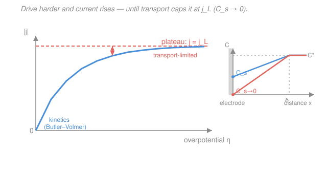

# Electrochemistry · Lesson 3.2: Diffusion-limited current & concentration overpotential

> ⏱ ~15 min · Module 3: Mass transport & voltammetry · Builds on: [3.1 Transport modes & the diffusion layer](03-01-transport-modes-diffusion-layer.md), [2.4 Overpotential & Tafel analysis](02-04-overpotential-tafel-analysis.md) · Unlocks: [3.3 Mixed control](03-03-mixed-control-kinetics-transport.md)

## Why this matters

In [2.3](02-03-butler-volmer-equation.md) the Butler–Volmer equation said current grows *exponentially* with overpotential — push harder, get exponentially more current, forever. That can't be true, and your intuition already knows why: an electrode can only react molecules that actually *reach* it. Past some point the reaction is starving, not slow. This lesson finds the ceiling. Every electrochemical device — a battery under heavy load, a fuel cell at high power, a glucose sensor reading concentration — lives against this **limiting current**, and its most useful property is that the ceiling is *proportional to bulk concentration*. That single fact is the basis of quantitative electroanalysis: measure the plateau current, read off the concentration.

## The idea

Picture the electrode as a checkout counter and the reacting ions as shoppers. Butler–Volmer kinetics is how fast the cashier scans items. Crank the overpotential and the cashier gets superhumanly fast — but now the line can't feed items quickly enough, and throughput is set entirely by how fast shoppers walk up, not by scanning speed.

The "walking up" is diffusion across the **Nernst diffusion layer** from [3.1](03-01-transport-modes-diffusion-layer.md): a stagnant film of thickness $\delta$ next to the electrode, across which concentration falls from its bulk value $C^*$ to the surface value $C_s$. Fick's law says the delivery rate is proportional to the *steepness* of that fall, $(C^* - C_s)/\delta$. When kinetics is slow, the surface is nearly as crowded as the bulk ($C_s \approx C^*$), the slope is gentle, delivery is easy — kinetics is the bottleneck. As you drive harder, the cashier consumes ions the instant they arrive, $C_s$ drops, the slope steepens, and delivery ramps up. The steepest possible slope happens when $C_s = 0$ — every arriving molecule is devoured instantly. You cannot make the slope any steeper than "all the way to zero," so the current can't rise any further. **That maximum is the limiting current.** The whole story is: the surface concentration is the throttle, and it bottoms out at zero.

## The formal version

**Current is proportional to diffusive flux.** From [3.1](03-01-transport-modes-diffusion-layer.md), the flux of reactant delivered across the Nernst layer (Fick's first law, linearized over $\delta$) is

$$J = D\,\frac{C^* - C_s}{\delta} \qquad \left[\mathrm{mol\,cm^{-2}\,s^{-1}}\right],$$

where $D$ is the diffusion coefficient ($\mathrm{cm^2/s}$), $C^*$ the bulk concentration and $C_s$ the surface concentration ($\mathrm{mol/cm^3}$), and $\delta$ the diffusion-layer thickness (cm). Each reacting molecule carries $n$ electrons, so the current density is $j = nFJ$ with $F = 96485\ \mathrm{C/mol}$:

$$j = \frac{nFD\,(C^* - C_s)}{\delta}.$$

*In words: current is just the delivery rate of reactant, converted to charge — steeper concentration drop, more current.*

**The limiting current density.** Drive the reaction until it consumes reactant the instant it arrives: $C_s \to 0$. The slope is now maximal and current saturates at

$$\boxed{\,j_L = \frac{nFD\,C^*}{\delta}\,}$$

*In words: the most current you can ever pull is set by how fast diffusion alone can feed the surface.* Read the three levers: $j_L \propto C^*$ (more bulk reactant → higher ceiling — **the analytical workhorse**), $j_L \propto D$ (faster-diffusing ions), and $j_L \propto 1/\delta$ (thinner stagnant film — stir harder or spin the electrode to shrink $\delta$ and raise the ceiling).

**Current vs. surface concentration.** Divide the general $j$ by $j_L$ and the constants cancel:

$$j = j_L\left(1 - \frac{C_s}{C^*}\right).$$

*In words: the current is the fraction of the ceiling you've reached, and it equals the fractional depletion of the surface.* At rest $C_s = C^*$ gives $j = 0$; full depletion $C_s = 0$ gives $j = j_L$. Everything happens in between.

**Concentration (mass-transport) overpotential.** Here is the subtle part. Even if the electron-transfer kinetics were *infinitely* fast, depleting the surface still costs you voltage — because the electrode's equilibrium potential is set by the concentration *it actually sees*, via the Nernst equation from [1.5](01-05-nernst-equation-concentration-cells.md). A surface at $C_s$ instead of $C^*$ sits at a shifted potential

$$\eta_\text{conc} = \frac{RT}{nF}\ln\frac{C_s}{C^*},$$

with $R = 8.314\ \mathrm{J\,mol^{-1}K^{-1}}$, $T$ in kelvin, and $RT/F = 0.0257\ \mathrm{V}$ at 298 K. Substitute $C_s/C^* = 1 - j/j_L$ from the relation above:

$$\boxed{\,\eta_\text{conc} = \frac{RT}{nF}\ln\!\left(1 - \frac{j}{j_L}\right)\,}$$

*In words: this is the voltage penalty you pay purely for starving the surface — no kinetics in it, only transport.* It is small at low current ($j \ll j_L$) and **diverges to $-\infty$ as $j \to j_L$**: the logarithm's argument goes to zero, so no finite voltage can push you past the ceiling. This is why real polarization curves bend over and flatten — the wall near $j_L$ is a *transport* wall, not a kinetic one.

**Who's in charge — kinetics or transport?** Two limits bracket every electrode:

- **Small overpotential → kinetics limits.** The surface is barely depleted ($C_s \approx C^*$), $\eta_\text{conc} \approx 0$, and Butler–Volmer/Tafel from [2.3](02-03-butler-volmer-equation.md)–[2.4](02-04-overpotential-tafel-analysis.md) sets the current.
- **Large overpotential → transport limits.** The surface is exhausted ($C_s \to 0$), current is pinned at $j_L$ regardless of how much more voltage you apply, and the entire extra overpotential is $\eta_\text{conc}$.

The handover between them is the **mixed regime** — the subject of [3.3](03-03-mixed-control-kinetics-transport.md).

## Picture

The blue curve is the polarization response: it climbs steeply where kinetics rules, then bends over and flattens against the coral $j_L$ plateau. The inset shows why — as you climb, the surface concentration $C_s$ (left edge of the profile) slides down toward zero, steepening the gradient across $\delta$ until it can't steepen further. The coral gap between the flattening curve and where unchecked kinetics would keep rising *is* the concentration overpotential.

## Worked examples

**Example 1 (find the ceiling, then use it as an assay).** A species with $D = 1.0\times10^{-5}\ \mathrm{cm^2/s}$ at bulk concentration $C^* = 1\ \mathrm{mM} = 1\times10^{-6}\ \mathrm{mol/cm^3}$ reduces with $n = 1$ across a diffusion layer $\delta = 0.01\ \mathrm{cm}$ (100 µm). Then

$$j_L = \frac{nFDC^*}{\delta} = \frac{(1)(96485)(1.0\times10^{-5})(1\times10^{-6})}{0.01} = 9.6\times10^{-5}\ \mathrm{A/cm^2} \approx 96\ \mathrm{\mu A/cm^2}.$$

Now the payoff: because $j_L \propto C^*$ with *everything else fixed*, an unknown sample of the same species measured on the same electrode that plateaus at $290\ \mathrm{\mu A/cm^2}$ must be at $C^* = 1\ \mathrm{mM}\times(290/96) \approx 3\ \mathrm{mM}$. You calibrated once and read concentration straight off the plateau height — no chemistry, just proportion. (Watch the unit trap: $1\ \mathrm{mM} = 10^{-3}\ \mathrm{mol/L} = 10^{-6}\ \mathrm{mol/cm^3}$, because $1\ \mathrm{L} = 1000\ \mathrm{cm^3}$.)

**Example 2 (the voltage cost of the last stretch).** For that same electrode, how much concentration overpotential does it take to run at 90% of the ceiling, and at 99%? With $RT/nF = 0.0257\ \mathrm{V}$ and $n=1$:

$$\eta_\text{conc}(0.9) = 0.0257\,\ln(1 - 0.90) = 0.0257\,\ln(0.10) = 0.0257\times(-2.303) = -59\ \mathrm{mV},$$
$$\eta_\text{conc}(0.99) = 0.0257\,\ln(0.01) = 0.0257\times(-4.605) = -118\ \mathrm{mV}.$$

Squeezing from 90% to 99% of the ceiling costs another 59 mV — and reaching 99.9% costs 59 mV *more* on top. Each factor-of-ten closer to $j_L$ is a fixed voltage toll (that constant $\approx 59\ \mathrm{mV}$ per decade at $n=1$, $298\ \mathrm{K}$, is the same $2.303\,RT/F$ that set the Tafel slope in [2.4](02-04-overpotential-tafel-analysis.md)). You asymptote toward the wall but never touch it.

## Watch out

- **You might think the plateau means "the reaction stopped" or "kinetics got slow."** Opposite — on the plateau the kinetics is *effortless*; every arriving molecule reacts instantly. The current is capped because *supply* ran out, not demand. The flat region is the electrode running as fast as diffusion will feed it.
- **You might think $\eta_\text{conc}$ is a kinetic loss.** It is a pure *thermodynamic/transport* loss: it appears in the formula with no $j_0$, no $\alpha$, nothing from Butler–Volmer. It exists even for an ideal, infinitely-fast electrode, because a depleted surface simply sits at a different Nernst potential.
- **You might treat $j_L$ as a fixed property of the species.** It isn't — it rides on $\delta$, which *you* control. Stirring, flowing, or spinning the electrode thins $\delta$ and raises $j_L$; a quiet, unstirred cell has a fat $\delta$ and a low ceiling. Same ions, different ceiling.

## One-liner

> Transport, not kinetics, sets the current ceiling: as you drive harder the surface empties ($C_s\to0$) and current saturates at $j_L = nFDC^*/\delta$, while the voltage penalty $\eta_\text{conc} = \frac{RT}{nF}\ln(1 - j/j_L)$ blows up at the wall.

## Problems

**P1 (🟢)** A one-electron reactant ($n=1$) has $D = 6.0\times10^{-6}\ \mathrm{cm^2/s}$ and bulk concentration $C^* = 5\ \mathrm{mM}$, in an unstirred cell with diffusion-layer thickness $\delta = 0.05\ \mathrm{cm}$. Compute the limiting current density $j_L$. Then state what $j_L$ becomes if the concentration is halved to $2.5\ \mathrm{mM}$, and why this proportionality makes $j_L$ useful analytically.

**P2 (🟡)** For a cell with $n = 2$ at $T = 298\ \mathrm{K}$, compute the concentration overpotential $\eta_\text{conc}$ when the electrode runs at $j = 0.95\,j_L$. Then compute it at $j = 0.995\,j_L$ and confirm the penalty grows without bound as $j \to j_L$. (Use $RT/F = 0.0257\ \mathrm{V}$.)

**P3 (🔴)** An electrode has exchange current density $j_0 = 1.0\ \mathrm{\mu A/cm^2}$, cathodic transfer coefficient $\alpha_c = 0.5$, $n = 1$, and a limiting current density $j_L = 100\ \mathrm{\mu A/cm^2}$, at $298\ \mathrm{K}$. It is run at cathodic overpotential $|\eta| = 0.15\ \mathrm{V}$. Decide whether the electrode is **kinetics-controlled or transport-controlled** at this overpotential. Then find the crossover overpotential where control hands over, and explain the crossover physically. (Cathodic Tafel current: $|j_\text{kin}| = j_0\,e^{\,\alpha_c F|\eta|/RT}$.)

Solutions

**P1** Convert the concentration: $C^* = 5\ \mathrm{mM} = 5\times10^{-6}\ \mathrm{mol/cm^3}$. Then

$$j_L = \frac{nFDC^*}{\delta} = \frac{(1)(96485)(6.0\times10^{-6})(5\times10^{-6})}{0.05} = \frac{2.895\times10^{-6}}{0.05} \approx 5.8\times10^{-5}\ \mathrm{A/cm^2} = 58\ \mathrm{\mu A/cm^2}.$$

Halving $C^*$ to $2.5\ \mathrm{mM}$ **halves** $j_L$ to $\approx 29\ \mathrm{\mu A/cm^2}$, since $j_L \propto C^*$ with $n, F, D, \delta$ all unchanged. That strict linearity is the whole basis of amperometric analysis: on a fixed electrode the plateau height reports concentration directly, so a single calibration converts a measured $j_L$ into an unknown $C^*$.

*Check.* Units: $\mathrm{(C/mol)(cm^2/s)(mol/cm^3)/cm} = \mathrm{C\,cm^{-2}\,s^{-1}} = \mathrm{A/cm^2}$ ✓.

**P2** Use $\eta_\text{conc} = \frac{RT}{nF}\ln(1 - j/j_L)$ with $n=2$, so $RT/nF = 0.0257/2 = 0.01285\ \mathrm{V}$.

At $j = 0.95\,j_L$: $\ \eta_\text{conc} = 0.01285\,\ln(1-0.95) = 0.01285\,\ln(0.05) = 0.01285\times(-2.996) = -38.5\ \mathrm{mV}.$

At $j = 0.995\,j_L$: $\ \eta_\text{conc} = 0.01285\,\ln(0.005) = 0.01285\times(-5.298) = -68.1\ \mathrm{mV}.$

As $j \to j_L$ the argument $1 - j/j_L \to 0^+$, so $\ln(1-j/j_L) \to -\infty$ and $|\eta_\text{conc}| \to \infty$: no finite overpotential reaches the ceiling. (Note the penalties here are *half* the $n=1$ values from Example 2 at the same fraction — the $n$ in the denominator softens the toll.)

*Check.* Monotonic and growing: closer to $j_L$ (0.95 → 0.995) gives a larger magnitude (38.5 → 68.1 mV) ✓, and the sign is negative for a cathodic (reduction) process ✓.

**P3** First ask what the *kinetics alone* would demand at $|\eta| = 0.15\ \mathrm{V}$. With $\alpha_c = 0.5$ and $RT/F = 0.0257\ \mathrm{V}$, the relevant slope factor is $RT/(\alpha_c F) = 0.0257/0.5 = 0.0514\ \mathrm{V}$:

$$|j_\text{kin}| = j_0\,e^{\,|\eta|/0.0514} = (1.0\ \mathrm{\mu A/cm^2})\,e^{\,0.15/0.0514} = 1.0\times e^{2.92} = 1.0\times 18.5 = 18.5\ \mathrm{\mu A/cm^2}.$$

Kinetics *wants* only $18.5\ \mathrm{\mu A/cm^2}$, which is below the transport ceiling $j_L = 100\ \mathrm{\mu A/cm^2}$. Since transport can easily supply what kinetics asks for, the electrode is **kinetics-controlled** at this overpotential — the current sits on the Butler–Volmer curve, and $\eta_\text{conc}$ is negligible.

Control hands over when the kinetic demand catches up to the transport ceiling, $|j_\text{kin}| = j_L$:

$$|\eta_\text{cross}| = \frac{RT}{\alpha_c F}\ln\frac{j_L}{j_0} = 0.0514\,\ln\!\frac{100}{1.0} = 0.0514\times 4.605 \approx 237\ \mathrm{mV}.$$

Below $\approx 237\ \mathrm{mV}$ kinetics is the bottleneck (slow cashier, full shelves); above it transport takes over (instant cashier, empty shelves) and the current locks at $100\ \mathrm{\mu A/cm^2}$. Our $150\ \mathrm{mV}$ sits comfortably on the kinetic side. Right around $237\ \mathrm{mV}$ the two limits are comparable and *both* matter at once — the **mixed regime** of [3.3](03-03-mixed-control-kinetics-transport.md).

*Check.* Sanity: $j_\text{kin}$ rises exponentially while $j_L$ is flat, so they must cross exactly once, and increasing $|\eta|$ can only move you from kinetic toward transport control — consistent with $150\ \mathrm{mV} < 237\ \mathrm{mV}$ landing on the kinetic side ✓.

## Flashback

**From Lesson 3.1 (Transport modes & the diffusion layer):** A reactant with $D = 1.0\times10^{-5}\ \mathrm{cm^2/s}$ diffuses across a Nernst layer of thickness $\delta = 0.02\ \mathrm{cm}$. The bulk concentration is $C^* = 2\ \mathrm{mM}$ and the electrode is being driven hard enough that the surface concentration has fallen to $C_s = 0.5\ \mathrm{mM}$. Using Fick's first law over the layer, find the diffusive flux $J$ and the resulting current density ($n = 1$). What fraction of the limiting current is this?

Solution

Convert: $C^* = 2\times10^{-6}\ \mathrm{mol/cm^3}$, $C_s = 0.5\times10^{-6}\ \mathrm{mol/cm^3}$. Fick's law across the linear Nernst-layer profile from [3.1](03-01-transport-modes-diffusion-layer.md):

$$J = D\,\frac{C^* - C_s}{\delta} = (1.0\times10^{-5})\,\frac{(2 - 0.5)\times10^{-6}}{0.02} = (1.0\times10^{-5})\,(7.5\times10^{-5}) = 7.5\times10^{-10}\ \mathrm{mol\,cm^{-2}s^{-1}}.$$

Current density:

$$j = nFJ = (1)(96485)(7.5\times10^{-10}) \approx 7.2\times10^{-5}\ \mathrm{A/cm^2} = 72\ \mathrm{\mu A/cm^2}.$$

Fraction of the limiting current: the ceiling here is $j_L = nFDC^*/\delta = (96485)(1.0\times10^{-5})(2\times10^{-6})/0.02 \approx 96\ \mathrm{\mu A/cm^2}$, so $j/j_L = 72/96 = 0.75$. Equivalently, straight from this lesson's relation, $j/j_L = 1 - C_s/C^* = 1 - 0.5/2 = 0.75$ ✓ — the two routes agree.

*Check.* $C_s$ sits between 0 and $C^*$, so $j$ must sit between 0 and $j_L$, and $72\ \mathrm{\mu A/cm^2}$ does ✓.

## Connections

- **Backward:** this is [3.1](03-01-transport-modes-diffusion-layer.md)'s Fick-flux-across-$\delta$ result promoted to a current, then pushed to its $C_s \to 0$ extreme. The concentration overpotential is the [1.5](01-05-nernst-equation-concentration-cells.md) Nernst equation applied to the *surface* concentration the electrode actually sees — and that concentration-to-potential link is the same activity-of-what-the-interface-sees idea as chemical potential in [physical chemistry](../../physical-chemistry/lessons/01-05-chemical-potential.md).
- **Forward:** [3.3 Mixed control](03-03-mixed-control-kinetics-transport.md) stitches the two limits together — Butler–Volmer kinetics ([2.3](02-03-butler-volmer-equation.md)) and this $j_L$ ceiling acting as resistances in series — to give the full polarization curve across the crossover found in P3. The $C_s \to 0$ transient version drives the Cottrell equation in [3.4](03-04-chronoamperometry-cottrell.md).
- **Sideways:** the $\approx 59\ \mathrm{mV}$-per-decade toll near $j_L$ is the same $2.303\,RT/F$ constant that set the Tafel slope in [2.4](02-04-overpotential-tafel-analysis.md) — one appears in $\log(1-j/j_L)$ (transport), the other in $\log(j/j_0)$ (kinetics), and [3.3](03-03-mixed-control-kinetics-transport.md) shows both bending the same curve.
