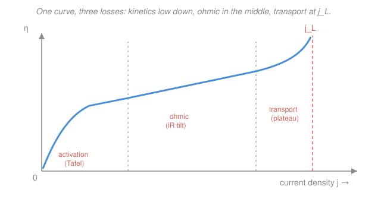

# Electrochemistry · Lesson 3.3: Mixed control — kinetics + transport together

> ⏱ ~15 min · Module 3: Mass transport & voltammetry · Builds on: [2.3 Butler–Volmer](02-03-butler-volmer-equation.md), [2.4 Overpotential & Tafel analysis](02-04-overpotential-tafel-analysis.md), [3.2 Diffusion-limited current & concentration overpotential](03-02-diffusion-limited-current-concentration-overpotential.md) · Unlocks: [3.4 Chronoamperometry & the Cottrell equation](03-04-chronoamperometry-cottrell.md)

## Why this matters

So far you have met two separate reasons an electrode runs slower than thermodynamics allows. Kinetics: pushing electrons across the interface costs an **activation overpotential** ([2.3](02-03-butler-volmer-equation.md), [2.4](02-04-overpotential-tafel-analysis.md)). Transport: the reactant can only diffuse to the surface so fast, capping the current at $j_L$ ([3.2](03-02-diffusion-limited-current-concentration-overpotential.md)). Real electrodes suffer **both at once**, plus a third tax — ohmic $iR$ drop through the electrolyte. This lesson stitches them into one **polarization curve**: the single plot that tells you, at any current, where your voltage is going. Every battery, fuel cell, electrolyzer, and corrosion cell in Module 4 is read off this one picture.

## The idea

Think of driving current through a cell as pushing water through a chain of obstacles **in series**: a narrow valve (electron-transfer kinetics), a length of pipe (electrolyte resistance), and a filter that clogs as flow rises (diffusion). Because they are in series, the losses **add**, and — like two resistors in series — the *slowest* stage sets the pace. At a gentle trickle the valve is the bottleneck; open it wider and the clogging filter takes over.

That is exactly how a real electrode behaves as you demand more current:

- **Low current** — plenty of reactant at the surface, so transport is easy; the only real cost is prying electrons across the interface. This is the **activation-controlled** (Tafel) region: overpotential rises like $\log j$, gently.
- **High current** — you are pulling reactant to the surface as fast as diffusion can deliver it. The current bends over toward the **mass-transport limiting** plateau $j_L$; overpotential runs away as $j$ approaches $j_L$.
- **Throughout** — every amp you push also drops voltage ohmically across the electrolyte, adding a straight-line **tilt** on top of both.

The master statement: the total overpotential at a given current is just the sum of three additive pieces,
$$\eta_\text{total} = \eta_\text{act} + \eta_\text{conc} + \eta_\text{ohmic}.$$
Reading a polarization curve is the art of deciding which of the three is eating your voltage.

## The formal version

**The three losses.** At current density $j$ (amps per unit area), the overpotential — the voltage you spend beyond the equilibrium potential $E_\text{eq}$ — decomposes as

$$\boxed{\,\eta_\text{total} = \underbrace{\eta_\text{act}}_{\text{kinetics}} + \underbrace{\eta_\text{conc}}_{\text{transport}} + \underbrace{\eta_\text{ohmic}}_{iR}\,}$$

*In words: the price of running the reaction at rate $j$ is kinetics plus transport plus wiring resistance, and they simply add.* Each term has a formula you already own:

- **Activation** (from [2.4](02-04-overpotential-tafel-analysis.md), Tafel): $\eta_\text{act} = b\,\log_{10}\!\dfrac{j}{j_0}$, with Tafel slope $b = \dfrac{2.303\,RT}{\alpha F}$ and exchange current density $j_0$. *In words: kinetics charges you a fixed voltage for every tenfold increase in current.*
- **Concentration** (from [3.2](03-02-diffusion-limited-current-concentration-overpotential.md)): $\eta_\text{conc} = -\dfrac{RT}{nF}\ln\!\left(1 - \dfrac{j}{j_L}\right)$, with $j_L = \dfrac{nFDC^*}{\delta}$. *In words: as $j\to j_L$ the surface starves of reactant and this term blows up.* Here $n$ is electrons per reaction, $F=96485\ \mathrm{C/mol}$, $D$ the diffusion coefficient, $C^*$ the bulk concentration, $\delta$ the diffusion-layer thickness.
- **Ohmic**: $\eta_\text{ohmic} = iR = jR_\Omega$, where $R$ is the (uncompensated) electrolyte resistance and $R_\Omega$ its area-specific value ($\mathrm{\Omega\,cm^2}$). *In words: plain resistor drop — linear in current, no exponentials.*

**Mixed control as reciprocal addition.** Split the physics into what kinetics *alone* would deliver — the **kinetic current** $j_k$ (the Butler–Volmer/Tafel current at that potential, ignoring depletion) — and what transport *alone* would allow, $j_L$. Because reactant must first diffuse in (rate $\propto j_L$) and *then* react (rate $\propto j_k$), the two conductances add in series like resistors:

$$\boxed{\,\frac{1}{j} = \frac{1}{j_k} + \frac{1}{j_L}\,}$$

*In words: the reciprocal currents add, so the measured current $j$ is always below the smaller of $j_k$ and $j_L$ — the slower step is the bottleneck.* This is the Koutecký–Levich-flavored result. Two limits check it:

- $j_k \ll j_L$ (sluggish kinetics, easy transport): $1/j \approx 1/j_k$, so $j \approx j_k$ — **activation-controlled**.
- $j_k \gg j_L$ (fast kinetics, slow transport): $1/j \approx 1/j_L$, so $j \approx j_L$ — **transport-limited** plateau.

**The polarization curve.** Plot $\eta$ (or electrode potential $E$) against $j$ (or against $\log j$). It has three visible zones: a gentle **activation/Tafel rise** at low $j$, a roughly **linear ohmic tilt** through the middle, and a near-**vertical wall at $j_L$** where concentration overpotential diverges. Same curve, read three ways.

## Picture

## Worked examples

**Example 1 (mechanical — reciprocal addition).** An electrode has kinetic current density $j_k = 8\ \mathrm{mA/cm^2}$ at some overpotential, while diffusion caps it at $j_L = 24\ \mathrm{mA/cm^2}$. The measured current is

$$\frac{1}{j} = \frac{1}{8} + \frac{1}{24} = \frac{3}{24} + \frac{1}{24} = \frac{4}{24} = \frac{1}{6} \;\Longrightarrow\; j = 6\ \mathrm{mA/cm^2}.$$

Note $6 < 8 < 24$: the answer sits *below* the smaller input and is dragged toward it. Kinetics (the slower step here) sets the scale; transport shaves off a bit more.

**Example 2 (why you'd care — separating the losses).** You measure a cathode drawing $j = 100\ \mathrm{mA/cm^2} = 0.1\ \mathrm{A/cm^2}$, with $n=1$, Tafel slope $b = 120\ \mathrm{mV/decade}$, $j_0 = 1\ \mathrm{mA/cm^2}$, limiting current $j_L = 200\ \mathrm{mA/cm^2}$, and area-specific electrolyte resistance $R_\Omega = 1\ \mathrm{\Omega\,cm^2}$. Where is the voltage going?

$$\eta_\text{act} = b\log_{10}\frac{j}{j_0} = 0.120\log_{10}\frac{100}{1} = 0.120\times 2 = 0.240\ \mathrm{V},$$
$$\eta_\text{conc} = -\frac{RT}{nF}\ln\!\left(1-\frac{j}{j_L}\right) = -0.0257\ln\!\left(1-\tfrac{1}{2}\right) = -0.0257\times(-0.693) = 0.018\ \mathrm{V},$$
$$\eta_\text{ohmic} = jR_\Omega = 0.1\times 1 = 0.100\ \mathrm{V}.$$

Total: $\eta_\text{total} = 0.240 + 0.018 + 0.100 = 0.358\ \mathrm{V}$. **Activation dominates** (67% of the loss); ohmic is a solid second; concentration is small because we are only at half the limiting current. Want more current cheaply? A better catalyst (bigger $j_0$) buys the most here — but push toward $j_L$ and the concentration term would explode.

## Watch out

- **You might think the losses compete — that current picks the "worst" path.** No: they are **in series**, so they *add*. Every electron pays all three tolls. The "dominant" loss is just the biggest addend, not the only one.
- **You might read the whole curve as one mechanism.** The same rising curve is Tafel-shaped at low $j$ and transport-walled at high $j$. Fit a Tafel slope only in the straight low-current region *before* the bend — fit it too high and the mass-transport curvature corrupts your $j_0$ and $\alpha$.
- **You might forget to subtract $iR$ before kinetic analysis.** The ohmic tilt is not electrode physics — it is wiring. Experimenters remove it ("$iR$ compensation") so the leftover $\eta_\text{act}+\eta_\text{conc}$ reflects the interface. Skip it and a straight electrolyte resistor masquerades as sluggish kinetics.
- **$j_k$ is not a fixed number.** It is the kinetic current *at the operating potential* and grows exponentially with $\eta$ (Butler–Volmer). $j_L$, by contrast, is set by transport and is roughly potential-independent — which is why the curve eventually flattens.

## One-liner

> Real electrodes lose voltage to kinetics, transport, and $iR$ in series, so $\eta_\text{total}=\eta_\text{act}+\eta_\text{conc}+\eta_\text{ohmic}$ and $1/j = 1/j_k + 1/j_L$ — the slower step always wins.

## Problems

**P1 (🟢)** A measured cathodic polarization curve (overpotential magnitude $\eta$ vs current density $j$) does three things as $j$ rises from zero: (a) at low $j$ it rises gently and plots as a straight line on $\eta$ vs $\log j$; (b) through the middle it rises roughly straight on $\eta$ vs $j$ (linear, not logarithmic); (c) at high $j$ it bends sharply upward and $j$ refuses to climb past a ceiling value. Name the controlling process in each region and state the one quantity that limits it.

**P2 (🟡)** At a fixed overpotential an electrode would pass a kinetic current $j_k = 5\ \mathrm{mA/cm^2}$, but diffusion limits it to $j_L = 20\ \mathrm{mA/cm^2}$. Find the actual current density $j$. Is the electrode activation-controlled or transport-controlled here? Then say what $j$ becomes if you quadruple $j_k$ to $20\ \mathrm{mA/cm^2}$ (transport unchanged) — and interpret.

**P3 (🔴)** A fuel-cell cathode must deliver $j = 400\ \mathrm{mA/cm^2} = 0.4\ \mathrm{A/cm^2}$. Its parameters: $n=1$, Tafel slope $b = 70\ \mathrm{mV/decade}$, $j_0 = 0.10\ \mathrm{mA/cm^2}$, limiting current $j_L = 800\ \mathrm{mA/cm^2}$, area-specific resistance $R_\Omega = 0.20\ \mathrm{\Omega\,cm^2}$. Compute $\eta_\text{act}$, $\eta_\text{conc}$, $\eta_\text{ohmic}$, the total overpotential, and identify the dominant loss. (Use $RT/F = 0.0257\ \mathrm{V}$.)

Solutions

**P1** The three regions map one-to-one onto the three losses.

- **(a) Low $j$, linear on $\eta$ vs $\log j$:** the **activation-controlled** (Tafel) region. A straight $\eta$–$\log j$ line is the signature of Butler–Volmer kinetics ([2.4](02-04-overpotential-tafel-analysis.md)); the limiting quantity is the **electron-transfer kinetics**, quantified by the exchange current density $j_0$ (and Tafel slope $b$). Transport is easy here — the surface is well supplied.
- **(b) Middle, linear on $\eta$ vs $j$:** the **ohmic** region. Linearity *in $j$ itself* (not $\log j$) is Ohm's law $\eta = jR_\Omega$; the limiting quantity is the **electrolyte (uncompensated) resistance** $R_\Omega$.
- **(c) High $j$, sharp bend to a ceiling:** the **mass-transport (concentration) controlled** region. Current cannot exceed the rate reactant diffuses in; the limiting quantity is the **diffusion-limited current** $j_L = nFDC^*/\delta$. As $j\to j_L$, $\eta_\text{conc}$ diverges — the vertical wall.

**P2** Reciprocal addition:
$$\frac{1}{j} = \frac{1}{j_k} + \frac{1}{j_L} = \frac{1}{5} + \frac{1}{20} = \frac{4}{20} + \frac{1}{20} = \frac{5}{20} = \frac14 \;\Longrightarrow\; j = 4\ \mathrm{mA/cm^2}.$$
Since $j_k = 5 \ll j_L = 20$, the small kinetic current is the bottleneck: the electrode is **activation (kinetics) controlled**, and indeed $j = 4$ sits just below $j_k = 5$, nowhere near $j_L$.

Quadruple the kinetics to $j_k = 20\ \mathrm{mA/cm^2}$ (now equal to $j_L$):
$$\frac{1}{j} = \frac{1}{20} + \frac{1}{20} = \frac{2}{20} = \frac{1}{10} \;\Longrightarrow\; j = 10\ \mathrm{mA/cm^2}.$$
A $4\times$ better catalyst only $2.5\times$'d the current (4 → 10), because transport has now become co-limiting. Improving the fast step yields diminishing returns once you approach the slow one — the series bottleneck has shifted toward diffusion. To go further you must raise $j_L$ (stir harder, thin $\delta$, raise $C^*$), not the kinetics.

**P3** Take each loss in turn at $j = 0.4\ \mathrm{A/cm^2}$.

*Activation* (Tafel, $b = 0.070\ \mathrm{V/decade}$, $j_0 = 0.10\ \mathrm{mA/cm^2}$, so $j/j_0 = 400/0.10 = 4000$):
$$\eta_\text{act} = b\log_{10}\frac{j}{j_0} = 0.070\times\log_{10}(4000) = 0.070\times 3.602 = 0.252\ \mathrm{V}.$$

*Concentration* ($j/j_L = 400/800 = 0.5$, $n=1$):
$$\eta_\text{conc} = -\frac{RT}{nF}\ln\!\left(1-\frac{j}{j_L}\right) = -0.0257\,\ln(0.5) = -0.0257\times(-0.693) = 0.0178\ \mathrm{V}\approx 0.018\ \mathrm{V}.$$

*Ohmic* ($R_\Omega = 0.20\ \mathrm{\Omega\,cm^2}$):
$$\eta_\text{ohmic} = jR_\Omega = 0.4\times 0.20 = 0.080\ \mathrm{V}.$$

*Total:*
$$\eta_\text{total} = 0.252 + 0.018 + 0.080 = 0.350\ \mathrm{V}.$$

**Activation dominates** (0.252 V, about 72% of the loss) — the oxygen-reduction reaction's notoriously small $j_0$ is why fuel-cell cathodes are the efficiency villain. Ohmic is next (0.080 V), concentration least (0.018 V) since we sit at half the limiting current. This decomposition *is* the fuel-cell voltage-loss waterfall you will build in Module 4: subtract these from the thermodynamic cell voltage to get what the device actually delivers.

## Flashback

**From Lesson 3.2 (Diffusion-limited current):** An electrode reduces a species with $n=1$, diffusion coefficient $D = 1.0\times10^{-5}\ \mathrm{cm^2/s}$, bulk concentration $C^* = 5.0\ \mathrm{mM}$, across a Nernst diffusion layer of thickness $\delta = 50\ \mathrm{\mu m}$. Find the diffusion-limited current density $j_L$. (Fresh variant — new numbers.)

Solution

Convert to consistent (cm, mol) units. Concentration: $C^* = 5.0\ \mathrm{mM} = 5.0\times10^{-3}\ \mathrm{mol/L} = 5.0\times10^{-6}\ \mathrm{mol/cm^3}$ (since $1\ \mathrm{L} = 1000\ \mathrm{cm^3}$). Diffusion layer: $\delta = 50\ \mathrm{\mu m} = 5.0\times10^{-3}\ \mathrm{cm}$. Then

$$j_L = \frac{nFDC^*}{\delta} = \frac{(1)(96485)(1.0\times10^{-5})(5.0\times10^{-6})}{5.0\times10^{-3}}.$$

Numerator: $96485\times10^{-5} = 0.96485$; $\times\,5.0\times10^{-6} = 4.824\times10^{-6}$. Divide by $5.0\times10^{-3}$:

$$j_L = \frac{4.824\times10^{-6}}{5.0\times10^{-3}} = 9.65\times10^{-4}\ \mathrm{A/cm^2} \approx 0.97\ \mathrm{mA/cm^2}.$$

*Check.* Units: $\dfrac{(\mathrm{C/mol})(\mathrm{cm^2/s})(\mathrm{mol/cm^3})}{\mathrm{cm}} = \dfrac{\mathrm{C}}{\mathrm{s\,cm^2}} = \mathrm{A/cm^2}$ ✓. Sanity: a thinner $\delta$ (stir harder) or higher $C^*$ would raise $j_L$ — the ceiling rises when reactant reaches the surface faster, exactly the lever P2 called for. ✓

## Connections

- **Backward:** this lesson fuses [2.4](02-04-overpotential-tafel-analysis.md)'s Tafel kinetics ($\eta_\text{act}$, from [2.3](02-03-butler-volmer-equation.md)'s Butler–Volmer, itself Arrhenius kinetics with the barrier tilted by potential — see physical chemistry's [Arrhenius & transition-state theory](../../physical-chemistry/lessons/03-04-arrhenius-transition-state-theory.md)) with [3.2](03-02-diffusion-limited-current-concentration-overpotential.md)'s limiting current ($\eta_\text{conc}$, $j_L$), and adds the ohmic $iR$ term. The reciprocal-addition rule $1/j = 1/j_k + 1/j_L$ is series conductances — the electrical analogue of resistors in series.
- **Forward:** [3.4 Chronoamperometry & the Cottrell equation](03-04-chronoamperometry-cottrell.md) makes the diffusion layer $\delta$ *grow in time* after a potential step, so $j_L$ — and thus the mixed-control balance — becomes time-dependent; the same three-loss bookkeeping then reappears in [3.5 voltammetry](03-05-linear-sweep-cyclic-voltammetry.md).
- **Sideways (devices, Module 4):** the loss decomposition $\eta_\text{act}+\eta_\text{conc}+\eta_\text{ohmic}$ *is* the efficiency ledger for [batteries](04-01-batteries-energy-density.md), [fuel cells & electrolyzers](04-02-fuel-cells-electrolyzers.md), and [corrosion](04-03-corrosion-mixed-potential.md) — every device voltage is the thermodynamic value ([1.4](01-04-cell-emf-gibbs-equilibrium.md), the Gibbs energy read on a voltmeter) minus these three polarization losses.
