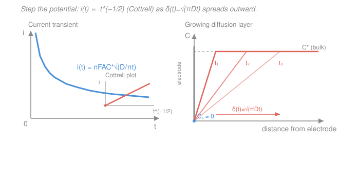

# Electrochemistry · Lesson 3.4: Potential-step chronoamperometry & the Cottrell equation

> ⏱ ~15 min · Module 3: Mass transport & voltammetry · Builds on: [3.1 Transport modes & the diffusion layer](03-01-transport-modes-diffusion-layer.md), [3.2 Diffusion-limited current](03-02-diffusion-limited-current-concentration-overpotential.md) · Unlocks: [3.5 Linear-sweep & cyclic voltammetry](03-05-linear-sweep-cyclic-voltammetry.md)

## Why this matters

In [3.2](03-02-diffusion-limited-current-concentration-overpotential.md) you got a **steady** limiting current because stirring pinned the diffusion layer at a fixed thickness $\delta$. Kill the stirring, and something more revealing happens: apply a sudden voltage jump and the current spikes, then decays in a shape so clean it has its own equation. That decay — the **Cottrell equation** — is the single most useful transient in electroanalysis. Measure how fast the current falls and you read off a diffusion coefficient $D$, a bulk concentration $C^*$, or the number of electrons $n$; a straight-line "Cottrell plot" is the fingerprint that says *this process is purely diffusion-controlled*. It's also the launchpad for [3.5](03-05-linear-sweep-cyclic-voltammetry.md): a cyclic voltammogram is essentially many potential steps swept continuously, and the Cottrell $t^{-1/2}$ falloff is exactly why CV peaks have their lopsided shape.

## The idea

Picture a still, unstirred beaker with a flat electrode and a reactant at uniform concentration $C^*$ everywhere. You hold the electrode at a potential where *nothing* reacts — the reactant just sits there. Then, at $t=0$, you **step** the potential to a value so strongly reducing (or oxidizing) that any reactant molecule touching the surface is consumed *instantly*. The surface concentration slams to zero, $C_s = 0$, and stays there.

Right after the step, the reactant right next to the surface is gone but the bulk is still full — an enormous concentration gradient over a razor-thin layer. Huge gradient means huge flux means huge current. But there's no stirring to bring fresh reactant in; the only resupply is **diffusion**, molecules random-walking down from the bulk. As they arrive and get consumed, the "empty zone" — the depletion layer — eats its way outward into the solution. A thicker empty zone means the *same* bulk-to-surface concentration drop is now spread over a *wider* distance, so the gradient is gentler, the flux smaller, the current lower.

So the current doesn't hold steady — it **decays**, because the diffusion layer keeps growing. There's no convection to stop it, so it never reaches a steady state (contrast the stirred electrode of [3.2](03-02-diffusion-limited-current-concentration-overpotential.md), where convection caps $\delta$ and freezes the current). The layer spreads like a drop of ink in still water: $\delta(t) \sim \sqrt{Dt}$. Feed that growing $\delta$ back into "current = gradient" and you get current $\propto t^{-1/2}$: a steep initial drop that tapers into a long tail.

## The formal version

**The setup: a diffusion-controlled potential step.** In quiescent (unstirred) solution, transport is pure planar diffusion, governed by Fick's second law $\partial C/\partial t = D\,\partial^2 C/\partial x^2$, where $C(x,t)$ is the reactant concentration (mol/cm³), $x$ the distance from the electrode (cm), and $D$ the diffusion coefficient (cm²/s). The step imposes two conditions: bulk stays full, $C(\infty,t)=C^*$, and the surface is starved, $C(0,t)=C_s=0$ for $t>0$. *In words: the electrode is a perfect sink switched on at $t=0$ — every molecule that reaches it vanishes.*

**The growing diffusion layer.** Solving that diffusion problem, the depletion zone thickens as

$$\delta(t) = \sqrt{\pi D t}.$$

*In words: the effective diffusion-layer thickness grows with the square root of time* — the signature of a random-walk spreading process, not linear-in-$t$ marching. (This is the *same* $\delta$ that appeared as a fixed number in [3.2](03-02-diffusion-limited-current-concentration-overpotential.md); here it is a clock, not a constant.)

**The Cottrell equation.** The current is $n$ electrons times Faraday's constant times area times the diffusive flux at the surface, $i = nFA\,D\,(\partial C/\partial x)_{x=0}$. With $C_s=0$, the linearized surface gradient is $C^*/\delta(t) = C^*/\sqrt{\pi D t}$, giving

$$\boxed{\,i(t) = \frac{nFAC^*\sqrt{D}}{\sqrt{\pi t}} = nFAC^*\sqrt{\frac{D}{\pi t}}\,}$$

where $n$ is electrons per molecule, $F=96485\ \mathrm{C/mol}$ is Faraday's constant, $A$ the electrode area (cm²), and $C^*$ the bulk concentration (mol/cm³). *In words: the current is the diffusion-limited current of [3.2](03-02-diffusion-limited-current-concentration-overpotential.md), but with the fixed $\delta$ replaced by the growing $\sqrt{\pi D t}$ — so it falls off as $1/\sqrt{t}$.*

**The diagnostic.** Rearranged,

$$i(t) = \underbrace{\left(nFAC^*\sqrt{\frac{D}{\pi}}\right)}_{\text{slope}} \cdot t^{-1/2}.$$

*In words: plot $i$ against $t^{-1/2}$ and pure planar diffusion control gives a straight line through the origin* — the **Cottrell plot**. Curvature or a nonzero intercept flags something else (slow kinetics, convection creeping in, adsorption, a non-planar electrode). The slope hands you $D$, $C^*$, or $n$ once the others are known.

**No steady state.** Because $i \propto t^{-1/2} \to 0$ as $t\to\infty$ (and $\to\infty$ as $t\to 0$), a planar electrode in quiescent solution *never* settles to a constant current. Steady state requires convection (stirring, a rotating disk, [3.2](03-02-diffusion-limited-current-concentration-overpotential.md)) or a tiny electrode whose curved, radial diffusion field self-limits — neither of which is present here.

## Picture

## Worked examples

**Example 1 (mechanical — evaluate the equation).** A planar electrode with $A=0.1\ \mathrm{cm^2}$ runs a two-electron reduction, $n=2$, of a species with $D=5.0\times10^{-6}\ \mathrm{cm^2/s}$ and $C^*=2.0\times10^{-6}\ \mathrm{mol/cm^3}$. Current at $t=2\ \mathrm{s}$:

$$\sqrt{\frac{D}{\pi t}} = \sqrt{\frac{5.0\times10^{-6}}{\pi \cdot 2}} = \sqrt{7.96\times10^{-7}} = 8.92\times10^{-4}\ \mathrm{cm/s},$$
$$i = nFAC^*\sqrt{\frac{D}{\pi t}} = 2(96485)(0.1)(2.0\times10^{-6})(8.92\times10^{-4}) \approx 3.44\times10^{-5}\ \mathrm{A} = 34.4\ \mu\mathrm{A}.$$

Because $i\propto t^{-1/2}$, quadrupling the time to $t=8\ \mathrm{s}$ *halves* the current to $17.2\ \mu\mathrm{A}$ — no need to recompute the whole expression.

**Example 2 (why you'd care — measuring $D$).** You don't usually know $D$; you *measure* it. Run the step, record $i$ at several times, plot $i$ vs $t^{-1/2}$. The data fall on a line through the origin (confirming diffusion control), with slope $m = nFAC^*\sqrt{D/\pi}$. Solve for the diffusion coefficient:

$$D = \pi\left(\frac{m}{nFAC^*}\right)^2.$$

Everything on the right is known or set by you ($n$, $A$, $C^*$) or read off the graph ($m$) — so one chronoamperogram delivers $D$. Flip it around and, with $D$ known, the same slope reads out an unknown $C^*$: that's amperometric quantitation, the principle behind diffusion-controlled sensors ([4.4](04-04-electrodeposition-sensors.md)).

## Watch out

- **You might think the current reaches a steady value like in [3.2](03-02-diffusion-limited-current-concentration-overpotential.md).** It doesn't — at a planar electrode in *unstirred* solution the current decays forever, because nothing stops $\delta$ from growing. Steady state needs convection or a microelectrode. The "limiting current" of [3.2](03-02-diffusion-limited-current-concentration-overpotential.md) and the Cottrell current are the same physics with $\delta$ fixed vs. $\delta$ growing.
- **You might read $i\to\infty$ as $t\to0$ as a real infinite current.** The Cottrell equation assumes the potential steps instantaneously and the double layer is already charged. In practice a nonfaradaic **charging-current** spike (from the double-layer capacitor, [2.1](02-01-interface-electrical-double-layer.md)) dominates the first milliseconds and decays exponentially; the clean $t^{-1/2}$ law only holds once that transient dies, so fit the *later* data.
- **You might expect $\delta \propto t$.** Diffusion spreads as $\sqrt{t}$, not $t$ — doubling the distance takes *four* times as long. A linear-in-$t$ growth would be convection (a moving front), not random-walk diffusion.

## One-liner

> Step the potential to starve the surface, and in still solution the depletion layer grows as $\sqrt{\pi D t}$ while the current bleeds off as $i = nFAC^*\sqrt{D/\pi t}$ — a straight Cottrell plot ($i$ vs $t^{-1/2}$) is the signature of pure diffusion control.

## Problems

**P1 (🟢)** A planar electrode ($A=0.05\ \mathrm{cm^2}$) does a one-electron oxidation ($n=1$) of a species with $D=7.0\times10^{-6}\ \mathrm{cm^2/s}$ and $C^*=1.5\times10^{-6}\ \mathrm{mol/cm^3}$. (a) Find the current at $t=1\ \mathrm{s}$. (b) Without re-plugging the full formula, find the current at $t=9\ \mathrm{s}$, and state the scaling law you used.

**P2 (🟡)** For a species with $D=1.0\times10^{-5}\ \mathrm{cm^2/s}$, compute the diffusion-layer thickness $\delta(t)=\sqrt{\pi D t}$ at $t=1\ \mathrm{s}$ and at $t=10\ \mathrm{s}$ (give both in µm). Using these numbers, explain in one or two sentences why the Cottrell current decays.

**P3 (🔴, Boss-3)** A planar electrode with $A=1\ \mathrm{cm^2}$ runs a one-electron reaction ($n=1$) on a species with $D=1.0\times10^{-5}\ \mathrm{cm^2/s}$ and $C^*=1.0\times10^{-6}\ \mathrm{mol/cm^3}$. Compute (a) the current at $t=1\ \mathrm{s}$; (b) the current at $t=4\ \mathrm{s}$ (use the $t^{-1/2}$ scaling, not a fresh evaluation); (c) the diffusion-layer thickness $\delta$ at $t=1\ \mathrm{s}$ in µm.

Solutions

**P1** (a) Evaluate the Cottrell equation at $t=1\ \mathrm{s}$:

$$\sqrt{\frac{D}{\pi t}} = \sqrt{\frac{7.0\times10^{-6}}{\pi(1)}} = \sqrt{2.228\times10^{-6}} = 1.493\times10^{-3}\ \mathrm{cm/s},$$
$$i = nFAC^*\sqrt{\frac{D}{\pi t}} = (1)(96485)(0.05)(1.5\times10^{-6})(1.493\times10^{-3}) \approx 1.08\times10^{-5}\ \mathrm{A} = 10.8\ \mu\mathrm{A}.$$

(b) Since $i\propto t^{-1/2}$, going from $t=1$ to $t=9\ \mathrm{s}$ multiplies the current by $9^{-1/2}=1/3$:

$$i(9\ \mathrm{s}) = \frac{10.8\ \mu\mathrm{A}}{3} = 3.6\ \mu\mathrm{A}.$$

*Check.* Units of the slope factor: $\mathrm{C/mol}\cdot\mathrm{cm^2}\cdot\mathrm{mol/cm^3}\cdot\mathrm{cm/s} = \mathrm{C/s} = \mathrm{A}$ ✓. The current dropping to a third when time is $9\times$ is exactly $t^{-1/2}$.

**P2** With $D=1.0\times10^{-5}\ \mathrm{cm^2/s}$:

$$\delta(1\ \mathrm{s}) = \sqrt{\pi D t} = \sqrt{\pi(1.0\times10^{-5})(1)} = \sqrt{3.142\times10^{-5}} = 5.61\times10^{-3}\ \mathrm{cm} = 56\ \mu\mathrm{m},$$
$$\delta(10\ \mathrm{s}) = \sqrt{\pi(1.0\times10^{-5})(10)} = \sqrt{3.142\times10^{-4}} = 1.77\times10^{-2}\ \mathrm{cm} = 177\ \mu\mathrm{m}.$$

The layer thickened by $\sqrt{10}\approx3.16\times$ (not $10\times$ — diffusion spreads as $\sqrt{t}$). The current decays because the surface concentration is pinned at $C_s=0$ while the bulk stays at $C^*$, so the concentration *drop* is fixed but it is now spread across an ever-wider layer $\delta(t)$; the gradient $C^*/\delta$ — and hence the diffusive flux and current — shrinks as $\delta$ grows.

*Check.* $1\ \mathrm{cm} = 10^4\ \mu\mathrm{m}$, so $5.61\times10^{-3}\ \mathrm{cm}\times10^4 = 56\ \mu\mathrm{m}$ ✓.

**P3 (Boss-3)** (a) At $t=1\ \mathrm{s}$:

$$\sqrt{\frac{D}{\pi t}} = \sqrt{\frac{1.0\times10^{-5}}{\pi(1)}} = \sqrt{3.183\times10^{-6}} = 1.784\times10^{-3}\ \mathrm{cm/s},$$
$$i(1\ \mathrm{s}) = (1)(96485)(1)(1.0\times10^{-6})(1.784\times10^{-3}) \approx 1.72\times10^{-4}\ \mathrm{A} = 172\ \mu\mathrm{A}.$$

(b) $i\propto t^{-1/2}$, so quadrupling $t$ from $1$ to $4\ \mathrm{s}$ multiplies by $4^{-1/2}=\tfrac12$:

$$i(4\ \mathrm{s}) = \tfrac12(172\ \mu\mathrm{A}) = 86\ \mu\mathrm{A}.$$

(c) Diffusion-layer thickness at $t=1\ \mathrm{s}$:

$$\delta(1\ \mathrm{s}) = \sqrt{\pi D t} = \sqrt{\pi(1.0\times10^{-5})(1)} = 5.61\times10^{-3}\ \mathrm{cm} \approx 56\ \mu\mathrm{m}.$$

*Check.* Cross-consistency: the Cottrell current should equal the [3.2](03-02-diffusion-limited-current-concentration-overpotential.md) limiting current $i_L = nFADC^*/\delta$ with this $\delta$: $i_L = (1)(96485)(1)(1.0\times10^{-5})(1.0\times10^{-6})/(5.61\times10^{-3}) = 1.72\times10^{-4}\ \mathrm{A} = 172\ \mu\mathrm{A}$ ✓ — the two forms agree exactly, since $\delta=\sqrt{\pi D t}$ is what converts one into the other.

## Flashback

**From Lesson 3.2 (Diffusion-limited current):** A **stirred** electrode holds a fixed Nernst diffusion layer of thickness $\delta = 100\ \mu\mathrm{m}$. For a one-electron reaction ($n=1$) on a species with $D = 6.0\times10^{-6}\ \mathrm{cm^2/s}$ and bulk concentration $C^* = 2.0\times10^{-6}\ \mathrm{mol/cm^3}$, find the limiting current density $j_L$. (Fresh variant — stirred, so $\delta$ is fixed; contrast with this lesson's growing $\delta$.)

Solution

Convert $\delta = 100\ \mu\mathrm{m} = 0.01\ \mathrm{cm}$. The limiting current density is $j_L = nFDC^*/\delta$:

$$j_L = \frac{(1)(96485)(6.0\times10^{-6})(2.0\times10^{-6})}{0.01} = \frac{1.158\times10^{-6}}{0.01} \approx 1.16\times10^{-4}\ \mathrm{A/cm^2} = 116\ \mu\mathrm{A/cm^2}.$$

*Check.* Units: $\dfrac{\mathrm{C/mol}\cdot\mathrm{cm^2/s}\cdot\mathrm{mol/cm^3}}{\mathrm{cm}} = \dfrac{\mathrm{C/s}}{\mathrm{cm^2}} = \mathrm{A/cm^2}$ ✓. Because stirring pins $\delta$, this current is *steady* — the key contrast with chronoamperometry, where the unpinned $\delta(t)=\sqrt{\pi D t}$ makes the current decay instead.

## Connections

- **Backward:** this is [3.2](03-02-diffusion-limited-current-concentration-overpotential.md)'s diffusion-limited current with the fixed $\delta$ swapped for the growing $\delta(t)=\sqrt{\pi D t}$ from [3.1](03-01-transport-modes-diffusion-layer.md); the surface-starvation condition $C_s=0$ is the same "concentration polarization" that produced the limiting plateau. The double-layer charging spike in the "Watch out" is the capacitor from [2.1](02-01-interface-electrical-double-layer.md).
- **Forward:** [3.5 Linear-sweep & cyclic voltammetry](03-05-linear-sweep-cyclic-voltammetry.md) sweeps the potential continuously instead of stepping it once — the CV peak current (Randles–Ševčík) and the asymmetric "duck" shape both come from this same $t^{-1/2}$ depletion, now competing against a moving potential.
- **Sideways (transport physics):** $\delta \sim \sqrt{Dt}$ is the universal random-walk / diffusion-length law — the same $\sqrt{Dt}$ that governs heat spreading, dopant diffusion in semiconductors (materials science, see [materials-science syllabus](../../materials-science/syllabus.md)), and the mean-square displacement of a Brownian particle. Chronoamperometry is that law made into a current you can measure.
