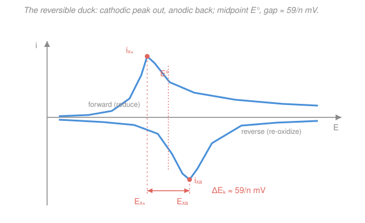

# Electrochemistry · Lesson 3.5: Linear-sweep & cyclic voltammetry

> ⏱ ~15 min · Module 3: Mass transport & voltammetry · Builds on: [3.4 Chronoamperometry & the Cottrell equation](03-04-chronoamperometry-cottrell.md), [1.5 Nernst equation & concentration cells](01-05-nernst-equation-concentration-cells.md) · Unlocks: [4.1 Batteries & energy density](04-01-batteries-energy-density.md)

## Why this matters

Hand an electrochemist an unknown molecule and the first thing they run is a **cyclic voltammogram**. In one five-minute sweep it tells you *where* the molecule oxidizes or reduces (its $E^\circ$), *how many electrons* it moves ($n$), *whether the electron transfer is fast or sluggish* (reversibility), and *how fast it diffuses* — a whole thermodynamic-and-kinetic fingerprint from a single curve. This lesson is where every earlier idea in the course cashes out at once: the [Nernst](01-05-nernst-equation-concentration-cells.md) thermodynamics of Module 1 sets *where* the peaks sit, the [electron-transfer kinetics](02-02-activation-exchange-current.md) of Module 2 set *how far apart* they sit, and the [Cottrell $t^{-1/2}$ diffusion decay](03-04-chronoamperometry-cottrell.md) of Lesson 3.4 is exactly what pulls each peak back down. Learn to read the duck and you can read almost any electrochemistry paper's key figure.

## The idea

In [chronoamperometry (3.4)](03-04-chronoamperometry-cottrell.md) you *jumped* the potential to one value and watched the current decay. **Voltammetry** does something gentler: instead of jumping, you *ramp* the potential steadily — $E(t) = E_i + vt$, a straight line — and record current as you go. The ramp rate $v$ (volts per second) is the **scan rate**. That's **linear-sweep voltammetry (LSV)**: sweep once, in one direction.

**Cyclic voltammetry (CV)** just adds a return leg: sweep the potential *forward* to a turning point, then *reverse* and sweep back, tracing a closed loop. The forward leg drives the reaction one way; the reverse leg interrogates whatever product the forward leg just made.

Now picture the forward sweep for a reducible species. Early on the potential is too positive — nothing happens, near-zero current. As the ramp carries the potential down *past* the couple's $E^\circ$, the [Nernst equation](01-05-nernst-equation-concentration-cells.md) says the surface *must* start converting reactant to product, so current climbs. But here's the twist: converting reactant **depletes it right at the electrode**, and fresh reactant can only crawl in by diffusion. This is the exact tension from 3.4 — the reaction wants to go faster, but diffusion can't refill the surface fast enough. So the current climbs, **peaks**, and then *falls*, decaying like the Cottrell $t^{-1/2}$ tail riding on top of the moving ramp. That rise-then-fall hump is the **peak**.

Reverse the scan and the product you just piled up near the electrode gets driven back the other way — re-oxidized — giving a **mirror-image peak** on the return leg. Two peaks, offset in potential, connected into a loop: the classic reversible **"duck."** Everything diagnostic lives in the *heights* of those peaks, their *positions*, and how both respond when you *change the scan rate*.

## The formal version

**The excitation.** The applied potential is a triangle wave in time:

$$E(t) = E_i - v\,t \ \ (\text{forward}), \qquad v \equiv \left|\frac{dE}{dt}\right| \ (\mathrm{V/s}).$$

*In words: you drive the potential at a constant rate $v$ (the scan rate), then flip the sign of the rate at the switching potential.* The response you plot is current $i$ **versus potential $E$** (not versus time) — that unfolds the triangle into the duck.

**Peak current — the Randles–Ševčík equation.** For a reversible couple at 298 K, the peak current is

$$\boxed{\,i_p = (2.69\times10^{5})\, n^{3/2}\,A\,D^{1/2}\,C^{*}\,v^{1/2}\,}$$

with $n$ = electrons transferred, $A$ = electrode area ($\mathrm{cm^2}$), $D$ = diffusion coefficient ($\mathrm{cm^2/s}$), $C^{*}$ = bulk concentration ($\mathrm{mol/cm^3}$), and $v$ = scan rate ($\mathrm{V/s}$); $i_p$ comes out in amperes. *In words: the peak current grows with the square root of the scan rate and with concentration.* Strip away the constants and the two signatures that matter are

$$i_p \propto \sqrt{v}\,C^{*}, \qquad i_p \propto \sqrt{D\,v}.$$

The $\sqrt{D}$ is the diffusion fingerprint — same $D^{1/2}$ that appears in the [Cottrell equation](03-04-chronoamperometry-cottrell.md), and for the same reason: the peak *is* the moment diffusion loses to the growing demand. Why $\sqrt{v}$? Faster scans reach the peak sooner, when the depletion layer is thinner and the concentration gradient steeper, so the diffusive flux — and the current — is larger.

**Peak separation — the reversibility diagnostic.** For an electrochemically **reversible** (fast electron transfer) couple at 298 K, the forward and reverse peaks sit a fixed distance apart:

$$\boxed{\,\Delta E_p = E_{pa} - E_{pc} \approx \frac{59}{n}\ \mathrm{mV}\,} \qquad (\text{and independent of } v),$$

where $E_{pa}$ is the anodic (reverse) peak potential and $E_{pc}$ the cathodic (forward) peak potential. *In words: for a fast one-electron couple the two peaks are about 59 mV apart, no matter how fast you scan.* That 59 mV is the same $2.303RT/F = 0.0592\ \mathrm{V}$ Nernst factor from [Lesson 1.5](01-05-nernst-equation-concentration-cells.md) — CV wears the Nernst slope on its sleeve. The **midpoint** of the two peaks pins the formal potential:

$$E^{\circ} \approx \frac{E_{pa} + E_{pc}}{2}.$$

**The reversibility scorecard.** Read three things off the CV:

| Diagnostic | Reversible (fast $j_0$) | Quasi-/irreversible (sluggish $j_0$) |
|---|---|---|
| $\Delta E_p$ | $\approx 59/n$ mV | $> 59/n$ mV |
| $\Delta E_p$ vs scan rate | constant | **grows** with $v$ |
| $i_{pa}/i_{pc}$ | $\approx 1$ | $\neq 1$ (or peak vanishes) |
| $i_p$ vs $v$ | $\propto \sqrt{v}$ (linear in $\sqrt v$) | still $\propto\sqrt v$ if diffusion-limited |

*In words: a fast couple gives tight, symmetric, scan-rate-stable peaks; a sluggish one gives wide peaks that spread further apart the harder you push.* That last row is the tell: a slow electron transfer (small exchange-current density $j_0$ from [Lesson 2.2](02-02-activation-exchange-current.md)) needs extra **overpotential** to force the current, so the reduction peak slides more negative and the oxidation peak more positive — $\Delta E_p$ balloons. And because a faster scan gives the sluggish kinetics *less time*, the gap widens with $v$. This is [Tafel/Butler–Volmer kinetics (2.4)](02-04-overpotential-tafel-analysis.md) showing up as peak spreading.

## Picture

## Worked examples

**Example 1 (read the duck).** A CV of a metal complex shows a forward (cathodic) peak at $E_{pc} = 0.19\ \mathrm{V}$ and a reverse (anodic) peak at $E_{pa} = 0.25\ \mathrm{V}$ (vs SCE), and the peak positions don't move when the scan rate is changed. Find $E^{\circ}$ and $n$.

The midpoint gives the formal potential:

$$E^{\circ} \approx \frac{E_{pa} + E_{pc}}{2} = \frac{0.25 + 0.19}{2} = 0.22\ \mathrm{V\ vs\ SCE}.$$

The separation gives the electron count. Here $\Delta E_p = 0.25 - 0.19 = 0.060\ \mathrm{V} = 60\ \mathrm{mV}$, and since the peaks are scan-rate-stable the couple is reversible, so $\Delta E_p \approx 59/n$:

$$n = \frac{59\ \mathrm{mV}}{\Delta E_p} = \frac{59}{60} \approx 1.$$

A reversible **one-electron** couple centered at $0.22\ \mathrm{V}$. Two numbers, read straight off the plot.

**Example 2 (why you'd care — quantify with scan rate).** You run the *same* couple ($n=1$, reversible) at $v = 100\ \mathrm{mV/s}$ and measure a peak current $i_p = 24\ \mu\mathrm{A}$. What peak current do you expect at $v = 400\ \mathrm{mV/s}$, and what does a *straight line* through a plot of $i_p$ vs $\sqrt v$ prove?

Randles–Ševčík says $i_p \propto \sqrt v$ (everything else fixed), so a fourfold faster scan multiplies the current by $\sqrt 4 = 2$:

$$i_p(400) = i_p(100)\sqrt{\frac{400}{100}} = 24\ \mu\mathrm{A}\times 2 = 48\ \mu\mathrm{A}.$$

If instead you plot $i_p$ against $\sqrt v$ and the points fall on a straight line **through the origin**, you've proven the current is **diffusion-controlled** — a *freely diffusing* species obeying the $\sqrt{Dv}$ law. (If the peak scaled with $v$ itself, not $\sqrt v$, you'd be looking at a surface-*adsorbed* species instead — a standard way CV distinguishes the two.) The slope of that line is your handle on $D$ once you know $n$, $A$, and $C^{*}$.

## Watch out

- **You might think the peak means the reaction "runs out."** It doesn't — the reactant in the *bulk* is untouched; only the thin layer at the electrode is depleted. The current falls because diffusion can't resupply the surface fast enough, not because the reaction stopped. That's the Cottrell $t^{-1/2}$ decay from [3.4](03-04-chronoamperometry-cottrell.md), now riding on the ramp.
- **You might read a big $\Delta E_p$ as "more electrons."** Backwards. $\Delta E_p \approx 59/n$ means *more* electrons give a *smaller* gap. A gap *larger* than $59/n$ signals sluggish kinetics (small $j_0$), not extra electrons — and the giveaway is that a kinetic gap **grows with scan rate**, while a genuine multi-electron $59/n$ gap stays put.
- **You might quote peak positions as $E^{\circ}$.** Neither peak alone is $E^{\circ}$; the peaks straddle it. Use the *midpoint* $(E_{pa}+E_{pc})/2$. (And only for a reasonably reversible couple — for an irreversible one the midpoint drifts and loses its thermodynamic meaning.)
- **You might expect a reverse peak always.** If the forward-scan product reacts away chemically before you sweep back (a coupled follow-up reaction), the reverse peak shrinks or vanishes — itself a powerful diagnostic that there's chemistry after the electron transfer.

## One-liner

> Ramp the potential and the current traces a duck: peaks at $\pm$ the Cottrell decay mark where redox turns on, their $59/n$ mV separation reports fast kinetics, their midpoint is $E^{\circ}$, and their $\sqrt v$ growth is diffusion's signature.

## Problems

**P1 (🟢)** A reversible cyclic voltammogram (scan-rate-stable peaks) shows $E_{pc} = -0.48\ \mathrm{V}$ and $E_{pa} = -0.42\ \mathrm{V}$ vs SCE. Find the formal potential $E^{\circ}$ and the number of electrons $n$.

**P2 (🟡)** For a freely diffusing, reversible species you measure $i_p = 18\ \mu\mathrm{A}$ at a scan rate of $v = 25\ \mathrm{mV/s}$. Predict $i_p$ when the scan rate is quadrupled to $100\ \mathrm{mV/s}$. Then state what feature of a plot of $i_p$ vs $\sqrt v$ would confirm the current is diffusion-controlled, and which factor in Randles–Ševčík carries the "diffusion" information.

**P3 (🔴)** You compare two couples, each believed to be $n=1$, at two scan rates:

| Couple | $\Delta E_p$ at 50 mV/s | $\Delta E_p$ at 500 mV/s | $i_{pa}/i_{pc}$ |
|---|---|---|---|
| A | 61 mV | 64 mV | 1.00 |
| B | 115 mV | 205 mV | 0.82 |

Classify each couple's reversibility, justify from the diagnostics, and explain *physically* why couple B's peak separation grows with scan rate — connecting it to the exchange-current density and overpotential ideas from [2.2](02-02-activation-exchange-current.md)/[2.4](02-04-overpotential-tafel-analysis.md).

Solutions

**P1** Midpoint gives the formal potential:

$$E^{\circ} \approx \frac{E_{pa}+E_{pc}}{2} = \frac{-0.42 + (-0.48)}{2} = \frac{-0.90}{2} = -0.45\ \mathrm{V\ vs\ SCE}.$$

Separation gives $n$. With $\Delta E_p = E_{pa}-E_{pc} = -0.42 - (-0.48) = 0.06\ \mathrm{V} = 60\ \mathrm{mV}$, and the peaks scan-rate-stable (reversible), $\Delta E_p \approx 59/n$ gives

$$n = \frac{59}{60} \approx 1.$$

A reversible one-electron couple at $E^{\circ} = -0.45\ \mathrm{V}$ vs SCE.

*Check.* $\Delta E_p = 60$ mV is within a hair of the ideal 59 mV for $n=1$; a two-electron couple would show $\approx 30$ mV, which we do not see. ✓

**P2** Randles–Ševčík: with $n$, $A$, $D$, $C^{*}$ all fixed, $i_p \propto \sqrt v$. Quadrupling $v$ multiplies $i_p$ by $\sqrt 4 = 2$:

$$i_p(100\ \mathrm{mV/s}) = 18\ \mu\mathrm{A}\times\sqrt{\frac{100}{25}} = 18\times 2 = 36\ \mu\mathrm{A}.$$

Confirmation of diffusion control: a plot of $i_p$ versus $\sqrt v$ is a **straight line through the origin**. (Equivalently, $i_p/\sqrt v$ is constant: $18/\sqrt{25} = 3.6$ and $36/\sqrt{100} = 3.6$ in $\mu\mathrm{A}/\sqrt{\mathrm{mV/s}}$ — same value. ✓) The diffusion information is carried by the $D^{1/2}$ factor, i.e. $i_p \propto \sqrt{Dv}$ — the very same $\sqrt D$ that appears in the Cottrell equation, because the peak is set by diffusion losing to demand.

*Check.* If the species were surface-adsorbed instead, $i_p$ would scale as $v$ (not $\sqrt v$); quadrupling $v$ would then give $18\times 4 = 72\ \mu\mathrm{A}$. The $\sqrt v$ law is what marks it as diffusing. ✓

**P3** For $n=1$, the reversible benchmark is $\Delta E_p \approx 59$ mV, *constant* with scan rate, with $i_{pa}/i_{pc}\approx 1$.

- **Couple A — reversible (fast electron transfer).** $\Delta E_p \approx 61$–$64$ mV is essentially the ideal 59 mV, barely changes from 50 to 500 mV/s (scan-rate-independent), and $i_{pa}/i_{pc} = 1.00$. All three diagnostics pass: fast, Nernstian electron transfer with a large exchange-current density $j_0$.
- **Couple B — quasi-reversible / sluggish.** $\Delta E_p = 115$ mV is already about twice the reversible value at 50 mV/s, and it **balloons to 205 mV** at the faster scan; $i_{pa}/i_{pc} = 0.82 \neq 1$. Growing $\Delta E_p$ with $v$ is the signature of finite (slow) electron-transfer kinetics.

*Physical why.* A sluggish couple has a **small exchange-current density $j_0$** (small heterogeneous rate constant $k^0$) — from [2.2](02-02-activation-exchange-current.md), the electrode is intrinsically slow at trading electrons with this species. To pass an appreciable current you must apply extra **overpotential** to speed the transfer (that's the Butler–Volmer/Tafel picture of [2.4](02-04-overpotential-tafel-analysis.md)): the reduction peak is dragged to more negative potential and the oxidation peak to more positive potential, prying them apart. Crank the scan rate and you demand the *same* charge in *less time*, so an even larger overpotential is needed to keep up — and $\Delta E_p$ widens further. A truly reversible couple never faces this bottleneck because its kinetics are effectively instantaneous, so its 59 mV gap holds at any scan rate.

*Check.* Consistency: the couple whose gap grows with $v$ (B) is also the one with the asymmetric peak ratio ($0.82$) — both point to non-ideal, kinetically limited behavior, while A is clean on every count. ✓

## Flashback

**From Lesson 3.4 (Chronoamperometry & the Cottrell equation):** A planar electrode of area $A = 0.020\ \mathrm{cm^2}$ is stepped to a potential where a one-electron ($n=1$) reduction becomes diffusion-limited. The species has bulk concentration $C^{*} = 1.0\ \mathrm{mM}$ and diffusion coefficient $D = 1.0\times10^{-5}\ \mathrm{cm^2/s}$. Using the Cottrell equation $i(t) = nFAC^{*}\sqrt{D/(\pi t)}$, find the current at $t = 1.0\ \mathrm{s}$, then at $t = 4.0\ \mathrm{s}$. (Fresh variant — new numbers.)

Solution

First fix units for the Cottrell equation: $C^{*} = 1.0\ \mathrm{mM} = 1.0\times10^{-3}\ \mathrm{mol/L} = 1.0\times10^{-6}\ \mathrm{mol/cm^3}$, with $F = 96485\ \mathrm{C/mol}$.

The prefactor:

$$nFAC^{*} = (1)(96485)(0.020)(1.0\times10^{-6}) = 1.93\times10^{-3}\ \mathrm{C\,cm^{-1}\,s^{?}}\ \text{(gather units below)}.$$

The time factor at $t = 1.0\ \mathrm{s}$:

$$\sqrt{\frac{D}{\pi t}} = \sqrt{\frac{1.0\times10^{-5}}{\pi\,(1.0)}} = \sqrt{3.18\times10^{-6}} = 1.78\times10^{-3}\ \mathrm{cm/s}.$$

So

$$i(1\ \mathrm{s}) = (1.93\times10^{-3})(1.78\times10^{-3}) = 3.4\times10^{-6}\ \mathrm{A} = 3.4\ \mu\mathrm{A}.$$

Because $i \propto t^{-1/2}$, going from $t=1$ s to $t=4$ s multiplies the current by $\sqrt{1/4} = 1/2$:

$$i(4\ \mathrm{s}) = \frac{3.4}{2} = 1.7\ \mu\mathrm{A}.$$

*Check (units).* $[nFAC^{*}]\cdot[\sqrt{D/\pi t}] = (\mathrm{C\,mol^{-1}})(\mathrm{cm^2})(\mathrm{mol\,cm^{-3}})(\mathrm{cm\,s^{-1}}) = \mathrm{C/s} = \mathrm{A}$ ✓. And this is exactly the $t^{-1/2}$ decay that becomes the *falling edge* of a voltammetric peak — the same diffusion clock, now read on a moving potential ramp instead of a fixed step. ✓

## Connections

- **Backward:** the peak *position* is [Nernst thermodynamics (1.5)](01-05-nernst-equation-concentration-cells.md) — the $59$ mV in $\Delta E_p$ is the same $2.303RT/F$ slope — while the peak's *falling edge* is the [Cottrell $t^{-1/2}$ diffusion decay (3.4)](03-04-chronoamperometry-cottrell.md), and the peak *width/separation* beyond the reversible limit is [electron-transfer kinetics (2.2](02-02-activation-exchange-current.md)/[2.4)](02-04-overpotential-tafel-analysis.md) — sluggish $j_0$ prying the peaks apart. CV is the whole course in one curve.
- **Forward:** the reversibility and $\Delta E_p$ diagnostics carry straight into [4.1 Batteries & energy density](04-01-batteries-energy-density.md), where the same peak-separation logic reappears as *voltage hysteresis* between charge and discharge — a battery's charge/discharge curves are a slow cyclic voltammogram, and their gap is the efficiency you lose to kinetics and transport.
- **Sideways (physical chemistry):** the way a small overpotential exponentially speeds a sluggish couple — and thereby spreads its CV peaks — is [Arrhenius/transition-state kinetics](../../physical-chemistry/lessons/03-04-arrhenius-transition-state-theory.md) with the activation barrier *tilted by the electrode potential*; that is precisely the Butler–Volmer picture, now visible as the shape of a diagnostic curve.
