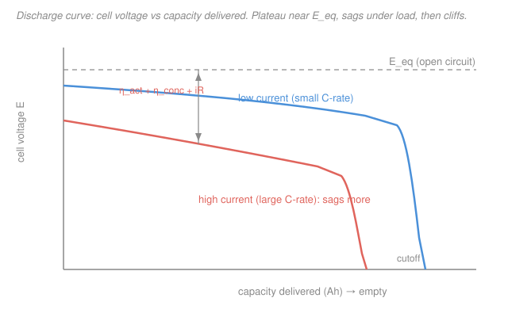

# Electrochemistry · Lesson 4.1: Batteries — primary, secondary & energy density

> ⏱ ~15 min · Module 4: Electrochemistry in the wild · Builds on: [1.4 Cell EMF, Gibbs & equilibrium](01-04-cell-emf-gibbs-equilibrium.md), [3.3 Mixed control: kinetics + transport](03-03-mixed-control-kinetics-transport.md), [1.2 Galvanic/electrolytic cells & Faraday](01-02-galvanic-electrolytic-cells-faraday.md) · Unlocks: [4.2 Fuel cells & electrolyzers](04-02-fuel-cells-electrolyzers.md)

## Why this matters

A battery is nothing new to you — it is a galvanic cell (Module 1) packaged so you can carry its stored Gibbs energy around and spend it on demand. Everything you already derived shows up as a spec on a datasheet: the cell EMF is $-\Delta G/nF$ from [1.4](01-04-cell-emf-gibbs-equilibrium.md), the capacity is Faraday's law from [1.2](01-02-galvanic-electrolytic-cells-faraday.md), and the reason the voltage sags when you actually draw current is the overpotential stack from [3.3](03-03-mixed-control-kinetics-transport.md). This lesson turns three modules of theory into the two numbers people argue about — **how much energy per kilogram**, and **how much of it you actually get** at the current you need.

## The idea

Charge a spring, then let it push a load — that is a battery. The "spring" is a chemical reaction poised far from equilibrium: keep the two half-reactions apart, wire them through your device, and electrons flow the long way round doing work. Two flavors:

- **Primary** (single-use): the reaction runs one way to exhaustion and you throw the cell away — an alkaline AA. Cheap, high shelf life, no plumbing for recharge.
- **Secondary** (rechargeable): you can *run the reaction backwards* by forcing current in with an external supply — an **electrolytic** step ([1.2](01-02-galvanic-electrolytic-cells-faraday.md)) that rebuilds the reactants. Lead-acid, NiMH, Li-ion. Discharge is galvanic (spontaneous, pays you); charge is electrolytic (you pay).

How much energy is in the spring? Two factors multiply: **how hard it pushes** (the voltage $E$) times **how much charge it can push** (the capacity $Q$). Energy $= E \times Q$. To compare a AA against a Tesla pack fairly you normalize by mass — **specific energy** in watt-hours per kilogram (Wh/kg).

But there is a catch that runs through the whole lesson: the *theoretical* number counts only the atoms doing chemistry. The *real* cell also carries a steel can, separator, electrolyte, current collectors, tabs, and safety hardware — dead weight for energy but essential for it to work. So practical energy density lands at roughly **a quarter to a half** of theoretical. And even the energy that is there comes out at a *lower voltage* than the EMF, because pushing current costs overpotential.

## The formal version

**Capacity.** By Faraday's law ([1.2](01-02-galvanic-electrolytic-cells-faraday.md)), $n$ moles of electrons carry charge $nF$, with $F = 96485\ \mathrm{C/mol}$. Charge is usually quoted in **amp-hours**: $1\ \mathrm{Ah} = 3600\ \mathrm{C}$. *In words: capacity is just "how many electrons are stored," in bookkeeping units.*

**Theoretical specific energy.** One mole of cell reaction releases Gibbs energy $-\Delta G = nFE$ ([1.4](01-04-cell-emf-gibbs-equilibrium.md)) and consumes a fixed mass — the sum $\sum M$ of the molar masses of all **active materials** (the species actually oxidized/reduced). So

$$w_{\text{theo}} = \frac{nFE}{\sum M} \qquad \left[\frac{\mathrm{J}}{\mathrm{kg}}\right], \qquad w_{\text{theo}}[\mathrm{Wh/kg}] = \frac{nFE}{3600\,\sum M}.$$

*In words: energy per mole divided by mass per mole = energy per mass — the best you could ever do if the cell were nothing but reactants.* Everything else (casing, electrolyte, collectors) only adds mass, so a real cell's **practical energy density** is $w_{\text{theo}}$ times a packaging factor of ~0.25–0.5.

**Delivered voltage under load.** At open circuit the terminals read the equilibrium EMF $E_\text{eq}$. Draw current $i$ and the delivered voltage drops by the same three overpotentials you decomposed in [3.3](03-03-mixed-control-kinetics-transport.md):

$$\boxed{\,E_\text{load} = E_\text{eq} - \eta_\text{act} - \eta_\text{conc} - iR\,}$$

- $\eta_\text{act}$ — **activation** overpotential, the price of driving the charge-transfer step (Butler–Volmer/Tafel); grows *logarithmically* with $i$.
- $iR$ — **ohmic** drop ("IR droop") across electrolyte + collectors, resistance $R$; grows *linearly* with $i$.
- $\eta_\text{conc}$ — **concentration** overpotential from reactant depletion at the electrode; small until $i$ nears the diffusion-limited current $j_L$, then *diverges*.

*In words: the voltage you actually get is the thermodynamic EMF minus a tax for every kinetic and transport bottleneck — and the tax rises with current.* The delivered energy is $E_\text{load}\times Q$, always less than $E_\text{eq}\times Q$; the difference is dissipated as heat.

**C-rate.** Discharge current is quoted relative to capacity: **1C** empties a cell in one hour, **2C** in half an hour, **C/5** in five. High C-rate = high $i$ = bigger overpotential tax = more sag.

## Picture

Read it left to right as the cell empties. Both curves sit *below* the dashed open-circuit EMF — that gap is the overpotential stack. The **blue** low-rate curve holds a high, flat plateau and cliffs late; the **coral** high-rate curve starts lower (bigger $iR$ + activation offset), sags harder, and cliffs early as concentration overpotential runs away near $j_L$. Same chemistry, less usable energy — that is the cost of pulling hard.

## Worked examples

**Example 1 (theoretical specific energy — lead-acid).** The cell reaction is $\ce{Pb + PbO2 + 2H2SO4 -> 2PbSO4 + 2H2O}$, $E^\circ = 2.05\ \mathrm{V}$, $n = 2$. Active-material molar masses: $\ce{Pb}=207.2$, $\ce{PbO2}=239.2$, $2\,\ce{H2SO4}=196.2\ \mathrm{g/mol}$, so $\sum M = 642.6\ \mathrm{g/mol} = 0.6426\ \mathrm{kg/mol}$.

$$w_{\text{theo}} = \frac{nFE^\circ}{\sum M} = \frac{2(96485)(2.05)}{0.6426} = \frac{3.956\times10^{5}\ \mathrm{J}}{0.6426\ \mathrm{kg}} = 6.16\times10^{5}\ \mathrm{J/kg} = 171\ \mathrm{Wh/kg}.$$

A real lead-acid battery delivers ~**35 Wh/kg** — about 20% of theoretical, the rest being lead grids, case, and dilute acid. That mediocre number, plus cheapness and huge surge current, is exactly why lead-acid still starts your car but never flew a phone.

**Example 2 (voltage and energy under load — a Li-ion cell).** A cell with $E_\text{eq}=3.7\ \mathrm{V}$ and capacity $2\ \mathrm{Ah}$ is discharged at $i = 2\ \mathrm{A}$ (a 1C rate). Measured losses: $\eta_\text{act}=0.15\ \mathrm{V}$, $\eta_\text{conc}=0.05\ \mathrm{V}$, internal resistance $R = 0.05\ \Omega$.

$$iR = (2)(0.05) = 0.10\ \mathrm{V}, \qquad E_\text{load} = 3.7 - 0.15 - 0.05 - 0.10 = 3.40\ \mathrm{V}.$$

Delivered energy over the full discharge: $E_\text{load}\times Q = 3.40\ \mathrm{V}\times 2\ \mathrm{Ah} = 6.8\ \mathrm{Wh}$, versus the ideal $3.7\times 2 = 7.4\ \mathrm{Wh}$. **Voltage efficiency** $= 3.40/3.70 = 92\%$; the missing $0.6\ \mathrm{Wh}$ leaves as heat inside the cell — which is why phones warm up under load.

## Watch out

- **You might quote capacity as "energy."** A 2 Ah cell is not "2 Ah of energy" — Ah is *charge*. Energy needs the voltage: $E\times Q$. Two cells with equal Ah but different chemistries store very different Wh.
- **You might trust the theoretical Wh/kg.** It ignores every gram that is not a reactant. Always apply the packaging factor before comparing to a real spec sheet; theoretical numbers flatter every chemistry equally.
- **You might read the discharge plateau as the EMF.** The plateau sits *below* $E_\text{eq}$ by the overpotential stack, and it sits *lower still* at higher C-rate. Open-circuit voltage and loaded voltage are different measurements.
- **You might think charging is "just discharge in reverse" for free.** Recharge is an *electrolytic* step: you must supply $E_\text{eq} + \eta + iR$ (overpotentials now add *against* you), so round-trip energy efficiency is always below 100%.

## One-liner

> A battery stores $E\times Q$ of Gibbs energy; theory sets $nFE/\sum M$ as the ceiling, packaging knocks it to a quarter, and overpotential ($\eta_\text{act}+\eta_\text{conc}+iR$) skims the voltage every time you actually pull current.

## Problems

**P1 (🟢)** A zinc–chlorine cell runs $\ce{Zn + Cl2 -> ZnCl2}$ with $E^\circ = 2.12\ \mathrm{V}$ and $n = 2$. Molar masses: $\ce{Zn} = 65.4$, $\ce{Cl2} = 70.9\ \mathrm{g/mol}$. Compute the theoretical specific energy in Wh/kg (count only the active materials Zn and Cl₂).

**P2 (🟡)** A cell has open-circuit EMF $E_\text{eq} = 1.55\ \mathrm{V}$ and internal resistance $R = 0.20\ \Omega$. At a discharge current of $0.5\ \mathrm{A}$ the activation and concentration overpotentials are $\eta_\text{act} = 0.08\ \mathrm{V}$ and $\eta_\text{conc} = 0.02\ \mathrm{V}$. (a) Find the delivered voltage $E_\text{load}$. (b) If the cell holds $1.2\ \mathrm{Ah}$, find the energy delivered at this current and the voltage efficiency versus open circuit. (c) How much power is dissipated as heat inside the cell?

**P3 (🔴)** Using the mixed-control picture from [3.3](03-03-mixed-control-kinetics-transport.md), explain *why* the discharge plateau sags more at high C-rate. Decompose the voltage loss $E_\text{eq}-E_\text{load}$ into its activation, ohmic, and concentration terms, state how each scales with current $i$, and say which term produces the sharp voltage "cliff" at the end of a high-rate discharge.

Solutions

**P1** Sum of active-material molar masses: $\sum M = 65.4 + 70.9 = 136.3\ \mathrm{g/mol} = 0.1363\ \mathrm{kg/mol}$.

$$w_{\text{theo}} = \frac{nFE^\circ}{\sum M} = \frac{2(96485)(2.12)}{0.1363} = \frac{4.091\times10^{5}\ \mathrm{J}}{0.1363\ \mathrm{kg}} = 3.00\times10^{6}\ \mathrm{J/kg}.$$

Convert: $w_{\text{theo}} = \dfrac{3.00\times10^{6}}{3600} = 834\ \mathrm{Wh/kg}$.

*Check.* Numerator $nFE^\circ = 2\times96485\times2.12 = 409{,}096\ \mathrm{J/mol}$; dividing by $0.1363\ \mathrm{kg}$ gives $\approx 3.00\times10^{6}\ \mathrm{J/kg}$; $/3600 \approx 834\ \mathrm{Wh/kg}$. High, as expected for light active elements at high voltage — but a real Zn–Cl₂ system needs bulky chlorine storage, dragging the practical figure far below this ceiling.

**P2** (a) Ohmic drop $iR = (0.5)(0.20) = 0.10\ \mathrm{V}$. Then

$$E_\text{load} = E_\text{eq} - \eta_\text{act} - \eta_\text{conc} - iR = 1.55 - 0.08 - 0.02 - 0.10 = 1.35\ \mathrm{V}.$$

(b) Energy delivered $= E_\text{load}\times Q = 1.35\ \mathrm{V}\times 1.2\ \mathrm{Ah} = 1.62\ \mathrm{Wh}$. Voltage efficiency $= E_\text{load}/E_\text{eq} = 1.35/1.55 = 0.871 = 87.1\%$.

(c) Total overpotential $= 1.55 - 1.35 = 0.20\ \mathrm{V}$; power to heat $= (\text{overpotential})\times i = 0.20\ \mathrm{V}\times 0.5\ \mathrm{A} = 0.10\ \mathrm{W}$.

*Check.* Useful power $= E_\text{load} i = 1.35\times0.5 = 0.675\ \mathrm{W}$; heat $0.10\ \mathrm{W}$; source power $= E_\text{eq} i = 1.55\times0.5 = 0.775\ \mathrm{W} = 0.675 + 0.10$ ✓. The energy ratio equals the voltage ratio because the same charge $Q$ flows in both — efficiency is purely a voltage story.

**P3** The delivered voltage is $E_\text{load} = E_\text{eq} - \eta_\text{act} - \eta_\text{conc} - iR$, so the sag is exactly the overpotential stack from [3.3](03-03-mixed-control-kinetics-transport.md). How each piece grows with current:

- **Activation** $\eta_\text{act}$ — Tafel/Butler–Volmer: $\eta_\text{act} \approx \tfrac{2.303RT}{\alpha F}\log(i/j_0)$, growing *logarithmically*. It sets an early, nearly current-independent offset — a modest constant droop even at low rate. Doubling $i$ adds only ~one Tafel slope ($\sim$60 mV/decade region), so it is not what makes high rate catastrophic.
- **Ohmic** $iR$ — grows *linearly* with $i$. This is the extra gap you see when you step from the blue to the coral curve on the plateau: a straight-line penalty proportional to how hard you pull. At moderate-to-high rate it is often the largest steady contributor.
- **Concentration** $\eta_\text{conc}$ — reactant is consumed at the electrode faster than diffusion can resupply it; as $i \to j_L$ (the diffusion-limited current, set by $j_L = nFDC^*/\delta$), the surface concentration $\to 0$ and $\eta_\text{conc} \to \infty$. This *diverges*.

**Why more sag at high C-rate, and the cliff:** every term rises with $i$, so a higher C-rate lowers the whole plateau. But the qualitative *cliff* at end-of-discharge is the **concentration** term: late in discharge $C^*$ (bulk active material) is already depleted, lowering $j_L$, so even a fixed $i$ pushes the cell toward its limiting current, $\eta_\text{conc}$ blows up, and $E_\text{load}$ falls off a cliff to the cutoff. At high current this happens **sooner** (less capacity delivered) because $i$ is a larger fraction of the shrinking $j_L$. Summary: activation = constant offset, ohmic = linear droop (dominates the mid-plateau gap), concentration = the runaway that ends the discharge and dominates near the cliff — the same mixed-control hand-off you saw in [3.3](03-03-mixed-control-kinetics-transport.md), now read off a battery's datasheet.

## Flashback

**From Lesson 1.4 (Cell EMF, Gibbs & equilibrium):** The Daniell cell $\ce{Zn|Zn^2+||Cu^2+|Cu}$ has $E^\circ = 1.10\ \mathrm{V}$ and $n = 2$. Compute the standard Gibbs energy $\Delta G^\circ$ of the cell reaction and the equilibrium constant $K$ at 298 K. (Fresh variant — a different cell from the worked lead-acid case.)

Solution

Gibbs energy from the EMF ([1.4](01-04-cell-emf-gibbs-equilibrium.md)):

$$\Delta G^\circ = -nFE^\circ = -(2)(96485)(1.10) = -2.12\times10^{5}\ \mathrm{J/mol} = -212\ \mathrm{kJ/mol}.$$

Equilibrium constant via $\Delta G^\circ = -RT\ln K$, i.e. $\ln K = nFE^\circ/RT$:

$$\ln K = \frac{nFE^\circ}{RT} = \frac{212{,}267}{(8.314)(298)} = \frac{212{,}267}{2477.6} = 85.7 \;\Longrightarrow\; \log_{10}K = \frac{85.7}{2.303} = 37.2,$$

so $K \approx 1.6\times10^{37}$.

*Check.* $E^\circ > 0 \Rightarrow \Delta G^\circ < 0 \Rightarrow$ spontaneous discharge, as a working galvanic cell must be, and $K \gg 1$ says the reaction runs essentially to completion — the same "spring wound far from equilibrium" that stores the energy this whole lesson is about. Using the shortcut $\log_{10}K = nE^\circ/0.0592 = 2(1.10)/0.0592 = 37.2$ reproduces the exponent ✓.

## Connections

- **Backward:** a battery reassembles all of Module 1 — capacity is Faraday ([1.2](01-02-galvanic-electrolytic-cells-faraday.md)), the EMF ceiling is $-\Delta G/nF$ ([1.4](01-04-cell-emf-gibbs-equilibrium.md)) — and the loaded voltage is Module 3's overpotential decomposition ([3.3](03-03-mixed-control-kinetics-transport.md)) read on a voltmeter. The cell voltage *is* the Gibbs energy from physical chemistry ([`physical-chemistry` 1.3](../../physical-chemistry/lessons/01-03-gibbs-helmholtz-energies.md)), spent through a wire.
- **Forward:** [4.2 Fuel cells & electrolyzers](04-02-fuel-cells-electrolyzers.md) takes the same $E_\text{load} = E_\text{eq} - \eta - iR$ waterfall to a device fed continuously instead of from a fixed charge — and the electrolyzer is the recharge step running forever.
- **Sideways:** the packaging-factor idea (active vs. inactive mass) is where electrochemistry meets [materials science](../../materials-science/syllabus.md) — the race for higher energy density is a race for lighter, higher-capacity electrode materials. **Li-ion in one breath:** a lithium **intercalation** cathode ($\ce{LiCoO2}$) and a graphite anode simply *host* $\ce{Li+}$ in their crystal galleries; the ion shuttles across on discharge and back on charge at ~3.7 V. Light lithium + high voltage + reversible intercalation = the highest practical energy density in commercial use (~250 Wh/kg), which is why it dominates. Its Achilles' heel is **cycle life**: each cycle grows the solid–electrolyte interphase and cracks the host lattice, slowly stealing capacity — the degradation that decides how many recharges you get.
