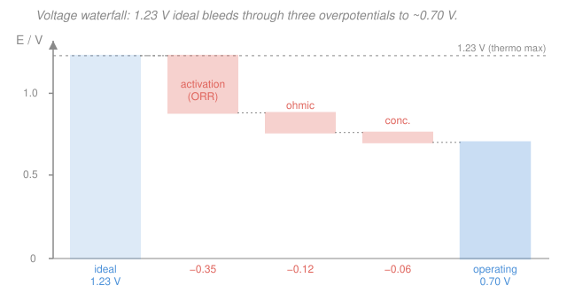

# Electrochemistry · Lesson 4.2: Fuel cells & electrolyzers

> ⏱ ~15 min · Module 4: Electrochemistry in the wild · Builds on: [1.4 Cell EMF, Gibbs & equilibrium](01-04-cell-emf-gibbs-equilibrium.md), [3.3 Mixed control: kinetics & transport](03-03-mixed-control-kinetics-transport.md), [`physical-chemistry` 1.3 Gibbs–Helmholtz energies](../../physical-chemistry/lessons/01-03-gibbs-helmholtz-energies.md) · Unlocks: [4.3 Corrosion & the mixed potential](04-03-corrosion-mixed-potential.md)

## Why this matters

A battery ([4.1](04-01-batteries-energy-density.md)) carries its reactants inside; when they're spent, it's dead. A **fuel cell** is the same galvanic cell with the tank moved *outside* — pump in fuel and it runs forever. That one change makes it the cleanest way to turn hydrogen back into electricity, and its mirror image, the **electrolyzer**, is how you make the hydrogen in the first place by splitting water. The headline is an efficiency story: a fuel cell converts chemical *free energy* straight to electrical work and is **not** shackled by the Carnot limit that caps every heat engine. But the ideal never arrives — the same overpotentials from Module 2–3 quietly eat the voltage. This lesson is the accounting: where every joule and every volt goes.

## The idea

Burn hydrogen in air and you get water, heat, and a bang. Route the *same* reaction through two separated electrodes instead, and the electrons are forced to travel through a wire to get from fuel to oxygen — that current is your power. Fuel in one side, air the other, water and electricity out. Nothing is consumed but the gases you feed it.

Two efficiencies stack up, and keeping them straight is the whole game:

- **How much of the fuel's energy is *available* as work at all?** Chemistry hands you $\Delta G$ (free energy, extractable as electricity) out of a total $\Delta H$ (the full heat of combustion). The rest, $T\Delta S$, is heat you can't turn into current. That ratio $\Delta G/\Delta H$ is the ceiling — and for hydrogen it's a generous 83%, with no Carnot factor in sight.
- **How much of *that* do you actually collect?** The cell's ideal voltage is 1.23 V, but the moment you draw current the voltage sags — sluggish oxygen chemistry, resistance, starved gas. You operate near 0.70 V, so you bank only $0.70/1.23 \approx 57\%$ of the available free energy.

Multiply them: even a perfect device loses half its fuel's usefulness before it leaves the box. Run the cell *backwards* — force current in to split water — and the same losses flip sign: now they *add* to the voltage you must pay. That asymmetry is why storing energy as hydrogen and getting it back is lossy in both directions.

## The formal version

**The hydrogen–oxygen cell.** The archetype fuel cell runs

$$\ce{H2 + 1/2 O2 -> H2O}, \qquad E^\circ = 1.23\ \mathrm{V}, \qquad n = 2,$$

split into half-reactions (acidic electrolyte):

$$\text{anode (oxidation):}\quad \ce{H2 -> 2H+ + 2e-}$$
$$\text{cathode (reduction):}\quad \ce{O2 + 4H+ + 4e- -> 2H2O}$$

*In words: hydrogen is torn apart into protons and electrons at the anode; the electrons run through your load and rejoin oxygen at the cathode to make water.* The $n = 2$ counts electrons per H₂ molecule.

**Thermodynamic (ideal) efficiency.** From [1.4](01-04-cell-emf-gibbs-equilibrium.md), the electrical work a cell can deliver is the Gibbs energy, $w_\text{elec}^\text{max} = -\Delta G = nFE^\circ$. The *total* energy released by the reaction is the enthalpy $\Delta H$ ([`physical-chemistry` 1.3](../../physical-chemistry/lessons/01-03-gibbs-helmholtz-energies.md)). The ideal efficiency is their ratio:

$$\boxed{\;\eta_\text{thermo} = \frac{\Delta G}{\Delta H} = \frac{-nFE^\circ}{\Delta H}\;}$$

*In words: of all the energy in the fuel, only the free-energy fraction is convertible to work; the rest, $T\Delta S = \Delta H - \Delta G$, is obligatory heat.* For H₂/O₂ (liquid water, 298 K): $\Delta G^\circ = -237\ \mathrm{kJ/mol}$, $\Delta H^\circ = -286\ \mathrm{kJ/mol}$, so

$$\eta_\text{thermo} = \frac{-237}{-286} \approx 0.83.$$

Crucially, **there is no Carnot factor** $(1 - T_c/T_h)$ here — a fuel cell converts chemical free energy *directly*, never routing it through a hot reservoir, so it sidesteps the heat-engine ceiling entirely. That's the deep reason fuel cells are attractive.

**Voltage efficiency.** The instant you draw current, the cell voltage drops below $E^\circ$ by the overpotentials of [3.3](03-03-mixed-control-kinetics-transport.md):

$$E_\text{load} = E^\circ - |\eta_\text{act}| - |\eta_\text{ohm}| - |\eta_\text{conc}|.$$

- **Activation** $\eta_\text{act}$: the barrier to electron transfer. The oxygen-reduction reaction (ORR) at the cathode is notoriously sluggish — its exchange current density $j_0$ ([2.2](02-02-activation-exchange-current.md)) is tiny, so it demands a large overpotential to run at any useful rate. This is the dominant loss.
- **Ohmic** $\eta_\text{ohm} = iR$: resistance of the electrolyte/membrane, linear in current.
- **Concentration** $\eta_\text{conc}$: gas can't diffuse to the catalyst fast enough at high current — the transport limit of Module 3.

The **voltage efficiency** is what fraction of the ideal voltage survives:

$$\boxed{\;\eta_V = \frac{E_\text{load}}{E^\circ}\;}$$

*In words: the ideal voltage is the pot of gold; the overpotentials are the tax; $\eta_V$ is what you take home.* At a typical $E_\text{load} = 0.70\ \mathrm{V}$: $\eta_V = 0.70/1.23 \approx 0.57$.

**Combined efficiency.** The efficiencies multiply (a third factor, **fuel utilization** $\eta_\text{fuel} \le 1$, accounts for unreacted gas swept out; take it $\approx 1$ for a clean estimate):

$$\eta_\text{cell} = \eta_\text{thermo}\times\eta_V\times\eta_\text{fuel} \approx 0.83 \times 0.57 \approx 0.47.$$

**Faradaic fuel accounting.** How much hydrogen does a given current burn? Faraday's law from [1.2](01-02-galvanic-electrolytic-cells-faraday.md): charge $Q = It$ carries $Q/F$ moles of electrons, and each H₂ supplies $n = 2$ of them:

$$\boxed{\;n_{\ce{H2}} = \frac{Q}{nF} = \frac{It}{nF}\;}$$

*In words: moles of fuel = charge delivered divided by (electrons per molecule × Faraday's constant), with $F = 96485\ \mathrm{C/mol}$.*

**The electrolyzer — the cell run backwards.** Reverse every arrow: force current *in* to drive

$$\ce{H2O -> H2 + 1/2 O2}, \qquad \text{applied } E > 1.23\ \mathrm{V}.$$

You must supply at least the reversible 1.23 V, **plus** the same overpotentials — but now they *add* to the required voltage instead of subtracting from a delivered one:

$$E_\text{applied} = E^\circ + |\eta_\text{act}| + |\eta_\text{ohm}| + |\eta_\text{conc}| \;>\; 1.23\ \mathrm{V}.$$

*In words: losses always cost you — they drag the fuel cell's output down and shove the electrolyzer's input up.* A **round-trip** (electrolyze water, store the H₂, later run it through the fuel cell) chains the two, and its electrical efficiency is the product. If the electrolyzer runs at $1.8\ \mathrm{V}$ and the fuel cell at $0.70\ \mathrm{V}$, then electricity-in to electricity-out is just the voltage ratio,

$$\eta_\text{round-trip} = \frac{E_\text{fc}}{E_\text{ez}} = \frac{0.70}{1.8} \approx 0.39,$$

because both legs pass the same charge $nF$ per mole of H₂.

## Picture

Read it left to right: the blue bar is the thermodynamic ceiling (1.23 V, set by $\Delta G$). Each coral step is a tax — the big one is the ORR activation overpotential, then a smaller ohmic drop, then a sliver of concentration loss. What's left standing on the right, ~0.70 V, is what your load actually sees. The height ratio of the right bar to the guide line *is* $\eta_V$.

## Worked examples

**Example 1 (mechanical — the two efficiencies).** A H₂/O₂ cell delivers current at $E_\text{load} = 0.65\ \mathrm{V}$. Find $\eta_\text{thermo}$, $\eta_V$, and the combined efficiency.

Thermodynamic ceiling, independent of operation:

$$\eta_\text{thermo} = \frac{\Delta G^\circ}{\Delta H^\circ} = \frac{-237}{-286} \approx 0.83.$$

Voltage efficiency at this load:

$$\eta_V = \frac{E_\text{load}}{E^\circ} = \frac{0.65}{1.23} \approx 0.53.$$

Combined (taking $\eta_\text{fuel}\approx 1$):

$$\eta_\text{cell} \approx 0.83 \times 0.53 \approx 0.44.$$

Drawing harder (lower $E_\text{load}$) buys more current but a worse efficiency — the classic power-vs-efficiency tradeoff.

**Example 2 (why you'd care — fuel burned for a real load).** A fuel cell powers a $0.65\ \mathrm{V}$, $20\ \mathrm{A}$ load for 30 minutes. How much H₂ does it consume, and how much water does it make?

Charge delivered: $Q = It = 20 \times (30 \times 60) = 20 \times 1800 = 36{,}000\ \mathrm{C}$. Then

$$n_{\ce{H2}} = \frac{Q}{nF} = \frac{36{,}000}{2 \times 96485} = \frac{36{,}000}{192{,}970} \approx 0.187\ \mathrm{mol}.$$

The stoichiometry $\ce{H2 + 1/2 O2 -> H2O}$ makes one mole of water per mole of H₂, so $\approx 0.187\ \mathrm{mol}$ of water ($\approx 3.4\ \mathrm{g}$). Notice the *voltage* never entered the fuel count — Faraday's law ties moles to **charge** alone; the voltage only sets how much *energy* those electrons carry.

## Watch out

- **You might think a fuel cell obeys the Carnot limit.** It doesn't — it never uses a temperature difference. Its ceiling is $\Delta G/\Delta H$, a *chemical* limit, which for H₂ (0.83) beats a car engine's Carnot-bound thermal efficiency handily. Confusing the two is the single most common fuel-cell error.
- **You might divide the operating voltage by the wrong reference.** $\eta_V = E_\text{load}/E^\circ$ uses the reversible $E^\circ = 1.23\ \mathrm{V}$, not the thermoneutral 1.48 V (which corresponds to $\Delta H$). Mixing references double-counts the thermodynamic loss you already captured in $\eta_\text{thermo}$.
- **You might expect the overpotentials to help the electrolyzer.** They never help anyone: they *lower* a fuel cell's output and *raise* an electrolyzer's input. A "loss" is energy leaving as heat regardless of which direction the cell runs.

## One-liner

> A fuel cell's efficiency is two ceilings multiplied — the Carnot-free thermodynamic fraction $\Delta G/\Delta H \approx 0.83$ and the voltage fraction $E_\text{load}/E^\circ \approx 0.57$ that the overpotentials leave standing — and the electrolyzer pays those same overpotentials in reverse.

## Problems

**P1 (🟢)** For the H₂/O₂ cell with $E^\circ = 1.23\ \mathrm{V}$, $n = 2$, and $\Delta H^\circ = -286\ \mathrm{kJ/mol}$: compute $\Delta G^\circ = -nFE^\circ$ (in kJ/mol) and the thermodynamic efficiency $\eta_\text{thermo} = \Delta G^\circ/\Delta H^\circ$.

**P2 (🟡)** The same cell operates at $E_\text{load} = 0.72\ \mathrm{V}$. (a) Find the voltage efficiency $\eta_V$ and a combined efficiency estimate (use $\eta_\text{thermo} \approx 0.83$, $\eta_\text{fuel} \approx 1$). (b) It delivers $5.0\ \mathrm{A}$ for 20 minutes — how many moles of H₂ does it burn?

**P3 (🔴, Boss-4)** A H₂/O₂ cell has $E^\circ = 1.23\ \mathrm{V}$, $n = 2$, $\Delta H^\circ = -286\ \mathrm{kJ/mol}$.
(a) Confirm $\Delta G^\circ \approx -237\ \mathrm{kJ/mol}$ and $\eta_\text{thermo} \approx 0.83$.
(b) Operating at $0.70\ \mathrm{V}$, find $\eta_V$ and the combined efficiency.
(c) Delivering $1.0\ \mathrm{A}$ for $1.0\ \mathrm{h}$, find the moles of H₂ consumed, and identify what the $1.23 - 0.70 = 0.53\ \mathrm{V}$ shortfall physically *is*.

Solutions

**P1** Gibbs energy from the cell voltage:

$$\Delta G^\circ = -nFE^\circ = -(2)(96485)(1.23) = -237{,}353\ \mathrm{J/mol} \approx -237\ \mathrm{kJ/mol}.$$

Thermodynamic efficiency:

$$\eta_\text{thermo} = \frac{\Delta G^\circ}{\Delta H^\circ} = \frac{-237}{-286} \approx 0.83.$$

*Check.* Both energies are negative (exothermic, spontaneous), so their ratio is positive and less than 1, as an efficiency must be. The $17\%$ shortfall, $286 - 237 = 49\ \mathrm{kJ/mol}$, is the $T\Delta S$ heat that can't become work. ✓

**P2** (a) Voltage efficiency:

$$\eta_V = \frac{E_\text{load}}{E^\circ} = \frac{0.72}{1.23} \approx 0.585.$$

Combined: $\eta_\text{cell} \approx \eta_\text{thermo}\times\eta_V \approx 0.83 \times 0.585 \approx 0.49$.

(b) Charge: $Q = It = 5.0 \times (20 \times 60) = 5.0 \times 1200 = 6000\ \mathrm{C}$. Then

$$n_{\ce{H2}} = \frac{Q}{nF} = \frac{6000}{2 \times 96485} = \frac{6000}{192{,}970} \approx 0.031\ \mathrm{mol}.$$

*Check.* $\eta_V$ sits between the operating and ideal voltages' ratio, as it must; and the fuel count used only $Q$ and $n$, not the voltage. ✓

**P3** (a) $\Delta G^\circ = -nFE^\circ = -(2)(96485)(1.23) = -237{,}353\ \mathrm{J/mol} \approx -237\ \mathrm{kJ/mol}$, so $\eta_\text{thermo} = 237/286 \approx 0.83$. ✓

(b) Voltage efficiency at $0.70\ \mathrm{V}$:

$$\eta_V = \frac{0.70}{1.23} \approx 0.57, \qquad \eta_\text{cell} \approx 0.83 \times 0.57 \approx 0.47.$$

(c) Charge over one hour: $Q = It = (1.0)(3600) = 3600\ \mathrm{C}$. Moles of H₂:

$$n_{\ce{H2}} = \frac{Q}{nF} = \frac{3600}{2 \times 96485} = \frac{3600}{192{,}970} \approx 0.019\ \mathrm{mol}.$$

The $0.53\ \mathrm{V}$ shortfall is the **sum of the overpotentials**, $|\eta_\text{act}| + |\eta_\text{ohm}| + |\eta_\text{conc}|$ — dominated by the sluggish oxygen-reduction activation loss, plus the ohmic $iR$ drop and a small concentration term. That voltage times the charge, $0.53 \times 3600 \approx 1.9\ \mathrm{kJ}$, is electrical work that left the cell as **heat** rather than reaching the load. (This is exactly the voltage waterfall in the figure.)

*Check.* $0.019\ \mathrm{mol}$ of H₂ over an hour at 1 A is a trickle, as expected for a single small cell; and the overpotential heat plus the delivered work, $0.53 + 0.70 = 1.23\ \mathrm{V}$ worth, sums back to the ideal voltage — the volts are conserved. ✓

## Flashback

**From Lesson 1.4 (Cell EMF, Gibbs & equilibrium):** A galvanic cell has standard EMF $E^\circ = 0.46\ \mathrm{V}$ with $n = 2$. Using $\Delta G^\circ = -nFE^\circ$, find the standard Gibbs energy of the cell reaction in kJ/mol. Is the reaction spontaneous as written?

Solution

$$\Delta G^\circ = -nFE^\circ = -(2)(96485)(0.46) = -88{,}766\ \mathrm{J/mol} \approx -89\ \mathrm{kJ/mol}.$$

A positive EMF gives a negative $\Delta G^\circ$, so **yes, the reaction is spontaneous as written** — the cell drives current on its own, no external voltage needed. *Check.* Same $-nFE$ machinery the fuel cell uses; here it just tells us the direction of spontaneity rather than an efficiency. ✓

## Connections

- **Backward:** the ideal voltage and its link to free energy is [1.4](01-04-cell-emf-gibbs-equilibrium.md)'s $\Delta G = -nFE$, the fuel count is [1.2](01-02-galvanic-electrolytic-cells-faraday.md)'s Faraday's law, and the voltage sag is the overpotential mix of [3.3](03-03-mixed-control-kinetics-transport.md) — with the ORR's dominance tracing to the tiny exchange current density $j_0$ of [2.2](02-02-activation-exchange-current.md).
- **Forward:** [4.3 Corrosion & the mixed potential](04-03-corrosion-mixed-potential.md) takes the same competing anodic and cathodic reactions but lets them short-circuit *on a single piece of metal* — a fuel cell you never wanted, eating the metal instead of hydrogen.
- **Sideways (physical chemistry):** the whole efficiency ceiling rides on the $\Delta G$–$\Delta H$–$T\Delta S$ split from [`physical-chemistry` 1.3](../../physical-chemistry/lessons/01-03-gibbs-helmholtz-energies.md); the fuel cell is where that thermodynamic bookkeeping becomes a voltage you can read on a meter, and its Carnot-free nature is the sharpest contrast between electrochemical and heat-engine energy conversion.
