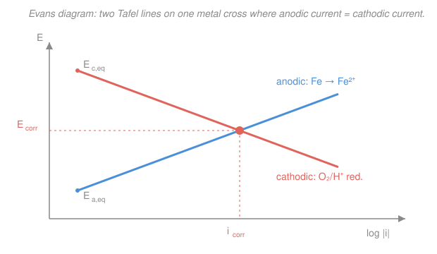

# Electrochemistry · Lesson 4.3: Corrosion & the mixed potential

> ⏱ ~15 min · Module 4: Electrochemistry in the wild · Builds on: [1.3 Electrode potentials & the series](01-03-electrode-potentials-she-series.md), [2.4 Overpotential & Tafel analysis](02-04-overpotential-tafel-analysis.md), [3.3 Mixed control](03-03-mixed-control-kinetics-transport.md) · Unlocks: 4.4 (electrodeposition & sensors)

## Why this matters

Rust is a battery you never wanted. Corrosion quietly eats roughly 3–4% of GDP every year — bridges, pipelines, ship hulls, rebar in concrete — and it is *entirely* an electrochemistry problem. The remarkable thing is that a single, isolated piece of iron sitting in a puddle, with no wire and no external cell, is running a galvanic cell against *itself*. Once you see that, the whole toolkit you already built — the series (1.3), Tafel lines (2.4), Faraday's law (1.2) — predicts how fast it dies and exactly how to stop it. And "stopping it" is a design discipline that lives at the border with materials science: pick the alloy, grow the right oxide, bolt on the right sacrificial metal.

## The idea

Drop a bar of iron into acid. Iron atoms want to give up electrons — $\ce{Fe -> Fe^2+ + 2e-}$ — but electrons can't just pile up in the metal. Something has to *consume* them. In acid, protons do: $\ce{2H+ + 2e- -> H2}$. So on **one surface**, two reactions run at once: metal dissolving at some spots (the **anodic** reaction), protons being reduced at others (the **cathodic** reaction), with the electrons flowing through the metal itself from one to the other. It's a short-circuited galvanic cell — anode and cathode welded together, no external wire needed.

Because there's no wire, there's no voltmeter forcing a potential. The surface instead **floats** to whatever single potential makes the books balance: every electron released by dissolving iron must be swallowed by the cathodic reaction. That self-consistent potential is the **corrosion potential** $E_\text{corr}$, and the common current sloshing between the two reactions is the **corrosion current** $i_\text{corr}$. That current *is* the rusting rate, in disguise — feed it through Faraday's law (1.2) and you get millimeters of steel lost per year.

The picture that makes this quantitative is the **Evans diagram**: draw the anodic Tafel line and the cathodic Tafel line (both from 2.4) on one plot of potential versus $\log|i|$, and read $E_\text{corr}$ and $i_\text{corr}$ straight off where they cross.

## The formal version

**Two coupled half-reactions on one surface.** The anodic (oxidation) reaction dissolves the metal,
$$\ce{Fe -> Fe^2+ + 2e-} \qquad(\text{anodic, current } i_a > 0),$$
and a cathodic (reduction) reaction consumes the electrons. Which one depends on the environment:
$$\ce{2H+ + 2e- -> H2}\quad(\text{acid}), \qquad \ce{O2 + 2H2O + 4e- -> 4OH-}\quad(\text{neutral, aerated}).$$
*In words: iron always tries to dissolve; whether it succeeds depends on there being a partner reaction hungry for the electrons.* The second one — **oxygen reduction** — is why ordinary rusting needs **both water and air**: no dissolved $\ce{O2}$, no cathodic partner, no corrosion. A drop of water on steel rusts fastest at its *edge*, where oxygen is plentiful.

**Mixed-potential theory (the charge balance).** With no external wire, no net current leaves the metal, so the total oxidation current must equal the total reduction current:
$$\boxed{\,|i_a(E_\text{corr})| = |i_c(E_\text{corr})| \equiv i_\text{corr}\,}$$
*In words: the surface settles at the one potential $E_\text{corr}$ where iron dissolves exactly as fast as the cathodic reaction mops up the electrons.* $E_\text{corr}$ is a **mixed** potential — it belongs to neither half-reaction's equilibrium; it sits *between* them, driving each away from its own equilibrium by an overpotential (2.4). The shared magnitude $i_\text{corr}$ is the corrosion current.

**Reading it off an Evans diagram.** Near its equilibrium each reaction obeys a Tafel line (2.4) — potential linear in $\log|i|$:
$$E = E_{a,\text{eq}} + b_a\log\frac{|i|}{i_{0,a}} \quad(\text{anodic, slope } b_a>0), \qquad E = E_{c,\text{eq}} - b_c\log\frac{|i|}{i_{0,c}} \quad(\text{cathodic, slope } b_c>0).$$
Plot both on axes of $E$ (vertical) vs $\log|i|$ (horizontal): the anodic line rises to the right, the cathodic line falls. **Their intersection is $(\log i_\text{corr},\, E_\text{corr})$** — the only point satisfying the charge balance. *In words: the crossing point of the two Tafel lines is the operating point of the corroding metal.* The lower the crossing sits on the current axis, the slower the metal dies.

**From current to rate — Faraday (1.2).** A current density $i_\text{corr}$ (amperes per cm²) removes metal at a mass rate per area $\dot m = i_\text{corr}\,M/(nF)$, and dividing by density $\rho$ gives a **penetration rate**:
$$\boxed{\,\text{CR} = \frac{i_\text{corr}\,M}{nF\rho}\,}$$
with $M$ the molar mass (g/mol), $n$ electrons per metal atom, $F=96485\ \mathrm{C/mol}$, $\rho$ the density (g/cm³). *In words: corrosion current times the electrochemical equivalent, per unit volume, is how fast the surface recedes.*

**Galvanic couples (1.3).** Wire two *different* metals together in an electrolyte and the one lower in the series — the more **active** (more negative $E$) — is forced to be the anode and corrodes *preferentially*, while the nobler metal is protected. This is a threat (steel bolt in a copper plate rots) and a gift (deliberately sacrifice a cheap active metal to save an expensive one).

**Passivation.** Some metals — Al, Cr, stainless steel, Ti — grow a thin, adherent oxide film that throttles metal dissolution. On the Evans diagram the anodic line hits a wall: above a critical potential the anodic current density *collapses* by several orders of magnitude into a **passive** region. That slams $i_\text{corr}$ down and is why aluminum foil doesn't dissolve and stainless is stainless.

## Picture

## Worked examples

**Example 1 (read the crossing).** Suppose on one steel surface the anodic line is $E = (0.060\ \mathrm{V})\log|i|$ and the cathodic (oxygen reduction) line is $E = -(0.090\ \mathrm{V})\log|i| - 0.75\ \mathrm{V}$, with $i$ in $\mathrm{A/cm^2}$. Setting them equal (the charge balance):
$$0.060\,X = -0.090\,X - 0.75 \;\Longrightarrow\; 0.150\,X = -0.75 \;\Longrightarrow\; X=\log i_\text{corr} = -5.$$
So $i_\text{corr} = 10^{-5}\ \mathrm{A/cm^2} = 10\ \mathrm{\mu A/cm^2}$ and $E_\text{corr} = 0.060(-5) = -0.30\ \mathrm{V}$. The steel floats at $-0.30$ V vs SHE and eats itself at $10\ \mathrm{\mu A/cm^2}$ — no wire, no cell, just geometry.

**Example 2 (why oxygen throttles the rate).** In *de-aerated* neutral water there's almost no $\ce{O2}$, so the cathodic reaction is starved — its Tafel line is pushed far to the *left* (tiny currents), often into transport control (3.3): a **limiting current** ceiling set by how fast oxygen can diffuse to the surface. The anodic line is unchanged, so the crossing slides left to a much smaller $i_\text{corr}$. This is exactly why the *cathodic* reaction, not the eager iron, is usually the bottleneck: rusting is paced by oxygen supply. Deaerate the water (boiler feedwater treatment) and steel barely corrodes.

## Watch out

- **You might think the metal picks a side — anode *or* cathode.** It's both, everywhere, all the time. Anodic and cathodic patches coexist and even swap places on one surface; $E_\text{corr}$ is the compromise. "Local cells" set up wherever composition, stress, or oxygen concentration varies (that's why crevices and waterlines corrode fastest).
- **You might read $E_\text{corr}$ as an equilibrium potential.** It isn't — it's a *mixed* potential where **both** reactions run off-equilibrium. Neither the Nernst $E$ of iron nor of oxygen equals $E_\text{corr}$; it sits between them. A more noble $E_\text{corr}$ does **not** guarantee slow corrosion — $i_\text{corr}$ (the crossing's *horizontal* position), not $E_\text{corr}$ (its height), is the rate.
- **You might expect a sacrificial anode to be the strongest metal.** Backwards: you want the *more active* (more negative $E$) metal — zinc or magnesium — precisely because it's eager to dissolve and take the hit for the steel.

## One-liner

> Corrosion is a metal short-circuiting a galvanic cell against itself: it floats to the mixed potential $E_\text{corr}$ where anodic dissolution balances the cathodic reaction, and the crossing current $i_\text{corr}$ — read off the Evans diagram, converted by Faraday — is the rate you're fighting.

## Problems

**P1 (🟢)** On a corroding zinc surface the anodic Tafel line is $E=(0.040\ \mathrm{V})\log|i| - 0.62\ \mathrm{V}$ and the cathodic (hydrogen evolution) line is $E=-(0.100\ \mathrm{V})\log|i| - 1.20\ \mathrm{V}$, with $i$ in $\mathrm{A/cm^2}$. Find $E_\text{corr}$ and $i_\text{corr}$ at their intersection, and state in one sentence each what the two coordinates physically represent.

**P2 (🟡)** The steel of Example 1 corrodes at $i_\text{corr}=10\ \mathrm{\mu A/cm^2}$. Using Faraday's law (1.2), convert this to a penetration rate in mm/year. For iron take $M=55.85\ \mathrm{g/mol}$, $n=2$, $\rho=7.87\ \mathrm{g/cm^3}$; one year is $3.156\times10^{7}\ \mathrm{s}$.

**P3 (🔴)** A steel ship hull carries a bronze (mostly copper) propeller. Standard potentials: $E^\circ(\ce{Zn^2+/Zn})=-0.76\ \mathrm{V}$, $E^\circ(\ce{Fe^2+/Fe})=-0.44\ \mathrm{V}$, $E^\circ(\ce{Cu^2+/Cu})=+0.34\ \mathrm{V}$. (a) In the steel–bronze couple, which metal corrodes, and why? (b) Design a **cathodic-protection** scheme with a sacrificial anode — pick the metal and explain what happens to the hull's potential and to $i_\text{corr}$. (c) Stainless steel resists this by **passivation**; explain in Evans-diagram terms how a passive oxide film lowers $i_\text{corr}$. (Connect to materials science.)

Solutions

**P1** Set the two lines equal (the charge balance $|i_a|=|i_c|$). Write $X=\log|i|$:
$$0.040\,X - 0.62 = -0.100\,X - 1.20 \;\Longrightarrow\; 0.140\,X = -0.58 \;\Longrightarrow\; X = -4.14.$$
So $i_\text{corr} = 10^{-4.14} \approx 7.2\times10^{-5}\ \mathrm{A/cm^2} \approx 72\ \mathrm{\mu A/cm^2}$, and
$$E_\text{corr} = 0.040(-4.14) - 0.62 = -0.166 - 0.62 = -0.79\ \mathrm{V}.$$
*(Check via the cathodic line: $-0.100(-4.14)-1.20 = 0.414-1.20 = -0.79\ \mathrm{V}$ ✓.)*
- $E_\text{corr}=-0.79\ \mathrm{V}$: the single potential the isolated zinc surface floats to with no external current — the mixed potential where dissolution and $\ce{H2}$ evolution proceed at equal rate.
- $i_\text{corr}\approx72\ \mathrm{\mu A/cm^2}$: the common (balanced) current of the two reactions — the corrosion rate, ready to be turned into mm/yr by Faraday.

**P2** Penetration rate $\text{CR}=i_\text{corr}\,M/(nF\rho)$. With $i_\text{corr}=10^{-5}\ \mathrm{A/cm^2}$:
$$\text{CR} = \frac{(10^{-5}\ \mathrm{C\,s^{-1}cm^{-2}})(55.85\ \mathrm{g\,mol^{-1}})}{(2)(96485\ \mathrm{C\,mol^{-1}})(7.87\ \mathrm{g\,cm^{-3}})}.$$
Numerator: $10^{-5}\times55.85 = 5.585\times10^{-4}$. Denominator: $2\times96485\times7.87 = 1.519\times10^{6}$. So
$$\text{CR} = \frac{5.585\times10^{-4}}{1.519\times10^{6}} = 3.68\times10^{-10}\ \mathrm{cm/s}.$$
Per year: $3.68\times10^{-10}\times3.156\times10^{7} = 1.16\times10^{-2}\ \mathrm{cm/yr} = 0.116\ \mathrm{mm/yr}\approx 116\ \mathrm{\mu m/yr}$.
*(Check against the engineers' shortcut $\text{CR(mm/yr)}=3.27\times10^{-3}\,i_\text{corr}(\mathrm{\mu A/cm^2})\,\tfrac{M/n}{\rho} = 3.27\times10^{-3}\times10\times\tfrac{27.9}{7.87}=0.116\ \mathrm{mm/yr}$ ✓.)* A bare steel plate here loses about 0.12 mm/yr — over a decade, more than a millimeter gone. Typical, and why coatings matter.

**P3**
(a) **The steel corrodes.** Iron ($E^\circ=-0.44\ \mathrm{V}$) is more active than copper ($+0.34\ \mathrm{V}$), i.e. lower in the series (1.3). Wired together through seawater, the couple forces the more active metal to be the **anode**: iron dissolves preferentially while the nobler bronze acts as the cathode and is protected. Worse, the large bronze cathode drives a high cathodic current onto a possibly small anodic area — an unfavorable area ratio that concentrates the damage on the steel.

(b) **Sacrificial anode: attach zinc** (or magnesium) blocks to the hull. Zinc ($E^\circ=-0.76\ \mathrm{V}$) is *more active than iron*, so in the new three-metal system zinc becomes the anode and dissolves, while the steel hull is driven to be a **cathode**. On the Evans diagram, coupling to zinc pulls the hull's potential *down* toward zinc's, into a region where iron's anodic dissolution current is negligible — the hull's own $i_\text{corr}$ drops toward zero. The zinc corrodes away and is bolted on to be replaced periodically. (Alternative: **impressed-current** protection — a DC supply pushes electrons onto the hull to force it cathodic, using an inert anode.) This is the classic "sacrificial zinc" on ship hulls and buried pipelines.

(c) **Passivation.** Chromium in stainless steel grows a thin, dense $\ce{Cr2O3}$-rich oxide film. On the Evans diagram the anodic Tafel line no longer rises without limit: above a critical potential the anodic current density **collapses by several orders of magnitude** into a flat passive region (the film blocks metal ions from leaving). Since $i_\text{corr}$ is set by where the anodic and cathodic curves cross, and the cathodic curve now intersects the metal *inside* that passive plateau, the crossing current — and hence the corrosion rate — plummets. **Materials-science bridge:** this is alloy-and-oxide design — choosing composition (enough Cr), microstructure, and film chemistry so the passive layer is stable and self-healing; the same thinking protects aluminum ($\ce{Al2O3}$) and titanium. See the [materials-science syllabus](../../materials-science/syllabus.md).

## Flashback

**From Lesson 2.4 (Overpotential & Tafel analysis):** A cathodic reaction (oxygen reduction on a catalyst) has an exchange current density $i_0 = 10^{-6}\ \mathrm{A/cm^2}$ and a Tafel slope $b = 118\ \mathrm{mV/decade}$. In the Tafel regime, what cathodic overpotential $\eta$ is needed to draw a current density of $10^{-3}\ \mathrm{A/cm^2}$? (Fresh variant — cathodic branch.)

Solution

In the Tafel regime the overpotential is linear in the log of the current ratio: $|\eta| = b\log(|i|/i_0)$. Here
$$\frac{|i|}{i_0} = \frac{10^{-3}}{10^{-6}} = 10^{3}, \qquad \log(10^{3}) = 3,$$
so
$$|\eta| = (0.118\ \mathrm{V})(3) = 0.354\ \mathrm{V}.$$
Because it's a cathodic (reduction) overpotential, $\eta \approx -0.354\ \mathrm{V}$ — you must push the electrode about 354 mV *below* its equilibrium potential to drive that current. *Check:* three decades of current cost exactly three Tafel slopes, and $3\times118\ \mathrm{mV}=354\ \mathrm{mV}$ ✓. This is the same Tafel geometry whose two lines you just intersected to find $E_\text{corr}$.

## Connections

- **Backward:** this lesson fuses three earlier tools — the electrochemical **series** (1.3) decides which metal in a couple is the anode; the **Tafel lines** (2.4) are the two curves you intersect; **Faraday's law** (1.2) turns $i_\text{corr}$ into mm/yr. And Example 2's oxygen-starved cathode is **mixed control** (3.3) — the cathodic branch capped by a diffusion-limited current.
- **Forward:** [4.4 (electrodeposition & sensors)](04-04-electrodeposition-sensors.md) is corrosion run in reverse — deliberately *depositing* metal by driving the electrode cathodic, the same potential-control logic that underlies impressed-current protection here.
- **Sideways (materials science):** corrosion resistance is an alloy- and oxide-design problem — passive films, sacrificial coatings (galvanized = zinc-coated steel), and grain/stress control of local cells. The bridge to the [materials-science syllabus](../../materials-science/syllabus.md) is where "why does this alloy last?" gets answered.
