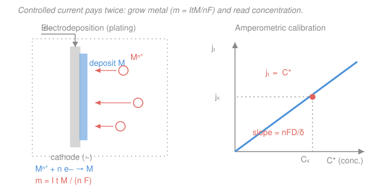

# Electrochemistry · Lesson 4.4: Electrodeposition & electroanalytical sensors

> ⏱ ~15 min · Module 4: Electrochemistry in the wild · Builds on: [1.2 Galvanic & electrolytic cells, Faraday](01-02-galvanic-electrolytic-cells-faraday.md), [1.5 Nernst equation & concentration cells](01-05-nernst-equation-concentration-cells.md), [3.2 Diffusion-limited current](03-02-diffusion-limited-current-concentration-overpotential.md) · Unlocks: — this is the final lesson; it closes the course and points forward

## Why this matters

Two of electrochemistry's biggest industrial payoffs are the same physics run in opposite directions. **Push** current through an interface and you can grow matter atom by atom — that's electroplating the chrome on a bumper, refining copper to 99.99% purity, or electroforming a seamless nickel mold. **Watch** the interface at rest, or at a fixed voltage, and it becomes a measuring instrument — the pH meter on the bench, the Clark electrode in a blood-gas analyzer, the glucose strip a diabetic uses fifty times a week. Every one of these is just Faraday, Nernst, and the diffusion-limited current — the three equations you already own — wearing a lab coat.

## The idea

**Plating.** Dip a metal object (the cathode) into a bath of metal ions and drive electrons into it. Each ion that reaches the surface grabs electrons and sticks as a metal atom. Charge is atoms: count the electrons you pushed and you've counted the atoms you deposited. That is Faraday's law, nothing more. Two practical wrinkles: not every electron ends up in your metal (some split water into hydrogen instead — **wasted charge**), and the metal never coats a lumpy shape perfectly evenly (edges and near faces get more, recesses get less).

**Sensing.** An electrode "feels" the solution two different ways, and the whole art is knowing which one you're using.
- Let **no current flow** and just measure the electrode's *voltage*. The Nernst equation says that voltage reports the **activity** (effective concentration) of one ion. Build the electrode to respond to only one species and you have an **ion-selective electrode** — the pH probe is the famous one.
- Or **hold the voltage fixed** and measure the *current*. Crank the voltage far enough that every analyte molecule that reaches the surface reacts instantly; then the current is throttled by how fast molecules diffuse in — which is set by their concentration. Current becomes a concentration meter.

Potential tells you activity; current tells you concentration. Same electrode, two philosophies.

## The formal version

### Electrodeposition

The cathode reaction is a reduction, $\ce{M^n+ + n e- -> M}$, with $n$ the electrons per metal atom (e.g. $n=2$ for $\ce{Cu^2+}$). Faraday's law from [1.2](01-02-galvanic-electrolytic-cells-faraday.md) gives the deposited mass:

$$m = \frac{Q\,M}{nF} = \frac{I\,t\,M}{nF},$$

where $Q = It$ is the charge (coulombs) for constant current $I$ (amperes) over time $t$ (seconds), $M$ is the molar mass (g/mol), and $F = 96485\ \mathrm{C/mol}$ is Faraday's constant. *In words: mass deposited is charge divided by the charge one mole of metal needs.*

**Current efficiency** $\varepsilon$ corrects for charge that went to side reactions (usually $\ce{2H+ + 2e- -> H2}$ in acidic baths):

$$m = \varepsilon\,\frac{I\,t\,M}{nF}, \qquad \varepsilon = \frac{\text{charge into the wanted deposit}}{\text{total charge passed}}\le 1.$$

*In words: only the fraction $\varepsilon$ of your electrons became metal; the rest fizzed off as gas.*

**Throwing power** is the qualitative partner: how *uniformly* the bath coats a recessed or complex shape. It improves when the deposition is limited by kinetics or bath resistance rather than by geometry, and additives ("levelers," "brighteners") are dosed to even out the current distribution so hidden corners plate as thickly as exposed faces. Three uses to name: **electroplating** (thin functional/decorative coat), **electrorefining** (dissolve an impure anode, redeposit pure metal at the cathode), **electroforming** (grow a thick free-standing part on a mandrel, then release it).

### Electroanalytical sensors

**Potentiometric (zero current).** Measure the open-circuit potential of an *indicator* electrode against a *reference*. For an electrode responsive to ion $i$ of charge $z_i$ and activity $a_i$, the Nernst equation from [1.5](01-05-nernst-equation-concentration-cells.md) gives

$$E = \text{const} + \frac{2.303\,RT}{z_i F}\,\log a_i \;=\; \text{const} + \frac{0.0592}{z_i}\,\log a_i \ \ (\text{V, at } 298\,\mathrm{K}).$$

*In words: the voltage moves a fixed number of millivolts for every tenfold change in the ion's activity.* For the **pH glass electrode**, $z_i = +1$ for $\ce{H+}$, so the slope is $0.0592\ \mathrm{V}$ per decade of $\ce{H+}$ activity — i.e. **59 mV per pH unit**. Other **ion-selective electrodes (ISEs)** target $\ce{F-}$, $\ce{K+}$, $\ce{Ca^2+}$, $\ce{NO3-}$, etc., each with slope $0.0592/z_i$.

This reading is only meaningful against a **stable reference electrode** — one whose potential never moves, so the whole measured voltage change belongs to the indicator. That's the $\ce{Ag/AgCl}$ or saturated calomel electrode from [1.3](01-03-electrode-potentials-she-series.md): a fixed half-cell held at constant potential by a fixed chloride activity.

**Amperometric (fixed potential).** Apply a potential past the point where the analyte reacts on arrival, and read the **diffusion-limited current** from [3.2](03-02-diffusion-limited-current-concentration-overpotential.md):

$$j_L = \frac{n F D\, C^*}{\delta} \;\propto\; C^*,$$

where $D$ is the analyte's diffusion coefficient, $C^*$ its bulk concentration, and $\delta$ the diffusion-layer thickness. *In words: when every molecule reacts the instant it arrives, the current is set entirely by the delivery rate — which is proportional to concentration.* Because $j_L \propto C^*$, a single calibration point turns current into a concentration readout. The **Clark oxygen electrode** does this for dissolved $\ce{O2}$ ($\ce{O2 + 4H+ + 4e- -> 2H2O}$ at a held cathode); **glucose sensors** do it enzyme-coupled — glucose oxidase converts glucose to a species (e.g. $\ce{H2O2}$) whose diffusion-limited current is measured.

**The contrast in one line:** potentiometric maps *potential $\to$ activity* through Nernst (logarithmic, zero current); amperometric maps *current $\to$ concentration* through the limiting current (linear, fixed potential).

## Picture

## Worked examples

**Example 1 (plating with a side reaction).** You copper-plate a part in an acidic $\ce{CuSO4}$ bath at $I = 2.0\ \mathrm{A}$ for $t = 1800\ \mathrm{s}$ (30 min). For copper $n = 2$, $M = 63.5\ \mathrm{g/mol}$. At 100% efficiency the deposit would be

$$m_{100} = \frac{ItM}{nF} = \frac{2.0 \times 1800 \times 63.5}{2 \times 96485} = \frac{228600}{192970} = 1.185\ \mathrm{g}.$$

But the bath runs at $\varepsilon = 92\%$ because some current makes $\ce{H2}$. The real deposit is $m = 0.92 \times 1.185 = 1.09\ \mathrm{g}$. The missing $0.095\ \mathrm{g}$ of copper is the price of the $8\%$ of charge that bubbled off as hydrogen — a loss you can now *name and compute*, not just shrug at.

**Example 2 (reading a glucose sensor).** An amperometric glucose sensor is calibrated: a $5.0\ \mathrm{mM}$ standard gives a steady-state current of $120\ \mathrm{nA}$. Because $i_L \propto C^*$, the calibration slope is $120/5.0 = 24\ \mathrm{nA/mM}$. A patient sample reads $78\ \mathrm{nA}$. Then

$$C^* = \frac{78\ \mathrm{nA}}{24\ \mathrm{nA/mM}} = 3.25\ \mathrm{mM}.$$

No thermodynamics, no logarithm — just a straight line through the origin, exactly the $j_L \propto C^*$ of [3.2](03-02-diffusion-limited-current-concentration-overpotential.md). Contrast that with a pH probe, where a factor-of-ten change in $\ce{H+}$ moves the reading only 59 mV: the sensing philosophy is completely different.

## Watch out

- **You might think plating time and current are interchangeable knobs for quality.** They set the *amount* ($m \propto It$), but the *evenness* is throwing power — a geometry-and-additives problem. Doubling the current can plate a lumpier part, not a better one.
- **You might report a potentiometric reading as a concentration.** Nernst gives **activity**, not concentration; the two diverge in concentrated or high-ionic-strength solutions (activity coefficient $< 1$, an idea from physical chemistry's fugacity/activity treatment). Calibrate against standards of matched ionic strength.
- **You might forget the reference electrode is doing half the work.** A potentiometric reading is a *difference* of two potentials; if the reference drifts, your pH drifts with it, and you'll blame the glass. A dying reference is the most common ISE failure.
- **You might confuse the two current regimes.** Amperometric sensing needs the *diffusion-limited* plateau; if the applied potential is too small you're in the kinetically-controlled foot of the wave and the current no longer reads concentration cleanly.

## One-liner

> Push current and Faraday grows metal ($m = \varepsilon ItM/nF$); watch potential and Nernst reads activity (59 mV/decade); hold potential and the limiting current reads concentration ($j_L \propto C^*$).

## Problems

**P1 (🟢)** You nickel-plate a part from a bath at $I = 3.0\ \mathrm{A}$ for $t = 20\ \mathrm{min}$. Nickel deposits as $\ce{Ni^2+ + 2e- -> Ni}$ ($n = 2$, $M = 58.7\ \mathrm{g/mol}$). The bath runs at $88\%$ current efficiency. Find the mass of nickel deposited, and the mass of charge "lost" to side reactions (expressed as the extra nickel you *would* have gotten at 100%).

**P2 (🟡)** A Clark oxygen electrode is calibrated so that air-saturated water, $[\ce{O2}] = 0.26\ \mathrm{mM}$, gives a limiting current of $200\ \mathrm{nA}$. Dipped in a bioreactor it reads $115\ \mathrm{nA}$. Using $j_L \propto C^*$, find the dissolved oxygen concentration. Why does this method not need to know $D$ or $\delta$ once calibrated?

**P3 (🔴)** You must (a) continuously log the fluoride concentration in a drinking-water line, and (b) monitor dissolved oxygen in a fermenter. For each, choose potentiometric or amperometric sensing, state the governing equation and what quantity is actually measured, and explain the role of the reference electrode.

Solutions

**P1** Charge passed: $Q = It = 3.0 \times (20 \times 60) = 3.0 \times 1200 = 3600\ \mathrm{C}$. Deposit at 100%:

$$m_{100} = \frac{ItM}{nF} = \frac{3600 \times 58.7}{2 \times 96485} = \frac{211320}{192970} = 1.095\ \mathrm{g}.$$

At $\varepsilon = 0.88$: $m = 0.88 \times 1.095 = 0.964\ \mathrm{g}$ of nickel. The "lost" charge corresponds to $1.095 - 0.964 = 0.131\ \mathrm{g}$ of nickel that never plated — those electrons went to $\ce{2H+ + 2e- -> H2}$ instead.

*Check.* Units: $\mathrm{C\cdot(g/mol)}/\mathrm{(C/mol)} = \mathrm{g}$ ✓. Efficiency $<1$ lowers the yield, as it must. ✓

**P2** Since $j_L \propto C^*$ with the same $n$, $D$, $\delta$ before and after calibration, current and concentration are in fixed ratio:

$$C^* = 0.26\ \mathrm{mM} \times \frac{115\ \mathrm{nA}}{200\ \mathrm{nA}} = 0.26 \times 0.575 = 0.150\ \mathrm{mM}.$$

You don't need $D$ or $\delta$ because they are *absorbed into the calibration slope*: $j_L = (nFD/\delta)\,C^*$, and calibrating with a known $C^*$ measures the whole prefactor $nFD/\delta$ in one shot. As long as $D$ and $\delta$ (temperature, membrane, stirring) hold steady between calibration and measurement, only the ratio matters.

*Check.* $115 < 200$ so $C^* < 0.26\ \mathrm{mM}$ ✓; the reactor is below air saturation, sensible for oxygen being consumed by cells. ✓

**P3**
- **(a) Fluoride → potentiometric**, with a $\ce{F-}$ ion-selective electrode. Governing equation: Nernst, $E = \text{const} + \frac{0.0592}{z}\log a_{\ce{F-}}$ with $z = -1$, so $-59\ \mathrm{mV}$ per decade of fluoride **activity**. What's measured is *activity*, at essentially zero current. A robust $\ce{Ag/AgCl}$ **reference electrode** supplies the fixed second potential; the meter reports the *difference*, so all of the voltage swing is attributed to fluoride. Without a stable reference the reading has no fixed zero.
- **(b) Dissolved oxygen → amperometric** (Clark electrode). Governing equation: diffusion-limited current $j_L = nFDC^*/\delta \propto C^*$, measured at a fixed applied potential on the $\ce{O2}$-reduction plateau. What's measured is *concentration*, linearly. Here the reference (plus counter) electrode holds the working electrode at a well-defined, constant potential so that the applied overpotential — and thus the "every molecule reacts on arrival" condition — is guaranteed; it also completes the current path.

**The distinction to state:** potentiometric = potential↔activity via Nernst (logarithmic, zero current, ISE + reference); amperometric = current↔concentration via the limiting current (linear, fixed potential). Pick potentiometric when you want a specific ion's activity over a wide dynamic range (pH, F⁻); pick amperometric when you want a linear concentration readout of a redox-active analyte (O₂, glucose).

## Flashback

**From Lesson 1.5 (Nernst equation & concentration cells):** A copper concentration cell is built with the same metal on both sides but different ion concentrations:

$$\ce{Cu\,|\,Cu^2+ (0.010\ M)\,||\,Cu^2+ (1.0\ M)\,|\,Cu}.$$

Find the cell potential at 298 K. (Fresh variant — a concentration cell, where $E^\circ = 0$ and only the ratio drives the voltage.)

Solution

For identical electrodes $E^\circ_{\text{cell}} = 0$; the drive is entirely the concentration difference. Reduction happens at the *concentrated* side (cathode), oxidation at the dilute side (anode). With $n = 2$:

$$E_{\text{cell}} = \frac{0.0592}{n}\,\log\frac{[\ce{Cu^2+}]_{\text{cathode}}}{[\ce{Cu^2+}]_{\text{anode}}} = \frac{0.0592}{2}\,\log\frac{1.0}{0.010} = 0.0296 \times 2 = 0.0592\ \mathrm{V} \approx 59\ \mathrm{mV}.$$

*Check.* The system spontaneously drives ions from concentrated to dilute (toward equilibrium), so $E > 0$ ✓. Note the answer, $\approx 59\ \mathrm{mV}$ for a hundredfold ratio, is exactly the "$0.0592/n$ per decade" that also sets an ISE's 59 mV/pH slope — the same Nernst factor runs both the cell and the sensor. ✓

## Connections

- **Backward:** plating mass is [1.2](01-02-galvanic-electrolytic-cells-faraday.md)'s Faraday's law with an efficiency factor; the potentiometric slope is [1.5](01-05-nernst-equation-concentration-cells.md)'s Nernst equation read at zero current against [1.3](01-03-electrode-potentials-she-series.md)'s stable reference; the amperometric readout is [3.2](03-02-diffusion-limited-current-concentration-overpotential.md)'s $j_L \propto C^*$. Activity-vs-concentration in the "watch out" is physical chemistry's [fugacity & activity](../../physical-chemistry/lessons/01-06-fugacity-activity.md).
- **Sideways:** electroforming and electrodeposited microstructure are a bridge to [materials science](../../materials-science/syllabus.md) — grain size, additives, and residual stress in the plated layer are materials problems; and this whole applied arc built on the [taste of electrochemistry](../../general-chemistry/lessons/04-04-taste-of-electrochemistry.md) from general chemistry.
- **Forward — where to go next:** you've finished the course. Natural next steps: **electrochemical impedance spectroscopy** (probe the double layer and kinetics with small AC signals), **spectroelectrochemistry** (couple optics to potential control), industrial **electrometallurgy and electrosynthesis**, and the fast-moving world of **battery and electrolyzer engineering**. Every one of them is the same three ideas — thermodynamic voltage, overpotential, transport — pushed harder.

---

## The course, in one arc

You started with **voltage as thermodynamics** (Module 1): a cell's EMF is the Gibbs energy of a redox reaction read on a voltmeter, $\Delta G = -nFE$, refined by Nernst into a concentration-aware statement. Then you learned that a cell at equilibrium tells you nothing about *speed*, so Module 2 added **the kinetics of overpotential** — the Butler–Volmer equation, which is Arrhenius kinetics with the activation barrier tilted by electrode potential, and its Tafel-plot fingerprint. Module 3 handled the other bottleneck, **mass transport**: when reaction outruns diffusion you hit the limiting current, and voltammetry (Cottrell, cyclic voltammetry) turns that competition into a readable signal. Module 4 spent all of it on the real world — **batteries, fuel cells, corrosion, plating, and sensors**. The through-line: every real-world "loss" — a battery that sags under load, a fuel cell that gives less than its thermodynamic voltage, a corroding hull, a plating bath below 100% efficiency — is either an **overpotential** (kinetic or ohmic) or a **transport limitation**, and you can now name which one and put a number on it. That is the whole of applied electrochemistry: know the thermodynamic ceiling, then account, term by term, for every volt and every electron you lose on the way down. **Course complete.**
