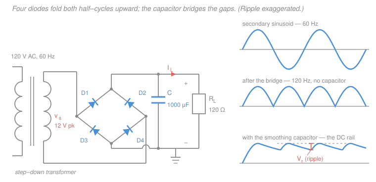

# Electronics & Semiconductors · Lesson 1.3: Rectifiers & power supplies

> ⏱ ~15 min · Module 1: Diodes & applications · Builds on: [1.2 The pn-junction diode: I–V & models](01-02-pn-junction-diode-models.md), [`circuits` 3.1](../../circuits/lessons/03-01-capacitors-and-inductors.md) · Unlocks: [1.4 Clippers, clampers & the Zener regulator](01-04-clippers-clampers-zener.md)

## Why this matters

Every chip you will ever design around needs a **DC rail** — a voltage that just sits there. The wall gives you the opposite: a sinusoid that crosses zero 120 times a second. Bridging that gap is the single most-built circuit in electronics, and it is built out of the one-way valve you met in [1.2](01-02-pn-junction-diode-models.md). The chain is

$$\text{transformer} \;\to\; \text{rectifier} \;\to\; \text{filter} \;\to\; \text{regulator},$$

and this lesson owns the middle two. The transformer just scales the sinusoid down; the regulator that cleans up what's left is [1.4](01-04-clippers-clampers-zener.md)'s job. By the end you can pick a topology, size a capacitor to a ripple spec, and predict the DC output within a few tenths of a volt.

## The idea

A diode conducts one way. Put one in series with a load and you delete the negative half of the sinusoid — that's a **half-wave rectifier**. The output is now always positive, but it's a lumpy train of humps with big holes in it, not a rail.

Two fixes, applied in order.

**Fix 1: stop throwing half the energy away.** Arrange four diodes so that *both* polarities of the input get routed through the load in the *same* direction — negative half-cycles get flipped up rather than discarded. That's a **full-wave** rectifier. Twice the energy, and — the part that actually matters — twice as many humps per second.

**Fix 2: fill in the holes.** Hang a big capacitor across the load. Near each peak the diodes conduct and slam the capacitor up to the peak voltage; between peaks the diodes go reverse-biased and the capacitor coasts, feeding the load out of its own stored charge and sagging a little as it does. That sag is the **ripple**. The capacitor is a bucket with a leak: the peaks refill it, the load drains it, and the ripple is how far it drains before the next refill.

Now Fix 1 pays off. Twice as many refills per second means half the drain time between them, which means **half the ripple for the same capacitor**. That is the whole reason nobody builds half-wave supplies.

## The formal version

Let $V_p$ be the **peak secondary voltage** (volts), $f$ the line frequency (60 Hz), $R_L$ the load resistance (ohms), and $C$ the filter capacitance (farads). Use the constant-drop model from [1.2](01-02-pn-junction-diode-models.md): a conducting silicon diode is a 0.7 V battery.

**Half-wave.** One diode, conducting on positive half-cycles only:

$$V_{\text{peak}} = V_p - 0.7, \qquad V_{\text{avg}} = \frac{V_p}{\pi} \approx 0.318\,V_p \ \ (\text{ideal diode}),$$

with output humps at the **line frequency**, $f_r = f = 60$ Hz. *In words: you get one hump per input cycle, worth about a third of the peak on average, and the other half-cycle is simply discarded.*

**Full-wave, center-tapped.** Two diodes and a center-tapped secondary; each half-winding drives the load on alternate half-cycles, and only **one** diode sits in the conducting path:

$$V_{\text{peak}} = V_p - 0.7, \qquad V_{\text{avg}} = \frac{2V_p}{\pi} \approx 0.637\,V_p, \qquad f_r = 2f = 120\ \text{Hz},$$

where $V_p$ is the peak of *half* the secondary.

**Full-wave bridge.** Four diodes in a diamond. On either half-cycle, current goes through **two** diodes in series to reach the load — this is the detail people drop:

$$\boxed{V_{\text{peak}} = V_p - 1.4}, \qquad V_{\text{avg}} = \frac{2V_p}{\pi}, \qquad f_r = 2f = 120\ \text{Hz}.$$

*In words: the bridge costs you two diode drops instead of one, and buys you a plain secondary with no center tap.*

**Peak inverse voltage (PIV)** is the largest reverse voltage a non-conducting diode has to survive — the number you check on the datasheet before the part explodes.

- **Bridge:** $\text{PIV} \approx V_p$. When one pair conducts, the other pair's cathodes are pulled to the output rail and their anodes to just below the return, leaving about one peak across each.
- **Center-tapped:** $\text{PIV} \approx 2V_p$. The center tap is grounded, so the off diode's anode swings to $-V_p$ while its cathode is held at $+V_p$ (minus a drop) by the output — the *full winding* appears across it.
- **Half-wave with a filter capacitor:** also $\approx 2V_p$, for the same reason — the capacitor holds the cathode at $+V_p$ while the anode swings to $-V_p$.

That factor of two is why bridges dominate: cheap diodes with modest voltage ratings.

| | half-wave | center-tapped | bridge |
|---|---|---|---|
| diodes | 1 | 2 | 4 |
| drops in path | 1 | 1 | **2** |
| peak output | $V_p - 0.7$ | $V_p - 0.7$ | $V_p - 1.4$ |
| ripple freq $f_r$ | $60$ Hz | $120$ Hz | $120$ Hz |
| ideal average | $V_p/\pi$ | $2V_p/\pi$ | $2V_p/\pi$ |
| PIV | $2V_p$ (with $C$) | $2V_p$ | $V_p$ |
| transformer | plain, but DC in winding | needs center tap | plain, no tap |

### Sizing the capacitor

Between peaks the diodes are off and the load draws its current out of $C$. The defining relation for a capacitor ([`circuits` 3.1](../../circuits/lessons/03-01-capacitors-and-inductors.md)) is $i = C\,dv/dt$. Take the load current $I_L$ as roughly constant over the gap:

$$-I_L = C\frac{dv}{dt} \;\Longrightarrow\; \Delta v = -\frac{I_L}{C}\,\Delta t.$$

If the discharge lasts approximately one full ripple period $T_r = 1/f_r$, the peak-to-peak ripple is

$$\boxed{\;V_r \approx \frac{I_L T_r}{C} = \frac{I_L}{f_r C} = \frac{V_{dc}}{f_r R_L C}\;}$$

*In words: ripple is the charge the load steals in one gap, divided by the capacitance.* And since the rail ramps roughly linearly from $V_{\text{peak}}$ down to $V_{\text{peak}} - V_r$, its DC average is

$$V_{dc} \approx V_{\text{peak}} - \frac{V_r}{2}.$$

Two assumptions are baked in, and both come from the same place — **small ripple**:

1. $I_L$ is treated as constant, which is only true if the rail barely moves.
2. The discharge is given the *whole* period $T_r$, when in truth the diodes conduct for a brief spike near each peak and the coast is a bit shorter. That makes the estimate slightly **pessimistic** — a small safety margin, which is what you want in a design.

The exact discharge is the RC decay from [`circuits` 3.2](../../circuits/lessons/03-02-first-order-rc-rl-transients.md), $v(t) = V_{\text{peak}}e^{-t/R_LC}$, giving $V_r = V_{\text{peak}}\left(1 - e^{-T_r/R_LC}\right)$. The linear formula is just the first term of $e^{-x} \approx 1-x$. It stays within a few percent as long as $T_r \ll R_LC$; once the ripple exceeds roughly 20 percent of the rail, drop the approximation and use the exponential.

## Picture

## Worked examples

**Example 1 (half-wave, no filter — read off the three numbers).** A 20 V-peak, 60 Hz secondary drives one silicon diode into a 1 kΩ load.

Peak output: $20 - 0.7 = 19.3$ V. Peak load current: $19.3/1000 = 19.3$ mA. Ripple frequency: 60 Hz — one hump per input cycle. Average output, using $V_{\text{peak}}/\pi$: $19.3/\pi = 6.14$ V.

*Check.* The average must land between 0 and the peak, and closer to zero than to the peak because the output is zero half the time — $6.1$ V out of $19.3$ V is $0.318\times$, exactly $1/\pi$. Sanity confirmed.

**Example 2 (the design case — boss problem 1(a) from the [syllabus](../syllabus.md)).** A full-wave bridge is driven by a 12 V-peak, 60 Hz secondary, feeds a 1000 µF smoothing capacitor, and supplies a 120 Ω load. Find the peak DC output and the peak-to-peak ripple.

*Peak.* Two diodes conduct in series, so

$$V_{\text{peak}} = 12 - 2(0.7) = 12 - 1.4 = 10.6\ \text{V}.$$

*Load current.* Evaluate at the peak (we'll refine in a moment):

$$I_L \approx \frac{10.6\ \text{V}}{120\ \Omega} = 0.0883\ \text{A} = 88.3\ \text{mA}.$$

*Ripple frequency.* Full-wave from 60 Hz, so $f_r = 120$ Hz and $T_r = 1/120 = 8.33$ ms.

*Ripple.*

$$V_r \approx \frac{I_L}{f_r C} = \frac{0.0883}{120 \times 1000\times10^{-6}} = \frac{0.0883}{0.120} = 0.736\ \text{V peak-to-peak.}$$

*DC output.*

$$V_{dc} \approx V_{\text{peak}} - \frac{V_r}{2} = 10.6 - 0.368 = 10.23\ \text{V}.$$

*Checks.* Three of them.

1. **Is the small-ripple assumption safe?** $0.736 / 10.6 = 0.069$ — about 7 percent. Comfortably inside the linear regime.
2. **Exponential cross-check.** $R_LC = 120 \times 10^{-3} = 0.120$ s, so $T_r/R_LC = 0.00833/0.120 = 0.0694$ and $V_r = 10.6\,(1 - e^{-0.0694}) = 10.6 \times 0.0671 = 0.711$ V. The linear estimate overshoots by 3.5 percent — pessimistic, as advertised.
3. **Iterate the load current.** Using $V_{dc} = 10.23$ V instead of the peak gives $I_L = 85.3$ mA and $V_r = 0.711$ V — the same answer to three digits as check 2. The estimate is self-consistent.

*The price of small ripple.* Because the rail only sags 0.74 V, the diodes are forward-biased for just a sliver of each cycle near the peak. That **conduction angle** is $\Delta\theta \approx \sqrt{2V_r/V_p} = \sqrt{2(0.736)/10.6} = 0.373$ rad $= 21^\circ$, i.e. $\Delta t = 0.373/(2\pi \times 60) = 0.99$ ms out of the 8.33 ms gap. All the charge the load consumed in 8.33 ms — $Q = I_L T_r = 736\ \mu$C — has to be pushed back in during that 0.99 ms, so the *average* diode current during conduction is $736\,\mu\text{C}/0.99\,\text{ms} = 0.74$ A and the *peak* is roughly twice that, near 1.5 A. **Seventeen times the DC load current.** Rate the diodes for the spikes, not the average. Worse, at power-on the capacitor is empty and looks like a short circuit — the **inrush current** is limited only by winding and diode resistance and can hit tens of amps for the first cycle. Real supplies add a small series resistor or a thermistor for exactly this.

## Watch out

- **You might think the bridge costs one diode drop, like the center-tapped version.** It costs **two** — current always traverses two diodes in series to get from the secondary to the load and back. On a 5 V rail that 1.4 V matters enormously; it's why low-voltage supplies often use Schottky diodes (≈0.3 V) instead.
- **You might think doubling $C$ is always the fix for ripple.** $V_r \propto 1/C$, so halving the ripple doubles the capacitor — and doubles its size, cost, and inrush current, while the rail *still* moves whenever the load or the line voltage changes. Past a modest ripple spec the right answer is a **regulator** ([1.4](01-04-clippers-clampers-zener.md)), which holds the output fixed for pennies. Filter to "small enough for the regulator to swallow," then stop.
- **You might read $V_{\text{avg}} = 2V_p/\pi$ off the table and use it on a filtered supply.** That average describes the *unfiltered* humps. Add the capacitor and the output jumps to nearly $V_{\text{peak}}$ — for the bridge above, 10.2 V, not $2(12)/\pi = 7.6$ V. Filtered supplies sit near the **peak**, not the average.

## One-liner

> Rectify to get humps, capacitor-filter to bridge the gaps, and the sag between refills is $V_r \approx I_L/(f_r C)$ — which is why going full-wave, doubling $f_r$, is worth more than doubling the capacitor.

## Problems

**P1 (🟢)** A half-wave rectifier is driven by an 18 V-peak, 60 Hz secondary through one silicon diode (0.7 V drop) into a 470 Ω load. No filter capacitor. Find (a) the peak output voltage, (b) the peak load current, (c) the ripple frequency, and (d) the approximate DC average output.

**P2 (🟡)** A full-wave bridge runs off a 24 V-peak, 60 Hz secondary and must supply a load drawing a steady 250 mA with no more than 1.0 V peak-to-peak of ripple. (a) Find the minimum capacitance and pick the next standard value at or above it (available: 1000, 1500, 2200, 3300, 4700 µF). (b) With that capacitor, compute the actual ripple and the DC output, and confirm the small-ripple approximation is valid.

**P3 (🔴)** Rebuild P2's supply as a **half-wave** rectifier from the same 24 V-peak secondary, same 250 mA load, same 1.0 V ripple target. (a) What capacitance is now needed, and which standard value? (b) What PIV must the diode withstand? (c) In one sentence, why does the bridge win despite needing four diodes?

Solutions

**P1**

(a) One diode in the path: $V_{\text{peak}} = 18 - 0.7 = 17.3$ V.

(b) $I_{\text{peak}} = 17.3/470 = 0.0368$ A $= 36.8$ mA.

(c) Half-wave passes one hump per input cycle, so $f_r = 60$ Hz — the same as the line.

(d) $V_{\text{avg}} \approx V_{\text{peak}}/\pi = 17.3/3.1416 = 5.51$ V.

*Check.* $5.51/17.3 = 0.318 = 1/\pi$ ✓. (Strictly, the diode's 0.7 V also shortens the conduction interval slightly, so the true average is a hair below 5.51 V — irrelevant at this level of design, but worth knowing the formula is an estimate.)

**P2**

(a) Bridge, so two drops: $V_{\text{peak}} = 24 - 1.4 = 22.6$ V. Full-wave from 60 Hz gives $f_r = 120$ Hz. Solve the ripple formula for $C$:

$$C \ge \frac{I_L}{f_r V_r} = \frac{0.250}{120 \times 1.0} = 2.083\times10^{-3}\ \text{F} = 2083\ \mu\text{F}.$$

The next standard value at or above this is $C = 2200\ \mu$F.

(b) With 2200 µF:

$$V_r = \frac{0.250}{120 \times 2200\times10^{-6}} = \frac{0.250}{0.264} = 0.947\ \text{V p-p},$$

$$V_{dc} \approx 22.6 - \frac{0.947}{2} = 22.6 - 0.473 = 22.13\ \text{V}.$$

*Check.* $0.947 < 1.0$ V ✓, so the spec is met with margin. Ripple as a fraction of the rail: $0.947/22.6 = 0.042$, about 4 percent — well inside the small-ripple regime, so the linear formula is valid ✓. Effective load resistance is $22.13/0.250 = 88.5\ \Omega$, giving $R_LC = 0.195$ s and $T_r/R_LC = 0.0428$; the exponential form would give $22.6(1-e^{-0.0428}) = 0.947$ V — identical to three digits ✓.

**P3**

(a) Half-wave: one drop, so $V_{\text{peak}} = 24 - 0.7 = 23.3$ V, and $f_r = 60$ Hz. The load current is fixed at 250 mA, so

$$C \ge \frac{I_L}{f_r V_r} = \frac{0.250}{60 \times 1.0} = 4.167\times10^{-3}\ \text{F} = 4167\ \mu\text{F} \;\Longrightarrow\; C = 4700\ \mu\text{F}.$$

Exactly double the capacitance of P2, because $f_r$ halved. (With 4700 µF the actual ripple is $0.250/(60 \times 4.7\times10^{-3}) = 0.886$ V ✓.)

(b) With the capacitor holding the cathode near $+23.3$ V while the secondary swings the anode to $-24$ V, the diode sees

$$\text{PIV} = 23.3 + 24 = 47.3\ \text{V} \approx 2V_p.$$

Specify a part rated well above this — a 100 V or 400 V rectifier (e.g. the 1N4002/1N4004 class), never a 50 V part.

(c) The bridge doubles the ripple frequency, so it hits the same ripple spec with **half** the capacitance, and each of its diodes only sees $\text{PIV} \approx V_p$ instead of $2V_p$ — cheaper capacitor and cheaper diodes, for the price of one extra 0.7 V drop.

## Flashback

**From Lesson 1.1 (Semiconductors, carriers & doping):** A silicon wafer is doped with boron (an acceptor) at $N_A = 2\times10^{17}\ \text{cm}^{-3}$. At 300 K the intrinsic carrier concentration is $n_i = 1.5\times10^{10}\ \text{cm}^{-3}$. Find the equilibrium electron and hole concentrations, and the ratio of majority to minority carriers.

Solution

Boron is an acceptor, so the material is **p-type** and holes are the majority carrier. Full ionization at room temperature and $N_A \gg n_i$ give

$$p \approx N_A = 2\times10^{17}\ \text{cm}^{-3}.$$

The minority (electron) concentration comes from the mass-action law $np = n_i^2$:

$$n = \frac{n_i^2}{p} = \frac{(1.5\times10^{10})^2}{2\times10^{17}} = \frac{2.25\times10^{20}}{2\times10^{17}} = 1.125\times10^{3} = 1125\ \text{cm}^{-3}.$$

Ratio of majority to minority:

$$\frac{p}{n} = \frac{2\times10^{17}}{1125} = 1.8\times10^{14}.$$

*Check.* Multiply back: $np = (1125)(2\times10^{17}) = 2.25\times10^{20} = n_i^2$ ✓. And doping by a factor $N_A/n_i \approx 1.3\times10^7$ above intrinsic suppresses the minority carriers by the same factor — the ratio $p/n$ is that factor squared, $\approx 1.8\times10^{14}$ ✓. This lopsidedness is exactly what makes a junction rectify: the reverse current has almost no carriers to draw on.

## Connections

- **Backward:** the whole lesson runs on the constant-drop model from [1.2](01-02-pn-junction-diode-models.md) — one 0.7 V battery per conducting diode, and an open circuit when reverse-biased. The capacitor's $i = C\,dv/dt$ is [`circuits` 3.1](../../circuits/lessons/03-01-capacitors-and-inductors.md), and the exact discharge is the RC decay of [`circuits` 3.2](../../circuits/lessons/03-02-first-order-rc-rl-transients.md). The 60 Hz sinusoid itself is [`circuits` 4.3](../../circuits/lessons/04-03-ac-power-power-factor.md)'s subject matter.
- **Forward:** [1.4](01-04-clippers-clampers-zener.md) takes the roughly 10 V rail you just built and pins it to a fixed voltage with a Zener shunt regulator — completing boss problem 1. Every biasing network in Module 2 and every op-amp supply in Module 3 silently assumes a rail like this one exists.
- **Sideways:** the "brief refill pulses, long coast" pattern is the same one that governs switch-mode converters and charge pumps, and — in a different uniform — a sampled signal held between samples, which is the zero-order hold of [`signals-systems` 3.2](../../signals-systems/lessons/03-02-aliasing-and-reconstruction.md). Ripple is what a reconstruction filter has to remove there too.
