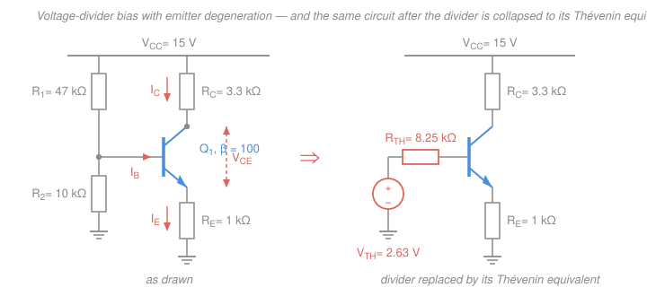
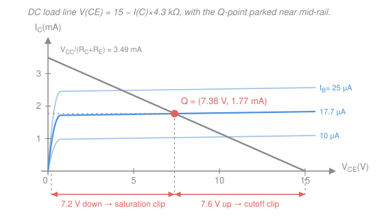

# Electronics & Semiconductors · Lesson 2.2: BJT DC biasing

> ⏱ ~15 min · Module 2: Transistors — BJT & MOSFET · Builds on: [2.1 The BJT: how it works](02-01-bjt-how-it-works.md), [1.2 The pn-junction diode: I–V & models](01-02-pn-junction-diode-models.md), [`circuits` 2.4 Thévenin & Norton](../../circuits/lessons/02-04-thevenin-norton-max-power.md) · Unlocks: [2.3 BJT small-signal amplifiers](02-03-bjt-small-signal-amplifiers.md), [2.5](02-05-mosfet-biasing-common-source.md)

## Why this matters

[2.1](02-01-bjt-how-it-works.md) told you a BJT amplifies *when it is in the active region*. It did not tell you how to get it there and keep it there. That's this lesson, and it is the difference between a circuit that works on your bench and a circuit that works on ten thousand benches.

Here is the uncomfortable fact you're about to design around: $\beta$, the current gain you leaned on so heavily in 2.1, is **not a design parameter**. A 2N3904 datasheet quotes $\beta$ anywhere from 100 to 300 at 10 mA — a 3:1 spread across parts from the same reel — and it climbs maybe 50 percent more as the part heats up. Any circuit whose operating point is proportional to $\beta$ is a circuit you cannot manufacture. The voltage-divider bias network in this lesson is the standard, hundred-year-old answer, and it works by a trick you'll meet again and again: **make the answer depend on a resistor ratio instead of on the device.**

## The idea

A signal swings *both ways* — up and down about zero. A transistor conducts only *one* way: $I_C \ge 0$, and it needs $V_{CE}$ above about 0.2 V to stay out of saturation. So before you can amplify anything, you must **park the transistor somewhere in the middle of its active region**, with DC alone, so there is room to move up and room to move down. That parking spot is the **Q-point** (quiescent point): the pair of DC values $(I_C, V_{CE})$ the transistor sits at with no signal applied.

Bias is a DC-only question. The signal rides on top of the Q-point as a small wiggle; [2.3](02-03-bjt-small-signal-amplifiers.md) handles the wiggle. Get the parking spot wrong and no amount of small-signal cleverness saves you: park too low and the bottom half of the output clips off; park too high and the top half clips off; park in saturation or cutoff and you get no output at all.

Now the design problem. The naive way to bias — dump a current into the base through one resistor — sets $I_C = \beta I_B$, which makes the parking spot *proportional to the least reliable number in the datasheet*. The fix is to stop controlling the base **current** and instead control the base **voltage** with a stiff divider, then put a resistor $R_E$ in the emitter that converts that voltage into a current. Ohm's law sets the current, not $\beta$. Even better, $R_E$ actively fights drift: if $I_C$ tries to creep up, $R_E$ raises the emitter voltage, which squeezes $V_{BE}$, which pushes $I_C$ back down. That's negative feedback, at the device level.

## The formal version

### The load line, again

Walk the collector–emitter loop of the circuit in the figure below with KVL, starting at the supply rail $V_{CC}$ (volts):

$$\boxed{\;V_{CE} = V_{CC} - I_C R_C - I_E R_E \approx V_{CC} - I_C(R_C + R_E)\;}$$

where $R_C$ is the collector resistor and $R_E$ the emitter resistor (both in ohms), and the approximation uses $I_E \approx I_C$ (they differ by the factor $\alpha = \beta/(\beta+1)$, which is 0.990 for $\beta = 100$).

*In words: every volt the collector current drops across the two resistors is a volt no longer available across the transistor.* This is the same **load line** idea as the diode in [1.2](01-02-pn-junction-diode-models.md) — a straight line in the $(V_{CE}, I_C)$ plane imposed by the *external resistors*, on which the device's own operating point must land. Its two endpoints:

| End | Condition | Coordinates |
|---|---|---|
| **Cutoff end** | $I_C = 0$ (transistor off, no drop) | $V_{CE} = V_{CC}$ |
| **Saturation end** | $V_{CE} = 0$ (transistor a short) | $I_C = V_{CC}/(R_C+R_E)$ |

**Headroom.** The output signal is $V_{CE}$ moving along this line. Put Q at the middle and the signal can swing roughly $V_{CC}/2$ in each direction before it hits an end; put Q near an end and the near side clips first. The two clipping modes look different and it's worth being able to name them from a scope trace:

- **Saturation clipping** — the signal drives $V_{CE}$ down to $\approx 0.2$ V and stops. The output's *bottom* is flattened (for the inverting common-emitter stage, that corresponds to the *top* of the input).
- **Cutoff clipping** — the signal drives $I_C$ to zero and $V_{CE}$ pins at $V_{CC}$. The output's *top* is flattened.

### Why the naive bias is unusable

**Fixed base-resistor bias:** one resistor $R_B$ from $V_{CC}$ to the base, no $R_E$. The base–emitter junction is a forward-biased diode, so it holds $V_{BE} \approx 0.7$ V, and

$$I_B = \frac{V_{CC} - V_{BE}}{R_B}, \qquad I_C = \beta I_B = \frac{\beta\,(V_{CC}-V_{BE})}{R_B}.$$

*In words: the resistor fixes the base current, and the transistor multiplies it by $\beta$ — so the Q-point is directly proportional to $\beta$.*

Put numbers on it. Take $V_{CC} = 15$ V, $R_C = 3.3\ \text{k}\Omega$, and pick $R_B = 620\ \text{k}\Omega$ so that a nominal $\beta = 100$ part lands dead-centre:

$$I_B = \frac{15 - 0.7}{620\ \text{k}\Omega} = \frac{14.3}{620\times10^3} = 23.06\ \mu\text{A}.$$

Now swap in parts from across the $\beta$ distribution. $I_B$ never changes — $R_B$ and $V_{BE}$ set it — so $I_C$ tracks $\beta$ exactly:

| $\beta$ | $I_C = \beta I_B$ | $V_{CE} = 15 - I_C(3.3\ \text{k}\Omega)$ | Verdict |
|---|---|---|---|
| 50 | 1.15 mA | 11.19 V | starved; only 3.8 V of down-swing |
| 100 | 2.31 mA | 7.39 V | the design you intended |
| 200 | 4.61 mA *demanded* | would be $-0.22$ V — impossible | **saturated** |

At $\beta = 200$ the transistor asks for 4.61 mA, but the resistor can only deliver $I_{C,\text{sat}} = (15 - 0.2)/3300 = 4.48$ mA. So it saturates: $V_{CE}$ collapses to $\approx 0.2$ V and the stage stops amplifying entirely. A 4:1 spread in $\beta$ — a spread you get **free with the reel** — took the design from starved to dead. That failure is what every remaining idea in this lesson exists to fix.

### Voltage-divider bias with emitter degeneration

Replace the single $R_B$ with a divider $R_1$ (rail to base) and $R_2$ (base to ground), and add $R_E$ from emitter to ground. Now use [Thévenin's theorem](../../circuits/lessons/02-04-thevenin-norton-max-power.md) on everything to the left of the base: the divider, seen from the base, is a source

$$V_{TH} = V_{CC}\,\frac{R_2}{R_1+R_2}, \qquad R_{TH} = R_1 \parallel R_2 = \frac{R_1R_2}{R_1+R_2}.$$

*In words: the divider is just a battery of $V_{TH}$ volts behind a resistance of $R_{TH}$ ohms — that's all the rest of the circuit can tell about it.*

Now KVL around the base–emitter loop, with $V_{BE} \approx 0.7$ V and $I_B$ the base current:

$$V_{TH} = I_B R_{TH} + V_{BE} + I_E R_E.$$

Use $I_B = I_E/(\beta+1)$ (from [2.1](02-01-bjt-how-it-works.md): $I_E = I_B + I_C = (\beta+1)I_B$) and solve:

$$V_{TH} - V_{BE} = I_E\!\left[\frac{R_{TH}}{\beta+1} + R_E\right] \;\Longrightarrow\; \boxed{\;I_E = \frac{V_{TH} - V_{BE}}{R_E + \dfrac{R_{TH}}{\beta+1}}\;}$$

*In words: the divider's open-circuit voltage, minus one diode drop, is pushed through the emitter resistor in series with the divider's resistance "seen from the emitter" — shrunk by $\beta+1$ because the emitter carries $\beta+1$ times more current than the base.*

**The design insight lives in that denominator.** If you choose components so that

$$\frac{R_{TH}}{\beta+1} \ll R_E,$$

the $\beta$ term is negligible and the whole expression collapses to

$$I_E \approx \frac{V_{TH} - V_{BE}}{R_E}.$$

**$\beta$ has vanished.** The Q-point is now set by a supply voltage, a resistor *ratio*, and one resistor — three things you buy to 1 percent tolerance — instead of by a device parameter that varies 3:1. That is the entire point of the topology.

**Rule of thumb.** Standard practice: choose $R_{TH} \le 0.1\,\beta_{\min} R_E$, which makes the $\beta$ term at most about a tenth of $R_E$. The equivalent statement in currents is *make the divider current about ten times $I_B$* — stiff enough that the base barely loads it.

**The trade-off is real.** A stiffer divider (smaller $R_1, R_2$) burns more standing current from the rail and, because $R_1 \parallel R_2$ appears in parallel with the amplifier's input, **lowers the input impedance** of the stage — a number [2.3](02-03-bjt-small-signal-amplifiers.md) will care about a great deal. So you make the divider exactly as stiff as the rule of thumb demands, and no stiffer.

### Why $R_E$ stabilizes: negative feedback

The formula shows $\beta$ dropping out, but the *mechanism* is worth having in your hands, because it's the same mechanism you'll meet in [4.1](04-01-negative-feedback.md) dressed as loop gain:

> $I_C$ rises (hotter part, higher-$\beta$ part) $\Rightarrow$ emitter voltage $V_E = I_E R_E$ rises $\Rightarrow$ but the base is *pinned* at $\approx V_{TH}$ by the stiff divider $\Rightarrow$ so $V_{BE} = V_B - V_E$ **falls** $\Rightarrow$ which turns the transistor down $\Rightarrow$ $I_C$ falls back.

The output is sampled, inverted, and fed back to the input to oppose the original change. That is **negative feedback**, and $R_E$ is the feedback element. This is why the technique is called **emitter degeneration** — you deliberately degrade the raw gain in exchange for stability. [4.1](04-01-negative-feedback.md) will show that this trade (gain for predictability) is the single most important idea in analog design; here it's the device-level special case.

**Thermal runaway, in two sentences.** At fixed collector current, $V_{BE}$ falls about 2 mV for every degree Celsius of temperature rise, so a transistor held at fixed base drive conducts *more* as it warms, which dissipates more power, which warms it further — a runaway loop that ends in a dead part. $R_E$ is the standard defense: the same feedback that cancels $\beta$ also swallows the $V_{BE}$ drift, since a 2 mV shift in $V_{BE}$ moves $I_E$ by only $2\ \text{mV}/R_E$.

## Picture

## Worked examples

### Example 1 — the full Q-point (syllabus boss problem 2a)

$V_{CC} = 15$ V, $R_1 = 47\ \text{k}\Omega$, $R_2 = 10\ \text{k}\Omega$, $R_C = 3.3\ \text{k}\Omega$, $R_E = 1\ \text{k}\Omega$, $\beta = 100$, $V_{BE} = 0.7$ V. Find $(I_C, V_{CE})$ and confirm the active region.

**Step 1 — Thévenize the divider.**

$$V_{TH} = 15 \times \frac{10}{47+10} = \frac{150}{57} = 2.632\ \text{V}, \qquad R_{TH} = \frac{47 \times 10}{57} = \frac{470}{57} = 8.246\ \text{k}\Omega.$$

**Step 2 — base loop for $I_E$.** With $\beta + 1 = 101$, the reflected term is $R_{TH}/101 = 8246/101 = 81.6\ \Omega$:

$$I_E = \frac{2.632 - 0.7}{1000 + 81.6} = \frac{1.932}{1081.6} = 1.786\ \text{mA}.$$

Note how little that 81.6 Ω matters next to the 1000 Ω of $R_E$ — that's the design rule working.

**Step 3 — collector current.** $\alpha = \beta/(\beta+1) = 100/101 = 0.990$, so

$$I_C = \alpha I_E = 0.990 \times 1.786 = 1.768\ \text{mA} \quad (\approx I_E \text{, if you prefer}).$$

**Step 4 — collector loop for $V_{CE}$.**

$$V_{CE} = 15 - (1.768\ \text{mA})(3.3\ \text{k}\Omega) - (1.786\ \text{mA})(1\ \text{k}\Omega) = 15 - 5.835 - 1.786 = \boxed{7.38\ \text{V}}$$

**Step 5 — check.** $V_{CE} = 7.38\ \text{V} \gg 0.2$ V, so the collector–base junction is reverse-biased and the transistor is comfortably **active** — not saturated, and $I_C > 0$ so not cut off. The load line runs from $V_{CE} = 15$ V down to $I_C = 15/4300 = 3.49$ mA; the midpoint of the $V_{CE}$ range is 7.5 V and we landed at 7.38 V, so Q is very nearly centred and the available swing is about 7.2 V either way.

*Two more checks worth the ten seconds.* Emitter voltage $V_E = I_E R_E = 1.786$ V, so base voltage $V_B = V_E + 0.7 = 2.486$ V — slightly below the unloaded $V_{TH} = 2.632$ V, exactly as it should be, the difference being $I_B R_{TH} = 17.7\ \mu\text{A} \times 8.246\ \text{k}\Omega = 0.146$ V. And the divider current is $15/57\ \text{k}\Omega = 0.263$ mA against $I_B = 1.786/101 = 17.7\ \mu$A — a ratio of 15:1, comfortably past the 10:1 rule.

### Example 2 — the payoff: double $\beta$ and watch nothing happen

Same circuit, now with a $\beta = 200$ part. Only the reflected term changes: $R_{TH}/(\beta+1) = 8246/201 = 41.0\ \Omega$.

$$I_E = \frac{1.932}{1000 + 41.0} = \frac{1.932}{1041.0} = 1.855\ \text{mA}, \qquad I_C = \frac{200}{201}\times 1.855 = 1.846\ \text{mA},$$

$$V_{CE} = 15 - (1.846)(3.3) - (1.855)(1) = 15 - 6.093 - 1.855 = 7.05\ \text{V}.$$

Doubling $\beta$ moved $I_C$ from 1.768 mA to 1.846 mA — a **4.4 percent** change — and moved $V_{CE}$ by a third of a volt. Run the same circuit at $\beta = 50$ and you get $I_C = 1.630$ mA, $V_{CE} = 7.96$ V; so across the full 4:1 $\beta$ range the collector current moves by 13 percent and the stage stays healthily active at every point.

Compare with the fixed-bias table above, where that same 4:1 range ran from starved to fully saturated. Same transistors, same rail, same $R_C$. The difference is one emitter resistor and a divider stiff enough to hold the base.

## Watch out

- **You might think $I_C = \beta I_B$ is "the" bias equation.** It's true, but it's useless for design, because you don't know $\beta$. In a well-designed divider bias you never compute $\beta I_B$ at all — you compute $I_E$ from the base *loop* and take $I_C \approx I_E$. $\beta$ enters only through the small correction term $R_{TH}/(\beta+1)$, and if that term matters much, your divider is too weak.
- **You might use the unloaded divider voltage as the base voltage.** $V_B = V_{TH}$ only if $I_B = 0$. The base does draw current, which is precisely why $R_{TH}$ appears in the formula; in Example 1 it pulled the base down by 146 mV. Using the Thévenin *pair* handles this automatically — using $V_{TH}$ alone does not.
- **You might read "$\beta$-independent" as "$\beta$ doesn't matter at all."** The *bias* is $\beta$-independent by design; the *small-signal* behaviour is not. In [2.3](02-03-bjt-small-signal-amplifiers.md), $r_\pi = \beta/g_m$ depends on $\beta$ directly and sets the stage's input resistance. Stable bias buys you a stable $g_m = I_C/V_T$, which is most of what you need — but it doesn't make $\beta$ disappear from the circuit.
- **You might make the divider as stiff as possible "to be safe."** Stiffer means more wasted supply current and a lower input impedance for the stage. The 10:1 rule is a genuine optimum, not a floor.

## One-liner

> Bias sets the parking spot; Thévenize the divider, let $R_E$ turn a base *voltage* into an emitter *current*, and keep $R_{TH}/(\beta+1) \ll R_E$ so the Q-point is decided by resistors you trust instead of a $\beta$ you don't.

## Problems

**P1 (🟢)** A common-emitter stage uses $V_{CC} = 12$ V, $R_1 = 68\ \text{k}\Omega$, $R_2 = 12\ \text{k}\Omega$, $R_C = 3.3\ \text{k}\Omega$, $R_E = 680\ \Omega$, $\beta = 150$, $V_{BE} = 0.7$ V. Find $V_{TH}$, $R_{TH}$, $I_C$ and $V_{CE}$, confirm the active region, and check the design against the $R_{TH} \le 0.1\beta R_E$ rule.

**P2 (🟡)** For the circuit of P1, the manufacturer guarantees only $50 \le \beta \le 300$. Compute $I_C$ at both extremes and state the percentage spread. Then say what that spread would have been with fixed base-resistor bias, and name the one component change that would tighten it further.

**P3 (🔴)** Design a voltage-divider bias from scratch. Target: $V_{CC} = 12$ V, $I_C \approx 1$ mA, $V_{CE} \approx 6$ V, $\beta = 100$, $V_{BE} = 0.7$ V. Use the usual starting heuristic $V_E \approx 0.1 V_{CC}$, obey the 10:1 divider rule, and pick from the standard E24 values 6.2, 10, 12, 20, 24, 33, 51, 62, 68, 82 (times any power of ten, in ohms). Then verify your design by computing the actual Q-point.

Solutions

**P1** Thévenin first:

$$V_{TH} = 12 \times \frac{12}{68+12} = \frac{144}{80} = 1.800\ \text{V}, \qquad R_{TH} = \frac{68\times12}{80} = \frac{816}{80} = 10.20\ \text{k}\Omega.$$

Reflected term: $R_{TH}/(\beta+1) = 10200/151 = 67.5\ \Omega$. Base loop:

$$I_E = \frac{1.800 - 0.700}{680 + 67.5} = \frac{1.100}{747.5} = 1.471\ \text{mA}, \qquad I_C = \frac{150}{151}\times1.471 = 1.462\ \text{mA}.$$

Collector loop:

$$V_{CE} = 12 - (1.462\ \text{mA})(3.3\ \text{k}\Omega) - (1.471\ \text{mA})(0.68\ \text{k}\Omega) = 12 - 4.824 - 1.001 = 6.18\ \text{V}.$$

**Active** — $V_{CE} = 6.18\ \text{V} \gg 0.2$ V. *Check:* the load line runs to $I_C = 12/(3300+680) = 3.02$ mA at $V_{CE}=0$, so the mid-rail point is $V_{CE} = 6$ V; landing at 6.18 V is nicely centred, with about 6 V of swing either way.

*Rule of thumb:* $0.1\beta R_E = 0.1 \times 150 \times 680 = 10.2\ \text{k}\Omega$, and $R_{TH} = 10.2\ \text{k}\Omega$ — exactly on the limit. Acceptable at $\beta = 150$, and P2 shows what happens when $\beta$ comes in lower than that.

**P2** Only the reflected term changes.

- $\beta = 50$: $R_{TH}/51 = 10200/51 = 200.0\ \Omega$, so $I_E = 1.100/880.0 = 1.250$ mA and $I_C = (50/51)(1.250) = \mathbf{1.226}$ mA.
- $\beta = 300$: $R_{TH}/301 = 10200/301 = 33.9\ \Omega$, so $I_E = 1.100/713.9 = 1.541$ mA and $I_C = (300/301)(1.541) = \mathbf{1.536}$ mA.

Spread: $(1.536 - 1.226)/1.226 = 25$ percent, for a **6:1** spread in $\beta$. With fixed base-resistor bias, $I_C = \beta I_B$ would have moved by the full **6:1 — 500 percent** — which for any sensibly chosen $R_B$ means saturation at the top of the range. *Check:* both Q-points are still active ($V_{CE} = 7.11$ V and 5.88 V respectively), so the stage works with any part in the box.

The one change: **shrink $R_{TH}$** — stiffen the divider, e.g. $R_1 = 22\ \text{k}\Omega$, $R_2 = 3.9\ \text{k}\Omega$ keeps $V_{TH}$ near 1.8 V while dropping $R_{TH}$ to 3.3 kΩ, comfortably inside $0.1\beta_{\min}R_E = 3.4\ \text{k}\Omega$. (Raising $R_E$ works too, but it eats headroom and, in 2.3, gain.) The cost is roughly 3× the standing divider current and a lower input impedance.

**P3** Work backwards through the four unknowns.

*Emitter.* Heuristic $V_E \approx 0.1V_{CC} = 1.2$ V. With $I_E \approx I_C \approx 1$ mA, $R_E = 1.2\ \text{V}/1\ \text{mA} = 1.2\ \text{k}\Omega$ — a standard value, take it.

*Divider.* Base sits at $V_{TH} \approx V_E + V_{BE} = 1.2 + 0.7 = 1.9$ V, i.e. a ratio $R_2/(R_1+R_2) = 1.9/12 = 0.158$. The rule caps $R_{TH} \le 0.1\beta R_E = 0.1 \times 100 \times 1200 = 12\ \text{k}\Omega$; aim for $R_{TH} \approx 10\ \text{k}\Omega$. Since $R_{TH} = R_1 \cdot \frac{R_2}{R_1+R_2}$, we get $R_1 = R_{TH}/0.158 = 63.2\ \text{k}\Omega \to \mathbf{62\ \text{k}\Omega}$, and then $R_2 = 0.158 R_1/(1-0.158) = 11.6\ \text{k}\Omega \to \mathbf{12\ \text{k}\Omega}$.

*Verify the base side.*

$$V_{TH} = 12\times\frac{12}{74} = 1.946\ \text{V}, \qquad R_{TH} = \frac{62\times12}{74} = 10.05\ \text{k}\Omega \le 12\ \text{k}\Omega.$$

The divider rule is satisfied. ✓

$$I_E = \frac{1.946-0.700}{1200 + 10054/101} = \frac{1.246}{1200+99.5} = \frac{1.246}{1299.5} = 0.959\ \text{mA}, \qquad I_C = \frac{100}{101}(0.959) = 0.949\ \text{mA}.$$

That's 5 percent under the 1 mA target — fine, and well inside resistor tolerance.

*Collector.* $V_E = I_E R_E = 0.959\ \text{mA} \times 1.2\ \text{k}\Omega = 1.150$ V, so for $V_{CE} = 6$ V the collector must sit at $V_C = 7.150$ V, leaving $12 - 7.150 = 4.850$ V across $R_C$:

$$R_C = \frac{4.850\ \text{V}}{0.949\ \text{mA}} = 5.11\ \text{k}\Omega \;\to\; \mathbf{5.1\ \text{k}\Omega}.$$

*Final check with the chosen values* ($R_1 = 62\ \text{k}\Omega$, $R_2 = 12\ \text{k}\Omega$, $R_C = 5.1\ \text{k}\Omega$, $R_E = 1.2\ \text{k}\Omega$):

$$V_{CE} = 12 - (0.949)(5.1) - (0.959)(1.2) = 12 - 4.841 - 1.150 = 6.01\ \text{V}.$$

Active, and dead-centre: the load line's saturation end is $I_C = 12/6300 = 1.90$ mA, so mid-rail is exactly $V_{CE} = 6$ V. Divider current $12/74\ \text{k}\Omega = 0.162$ mA versus $I_B = 0.959/101 = 9.5\ \mu$A — a 17:1 ratio, past the 10:1 rule. ✓

## Flashback

**From [Lesson 1.4 (Clippers, clampers & the Zener regulator)](01-04-clippers-clampers-zener.md):** A 9 V unregulated rail feeds a 4.7 V Zener shunt regulator (treat $r_z \approx 0$) through a series resistor $R_S = 180\ \Omega$. The load draws anywhere from 0 to 15 mA. Find the Zener current at full load and at no load, confirm the Zener stays in breakdown throughout, and state the worst-case power the Zener must dissipate.

Solution

With the Zener holding its node at 4.7 V, the current through $R_S$ is fixed regardless of the load:

$$I_S = \frac{9 - 4.7}{180} = \frac{4.3}{180} = 23.9\ \text{mA}.$$

KCL at the output node gives $I_Z = I_S - I_L$:

- **Full load** ($I_L = 15$ mA): $I_Z = 23.9 - 15 = 8.9\ \text{mA} > 0$, so the Zener is still in breakdown and still regulating. ✓
- **No load** ($I_L = 0$): the Zener takes the whole thing, $I_Z = 23.9\ \text{mA}$.

Worst-case dissipation is therefore at *no* load — the counterintuitive part of shunt regulation:

$$P_Z = V_Z I_{Z,\max} = 4.7 \times 23.9\ \text{mA} = 112\ \text{mW},$$

so a 250 mW part is adequate with margin. *Check:* the standard minimum-current criterion $I_Z \ge 5$ mA at full load requires $I_S \ge 20$ mA, i.e. $R_S \le 4.3/0.020 = 215\ \Omega$; our 180 Ω satisfies it. ✓

## Connections

- **Backward:** the load line is [1.2](01-02-pn-junction-diode-models.md)'s diode construction moved to the collector circuit — external resistors draw a line, the device picks a point on it. The relations $I_E = (\beta+1)I_B$ and $\alpha = \beta/(\beta+1)$, and the active-region test $V_{CE} > V_{CE,\text{sat}}$, are straight from [2.1](02-01-bjt-how-it-works.md). The Thévenin collapse of the divider is [`circuits` 2.4](../../circuits/lessons/02-04-thevenin-norton-max-power.md) doing exactly the job it was built for.
- **Forward:** [2.3](02-03-bjt-small-signal-amplifiers.md) takes the Q-point computed here and turns it into small-signal parameters — $g_m = I_C/V_T$ with $V_T \approx 25$ mV at room temperature, and $r_\pi = \beta/g_m$ — then finds the gain. Boss problem 2(b) and 2(c) continue exactly this circuit. [2.5](02-05-mosfet-biasing-common-source.md) repeats the whole exercise for a MOSFET, where the unreliable parameter is $V_t$ rather than $\beta$ and source degeneration plays the role of $R_E$.
- **Sideways:** the $R_E$ mechanism is negative feedback, formalized in [4.1](04-01-negative-feedback.md) and, as general control theory, in [`control-systems` 1.1](../../control-systems/lessons/01-01-feedback-and-the-control-problem.md) — sample the output, compare, oppose the deviation. The same "trade raw gain for insensitivity to a badly-known parameter" bargain shows up as gain desensitivity in feedback amplifiers and as robustness in controller design.
