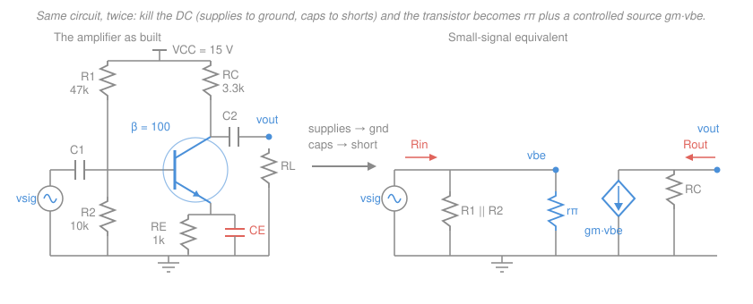

# Electronics & Semiconductors · Lesson 2.3: BJT small-signal amplifiers

> ⏱ ~15 min · Module 2: Transistors — BJT & MOSFET · Builds on: [2.2 BJT DC biasing](02-02-bjt-dc-biasing.md), [2.1 The BJT: how it works](02-01-bjt-how-it-works.md), [1.2 The pn-junction diode](01-02-pn-junction-diode-models.md), [`circuits` 2.3 Superposition](../../circuits/lessons/02-03-superposition-source-transformation.md) · Unlocks: [2.5 MOSFET biasing & common source](02-05-mosfet-biasing-common-source.md), [4.1 Negative feedback](04-01-negative-feedback.md)

## Why this matters

[2.2](02-02-bjt-dc-biasing.md) parked the transistor at a Q-point. That was all setup — the transistor sat there burning power and doing nothing. **This** is the lesson where it earns its keep: a millivolt wiggle at the base comes out as a volt-sized wiggle at the collector, and you can predict the number in three lines of algebra.

The method matters more than the circuit. You take a hopelessly nonlinear device, freeze it at an operating point, and replace it with a *linear* two-port that ordinary [circuits](../../circuits/syllabus.md) analysis eats for breakfast. Every amplifier you will ever analyze — the MOSFET stage in [2.5](02-05-mosfet-biasing-common-source.md), the op-amp's guts in [3.1](03-01-ideal-op-amp-inverting-noninverting.md), the frequency response in [4.2](04-02-frequency-response-gain-bandwidth.md) — sits on top of this move.

## The idea

The transistor's collector current is exponential in $V_{BE}$: brutally nonlinear. But look closely at *any* point on that curve and it's a straight line — the tangent. So if the signal is small enough to stay on the tangent, the circuit behaves **linearly**, and linear circuits obey superposition ([`circuits` 2.3](../../circuits/lessons/02-03-superposition-source-transformation.md)).

That licenses the whole method: **solve the DC problem and the signal problem separately, then add.** The DC problem you already did in 2.2 — it fixes $I_C$, which fixes the slope of the tangent. The signal problem is then a plain linear circuit built out of that slope.

Two rules fall straight out, and they are what make this mechanical:

1. **DC supplies become ground.** The $V_{CC}$ rail is a *fixed* voltage — it has no signal component. From the signal's point of view, a node held at a constant voltage is indistinguishable from a node held at zero. So $V_{CC}$ is a signal ground.
2. **Coupling and bypass capacitors become shorts.** They were chosen large enough that at signal frequencies $|Z_C| = 1/(\omega C)$ is negligible ([`circuits` 4.2](../../circuits/lessons/04-02-impedance-phasor-analysis.md)). At DC they're open circuits (which is why they don't disturb the bias); in the midband they're wires.

This is the third time this course has pulled the same trick. The diode's $r_d = V_T/I_D$ in [1.2](01-02-pn-junction-diode-models.md) was the tangent to the diode's exponential; the Zener's $r_z$ in [1.4](01-04-clippers-clampers-zener.md) was the tangent to its breakdown knee; now the transistor gets the same treatment. **Linearize about an operating point** is not a trick, it's *the* method of analog electronics.

**Notation reminder.** Uppercase-with-uppercase-subscript means DC bias ($I_C$, $V_{BE}$). Lowercase-with-lowercase-subscript means the small signal riding on it ($i_c$, $v_{be}$). The total is the sum: $i_C = I_C + i_c$.

## The formal version

### Where $g_m$ comes from

Start from the device law of [2.1](02-01-bjt-how-it-works.md), $I_C = I_S e^{V_{BE}/V_T}$, where $I_S$ is the saturation current (A, device-specific) and $V_T = kT/q \approx 25\ \text{mV}$ at room temperature is the thermal voltage. Perturb $V_{BE}$ by a small $v_{be}$ and take the tangent slope:

$$g_m \equiv \left.\frac{\partial i_C}{\partial v_{BE}}\right|_{Q} = \frac{I_S e^{V_{BE}/V_T}}{V_T} = \boxed{\frac{I_C}{V_T}}$$

*In words: the transconductance $g_m$ (units A/V, or siemens) says how many amps of collector current you get per volt of base–emitter wiggle.* So $i_c = g_m v_{be}$.

Sanity check the number: at $I_C = 1\ \text{mA}$, $g_m = 1\ \text{mA}/25\ \text{mV} = 0.04\ \text{A/V} = 40\ \text{mA/V}$. Memorize that anchor — $g_m$ scales linearly from it.

Now stare at $g_m = I_C/V_T$ for a second, because it is remarkable: **$g_m$ depends only on the bias current.** Not on $\beta$, not on the die area, not on which part number you bought. Two transistors from different decades biased at 1 mA have the same transconductance. That is why bias-current-setting is the central design act in analog circuits.

### The rest of the hybrid-$\pi$ model

**Input resistance at the base, $r_\pi$.** The base current is $\beta$ times smaller than the collector current, so a wiggle $v_{be}$ produces $i_b = i_c/\beta = g_m v_{be}/\beta$. The resistance the base terminal presents is therefore

$$r_\pi = \frac{v_{be}}{i_b} = \frac{\beta}{g_m} = \frac{\beta V_T}{I_C}.$$

*In words: looking into the base you see an ordinary resistor, whose value is $\beta$ times bigger than $1/g_m$ because the base draws $\beta$ times less current than the collector.* At $I_C = 1$ mA and $\beta = 100$: $r_\pi = 100/0.04 = 2.5\ \text{k}\Omega$.

**Output resistance, $r_o$.** In a perfect transistor $I_C$ is flat versus $V_{CE}$. The Early effect from [2.1](02-01-bjt-how-it-works.md) gives the curves a slight upward tilt, and the tangent slope of *that* is a resistance from collector to emitter:

$$r_o = \frac{V_A}{I_C},$$

with $V_A$ the Early voltage (typically 50–150 V). At $V_A = 100$ V and $I_C = 1$ mA, $r_o = 100\ \text{k}\Omega$. **When to neglect it:** $r_o$ sits in parallel with the collector load, so it matters only when it is comparable to that load. With $R_C$ of a few kilohms it shaves a few percent off the gain — ignore it for hand analysis. In an integrated circuit where the load is a current source of hundreds of kilohms, $r_o$ *is* the load and you cannot ignore it.

Put together, the **hybrid-$\pi$ model** replaces the transistor with exactly three elements: $r_\pi$ from base to emitter, a dependent current source $g_m v_{be}$ from collector to emitter, and $r_o$ across that same source.

### The common-emitter gain

Ground the emitter (via a bypass capacitor), drive the base, take the output at the collector. Signal current $i_c = g_m v_{be}$ flows *down* into the collector node, and it has to come from somewhere — it is pulled through the parallel combination of $R_C$ and any load $R_L$. Hence

$$v_{out} = -\,i_c\,(R_C \parallel R_L) = -\,g_m v_{be}\,(R_C \parallel R_L),$$

and since $v_{be}$ *is* the input voltage at the base (the emitter is at signal ground):

$$\boxed{A_v = \frac{v_{out}}{v_{be}} = -g_m\,(R_C \parallel R_L) = -\frac{I_C\,(R_C\parallel R_L)}{V_T}}$$

*In words: the gain is the transconductance times the resistance the output current has to push through, and it inverts.*

Two features deserve a sentence each.

**The minus sign** is 180° of phase inversion, and it is not a bookkeeping artifact. Push the base *up* and the transistor sinks *more* current from the collector node, dragging the collector *down* toward ground. Up in, down out.

**$\beta$ is absent.** The gain is set by bias current and load resistance — two things you choose — not by the transistor's least reproducible parameter. $\beta$ varies 3-to-1 between parts from the same bin; the gain of a well-designed CE stage does not.

Rewrite the second form with $R_L$ absent and you get a beautiful design rule:

$$|A_v| = \frac{I_C R_C}{V_T} = \frac{V_{R_C}}{25\ \text{mV}}$$

*In words: the open-circuit gain of a common-emitter stage is just the DC voltage dropped across $R_C$, divided by 25 mV.* Drop 5 V across $R_C$ and you get a gain of 200 — no matter how you split that 5 V between current and resistance. It is a superb sanity check, and it is a **hard ceiling**: from a 15 V rail you cannot drop more than 15 V, so one stage cannot exceed a gain of about 600, and after leaving headroom for bias and output swing, 200–300 is the practical limit.

### Input and output resistance

$$R_\text{in} = R_1 \parallel R_2 \parallel r_\pi, \qquad R_\text{out} = R_C \parallel r_o \approx R_C.$$

*In words: the signal source sees the bias divider and the base resistance all in parallel; the next stage sees the collector resistor.*

Note the cost buried in $R_\text{in}$: the **stiff** divider from [2.2](02-02-bjt-dc-biasing.md) — the one you made low-impedance so $\beta$ couldn't move the Q-point — is now a low-impedance shunt across your input. Bias stability and input impedance pull in opposite directions. That is a genuine design tension, not a mistake.

These numbers matter because stages get **cascaded**. Stage 1's output is a Thévenin source of resistance $R_\text{out}$ ([`circuits` 2.4](../../circuits/lessons/02-04-thevenin-norton-max-power.md)) driving stage 2's $R_\text{in}$, so the signal handed across is divided by $R_\text{in}/(R_\text{in}+R_\text{out})$. Two stages of gain $-100$ do **not** give $10{,}000$ if the interstage divider eats half the signal — they give $5{,}000$. Chain three sloppy stages and you have thrown away a factor of 8.

### Emitter degeneration: the trade at the heart of the lesson

Now leave a resistance $R_E$ in the emitter *unbypassed*, so it appears in the signal circuit too. Redo the derivation. Let $v_b$ be the base signal voltage and $v_e$ the emitter's. The emitter current is $i_e = i_b + i_c \approx i_c = g_m v_{be}$ (good to within $1/\beta$), so $v_e = g_m v_{be} R_E$ and

$$v_b = v_{be} + v_e = v_{be}(1 + g_m R_E).$$

The output is unchanged, $v_{out} = -g_m v_{be}(R_C\parallel R_L)$, so dividing:

$$\boxed{A_v = \frac{-g_m (R_C\parallel R_L)}{1 + g_m R_E} \;\xrightarrow[\;g_m R_E \gg 1\;]{}\; -\frac{R_C \parallel R_L}{R_E}}$$

*In words: the emitter resistor eats a fraction $1/(1+g_mR_E)$ of your gain, and once it dominates, the gain collapses to a ratio of two resistors.*

Read that limit again. $g_m$ is gone. $I_C$ is gone. $V_T$ — the temperature-dependent one — is gone. The gain is $R_C/R_E$, set by two components you can buy to 1 percent and that drift together. You have traded raw gain for:

- **Predictability.** Gain no longer moves with bias current, temperature, or which transistor you soldered in.
- **Linearity.** The nonlinearity lived in $g_m$; once the gain barely depends on $g_m$, it barely depends on the signal swing either — less distortion.
- **Input impedance.** Looking into the base you now see $r_\pi + (\beta+1)R_E \approx \beta R_E$, which is far larger than $r_\pi$. The emitter resistor is "seen" $\beta$ times bigger from the base, because the base supplies only $1/\beta$ of the current flowing through it.

This is **negative feedback**, in its most naked form: a piece of the output current is converted to a voltage and subtracted from the input. And this exact bargain — give up loop gain, buy back stability, linearity, and impedance control — is the op-amp's entire business model. [4.1](04-01-negative-feedback.md) gives it a name and a formula ($A_\text{closed} \approx A/(1+A\beta_f)$, with $\beta_f$ the feedback factor — *not* the BJT's $\beta$); here it is one resistor.

## Picture

## Worked examples

These are parts (b) and (c) of **Boss problem 2** from the [syllabus](../syllabus.md). The circuit is the one drawn above: $V_{CC} = 15$ V, $R_1 = 47\ \text{k}\Omega$, $R_2 = 10\ \text{k}\Omega$, $R_C = 3.3\ \text{k}\Omega$, $R_E = 1\ \text{k}\Omega$, $\beta = 100$, $V_{BE} = 0.7$ V. Part (a), done in [2.2](02-02-bjt-dc-biasing.md), gave the Q-point

$$I_C = 1.768\ \text{mA}, \qquad V_{CE} = 7.38\ \text{V} \quad (\text{active — good}).$$

**Example 1 (fully bypassed emitter).** Every parameter follows from $I_C$:

$$g_m = \frac{I_C}{V_T} = \frac{1.768\ \text{mA}}{25\ \text{mV}} = 70.7\ \text{mA/V}, \qquad r_\pi = \frac{\beta}{g_m} = \frac{100}{70.7\ \text{mA/V}} = 1.414\ \text{k}\Omega.$$

With $C_E$ shorting the whole emitter resistor to ground and **no external load specified** (so $R_C\parallel R_L = R_C$):

$$A_v = -g_m R_C = -(70.7\times10^{-3})(3300) = -233.$$

*Check.* The design rule: the DC drop across $R_C$ is $I_C R_C = 1.768\ \text{mA}\times3.3\ \text{k}\Omega = 5.83$ V, and $5.83\ \text{V}/25\ \text{mV} = 233$. Same number, no transistor parameters used. ✓

Impedances. The Thévenin resistance of the divider is $R_1\parallel R_2 = 47\parallel10 = 8.25\ \text{k}\Omega$, so

$$R_\text{in} = 8.25\ \text{k}\Omega \parallel 1.414\ \text{k}\Omega = \frac{8.25\times1.414}{8.25+1.414} = 1.21\ \text{k}\Omega, \qquad R_\text{out} \approx R_C = 3.3\ \text{k}\Omega.$$

Uncomfortable, and worth noticing: this amplifier has a *lower* input resistance than output resistance. Feed it from anything but a stiff source and you lose signal at the door.

**Example 2 (100 Ω left unbypassed).** Split $R_E$ into 100 Ω in series with 900 Ω, and bypass only the 900 Ω. The DC bias is untouched (the total emitter resistance is still 1 kΩ), so $g_m$ and $r_\pi$ are unchanged — but the signal now sees 100 Ω in the emitter:

$$g_m R_E = (70.7\times10^{-3})(100) = 7.07, \qquad A_v = \frac{-233}{1 + 7.07} = \frac{-233}{8.07} = -28.9.$$

The approximate form gives $-R_C/R_E = -3300/100 = -33$, about 14 percent optimistic — $g_mR_E = 7.07$ is bigger than 1 but not *hugely* bigger, so the "1" in the denominator still counts.

Input resistance climbs, exactly as promised:

$$R_\text{in} = 8.25\ \text{k}\Omega \parallel \big[r_\pi + (\beta{+}1)R_E\big] = 8.25\ \text{k}\Omega \parallel \big[1.414 + 101(0.1)\big]\text{k}\Omega = 8.25 \parallel 11.51 = 4.80\ \text{k}\Omega.$$

**What that 100 Ω resistor bought:** a gain now essentially set by the ratio $3300/100 = 33$ rather than by $I_C$ and $V_T$, so it holds steady against bias drift and temperature, distorts less, and presents four times the input resistance — at the price of a factor of 8 in gain.

## Watch out

- **You might think a higher-$\beta$ transistor gives more gain.** It does not. $A_v = -g_m(R_C\parallel R_L)$ contains no $\beta$. Higher $\beta$ raises $r_\pi$, which raises $R_\text{in}$ — a real benefit, but a different one. If a datasheet's $\beta$ spread worries you, worry about the Q-point ([2.2](02-02-bjt-dc-biasing.md)) and the input impedance, not the gain.
- **You might treat the bypass capacitor as a detail.** It is worth a factor of 70 here. Remove $C_E$ entirely and the full 1 kΩ degenerates the stage: $A_v = -233/(1+70.7) = -3.25$. Whether that capacitor is present is the single biggest number in the circuit.
- **You might apply $A_v$ to the source voltage.** $A_v$ is measured from the *base*. With a source resistance $R_S$, the gain from $v_{sig}$ to $v_{out}$ is $A_v \cdot R_\text{in}/(R_\text{in}+R_S)$ — and $R_\text{in}$ can be barely a kilohm.
- **"Small-signal" means small.** The tangent is only a good approximation while $v_{be}$ stays well under $V_T = 25$ mV — a few millivolts of peak base swing. Push harder and the exponential curvature reappears as distortion. (With $|A_v| = 233$, 5 mV in is already 1.17 V out, so this is rarely the binding constraint — clipping against the rails usually arrives first.)

## The other two configurations

You ground one terminal and take input and output at the other two; there are three choices, and the common emitter is only one of them.

- **Common collector (emitter follower)** — input at the base, output at the emitter, collector at signal ground. $A_v \approx +1$ (no voltage gain, no inversion), but $R_\text{in} \approx \beta(R_E\parallel R_L)$ is huge and $R_\text{out} \approx 1/g_m$ is tiny. It is a **buffer**: it converts a weak, high-impedance signal into the same voltage from a stiff source. Bolt one onto Example 1's output and the loading problem disappears.
- **Common base** — input at the emitter, output at the collector, base grounded. Voltage gain $g_m(R_C\parallel R_L)$ with **no** inversion, current gain of essentially 1, and a very low input resistance $\approx 1/g_m$. Its virtue is high-frequency behavior: no signal voltage swings across the base–collector capacitance, so the Miller effect of [4.2](04-02-frequency-response-gain-bandwidth.md) never gets started.

## One-liner

> Ground the supplies, short the caps, swap the transistor for $r_\pi$ and $g_m v_{be}$ — then the common-emitter gain is $-g_m(R_C\parallel R_L)$, which is just the DC drop across $R_C$ over 25 mV, and every unbypassed ohm in the emitter trades that gain away for predictability.

## Problems

**P1 (🟢)** A common-emitter stage is biased at $I_C = 2$ mA with $\beta = 150$. The bias divider is $R_1 = 33\ \text{k}\Omega$, $R_2 = 8.2\ \text{k}\Omega$; the collector resistor is $R_C = 2.2\ \text{k}\Omega$ and it drives a $10\ \text{k}\Omega$ load through a coupling capacitor. The emitter is fully bypassed. Find $g_m$, $r_\pi$, $A_v$, $R_\text{in}$, and $R_\text{out}$ (neglect $r_o$).

**P2 (🟡)** Take P1's amplifier and leave $220\ \Omega$ of the emitter resistance unbypassed. Recompute $A_v$ and $R_\text{in}$. Then suppose the stage is driven by a source with $R_S = 1\ \text{k}\Omega$: compute the *overall* gain $v_{out}/v_{sig}$ both with and without the degeneration, and say what fraction of the "lost" gain the higher input resistance wins back.

**P3 (🔴)** A single common-emitter stage runs from $V_{CC} = 12$ V. Good practice puts $V_E = 1.5$ V for bias stability, and you need $V_{CE} \ge 2$ V so the output can swing without saturating. (a) What is the largest open-circuit voltage gain magnitude this stage can possibly have, and why does it not depend on your choice of $I_C$? (b) Now include the Early effect with $V_A = 75$ V, choosing $I_C = 1$ mA (which fixes $R_C$). How much gain does $r_o$ cost you? (c) Show that the product $g_m r_o$ — the gain of a stage loaded by nothing but $r_o$ — is independent of bias current, and evaluate it.

Solutions

**P1** Transconductance first; everything else follows from it.

$$g_m = \frac{I_C}{V_T} = \frac{2\ \text{mA}}{25\ \text{mV}} = 80\ \text{mA/V}, \qquad r_\pi = \frac{\beta}{g_m} = \frac{150}{0.08} = 1875\ \Omega = 1.875\ \text{k}\Omega.$$

The signal-path load is the collector resistor in parallel with the load (the coupling capacitor is a short in the midband):

$$R_C\parallel R_L = \frac{2200\times10000}{2200+10000} = \frac{22{,}000{,}000}{12{,}200} = 1803\ \Omega.$$

$$A_v = -g_m(R_C\parallel R_L) = -(0.08)(1803) = -144.$$

Impedances:

$$R_1\parallel R_2 = \frac{33\times8.2}{33+8.2} = \frac{270.6}{41.2} = 6.568\ \text{k}\Omega,$$
$$R_\text{in} = 6.568 \parallel 1.875 = \frac{6.568\times1.875}{8.443} = 1.46\ \text{k}\Omega, \qquad R_\text{out} \approx R_C = 2.2\ \text{k}\Omega.$$

*Check.* Use the drop-over-25 mV rule with the *signal* load: $I_C(R_C\parallel R_L)/V_T = (2\ \text{mA})(1803\ \Omega)/25\ \text{mV} = 3.606\ \text{V}/25\ \text{mV} = 144$. ✓ Also note $R_\text{in} < r_\pi$, as it must be — parallel combinations only shrink. ✓

**P2** The DC bias is untouched, so $g_m = 80$ mA/V and $r_\pi = 1.875\ \text{k}\Omega$ still.

$$g_m R_E = (0.08)(220) = 17.6 \;\Longrightarrow\; A_v = \frac{-144}{1+17.6} = \frac{-144}{18.6} = -7.76.$$

(The approximation $-(R_C\parallel R_L)/R_E = -1803/220 = -8.20$ is within 6 percent, since $g_mR_E = 17.6 \gg 1$ here.)

$$R_\text{in} = 6.568\ \text{k}\Omega \parallel \big[1.875 + 151(0.22)\big]\text{k}\Omega = 6.568 \parallel 35.10 = \frac{6.568\times35.10}{41.67} = 5.53\ \text{k}\Omega.$$

Now the source divider $v_b/v_{sig} = R_\text{in}/(R_\text{in}+R_S)$ with $R_S = 1\ \text{k}\Omega$:

| | $A_v$ | $R_\text{in}$ | divider | overall $v_{out}/v_{sig}$ |
|---|---|---|---|---|
| bypassed | $-144$ | $1.46\ \text{k}\Omega$ | $1.46/2.46 = 0.593$ | $-85.6$ |
| degenerated | $-7.76$ | $5.53\ \text{k}\Omega$ | $5.53/6.53 = 0.847$ | $-6.57$ |

The bare gain fell by a factor of $144/7.76 = 18.6$, but the overall gain fell by only $85.6/6.57 = 13.0$. The higher input resistance wins back a factor of $18.6/13.0 = 1.43$ — about 43 percent more signal makes it past the source resistance.

*Check.* The degeneration factor $1+g_mR_E = 18.6$ should equal the bare-gain ratio exactly, and it does ($144/7.76 = 18.6$). ✓ And the divider must improve, since $R_\text{in}$ went up while $R_S$ stayed fixed. ✓

**P3**

**(a)** The open-circuit gain is $|A_v| = g_m R_C = I_C R_C/V_T = V_{R_C}/V_T$: only the *DC drop across $R_C$* matters. The supply must cover that drop plus the emitter voltage plus the collector–emitter voltage:

$$V_{R_C} = V_{CC} - V_E - V_{CE} \le 12 - 1.5 - 2 = 8.5\ \text{V}.$$

$$|A_v|_{\max} = \frac{8.5\ \text{V}}{25\ \text{mV}} = 340.$$

It does not depend on $I_C$ because $I_C$ appears only through the product $I_C R_C$ — halve the current and you must double $R_C$ to keep the same drop, and $g_mR_C$ is unchanged. The supply rail, not the transistor, is what limits a single stage.

**(b)** With $I_C = 1$ mA, the resistor that drops 8.5 V is $R_C = 8.5\ \text{V}/1\ \text{mA} = 8.5\ \text{k}\Omega$, and

$$g_m = \frac{1\ \text{mA}}{25\ \text{mV}} = 40\ \text{mA/V}, \qquad r_o = \frac{V_A}{I_C} = \frac{75\ \text{V}}{1\ \text{mA}} = 75\ \text{k}\Omega.$$

$$R_C \parallel r_o = \frac{8.5\times75}{8.5+75} = \frac{637.5}{83.5} = 7.63\ \text{k}\Omega, \qquad |A_v| = (0.04)(7635) = 305.$$

So the Early effect costs about 10 percent of the gain (340 down to 305) — small enough to neglect in a first pass, exactly as claimed, and the reason it is *not* negligible on-chip is that there $R_C$ is replaced by a current source whose resistance rivals $r_o$.

**(c)** Multiply the two expressions and watch $I_C$ cancel:

$$g_m r_o = \frac{I_C}{V_T}\cdot\frac{V_A}{I_C} = \frac{V_A}{V_T} = \frac{75\ \text{V}}{25\ \text{mV}} = 3000.$$

This is the transistor's **intrinsic gain** — the most a single device can deliver, set purely by the ratio of two voltages, one a property of the doping profile and one a property of temperature. No amount of bias current buys you past it.

*Check.* Part (b)'s answer must lie below this ceiling, and 305 is comfortably below 3000. ✓ Units: $(\text{A/V})(\text{V/A})$ is dimensionless, as a voltage gain should be. ✓

## Flashback

**From [Lesson 1.3](01-03-rectifiers-power-supplies.md) (Rectifiers & power supplies):** A full-wave bridge rectifier is fed by a transformer secondary of 10 V peak at 60 Hz. Use the constant-drop model with 0.7 V per diode and two diodes conducting in series at any instant. The filter capacitor is 470 µF and the load is 200 Ω. Find the peak DC output and the peak-to-peak ripple voltage. (Fresh variant — different secondary, capacitor, and load from the lesson.)

Solution

Two diodes drop 1.4 V total, so the capacitor charges to

$$V_p = 10 - 2(0.7) = 8.6\ \text{V}.$$

A full-wave bridge recharges the capacitor twice per input cycle, so the discharge interval is half a period:

$$T_\text{discharge} \approx \frac{1}{2f} = \frac{1}{120} = 8.33\ \text{ms}.$$

Over that interval the load pulls roughly constant current $I_L \approx V_p/R_L = 8.6/200 = 43\ \text{mA}$, and $i = C\,dv/dt$ gives

$$V_r = \frac{I_L\,T_\text{discharge}}{C} = \frac{(0.043)(8.33\times10^{-3})}{470\times10^{-6}} = \frac{3.583\times10^{-4}}{4.70\times10^{-4}} = 0.76\ \text{V peak-to-peak}.$$

The average DC output is therefore about $8.6 - 0.76/2 = 8.2$ V.

*Check.* The compact form $V_r = V_p/(2fR_LC)$ gives $8.6/(2\times60\times200\times470\times10^{-6}) = 8.6/11.28 = 0.76$ V. ✓ The ripple is under 10 percent of $V_p$, which validates the "constant discharge current" assumption used to get it. ✓ (A half-wave rectifier with the same parts would ripple twice as much, 1.5 V, since the capacitor would have to hold up for a full period.)

## Connections

- **Backward:** the Q-point from [2.2](02-02-bjt-dc-biasing.md) is the *only* input this lesson needs from the DC world — it sets $g_m$, and $g_m$ sets everything else. The linearization itself is the diode's $r_d$ from [1.2](01-02-pn-junction-diode-models.md) applied to a three-terminal device, and the separate-then-add licence is superposition from [`circuits` 2.3](../../circuits/lessons/02-03-superposition-source-transformation.md). The cascade-loading discussion is Thévenin from [`circuits` 2.4](../../circuits/lessons/02-04-thevenin-norton-max-power.md).
- **Forward:** [2.5](02-05-mosfet-biasing-common-source.md) rebuilds this entire model for the MOSFET — same picture, same $A_v = -g_m R_D$, but $g_m = 2I_D/V_{ov}$ instead of $I_C/V_T$, which changes the design economics completely. [4.2](04-02-frequency-response-gain-bandwidth.md) adds the capacitors the hybrid-$\pi$ model has so far omitted ($C_\pi$, $C_\mu$) and turns the flat midband gain into a bandwidth.
- **Sideways:** emitter degeneration is negative feedback with a single component. [4.1](04-01-negative-feedback.md) states the general law, and [`control-systems` 1.1](../../control-systems/lessons/01-01-feedback-and-the-control-problem.md) gives the same bargain in its most abstract form — a plant you don't trust, wrapped in a loop that makes the closed-loop behavior depend on the feedback path instead of the plant. Here the "plant you don't trust" is $g_m$, and the "feedback path" is a 100 Ω resistor.
